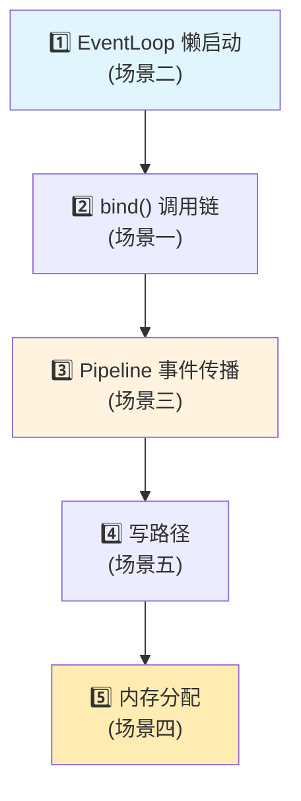

# 📖 Quick Start & Debug Guide — 验证运行与断点调试指引

> **定位**：本文档是整套 Netty 4.2.9 源码学习文档的**统一入口指引**，帮助读者快速运行验证程序、搭建调试环境、并通过断点调试**亲手验证**关键源码结论。
>
> 📌 **核心信念**：Debug 是最终裁判——所有文档结论都可以通过本文的方法亲自验证。

---

## 第 0 部分：运行环境

### 0.1 基础要求

| 项目 | 要求 | 说明 |
|------|------|------|
| **JDK** | 17+ | 推荐 OpenJDK 21（Netty 4.2 最低要求 JDK 11，验证代码使用了部分 17+ API） |
| **Maven** | 3.9+ | 项目自带 `mvnw`，可直接使用 `./mvnw` |
| **操作系统** | Linux | Native Transport（Epoll/io_uring）验证需要 Linux；NIO 相关验证跨平台 |
| **IDE** | IntelliJ IDEA 推荐 | 断点调试体验最佳 |

### 0.2 项目编译

```bash
# 进入项目根目录
cd netty-4.2.9

# 编译 example 模块（跳过测试，加速编译）
./mvnw -pl example -am clean compile -DskipTests -T 2C

# 如果需要编译 Native Transport（用于 Ch12/Ch13 验证）
./mvnw -pl transport-native-epoll -am clean install -DskipTests -Plinux-x86_64
./mvnw -pl transport-native-io_uring -am clean install -DskipTests -Plinux-x86_64
```

### 0.3 验证代码的位置

所有验证代码位于 `example/src/main/java/io/netty/md/` 目录下，按章节组织：

```
example/src/main/java/io/netty/md/
├── 02-启动流程-ServerBootstrap/
│   ├── Ch02_BootstrapDemo.java        ← 最小可运行 Echo Server
│   └── Ch02_BootstrapVerify.java      ← 反射验证启动流程关键字段
├── 03-线程模型-EventLoop/
│   ├── Ch03_EventLoopDemo.java        ← EventLoop 基础用法
│   └── Ch03_EventLoopVerify.java      ← 验证懒启动、taskQueue 类型、状态转换
├── 04-Channel与Unsafe/
│   ├── Ch04_ChannelDemo.java
│   └── Ch04_ChannelVerify.java
├── ...（其他章节类同）
└── 19-4.2新架构-IoHandler与弹性线程/
    ├── Ch19_IoHandlerDemo.java        ← IoHandler SPI 用法
    └── Ch19_SuspendResumeVerify.java  ← 🔥 Suspend/Resume 动态伸缩验证
```

---

## 第 1 部分：验证程序清单与运行方式

### 1.1 运行方式

**方式一：IDE 直接运行（推荐）**

1. 在 IntelliJ IDEA 中打开 Netty 项目
2. 导航到目标 Java 文件
3. 右键 → `Run 'xxx.main()'`

**方式二：Maven 命令行运行**

```bash
# 通用格式
./mvnw -pl example exec:java -Dexec.mainClass="完整类名"

# 示例：运行 Ch03 EventLoop 验证
./mvnw -pl example exec:java -Dexec.mainClass="io.netty.md.ch03.Ch03_EventLoopVerify"
```

**方式三：直接 java 命令（需要先编译）**

```bash
# 先编译
./mvnw -pl example -am compile -DskipTests

# 运行（classpath 包含所有依赖）
java -cp example/target/classes:$(./mvnw -pl example dependency:build-classpath -q -DincludeScope=runtime -Dmdep.outputFile=/dev/stdout) \
    io.netty.md.ch03.Ch03_EventLoopVerify
```

### 1.2 完整验证程序清单

下表列出了所有可运行的验证/演示程序，按推荐顺序排列：

| 序号 | 类名 | 完整包路径 | 对应章节 | 类型 | 说明 |
|------|------|-----------|---------|------|------|
| 1 | `Ch02_BootstrapDemo` | `io.netty.md.ch02` | Ch02 启动流程 | Demo | Echo Server 最小实例 |
| 2 | `Ch02_BootstrapVerify` | `io.netty.md.ch02` | Ch02 启动流程 | Verify | 反射验证 bind 流程字段 |
| 3 | `Ch03_EventLoopDemo` | `io.netty.md.ch03` | Ch03 线程模型 | Demo | EventLoop 基础用法 |
| 4 | `Ch03_EventLoopVerify` | `io.netty.md.ch03` | Ch03 线程模型 | Verify | 🔥 懒启动/状态转换/taskQueue 类型验证 |
| 5 | `Ch04_ChannelDemo` | `io.netty.md.ch04` | Ch04 Channel | Demo | Channel 注册与操作 |
| 6 | `Ch04_ChannelVerify` | `io.netty.md.ch04` | Ch04 Channel | Verify | Channel 内部结构验证 |
| 7 | `Ch05_PipelineDemo` | `io.netty.md.ch05` | Ch05 Pipeline | Demo | Pipeline 事件传播演示 |
| 8 | `Ch05_PipelineVerify` | `io.netty.md.ch05` | Ch05 Pipeline | Verify | Pipeline 双向链表结构验证 |
| 9 | `Ch06_ByteBufDemo` | `io.netty.md.ch06` | Ch06 ByteBuf | Demo | ByteBuf 基础操作 |
| 10 | `Ch06_ByteBufVerify` | `io.netty.md.ch06` | Ch06 ByteBuf | Verify | 🔥 SizeClasses 数值验证/内存池结构 |
| 11 | `Ch07_CodecDemo` | `io.netty.md.ch07` | Ch07 编解码 | Demo | 编解码器使用 |
| 12 | `Ch07_CodecVerify` | `io.netty.md.ch07` | Ch07 编解码 | Verify | 粘包/拆包场景验证 |
| 13 | `Ch08_BackpressureDemo` | `io.netty.md.ch08` | Ch09 写路径与背压 | Demo | 写路径背压机制演示 |
| 14 | `Ch08_BackpressureVerify` | `io.netty.md.ch08` | Ch09 写路径与背压 | Verify | ChannelOutboundBuffer 验证 |
| 15 | `Ch09_ConnectionLifecycleDemo` | `io.netty.md.ch09` | Ch10 连接生命周期 | Demo | 连接建立/断开流程 |
| 16 | `Ch09_ConnectionLifecycleVerify` | `io.netty.md.ch09` | Ch10 连接生命周期 | Verify | 故障处理路径验证 |
| 17 | `Ch10_HeartbeatDemo` | `io.netty.md.ch10` | Ch11 心跳与空闲检测 | Demo | IdleStateHandler 演示 |
| 18 | `Ch10_HeartbeatVerify` | `io.netty.md.ch10` | Ch11 心跳与空闲检测 | Verify | 空闲检测时间轮验证 |
| 19 | `Ch12_EpollDemo` | `io.netty.md.ch12` | Ch12 Epoll | Demo | Epoll Transport 使用（需Linux） |
| 20 | `Ch13_IoUringDemo` | `io.netty.md.ch13` | Ch13 io_uring | Demo | io_uring Transport 使用（需Linux） |
| 21 | `TransportBenchmark` | `io.netty.md.ch13` | Ch14 Transport 对比 | Benchmark | 🔥 三种 Transport 性能对比 |
| 22 | `Ch14_ZeroCopyDemo` | `io.netty.md.ch14` | Ch15 零拷贝 | Demo | 零拷贝机制演示 |
| 23 | `Ch15_FuturePromiseDemo` | `io.netty.md.ch15` | Ch16 Future/Promise | Demo | 异步模型使用 |
| 24 | `Ch15_FuturePromiseVerify` | `io.netty.md.ch15` | Ch16 Future/Promise | Verify | Promise 状态转换验证 |
| 25 | `Ch16_ConcurrentUtilsDemo` | `io.netty.md.ch16` | Ch17 并发工具箱 | Demo | HashedWheelTimer/FastThreadLocal |
| 26 | `Ch16_ConcurrentUtilsVerify` | `io.netty.md.ch16` | Ch17 并发工具箱 | Verify | 时间轮/Recycler 内部验证 |
| 27 | `Ch17_RefCountDemo` | `io.netty.md.ch17` | Ch18 引用计数 | Demo | 引用计数机制演示 |
| 28 | `Ch19_IoHandlerDemo` | `io.netty.md.ch19` | Ch19 IoHandler | Demo | IoHandler SPI + AutoScaling |
| 29 | `Ch19_SuspendResumeVerify` | `io.netty.md.ch19` | Ch19 Suspend/Resume | Verify | 🔥 动态伸缩状态转换验证 |
| 30 | `Ch20_AdaptiveAllocatorDemo` | `io.netty.md.ch20` | Ch20 自适应分配器 | Demo | AdaptivePoolingAllocator 演示 |
| 31 | `Ch23_LeakDetectionDemo` | `io.netty.md.ch23` | Ch24 内存泄漏排查 | Demo | 泄漏检测 4 级别演示 |

### 1.3 分类说明

- **Demo（演示程序）**：展示如何使用 Netty API，可直接运行观察效果
- **Verify（验证程序）**：通过反射/日志验证文档中的源码分析结论，输出与文档预期对比
- **Benchmark（性能测试）**：简易性能对比，非 JMH 级别但足够说明问题

### 1.4 快速验证脚本

如果想一键运行所有验证程序（跳过需要 Native 支持的 Ch12/Ch13）：

```bash
#!/bin/bash
# run-all-verify.sh — 运行所有验证程序

CLASSES=(
    "io.netty.md.ch02.Ch02_BootstrapVerify"
    "io.netty.md.ch03.Ch03_EventLoopVerify"
    "io.netty.md.ch04.Ch04_ChannelVerify"
    "io.netty.md.ch05.Ch05_PipelineVerify"
    "io.netty.md.ch06.Ch06_ByteBufVerify"
    "io.netty.md.ch07.Ch07_CodecVerify"
    "io.netty.md.ch08.Ch08_BackpressureVerify"
    "io.netty.md.ch09.Ch09_ConnectionLifecycleVerify"
    "io.netty.md.ch10.Ch10_HeartbeatVerify"
    "io.netty.md.ch15.Ch15_FuturePromiseVerify"
    "io.netty.md.ch16.Ch16_ConcurrentUtilsVerify"
    "io.netty.md.ch19.Ch19_SuspendResumeVerify"
)

echo "═══════════════════════════════════════════════"
echo "  Netty 4.2.9 源码学习 — 全量验证运行"
echo "═══════════════════════════════════════════════"

PASS=0
FAIL=0

for cls in "${CLASSES[@]}"; do
    echo ""
    echo "▸ 运行 $cls ..."
    echo "─────────────────────────────────────────────"
    if ./mvnw -pl example -q exec:java -Dexec.mainClass="$cls" 2>&1; then
        echo "  ✅ PASS"
        ((PASS++))
    else
        echo "  ❌ FAIL"
        ((FAIL++))
    fi
done

echo ""
echo "═══════════════════════════════════════════════"
echo "  结果：$PASS PASS / $FAIL FAIL / 共 ${#CLASSES[@]}"
echo "═══════════════════════════════════════════════"
```

---

## 第 2 部分：断点调试指引 🔍

> **为什么需要断点调试？**
>
> 文档中的源码分析告诉你"这行代码做了什么"，但只有亲手 Debug 才能：
> - 验证执行路径是否和文档一致
> - 观察变量的**真实运行时值**
> - 体会线程切换的**时序关系**
> - 理解异步回调的**调用栈形态**
>
> 以下 5 个核心场景覆盖了 Netty 最重要的执行路径。

### 2.1 场景一：bind() 完整调用链（Ch02 启动流程）

**目标**：追踪从 `ServerBootstrap.bind(port)` 到端口监听成功的完整路径。

**准备**：运行 `Ch02_BootstrapDemo.java`

**断点列表**：

| 序号 | 文件 | 类 | 方法 | 行号（约） | 观察什么 |
|------|------|-----|------|-----------|---------|
| ① | `AbstractBootstrap.java` | `AbstractBootstrap` | `doBind()` | ~386 | 入口，观察 `localAddress` 参数 |
| ② | `AbstractBootstrap.java` | `AbstractBootstrap` | `initAndRegister()` | ~330 | 观察 `channel` 对象的类型（`NioServerSocketChannel`） |
| ③ | `ServerBootstrap.java` | `ServerBootstrap` | `init()` | ~175 | 观察 options、attrs 如何设置到 Channel |
| ④ | `AbstractChannel.java` | `AbstractChannel$AbstractUnsafe` | `register0()` | ~480 | 🔥 观察 `eventLoop` 字段绑定、`doRegister()` 调用 |
| ⑤ | `AbstractChannel.java` | `AbstractChannel$AbstractUnsafe` | `bind()` | ~570 | 观察 `doBind()` 调用和 `pipeline.fireChannelActive()` |
| ⑥ | `NioServerSocketChannel.java` | `NioServerSocketChannel` | `doBind()` | ~120 | 最终的 `javaChannel().bind()` 调用 |

**调试路线**：

```
① doBind() 入口
  → ② initAndRegister()   ← 创建 Channel + 注册到 EventLoop
     → ③ init()            ← 配置 Channel（options/childHandler）
     → ④ register0()       ← 🔥 绑定 EventLoop + doRegister()（Selector注册）
  → ⑤ bind()              ← 绑定端口 + fireChannelActive()
     → ⑥ doBind()          ← JDK ServerSocketChannel.bind()
```

**关键观察点**：

1. 在 ④ 处观察 `Thread.currentThread().getName()`——你会发现从 ④ 开始线程已经切换到 EventLoop 线程
2. 在 ④ 处检查 `registered` 字段从 `false` → `true` 的变化
3. 在 ⑤ 处观察 `pipeline.fireChannelActive()` 触发后，`AbstractNioChannel.doBeginRead()` 会被调用，注册 `OP_ACCEPT`

---

### 2.2 场景二：EventLoop 懒启动（Ch03 线程模型）

**目标**：验证 EventLoop 线程的懒启动机制——线程在第一个任务提交时才创建。

**准备**：运行 `Ch03_EventLoopVerify.java`

**断点列表**：

| 序号 | 文件 | 类 | 方法 | 行号（约） | 观察什么 |
|------|------|-----|------|-----------|---------|
| ① | `SingleThreadEventExecutor.java` | `SingleThreadEventExecutor` | `execute()` | ~835 | 入口，观察 `inEventLoop()` 返回 `false` |
| ② | `SingleThreadEventExecutor.java` | `SingleThreadEventExecutor` | `startThread()` | ~1095 | 🔥 CAS `ST_NOT_STARTED(1) → ST_STARTED(4)` |
| ③ | `SingleThreadEventExecutor.java` | `SingleThreadEventExecutor` | `doStartThread()` | ~1118 | 观察 `executor.execute()` 创建新线程 |
| ④ | `SingleThreadEventExecutor.java` | `SingleThreadEventExecutor` | `run()` | ~1150 | EventLoop 主循环的 `for(;;)` 入口 |

**调试路线**：

```
① execute(task)                   ← 主线程调用
  → addTask(task)                 ← 任务入队 MpscQueue
  → ② startThread()              ← 🔥 state == ST_NOT_STARTED? 启动！
     → CAS(1 → 4)
     → ③ doStartThread()
        → executor.execute(...)   ← 提交到线程工厂
           → ④ run()             ← 🔥 新线程！EventLoop 主循环开始
              → for(;;) {
                   select/poll    ← IO 事件检测
                   processIO      ← 处理 IO
                   runAllTasks    ← 执行队列中的任务
                 }
```

**关键观察点**：

1. 在 ① 处打断点，创建 `EventLoopGroup` 后**不提交任务**，检查 `state` 字段 = `1`（`ST_NOT_STARTED`）
2. 提交第一个任务后，② 处的 CAS 操作将 `state` 从 `1` 改为 `4`
3. 在 ③ 处注意 `thread = Thread.currentThread()` 的赋值——此后 `inEventLoop()` 才能返回 `true`
4. 在 ④ 处观察 `for(;;)` 循环——这就是 EventLoop 的**心脏**

---

### 2.3 场景三：Pipeline 事件传播（Ch05 Pipeline）

**目标**：追踪 `channelRead` 事件如何沿 Inbound 方向在 Pipeline 中传播。

**准备**：运行 `Ch05_PipelineDemo.java`，并用 `telnet localhost <port>` 发送数据

**断点列表**：

| 序号 | 文件 | 类 | 方法 | 行号（约） | 观察什么 |
|------|------|-----|------|-----------|---------|
| ① | `AbstractNioByteChannel.java` | `NioByteUnsafe` | `read()` | ~125 | 🔥 从 Socket 读取数据，调用 `pipeline.fireChannelRead(byteBuf)` |
| ② | `DefaultChannelPipeline.java` | `DefaultChannelPipeline` | `fireChannelRead()` | ~905 | Pipeline 入口，从 `head` 开始传播 |
| ③ | `AbstractChannelHandlerContext.java` | `AbstractChannelHandlerContext` | `invokeChannelRead()` | ~390 | 🔥 `findContextInbound(MASK_CHANNEL_READ)` 找到下一个 Handler |
| ④ | 你的 Handler | YourHandler | `channelRead()` | 自定义 | 观察 `msg` 内容、`ctx` 是哪个 Context |

**调试路线**：

```
Selector 触发 OP_READ
  → ① NioByteUnsafe.read()         ← 读取字节到 ByteBuf
     → pipeline.fireChannelRead(buf)
        → ② DefaultChannelPipeline.fireChannelRead()
           → HeadContext.channelRead()
              → ③ ctx.fireChannelRead()  ← findContextInbound 寻找下一个
                 → ④ YourHandler.channelRead()  ← 🔥 你的业务逻辑
                    → ctx.fireChannelRead()   ← 继续传播（如果调用了）
                       → TailContext.channelRead()  ← 兜底释放 ByteBuf
```

**关键观察点**：

1. 在 ③ 处观察 `findContextInbound()` 的实现——它通过 `executionMask` 位运算快速跳过不关心此事件的 Handler
2. 注意 `HeadContext` → `你的Handler` → `TailContext` 的链表遍历方向
3. 如果你的 Handler 没有调用 `ctx.fireChannelRead(msg)`，事件**不会**传播到 TailContext，ByteBuf 可能泄漏！⚠️

---

### 2.4 场景四：内存分配路径（Ch06 ByteBuf）

**目标**：追踪 `PooledByteBufAllocator` 分配一块 1024 字节内存的完整路径。

**准备**：运行 `Ch06_ByteBufDemo.java`

**断点列表**：

| 序号 | 文件 | 类 | 方法 | 行号（约） | 观察什么 |
|------|------|-----|------|-----------|---------|
| ① | `PooledByteBufAllocator.java` | `PooledByteBufAllocator` | `newDirectBuffer()` | ~375 | 入口，选择哪个 `PoolArena` |
| ② | `PoolArena.java` | `PoolArena` | `allocate()` | ~172 | 🔥 根据 `sizeIdx` 决定走 Small/Normal 路径 |
| ③ | `SizeClasses.java` | `SizeClasses` | `size2SizeIdx()` | ~225 | 🔥 1024 → sizeIdx 计算过程 |
| ④ | `PoolArena.java` | `PoolArena` | `tcacheAllocateSmall()` | ~200 | ThreadLocal Cache 命中？ |
| ⑤ | `PoolChunk.java` | `PoolChunk` | `allocate()` | ~280 | Chunk 级别的内存分配算法 |

**调试路线**：

```
allocator.directBuffer(1024)
  → ① newDirectBuffer(1024, maxCapacity)
     → 选择 threadLocalCache 对应的 PoolArena
     → ② allocate(cache, buf, 1024)
        → ③ size2SizeIdx(1024)        ← 计算 sizeIdx
           → 1024 ≤ lookupMaxSize(4KB)？→ 查表！sizeIdx = 16
        → 1024 ≤ smallMaxSizeIdx？→ Yes，走 Small 路径
           → ④ tcacheAllocateSmall()  ← 先查 ThreadLocal Cache
              → 缓存命中？→ 直接返回！
              → 缓存未命中？→ ⑤ PoolChunk.allocate()  ← 从 Chunk 分配
```

**关键观察点**：

1. 在 ① 处观察 `threadCache.get()` 如何通过 `FastThreadLocal` 获取线程专属缓存
2. 在 ③ 处亲自验证 `size2SizeIdx(1024)` 返回 `16`——与 Ch06-02 文档中的 68 行映射表一致
3. 在 ④ 处观察 `PoolThreadCache` 的 `allocate()` 方法——首次分配缓存为空，会 fallthrough 到 ⑤
4. 重复分配+释放后再观察 ④——缓存命中，直接返回，不需要走 ⑤

---

### 2.5 场景五：write() + flush() 写路径（Ch09 写路径）

**目标**：追踪从 `ctx.writeAndFlush(msg)` 到数据写入 Socket 的完整路径。

**准备**：运行 `Ch08_BackpressureDemo.java`

**断点列表**：

| 序号 | 文件 | 类 | 方法 | 行号（约） | 观察什么 |
|------|------|-----|------|-----------|---------|
| ① | `AbstractChannelHandlerContext.java` | `AbstractChannelHandlerContext` | `write()` | ~630 | Outbound 传播起点，从当前 Handler 向 Head 方向查找 |
| ② | `DefaultChannelPipeline.java` | `HeadContext` | `write()` | ~1350 | 到达 HeadContext，调用 `unsafe.write()` |
| ③ | `AbstractChannel.java` | `AbstractUnsafe` | `write()` | ~788 | 🔥 消息入队 `ChannelOutboundBuffer` + 背压检测 |
| ④ | `AbstractChannelHandlerContext.java` | `AbstractChannelHandlerContext` | `flush()` | ~695 | flush 传播到 HeadContext |
| ⑤ | `AbstractChannel.java` | `AbstractUnsafe` | `flush0()` | ~850 | 🔥 调用 `doWrite()`，数据真正写入 Socket |
| ⑥ | `NioSocketChannel.java` | `NioSocketChannel` | `doWrite()` | ~345 | 🔥 自旋写循环 + `writeSpinCount` + `incompleteWrite` |

**调试路线**：

```
ctx.writeAndFlush(msg)
  → ① write(msg, promise)           ← Outbound 传播（右→左）
     → 经过 Outbound Handler 链
        → ② HeadContext.write()
           → ③ unsafe.write(msg, promise)  ← 🔥 入队 ChannelOutboundBuffer
              → buffer.addMessage(msg)      ← Entry 链表追加
              → totalPendingSize 增加       ← 背压水位检测！
  → ④ flush()
     → HeadContext.flush()
        → ⑤ unsafe.flush0()
           → ⑥ doWrite(outboundBuffer)
              → for(writeSpinCount) {      ← 自旋写
                   ch.write(nioBuffer)     ← JDK NIO 写
                   如果写完 → break
                   如果没写完 → 继续自旋或注册 OP_WRITE
                 }
```

**关键观察点**：

1. 在 ③ 处观察 `ChannelOutboundBuffer.addMessage()` 后的 `totalPendingSize` 值——当超过 `writeBufferHighWaterMark`（默认 64KB）时，Channel 变为不可写
2. 在 ⑥ 处观察 `writeSpinCount`（默认 16）——如果 16 次自旋仍未写完，会调用 `incompleteWrite(true)` 注册 `OP_WRITE`
3. 对比 `write()` 只入队不发送 vs `flush()` 真正发送的时序——这就是为什么必须 `writeAndFlush()` 或 `write()+flush()` 配对使用

---

## 第 3 部分：调试技巧

### 3.1 EventLoop 线程的断点控制

Netty 的断点调试有个常见问题：**断点可能阻塞 EventLoop 线程，导致心跳超时/连接断开**。

**解决方案**：

```
# IntelliJ IDEA 中：
# 右键断点 → Suspend Policy 改为 "Thread"（而非默认的 "All"）
# 这样只暂停命中断点的线程，其他 EventLoop 线程继续运行
```

### 3.2 条件断点

对于高频执行的方法（如 `runAllTasks()`），使用条件断点避免频繁中断：

```java
// 示例：只在分配 > 8192 字节时中断
// 条件表达式：reqCapacity > 8192

// 示例：只在特定 Channel 上中断
// 条件表达式：ctx.channel().remoteAddress().toString().contains("127.0.0.1:12345")
```

### 3.3 异步调用栈的阅读

Netty 大量使用异步回调，调用栈可能不直观。典型的 EventLoop 调用栈：

```
你的 Handler.channelRead()                          ← 你关心的
  AbstractChannelHandlerContext.invokeChannelRead()   ← Pipeline 传播
    AbstractChannelHandlerContext.invokeChannelRead()
      DefaultChannelPipeline$HeadContext.channelRead()
        DefaultChannelPipeline.fireChannelRead()
          NioByteUnsafe.read()                        ← IO 读取
            NioEventLoop.processSelectedKey()          ← 处理 SelectionKey
              NioEventLoop.processSelectedKeysOptimized()
                NioIoHandler.run()                     ← IoHandler 运行
                  SingleThreadEventExecutor.run()       ← EventLoop 主循环
                    SingleThreadEventExecutor$4.run()   ← 线程入口
                      Thread.run()
```

**规律**：从下往上读 = 执行顺序。最底部是线程入口，最顶部是你的业务代码。

### 3.4 关键日志开关

不方便打断点时，可以通过日志验证：

```java
// 开启 Netty 内部日志（在 main 方法最前面加）
InternalLoggerFactory.setDefaultFactory(Slf4JLoggerFactory.INSTANCE);

// 或者用 JDK 日志
System.setProperty("io.netty.leakDetection.level", "PARANOID");  // 最严格的泄漏检测
System.setProperty("io.netty.allocator.type", "pooled");          // 确认分配器类型
System.setProperty("io.netty.eventLoopThreads", "4");             // 控制线程数
```

---

## 第 4 部分：常见问题排查

### Q1：验证程序编译失败？

```bash
# 确保编译了所有依赖模块
./mvnw -pl example -am clean compile -DskipTests
```

### Q2：Ch12/Ch13 Native Transport 运行失败？

```bash
# Native 模块需要单独编译
./mvnw -pl transport-native-epoll -am clean install -DskipTests -Plinux-x86_64

# 确认 .so 文件存在
find . -name "libnetty_transport_native_epoll*.so"
```

### Q3：反射访问被拒绝（JDK 17+）？

```bash
# 添加 JVM 参数
java --add-opens java.base/java.lang=ALL-UNNAMED \
     --add-opens java.base/java.lang.reflect=ALL-UNNAMED \
     --add-opens java.base/sun.nio.ch=ALL-UNNAMED \
     -cp ... YourVerifyClass
```

### Q4：EventLoop 验证时 state 值不符合预期？

4.2 版本引入了 `ST_SUSPENDING(2)` 和 `ST_SUSPENDED(3)`，导致 `ST_STARTED` 从旧版的 `2` 变为 `4`。确认你的文档和验证代码引用的是 4.2.9 的正确值：

| 常量 | 4.1.x 值 | 4.2.9 值 |
|------|----------|----------|
| `ST_NOT_STARTED` | 1 | 1 |
| `ST_SUSPENDING` | — | 2（新增） |
| `ST_SUSPENDED` | — | 3（新增） |
| `ST_STARTED` | **2** | **4** |
| `ST_SHUTTING_DOWN` | 3 | 5 |
| `ST_SHUTDOWN` | 4 | 6 |
| `ST_TERMINATED` | 5 | 7 |

---

## 附录：推荐调试顺序

如果你是第一次 Debug Netty 源码，建议按以下顺序：



**理由**：先理解线程模型（场景二）→ 再看 Server 如何启动（场景一）→ 再跟踪数据如何进来（场景三）→ 再看数据如何出去（场景五）→ 最后深入内存管理细节（场景四）。这就是一个请求的**完整生命周期**。
