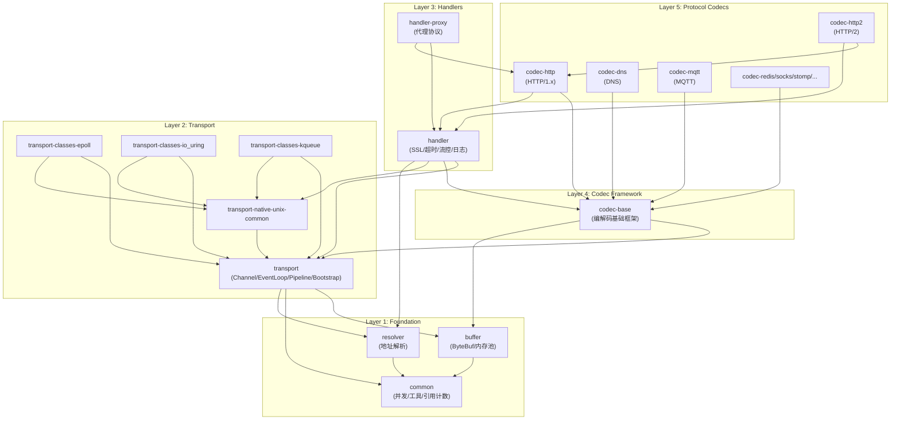
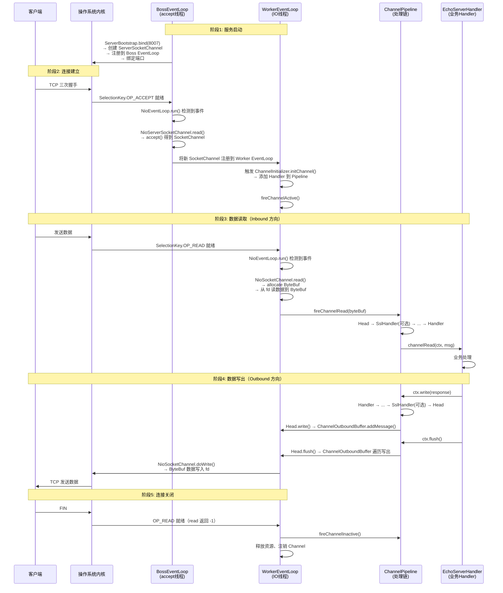

# Netty 4.2.9 全局地图与模块概览

> **阅读目标**：搞清楚 Netty 4.2.9 一共有哪些模块、每个模块解决什么问题、模块之间的依赖关系是怎样的，最终建立一张"全局脑图"。
>
> 遵循 Rule #3（分层阅读）：本篇是**第一层 — API 使用者视角**，只关心"每个模块是什么"，不深入实现细节。

---

## 一、Netty 是什么？它解决什么问题？

Netty 是一个**异步事件驱动**的网络应用框架，用于快速开发高性能的协议服务器和客户端。

核心要解决的问题：
1. **JDK NIO 太难用** — Selector 模型复杂、API 晦涩、BUG 多（如 epoll 空轮询）
2. **协议编解码重复造轮子** — HTTP、WebSocket、Protobuf 等协议的编解码需要大量重复工作
3. **并发模型难设计** — 线程安全、背压、连接管理等非功能性需求难以正确实现
4. **性能优化需要深入系统层** — 零拷贝、内存池、Native Transport 等需要专家级优化

Netty 的回答：**把网络 IO、线程模型、内存管理、协议编解码全部抽象好，你只关注业务逻辑。**

---

## 二、项目源码规模一览

| 模块 | Java 源文件数 | 定位 |
|------|-------------|------|
| **common** | 199 | 基础工具箱（并发、引用计数、时间轮等） |
| **buffer** | 94 | 内存管理（ByteBuf、内存池） |
| **transport** | 208 | **核心中的核心**（Channel、EventLoop、Pipeline、Bootstrap） |
| **codec-base** | 71 | 编解码基础框架 |
| **codec-http** | 260 | HTTP/1.x 协议编解码 |
| **codec-http2** | 129 | HTTP/2 协议编解码 |
| **handler** | 172 | 高级处理器（SSL、超时、流控、日志等） |
| **resolver** | 20 | 地址解析抽象 |
| **resolver-dns** | 61 | DNS 地址解析实现 |
| **transport-classes-epoll** | 38 | Linux Epoll 传输层 |
| **transport-classes-io_uring** | 46 | Linux io_uring 传输层 |
| **transport-native-unix-common** | 31 | Unix Native 公共抽象 |

> 💡 **核心洞察**：transport（208个文件）是最大的模块，它包含了 Netty 的"骨架"——Channel、EventLoop、Pipeline、Bootstrap 全在里面。buffer（94个）是"血液"——所有数据流转都靠 ByteBuf。这两个模块是整个 Netty 的根基。

---

## 三、模块分层架构图

Netty 的模块可以清晰地分为 **5 层**：

```
┌─────────────────────────────────────────────────────────────────┐
│                    Layer 5: Protocol Codecs                      │
│  codec-http │ codec-http2 │ codec-http3 │ codec-dns │ codec-mqtt│
│  codec-redis│ codec-socks │ codec-stomp │ codec-haproxy │ ...   │
├─────────────────────────────────────────────────────────────────┤
│                    Layer 4: Codec Framework                      │
│         codec-base (编解码基础框架: Encoder/Decoder/Codec)        │
├─────────────────────────────────────────────────────────────────┤
│                    Layer 3: High-level Handlers                  │
│  handler (SSL/TLS, 超时检测, 流控, 日志, IP过滤, 流量整形)         │
│  handler-proxy │ handler-ssl-ocsp                                │
├─────────────────────────────────────────────────────────────────┤
│                    Layer 2: Transport Core                       │
│  transport (Channel, EventLoop, Pipeline, Bootstrap)             │
│  ┌──────────┬──────────────┬───────────────┬──────────────────┐ │
│  │ NIO      │ Epoll        │ io_uring      │ KQueue           │ │
│  │(JDK跨平台)│(Linux原生)   │(Linux最新)     │(macOS原生)       │ │
│  └──────────┴──────────────┴───────────────┴──────────────────┘ │
├─────────────────────────────────────────────────────────────────┤
│              Layer 1: Foundation                                  │
│  common (并发工具, Future/Promise, 时间轮, Recycler, FastTL)      │
│  buffer (ByteBuf, 内存池, 零拷贝)                                 │
│  resolver (地址解析)                                              │
└─────────────────────────────────────────────────────────────────┘
```

### 各层职责说明

| 层级 | 模块 | 解决什么问题 |
|------|------|------------|
| **Layer 1: Foundation** | common | 提供并发原语（EventExecutor、Promise、Future）、引用计数、时间轮定时器、对象池(Recycler)、FastThreadLocal 等基础工具 |
| | buffer | 统一的内存管理——ByteBuf 替代 JDK ByteBuffer，支持池化/非池化、堆/直接内存、引用计数、零拷贝 |
| | resolver | 地址解析抽象（将域名解析为地址） |
| **Layer 2: Transport** | transport | Netty 的骨架——定义了 Channel（连接抽象）、EventLoop（线程模型）、Pipeline（处理链）、Bootstrap（启动器） |
| | transport-classes-epoll | Linux Epoll 的 Java 绑定，绕过 JDK NIO 直接调用系统调用 |
| | transport-classes-io_uring | Linux io_uring 的 Java 绑定，真正的异步 IO |
| | transport-native-unix-common | Unix 原生传输的公共抽象层 |
| **Layer 3: Handlers** | handler | 开箱即用的高级处理器：SslHandler、IdleStateHandler、FlowControlHandler 等 |
| **Layer 4: Codec Framework** | codec-base | 编解码框架骨架：ByteToMessageDecoder、MessageToByteEncoder、ReplayingDecoder 等 |
| **Layer 5: Protocol Codecs** | codec-http 等 | 各种协议的具体编解码实现 |

---

## 四、模块依赖关系图



### 依赖关系核心洞察 🔥

1. **common 是万物之基** — 所有模块最终都依赖 common，它提供并发原语和基础工具
2. **buffer 只依赖 common** — 内存管理是独立的，不依赖传输层（高内聚低耦合的典范）
3. **transport 依赖 buffer + common + resolver** — 传输层需要内存管理、并发工具和地址解析
4. **三种 Native Transport 结构相同** — epoll/io_uring/kqueue 都依赖 transport + unix-common，这就是 Netty 4.2 的 IoHandler 抽象带来的一致性
5. **handler 是个"胖模块"** — 它依赖 transport + codec-base + unix-common + resolver，是功能最丰富的模块

---

## 五、核心模块包结构详解

### 5.1 common 模块（199个文件）

```
io.netty.util
├── concurrent/          ← 并发框架核心
│   ├── EventExecutor         — 事件执行器（单线程执行器抽象）
│   ├── EventExecutorGroup    — 执行器组
│   ├── Future / Promise      — 异步结果模型
│   ├── SingleThreadEventExecutor — 单线程执行器实现（EventLoop的父类！）
│   ├── DefaultPromise        — Promise 核心实现
│   ├── FastThreadLocal       — 比 JDK ThreadLocal 更快的线程本地变量
│   ├── ScheduledFutureTask   — 定时任务
│   └── GlobalEventExecutor   — 全局单例执行器
├── internal/            ← 内部工具（对用户不可见）
├── HashedWheelTimer     — 时间轮定时器（心跳检测的基础）
├── Recycler             — 对象池（减少 GC）
├── ReferenceCounted     — 引用计数接口
├── ResourceLeakDetector — 内存泄漏检测器
└── AttributeMap         — 属性存储
```

> 🔥 **面试常考**：`SingleThreadEventExecutor` 是 `EventLoop` 的真正父类！理解了它就理解了 Netty 线程模型的一半。

### 5.2 buffer 模块（94个文件）

```
io.netty.buffer
├── ByteBuf                      ← 核心抽象（替代 JDK ByteBuffer）
├── ByteBufAllocator             ← 分配器接口
├── PooledByteBufAllocator       ← 池化分配器（jemalloc 算法）
├── UnpooledByteBufAllocator     ← 非池化分配器
├── AdaptiveByteBufAllocator     ← 4.2 新增：自适应分配器
├── CompositeByteBuf             ← 零拷贝组合 Buffer
├── PoolArena / PoolChunk / PoolSubpage  ← 内存池三件套
├── PoolThreadCache              ← 线程本地缓存
├── SizeClasses                  ← 内存规格计算
└── Unpooled                     ← 非池化 Buffer 工厂方法
```

> 🔥 **面试常考**：`PoolArena → PoolChunkList → PoolChunk → PoolSubpage` 这条线是内存池的核心数据结构链。

### 5.3 transport 模块（208个文件）— 最核心！

```
io.netty.bootstrap
├── ServerBootstrap      ← 服务端启动器
├── Bootstrap            ← 客户端启动器
└── AbstractBootstrap    ← 启动器基类

io.netty.channel
├── Channel              ← 连接抽象（最核心接口）
├── AbstractChannel      ← Channel 骨架实现
├── ChannelPipeline      ← 处理器链（责任链模式）
├── DefaultChannelPipeline ← Pipeline 唯一实现
├── ChannelHandler       ← 处理器接口
├── ChannelHandlerContext ← Handler 的包装上下文
├── ChannelOutboundBuffer ← 写缓冲区（背压的关键）
├── EventLoop            ← 事件循环接口
├── EventLoopGroup       ← 事件循环组
├── SingleThreadEventLoop ← 单线程事件循环
├── IoHandler            ← 4.2 新增：IO 处理器抽象
├── IoRegistration       ← 4.2 新增：IO 注册
├── ChannelOption        ← 通道配置选项
├── ChannelFuture/Promise ← 异步结果
│
├── nio/                 ← NIO 实现
│   ├── NioEventLoop         — NIO 事件循环
│   ├── NioIoHandler         — NIO IO 处理器（4.2 新增）
│   ├── AbstractNioChannel   — NIO Channel 基类
│   └── SelectedSelectionKeySet — 优化的 SelectionKey 集合
│
├── socket/              ← Socket 抽象
│   ├── ServerSocketChannel
│   ├── SocketChannel
│   └── DatagramChannel
│
├── embedded/            ← 测试用嵌入式 Channel
├── local/               ← JVM 内通信
└── pool/                ← 连接池
```

> 🔥 **核心洞察**：transport 模块包含了 Netty 的"五大金刚"：
> 1. **Channel** — 连接的抽象
> 2. **EventLoop** — 线程模型
> 3. **Pipeline** — 处理链
> 4. **Bootstrap** — 启动器
> 5. **IoHandler** — IO 处理器（4.2 新架构）

### 5.4 handler 模块（172个文件）

```
io.netty.handler
├── ssl/        ← SSL/TLS 处理（SslHandler, 最复杂的 Handler）
├── timeout/    ← 超时检测（IdleStateHandler）
├── traffic/    ← 流量整形
├── flow/       ← 流控（FlowControlHandler）
├── flush/      ← 刷新策略（FlushConsolidationHandler）
├── logging/    ← 日志处理器
├── ipfilter/   ← IP 过滤
├── stream/     ← 大文件传输
├── pcap/       ← 抓包
└── address/    ← 地址处理
```

### 5.5 Native Transport 模块

```
transport-native-unix-common   ← Unix 公共抽象（FileDescriptor, Socket 等）
transport-classes-epoll        ← Epoll 实现（EpollEventLoop, EpollSocketChannel 等）
transport-classes-io_uring     ← io_uring 实现（IoUringEventLoop, IoUringSocketChannel 等）
transport-native-epoll         ← Epoll JNI Native 代码
transport-native-io_uring      ← io_uring JNI Native 代码
```

> 💡 注意 4.2 的拆分：`transport-classes-xxx` 是纯 Java 代码，`transport-native-xxx` 包含 JNI 编译产物。这样做是为了让 IDE 也能看到 Java 源码，不需要编译 Native 代码。

---

## 六、一个请求的完整生命周期（全局调用链）

> 遵循 Rule #4：以请求生命周期为主线。

以 EchoServer 为例，一个 TCP 请求从进来到出去的完整路径：



### 调用链关键节点总结

| 阶段 | 涉及模块 | 核心类 |
|------|---------|--------|
| **启动** | bootstrap + transport | `ServerBootstrap`, `NioEventLoop`, `NioServerSocketChannel` |
| **Accept** | transport (channel/nio) | `NioEventLoop.run()`, `NioServerSocketChannel.doReadMessages()` |
| **注册** | transport | `AbstractChannel.register()`, `ChannelInitializer` |
| **读取** | transport + buffer | `NioSocketChannel.doReadBytes()`, `ByteBufAllocator` |
| **Inbound 处理** | transport (pipeline) | `DefaultChannelPipeline.fireChannelRead()`, `ChannelHandlerContext` |
| **业务处理** | codec-base / handler | `ByteToMessageDecoder`, 用户 Handler |
| **Outbound 写出** | transport | `ChannelOutboundBuffer`, `NioSocketChannel.doWrite()` |
| **关闭** | transport | `AbstractChannel.close()`, `EventLoop.deregister()` |

---

## 七、为什么 Netty 要这样分模块？（设计动机与 Trade-off）

### Q1: 为什么 common 要独立成一个模块，而不是放到 transport 里？

**因为 common 提供的工具（Promise、Timer、Recycler 等）不仅被 transport 使用，还被 buffer、codec、handler 等所有模块使用。** 如果放在 transport 里，buffer 就要反向依赖 transport，造成循环依赖。独立出来保证了**依赖方向的单向性**。

### Q2: 为什么 buffer 不依赖 transport？

**高内聚低耦合。** ByteBuf 是纯粹的内存管理组件，它不需要知道数据是从哪里来的（可能是网络、文件、甚至内存映射）。这样设计的好处是：你甚至可以单独引入 netty-buffer 用于非网络场景的内存管理。

### Q3: 为什么 codec-base 和 codec 要分开？

**codec-base** 包含编解码框架骨架（`ByteToMessageDecoder`、`MessageToByteEncoder` 等），是所有协议编解码的基础。**codec** 是一个聚合模块（aggregator），它把 codec-base、codec-compression、codec-protobuf、codec-marshalling 打包在一起方便用户一次性引入。分离的好处是：如果你只用 HTTP，只需要引入 codec-base + codec-http，不需要拉入 protobuf 等不相关的依赖。

### Q4: 为什么 Native Transport 要拆成 classes 和 native 两个模块？

以 Epoll 为例：
- `transport-classes-epoll` — 纯 Java 代码（`EpollEventLoop.java` 等）
- `transport-native-epoll` — JNI Native 编译产物（`.so` 文件）

**拆开的好处**：IDE 可以直接导入 classes 模块看源码、做代码补全，不需要预先编译 Native 代码。只有运行时才需要 native 模块提供的 `.so`。

### Q5: 为什么要有 IoHandler 这个抽象？（4.2 新架构）

**这是 Netty 4.2 最重要的架构改进。** 在 4.1 中，`NioEventLoop` 直接耦合了 NIO 的 Selector 逻辑，如果要换成 Epoll，必须用完全不同的 `EpollEventLoop`。4.2 引入 `IoHandler` 接口，将"IO 多路复用"的具体实现从 EventLoop 中抽离出来，EventLoop 只负责线程调度，IO 处理委托给 IoHandler。这样实现了：
- **运行时切换** IO 模型（NIO ↔ Epoll ↔ io_uring）
- **弹性线程模型**（多个 Channel 可以跨 EventLoop 迁移）

---

## 八、EchoServer 代码映射 — 每一行对应哪个模块

```java
// common 模块: EventLoopGroup 继承自 EventExecutorGroup
EventLoopGroup group = new MultiThreadIoEventLoopGroup(NioIoHandler.newFactory());
//                      ↑ transport 模块              ↑ transport/nio 模块

// transport/bootstrap 模块
ServerBootstrap b = new ServerBootstrap();

b.group(group)                                    // transport: 设置 EventLoopGroup
 .channel(NioServerSocketChannel.class)           // transport/nio: 指定 Channel 类型
 .option(ChannelOption.SO_BACKLOG, 100)           // transport: 设置 Socket 选项
 .handler(new LoggingHandler(LogLevel.INFO))      // handler/logging: Boss 的日志 Handler
 .childHandler(new ChannelInitializer<SocketChannel>() {  // transport: Worker 的初始化器
     @Override
     public void initChannel(SocketChannel ch) {
         ChannelPipeline p = ch.pipeline();       // transport: 获取 Pipeline
         p.addLast(sslCtx.newHandler(ch.alloc())); // handler/ssl + buffer: SSL + 内存分配
         p.addLast(serverHandler);                 // 用户业务 Handler
     }
 });

ChannelFuture f = b.bind(PORT).sync();            // transport + common: 绑定端口（异步+同步等待）
f.channel().closeFuture().sync();                  // common: Future 等待关闭
group.shutdownGracefully();                        // common/concurrent: 优雅关闭
```

---

## 补充：请求完整生命周期 · 贯穿式时序图

> 上面第六节给出了请求生命周期的**概览级**时序图。如果你想看到**源码级精确映射**——每一步对应的类名+方法名、章节编号、关键数据结构、执行线程——请阅读：
>
> 📖 **[02-request-lifecycle-sequence.md](./02-request-lifecycle-sequence.md)** — 请求完整生命周期贯穿式时序图
>
> 它是全部 27 个章节的**全局导航地图**，也是面试画白板时的核心参考。

---

## 九、下一步阅读路径

按照 Rule #1（先搞懂数据结构再看行为），下一篇进入 **02-初始化阶段-对象创建与配置**：

在看 `bind()` 之前，我们必须先搞清楚 `bind()` 之前创建的那些对象到底是什么：
1. `new MultiThreadIoEventLoopGroup(NioIoHandler.newFactory())` — 创建了什么？内部有哪些字段？
2. `new ServerBootstrap()` — 空壳启动器的数据结构是什么？
3. `group()`、`channel()`、`option()`、`handler()`、`childHandler()` — 配置链到底往哪里存了什么？

> 🎯 **带着问题读源码**（Rule #2）：下一篇要回答的核心问题是——**bind() 之前，内存中到底创建了哪些对象？它们之间的持有关系是什么？**
