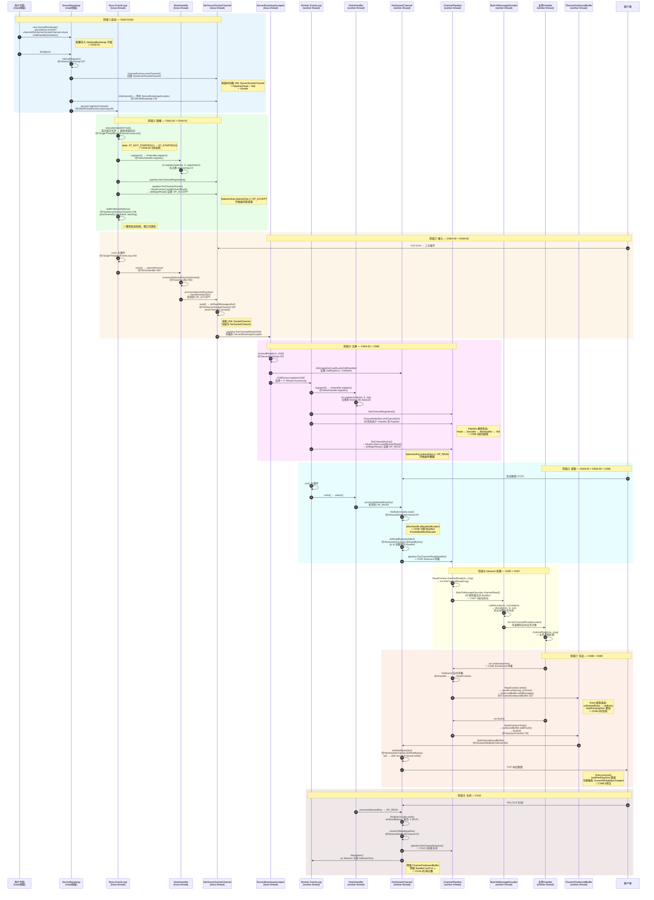
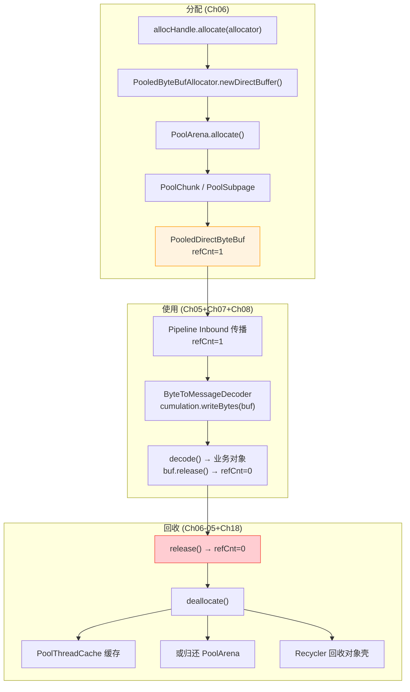
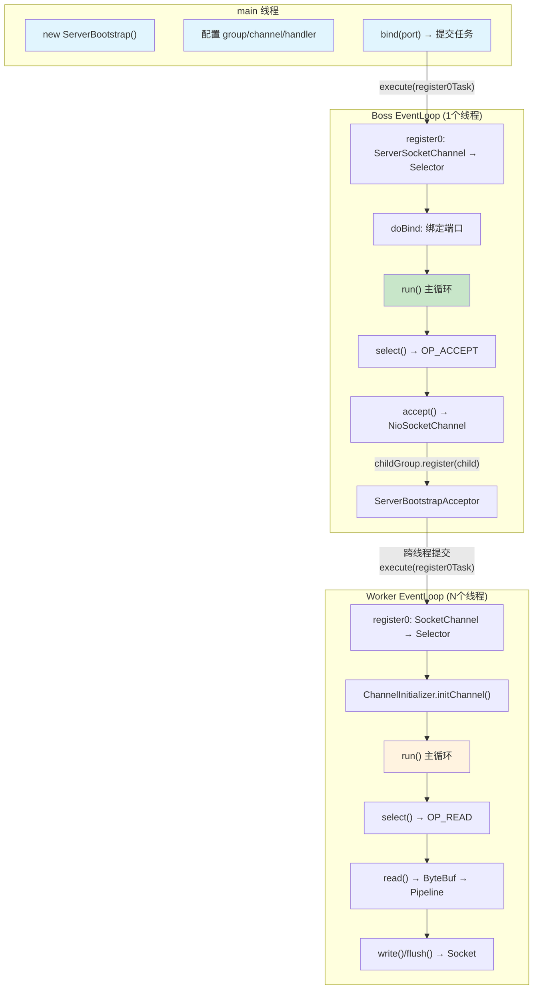
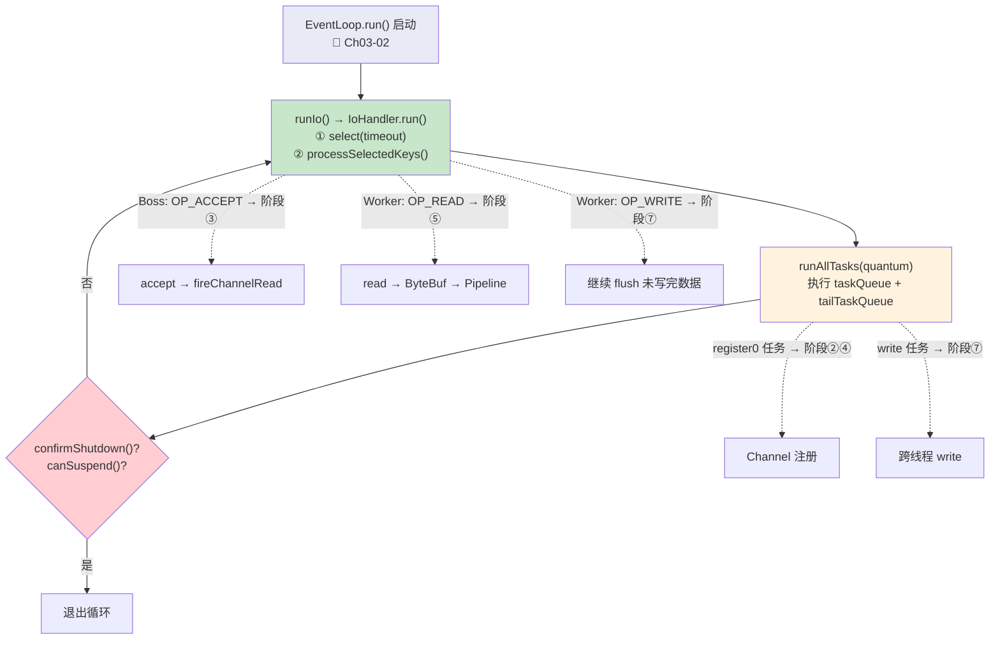

# Netty 4.2.9 请求完整生命周期 — 贯穿式时序图

> **定位**：本文是全部 27 个章节的**全局导航地图**，以一个 TCP 请求从"服务启动"到"连接关闭"的完整生命周期为主线，将每一步精确映射到：
> 1. 📖 **对应章节编号** — 方便跳转深入阅读
> 2. 📦 **源码类名 + 方法名** — 方便断点调试
> 3. 🧱 **关键数据结构** — 理解每步操作的是什么数据
> 4. 🧵 **线程上下文** — 理解谁在哪个线程上执行
>
> 遵循 Rule #15：以请求生命周期为主线组织阅读。
> 遵循 Rule #13：源码级深度 L4 标准。

---

## 一、生命周期全景总览

一个完整的 TCP 请求-响应在 Netty 中经历 **8 个阶段**：

```
┌────────────────────────────────────────────────────────────────────────────────┐
│                        请求完整生命周期 · 8 个阶段                              │
├──────────┬─────────────────────────────────────────────────────────────────────┤
│ 阶段     │ 描述                                                               │
├──────────┼─────────────────────────────────────────────────────────────────────┤
│ ① 启动   │ ServerBootstrap 创建对象、配置参数、bind 端口                        │
│ ② 就绪   │ ServerSocketChannel 注册到 Boss EventLoop，开始监听 OP_ACCEPT        │
│ ③ 接入   │ Boss EventLoop 检测到新连接，accept 出 SocketChannel                 │
│ ④ 注册   │ 子 Channel 注册到 Worker EventLoop，触发 Pipeline 初始化              │
│ ⑤ 读取   │ Worker EventLoop 检测到 OP_READ，读数据到 ByteBuf                    │
│ ⑥ 处理   │ ByteBuf 沿 Pipeline Inbound 方向传播，经过解码、业务处理               │
│ ⑦ 写出   │ 响应数据沿 Pipeline Outbound 方向传播，写入 ChannelOutboundBuffer     │
│ ⑧ 关闭   │ 连接关闭，资源释放，Channel 注销                                     │
└──────────┴─────────────────────────────────────────────────────────────────────┘
```

---

## 二、完整生命周期时序图（源码级）

### 2.1 全局时序图



---

## 三、阶段-章节-源码-数据结构 精确映射表

### 3.1 完整映射表

| 阶段 | 步骤 | 章节 | 核心源码类:方法 | 关键数据结构 | 执行线程 |
|------|------|------|---------------|-------------|---------|
| **① 启动** | 创建 ServerBootstrap | Ch02-01 | `ServerBootstrap.<init>()` | `AbstractBootstrap` 字段：group/channelFactory/options/handler | main |
| | 配置 group/channel/handler | Ch02-01 | `AbstractBootstrap.group()`/`channel()`/`childHandler()` | `childGroup`, `childHandler`, `childOptions` map | main |
| | bind(port) | Ch02-02 | `AbstractBootstrap.bind()` → `doBind()` | `ChannelFuture` (Promise) | main |
| | initAndRegister | Ch02-02 | `AbstractBootstrap.initAndRegister():327` | `NioServerSocketChannel`(新建)  | main |
| | newChannel() | Ch02-02 | `ReflectiveChannelFactory.newChannel()` | JDK `ServerSocketChannel` + `DefaultChannelPipeline` + `NioMessageUnsafe` | main |
| | init(channel) | Ch02-02 | `ServerBootstrap.init():135` | Pipeline 中添加 `ChannelInitializer`（延迟添加 `ServerBootstrapAcceptor`） | main |
| **② 就绪** | register | Ch02-02 + Ch03-01 | `MultithreadEventLoopGroup.register():86` → `SingleThreadIoEventLoop.register()` | `IoRegistration` (SelectionKey 包装) | main→boss |
| | 线程启动 | Ch03-01 | `SingleThreadEventExecutor.execute()` → `startThread()` | `state`: 1→4, `thread` 字段赋值, `taskQueue`(MpscQueue) | boss |
| | register0 | Ch03-01 | `NioIoHandler.register()` → `ch.register(selector, 0, this)` | `SelectionKey`(interestOps=0) | boss |
| | fireChannelActive → doBeginRead | Ch02-02 | `HeadContext.channelActive()` → `readIfIsAutoRead()` → `doBeginRead()` | `SelectionKey.interestOps` \|= `OP_ACCEPT(16)` | boss |
| | doBind | Ch02-02 | `NioServerSocketChannel.doBind():148` → `javaChannel().bind()` | `ServerSocket` 绑定到端口 | boss |
| **③ 接入** | select 检测事件 | Ch03-02 | `SingleThreadIoEventLoop.run():193` → `runIo()` → `NioIoHandler.run():469` | `Selector.select()`, `SelectedSelectionKeySet`(数组优化) | boss |
| | processSelectedKey | Ch03-02 | `NioIoHandler.processSelectedKey()` → `registration.handle(readyOps)` | `SelectionKey`(readyOps 包含 `OP_ACCEPT`) | boss |
| | accept | Ch04-02 | `AbstractNioMessageChannel.read()` → `NioServerSocketChannel.doReadMessages():156` | `javaChannel().accept()` → 新 JDK `SocketChannel` → 包装为 `NioSocketChannel` | boss |
| | fireChannelRead(child) | Ch04-02 | `pipeline.fireChannelRead(child)` | `NioSocketChannel` 作为 msg 传递 | boss |
| **④ 注册** | ServerBootstrapAcceptor.channelRead | Ch04-02 | `ServerBootstrapAcceptor.channelRead():232` | 设置 childHandler/childOptions/childAttrs | boss |
| | childGroup.register(child) | Ch04-02 | `MultithreadEventLoopGroup.register()` → `next().register(child)` | 选择器（round-robin）选出一个 Worker EventLoop | boss→worker |
| | register0 (子Channel) | Ch04-02 | `NioIoHandler.register()` → `ch.register(selector, 0, reg)` | 子 Channel 的 `SelectionKey` 注册到 Worker Selector | worker |
| | Pipeline 初始化 | Ch05 | `ChannelInitializer.initChannel()` → `pipeline.addLast(handlers)` | `DefaultChannelPipeline` 双向链表: `Head ↔ ctx1 ↔ ctx2 ↔ ... ↔ Tail` | worker |
| | fireChannelActive → doBeginRead | Ch04-02 | `HeadContext.channelActive()` → `doBeginRead()` | `SelectionKey.interestOps` \|= `OP_READ(1)` | worker |
| **⑤ 读取** | select 检测事件 | Ch03-02 | `SingleThreadIoEventLoop.run()` → `runIo()` → `NioIoHandler.run()` | `SelectedSelectionKeySet`(OP_READ 就绪) | worker |
| | processSelectedKey | Ch03-02 | `NioIoHandler.processSelectedKey()` → `handle(readyOps)` | `SelectionKey`(readyOps 包含 `OP_READ`) | worker |
| | read + 分配 ByteBuf | Ch04-02 + Ch06 | `NioByteUnsafe.read():87` → `allocHandle.allocate(allocator)` | `PooledByteBuf`(从 `PoolArena` → `PoolChunk` → `PoolSubpage` 分配) | worker |
| | doReadBytes | Ch04-02 | `NioSocketChannel.doReadBytes(byteBuf)` | `ByteBuf.writeBytes(channel)` ← JDK `SocketChannel.read()` | worker |
| | fireChannelRead(byteBuf) | Ch05 | `pipeline.fireChannelRead(byteBuf)` | `ByteBuf` 进入 Inbound 传播链 | worker |
| **⑥ 处理** | HeadContext 透传 | Ch05 | `HeadContext.channelRead()` → `ctx.fireChannelRead(msg)` | msg 原样传递 | worker |
| | 解码 | Ch07 | `ByteToMessageDecoder.channelRead()` → `callDecode()` → `decode()` | `cumulation`(累积 ByteBuf) → 拆出业务消息 List | worker |
| | 业务处理 | — | 用户 Handler.channelRead(ctx, decodedMsg) | 业务对象 | worker |
| **⑦ 写出** | ctx.write(response) | Ch08 | `AbstractChannelHandlerContext.write()`:743 → Outbound 反向传播 | 编码后的 `ByteBuf` | worker |
| | HeadContext.write → unsafe.write | Ch08 | `AbstractChannel$AbstractUnsafe.write():720` | `filterOutboundMessage()` 转为 DirectByteBuf | worker |
| | addMessage | Ch08 | `ChannelOutboundBuffer.addMessage():115` | `Entry` 链表追加, `totalPendingSize` 累加 | worker |
| | 水位线检测 | Ch08 | `incrementPendingOutboundBytes()` | 超过 `writeBufferHighWaterMark`(默认64KB) → `setUnwritable()` → `fireChannelWritabilityChanged` | worker |
| | ctx.flush() | Ch08 | `AbstractChannelHandlerContext.flush()` → Outbound 反向传播 | — | worker |
| | addFlush + flush0 | Ch08 | `ChannelOutboundBuffer.addFlush():146` → `AbstractChannel$AbstractUnsafe.flush0():770` | `flushedEntry` 指针移动, 遍历 Entry 链表 | worker |
| | doWrite | Ch09 | `AbstractNioByteChannel.doWrite():261` → `doWriteBytes(buf)` | `NioSocketChannel` → JDK `SocketChannel.write(ByteBuffer)` | worker |
| | 写不完处理 | Ch09 | `incompleteWrite()` → 注册 `OP_WRITE` | 等待 socket 可写后继续 flush | worker |
| **⑧ 关闭** | EOF 检测 | Ch10 | `NioByteUnsafe.read()` → `doReadBytes()` 返回 -1 | `close = true` | worker |
| | closeOnRead | Ch10 | `NioByteUnsafe.closeOnRead()` | 判断 `isAllowHalfClosure` → `shutdownInput()` 或 `close()` | worker |
| | fireChannelInactive | Ch10 | `pipeline.fireChannelInactive()` | Inbound 传播关闭事件 | worker |
| | deregister | Ch10 | `AbstractChannel.deregister()` → `SelectionKey.cancel()` | 从 Selector 注销 | worker |
| | 资源释放 | Ch10 + Ch18 | `ChannelOutboundBuffer.close()` → `ByteBuf.release()` | `refCnt` → 0 → 回收到 `PoolThreadCache` 或释放内存 | worker |

---

## 四、关键数据结构流转图

### 4.1 数据在各阶段的形态变化

```mermaid
graph LR
    subgraph "⑤ 读取 (Ch04+Ch06)"
        A["OS 内核缓冲区<br/>(socket recv buffer)"]
        B["PooledDirectByteBuf<br/>(从 PoolArena 分配)"]
    end
    subgraph "⑥ 解码 (Ch07)"
        C["cumulation ByteBuf<br/>(累积器)"]
        D["业务对象<br/>(POJO/protobuf)"]
    end
    subgraph "⑦ 编码+写出 (Ch08)"
        E["响应对象<br/>(POJO)"]
        F["编码后 ByteBuf<br/>(DirectByteBuf)"]
        G["ChannelOutboundBuffer<br/>(Entry 链表)"]
        H["OS 内核缓冲区<br/>(socket send buffer)"]
    end

    A -->|"doReadBytes()<br/>JDK SocketChannel.read()"| B
    B -->|"fireChannelRead(byteBuf)"| C
    C -->|"decode() 拆包"| D
    D -->|"业务处理"| E
    E -->|"encode() 编码"| F
    F -->|"addMessage()"| G
    G -->|"doWrite()<br/>JDK SocketChannel.write()"| H

    style A fill:#e3f2fd
    style B fill:#fff3e0
    style C fill:#fff3e0
    style D fill:#e8f5e9
    style E fill:#e8f5e9
    style F fill:#fff3e0
    style G fill:#fce4ec
    style H fill:#e3f2fd
```



### 4.2 ByteBuf 生命周期与引用计数



---

## 五、线程交互图

### 5.1 两组线程的职责与交互



### 5.2 线程切换关键点

| # | 切换点 | 从 | 到 | 触发方式 | 对应章节 |
|---|--------|---|---|---------|---------|
| 1 | `bind()` 提交 register 任务 | main 线程 | Boss EventLoop | `eventLoop.execute(Runnable)` → 首次触发 `startThread()` | Ch02-02 |
| 2 | ServerBootstrapAcceptor 提交子 Channel 注册 | Boss EventLoop | Worker EventLoop | `childGroup.register(child)` → `execute(register0 task)` | Ch04-02 |
| 3 | 非 EventLoop 线程调用 `channel.write()` | 业务线程 | Worker EventLoop | `execute(writeTask)` 封装为任务提交 | Ch08 ⚠️踩坑 |

> ⚠️ **生产踩坑**：业务线程直接调用 `channel.writeAndFlush()` 是安全的（Netty 内部会判断 `inEventLoop()`，不在 EventLoop 时自动封装为任务提交），但如果直接操作 `ChannelOutboundBuffer` 则不安全。详见 Ch27 §P0-06。

---

## 六、EventLoop run() 循环与生命周期阶段的关系



**核心洞察**：EventLoop 的 `run()` 循环是所有阶段的**底层驱动引擎**。每一轮循环包含 IO 处理 + 任务处理，阶段②~⑧的所有操作都在这个循环中被驱动执行。

---

## 七、快速调试路线 — 5 个关键断点

> 遵循 Rule #17：Debug 是最终裁判。

### 断点 1：服务启动 — bind 全链路

```
📍 AbstractBootstrap.java:327  — initAndRegister()
   ↳ 观察 channelFactory.newChannel() 创建了什么
   ↳ 观察 init(channel) 往 Pipeline 加了什么

📍 AbstractChannel.java:553   — register0()
   ↳ 观察 doRegister() 注册到 Selector
   ↳ 观察 pipeline.fireChannelRegistered() → fireChannelActive()

📍 NioServerSocketChannel.java:148 — doBind()
   ↳ 观察 javaChannel().bind() 端口绑定
```

### 断点 2：新连接接入 — accept 链路

```
📍 NioIoHandler.java:587      — processSelectedKey(k)
   ↳ 检查 k.readyOps() 是否包含 OP_ACCEPT

📍 NioServerSocketChannel.java:156 — doReadMessages()
   ↳ 观察 javaChannel().accept() 返回的 SocketChannel

📍 ServerBootstrap.java:232   — ServerBootstrapAcceptor.channelRead()
   ↳ 观察 childGroup.register(child) 注册到哪个 Worker
```

### 断点 3：数据读取 — read 链路

```
📍 AbstractNioByteChannel.java:87 — NioByteUnsafe.read()
   ↳ 观察 allocHandle.allocate() 分配的 ByteBuf 类型和大小
   ↳ 观察 doReadBytes(byteBuf) 读了多少字节

📍 AbstractChannelHandlerContext.java:339 — fireChannelRead(msg)
   ↳ 观察 findContextInbound() 找到下一个 Handler
   ↳ 跟踪 msg 在 Pipeline 中的传播
```

### 断点 4：数据写出 — write + flush 链路

```
📍 AbstractChannel.java:720   — AbstractUnsafe.write(msg, promise)
   ↳ 观察 filterOutboundMessage(msg) 的转换
   ↳ 观察 outboundBuffer.addMessage() 后的 Entry 链表

📍 AbstractChannel.java:756   — AbstractUnsafe.flush()
   ↳ 观察 outboundBuffer.addFlush() 的指针移动
   ↳ 观察 doWrite(outboundBuffer) 实际写出

📍 AbstractNioByteChannel.java:261 — doWrite()
   ↳ 观察 writeSpinCount 和 incompleteWrite
```

### 断点 5：连接关闭 — close 链路

```
📍 AbstractNioByteChannel.java:53 — closeOnRead()
   ↳ 观察 isAllowHalfClosure 的判断
   ↳ 跟踪 close(voidPromise()) 或 shutdownInput()

📍 AbstractChannel.java:589   — close0()
   ↳ 观察 outboundBuffer 的释放
   ↳ 观察 fireChannelInactive() 的传播
```

---

## 八、阶段与调优参数的对应关系

| 阶段 | 关键调优参数 | 默认值 | 影响 | 详见章节 |
|------|-------------|--------|------|---------|
| ② 就绪 | `SO_BACKLOG` | 128 | TCP 全连接队列大小，影响突发连接 | Ch02-01, Ch23 |
| ③ 接入 | `maxMessagesPerRead` (ServerChannel) | 16 | 单次 accept 循环最多接入连接数 | Ch04-02 |
| ⑤ 读取 | `RecvByteBufAllocator` | `AdaptiveRecvByteBufAllocator` | 动态调整 read ByteBuf 大小 | Ch06, Ch23 |
| ⑤ 读取 | `maxMessagesPerRead` (SocketChannel) | 16 | 单次 read 循环最多读取次数 | Ch04-02 |
| ⑥ 处理 | `maxCumulationBufferComponents` | `Integer.MAX_VALUE` | Composite 累积器最大组件数 | Ch07 |
| ⑦ 写出 | `writeBufferHighWaterMark` | 64 KB | 触发不可写状态的阈值 | Ch08, Ch23 |
| ⑦ 写出 | `writeBufferLowWaterMark` | 32 KB | 恢复可写状态的阈值 | Ch08, Ch23 |
| ⑦ 写出 | `writeSpinCount` | 16 | 单次 flush 最多自旋写次数 | Ch09 |
| ⑧ 关闭 | `ALLOW_HALF_CLOSURE` | false | 是否允许半关闭 | Ch10 |
| 全局 | `maxTaskProcessingQuantumNs` | 2秒 | 单次 runAllTasks 最大执行时间 | Ch03-02, Ch23 |
| 全局 | `io.netty.allocator.type` | `pooled` | 内存分配器类型 | Ch06, Ch23 |
| 全局 | `io.netty.leakDetection.level` | `SIMPLE` | 内存泄漏检测级别 | Ch24 |

---

## 九、面试中如何使用这张图 🔥

### 5分钟版本：画图 + 口述

面试时在白板上画出简化版：

```
Client → [TCP SYN] → Boss EventLoop (accept) → Worker EventLoop (register)
                                                       ↓
                                              [OP_READ] → read() → ByteBuf
                                                       ↓
                                              Pipeline: Head → Decoder → BizHandler → Tail
                                                       ↓ (Inbound)          ↑ (Outbound)
                                              BizHandler → write() → OutboundBuffer → flush → socket
```

**口述要点**：
1. "Netty 采用 Reactor 主从模型：Boss 负责 accept，Worker 负责 IO 读写"
2. "所有 IO 操作都在 EventLoop 线程上执行，保证线程安全无锁"
3. "Pipeline 是双向链表，Inbound 从 Head 到 Tail，Outbound 从 Tail 到 Head"
4. "write() 只是放入 ChannelOutboundBuffer，flush() 才真正写出到 socket"
5. "ByteBuf 使用引用计数管理生命周期，由内存池分配和回收"

### 追问预判

| 追问 | 参考 |
|------|------|
| "Boss 和 Worker 之间怎么通信的？" | 跨线程 `execute(task)` 提交到 Worker 的 MpscQueue，§5.2 第2点 |
| "write() 和 flush() 为什么要分开？" | 批量写优化 + 减少系统调用次数，Ch08 §设计动机 |
| "如果 Worker 线程忙不过来怎么办？" | 背压：水位线 → `channelWritabilityChanged` → 上游停止写入，Ch08 §水位线 |
| "ByteBuf 怎么避免频繁 GC？" | 池化 + 对象回收(Recycler) + 引用计数，Ch06 |
| "空轮询 Bug 是什么？" | JDK epoll bug 导致 select() 立即返回，Netty 通过重建 Selector 规避，Ch03-02 §Q4 |

---

## 十、总结

### 从数据结构维度看生命周期

| 阶段 | 核心数据结构 | 状态变化 |
|------|------------|---------|
| ① 启动 | `ServerBootstrap` 字段 | 配置从空到完整 |
| ② 就绪 | `SelectionKey` | interestOps: 0 → OP_ACCEPT |
| ③ 接入 | `NioSocketChannel` | 新创建 |
| ④ 注册 | `DefaultChannelPipeline` | 双向链表从 Head↔Tail 到 Head↔handlers↔Tail |
| ⑤ 读取 | `PooledDirectByteBuf` | 从 PoolArena 分配, refCnt=1 |
| ⑥ 处理 | `cumulation` + 业务对象 | ByteBuf → 拆包 → POJO |
| ⑦ 写出 | `ChannelOutboundBuffer` | Entry 链表增长 → flush → 清空 |
| ⑧ 关闭 | `Channel` 状态 | active → inactive → closed |

### 从线程维度看生命周期

| 线程 | 职责 | 涉及阶段 |
|------|------|---------|
| main | 配置 + 触发启动 | ① |
| Boss EventLoop | accept + 分发 | ②③④(提交注册) |
| Worker EventLoop | IO读写 + Pipeline处理 + 编解码 + 业务逻辑 | ④(注册)⑤⑥⑦⑧ |

> 🎯 **一句话总结**：Netty 请求的完整生命周期，本质上就是**数据在不同形态（字节→ByteBuf→业务对象→ByteBuf→字节）之间流转，由 EventLoop 的 run() 循环驱动，经 Pipeline 双向链表传播处理**的过程。
