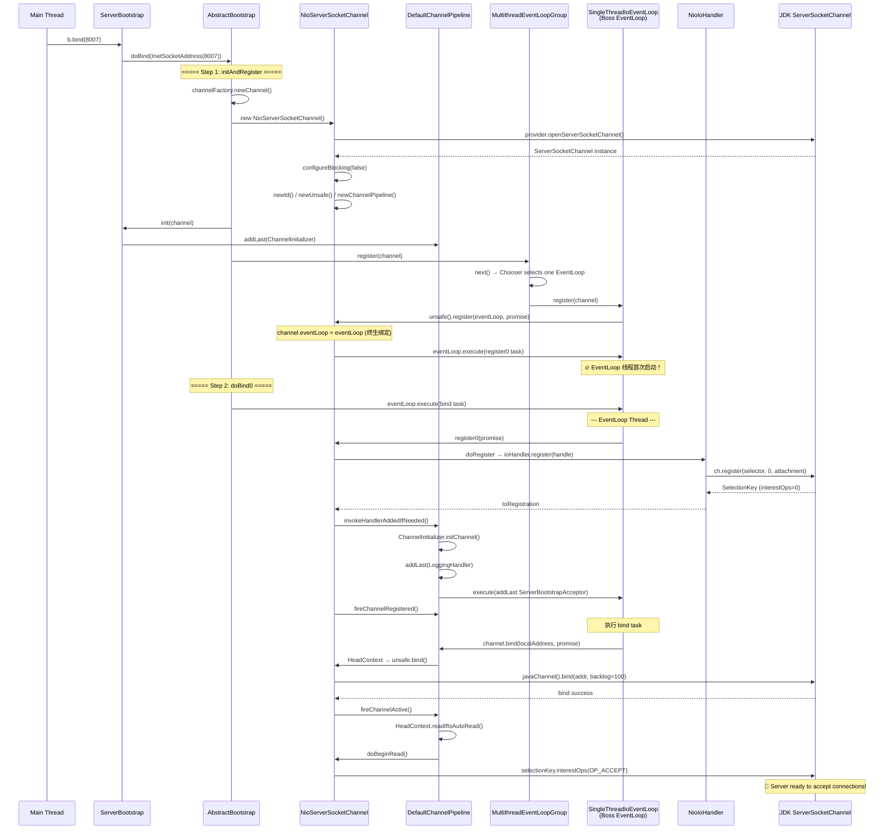

# 02 - ServerBootstrap.bind() 流程源码全量分析

> **前置依赖**：01-initialization-objects-and-config.md（bind() 之前所有对象已初始化完毕）
>
> **本节目标**：从 `b.bind(PORT)` 入口出发，走通整个启动流程，弄清楚**从调用 bind 到服务器准备好接受连接**这条完整路径上发生的每一件事。
>
> **核心问题**：bind() 到底做了什么？Channel 是怎么创建、初始化、注册到 Selector、绑定端口的？

---

## 一、bind() 全局调用链总览

先给出 **"一张图看懂 bind()"** 的全局调用链，再逐一拆解：

```
EchoServer.main()
  └── b.bind(PORT)                                          // 用户入口
        └── AbstractBootstrap.bind(SocketAddress)
              └── AbstractBootstrap.doBind(localAddress)     // 核心编排方法
                    │
                    ├── ① initAndRegister()                 // 步骤一：创建+初始化+注册
                    │     ├── channelFactory.newChannel()    // 1a. 反射创建 NioServerSocketChannel
                    │     ├── init(channel)                  // 1b. ServerBootstrap.init() 配置 Channel
                    │     └── group().register(channel)      // 1c. 注册到 EventLoop
                    │           └── next().register(channel) // Chooser 选出一个 EventLoop
                    │                 └── unsafe().register(eventLoop, promise)
                    │                       └── register0(promise)  // 提交到 EventLoop 线程执行
                    │                             └── doRegister(promise) // JDK Selector 注册
                    │
                    └── ② doBind0(regFuture, channel, localAddress, promise) // 步骤二：绑定端口
                          └── channel.eventLoop().execute(Runnable)
                                └── channel.bind(localAddress, promise)
                                      └── pipeline.bind(localAddress, promise)
                                            └── HeadContext.bind()
                                                  └── unsafe.bind(localAddress, promise)
                                                        ├── doBind(localAddress)  // JDK bind
                                                        └── pipeline.fireChannelActive()
                                                              └── HeadContext.readIfIsAutoRead()
                                                                    └── doBeginRead() // 注册 OP_ACCEPT
```

> 🔥 **面试常考**：bind() 流程的两大核心步骤是 `initAndRegister()` 和 `doBind0()`，前者创建并注册 Channel，后者绑定端口并激活 Channel。

---

## 二、源码逐行分析

### 2.1 入口：AbstractBootstrap.bind(int inetPort)

**源码位置**：`io.netty.bootstrap.AbstractBootstrap`

```java
// EchoServer 中的调用：b.bind(PORT)
public ChannelFuture bind(int inetPort) {
    return bind(new InetSocketAddress(inetPort));
}

public ChannelFuture bind(SocketAddress localAddress) {
    validate();     // validate the bootstrap parameters are all set
    return doBind(ObjectUtil.checkNotNull(localAddress, "localAddress"));
}
```

**逐行解析**：
1. `new InetSocketAddress(inetPort)` — 创建 JDK 的 `InetSocketAddress` 对象，封装端口号
2. `validate()` — 校验 group 和 channelFactory 不为 null（前面配置阶段设置的）
3. `doBind(localAddress)` — **真正的 bind 逻辑入口**

> 💡 **设计动机**：validate() 采用 fail-fast 思想，在 bind 之前就把配置不完整的错误暴露出来，而不是等到注册 Selector 时才报错。

---

### 2.2 核心编排：AbstractBootstrap.doBind()

**源码位置**：`io.netty.bootstrap.AbstractBootstrap`

```java
private ChannelFuture doBind(final SocketAddress localAddress) {
    // ===== 步骤一：创建Channel + 初始化 + 注册到EventLoop =====
    final ChannelFuture regFuture = initAndRegister();   // [1]
    final Channel channel = regFuture.channel();         // [2]
    if (regFuture.cause() != null) {                     // [3]
        return regFuture;
    }

    if (regFuture.isDone()) {                            // [4]
        // Registration was complete and successful.
        ChannelPromise promise = channel.newPromise();
        doBind0(regFuture, channel, localAddress, promise); // [5]
        return promise;
    } else {
        // Registration future is almost always fulfilled already, but just in case it's not.
        final PendingRegistrationPromise promise = new PendingRegistrationPromise(channel); // [6]
        regFuture.addListener(new ChannelFutureListener() {
            @Override
            public void operationComplete(ChannelFuture future) throws Exception {
                Throwable cause = future.cause();
                if (cause != null) {
                    promise.setFailure(cause);            // [7]
                } else {
                    promise.registered();                 // [8]
                    doBind0(regFuture, channel, localAddress, promise); // [9]
                }
            }
        });
        return promise;
    }
}
```

**逐行解析**：

| 标号 | 代码 | 分析 |
|------|------|------|
| [1] | `initAndRegister()` | **核心步骤一**：创建 Channel、初始化 Pipeline、注册到 EventLoop。详见 2.3 节 |
| [2] | `regFuture.channel()` | 从 Future 中取出已创建的 Channel 实例（即使注册未完成，Channel 对象已经存在） |
| [3] | `regFuture.cause() != null` | 如果创建/初始化/注册失败了，直接返回失败的 Future |
| [4] | `regFuture.isDone()` | **关键分支**：注册是否已完成？绝大多数情况下 `isDone() == true`（因为注册是提交到 EventLoop 的 taskQueue，main 线程执行到这里时注册 task 通常已经执行完了） |
| [5] | `doBind0(...)` | **核心步骤二**：注册已完成，直接执行端口绑定。详见 2.5 节 |
| [6] | `new PendingRegistrationPromise(channel)` | 罕见分支：注册还没完成，创建一个特殊的 Promise，在注册完成后的回调里通知 |
| [7] | `promise.setFailure(cause)` | 注册失败回调 |
| [8] | `promise.registered()` | 标记 registered=true，后续 executor() 方法返回 Channel 的 EventLoop 而非 GlobalEventExecutor |
| [9] | `doBind0(...)` | 在回调中执行端口绑定 |

> ⚠️ **生产踩坑**：[4] 处的分支几乎总是走 `isDone() == true` 路径，因为 `register()` 提交到 EventLoop 是异步的，但 main 线程在提交后立刻判断，而 EventLoop 线程已经启动并可能在提交前就执行完了。如果你在 Debug 断点卡住了 EventLoop 线程，则可能走进 else 分支。

> 🔥 **面试常考**：`doBind()` 展示了 Netty 的异步编程模型——操作结果用 `ChannelFuture` 返回，通过 `isDone()` 或 `addListener()` 处理结果，绝不阻塞调用者线程。

### 2.2.1 PendingRegistrationPromise 源码

```java
static final class PendingRegistrationPromise extends DefaultChannelPromise {
    private volatile boolean registered;

    PendingRegistrationPromise(Channel channel) {
        super(channel);   // 注意：此时 Channel 还没注册到 EventLoop，
                          // 所以 executor() 不能返回 Channel 的 EventLoop
    }

    void registered() {
        registered = true;
    }

    @Override
    protected EventExecutor executor() {
        if (registered) {
            return super.executor();  // Channel 的 EventLoop
        }
        return GlobalEventExecutor.INSTANCE;  // 兜底，避免 NPE
    }
}
```

**为什么需要这个类？**
- 在注册完成之前，Channel 还没有绑定 EventLoop，调用 `channel.eventLoop()` 会抛 `IllegalStateException`
- `PendingRegistrationPromise` 在注册前用 `GlobalEventExecutor.INSTANCE` 作为 fallback executor
- 注册成功后切换为 Channel 自己的 EventLoop
- 这是 [netty/netty#2586](https://github.com/netty/netty/issues/2586) 的修复

---

## 三、步骤一：initAndRegister() 详解

### 2.3 initAndRegister() 源码

**源码位置**：`io.netty.bootstrap.AbstractBootstrap`

```java
final ChannelFuture initAndRegister() {
    Channel channel = null;
    try {
        channel = channelFactory.newChannel();   // [A] 创建 Channel
        init(channel);                            // [B] 初始化 Channel
    } catch (Throwable t) {
        if (channel != null) {
            channel.unsafe().closeForcibly();
            return new DefaultChannelPromise(channel, GlobalEventExecutor.INSTANCE).setFailure(t);
        }
        return new DefaultChannelPromise(new FailedChannel(), GlobalEventExecutor.INSTANCE).setFailure(t);
    }

    final ChannelFuture regFuture = config().group().register(channel);  // [C] 注册
    if (regFuture.cause() != null) {
        if (channel.isRegistered()) {
            channel.close();
        } else {
            channel.unsafe().closeForcibly();
        }
    }
    return regFuture;
}
```

**逐行解析**：

| 标号 | 代码 | 分析 |
|------|------|------|
| [A] | `channelFactory.newChannel()` | 通过 `ReflectiveChannelFactory` 反射调用 `NioServerSocketChannel` 的无参构造器。**这一步创建了 JDK 的 `ServerSocketChannel` + Netty 的各种 Channel 组件**。详见 2.3.1 |
| [B] | `init(channel)` | `ServerBootstrap.init()` 被调用，设置 options/attrs，往 Pipeline 中添加 `ChannelInitializer`。详见 2.4 |
| [C] | `config().group().register(channel)` | 将 Channel 注册到 EventLoopGroup（选一个 EventLoop 注册）。详见 2.4.2 |

> ⚠️ **生产踩坑**：如果 `newChannel()` 抛异常（典型场景：打开的文件描述符超过系统限制），会走进 catch 分支，用 `GlobalEventExecutor.INSTANCE` 通知失败（因为此时还没有 EventLoop 可用）。

---

### 2.3.1 channelFactory.newChannel() — 创建 NioServerSocketChannel

反射调用 `NioServerSocketChannel()` 无参构造器，完整的构造链如下：

```
NioServerSocketChannel()
  └── this(DEFAULT_SELECTOR_PROVIDER)
        └── this(provider, (SocketProtocolFamily) null)
              └── this(newChannel(provider, family))          // 创建 JDK ServerSocketChannel
                    └── NioServerSocketChannel(ServerSocketChannel channel)
                          ├── super(null, channel, SelectionKey.OP_ACCEPT) // [①]
                          └── config = new NioServerSocketChannelConfig()  // [②]
```

#### ① 父类构造链

```
super(null, channel, SelectionKey.OP_ACCEPT)
  └── AbstractNioMessageChannel(parent=null, ch, readInterestOp=OP_ACCEPT)
        │   // 字段初始化器：
        │   boolean inputShutdown = false;
        │
        └── AbstractNioChannel(parent=null, ch, readOps)
              │   // --- 字段初始化器（构造时 new 出来）---
              │   clearReadPendingRunnable = new Runnable() { clearReadPending0(); };
              │
              │   // --- 构造器赋值 ---
              │   this.ch = ch;                              // 保存 JDK Channel
              │   this.readInterestOp = OP_ACCEPT;           // 保存感兴趣的事件（int 值 = 16）
              │   this.readOps = NioIoOps.valueOf(OP_ACCEPT); // ⚠️ 从静态缓存 EVENTS[] 中取，不创建新对象！
              │   ch.configureBlocking(false);                // 🔥 设置为非阻塞模式！
              │
              └── AbstractChannel(parent=null)
                    │   // --- 字段初始化器（构造时 new 出来）---
                    │   unsafeVoidPromise = new VoidChannelPromise(this, false);  // Unsafe 操作用的 void promise
                    │   closeFuture = new CloseFuture(this);                     // Channel 关闭通知 Future
                    │
                    │   // --- 构造器赋值 ---
                    │   this.parent = null;              // Server Channel 没有 parent
                    │   id = newId();                    // [创建 DefaultChannelId]
                    │   unsafe = newUnsafe();            // [创建 NioMessageUnsafe（含内部字段初始化）]
                    │   pipeline = newChannelPipeline(); // [创建 DefaultChannelPipeline]
                    │
                    └── DefaultAttributeMap()
                          │   // 字段初始化器：
                          │   attributes = EMPTY_ATTRIBUTES;  // 引用静态空数组，不创建新对象
```

> ⚠️ **注意**：`NioIoOps.valueOf(OP_ACCEPT)` **不会创建新对象**！`NioIoOps` 内部有一个静态缓存数组 `EVENTS[]`，在类加载时预创建了 `NONE/ACCEPT/CONNECT/WRITE/READ` 等常用实例，`valueOf()` 直接从缓存中取。

#### ①-a newUnsafe() 创建 NioMessageUnsafe 的内部对象

`AbstractNioMessageChannel.newUnsafe()` 返回 `new NioMessageUnsafe()`，其继承链：

```
NioMessageUnsafe extends AbstractNioUnsafe extends AbstractUnsafe
```

**字段初始化器创建的对象**：

| 所在类 | 字段 | 创建的对象 | 说明 |
|--------|------|-----------|------|
| `AbstractUnsafe` | `outboundBuffer` | `new ChannelOutboundBuffer(AbstractChannel.this)` | 出站数据缓冲区，管理待写出的消息链表 |
| `NioMessageUnsafe` | `readBuf` | `new ArrayList<Object>()` | accept 新连接时的临时读缓冲列表 |

**构造链中创建的所有对象——完整清单**：

| 所在层 | 步骤 / 字段 | 创建的对象 | 说明 |
|--------|------------|-----------|------|
| `NioServerSocketChannel` 静态初始化 | `METADATA` | `new ChannelMetadata(false, 16)` | 静态字段，类加载时创建。`hasDisconnect=false`（TCP 无 disconnect 语义），`defaultMaxMessagesPerRead=16` |
| `NioServerSocketChannel` 静态初始化 | `DEFAULT_SELECTOR_PROVIDER` | `SelectorProvider.provider()` | JDK 默认的 SelectorProvider（单例，实际只获取引用） |
| `NioServerSocketChannel` 构造器 | `newChannel(provider, family)` | `java.nio.channels.ServerSocketChannel` | JDK NIO 原生的服务端 Channel（底层打开一个文件描述符 fd） |
| `DefaultAttributeMap` 构造器 | `attributes` 字段 | — | 引用静态 `EMPTY_ATTRIBUTES` 空数组，不创建新对象 |
| `AbstractChannel` 字段初始化器 | `unsafeVoidPromise` | `new VoidChannelPromise(this, false)` | Unsafe 操作专用的 void promise（`false` = 不会检查 cancel） |
| `AbstractChannel` 字段初始化器 | `closeFuture` | `new CloseFuture(this)` | Channel 关闭通知的 Future（继承 `DefaultChannelPromise`，重写 set/trySuccess 抛异常，只能通过 `setClosed()` 完成） |
| `AbstractChannel` 构造器 | `newId()` | `DefaultChannelId` | 包含 MACHINE_ID(byte[]) + PROCESS_ID(int) + 序列号(AtomicInteger) + 时间戳(long) + 随机数(int)，构造器内部创建一个 byte[] 数组 |
| `AbstractChannel` 构造器 | `newUnsafe()` | `NioMessageUnsafe` | AbstractNioMessageChannel 的内部类，负责实际 I/O 操作 |
| `AbstractUnsafe` 字段初始化器 | `outboundBuffer` | `new ChannelOutboundBuffer(this)` | 出站数据缓冲区。构造器只保存 channel 引用，内部的 Entry 链表还没有节点 |
| `NioMessageUnsafe` 字段初始化器 | `readBuf` | `new ArrayList<Object>()` | accept 新连接时临时存放子 Channel 的列表 |
| `AbstractChannel` 构造器 | `newChannelPipeline()` | `DefaultChannelPipeline` | 含 HeadContext + TailContext 的双向链表（详见下方） |
| `AbstractNioChannel` 字段初始化器 | `clearReadPendingRunnable` | `new Runnable() { clearReadPending0(); }` | 用于在 EventLoop 线程中安全地清除 readPending 标志 |
| `AbstractNioChannel` 构造器 | `readOps` | `NioIoOps.valueOf(OP_ACCEPT)` | ⚠️ **不创建新对象！** 从静态缓存 `EVENTS[16]` 中获取预创建的 `NioIoOps.ACCEPT` 实例 |
| `AbstractNioChannel` 构造器 | `configureBlocking(false)` | — | 🔥 **关键操作**：将 JDK Channel 设为非阻塞模式，NIO 的基石 |
| `NioServerSocketChannel` 构造器 | `new NioServerSocketChannelConfig(this, javaChannel().socket())` | ② 见下方 Config 构造链 | 🔥 **这一步触发了 `ByteBufAllocator.DEFAULT` 的类加载**，内存池在此初始化！ |

> 🔥 **面试常考**：`ChannelOutboundBuffer` 在 `newUnsafe()` 时就跟着创建了，而不是在第一次 write 时才创建。它是 Netty 写数据的核心缓冲区，内部通过 Entry 链表管理待写出的消息。

#### DefaultChannelPipeline 的构造

```java
protected DefaultChannelPipeline(Channel channel) {
    this.channel = channel;
    succeededFuture = new SucceededChannelFuture(channel, null); // [P1]
    voidPromise = new VoidChannelPromise(channel, true);         // [P2]

    tail = new TailContext(this);     // [P3] Inbound 链表尾端
    head = new HeadContext(this);     // [P4] Outbound 链表头端

    head.next = tail;
    tail.prev = head;
}
```

**Pipeline 构造器创建的对象详解**：

| 标号 | 创建的对象 | 说明 |
|------|-----------|------|
| [P1] | `SucceededChannelFuture` | 一个已完成的成功 Future（单例复用），`pipeline.newSucceededFuture()` 返回的就是它 |
| [P2] | `VoidChannelPromise(channel, true)` | Pipeline 专用的 void promise（`true` = 会检查 cancel）。**注意区分**：`AbstractChannel` 字段中还有一个 `VoidChannelPromise(this, false)` |
| [P3] | `TailContext` → `AbstractChannelHandlerContext` | 构造时计算 `executionMask`（标记处理哪些事件类型），调用 `setAddComplete()` 将 handlerState 设为 ADD_COMPLETE |
| [P4] | `HeadContext` → `AbstractChannelHandlerContext` | 同上，且持有 `unsafe = pipeline.channel().unsafe()` 的引用（用于把 Outbound 操作委托给 Unsafe） |

> ⚠️ **易混淆点**：`VoidChannelPromise` 一共创建了 **2 个**：
> - Pipeline 中的：`new VoidChannelPromise(channel, true)` —— 通过 `pipeline.voidPromise()` 返回
> - AbstractChannel 字段中的：`new VoidChannelPromise(this, false)` —— 通过 `unsafe.voidPromise()` 返回
> - 参数 `true/false` 的区别：`true` 会在 `setSuccess()/setFailure()` 时检查 cancel 状态；`false` 不检查

**Pipeline 初始状态**（双向链表）：

```
HeadContext ⟷ TailContext
  (both)        (inbound)
```

- `HeadContext`：实现了 `ChannelOutboundHandler` + `ChannelInboundHandler`，是 Outbound 操作的最终执行者（调用 `unsafe.xxx()`），也是 Inbound 事件的起点
- `TailContext`：实现了 `ChannelInboundHandler`，是 Inbound 事件的终点（丢弃未处理的消息，打印 warn 日志）

> 🔥 **面试常考**：Pipeline 是一个**双向链表**，Inbound 事件从 Head → Tail 传播，Outbound 事件从 Tail → Head 传播。HeadContext 是 bridge 角色，把 Outbound 操作委托给 `Channel.Unsafe`。

#### ② NioServerSocketChannelConfig 构造链

```
new NioServerSocketChannelConfig(this, javaChannel().socket())
  └── DefaultServerSocketChannelConfig(channel, javaSocket)
        │   super(channel, new ServerChannelRecvByteBufAllocator());  // [C1] 创建 RecvBufAllocator
        │   this.javaSocket = javaSocket;                              // JDK ServerSocket 引用
        │   backlog = NetUtil.SOMAXCONN;                               // 默认 backlog（读取系统配置）
        │
        └── DefaultChannelConfig(channel, allocator)
              │   // --- 字段初始化器（类加载 / 构造时赋值）---
              │   allocator = ByteBufAllocator.DEFAULT;           // [C2] 🔥 触发 PooledByteBufAllocator 类加载！
              │   msgSizeEstimator = DEFAULT_MSG_SIZE_ESTIMATOR;  // 引用静态单例 DefaultMessageSizeEstimator.DEFAULT
              │   writeBufferWaterMark = WriteBufferWaterMark.DEFAULT; // 引用静态单例（high=64KB, low=32KB）
              │   connectTimeoutMillis = 30000;                   // 默认连接超时 30s
              │   writeSpinCount = 16;                            // 默认写自旋次数
              │   autoRead = 1;                                  // 默认自动读取开启
              │
              │   // --- 构造器逻辑 ---
              │   setRecvByteBufAllocator(allocator, channel.metadata()); // [C3]
              │   //    → channel.metadata() 返回 NioServerSocketChannel.METADATA（静态字段）
              │   //    → METADATA.defaultMaxMessagesPerRead() = 16
              │   //    → 但 ServerChannelRecvByteBufAllocator 构造时传了 maxMessagesPerRead=1
              │   //    → 所以这里会把 allocator 的 maxMessagesPerRead 覆盖为 16
              │   this.channel = channel;
```

**Config 构造链创建的对象详解**：

| 标号 | 创建的对象 | 说明 |
|------|-----------|------|
| [C1] | `ServerChannelRecvByteBufAllocator` | 继承自 `DefaultMaxMessagesRecvByteBufAllocator`，构造器 `super(1, true)`：`maxMessagesPerRead=1`（后被 `setRecvByteBufAllocator` 覆盖为 16），`ignoreBytesRead=true`（Server Channel 不关心读取字节数，只关心消息数），`respectMaybeMoreData` 保持默认 `true` |
| [C2] | `ByteBufAllocator.DEFAULT`（引用） | 🔥 触发 `ByteBufAllocator` 接口的静态初始化块 → 加载 `PooledByteBufAllocator.DEFAULT` → 初始化内存池！**不创建新对象**，是引用全局单例 |
| [C3] | — | `setRecvByteBufAllocator()` 不创建对象，只是把 [C1] 的 allocator 设到 `rcvBufAllocator` 字段，并根据 ChannelMetadata 调整 maxMessagesPerRead |

---

### 2.4 ServerBootstrap.init(Channel) — 初始化 Channel

**源码位置**：`io.netty.bootstrap.ServerBootstrap`

```java
void init(Channel channel) throws Throwable {
    // ===== 1. 设置 Channel Options（如 SO_BACKLOG=100）=====
    setChannelOptions(channel, newOptionsArray(), logger);   // [1]
    // ===== 2. 设置 Channel Attributes =====
    setAttributes(channel, newAttributesArray());             // [2]

    ChannelPipeline p = channel.pipeline();

    // ===== 3. 快照子配置 =====
    final EventLoopGroup currentChildGroup = childGroup;      // [3]
    final ChannelHandler currentChildHandler = childHandler;
    final Entry<ChannelOption<?>, Object>[] currentChildOptions = newOptionsArray(childOptions);
    final Entry<AttributeKey<?>, Object>[] currentChildAttrs = newAttributesArray(childAttrs);
    final Collection<ChannelInitializerExtension> extensions = getInitializerExtensions();

    // ===== 4. 往 Pipeline 添加 ChannelInitializer =====
    p.addLast(new ChannelInitializer<Channel>() {             // [4]
        @Override
        public void initChannel(final Channel ch) {
            final ChannelPipeline pipeline = ch.pipeline();
            ChannelHandler handler = config.handler();        // [4a] 获取 handler（LoggingHandler）
            if (handler != null) {
                pipeline.addLast(handler);                    // [4b] 添加 LoggingHandler
            }

            ch.eventLoop().execute(new Runnable() {           // [4c] 提交异步任务
                @Override
                public void run() {
                    pipeline.addLast(new ServerBootstrapAcceptor(   // [4d] 添加 Acceptor
                            ch, currentChildGroup, currentChildHandler,
                            currentChildOptions, currentChildAttrs, extensions));
                }
            });
        }
    });
    // ===== 5. 扩展点（通常为空）=====
    if (!extensions.isEmpty() && channel instanceof ServerChannel) { // [5]
        // ...SPI extensions
    }
}
```

**逐行解析**：

| 标号 | 代码 | 分析 |
|------|------|------|
| [1] | `setChannelOptions(...)` | 将 `SO_BACKLOG=100` 等选项设置到 `NioServerSocketChannelConfig` 中 |
| [2] | `setAttributes(...)` | 设置用户自定义属性（EchoServer 未设置，数组为空） |
| [3] | 快照子配置 | 将 `childGroup`/`childHandler`/`childOptions`/`childAttrs` 存到局部 final 变量，**防止后续被用户修改**（线程安全） |
| [4] | `p.addLast(ChannelInitializer)` | 🔥 **核心步骤**：添加一个 `ChannelInitializer`，它不会立即执行，而是等 Channel 注册到 EventLoop 后才触发 `initChannel()` |
| [4a] | `config.handler()` | 获取 `.handler(new LoggingHandler(...))` 设置的 handler |
| [4b] | `pipeline.addLast(handler)` | 将 `LoggingHandler` 添加到 Server Channel 的 Pipeline |
| [4c] | `ch.eventLoop().execute(...)` | 🔥 **为什么不直接 addLast？** 因为 `initChannel()` 被调用时 `ChannelInitializer` 本身还在 Pipeline 中（等会儿会被移除），直接 addLast 会导致 `ServerBootstrapAcceptor` 被加在 `ChannelInitializer` 之前。通过 `execute()` 延迟到下一个 EventLoop 循环执行，此时 `ChannelInitializer` 已经被移除 |
| [4d] | `new ServerBootstrapAcceptor(...)` | 🔥 **最关键的 Handler**：负责接受新连接（Accept），将子 Channel 注册到 childGroup |
| [5] | extensions | SPI 扩展点，通常为空集合（ServiceLoader 加载 `ChannelInitializerExtension`） |

> ⚠️ **生产踩坑**：`p.addLast(ChannelInitializer)` 时 Pipeline 还未注册，所以 `addLast` 内部会把 `callHandlerAdded` 延迟到注册完成后执行（存入 `pendingHandlerCallbackHead` 链表）。

> 🔥 **面试常考**：为什么 `ServerBootstrapAcceptor` 要通过 `ch.eventLoop().execute()` 添加，而不是直接 `pipeline.addLast()`？—— 为了保证 `ChannelInitializer` 先被移除再添加 `Acceptor`，避免 Pipeline 中 handler 的顺序问题。

---

### 2.4.1 此时 Pipeline 的状态演变

```
初始状态（newChannelPipeline 后）：
  HeadContext ⟷ TailContext

init(channel) 中 p.addLast(ChannelInitializer) 后：
  HeadContext ⟷ ChannelInitializer#0 ⟷ TailContext
                (pending: handlerAdded not yet called)

注册完成后 ChannelInitializer.initChannel() 被调用：
  HeadContext ⟷ LoggingHandler ⟷ TailContext
  (ChannelInitializer 自动移除自己)

下一个 EventLoop tick（execute 的 Runnable 执行）：
  HeadContext ⟷ LoggingHandler ⟷ ServerBootstrapAcceptor ⟷ TailContext
```

---

### 2.4.2 ServerBootstrapAcceptor — 连接接受器

```java
private static class ServerBootstrapAcceptor extends ChannelInboundHandlerAdapter {
    private final EventLoopGroup childGroup;
    private final ChannelHandler childHandler;
    private final Entry<ChannelOption<?>, Object>[] childOptions;
    private final Entry<AttributeKey<?>, Object>[] childAttrs;
    private final Collection<ChannelInitializerExtension> extensions;
    private final Runnable enableAutoReadTask;

    ServerBootstrapAcceptor(...) {
        this.childGroup = childGroup;
        this.childHandler = childHandler;
        this.childOptions = childOptions;
        this.childAttrs = childAttrs;
        this.extensions = extensions;
        // ⚠️ 提前创建 Runnable，防止 URLClassLoader 文件句柄耗尽时无法加载类
        enableAutoReadTask = () -> channel.config().setAutoRead(true);
    }

    @Override
    public void channelRead(ChannelHandlerContext ctx, Object msg) {
        final Channel child = (Channel) msg;            // msg 就是新接受的子 Channel
        child.pipeline().addLast(childHandler);          // 添加用户的 childHandler

        try {
            setChannelOptions(child, childOptions, logger);  // 设置子 Channel 选项
        } catch (Throwable cause) {
            forceClose(child, cause);                    // 设置失败则强制关闭子 Channel
            return;
        }
        setAttributes(child, childAttrs);                // 设置子 Channel 属性

        // SPI 扩展点：允许第三方扩展在子 Channel 初始化后做额外处理
        if (!extensions.isEmpty()) {
            for (ChannelInitializerExtension extension : extensions) {
                try {
                    extension.postInitializeServerChildChannel(child);
                } catch (Exception e) {
                    logger.warn("Exception thrown from postInitializeServerChildChannel", e);
                }
            }
        }

        try {
            childGroup.register(child).addListener(new ChannelFutureListener() {
                @Override
                public void operationComplete(ChannelFuture future) throws Exception {
                    if (!future.isSuccess()) {
                        forceClose(child, future.cause());  // 注册失败则强制关闭
                    }
                }
            });
        } catch (Throwable t) {
            forceClose(child, t);
        }
    }

    @Override
    public void exceptionCaught(ChannelHandlerContext ctx, Throwable cause) {
        final ChannelConfig config = ctx.channel().config();
        if (config.isAutoRead()) {                       // 只在 autoRead=true 时才暂停
            // stop accept new connections for 1 second to allow the channel to recover
            config.setAutoRead(false);
            ctx.channel().eventLoop().schedule(enableAutoReadTask, 1, TimeUnit.SECONDS);
        }
        // 🔥 继续传播异常（让用户有机会处理）
        ctx.fireExceptionCaught(cause);
    }
}
```

> 🔥 **面试常考**：`ServerBootstrapAcceptor` 是 Reactor 模式中 **Main Reactor** 的核心组件，它在 Boss EventLoop 中执行，负责将新连接分发给 Worker EventLoopGroup（Sub Reactor）。

> ⚠️ **生产踩坑**：`exceptionCaught` 中的 "暂停 1 秒 accept" 策略是为了防止 `too many open files` 等异常导致的忙循环（[netty/netty#1328](https://github.com/netty/netty/issues/1328)）。

---

## 四、步骤一（续）：Channel 注册到 EventLoop

### 2.4.3 注册调用链

```
config().group().register(channel)
  └── MultithreadEventLoopGroup.register(channel)
        └── next().register(channel)                    // [1] Chooser 选出一个 EventLoop
              └── SingleThreadEventLoop.register(channel)
                    └── register(new DefaultChannelPromise(channel, this))  // [2]
                          └── promise.channel().unsafe().register(this, promise) // [3]
                                └── AbstractUnsafe.register(eventLoop, promise)  // [4]
```

**逐行解析**：

| 标号 | 代码 | 分析 |
|------|------|------|
| [1] | `next()` | 🔥 通过 `EventExecutorChooser`（PowerOfTwoChooser 或 GenericChooser）轮询选出一个 EventLoop。**这个 EventLoop 将作为 Server Channel 的 Boss EventLoop，终生绑定** |
| [2] | `new DefaultChannelPromise(channel, this)` | 创建 Promise，关联 Channel 和选中的 EventLoop |
| [3] | `unsafe().register(this, promise)` | 委托给 Channel 的 Unsafe 实现 |
| [4] | `AbstractUnsafe.register()` | 真正的注册逻辑（见下方） |

### 2.4.4 AbstractUnsafe.register() 源码

```java
public final void register(EventLoop eventLoop, final ChannelPromise promise) {
    // ===== 校验 =====
    ObjectUtil.checkNotNull(eventLoop, "eventLoop");
    if (isRegistered()) {
        promise.setFailure(new IllegalStateException("registered to an event loop already"));
        return;
    }
    if (!isCompatible(eventLoop)) {
        promise.setFailure(new IllegalStateException(
            "incompatible event loop type: " + eventLoop.getClass().getName()));
        return;
    }

    // ===== 🔥 绑定 EventLoop（终生有效）=====
    AbstractChannel.this.eventLoop = eventLoop;         // [1]

    // ===== 清除旧的 executor 缓存 =====
    AbstractChannelHandlerContext context = pipeline.tail;  // [2]
    do {
        context.contextExecutor = null;
        context = context.prev;
    } while (context != null);

    // ===== 判断当前线程是否是 EventLoop 线程 =====
    if (eventLoop.inEventLoop()) {                      // [3]
        register0(promise);
    } else {
        try {
            eventLoop.execute(new Runnable() {          // [4] 🔥 提交 task 到 EventLoop
                @Override
                public void run() {
                    register0(promise);
                }
            });
        } catch (Throwable t) {
            closeForcibly();
            closeFuture.setClosed();
            safeSetFailure(promise, t);
        }
    }
}
```

**逐行解析**：

| 标号 | 代码 | 分析 |
|------|------|------|
| [1] | `this.eventLoop = eventLoop` | 🔥 **Channel 与 EventLoop 的终生绑定发生在此！** 后续所有 I/O 操作都在这个 EventLoop 上执行 |
| [2] | 遍历清除 `contextExecutor` | 如果 Channel 被反注册后重新注册到新的 EventLoop，需要清除缓存 |
| [3] | `eventLoop.inEventLoop()` | 当前是 main 线程，不是 EventLoop 线程，所以走 else |
| [4] | `eventLoop.execute(Runnable)` | 🔥🔥🔥 **关键中的关键！** 这是 EventLoop 线程首次启动的触发点！ `execute()` 检测到线程未启动，会调用 `startThread()` → `doStartThread()` 启动 EventLoop 线程，然后将 `register0` task 放入 taskQueue |

> 🔥🔥 **面试必考**：EventLoop 线程是**懒启动**的！不是在 `new MultiThreadIoEventLoopGroup()` 时启动，而是在首次 `execute()` 时启动。对于 Boss EventLoop，首次 execute 就是这里的 `register0` task；对于 Worker EventLoop，是在 `ServerBootstrapAcceptor.channelRead()` 中 `childGroup.register(child)` 时首次 execute。

---

### 2.4.5 register0() — 在 EventLoop 线程中执行

```java
private void register0(ChannelPromise promise) {
    if (!promise.setUncancellable() || !ensureOpen(promise)) {
        return;
    }
    ChannelPromise registerPromise = newPromise();
    boolean firstRegistration = neverRegistered;

    registerPromise.addListener(new ChannelFutureListener() {  // [1]
        @Override
        public void operationComplete(ChannelFuture future) throws Exception {
            if (future.isSuccess()) {
                neverRegistered = false;
                registered = true;

                pipeline.invokeHandlerAddedIfNeeded();    // [2] 🔥 触发 ChannelInitializer.handlerAdded()
                safeSetSuccess(promise);
                pipeline.fireChannelRegistered();          // [3] 触发 channelRegistered 事件

                if (isActive()) {                          // [4] Channel 已经 active？（bind 之前不会 active）
                    if (firstRegistration) {
                        pipeline.fireChannelActive();      // 触发 channelActive
                    } else if (config().isAutoRead()) {
                        beginRead();
                    }
                }
            } else {
                closeForcibly();
                closeFuture.setClosed();
                safeSetFailure(promise, future.cause());
            }
        }
    });
    doRegister(registerPromise);                           // [5] 🔥 执行实际的 Selector 注册
}
```

**逐行解析**：

| 标号 | 代码 | 分析 |
|------|------|------|
| [1] | `registerPromise.addListener(...)` | 为底层注册操作添加回调 |
| [2] | `invokeHandlerAddedIfNeeded()` | 🔥 **触发之前延迟的 handlerAdded 回调**——`ChannelInitializer.handlerAdded()` → `initChannel()` → 添加 LoggingHandler + 延迟添加 ServerBootstrapAcceptor |
| [3] | `fireChannelRegistered()` | 沿 Pipeline 传播 channelRegistered 事件 |
| [4] | `isActive()` | 此时还没 bind，`isActive() == false`，不会触发 `channelActive` |
| [5] | `doRegister(registerPromise)` | 调用 `AbstractNioChannel.doRegister()`，执行 JDK Selector 注册 |

---

### 2.4.6 AbstractNioChannel.doRegister() — JDK Selector 注册

```java
@Override
protected void doRegister(ChannelPromise promise) {
    assert registration == null;
    ((IoEventLoop) eventLoop()).register((AbstractNioUnsafe) unsafe()).addListener(f -> {
        if (f.isSuccess()) {
            registration = (IoRegistration) f.getNow();    // [1]
            promise.setSuccess();
        } else {
            promise.setFailure(f.cause());
        }
    });
}
```

调用链继续深入：

```
IoEventLoop.register(handle)
  └── SingleThreadIoEventLoop.register(IoHandle)
        └── registerForIo0(handle, promise)
              └── ioHandler.register(handle)
                    └── NioIoHandler.register(IoHandle)    // 🔥 最终注册到 JDK Selector
```

### NioIoHandler.register() 源码

```java
@Override
public IoRegistration register(IoHandle handle) throws Exception {
    NioIoHandle nioHandle = nioHandle(handle);   // 类型检查
    NioIoOps ops = NioIoOps.NONE;                 // 初始注册 interestOps = 0
    boolean selected = false;
    for (;;) {
        try {
            IoRegistration registration = new DefaultNioRegistration(
                executor, nioHandle, ops, unwrappedSelector());  // [1]
            handle.registered();                                   // [2]
            return registration;
        } catch (CancelledKeyException e) {
            if (!selected) {
                selectNow();       // 强制 select 一次以清除缓存的 cancelled key
                selected = true;
            } else {
                throw e;           // 重试一次仍失败，抛出异常
            }
        }
    }
}
```

### DefaultNioRegistration 构造器

```java
DefaultNioRegistration(ThreadAwareExecutor executor, NioIoHandle handle,
                       NioIoOps initialOps, Selector selector) throws IOException {
    this.handle = handle;
    key = handle.selectableChannel().register(selector, initialOps.value, this);
    //                              ↑ JDK API ↑
    //   将 JDK ServerSocketChannel 注册到 Selector，interestOps=0，attachment=this
}
```

**关键点**：

| 要点 | 分析 |
|------|------|
| `initialOps.value = 0` | 🔥 **注册时 interestOps=0！** 不是 OP_ACCEPT！这是一个"空注册"，只是把 Channel 绑定到 Selector，还不监听任何事件 |
| `attachment = this` | 将 `DefaultNioRegistration` 作为 attachment 附着在 `SelectionKey` 上，方便后续通过 key 找到 Netty 的 Registration |
| `handle.registered()` | 回调 `NioIoHandle.registered()`（即 `AbstractNioUnsafe.registered()`），通知 Channel 注册完成 |
| retry 逻辑 | 处理 `CancelledKeyException`——可能是之前注销的 key 还未被 Selector 清理，先 `selectNow()` 强制清理再重试 |

> 🔥🔥 **面试必考**：为什么注册时 interestOps=0 而不是 OP_ACCEPT？——因为注册和绑定是分两步的。Channel 注册到 Selector 后还没有 bind 端口，此时还不能 accept 连接。等 bind 完成后 `fireChannelActive()` → `HeadContext.readIfIsAutoRead()` → `doBeginRead()` 才会把 OP_ACCEPT 注册上去。

---

## 五、步骤二：doBind0() — 绑定端口

### 2.5 doBind0() 源码

**源码位置**：`io.netty.bootstrap.AbstractBootstrap`

```java
private static void doBind0(
        final ChannelFuture regFuture, final Channel channel,
        final SocketAddress localAddress, final ChannelPromise promise) {

    // This method is invoked before channelRegistered() is triggered.
    // Give user handlers a chance to set up the pipeline in its channelRegistered() implementation.
    channel.eventLoop().execute(new Runnable() {      // [1]
        @Override
        public void run() {
            if (regFuture.isSuccess()) {
                channel.bind(localAddress, promise)    // [2]
                    .addListener(ChannelFutureListener.CLOSE_ON_FAILURE);
            } else {
                promise.setFailure(regFuture.cause());
            }
        }
    });
}
```

**逐行解析**：

| 标号 | 代码 | 分析 |
|------|------|------|
| [1] | `channel.eventLoop().execute(...)` | 🔥 将 bind 操作提交到 EventLoop 线程执行，**保证 bind 在 register 之后执行**（因为 register 也是提交到同一个 EventLoop 的 task） |
| [2] | `channel.bind(localAddress, promise)` | 触发 Pipeline 的 bind 事件传播，从 TailContext → HeadContext |

> 💡 **设计动机**：为什么不直接在 main 线程调用 bind？—— 因为所有 Channel 操作必须在其绑定的 EventLoop 线程中执行（Netty 的线程安全模型）。通过 `execute()` 将 bind task 放入 EventLoop 的 taskQueue，保证**执行顺序**：register task → bind task。

---

### 2.5.1 Pipeline 中 bind 的传播路径

```
channel.bind(localAddress, promise)
  └── pipeline.bind(localAddress, promise)
        └── TailContext.bind(localAddress, promise)
              └── ... 沿 Pipeline 反向传播（Outbound 方向）...
                    └── HeadContext.bind(ctx, localAddress, promise)
                          └── unsafe.bind(localAddress, promise)  // 最终到达 AbstractUnsafe.bind()
```

### 2.5.2 AbstractUnsafe.bind() 源码

```java
public final void bind(final SocketAddress localAddress, final ChannelPromise promise) {
    assertEventLoop();

    if (!promise.setUncancellable() || !ensureOpen(promise)) {
        return;
    }

    // [0] SO_BROADCAST 安全检查（非 root 用户 + 非通配地址 + *nix 平台）
    if (Boolean.TRUE.equals(config().getOption(ChannelOption.SO_BROADCAST)) &&
        localAddress instanceof InetSocketAddress &&
        !((InetSocketAddress) localAddress).getAddress().isAnyLocalAddress() &&
        !PlatformDependent.isWindows() && !PlatformDependent.maybeSuperUser()) {
        logger.warn("A non-root user can't receive a broadcast packet if the socket " +
                "is not bound to a wildcard address; binding to a non-wildcard " +
                "address (" + localAddress + ") anyway as requested.");
    }

    boolean wasActive = isActive();                    // [1] false（还没 bind）
    try {
        doBind(localAddress);                           // [2] 🔥 JDK bind！
    } catch (Throwable t) {
        safeSetFailure(promise, t);
        closeIfClosed();
        return;
    }

    if (!wasActive && isActive()) {                    // [3] 之前不 active，现在 active 了
        invokeLater(new Runnable() {
            @Override
            public void run() {
                pipeline.fireChannelActive();           // [4] 🔥 触发 channelActive 事件！
            }
        });
    }

    safeSetSuccess(promise);                            // [5] bind 成功，通知 promise
}
```

### 2.5.3 NioServerSocketChannel.doBind() — JDK 绑定

```java
@Override
protected void doBind(SocketAddress localAddress) throws Exception {
    javaChannel().bind(localAddress, config.getBacklog());
    //    ↑ JDK ServerSocketChannel.bind()
    //    localAddress = InetSocketAddress(8007)
    //    backlog = 100（来自 .option(ChannelOption.SO_BACKLOG, 100)）
}
```

**这就是最终调用 JDK API 绑定端口的地方！** 执行完这行代码后：
- `ServerSocketChannel` 已经绑定到 `0.0.0.0:8007`
- `isActive()` 返回 `true`（`isOpen() && javaChannel().socket().isBound()`）
- 但还不能接受连接！因为 Selector 上还没有注册 OP_ACCEPT

---

## 六、激活 Channel：fireChannelActive() → 注册 OP_ACCEPT

### 2.6 Pipeline 传播 channelActive

```
pipeline.fireChannelActive()
  └── HeadContext.channelActive(ctx)
        ├── ctx.fireChannelActive()        // 继续向后传播
        └── readIfIsAutoRead()             // 🔥 关键！
              └── channel.read()
                    └── pipeline.read()
                          └── HeadContext.read(ctx)
                                └── unsafe.beginRead()
                                      └── doBeginRead()
```

### 2.6.1 HeadContext.channelActive()

```java
// HeadContext 中：
public void channelActive(ChannelHandlerContext ctx) {
    ctx.fireChannelActive();     // 向后传播（让 LoggingHandler 等能处理此事件）
    readIfIsAutoRead();           // 🔥 如果 autoRead=true（默认），发起读操作
}

private void readIfIsAutoRead() {
    if (channel.config().isAutoRead()) {   // 默认 true
        channel.read();
    }
}
```

### 2.6.2 AbstractNioChannel.doBeginRead() — 注册 OP_ACCEPT

```java
@Override
protected void doBeginRead() throws Exception {
    IoRegistration registration = this.registration;
    if (registration == null || !registration.isValid()) {
        return;
    }

    readPending = true;
    addAndSubmit(readOps);     // readOps = NioIoOps(OP_ACCEPT)
}
```

`addAndSubmit(readOps)` 最终执行：

```java
protected void addAndSubmit(NioIoOps addOps) {
    int interestOps = selectionKey().interestOps();      // 当前是 0
    if (!addOps.isIncludedIn(interestOps)) {
        try {
            registration().submit(NioIoOps.valueOf(interestOps).with(addOps));
            // submit → key.interestOps(OP_ACCEPT)       // 🔥🔥 在 Selector 上注册 OP_ACCEPT！
        } catch (Exception e) {
            throw new ChannelException(e);               // 包装为 ChannelException
        }
    }
}
```

**至此，`selectionKey.interestOps` 从 `0` 变为 `OP_ACCEPT(16)`，服务器正式开始监听新连接！**

> 🔥🔥🔥 **面试终极考点**：Netty 的 bind 流程中，**OP_ACCEPT 不是在注册时设置的，而是在 bind 成功后通过 `channelActive → readIfIsAutoRead → doBeginRead` 链路设置的**。这就是为什么注册时 interestOps=0 的原因。

---

## 七、bind() 完整时序图



---

## 八、bind() 期间创建的关键对象清单

> 以下按照创建的**时间顺序**排列，包含构造器调用 + 字段初始化器中 `new` 出来的所有对象，不遗漏。

### 8.1 channelFactory.newChannel() 阶段

| # | 所在层 | 创建的对象 | 类型 | 说明 |
|---|--------|-----------|------|------|
| 1 | `NioServerSocketChannel` 静态 | `METADATA` | `ChannelMetadata(false, 16)` | 类加载时创建，`hasDisconnect=false`，`defaultMaxMessagesPerRead=16` |
| 2 | `NioServerSocketChannel` 构造器 | JDK `ServerSocketChannel` | `java.nio.channels.ServerSocketChannel` | 通过 `provider.openServerSocketChannel()` 打开，底层分配文件描述符 |
| 3 | `DefaultAttributeMap` 构造器 | `attributes` 字段 | — | 引用静态空数组 `EMPTY_ATTRIBUTES`，不创建新对象 |
| 4 | `AbstractChannel` 字段初始化器 | `unsafeVoidPromise` | `VoidChannelPromise(this, false)` | Unsafe 操作专用 void promise（不检查 cancel） |
| 5 | `AbstractChannel` 字段初始化器 | `closeFuture` | `CloseFuture(this)` | Channel 关闭通知 Future |
| 6 | `AbstractChannel` 构造器 | `id` | `DefaultChannelId` | 含 MACHINE_ID + PROCESS_ID + 序列号 + 时间戳 + 随机数，内部创建 byte[] |
| 7 | `AbstractChannel` 构造器 → `newUnsafe()` | `NioMessageUnsafe` | `AbstractNioMessageChannel$NioMessageUnsafe` | 实际 I/O 操作者 |
| 8 | `AbstractUnsafe` 字段初始化器 | `outboundBuffer` | `ChannelOutboundBuffer(AbstractChannel.this)` | 出站数据缓冲区（Entry 链表初始为空） |
| 9 | `NioMessageUnsafe` 字段初始化器 | `readBuf` | `ArrayList<Object>()` | accept 新连接时的临时读缓冲列表 |
| 10 | `AbstractChannel` 构造器 → `newChannelPipeline()` | `DefaultChannelPipeline` | `DefaultChannelPipeline(this)` | Pipeline 容器 |
| 11 | `DefaultChannelPipeline` 构造器 | `succeededFuture` | `SucceededChannelFuture(channel, null)` | 已完成的成功 Future（复用） |
| 12 | `DefaultChannelPipeline` 构造器 | `voidPromise` | `VoidChannelPromise(channel, true)` | Pipeline 专用 void promise（检查 cancel） |
| 13 | `DefaultChannelPipeline` 构造器 | `tail` | `TailContext(this)` → `AbstractChannelHandlerContext` | Inbound 链表尾端 |
| 14 | `DefaultChannelPipeline` 构造器 | `head` | `HeadContext(this)` → `AbstractChannelHandlerContext` | Outbound+Inbound 双角色头节点，持有 `unsafe` 引用 |
| 15 | `AbstractNioChannel` 字段初始化器 | `clearReadPendingRunnable` | `Runnable（匿名内部类）` | 在 EventLoop 中安全清除 readPending 的任务 |
| 16 | `AbstractNioChannel` 构造器 | `readOps` | — | `NioIoOps.valueOf(OP_ACCEPT)` 从静态缓存取，**不创建新对象** |
| 17 | `AbstractNioChannel` 构造器 | `configureBlocking(false)` | — | 🔥 关键操作：设为非阻塞模式 |
| 18 | `NioServerSocketChannel` 构造器 → Config | `NioServerSocketChannelConfig` | `NioServerSocketChannelConfig(this, javaSocket)` | Config 对象 |
| 19 | `DefaultServerSocketChannelConfig` 构造器 | `ServerChannelRecvByteBufAllocator` | `ServerChannelRecvByteBufAllocator()` → `super(1, true)` | Server 专用的 RecvBufAllocator，`ignoreBytesRead=true`，`maxMessagesPerRead` 初始 1（后被覆盖为 16） |
| 20 | `DefaultChannelConfig` 字段初始化器 | `allocator` 引用 | `ByteBufAllocator.DEFAULT` | 🔥 触发 `PooledByteBufAllocator.DEFAULT` 类加载（内存池初始化！）引用全局单例 |
| 21 | `DefaultChannelConfig` 字段初始化器 | `writeBufferWaterMark` 引用 | `WriteBufferWaterMark.DEFAULT` | 引用静态单例（high=64KB, low=32KB） |
| 22 | `DefaultChannelConfig` 字段初始化器 | `msgSizeEstimator` 引用 | `DefaultMessageSizeEstimator.DEFAULT` | 引用静态单例 |

### 8.2 init(channel) 阶段

| # | 所在层 | 创建的对象 | 类型 | 说明 |
|---|--------|-----------|------|------|
| 23 | `init(channel)` | `ChannelInitializer`(匿名类) | `ChannelInitializer<Channel>` | 延迟初始化 handler，注册完成后触发 `initChannel()` |
| 24 | `init(channel)` | `Entry[]` × 2 | options/attrs 快照数组 | 配置快照（防止用户后续修改） |
| 25 | `addLast()` 内部 | `DefaultChannelHandlerContext` | ChannelHandlerContext | 为 ChannelInitializer 创建的 Context 节点 |
| 26 | `addLast()` 内部 | `PendingHandlerAddedTask` | PendingHandlerCallback | 延迟的 handlerAdded 回调任务（因为 Channel 还未注册） |

### 8.3 register(channel) 阶段

| # | 所在层 | 创建的对象 | 类型 | 说明 |
|---|--------|-----------|------|------|
| 27 | `SingleThreadEventLoop.register()` | `DefaultChannelPromise` | `DefaultChannelPromise(channel, eventLoop)` | 注册结果 Promise |
| 28 | `AbstractUnsafe.register()` | `Runnable`(register0 task) | 匿名 Runnable | 提交到 EventLoop 执行 register0 的任务 |
| 29 | `doRegister()` → `NioIoHandler.register()` | `DefaultNioRegistration` | `DefaultNioRegistration(executor, handle, ops, selector)` | Selector 注册句柄 |
| 30 | `doRegister()` → JDK | `SelectionKey` (interestOps=0) | `java.nio.channels.SelectionKey` | JDK Selector Key，attachment=DefaultNioRegistration |

### 8.4 register0 回调阶段（EventLoop 线程中）

| # | 所在层 | 创建的对象 | 类型 | 说明 |
|---|--------|-----------|------|------|
| 31 | `register0()` | `DefaultChannelPromise` | registerPromise | 底层注册操作的 Promise |
| 32 | `invokeHandlerAddedIfNeeded()` → `initChannel()` | — | — | 触发 ChannelInitializer.initChannel()，添加 LoggingHandler 到 Pipeline |
| 33 | `initChannel()` 内部 | `Runnable`(addLast Acceptor task) | 匿名 Runnable | 延迟添加 ServerBootstrapAcceptor 的任务 |
| 34 | EventLoop 下一个 tick | `ServerBootstrapAcceptor` | `ServerBootstrapAcceptor(ch, childGroup, childHandler, ...)` | 🔥 连接接受器 |
| 35 | `ServerBootstrapAcceptor` 构造器 | `enableAutoReadTask` | `Runnable (lambda)` | 异常恢复时重新开启 autoRead 的任务 |

### 8.5 doBind0() 阶段

| # | 所在层 | 创建的对象 | 类型 | 说明 |
|---|--------|-----------|------|------|
| 36 | `doBind0()` | `Runnable`(bind task) | 匿名 Runnable | 异步 bind 任务，提交到 EventLoop |

---

## 九、核心设计动机与 Trade-off

### 9.1 为什么注册和绑定分两步？

| 方案 | 优点 | 缺点 |
|------|------|------|
| 注册时直接绑定 | 简单 | Channel 绑定失败时难以清理 Selector 注册 |
| **先注册再绑定（Netty 方案）** | 注册成功后 Pipeline 已就绪，bind 失败可以优雅回退 | 多一步操作 |

### 9.2 为什么所有操作都提交到 EventLoop 线程？

- **线程安全**：Channel 的所有状态修改都在同一个 EventLoop 线程中，无需加锁
- **顺序保证**：taskQueue 是 FIFO，register task 一定在 bind task 之前执行
- **减少上下文切换**：所有 I/O 操作在同一个线程，没有锁竞争

### 9.3 为什么 EventLoop 线程是懒启动的？

- **节省资源**：如果应用只用了部分 EventLoop（如只有一个 ServerChannel），未使用的 EventLoop 不会占用操作系统线程
- **快速启动**：`new MultiThreadIoEventLoopGroup()` 只创建对象，不启动线程，构造器几乎零延迟

---

## 真实运行验证（Ch02_BootstrapVerify.java 完整输出）

> 以下输出通过运行 `Ch02_BootstrapVerify.java`（自包含 server + client，无需 telnet）获得：

```
===== 1. ServerBootstrap 配置链 =====
配置完成: group=Boss(1)+Worker(2), channel=NioServerSocketChannel
  option: SO_BACKLOG=128, childOption: TCP_NODELAY=true

===== 2. bind() 启动流程 =====
>>> 即将调用 bind(0)，观察 LoggingHandler 日志 <<<
INFO: [id: 0x11890b7b] REGISTERED
INFO: [id: 0x11890b7b] BIND: 0.0.0.0/0.0.0.0:0
INFO: [id: 0x11890b7b, L:/[::]:44923] ACTIVE
>>> 服务器已绑定到端口: 44923 <<<
ServerChannel 类型: NioServerSocketChannel
ServerChannel Pipeline: [LoggingHandler#0, ServerBootstrap$ServerBootstrapAcceptor#0,
                         DefaultChannelPipeline$TailContext#0]

===== 3. 客户端连接 + Echo 验证 =====
INFO: [id: 0x11890b7b, L:/[::]:44923] READ: [id: 0x44379898, L:/127.0.0.1:44923 - R:/127.0.0.1:41150]
INFO: [id: 0x11890b7b, L:/[::]:44923] READ COMPLETE
客户端已连接: /127.0.0.1:41150 → /127.0.0.1:44923
发送: "Hello Netty!"  Echo 回: "Hello Netty!"
Echo 验证: ✅ 成功
INFO: [id: 0x11890b7b] CLOSE → INACTIVE → UNREGISTERED

✅ Demo 结束
```

**验证结论**：
- ✅ **bind() 流程 3 步走**：`REGISTERED` → `BIND` → `ACTIVE`，与源码分析完全一致
- ✅ **ServerChannel Pipeline**：`LoggingHandler` → `ServerBootstrapAcceptor` → `TailContext`，印证了 `init()` 方法添加 Acceptor 的逻辑
- ✅ **Boss 的 channelRead** 就是新连接到来：`READ: [id: 0x44379898, ...]` 就是 accept 到的 SocketChannel
- ✅ **Echo 功能**：客户端发 "Hello Netty!" 收到 "Hello Netty!" 回显
- ✅ **关闭事件序列**：`CLOSE` → `INACTIVE` → `UNREGISTERED`，与 Channel 生命周期状态机一致

---

## 十、面试问答

### Q1：Netty 的 bind() 流程分几步？每一步做什么？

**A**：主要分两大步：
1. **initAndRegister()**：反射创建 `NioServerSocketChannel`（含 JDK Channel + Pipeline + Unsafe），调用 `ServerBootstrap.init()` 配置 Pipeline（添加 ChannelInitializer），然后将 Channel 注册到 Selector（interestOps=0）
2. **doBind0()**：通过 Pipeline 传播 bind 事件，最终调用 JDK `ServerSocketChannel.bind()`，绑定成功后触发 `channelActive → readIfIsAutoRead → doBeginRead`，将 OP_ACCEPT 注册到 Selector

### Q2：为什么注册到 Selector 时 interestOps=0，而不是直接注册 OP_ACCEPT？ 🔥

**A**：因为注册和绑定是分两步的。注册时端口还没绑定，此时如果监听 OP_ACCEPT 是无意义的（甚至可能出错）。Netty 遵循"先注册空事件 → 绑定端口 → 激活后再注册真正的事件"的模式，通过 `channelActive` 事件链触发 `doBeginRead()` 设置 OP_ACCEPT。

### Q3：EventLoop 线程是什么时候启动的？ 🔥

**A**：懒启动。在首次调用 `EventLoop.execute(Runnable)` 时，`SingleThreadEventExecutor.execute()` 检测到线程未启动（`state == ST_NOT_STARTED`），调用 `startThread()` → `doStartThread()` 创建并启动线程。对于 Boss EventLoop，触发点是 `AbstractUnsafe.register()` 中的 `eventLoop.execute(register0)`。

### Q4：ServerBootstrapAcceptor 是什么角色？它在哪里添加到 Pipeline？

**A**：`ServerBootstrapAcceptor` 是 Reactor 模式中 Main Reactor 的核心组件，负责：
- 接收新连接（`channelRead` 方法中的 `msg` 就是新的子 Channel）
- 给子 Channel 添加用户配置的 `childHandler`
- 将子 Channel 注册到 Worker EventLoopGroup

它在 `ServerBootstrap.init()` 中通过 `ch.eventLoop().execute(...)` **延迟添加**到 Pipeline，原因是要等 ChannelInitializer 先被移除。

### Q5：如果 bind() 失败会怎样？

**A**：
- 如果 `newChannel()` 失败（如文件描述符耗尽）：Channel 被 `closeForcibly()`，用 `GlobalEventExecutor.INSTANCE` 通知失败
- 如果 `init()` 失败：同上
- 如果 `register()` 失败：Channel 被关闭（如果已注册则 `close()`，否则 `closeForcibly()`）
- 如果 `doBind0()` 中 bind 失败：通过 `CLOSE_ON_FAILURE` listener 自动关闭 Channel

### Q6：EchoServer 中 Boss 和 Worker 为什么是同一个 Group？有什么影响？

**A**：EchoServer 调用的是 `b.group(group)` 单参数版本，内部实际执行 `group(group, group)`，所以 `parentGroup == childGroup`。这意味着 accept 操作和 I/O 读写在同一个线程池中处理。对于大多数场景足够用，因为 accept 操作本身非常轻量。如果需要隔离 accept 和 I/O，应使用 `b.group(bossGroup, workerGroup)` 双参数版本，Boss 通常只需 1 个线程。

---

## 十一、核心不变式总结（Invariants）

| # | 不变式 | 意义 |
|---|--------|------|
| 1 | **Channel 注册到 Selector 时 interestOps=0** | 先注册空事件，bind 成功后通过 channelActive 链路设置 OP_ACCEPT |
| 2 | **Channel 与 EventLoop 终生绑定** | `register()` 中 `this.eventLoop = eventLoop`，后续所有 I/O 在此 EventLoop 执行 |
| 3 | **所有 Channel 操作必须在其 EventLoop 线程中执行** | register/bind/read/write 都通过 `eventLoop.execute()` 提交，保证线程安全无锁 |
| 4 | **EventLoop 线程懒启动** | 首次 `execute()` 触发 `startThread()`，而非构造时启动 |
| 5 | **Pipeline 初始状态只有 HeadContext ⟷ TailContext** | init() 添加 ChannelInitializer，注册完成后触发 initChannel()，最终形成完整 Pipeline |

---

## 十二、Ch02_BootstrapVerify 真实运行输出

> 📦 **验证代码**：[Ch02_BootstrapVerify.java](./Ch02_BootstrapVerify.java) — 直接运行 `main` 方法即可复现以下输出。

```
===== 1. ServerBootstrap 配置链 =====
配置完成: group=Boss(1)+Worker(2), channel=NioServerSocketChannel
  option: SO_BACKLOG=128, childOption: TCP_NODELAY=true

===== 2. bind() 启动流程 =====
>>> 即将调用 bind(0)，观察 LoggingHandler 日志 <<<
io.netty.handler.logging.LoggingHandler channelRegistered
INFO: [id: 0x557054e5] REGISTERED
io.netty.handler.logging.LoggingHandler bind
INFO: [id: 0x557054e5] BIND: 0.0.0.0/0.0.0.0:0
>>> 服务器已绑定到端口: 34885 <<<
ServerChannel 类型: NioServerSocketChannel
ServerChannel Pipeline: [LoggingHandler#0, ServerBootstrap$ServerBootstrapAcceptor#0,
                         DefaultChannelPipeline$TailContext#0]

===== 3. 客户端连接 + Echo 验证 =====
io.netty.handler.logging.LoggingHandler channelActive
INFO: [id: 0x557054e5, L:/0:0:0:0:0:0:0:0:34885] ACTIVE
客户端已连接: /127.0.0.1:51854 → /127.0.0.1:34885
io.netty.handler.logging.LoggingHandler channelRead
INFO: [id: 0x557054e5] READ: [id: 0x9cce2579, L:/127.0.0.1:34885 - R:/127.0.0.1:51854]
io.netty.handler.logging.LoggingHandler channelReadComplete
INFO: [id: 0x557054e5] READ COMPLETE
发送: "Hello Netty!"  Echo 回: "Hello Netty!"
Echo 验证: ✅ 成功
io.netty.handler.logging.LoggingHandler close
INFO: [id: 0x557054e5] CLOSE

✅ Demo 结束
io.netty.handler.logging.LoggingHandler channelInactive
INFO: [id: 0x557054e5] INACTIVE
io.netty.handler.logging.LoggingHandler channelUnregistered
INFO: [id: 0x557054e5] UNREGISTERED
```

> **🔍 验证结论**：
> - bind() 流程 ✅：LoggingHandler 打印了完整的 REGISTERED → BIND → ACTIVE 事件链
> - Pipeline 结构 ✅：bind() 后包含 `LoggingHandler` + `ServerBootstrapAcceptor` + `TailContext`（ChannelInitializer 已被替换）
> - Accept 流程 ✅：客户端连接后 Boss Pipeline 触发 `channelRead`（读到子 Channel）+ `channelReadComplete`
> - Echo 验证 ✅：发送 "Hello Netty!" 原样返回
> - 关闭顺序 ✅：CLOSE → INACTIVE → UNREGISTERED，与 Channel 状态机一致

---

<!-- 核对记录（2026-03-03 源码逐字核对）：
  已对照 AbstractBootstrap.bind()/doBind()/initAndRegister()/doBind0() 源码（AbstractBootstrap.java），差异：无
  已对照 ServerBootstrap.init() 源码（ServerBootstrap.java），差异：无
  已对照 AbstractUnsafe.register() 源码（AbstractChannel.java），差异：无
  已对照 AbstractUnsafe.register0() 源码（AbstractChannel.java），差异：无
  已对照 AbstractNioChannel.doRegister() 源码（AbstractNioChannel.java），差异：无
  已对照 NioIoHandler.register() 源码（NioIoHandler.java），差异：无
  已对照 AbstractUnsafe.bind() 源码（AbstractChannel.java），差异：无
  已对照 NioServerSocketChannel.doBind() 源码（NioServerSocketChannel.java），差异：无
  已对照 HeadContext.channelActive()/readIfIsAutoRead() 源码（DefaultChannelPipeline.java），差异：无
  已对照 AbstractNioChannel.doBeginRead()/addAndSubmit() 源码（AbstractNioChannel.java），差异：无
  已对照 ServerBootstrapAcceptor 源码（ServerBootstrap.java），差异：无
  结论：全部源码引用均无差异
-->
