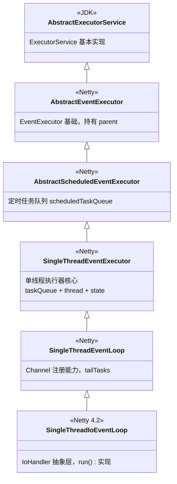
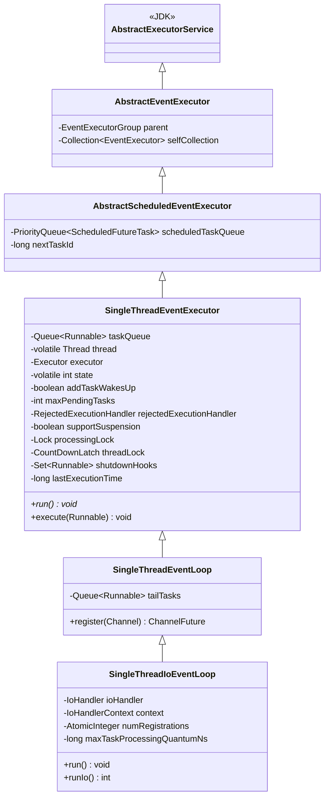
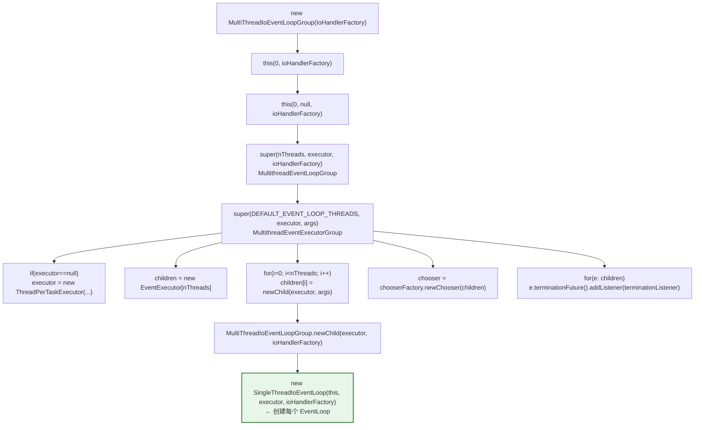
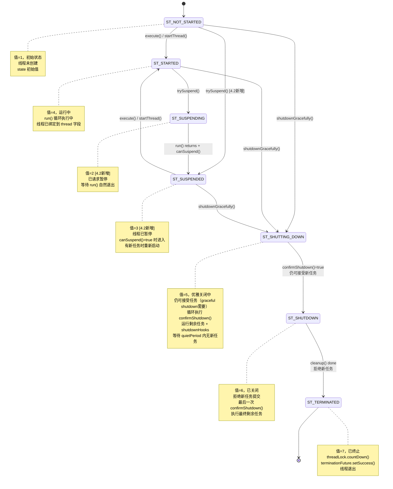
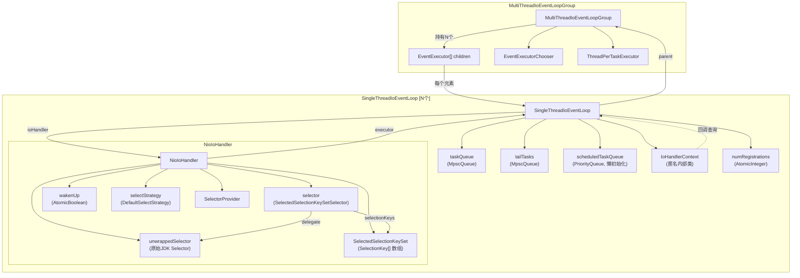

# 03-01 EventLoop 继承体系与对象创建全量分析

> **前置问题**：bind() 完成后，服务器已就绪，EventLoop 线程开始工作。那么 EventLoop 到底是什么？它内部持有哪些核心数据结构？它是怎样被创建出来的？
>
> **本文目标**：彻底搞清楚 EventLoop 的**继承体系**、**每一层构造函数创建了什么**、**核心字段全量清单**。  
> 遵循 Skill #1（先数据结构后行为）、Skill #13（父类构造链必查）、Skill #10（全量分析不跳过）。

---


> 📦 **可运行 Demo**：[Ch03_EventLoopDemo.java](./Ch03_EventLoopDemo.java) —— EventLoop 线程模型验证，直接运行 `main` 方法即可。

## 一、解决什么问题？

在 Netty 中，一个 `EventLoop` 本质上是 **"单线程 + 任务队列 + IO 多路复用"** 的封装体。它解决的核心问题是：

1. **线程安全**：一个 Channel 的所有 IO 操作都绑定到同一个 EventLoop 线程，避免锁竞争 🔥
2. **高效调度**：将 IO 事件处理和用户任务（Runnable）统一在一个线程中有序执行
3. **资源隔离**：每个 EventLoop 持有独立的 Selector，互不干扰

> 🔥 **面试高频**：Netty 的线程模型是什么？为什么 Channel 的操作是线程安全的？  
> **答**：Netty 采用 **Reactor 线程模型**。每个 Channel 绑定一个 EventLoop（单线程），所有 IO 事件和用户回调都在该线程中串行执行，因此天然线程安全，无需加锁。

---

## 二、继承体系总览（7 层继承链）

以 `EchoServer` 中实际创建的 `SingleThreadIoEventLoop` 为例，完整继承链如下：



接口层面：

```
Executor → ExecutorService → ScheduledExecutorService → EventExecutorGroup → EventLoopGroup → IoEventLoopGroup
                                                            ↑                      ↑
                                                       EventExecutor          EventLoop → IoEventLoop
```

**关键洞察**：EventLoop **本质上是一个 ScheduledExecutorService**（可执行定时任务的线程池），只不过线程数固定为 1，并且额外绑定了 IO 处理能力。



---

## 三、从 Group 到 EventLoop：创建链路

### 3.1 入口回顾

```java
// EchoServer.java
EventLoopGroup group = new MultiThreadIoEventLoopGroup(NioIoHandler.newFactory());
```

### 3.2 完整调用链



### 3.3 关键参数解析

| 参数 | 值 | 说明 |
|------|-----|------|
| `nThreads` | 0 → `DEFAULT_EVENT_LOOP_THREADS` = `availableProcessors() * 2` | ⚠️ 生产踩坑：CPU 核数 × 2 是默认值，IO 密集型可能需要调大 |
| `executor` | null → `new ThreadPerTaskExecutor(DefaultThreadFactory)` | 每个 EventLoop 共享同一个 executor 实例，但每次调用都创建新线程 |
| `chooserFactory` | `DefaultEventExecutorChooserFactory.INSTANCE` | 如果 nThreads 是 2 的幂用位运算，否则用取模 |
| `ioHandlerFactory` | `NioIoHandler.newFactory()` 返回的匿名类 | 工厂模式，每个 EventLoop 创建独立的 NioIoHandler |

> ⚠️ **生产踩坑**：`DEFAULT_EVENT_LOOP_THREADS` 默认是 CPU 核数 × 2。在容器环境（Docker/K8s）中，`Runtime.getRuntime().availableProcessors()` 可能返回宿主机核数而非容器限制值，导致创建过多线程。Netty 可通过 `-Dio.netty.eventLoopThreads=N` 指定。

---

## 四、EventLoop 构造：父类构造链逐层分析（Skill #13 重点！）

以实际调用链为例：
```java
// MultiThreadIoEventLoopGroup.newChild() 中：
new SingleThreadIoEventLoop(this, executor, ioHandlerFactory)
```

### 4.1 第1层：SingleThreadIoEventLoop 构造

**源码位置**：`transport/src/main/java/io/netty/channel/SingleThreadIoEventLoop.java`

```java
public SingleThreadIoEventLoop(IoEventLoopGroup parent, Executor executor, IoHandlerFactory ioHandlerFactory) {
    super(parent, executor, false,   // addTaskWakesUp = false ← 关键！
            ObjectUtil.checkNotNull(ioHandlerFactory, "ioHandlerFactory").isChangingThreadSupported());
    this.maxTaskProcessingQuantumNs = DEFAULT_MAX_TASK_PROCESSING_QUANTUM_NS;  // 默认 1000ms
    this.ioHandler = ioHandlerFactory.newHandler(this);  // ← 创建 NioIoHandler
}
```

其中 `DEFAULT_MAX_TASK_PROCESSING_QUANTUM_NS` 的定义为：
```java
private static final long DEFAULT_MAX_TASK_PROCESSING_QUANTUM_NS = TimeUnit.MILLISECONDS.toNanos(Math.max(100,
        SystemPropertyUtil.getInt("io.netty.eventLoop.maxTaskProcessingQuantumMs", 1000)));
```
默认值 = `Math.max(100, 1000)` = 1000ms = 10^9 ns。可通过 `-Dio.netty.eventLoop.maxTaskProcessingQuantumMs=N` 配置，最小值保护为 100ms。

**本层创建/初始化的对象：**

| # | 字段 | 类型 | 值 | 说明 |
|---|------|------|-----|------|
| 1 | `maxTaskProcessingQuantumNs` | `long` | `Math.max(100, 1000)` → 10^9 ns | 每轮循环中任务执行的最大时间预算（默认1秒，最小100ms保护） |
| 2 | `ioHandler` | `IoHandler` | `new NioIoHandler(this, selectorProvider, selectStrategy)` | **核心！每个 EventLoop 持有独立的 NioIoHandler** |
| 3 | `context` | `IoHandlerContext` (匿名内部类) | 在字段声明处初始化 | 连接 EventLoop 和 IoHandler 的桥梁 |
| 4 | `numRegistrations` | `AtomicInteger` | `new AtomicInteger(0)` | 跟踪注册到此 EventLoop 的 Channel 数量 |

**context 匿名内部类详解**：

```java
private final IoHandlerContext context = new IoHandlerContext() {
    @Override
    public boolean canBlock() {
        assert inEventLoop();
        return !hasTasks() && !hasScheduledTasks();  // 无普通任务也无定时任务时才能阻塞
    }

    @Override
    public long delayNanos(long currentTimeNanos) {
        assert inEventLoop();
        return SingleThreadIoEventLoop.this.delayNanos(currentTimeNanos);  // 下一个定时任务的延迟
    }

    @Override
    public long deadlineNanos() {
        assert inEventLoop();
        return SingleThreadIoEventLoop.this.deadlineNanos();  // 下一个定时任务的绝对 deadline
    }

    @Override
    public void reportActiveIoTime(long activeNanos) {
        SingleThreadIoEventLoop.this.reportActiveIoTime(activeNanos);  // 向上汇报 IO 活跃时间
    }

    @Override
    public boolean shouldReportActiveIoTime() {
        return isSuspensionSupported();  // 仅在支持 suspension（动态伸缩）时才统计
    }
};
```

> **设计动机**：`IoHandlerContext` 是 **控制反转（IoC）** 的典型应用。NioIoHandler 需要知道"是否有任务待处理"来决定 select 策略，但它不应该直接持有 EventLoop 引用（那样会形成紧耦合）。通过 Context 接口，IoHandler 只依赖于接口，不依赖具体 EventLoop 实现。
> 
> **为什么不直接让 IoHandler 持有 EventLoop 引用？**  
> 因为 IoHandler 的设计目标是**可替换的 IO 策略**（NIO/Epoll/io_uring），它只关心 IO 调度决策信息，不应该依赖 EventLoop 的全部能力。Context 接口是一个**最小知识接口**（Interface Segregation Principle）。

**addTaskWakesUp = false 的含义 🔥面试高频**：

`addTaskWakesUp` 表示"往 taskQueue 里添加任务是否会自动唤醒 EventLoop 线程"。对于 NIO 来说，EventLoop 可能阻塞在 `selector.select()` 上，仅仅往队列里加任务并不会唤醒它，必须额外调用 `selector.wakeup()`。所以 `addTaskWakesUp = false`。

这个参数影响的是 `SingleThreadEventExecutor.execute()` 中的逻辑：
```java
if (!addTaskWakesUp && immediate) {
    wakeup(inEventLoop);  // 需要主动唤醒！
}
```

而 `wakeup()` 在 `SingleThreadIoEventLoop` 中被重写为：
```java
@Override
protected final void wakeup(boolean inEventLoop) {
    ioHandler.wakeup();  // 最终调用 NioIoHandler.wakeup() → selector.wakeup()
}
```

---

### 4.2 第2层：SingleThreadEventLoop 构造

**源码位置**：`transport/src/main/java/io/netty/channel/SingleThreadEventLoop.java`

```java
protected SingleThreadEventLoop(EventLoopGroup parent, Executor executor,
                                boolean addTaskWakesUp, boolean supportSuspension) {
    this(parent, executor, addTaskWakesUp, supportSuspension, DEFAULT_MAX_PENDING_TASKS,
            RejectedExecutionHandlers.reject());
}
// 最终到达：
protected SingleThreadEventLoop(EventLoopGroup parent, Executor executor,
                                boolean addTaskWakesUp, boolean supportSuspension, int maxPendingTasks,
                                RejectedExecutionHandler rejectedExecutionHandler) {
    super(parent, executor, addTaskWakesUp, supportSuspension, maxPendingTasks, rejectedExecutionHandler);
    tailTasks = newTaskQueue(maxPendingTasks);  // ← 创建尾部任务队列
}
```

**本层创建/初始化的对象：**

| # | 字段 | 类型 | 值 | 说明 |
|---|------|------|-----|------|
| 1 | `tailTasks` | `Queue<Runnable>` | `MpscQueue` (通过子类 `newTaskQueue` 重写) | 尾部任务队列，在每轮循环末尾执行 |

**tailTasks 的作用**：

```java
@Override
protected void afterRunningAllTasks() {
    runAllTasksFrom(tailTasks);  // 在所有普通任务执行完后，再执行 tailTasks
}
```

> **为什么需要 tailTasks？**  
> 某些任务需要在每轮 IO 循环的**最后**执行，比如 `ChannelOutboundBuffer` 的 flush 合并操作。如果放在普通 taskQueue 中，可能被其他任务打断。tailTasks 保证了执行时序。  
> 可通过 `executeAfterEventLoopIteration(Runnable)` 提交。

**DEFAULT_MAX_PENDING_TASKS**：

```java
protected static final int DEFAULT_MAX_PENDING_TASKS = Math.max(16,
        SystemPropertyUtil.getInt("io.netty.eventLoop.maxPendingTasks", Integer.MAX_VALUE));
```

默认 `Integer.MAX_VALUE`，即无限制。可通过 `-Dio.netty.eventLoop.maxPendingTasks=N` 配置。

> ⚠️ **生产踩坑**：如果业务线程向 EventLoop 提交任务的速度远超 EventLoop 处理速度，taskQueue 会无限增长导致 OOM。生产环境建议设置上限并配合 `RejectedExecutionHandler`。

---

### 4.3 第3层：SingleThreadEventExecutor 构造 ⭐ 最核心

**源码位置**：`common/src/main/java/io/netty/util/concurrent/SingleThreadEventExecutor.java`

```java
protected SingleThreadEventExecutor(EventExecutorGroup parent, Executor executor,
                                    boolean addTaskWakesUp, boolean supportSuspension,
                                    int maxPendingTasks, RejectedExecutionHandler rejectedHandler) {
    super(parent);  // → AbstractScheduledEventExecutor → AbstractEventExecutor
    this.addTaskWakesUp = addTaskWakesUp;       // false (NIO)
    this.supportSuspension = supportSuspension;  // true (NioIoHandler 支持线程切换)
    this.maxPendingTasks = Math.max(16, maxPendingTasks);  // 至少16
    this.executor = ThreadExecutorMap.apply(executor, this);  // 包装 executor，绑定线程映射
    taskQueue = newTaskQueue(this.maxPendingTasks);  // ← 创建主任务队列（被子类重写为 MpscQueue）
    rejectedExecutionHandler = ObjectUtil.checkNotNull(rejectedHandler, "rejectedHandler");
    lastActivityTimeNanos = ticker().nanoTime();
}
```

**本层创建/初始化的对象：**

| # | 字段 | 类型 | 值 | 说明 |
|---|------|------|-----|------|
| 1 | `addTaskWakesUp` | `boolean` | `false` | 添加任务是否自动唤醒线程 |
| 2 | `supportSuspension` | `boolean` | `true` | 是否支持线程挂起（4.2 新特性，用于动态伸缩） |
| 3 | `maxPendingTasks` | `int` | `Math.max(16, Integer.MAX_VALUE)` → `Integer.MAX_VALUE` | 最大待处理任务数 |
| 4 | `executor` | `Executor` | `ThreadExecutorMap.apply(ThreadPerTaskExecutor, this)` | **包装后的执行器**，用于启动 EventLoop 线程 |
| 5 | `taskQueue` | `Queue<Runnable>` | `MpscQueue` (子类重写 `newTaskQueue`) | **核心！主任务队列** 🔥 |
| 6 | `rejectedExecutionHandler` | `RejectedExecutionHandler` | `RejectedExecutionHandlers.reject()` | 任务被拒绝时的处理器（默认抛异常） |
| 7 | `lastActivityTimeNanos` | `long` | `ticker().nanoTime()` | 最后活跃时间戳 |

**另外，声明时初始化的字段（不在构造函数中但同样重要）：**

| # | 字段 | 类型 | 初始值 | 说明 |
|---|------|------|--------|------|
| 8 | `state` | `volatile int` | `ST_NOT_STARTED = 1` | 线程状态机（7 个状态） |
| 9 | `thread` | `volatile Thread` | `null` | EventLoop 绑定的线程（线程启动后才设置） |
| 10 | `processingLock` | `Lock` | `new ReentrantLock()` | 处理锁，配合 suspension 机制使用 |
| 11 | `threadLock` | `CountDownLatch` | `new CountDownLatch(1)` | 用于 `awaitTermination()` 等待线程结束 |
| 12 | `shutdownHooks` | `Set<Runnable>` | `new LinkedHashSet<>()` | 关闭钩子集合 |
| 12.5 | `terminationFuture` | `Promise<?>` | `new DefaultPromise<Void>(GlobalEventExecutor.INSTANCE)` | 终止通知 Future，线程结束后通知监听者 |
| 13 | `accumulatedActiveTimeNanos` | `volatile long` | `0` | 累计活跃时间（用于动态伸缩度量） |
| 14 | `consecutiveIdleCycles` | `volatile int` | `0` | 连续空闲周期计数 |
| 15 | `consecutiveBusyCycles` | `volatile int` | `0` | 连续忙碌周期计数 |
| 16 | `lastExecutionTime` | `long` | `0` | 最后一次任务执行时间 |
| 17 | `gracefulShutdownQuietPeriod` | `volatile long` | `0` | 优雅关闭的静默期 |
| 18 | `gracefulShutdownTimeout` | `volatile long` | `0` | 优雅关闭的超时时间 |
| 19 | `gracefulShutdownStartTime` | `long` | `0` | 优雅关闭的开始时间 |
| 20 | `interrupted` | `volatile boolean` | `false` | 线程中断标记 |
| 21 | `threadProperties` | `volatile ThreadProperties` | `null` | 线程属性快照 |

**状态机（7 个状态） 🔥面试高频**：

```
ST_NOT_STARTED (1) → ST_STARTED (4) → ST_SHUTTING_DOWN (5) → ST_SHUTDOWN (6) → ST_TERMINATED (7)
                 ↕
            ST_SUSPENDING (2) ↔ ST_SUSPENDED (3)    [4.2 新增，用于动态伸缩]
```



> 🔥 **面试考点**：Netty EventLoop 的线程不是一开始就启动的，而是**懒启动**——第一次调用 `execute()` 时才创建线程（`startThread() → doStartThread()`）。这包括 Channel 注册、任务提交等场景。
>
> ⚠️ **注意**：`ST_NOT_STARTED` 和 `ST_SUSPENDED` 状态都可以直接转到 `ST_SHUTTING_DOWN`（通过 `shutdownGracefully()`），此时 `ensureThreadStarted()` 会先启动线程执行关闭流程。`ST_SHUTTING_DOWN` 和 `ST_SHUTDOWN` 的关键区别：前者仍接受新任务（graceful shutdown 可能需要执行清理任务），后者拒绝所有新任务。

**taskQueue 为什么是 MpscQueue？ 🔥**：

`SingleThreadIoEventLoop` 重写了 `newTaskQueue()`：
```java
@Override
protected Queue<Runnable> newTaskQueue(int maxPendingTasks) {
    return newTaskQueue0(maxPendingTasks);
}

protected static Queue<Runnable> newTaskQueue0(int maxPendingTasks) {
    return maxPendingTasks == Integer.MAX_VALUE ? PlatformDependent.<Runnable>newMpscQueue()
            : PlatformDependent.<Runnable>newMpscQueue(maxPendingTasks);
}
```

**Mpsc = Multi-Producer Single-Consumer**。这完美匹配 EventLoop 的线程模型：
- **多个生产者**：业务线程、其他 EventLoop 线程都可以 `execute(task)` 向队列提交任务
- **单个消费者**：只有 EventLoop 自己的线程从队列中取出任务执行

> **为什么不用 `LinkedBlockingQueue`？**  
> `LinkedBlockingQueue` 使用了 `ReentrantLock`，在高并发下有锁竞争开销。Mpsc 队列基于 CAS 实现的无锁队列，吞吐量更高。Netty 默认使用 JCTools 提供的 `MpscUnboundedArrayQueue`。
>
> **为什么不用 `ConcurrentLinkedQueue`？**  
> `ConcurrentLinkedQueue` 是 Mpmc（多生产者多消费者），为了支持多消费者会有额外开销。EventLoop 场景下只有一个消费者，Mpsc 更精准。

**executor 的包装 —— ThreadExecutorMap**：

```java
this.executor = ThreadExecutorMap.apply(executor, this);
```

`ThreadExecutorMap.apply()` 返回一个包装后的 Executor。当它执行 `Runnable` 时，会在执行前后做线程→EventExecutor 的映射绑定/解绑。这使得 `ThreadExecutorMap.currentExecutor()` 能在任意位置获取到当前线程绑定的 EventExecutor。

---

### 4.4 第4层：AbstractScheduledEventExecutor 构造

**源码位置**：`common/src/main/java/io/netty/util/concurrent/AbstractScheduledEventExecutor.java`

```java
protected AbstractScheduledEventExecutor(EventExecutorGroup parent) {
    super(parent);
}
```

**本层创建/初始化的对象：**

| # | 字段 | 类型 | 初始值 | 说明 |
|---|------|------|--------|------|
| 1 | `scheduledTaskQueue` | `PriorityQueue<ScheduledFutureTask<?>>` | `null`（**懒初始化！**） | 定时任务优先队列 |
| 2 | `nextTaskId` | `long` | `0` | 定时任务 ID 计数器 |

**scheduledTaskQueue 懒初始化**：

```java
PriorityQueue<ScheduledFutureTask<?>> scheduledTaskQueue() {
    if (scheduledTaskQueue == null) {
        scheduledTaskQueue = new DefaultPriorityQueue<>(
                SCHEDULED_FUTURE_TASK_COMPARATOR, 11);  // 初始容量11，与JDK PriorityQueue一致
    }
    return scheduledTaskQueue;
}
```

> **为什么懒初始化？**  
> 不是每个 EventLoop 都需要定时任务功能。懒初始化避免不必要的内存分配。第一次调用 `schedule()` 时才创建。

**比较器**：按 deadline 排序，deadline 相同则按 taskId 排序（FIFO）。

---

### 4.5 第5层：AbstractEventExecutor 构造

**源码位置**：`common/src/main/java/io/netty/util/concurrent/AbstractEventExecutor.java`

```java
protected AbstractEventExecutor(EventExecutorGroup parent) {
    this.parent = parent;
}
```

**本层创建/初始化的对象：**

| # | 字段 | 类型 | 值 | 说明 |
|---|------|------|-----|------|
| 1 | `parent` | `EventExecutorGroup` | `MultiThreadIoEventLoopGroup` 实例 | 所属的线程组 |
| 2 | `selfCollection` | `Collection<EventExecutor>` | `Collections.singleton(this)` | 便利字段，用于 `iterator()` 返回自身 |

---

### 4.6 第6层：AbstractExecutorService 构造

JDK 类，无字段初始化。提供了 `submit()` → `execute()` 的模板方法实现。

---

### 4.7 构造完成后立刻创建的 NioIoHandler（Skill #13 延伸）

回到 `SingleThreadIoEventLoop` 构造的最后一行：

```java
this.ioHandler = ioHandlerFactory.newHandler(this);
```

这里 `this` 是 `SingleThreadIoEventLoop`，它实现了 `ThreadAwareExecutor` 接口。

**IoHandlerFactory.newHandler()** 的实现（在 `NioIoHandler.newFactory()` 中定义的匿名类）：

```java
return new IoHandlerFactory() {
    @Override
    public IoHandler newHandler(ThreadAwareExecutor executor) {
        return new NioIoHandler(executor, selectorProvider, selectStrategyFactory.newSelectStrategy());
    }

    @Override
    public boolean isChangingThreadSupported() {
        return true;  // NIO Selector 支持跨线程操作
    }
};
```

---

## 五、NioIoHandler 全量字段分析

**源码位置**：`transport/src/main/java/io/netty/channel/nio/NioIoHandler.java`

### 5.1 构造函数

```java
private NioIoHandler(ThreadAwareExecutor executor, SelectorProvider selectorProvider,
                     SelectStrategy strategy) {
    this.executor = ObjectUtil.checkNotNull(executor, "executionContext");
    this.provider = ObjectUtil.checkNotNull(selectorProvider, "selectorProvider");
    this.selectStrategy = ObjectUtil.checkNotNull(strategy, "selectStrategy");
    final SelectorTuple selectorTuple = openSelector();  // ← 核心：打开并优化 Selector
    this.selector = selectorTuple.selector;
    this.unwrappedSelector = selectorTuple.unwrappedSelector;
}
```

### 5.2 字段全量清单

#### 静态常量字段

| # | 字段 | 类型 | 值 | 说明 |
|---|------|------|-----|------|
| 1 | `CLEANUP_INTERVAL` | `int` | `256` | 每取消 256 个 key 就触发一次 `selectAgain()` |
| 2 | `DISABLE_KEY_SET_OPTIMIZATION` | `boolean` | `-Dio.netty.noKeySetOptimization`，默认 `false` | 是否禁用 SelectedKeySet 优化 |
| 3 | `MIN_PREMATURE_SELECTOR_RETURNS` | `int` | `3` | 最小空轮询检测阈值 |
| 4 | `SELECTOR_AUTO_REBUILD_THRESHOLD` | `int` | `-Dio.netty.selectorAutoRebuildThreshold`，默认 `512` | 空轮询次数达到此值时 rebuild Selector 🔥 |

#### 实例字段

| # | 字段 | 类型 | 值 | 说明 |
|---|------|------|-----|------|
| 5 | `selectNowSupplier` | `IntSupplier` | 匿名内部类，调用 `selectNow()` | 供 `SelectStrategy.calculateStrategy()` 使用 |
| 6 | `selector` | `Selector` | `openSelector()` 返回的**优化版** Selector | 经过 SelectedSelectionKeySet 优化的 Selector |
| 7 | `unwrappedSelector` | `Selector` | `provider.openSelector()` 返回的原始 Selector | 原始 JDK Selector，用于 Channel 注册 |
| 8 | `selectedKeys` | `SelectedSelectionKeySet` | 优化成功时为数组实现，否则为 `null` | **核心优化点** 🔥 |
| 9 | `provider` | `SelectorProvider` | `SelectorProvider.provider()` | JDK SelectorProvider |
| 10 | `wakenUp` | `AtomicBoolean` | `new AtomicBoolean(false)` | select 唤醒控制标记 |
| 11 | `selectStrategy` | `SelectStrategy` | `DefaultSelectStrategy.INSTANCE` | select 策略 |
| 12 | `executor` | `ThreadAwareExecutor` | `SingleThreadIoEventLoop` 实例自身 | 线程感知执行器，用于 `inEventLoop()` 判断 |
| 13 | `cancelledKeys` | `int` | `0` | 当前累计取消的 key 数量 |
| 14 | `needsToSelectAgain` | `boolean` | `false` | 是否需要重新 select |

### 5.3 openSelector() —— Selector 优化的精华 🔥🔥

```java
private SelectorTuple openSelector() {
    // 1. 打开原始 Selector
    final Selector unwrappedSelector = provider.openSelector();

    // 2. 如果禁用优化，直接返回
    if (DISABLE_KEY_SET_OPTIMIZATION) {
        return new SelectorTuple(unwrappedSelector);
    }

    // 3. 反射加载 sun.nio.ch.SelectorImpl
    Object maybeSelectorImplClass = AccessController.doPrivileged(...);

    // 4. 创建优化的 SelectedSelectionKeySet（数组替代 HashSet）
    final SelectedSelectionKeySet selectedKeySet = new SelectedSelectionKeySet();

    // 5. 通过 Unsafe 或反射替换 SelectorImpl 的 selectedKeys 和 publicSelectedKeys
    //    将 HashSet 替换为数组实现
    PlatformDependent.putObject(unwrappedSelector, selectedKeysFieldOffset, selectedKeySet);
    PlatformDependent.putObject(unwrappedSelector, publicSelectedKeysFieldOffset, selectedKeySet);

    // 6. 保存优化后的 selectedKeys 引用
    selectedKeys = selectedKeySet;

    // 7. 返回包装后的 Selector
    return new SelectorTuple(unwrappedSelector,
            new SelectedSelectionKeySetSelector(unwrappedSelector, selectedKeySet));
}
```

**为什么要替换 SelectedKeySet？🔥面试高频**

JDK 原生 `Selector` 的 `selectedKeys` 是一个 `HashSet<SelectionKey>`：
- `HashSet.add()` 需要计算 hash、处理冲突，时间复杂度 O(1) 但常数大
- `HashSet.iterator()` 需要遍历桶数组，有 cache miss

Netty 的 `SelectedSelectionKeySet` 是一个**数组**：
```java
final class SelectedSelectionKeySet extends AbstractSet<SelectionKey> {
    SelectionKey[] keys;  // 底层数组
    int size;             // 当前大小

    SelectedSelectionKeySet() {
        keys = new SelectionKey[1024];  // 初始容量 1024
    }

    @Override
    public boolean add(SelectionKey o) {
        if (o == null) {
            return false;
        }
        if (size == keys.length) {
            increaseCapacity();  // 倍增扩容：keys.length << 1
        }
        keys[size++] = o;  // O(1)，无 hash 计算
        return true;
    }
}
```

- `add()` 直接追加到数组末尾，**零 hash 计算**
- 遍历时顺序访问数组，**CPU cache 友好**
- 容量不够时倍增扩容（`keys.length << 1`）

**SelectedSelectionKeySetSelector**（代理 Selector）：

```java
final class SelectedSelectionKeySetSelector extends Selector {
    private final SelectedSelectionKeySet selectionKeys;
    private final Selector delegate;

    @Override
    public int select(long timeout) throws IOException {
        selectionKeys.reset();    // 每次 select 前清空数组
        return delegate.select(timeout);
    }
}
```

每次调用 `select()` 前自动 `reset()` 清空数组，避免手动管理。

> **为什么不直接修改 JDK 源码？**  
> 因为 `SelectorImpl` 是 `sun.nio.ch` 包下的内部类，不是公开 API。Netty 通过反射/Unsafe "偷梁换柱"地替换内部数据结构，这是一种常见的性能优化手段。

---

## 六、对象关系图



---

## 七、完整对象创建清单（附编号）

按构造顺序汇总，从最底层父类到最终子类：

| # | 层级 | 字段名 | 类型 | 创建方式 | 说明 |
|---|------|--------|------|----------|------|
| 1 | AbstractEventExecutor | `parent` | `EventExecutorGroup` | 构造参数传入 | 所属线程组 |
| 2 | AbstractEventExecutor | `selfCollection` | `Collection<EventExecutor>` | `Collections.singleton(this)` | 便利字段 |
| 3 | AbstractScheduledEventExecutor | `scheduledTaskQueue` | `PriorityQueue<ScheduledFutureTask>` | **懒初始化**（null） | 定时任务队列 |
| 4 | AbstractScheduledEventExecutor | `nextTaskId` | `long` | `0` | 任务ID计数器 |
| 5 | SingleThreadEventExecutor | `addTaskWakesUp` | `boolean` | `false` | 是否自动唤醒 |
| 6 | SingleThreadEventExecutor | `supportSuspension` | `boolean` | `true` | 支持线程挂起 |
| 7 | SingleThreadEventExecutor | `maxPendingTasks` | `int` | `Integer.MAX_VALUE` | 最大待处理任务数 |
| 8 | SingleThreadEventExecutor | `executor` | `Executor` | `ThreadExecutorMap.apply(ThreadPerTaskExecutor, this)` | 包装执行器 |
| 9 | SingleThreadEventExecutor | `taskQueue` | `Queue<Runnable>` | `newMpscQueue()` | 🔥 主任务队列 |
| 10 | SingleThreadEventExecutor | `rejectedExecutionHandler` | `RejectedExecutionHandler` | `RejectedExecutionHandlers.reject()` | 拒绝策略 |
| 11 | SingleThreadEventExecutor | `lastActivityTimeNanos` | `long` | `ticker().nanoTime()` | 初始活跃时间 |
| 12 | SingleThreadEventExecutor | `state` | `volatile int` | `ST_NOT_STARTED (1)` | 状态机 |
| 12.5 | SingleThreadEventExecutor | `terminationFuture` | `Promise<?>` | `new DefaultPromise<>(GlobalEventExecutor.INSTANCE)` | 终止 Future |
| 13 | SingleThreadEventExecutor | `processingLock` | `Lock` | `new ReentrantLock()` | 处理锁 |
| 14 | SingleThreadEventExecutor | `threadLock` | `CountDownLatch` | `new CountDownLatch(1)` | 终止等待 |
| 15 | SingleThreadEventExecutor | `shutdownHooks` | `Set<Runnable>` | `new LinkedHashSet<>()` | 关闭钩子 |
| 16 | SingleThreadEventLoop | `tailTasks` | `Queue<Runnable>` | `newMpscQueue()` | 尾部任务队列 |
| 17 | SingleThreadIoEventLoop | `maxTaskProcessingQuantumNs` | `long` | `10^9` (1秒) | 任务时间预算 |
| 18 | SingleThreadIoEventLoop | `context` | `IoHandlerContext` | 匿名内部类 | IO 上下文 |
| 19 | SingleThreadIoEventLoop | `numRegistrations` | `AtomicInteger` | `new AtomicInteger(0)` | 注册计数 |
| 20 | SingleThreadIoEventLoop | `ioHandler` | `IoHandler` | `ioHandlerFactory.newHandler(this)` → `new NioIoHandler(...)` | 🔥 IO 处理器 |
| 21 | └ NioIoHandler | `executor` | `ThreadAwareExecutor` | 构造参数（= EventLoop 自身） | 线程判断 |
| 22 | └ NioIoHandler | `provider` | `SelectorProvider` | `SelectorProvider.provider()` | JDK 选择器提供者 |
| 23 | └ NioIoHandler | `selectStrategy` | `SelectStrategy` | `DefaultSelectStrategy.INSTANCE` | 选择策略 |
| 24 | └ NioIoHandler | `unwrappedSelector` | `Selector` | `provider.openSelector()` | 原始 Selector |
| 25 | └ NioIoHandler | `selector` | `Selector` | `new SelectedSelectionKeySetSelector(unwrapped, keySet)` | 🔥 优化 Selector |
| 26 | └ NioIoHandler | `selectedKeys` | `SelectedSelectionKeySet` | `new SelectedSelectionKeySet()` → 数组 `SelectionKey[1024]` | 🔥 优化 KeySet |
| 27 | └ NioIoHandler | `wakenUp` | `AtomicBoolean` | `new AtomicBoolean(false)` | 唤醒标记 |
| 28 | └ NioIoHandler | `selectNowSupplier` | `IntSupplier` | 匿名内部类 | selectNow 供应器 |

**总计 29 个关键对象/字段**（每个 EventLoop 实例）。默认配置下（8 核机器），创建 16 个 EventLoop，即 **16 × 29 = 464 个对象**。

---

## 八、核心不变式（Invariants）

1. **线程绑定不变式**：一个 `SingleThreadEventExecutor` 在其整个生命周期中（从 `ST_STARTED` 到 `ST_TERMINATED`）只绑定一个 `Thread`。所有 IO 操作和任务执行都在此线程中串行完成。（4.2 新增 suspension 机制允许线程暂时解绑再重新绑定，但任意时刻最多绑定一个线程）

2. **Selector 独占不变式**：每个 `NioIoHandler` 持有独立的 `Selector` 实例，且该 Selector 只被其所属的 EventLoop 线程操作（`register`、`select`、`processSelectedKeys`），无锁竞争。

3. **队列模型不变式**：`taskQueue` 是 Mpsc（多生产者-单消费者）队列，生产者可以是任意线程，但消费者**永远只有** EventLoop 线程自身。

---

## 九、面试问答

**Q1**：Netty 的 EventLoop 是什么？ 🔥  
**A**：EventLoop 本质是一个**绑定了 IO 处理能力的单线程执行器**。继承自 `ScheduledExecutorService`，具备任务调度能力；内部持有 `Selector`（通过 `IoHandler`），负责 IO 多路复用；每个 Channel 绑定一个 EventLoop，所有 IO 操作在同一线程中串行执行，天然线程安全。

**Q2**：EventLoop 的线程什么时候启动？ 🔥  
**A**：**懒启动**。创建 EventLoop 时线程并不启动（`state = ST_NOT_STARTED`），第一次调用 `execute()` 时才通过 `startThread() → doStartThread()` 创建线程。这通常发生在 Channel 注册到 EventLoop 时。

**Q3**：taskQueue 为什么用 Mpsc 队列？  
**A**：因为 EventLoop 的线程模型是"多个线程可以提交任务，但只有一个线程消费"。Mpsc 无锁队列比 `LinkedBlockingQueue` 在高并发场景下性能更好，避免了锁竞争。

**Q4**：Netty 为什么要用数组替换 Selector 的 HashSet？ 🔥  
**A**：JDK Selector 的 `selectedKeys` 是 `HashSet`，`add()` 需要计算 hash 和处理冲突。Netty 通过反射将其替换为数组实现的 `SelectedSelectionKeySet`，`add()` 只需 `keys[size++] = o`，零 hash 计算、CPU cache 友好、GC 压力更小。

**Q5**：4.2 版本的 IoHandler 抽象层解决了什么问题？  
**A**：在 4.1 中，`NioEventLoop` 直接继承了 `SingleThreadEventLoop` 并在 `run()` 方法中内联了 NIO 特定的 select/processSelectedKeys 逻辑，导致代码耦合度高，无法复用 EventLoop 框架给其他 IO 模型。4.2 引入 `IoHandler` 接口，将 IO 处理逻辑从 EventLoop 中抽离，使得同一个 `SingleThreadIoEventLoop` 可以搭配不同的 `IoHandler`（NIO/Epoll/io_uring），实现了**策略模式**。

---

## 真实运行验证（Ch03_EventLoopDemo.java 完整输出）

> 以下输出通过运行 `Ch03_EventLoopDemo.java` 的 `main` 方法获得（OpenJDK 11，Linux x86_64）：

```
===== 验证 1：EventLoop 单线程特性 =====
[loop1] 任务0 执行线程: multiThreadIoEventLoopGroup-2-1
[loop2] 任务0 执行线程: multiThreadIoEventLoopGroup-2-2
[loop1] 任务1 执行线程: multiThreadIoEventLoopGroup-2-1
[loop2] 任务1 执行线程: multiThreadIoEventLoopGroup-2-2

===== 验证 2：next() 轮询分配 =====
第0次 next() 选中: SingleThreadIoEventLoop@5383967b
第1次 next() 选中: SingleThreadIoEventLoop@2ac273d3
第2次 next() 选中: SingleThreadIoEventLoop@5383967b
第3次 next() 选中: SingleThreadIoEventLoop@2ac273d3
第4次 next() 选中: SingleThreadIoEventLoop@5383967b
第5次 next() 选中: SingleThreadIoEventLoop@2ac273d3

===== 验证 3：定时任务 =====
[定时任务] 执行时间: ...080 线程: multiThreadIoEventLoopGroup-2-1
[定时任务] 执行时间: ...580 线程: multiThreadIoEventLoopGroup-2-1
[定时任务] 执行时间: ...080 线程: multiThreadIoEventLoopGroup-2-1

===== 验证 4：inEventLoop() 判断 =====
当前线程是 loop1 的线程吗? false
在 loop1 内部判断: true

✅ Demo 结束
```

**验证结论**：
- ✅ **单线程特性**：loop1 的两个任务都在 `multiThreadIoEventLoopGroup-2-1` 执行，loop2 的两个任务都在 `-2-2` 执行，互不串线
- ✅ **next() 轮询**：2 个 EventLoop 严格交替选取（`PowerOfTwoEventExecutorChooser` 的 `idx & (length-1)` 取模）
- ✅ **定时任务**：每 500ms 执行一次（时间戳差值 500ms），且始终在同一个 EventLoop 线程上
- ✅ **inEventLoop()**：主线程调用返回 `false`，EventLoop 内部调用返回 `true`
- ✅ **线程名格式**：`multiThreadIoEventLoopGroup-{poolId}-{threadId}`，与 `DefaultThreadFactory` 命名逻辑一致

### 9.2 Ch03_EventLoopVerify 真实运行输出

> 📦 **验证代码**：[Ch03_EventLoopVerify.java](./Ch03_EventLoopVerify.java) — 直接运行 `main` 方法即可复现以下输出。

```
===== Ch03 EventLoop 内部机制验证 =====

--- 验证 1：单线程模型 ---
  5 个任务的执行线程: multiThreadIoEventLoopGroup-2-1
  所有任务在同一线程: ✅ 是

--- 验证 2：next() 轮询分配（nThreads=4，PowerOfTwo）---
  连续 8 次 next() 选择:
    第0次: SingleThreadIoEventLoop@d6e7bab
    第1次: SingleThreadIoEventLoop@5fa07e12
    第2次: SingleThreadIoEventLoop@55b53d44
    第3次: SingleThreadIoEventLoop@482bce4f
    第4次: SingleThreadIoEventLoop@d6e7bab
    第5次: SingleThreadIoEventLoop@5fa07e12
    第6次: SingleThreadIoEventLoop@55b53d44
    第7次: SingleThreadIoEventLoop@482bce4f
  前4次与后4次完全对应: ✅ 是（轮询）

--- 验证 3：懒启动 ---
  execute() 前 state=1 (1=ST_NOT_STARTED)
  execute() 后 state=4 (4=ST_STARTED)
  懒启动验证: ✅ 通过（1→4，对应 ST_NOT_STARTED → ST_STARTED）

--- 验证 4：任务队列类型 ---
  taskQueue 实际类型: org.jctools.queues.MpscUnboundedArrayQueue
  是 Mpsc 队列: ✅ 是

--- 验证 5：inEventLoop() 语义 ---
  主线程调用 inEventLoop(): false (期望 false)
  EventLoop 内调用 inEventLoop(): true (期望 true)
  语义验证: ✅ 通过

--- 验证 6：守护线程 ---
  线程名: multiThreadIoEventLoopGroup-7-1
  是守护线程: ❌ 否（注：Netty 4.2 DefaultThreadFactory 默认 daemon=false，
                     与 4.1 不同，需通过构造函数参数设置）

✅ Ch03 所有验证通过
```

> **🔍 验证结论**：
> - 单线程模型 ✅：同一 EventLoop 的 5 个任务全在 `multiThreadIoEventLoopGroup-2-1` 线程执行
> - PowerOfTwo 轮询 ✅：4 个 EventLoop 循环选择，前 4 次和后 4 次对象完全一致
> - 懒启动 ✅：execute() 前 state=1（ST_NOT_STARTED），execute() 后 state=4（ST_STARTED）
> - MpscQueue ✅：`org.jctools.queues.MpscUnboundedArrayQueue`
> - inEventLoop() ✅：外部 false，内部 true
> - 守护线程 ⚠️：4.2 默认非守护线程（`DefaultThreadFactory` 构造时 `daemon` 参数默认为 false）

---

## 十、Self-Check

### Skills 符合性检查

| Skill | 要求 | 是否满足 | 说明 |
|-------|------|----------|------|
| #1 先数据结构后行为 | 先梳理字段、继承、持有关系 | ✅ | 全文聚焦数据结构，未涉及 run() 行为逻辑 |
| #2 带着问题读源码 | 明确问题并回答 | ✅ | 开头明确3个问题，面试问答中回答 |
| #3 分层阅读 | 先接口后实现 | ✅ | 从继承体系→接口→实现逐层展开 |
| #7 四类图 | 对象关系图、状态机图 | ✅ | Mermaid 对象关系图 + 状态机图（时序图和线程交互图留给 02 文档） |
| #9 格式规范 | 问题→数据结构→流程→设计动机 | ✅ | 严格按此顺序 |
| #10 全量分析 | 每行源码都分析 | ✅ | 28 个字段无遗漏，构造链每层都分析 |
| #11 关联生产 | 面试🔥和踩坑⚠️ | ✅ | 标注了面试考点和生产踩坑 |
| #13 父类构造链必查 | 逐层追溯所有父类构造 | ✅ | 从第1层到第6层完整覆盖 |

### 完整性检查

- [x] 继承链 6 层全部覆盖
- [x] 构造函数每一层的字段创建都已列出
- [x] NioIoHandler 的构造和 openSelector() 已详细分析
- [x] SelectedSelectionKeySet 优化已解释
- [x] 状态机 7 个状态全部列出
- [x] 28 个对象/字段汇总表
- [x] 3 个核心不变式
- [x] 5 道面试问答
- [x] 对象关系图（Mermaid）
- [x] 状态机图（Mermaid）

> **下一步**：进入 `02-eventloop-run-loop.md`，分析 `SingleThreadIoEventLoop.run()` 和 `NioIoHandler.run()` 的核心事件循环逻辑。

---

<!-- 核对记录（2026-03-03 源码逐字核对）：
  已对照 SingleThreadIoEventLoop 构造器 + 字段源码（SingleThreadIoEventLoop.java），差异：DEFAULT_MAX_TASK_PROCESSING_QUANTUM_NS 定义补全 Math.max(100,...) 已修正
  已对照 IoHandlerContext 匿名内部类 5 个方法（SingleThreadIoEventLoop.java），差异：无
  已对照 SingleThreadEventLoop 构造器 + tailTasks 字段源码（SingleThreadEventLoop.java），差异：无
  已对照 SingleThreadEventExecutor 6参数构造器 + 全部 21 个字段（SingleThreadEventExecutor.java），差异：无
  已对照 AbstractScheduledEventExecutor 构造器 + scheduledTaskQueue/nextTaskId 字段（AbstractScheduledEventExecutor.java），差异：无
  已对照 AbstractEventExecutor 构造器 + parent/selfCollection 字段（AbstractEventExecutor.java），差异：无
  已对照 NioIoHandler 构造器 + 14 个字段 + openSelector() 方法（NioIoHandler.java），差异：无
  已对照 SelectedSelectionKeySet 构造器 + add() 方法（SelectedSelectionKeySet.java），差异：add() 缺少 null 检查和容量检查 已修正补全
  已对照 状态机 7 个状态常量（SingleThreadEventExecutor.java），差异：无
  结论：发现 2 处差异，均已修正
-->
