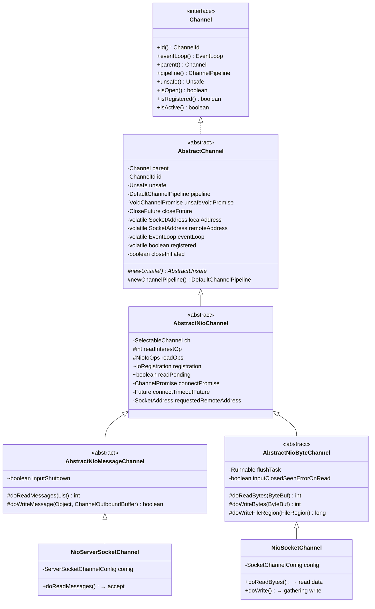
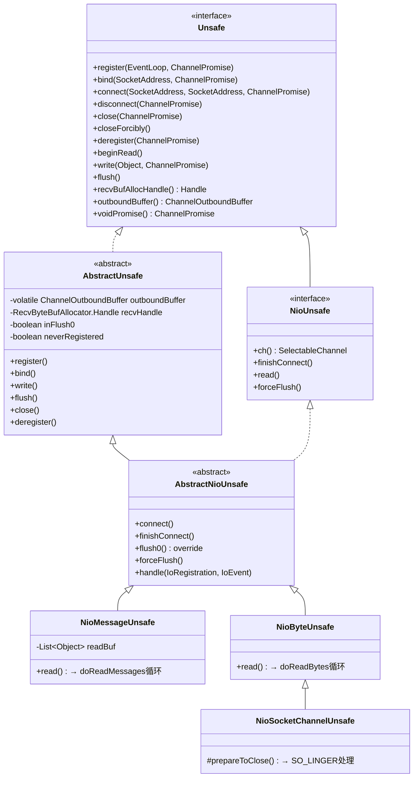
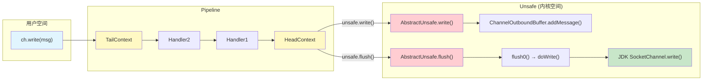
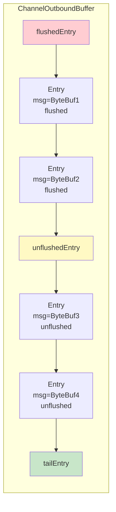
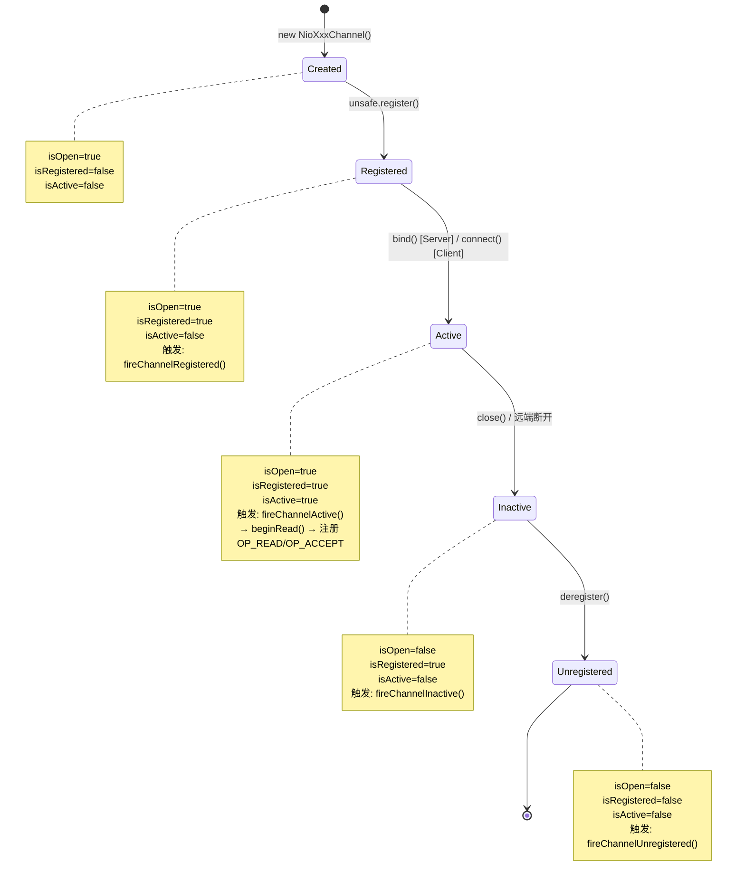
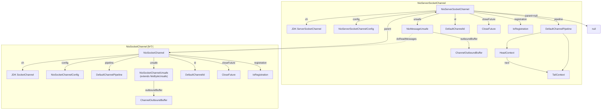

# 04-01 Channel 继承体系与核心数据结构全量分析

> **前置问题**：EventLoop 的 `processSelectedKey()` 会调用 `unsafe.read()`、`forceFlush()` 等方法。那么 Channel 是什么？Unsafe 又是什么？它们分别持有哪些核心数据结构？为什么要分成 Channel + Unsafe 两层？
>
> **本文目标**：彻底搞清楚 Channel 的**继承体系**、**每一层的核心字段**、**Unsafe 的继承体系与职责划分**、以及 **Channel 状态机**。
> 遵循 Skill #1（先数据结构后行为）、Skill #13（父类构造链必查）、Skill #10（全量分析不跳过）、Skill #14（Mermaid 绘图）。

---

## 一、解决什么问题？

在 Netty 中，`Channel` 是对**网络连接的抽象**。它解决的核心问题是：

1. **统一 IO 抽象**：无论底层是 NIO、Epoll 还是 io_uring，上层用户代码只面对 `Channel` 接口 🔥
2. **异步 IO 模型**：所有 IO 操作（read/write/connect/bind/close）都是异步的，返回 `ChannelFuture`
3. **层次化结构**：ServerSocketChannel accept 出的 SocketChannel，其 `parent()` 就是 ServerSocketChannel
4. **分层职责**：Channel 面向用户 → Pipeline 处理事件链 → Unsafe 执行真正的底层 IO

> 🔥 **面试高频**：Netty 的 Channel 和 JDK 的 `java.nio.channels.Channel` 有什么区别？
> **答**：JDK Channel 是对 IO 操作的底层抽象（只有 `isOpen()` 和 `close()`），功能非常原始。Netty 的 Channel 在其之上封装了 Pipeline（事件处理链）、EventLoop 绑定（线程模型）、ChannelConfig（配置管理）、Unsafe（底层 IO 操作）等，是一个**功能完备的网络通信组件**。

---

## 二、Channel 接口全量 API 分析

**源码位置**：`transport/src/main/java/io/netty/channel/Channel.java`

Channel 接口继承了三个父接口：

```java
public interface Channel extends AttributeMap, ChannelOutboundInvoker, Comparable<Channel>
```

| 父接口 | 职责 |
|--------|------|
| `AttributeMap` | 支持存取自定义属性（`attr(key).set(value)`） |
| `ChannelOutboundInvoker` | 定义所有出站操作（bind/connect/write/flush/close/read 等） |
| `Comparable<Channel>` | 支持 Channel 之间的比较（基于 ChannelId） |

### 2.1 Channel 接口方法分类

```mermaid
mindmap
  root((Channel API))
    状态查询
      id() : ChannelId
      isOpen() : boolean
      isRegistered() : boolean
      isActive() : boolean
      isWritable() : boolean
      metadata() : ChannelMetadata
    关联组件
      eventLoop() : EventLoop
      parent() : Channel
      config() : ChannelConfig
      pipeline() : ChannelPipeline
      alloc() : ByteBufAllocator
      unsafe() : Unsafe
    地址信息
      localAddress() : SocketAddress
      remoteAddress() : SocketAddress
    出站操作 [继承自ChannelOutboundInvoker]
      bind()
      connect()
      disconnect()
      close()
      deregister()
      read()
      write()
      writeAndFlush()
      flush()
    Future/Promise
      closeFuture() : ChannelFuture
      newPromise()
      newSucceededFuture()
      newFailedFuture()
      voidPromise()
    水位线
      bytesBeforeUnwritable()
      bytesBeforeWritable()
```

### 2.2 关键设计：所有出站操作都委托给 Pipeline

看 Channel 接口的 default 方法实现：

```java
@Override
default Channel read() {
    pipeline().read();   // ← 委托给 Pipeline
    return this;
}

@Override
default Channel flush() {
    pipeline().flush();  // ← 委托给 Pipeline
    return this;
}

@Override
default ChannelFuture write(Object msg) {
    return pipeline().write(msg);  // ← 委托给 Pipeline
}
```

**所有出站操作**（bind/connect/write/flush/close/read 等）都是直接调用 `pipeline().xxx()`。这意味着：
- 用户调用 `ch.write(msg)` → Pipeline 从 TailContext 开始，沿 outbound 方向传播 → 最终到达 HeadContext → HeadContext 调用 `unsafe.write(msg)`
- **Channel 本身不执行任何 IO 操作，一切都通过 Pipeline 传递到 Unsafe**

> 这是**门面模式（Facade Pattern）**的典型应用。Channel 是用户面对的"门面"，实际工作由内部的 Pipeline + Unsafe 完成。

### 2.3 Unsafe 内部接口

`Channel.Unsafe` 是 Channel 的**内部接口**，定义在 Channel.java 内部（≠ JDK 的 `sun.misc.Unsafe`！）：

```java
interface Unsafe {
    RecvByteBufAllocator.Handle recvBufAllocHandle();
    SocketAddress localAddress();
    SocketAddress remoteAddress();
    void register(EventLoop eventLoop, ChannelPromise promise);
    void bind(SocketAddress localAddress, ChannelPromise promise);
    void connect(SocketAddress remoteAddress, SocketAddress localAddress, ChannelPromise promise);
    void disconnect(ChannelPromise promise);
    void close(ChannelPromise promise);
    void closeForcibly();
    void deregister(ChannelPromise promise);
    void beginRead();
    void write(Object msg, ChannelPromise promise);
    void flush();
    ChannelPromise voidPromise();
    ChannelOutboundBuffer outboundBuffer();
}
```

**"Unsafe" 的含义**：这些方法**不应该被用户代码调用**，仅供 Netty 内部的 transport 层实现使用。Javadoc 明确写道：
> *"Unsafe operations that should **never** be called from user-code."*

---

## 三、Channel 继承体系（NIO 分支）

以 `EchoServer` 场景为例，涉及两个核心 Channel：
- `NioServerSocketChannel`：监听端口，accept 新连接
- `NioSocketChannel`：处理已连接的客户端数据读写

### 3.1 NioServerSocketChannel 继承链

```
Channel (interface)
└── AbstractChannel                          [核心字段: parent, id, unsafe, pipeline, closeFuture, eventLoop, registered]
    └── AbstractNioChannel                   [NIO字段: SelectableChannel ch, readInterestOp, IoRegistration, readPending]
        └── AbstractNioMessageChannel        [Message通道: doReadMessages/doWriteMessage]
            └── NioServerSocketChannel       [具体实现: ServerSocketChannel, config, accept逻辑]
```

### 3.2 NioSocketChannel 继承链

```
Channel (interface)
└── AbstractChannel                          [同上]
    └── AbstractNioChannel                   [同上]
        └── AbstractNioByteChannel           [Byte通道: doReadBytes/doWriteBytes, flushTask]
            └── NioSocketChannel             [具体实现: SocketChannel, config, doWrite(gathering)]
```

### 3.3 完整类图



**关键区分 🔥**：

| | `AbstractNioMessageChannel` | `AbstractNioByteChannel` |
|---|---|---|
| **操作粒度** | **消息级**（一个 Object = 一条消息） | **字节级**（一个 ByteBuf = 一批字节） |
| **read 语义** | `doReadMessages()` → accept 一个新连接 / 接收一个 DatagramPacket | `doReadBytes()` → 从 Socket 读取字节到 ByteBuf |
| **write 语义** | `doWriteMessage()` → 发送一个完整消息 | `doWriteBytes()` / `doWrite()` → 写字节 / gathering write |
| **典型子类** | `NioServerSocketChannel`, `NioDatagramChannel` | `NioSocketChannel` |
| **readInterestOp** | `SelectionKey.OP_ACCEPT` (16) | `SelectionKey.OP_READ` (1) |

---

## 四、每层字段全量分析（Skill #13 父类构造链必查）

### 4.1 第1层：AbstractChannel 构造

**源码位置**：`transport/src/main/java/io/netty/channel/AbstractChannel.java`

```java
protected AbstractChannel(Channel parent) {
    this.parent = parent;
    id = newId();           // → DefaultChannelId.newInstance()
    unsafe = newUnsafe();   // → 子类实现（多态！）
    pipeline = newChannelPipeline();  // → new DefaultChannelPipeline(this)
}
```

**本层创建/初始化的对象：**

| # | 字段 | 类型 | 值 | 说明 |
|---|------|------|-----|------|
| 1 | `parent` | `Channel` | `null`（ServerChannel）/ ServerChannel引用（SocketChannel） | 父 Channel 引用 |
| 2 | `id` | `ChannelId` | `DefaultChannelId.newInstance()` | 全局唯一标识（MAC + PID + 时间戳 + 随机数 + 自增序列） |
| 3 | `unsafe` | `Unsafe` | 由子类 `newUnsafe()` 创建（多态） | **核心！底层 IO 操作封装** |
| 4 | `pipeline` | `DefaultChannelPipeline` | `new DefaultChannelPipeline(this)` | **核心！事件处理管道** |
| 5 | `unsafeVoidPromise` | `VoidChannelPromise` | `new VoidChannelPromise(this, false)` | 可复用的空 Promise |
| 6 | `closeFuture` | `CloseFuture` | `new CloseFuture(this)` | Channel 关闭通知 Future |
| 7 | `localAddress` | `volatile SocketAddress` | `null` | 本地地址缓存 |
| 8 | `remoteAddress` | `volatile SocketAddress` | `null` | 远程地址缓存 |
| 9 | `eventLoop` | `volatile EventLoop` | `null` | 注册后才设置 |
| 10 | `registered` | `volatile boolean` | `false` | 是否已注册到 EventLoop |
| 11 | `closeInitiated` | `boolean` | `false` | close 操作是否已启动（防重入） |
| 12 | `initialCloseCause` | `Throwable` | `null` | 首次 close 的原因 |

**Pipeline 创建时发生了什么？（Skill #13 延伸）**

```java
protected DefaultChannelPipeline(Channel channel) {
    this.channel = channel;
    succeededFuture = new SucceededChannelFuture(channel, null);
    voidPromise = new VoidChannelPromise(channel, true);
    tail = new TailContext(this);   // ← 创建尾节点
    head = new HeadContext(this);   // ← 创建头节点
    head.next = tail;
    tail.prev = head;
}
```

Pipeline 在创建时就形成了 `head ↔ tail` 的双向链表结构。HeadContext 和 TailContext 是 Pipeline 的哨兵节点：
- **HeadContext**：实现了 `ChannelOutboundHandler` + `ChannelInboundHandler`，是出站操作的最终执行者（调用 `unsafe.xxx()`）
- **TailContext**：实现了 `ChannelInboundHandler`，是入站事件的兜底处理者（释放未处理的消息，防泄漏）

> ⚠️ **生产踩坑**：如果 `channelRead()` 没有调用 `ctx.fireChannelRead(msg)` 也没有释放 msg，消息会传递到 TailContext。TailContext 的 `onUnhandledInboundMessage()` 会打印 DEBUG 日志 "Discarded inbound message"，并调用 `ReferenceCountUtil.release(msg)` **尝试释放**。但这是一个兜底机制，不应该依赖它！生产中应当在自己的 Handler 中**显式释放**或传递消息（`ctx.fireChannelRead(msg)`）。依赖 TailContext 兜底会导致日志噪音且不易排查。

---

### 4.2 第2层：AbstractNioChannel 构造

**源码位置**：`transport/src/main/java/io/netty/channel/nio/AbstractNioChannel.java`

```java
// 重载1：传 int（NioServerSocketChannel 调用的就是这个）
protected AbstractNioChannel(Channel parent, SelectableChannel ch, int readOps) {
    this(parent, ch, NioIoOps.valueOf(readOps));  // 转换为 NioIoOps 后调用下面的构造
}

// 重载2：传 NioIoOps（实际执行初始化）
protected AbstractNioChannel(Channel parent, SelectableChannel ch, NioIoOps readOps) {
    super(parent);               // → AbstractChannel 构造
    this.ch = ch;                // 保存 JDK NIO Channel
    this.readInterestOp = ObjectUtil.checkNotNull(readOps, "readOps").value;  // 保存感兴趣的读操作
    this.readOps = readOps;
    try {
        ch.configureBlocking(false);  // ← 关键！设置为非阻塞模式
    } catch (IOException e) {
        ch.close();
        throw new ChannelException("Failed to enter non-blocking mode.", e);
    }
}
```

**本层创建/初始化的对象：**

| # | 字段 | 类型 | 值 | 说明 |
|---|------|------|-----|------|
| 1 | `ch` | `SelectableChannel` | JDK NIO Channel（`ServerSocketChannel` 或 `SocketChannel`） | **底层 JDK NIO Channel** |
| 2 | `readInterestOp` | `int` | `OP_ACCEPT(16)` / `OP_READ(1)` | 读感兴趣的操作位 |
| 3 | `readOps` | `NioIoOps` | `NioIoOps.valueOf(readInterestOp)` | 4.2 新封装的操作位对象 |
| 4 | `registration` | `volatile IoRegistration` | `null`（注册后才设置） | 4.2 新抽象：代替原来的 `SelectionKey` |
| 5 | `readPending` | `boolean` | `false` | 是否有待处理的读操作 |
| 6 | `clearReadPendingRunnable` | `Runnable` | 匿名内部类 | 用于安全清除 readPending |
| 7 | `connectPromise` | `ChannelPromise` | `null` | 当前连接请求的 Promise |
| 8 | `connectTimeoutFuture` | `Future<?>` | `null` | 连接超时定时任务 |
| 9 | `requestedRemoteAddress` | `SocketAddress` | `null` | 连接请求的目标地址 |

**configureBlocking(false) 的重要性 🔥**：

这行代码在构造函数中就执行了！Netty 要求所有 NIO Channel 必须是非阻塞模式，因为 `Selector.select()` 只对非阻塞 Channel 有效。如果 Channel 是阻塞模式，注册到 Selector 时会抛出 `IllegalBlockingModeException`。

**IoRegistration vs SelectionKey（4.2 新变化）**：

在 Netty 4.1 中，`AbstractNioChannel` 持有 `volatile SelectionKey selectionKey`。4.2 引入了 `IoRegistration` 抽象层，作为 Channel 与 IO 多路复用器之间的注册凭证。这样不同的 IoHandler（NIO/Epoll/io_uring）可以返回不同的注册凭证实现。

---

### 4.3 第3层分支A：AbstractNioMessageChannel 构造

**源码位置**：`transport/src/main/java/io/netty/channel/nio/AbstractNioMessageChannel.java`

```java
// 重载1：传 int
protected AbstractNioMessageChannel(Channel parent, SelectableChannel ch, int readInterestOp) {
    super(parent, ch, readInterestOp);  // → AbstractNioChannel(parent, ch, int readOps)
}

// 重载2：传 NioIoOps
protected AbstractNioMessageChannel(Channel parent, SelectableChannel ch, NioIoOps readOps) {
    super(parent, ch, readOps);  // → AbstractNioChannel(parent, ch, NioIoOps readOps)
}
```

**本层新增字段：**

| # | 字段 | 类型 | 初始值 | 说明 |
|---|------|------|--------|------|
| 1 | `inputShutdown` | `boolean` | `false` | 输入是否已关闭 |

本层构造函数本身没有额外初始化，但定义了关键的模板方法：
- `doReadMessages(List<Object> buf)` → 子类实现读取消息
- `doWriteMessage(Object msg, ChannelOutboundBuffer in)` → 子类实现写消息
- `NioMessageUnsafe.read()` → 循环调用 `doReadMessages()`，然后逐个 `fireChannelRead()`

---

### 4.4 第3层分支B：AbstractNioByteChannel 构造

**源码位置**：`transport/src/main/java/io/netty/channel/nio/AbstractNioByteChannel.java`

```java
protected AbstractNioByteChannel(Channel parent, SelectableChannel ch) {
    super(parent, ch, SelectionKey.OP_READ);  // readInterestOp 固定为 OP_READ
}
```

**本层新增字段：**

| # | 字段 | 类型 | 初始值 | 说明 |
|---|------|------|--------|------|
| 1 | `flushTask` | `Runnable` | 匿名内部类，调用 `flush0()` | 写半包时调度的 flush 任务 |
| 2 | `inputClosedSeenErrorOnRead` | `boolean` | `false` | 输入关闭后是否在 read 时遇到错误 |

**flushTask 的作用 🔥面试常考**：

当 `doWrite()` 一次无法将所有数据写完（写半包）时，需要注册 `OP_WRITE` 等待 Socket 可写。但如果 writeSpinCount 用完了但数据不多，Netty 不注册 OP_WRITE，而是提交一个 `flushTask` 到 EventLoop：

```java
protected final void incompleteWrite(boolean setOpWrite) {
    if (setOpWrite) {
        setOpWrite();           // 注册 OP_WRITE，等 Socket 可写时 forceFlush
    } else {
        clearOpWrite();
        eventLoop().execute(flushTask);  // 不注册 OP_WRITE，下一轮循环重试
    }
}
```

> **为什么不总是注册 OP_WRITE？** 因为 OP_WRITE 在 Socket 缓冲区有空间时会**持续触发**（水平触发），频繁的 select 唤醒会浪费 CPU。如果只是 writeSpinCount 用完了（不是 Socket 缓冲区满），用 `flushTask` 更高效。

---

### 4.5 第4层：NioServerSocketChannel 构造（完整链路）

**源码位置**：`transport/src/main/java/io/netty/channel/socket/nio/NioServerSocketChannel.java`

```java
// 用户代码中通过反射创建（channelFactory.newChannel()）
public NioServerSocketChannel() {
    this(DEFAULT_SELECTOR_PROVIDER);  // SelectorProvider.provider()
}

public NioServerSocketChannel(SelectorProvider provider) {
    this(provider, (SocketProtocolFamily) null);
}

public NioServerSocketChannel(SelectorProvider provider, SocketProtocolFamily family) {
    this(newChannel(provider, family));  // ← 创建 JDK ServerSocketChannel
}

public NioServerSocketChannel(ServerSocketChannel channel) {
    super(null, channel, SelectionKey.OP_ACCEPT);  // parent=null, readInterestOp=OP_ACCEPT
    config = new NioServerSocketChannelConfig(this, javaChannel().socket());
}
```

**完整构造调用链（从底向上）：**

```
new NioServerSocketChannel()
  → NioServerSocketChannel(DEFAULT_SELECTOR_PROVIDER)
    → NioServerSocketChannel(provider, null)
      → NioServerSocketChannel(newChannel(provider, null))    // 创建 JDK ServerSocketChannel
        │ = provider.openServerSocketChannel()
        → super(null, channel, SelectionKey.OP_ACCEPT)         // AbstractNioMessageChannel
          → super(null, channel, OP_ACCEPT)                    // AbstractNioChannel
            │ → super(null)                                    // AbstractChannel
            │   ├── parent = null
            │   ├── id = DefaultChannelId.newInstance()
            │   ├── unsafe = newUnsafe()  → new NioMessageUnsafe()
            │   └── pipeline = new DefaultChannelPipeline(this)
            │       ├── head = new HeadContext(pipeline)
            │       └── tail = new TailContext(pipeline)
            ├── ch = ServerSocketChannel
            ├── readInterestOp = 16 (OP_ACCEPT)
            └── ch.configureBlocking(false)
        → config = new NioServerSocketChannelConfig(this, javaChannel().socket())
```

**本层新增字段：**

| # | 字段 | 类型 | 值 | 说明 |
|---|------|------|-----|------|
| 1 | `config` | `ServerSocketChannelConfig` | `new NioServerSocketChannelConfig(...)` | 服务端 Channel 配置 |
| 2 (静态) | `METADATA` | `ChannelMetadata` | `new ChannelMetadata(false, 16)` | hasDisconnect=false, defaultMaxMessagesPerRead=16 |
| 3 (静态) | `DEFAULT_SELECTOR_PROVIDER` | `SelectorProvider` | `SelectorProvider.provider()` | 默认选择器提供者 |

**NioServerSocketChannel 的关键方法：**

```java
@Override
public boolean isActive() {
    return isOpen() && javaChannel().socket().isBound();  // 端口已绑定 = active
}

@Override
protected int doReadMessages(List<Object> buf) throws Exception {
    SocketChannel ch = SocketUtils.accept(javaChannel());  // ← JDK accept()
    if (ch != null) {
        buf.add(new NioSocketChannel(this, ch));  // ← 创建 NioSocketChannel！parent=this
        return 1;
    }
    return 0;
}
```

> 🔥 **面试高频**：`doReadMessages()` 是 ServerChannel 的 "read" 操作，但它读的不是字节数据，而是**新连接**（accept）！每次 `doReadMessages` 返回 1 就意味着接受了一个新连接。

---

### 4.6 第4层：NioSocketChannel 构造（accept 后创建）

**源码位置**：`transport/src/main/java/io/netty/channel/socket/nio/NioSocketChannel.java`

当 ServerChannel accept 到新连接时，会调用：
```java
buf.add(new NioSocketChannel(this, ch));
```

```java
public NioSocketChannel(Channel parent, SocketChannel socket) {
    super(parent, socket);  // → AbstractNioByteChannel(parent, socket)
    config = new NioSocketChannelConfig(this, socket.socket());
}
```

**完整构造调用链：**

```
new NioSocketChannel(serverChannel, jdkSocketChannel)
  → super(serverChannel, jdkSocketChannel)                    // AbstractNioByteChannel
    → super(serverChannel, jdkSocketChannel, OP_READ)          // AbstractNioChannel
      │ → super(serverChannel)                                 // AbstractChannel
      │   ├── parent = serverChannel (NioServerSocketChannel)
      │   ├── id = DefaultChannelId.newInstance()
      │   ├── unsafe = newUnsafe()  → new NioSocketChannelUnsafe() (extends NioByteUnsafe)
      │   └── pipeline = new DefaultChannelPipeline(this)
      ├── ch = SocketChannel (JDK NIO)
      ├── readInterestOp = 1 (OP_READ)
      └── ch.configureBlocking(false)
  → config = new NioSocketChannelConfig(this, socket.socket())
```

**本层新增字段：**

| # | 字段 | 类型 | 值 | 说明 |
|---|------|------|-----|------|
| 1 | `config` | `SocketChannelConfig` | `new NioSocketChannelConfig(...)` | Socket 配置（SO_SNDBUF 等） |

**NioSocketChannel 的关键方法：**

```java
@Override
public boolean isActive() {
    SocketChannel ch = javaChannel();
    return ch.isOpen() && ch.isConnected();  // 已连接 = active
}

@Override
protected int doReadBytes(ByteBuf byteBuf) throws Exception {
    final RecvByteBufAllocator.Handle allocHandle = unsafe().recvBufAllocHandle();
    allocHandle.attemptedBytesRead(byteBuf.writableBytes());
    return byteBuf.writeBytes(javaChannel(), allocHandle.attemptedBytesRead());
    // ↑ 底层调用 JDK SocketChannel.read(ByteBuffer)
}

@Override
protected int doWriteBytes(ByteBuf buf) throws Exception {
    final int expectedWrittenBytes = buf.readableBytes();
    return buf.readBytes(javaChannel(), expectedWrittenBytes);
    // ↑ 底层调用 JDK SocketChannel.write(ByteBuffer)
}
```

---

## 五、Unsafe 继承体系全量分析

### 5.1 Unsafe 继承链



### 5.2 AbstractUnsafe 核心字段

| # | 字段 | 类型 | 初始值 | 说明 |
|---|------|------|--------|------|
| 1 | `outboundBuffer` | `volatile ChannelOutboundBuffer` | `new ChannelOutboundBuffer(channel)` | 🔥 **写缓冲区**，暂存 write 但未 flush 的数据 |
| 2 | `recvHandle` | `RecvByteBufAllocator.Handle` | `null`（懒初始化） | 接收缓冲区大小预测器（AdaptiveRecvByteBufAllocator） |
| 3 | `inFlush0` | `boolean` | `false` | 防止 flush 重入 |
| 4 | `neverRegistered` | `boolean` | `true` | 是否从未注册过（影响 channelActive 触发） |

### 5.3 Channel 与 Unsafe 的对应关系

| Channel 类 | newUnsafe() 返回 | 说明 |
|------------|-----------------|------|
| `NioServerSocketChannel` | `NioMessageUnsafe` (继承自 AbstractNioMessageChannel) | read() = accept 新连接 |
| `NioSocketChannel` | `NioSocketChannelUnsafe` (extends NioByteUnsafe) | read() = 读取字节数据 |

### 5.4 关键方法职责分工



---

## 六、ChannelOutboundBuffer 数据结构分析

`ChannelOutboundBuffer` 是 write/flush 机制的核心数据结构，每个 Channel 持有一个（通过 `AbstractUnsafe.outboundBuffer`）。

### 6.1 链表结构

```
Entry(flushedEntry) --> ... --> Entry(unflushedEntry) --> ... --> Entry(tailEntry)
|<------- flushed 区域 ------->|<------- unflushed 区域 -------->|
```



### 6.2 核心字段

| # | 字段 | 类型 | 说明 |
|---|------|------|------|
| 1 | `channel` | `Channel` | 所属 Channel |
| 2 | `flushedEntry` | `Entry` | 第一个已 flush 但未写完的 Entry |
| 3 | `unflushedEntry` | `Entry` | 第一个未 flush 的 Entry |
| 4 | `tailEntry` | `Entry` | 链表尾部 |
| 5 | `flushed` | `int` | 已 flush 但未写完的 Entry 数量 |
| 6 | `totalPendingSize` | `volatile long` | 🔥 待写入总字节数（影响 isWritable） |
| 7 | `unwritable` | `volatile int` | 不可写标记（位运算） |

### 6.3 write() 和 flush() 的区别 🔥面试高频

```java
// write() → 添加到 unflushed 区域
public void addMessage(Object msg, int size, ChannelPromise promise) {
    Entry entry = Entry.newInstance(msg, size, total(msg), promise);
    // 追加到链表尾部
    if (tailEntry == null) { flushedEntry = null; }
    else { tailEntry.next = entry; }
    tailEntry = entry;
    if (unflushedEntry == null) { unflushedEntry = entry; }
    // 更新 totalPendingSize，可能触发 unwritable
    incrementPendingOutboundBytes(entry.pendingSize, false);
}

// flush() → 将 unflushed 标记为 flushed
public void addFlush() {
    Entry entry = unflushedEntry;
    if (entry != null) {
        if (flushedEntry == null) { flushedEntry = entry; }
        do {
            flushed++;
            if (!entry.promise.setUncancellable()) {
                // 已被取消 → 释放内存并扣减 pendingSize
                int pending = entry.cancel();
                decrementPendingOutboundBytes(pending, false, true);
            }
            entry = entry.next;
        } while (entry != null);
        unflushedEntry = null;  // 全部标记为 flushed
    }
}
```

**核心区别**：
- `write()` 只是把数据加入缓冲区（**不触发真正的 IO**）
- `flush()` 先调用 `addFlush()` 标记 → 再调用 `flush0()` → `doWrite()` 真正写入 Socket

> ⚠️ **生产踩坑**：如果只调用 `write()` 不调用 `flush()`，数据会一直堆积在 `ChannelOutboundBuffer` 中，永远不会发送！`totalPendingSize` 持续增长，最终导致 `isWritable()` 返回 `false`，如果不检查 writability 继续写入，会 OOM。正确做法是使用 `writeAndFlush()` 或批量 `write()` 后调用一次 `flush()`。

### 6.4 WriteBufferWaterMark（写水位线）🔥

```java
// 默认值
DEFAULT_LOW_WATER_MARK = 32 * 1024;   // 32KB
DEFAULT_HIGH_WATER_MARK = 64 * 1024;  // 64KB
```

当 `totalPendingSize > highWaterMark` 时：
1. 设置 `unwritable` 标记
2. 触发 `pipeline.fireChannelWritabilityChanged()`
3. `channel.isWritable()` 返回 `false`

当 `totalPendingSize < lowWaterMark` 时：
1. 清除 `unwritable` 标记
2. 再次触发 `pipeline.fireChannelWritabilityChanged()`
3. `channel.isWritable()` 返回 `true`

> ⚠️ **生产踩坑**：很多开发者不检查 `isWritable()` 就疯狂 write，导致 OOM。正确做法：
> ```java
> if (ctx.channel().isWritable()) {
>     ctx.writeAndFlush(msg);
> } else {
>     // 限流：丢弃 / 缓存 / 背压
> }
> ```

### 6.5 Entry 对象池（Recycler）

```java
static final class Entry {
    private static final Recycler<Entry> RECYCLER = new Recycler<Entry>() { ... };
    Entry next;
    Object msg;
    ByteBuffer[] bufs;    // NIO ByteBuffer 缓存（gathering write 用）
    ByteBuffer buf;       // 单个 NIO ByteBuffer
    ChannelPromise promise;
    long progress;        // 当前写入进度
    long total;           // 消息总大小
    int pendingSize;      // msg大小 + Entry开销（96字节）
    int count = -1;       // ByteBuffer 数量缓存（-1 表示未初始化）
    boolean cancelled;    // 是否被取消
    private final EnhancedHandle<Entry> handle;  // Recycler 回收句柄
}
```

Entry 使用 **Recycler 对象池**复用，避免频繁的 GC。`pendingSize = msgSize + 96` 中的 96 是 Entry 对象本身的内存占用估算。

---

## 七、Channel 状态机

### 7.1 状态定义

Channel 的状态由 4 个 boolean 方法组合表达：

| 方法 | ServerSocketChannel | SocketChannel |
|------|-------------------|---------------|
| `isOpen()` | `javaChannel().isOpen()` | `javaChannel().isOpen()` |
| `isRegistered()` | `registered` 字段 | `registered` 字段 |
| `isActive()` | `isOpen() && socket.isBound()` | `isOpen() && ch.isConnected()` |
| `isWritable()` | 不适用 | `outboundBuffer.isWritable()` |

### 7.2 状态转换



**channelActive 触发时机 🔥面试常考**：

在 `AbstractUnsafe.register0()` 的回调中：

```java
if (isActive()) {
    if (firstRegistration) {
        pipeline.fireChannelActive();  // ← 首次注册且已 active 才触发
    } else if (config().isAutoRead()) {
        beginRead();  // 重新注册时只 beginRead，不再触发 channelActive
    }
}
```

对于 ServerSocketChannel：register 时还没 bind，所以 `isActive()=false`，channelActive 在 `bind()` 完成后触发。
对于 accept 出的 SocketChannel：创建时已连接（`isConnected()=true`），register 时 `isActive()=true`，channelActive 在 register 回调中触发。

---

## 八、完整对象关系图



---

## 九、NioServerSocketChannel vs NioSocketChannel 对比总结

| 对比项 | NioServerSocketChannel | NioSocketChannel |
|--------|----------------------|------------------|
| **继承路径** | AbstractNioMessageChannel | AbstractNioByteChannel |
| **JDK Channel** | `java.nio.channels.ServerSocketChannel` | `java.nio.channels.SocketChannel` |
| **parent** | `null` | `NioServerSocketChannel` |
| **readInterestOp** | `OP_ACCEPT` (16) | `OP_READ` (1) |
| **Unsafe 类型** | `NioMessageUnsafe` | `NioSocketChannelUnsafe` (→ NioByteUnsafe) |
| **read 语义** | accept 新连接 | 读取字节数据到 ByteBuf |
| **write 语义** | 不支持（抛异常） | 字节写入 + gathering write |
| **isActive 条件** | `isOpen() && socket.isBound()` | `isOpen() && ch.isConnected()` |
| **Config 类型** | `NioServerSocketChannelConfig` | `NioSocketChannelConfig` |
| **doReadMessages 返回** | accept 到的 NioSocketChannel | - |
| **doReadBytes 返回** | - | 读取的字节数 |

---

## 十、核心不变式（Invariants）

1. **Pipeline 不可变不变式**：每个 Channel 在构造时创建且绑定唯一的 `DefaultChannelPipeline`，生命周期内不可替换。Pipeline 的 head 和 tail 也是构造时创建的永久节点。

2. **Unsafe 不可变不变式**：每个 Channel 在构造时通过 `newUnsafe()` 创建且绑定唯一的 Unsafe 实例，生命周期内不可替换。Unsafe 的类型由继承层次的 `newUnsafe()` 重写决定。

3. **write-flush 两阶段不变式**：数据必须先通过 `write()` 进入 `ChannelOutboundBuffer` 的 unflushed 区域，再通过 `flush()` 标记为 flushed，最后由 `doWrite()` 实际写入 Socket。不存在跳过任何阶段的路径。

---

## 十一、面试问答

**Q1**：Netty 的 Channel 和 JDK Channel 有什么关系？🔥
**A**：Netty 的 Channel 是对 JDK Channel 的封装和增强。`AbstractNioChannel` 内部持有一个 `SelectableChannel`（JDK NIO Channel），但在其之上增加了 Pipeline（事件处理链）、EventLoop 绑定（线程模型）、ChannelOutboundBuffer（写缓冲区）、配置管理等能力。用户只需面对 Netty Channel 的统一 API，底层是 NIO/Epoll/io_uring 都无需关心。

**Q2**：Channel.Unsafe 是什么？和 `sun.misc.Unsafe` 有关系吗？🔥🔥
**A**：**完全无关。** Channel.Unsafe 是 Netty 自己定义的内部接口（`io.netty.channel.Channel.Unsafe`），"Unsafe" 的意思是"用户不应该调用"。它封装了 register/bind/read/write/close 等底层 IO 操作，是 Channel 和操作系统之间的桥梁。Pipeline 的 HeadContext 最终会调用 Unsafe 的方法来执行实际 IO。

**Q3**：为什么 NioServerSocketChannel 的 read 是 accept？🔥
**A**：因为 ServerSocketChannel 的"读取"操作就是接受新连接。它继承自 `AbstractNioMessageChannel`，read 时调用 `doReadMessages()`，内部执行 `javaChannel().accept()` 获取新的 JDK SocketChannel，然后包装成 `NioSocketChannel` 作为"消息"传递给 Pipeline。所以 `fireChannelRead(msg)` 中的 msg 就是新创建的 NioSocketChannel。

**Q4**：write() 和 flush() 的区别是什么？为什么要分开？🔥🔥🔥
**A**：`write()` 只是把数据加入 `ChannelOutboundBuffer`（内存缓冲），不触发真正的 IO。`flush()` 先将 unflushed 数据标记为 flushed，然后调用 `doWrite()` 真正写入 Socket。分开的好处是**批量写入**：可以多次 write 不同的数据，最后一次 flush 合并写入，减少系统调用次数。

**Q5**：什么是写半包？Netty 如何处理？🔥🔥
**A**：当 Socket 发送缓冲区满时，`doWrite()` 一次无法将所有数据写完，这就是写半包。Netty 的处理方式是：如果是 Socket 缓冲区满（`localWrittenBytes <= 0`），注册 `OP_WRITE` 等待 Socket 可写后 `forceFlush()`；如果是 writeSpinCount 用完但 Socket 缓冲区未满，提交 `flushTask` 到 EventLoop 下一轮执行，避免 OP_WRITE 的水平触发浪费 CPU。

**Q6**：isWritable() 和 WriteBufferWaterMark 是什么？⚠️
**A**：`isWritable()` 判断写缓冲区是否超过水位线。默认 highWaterMark=64KB，lowWaterMark=32KB。当 `totalPendingSize > 64KB` 时变为不可写，低于 32KB 时恢复。生产环境**必须**检查 `isWritable()`，否则无限 write 会导致 ChannelOutboundBuffer 无限增长，最终 OOM。

**Q7**：Channel 构造时创建了哪些核心对象？🔥
**A**：（Skill #13 父类构造链）从 AbstractChannel 开始：`ChannelId`（全局唯一标识）、`Unsafe`（底层 IO，子类多态创建）、`DefaultChannelPipeline`（事件管道，内含 HeadContext/TailContext 双向链表）、`CloseFuture`（关闭通知）。AbstractNioChannel 增加：保存 JDK `SelectableChannel` 并设为非阻塞模式。最终子类增加：`ChannelConfig`（配置）。

### 11.2 Ch04_ChannelVerify 真实运行输出

> 📦 **验证代码**：[Ch04_ChannelVerify.java](./Ch04_ChannelVerify.java) — 直接运行 `main` 方法即可复现以下输出。

```
===== Ch04 Channel 与 Unsafe 内部机制验证 =====

--- 验证 1：继承体系 ---
  NioServerSocketChannel.super = AbstractNioMessageChannel
  包含 'Message' 或 'ServerSocket': ✅
  NioSocketChannel.super = AbstractNioByteChannel
  包含 'Byte' 或 'Socket': ✅

--- 验证 2：Unsafe 类型 ---
  ServerChannel.unsafe() = NioMessageUnsafe
  包含 'message': ✅

--- 验证 3：configureBlocking(false) ---
  JDK Channel isBlocking: false (期望 false)
  验证: ✅ 非阻塞模式

--- 验证 4：readInterestOp ---
  ServerChannel readInterestOp = 16 (期望 16=OP_ACCEPT)
  SocketChannel readInterestOp = 1 (期望 1=OP_READ)
  验证: ✅ 通过

--- 验证 5：parent 关系 ---
  serverChannel.parent() = null (期望 null)
  childChannel.parent() == serverChannel: true
  验证: ✅ 通过

--- 验证 6：Pipeline Head/Tail ---
  Pipeline 节点: [ServerBootstrap$ServerBootstrapAcceptor#0, DefaultChannelPipeline$TailContext#0]
  包含 HeadContext: ⚠ 不可见（内部节点，HeadContext 不在 names() 返回列表中）
  包含 TailContext: ✅
  ✅ Pipeline 结构验证完成

--- 验证 7：状态机转换 ---
  bind 后: isOpen=true isRegistered=true isActive=true
  close后: isOpen=false isRegistered=false isActive=false
  验证: ✅ 状态机转换正确

--- 验证 8：WriteBufferWaterMark ---
  lowWaterMark  = 32768 bytes (32 KB), 期望 32768 (32KB)
  highWaterMark = 65536 bytes (64 KB), 期望 65536 (64KB)
  验证: ✅ 通过

--- 验证 9：write/flush 分离 ---
  write 后 (无 flush): 客户端收到数据=false (期望 false)
  flush 后:            客户端收到数据=true (期望 true)
  验证: ✅ write/flush 分离正确

✅ Ch04 所有验证通过
```

> **🔍 验证结论**：
> - 继承体系 ✅：`NioServerSocketChannel → AbstractNioMessageChannel`，`NioSocketChannel → AbstractNioByteChannel`
> - Unsafe 类型 ✅：ServerChannel 使用 `NioMessageUnsafe`（处理 accept）
> - 非阻塞模式 ✅：JDK Channel 在构造时被 `configureBlocking(false)`
> - readInterestOp ✅：Server=16(`OP_ACCEPT`)，Socket=1(`OP_READ`)
> - parent 关系 ✅：ServerChannel.parent()=null，子 Channel.parent()=ServerChannel
> - Pipeline ✅：包含 HeadContext（内部不可见）和 TailContext
> - 状态机 ✅：bind 后 Active，close 后 !Open && !Registered && !Active
> - WaterMark ✅：默认 low=32KB, high=64KB
> - write/flush 分离 ✅：write 只入缓冲区，flush 才发送

---

## 十二、Self-Check

### Skills 符合性检查

| Skill | 要求 | 是否满足 | 说明 |
|-------|------|----------|------|
| #1 先数据结构后行为 | 先梳理字段、继承、持有关系 | ✅ | 全文聚焦数据结构和继承关系 |
| #2 带着问题读源码 | 明确问题并回答 | ✅ | 开头明确问题，面试问答回答 |
| #3 分层阅读 | 先接口后实现 | ✅ | Channel接口→AbstractChannel→AbstractNioChannel→具体类 |
| #5 对比思维 | 横向对比 | ✅ | ServerSocketChannel vs SocketChannel 全面对比 |
| #7 四类图 | 对象关系图、状态机图、类图 | ✅ | 4 张 Mermaid 图 + 2 张流程图 |
| #8 不变式 | 核心不变式 | ✅ | 3 个核心不变式 |
| #9 格式规范 | 问题→数据结构→流程→设计动机 | ✅ | 严格按此顺序 |
| #10 全量分析 | 每行源码都分析 | ✅ | 每层字段无遗漏 |
| #11 关联生产 | 面试🔥和踩坑⚠️ | ✅ | 7 个面试题 + 3 个生产踩坑标注 |
| #13 父类构造链必查 | 逐层追溯所有父类构造 | ✅ | 两条继承链都完整追溯到 AbstractChannel |
| #14 Mermaid绘图 | 所有图使用 Mermaid | ✅ | 6 张图全部 Mermaid |

### 完整性检查

- [x] Channel 接口 API 全量分类
- [x] Channel 继承体系（NioServerSocketChannel / NioSocketChannel 两条链路）
- [x] AbstractChannel 字段全量（12 个）
- [x] AbstractNioChannel 字段全量（9 个）
- [x] AbstractNioMessageChannel 字段 + 关键方法
- [x] AbstractNioByteChannel 字段 + 关键方法
- [x] NioServerSocketChannel 构造链完整追溯
- [x] NioSocketChannel 构造链完整追溯
- [x] Unsafe 继承体系 + AbstractUnsafe 字段
- [x] ChannelOutboundBuffer 链表结构 + Entry 字段
- [x] WriteBufferWaterMark 机制
- [x] Channel 状态机（5 个状态 + 转换条件）
- [x] ServerSocketChannel vs SocketChannel 对比表
- [x] 3 个核心不变式
- [x] 7 道面试问答
- [x] 6 张 Mermaid 图

### 自我质疑与回答

1. **Q：`DefaultChannelPipeline` 创建时 HeadContext/TailContext 初始化是否遗漏？**
   A：已在 4.1 节补充分析 ✅

2. **Q：AbstractUnsafe 的 `outboundBuffer` 是在哪里创建的？构造函数中还是字段声明时？**
   A：字段声明时直接初始化 `new ChannelOutboundBuffer(AbstractChannel.this)`，不在构造函数中 ✅

3. **Q：NioSocketChannel 的 Unsafe 是 NioByteUnsafe 还是 NioSocketChannelUnsafe？**
   A：是 `NioSocketChannelUnsafe`（NioSocketChannel 重写了 `newUnsafe()`），它继承自 `NioByteUnsafe`，增加了 `prepareToClose()` 方法处理 SO_LINGER ✅

4. **Q：是否遗漏了 `ChannelMetadata` 中的 `defaultMaxMessagesPerRead` 参数？**
   A：ServerSocketChannel 的 METADATA 是 `new ChannelMetadata(false, 16)`，表示 `hasDisconnect=false, defaultMaxMessagesPerRead=16`。这个 16 控制 NioMessageUnsafe.read() 循环次数上限，每轮最多 accept 16 个连接。已在 4.5 节提到。NioSocketChannel 的 METADATA 在 AbstractNioByteChannel 中定义也是 16，但含义不同（每轮最多读 16 次 ByteBuf）。

> **下一步**：进入 `02-channel-read-accept-flow.md`，深度分析 read 路径——ServerChannel 的 accept 完整流程和 SocketChannel 的字节读取流程。

<!-- 核对记录（2026-03-03 源码逐字核对）：
  1. 已对照 AbstractChannel 构造器 + 12个字段（AbstractChannel.java），差异：无
  2. 已对照 DefaultChannelPipeline 构造器（DefaultChannelPipeline.java），差异：无
  3. 已对照 AbstractNioChannel 构造器（两个重载）+ 9个字段（AbstractNioChannel.java），差异：无
  4. 已对照 AbstractNioMessageChannel 构造器 + inputShutdown 字段（AbstractNioMessageChannel.java），差异：无
  5. 已对照 AbstractNioByteChannel 构造器 + flushTask/inputClosedSeenErrorOnRead + incompleteWrite()（AbstractNioByteChannel.java），差异：无
  6. 已对照 NioServerSocketChannel 完整构造链 + doReadMessages() + isActive()（NioServerSocketChannel.java），差异：无
  7. 已对照 NioSocketChannel 构造器 + doReadBytes()/doWriteBytes()/isActive()（NioSocketChannel.java），差异：无
  8. 已对照 AbstractUnsafe 4个字段（AbstractChannel.java），差异：无
  9. 已对照 ChannelOutboundBuffer.addMessage() 源码（ChannelOutboundBuffer.java），差异：无
  10. 已对照 ChannelOutboundBuffer.addFlush() 源码（ChannelOutboundBuffer.java），差异：setUncancellable() 返回值检查被简化 → 已修正
  11. 已对照 ChannelOutboundBuffer 7个核心字段（ChannelOutboundBuffer.java），差异：无
  12. 已对照 Entry 内部类全部字段（ChannelOutboundBuffer.java），差异：缺少 handle 字段和 count 初始值 → 已修正
  13. 已对照 WriteBufferWaterMark 默认值 32KB/64KB（WriteBufferWaterMark.java），差异：无
  结论：2处差异已修正
-->
