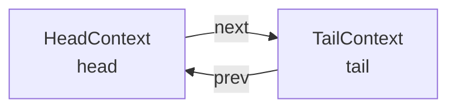
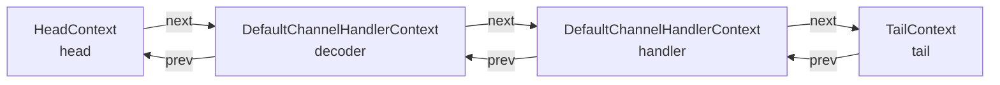
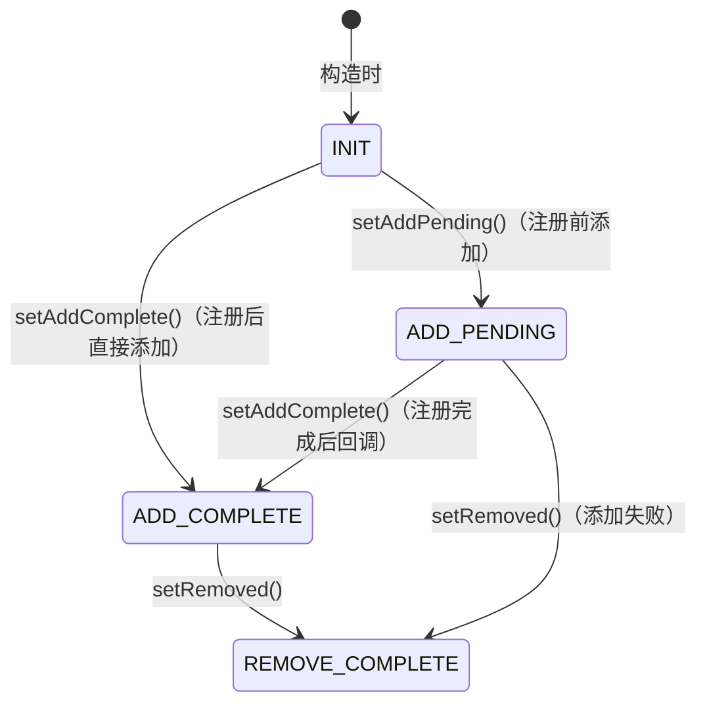
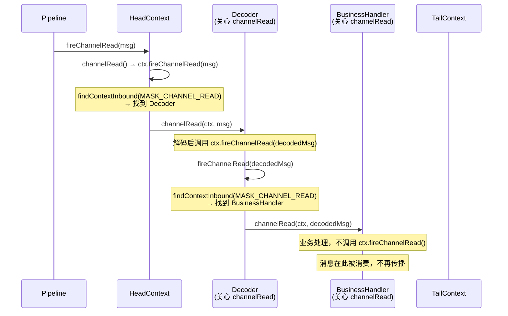
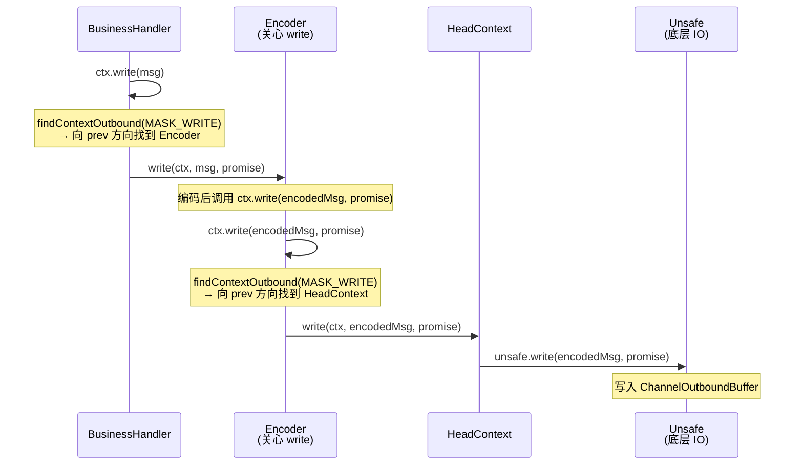
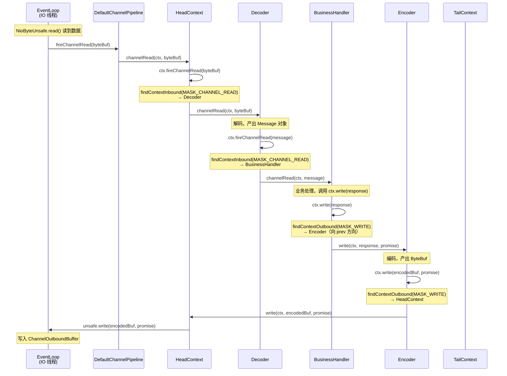

# 05-01 Pipeline 与 Handler 机制深度分析

## 一、解决什么问题

### 1.1 核心问题

一个 TCP 连接上的数据处理通常需要多个步骤串联：

```
原始字节 → 解帧（粘包拆包）→ 反序列化 → 鉴权 → 限流 → 业务逻辑 → 序列化 → 发送
```

**问题**：如何让这些步骤**可插拔、可复用、可动态增删**，同时保证**线程安全**和**高性能**？

### 1.2 要回答的 6 个核心问题

1. Pipeline 的数据结构是什么？Head/Tail 的作用是什么？
2. Inbound 事件（如 `channelRead`）如何从 Head 传播到 Tail？
3. Outbound 事件（如 `write`）如何从 Tail 传播到 Head？
4. `executionMask` 是什么？为什么能跳过不关心某事件的 Handler？
5. `@Sharable` 注解的本质是什么？线程安全边界在哪里？
6. Handler 在 Channel 注册前被添加时，`handlerAdded()` 何时被调用？

---

## 二、问题推导 → 数据结构（Skill #15）

### 2.1 问题推导

**问题**：多个处理步骤需要串联，且支持动态插拔。

**需要什么信息**：
- 每个步骤（Handler）需要知道"下一个步骤是谁"→ 需要链表
- 需要支持从两端遍历（inbound 从头到尾，outbound 从尾到头）→ 需要**双向链表**
- 每个节点需要持有 Handler 实例，同时提供事件传播的上下文 → 需要**包装节点（Context）**
- 需要固定的起点和终点，防止越界 → 需要**哨兵节点（Head/Tail）**

**推导出的结构**：带哨兵节点的双向链表，每个节点是 `ChannelHandlerContext`，持有 `ChannelHandler`。

### 2.2 真实数据结构

```
DefaultChannelPipeline
├── HeadContext head          ← 哨兵头节点（同时是 Outbound + Inbound Handler）
├── TailContext tail          ← 哨兵尾节点（同时是 Inbound Handler）
├── Channel channel           ← 所属 Channel
├── ChannelFuture succeededFuture  ← 缓存的成功 Future（避免重复创建）
├── VoidChannelPromise voidPromise ← 缓存的 void Promise
├── boolean touch             ← ResourceLeakDetector.isEnabled()
├── Map<EventExecutorGroup, EventExecutor> childExecutors  ← 自定义 Executor 缓存
├── volatile MessageSizeEstimator.Handle estimatorHandle   ← 消息大小估算器
├── boolean firstRegistration ← 是否首次注册（用于 PendingHandlerCallback）
├── PendingHandlerCallback pendingHandlerCallbackHead      ← 注册前添加的 Handler 回调链表
└── boolean registered        ← Channel 是否已注册到 EventLoop
```

**链表结构**（初始状态，只有 Head 和 Tail）：



**添加用户 Handler 后**（`pipeline.addLast("decoder", decoder).addLast("handler", handler)`）：



### 2.3 AbstractChannelHandlerContext 字段

每个链表节点（`AbstractChannelHandlerContext`）的核心字段：

```java
abstract class AbstractChannelHandlerContext implements ChannelHandlerContext, ResourceLeakHint {

    volatile AbstractChannelHandlerContext next;   // [1] 下一个节点（volatile，保证可见性）
    volatile AbstractChannelHandlerContext prev;   // [2] 上一个节点（volatile，保证可见性）

    private final DefaultChannelPipeline pipeline; // [3] 所属 Pipeline
    private final String name;                     // [4] Handler 名称（唯一）
    private final boolean ordered;                 // [5] 是否有序执行（EventLoop 或 OrderedEventExecutor）
    private final int executionMask;               // [6] ⭐ 位掩码，标记此 Handler 关心哪些事件

    final EventExecutor childExecutor;             // [7] 自定义 Executor（null 表示用 Channel 的 EventLoop）
    EventExecutor contextExecutor;                 // [8] 缓存的 executor()，热路径优化

    private ChannelFuture succeededFuture;         // [9] 缓存的成功 Future
    private Tasks invokeTasks;                     // [10] 懒加载的跨线程任务对象（避免重复创建 Runnable）

    private volatile int handlerState = INIT;      // [11] Handler 状态机（INIT/ADD_PENDING/ADD_COMPLETE/REMOVE_COMPLETE）
}
```

**handlerState 状态机**：



---

## 三、Pipeline 的创建

### 3.1 问题推导

**问题**：Pipeline 何时创建？谁创建它？

**答**：Channel 构造时，在 `AbstractChannel` 的构造函数中创建：

```java
// AbstractChannel 构造函数
protected AbstractChannel(Channel parent, ChannelId id) {
    this.parent = parent;
    this.id = id;
    unsafe = newUnsafe();
    pipeline = newChannelPipeline();  // ← 创建 Pipeline
}

protected DefaultChannelPipeline newChannelPipeline() {
    return new DefaultChannelPipeline(this);
}
```

```java
// DefaultChannelPipeline 构造函数
protected DefaultChannelPipeline(Channel channel) {
    this.channel = ObjectUtil.checkNotNull(channel, "channel");
    succeededFuture = new SucceededChannelFuture(channel, null);  // [1] 缓存成功 Future
    voidPromise = new VoidChannelPromise(channel, true);           // [2] 缓存 void Promise

    tail = new TailContext(this);   // [3] 先创建 Tail
    head = new HeadContext(this);   // [4] 再创建 Head

    head.next = tail;               // [5] 建立双向链接
    tail.prev = head;               // [6]
}
```

**注意**：先创建 `tail` 再创建 `head`，但链接时 `head.next = tail`，`tail.prev = head`，形成正确的双向链表。

### 3.2 HeadContext 的特殊性

`HeadContext` 同时实现了 `ChannelOutboundHandler` 和 `ChannelInboundHandler`：

```java
final class HeadContext extends AbstractChannelHandlerContext
        implements ChannelOutboundHandler, ChannelInboundHandler {

    private final Unsafe unsafe;  // ← 持有 Channel 的 Unsafe，是 Pipeline 与底层 IO 的桥梁

    // Outbound 操作：委托给 Unsafe
    @Override public void bind(ChannelHandlerContext ctx, SocketAddress localAddress, ChannelPromise promise) {
        unsafe.bind(localAddress, promise);
    }
    @Override public void connect(...) { unsafe.connect(...); }
    @Override public void disconnect(...) { unsafe.disconnect(promise); }
    @Override public void close(...) { unsafe.close(promise); }
    @Override public void deregister(...) { unsafe.deregister(promise); }
    @Override public void read(ChannelHandlerContext ctx) { unsafe.beginRead(); }
    @Override public void write(...) { unsafe.write(msg, promise); }
    @Override public void flush(ChannelHandlerContext ctx) { unsafe.flush(); }

    // Inbound 事件：透传 + 触发 autoRead
    @Override public void channelRegistered(ChannelHandlerContext ctx) {
        invokeHandlerAddedIfNeeded();  // ← 触发注册前 pending 的 handlerAdded 回调
        ctx.fireChannelRegistered();
    }
    @Override public void channelActive(ChannelHandlerContext ctx) {
        ctx.fireChannelActive();
        readIfIsAutoRead();            // ← autoRead=true 时触发 beginRead()
    }
    @Override public void channelReadComplete(ChannelHandlerContext ctx) {
        ctx.fireChannelReadComplete();
        readIfIsAutoRead();            // ← 每次读完后，如果 autoRead=true 继续注册读事件
    }
    @Override public void channelRead(ChannelHandlerContext ctx, Object msg) {
        ctx.fireChannelRead(msg);      // ← 透传，不做任何处理
    }
    @Override public void exceptionCaught(ChannelHandlerContext ctx, Throwable cause) {
        ctx.fireExceptionCaught(cause); // ← 透传异常
    }
}
```

**HeadContext 的两个核心职责**：
1. **Outbound 终点**：所有 outbound 操作（write/flush/bind/close 等）最终都到达 HeadContext，由它委托给 `Unsafe` 执行真正的 IO 操作
2. **Inbound 起点**：所有 inbound 事件从 HeadContext 开始向 Tail 传播

### 3.3 TailContext 的特殊性

`TailContext` 只实现 `ChannelInboundHandler`，是 inbound 事件的**终点**：

```java
final class TailContext extends AbstractChannelHandlerContext implements ChannelInboundHandler {

    // 大多数事件到达 Tail 时什么都不做（空实现）
    @Override public void channelRegistered(ChannelHandlerContext ctx) { }
    @Override public void channelUnregistered(ChannelHandlerContext ctx) { }
    @Override public void channelActive(ChannelHandlerContext ctx) { onUnhandledInboundChannelActive(); }
    @Override public void channelInactive(ChannelHandlerContext ctx) { onUnhandledInboundChannelInactive(); }

    // ⚠️ channelRead 到达 Tail 时会释放消息并打印 warn 日志
    @Override public void channelRead(ChannelHandlerContext ctx, Object msg) {
        onUnhandledInboundMessage(ctx, msg);  // → ReferenceCountUtil.release(msg) + debug 日志
    }

    // ⚠️ exceptionCaught 到达 Tail 时会打印 warn 日志
    @Override public void exceptionCaught(ChannelHandlerContext ctx, Throwable cause) {
        onUnhandledInboundException(cause);   // → logger.warn(...) + ReferenceCountUtil.release(cause)
    }
}
```

**⚠️ 生产踩坑**：如果用户 Handler 没有调用 `ctx.fireChannelRead(msg)` 继续传播，消息会停在该 Handler；如果调用了但没有任何 Handler 消费，消息会到达 TailContext 被释放并打印 debug 日志（不是 warn）。但如果异常到达 Tail，会打印 **warn** 日志，这是排查"异常被吞"问题的重要线索。

---

## 四、Handler 的添加与删除

### 4.1 问题推导

**问题**：`pipeline.addLast("name", handler)` 做了什么？

**需要什么**：
- 创建包装节点（Context）
- 插入双向链表
- 调用 `handler.handlerAdded(ctx)`（但要考虑 Channel 还没注册的情况）
- 检查 Handler 是否可以被多次添加（`@Sharable`）

### 4.2 internalAdd() 核心逻辑

所有 `addFirst/addLast/addBefore/addAfter` 最终都调用 `internalAdd()`：

```java
private ChannelPipeline internalAdd(EventExecutorGroup group, String name,
                                    ChannelHandler handler, String baseName,
                                    AddStrategy addStrategy) {
    final AbstractChannelHandlerContext newCtx;
    synchronized (this) {                          // [1] 加锁保证链表操作原子性
        checkMultiplicity(handler);                // [2] 检查 @Sharable（非 Sharable 不能重复添加）
        name = filterName(name, handler);          // [3] 处理 name：null 则自动生成，重复则抛异常

        newCtx = newContext(group, name, handler); // [4] 创建 DefaultChannelHandlerContext
                                                   //     同时计算 executionMask

        switch (addStrategy) {                     // [5] 根据策略插入链表
            case ADD_FIRST:  addFirst0(newCtx);  break;
            case ADD_LAST:   addLast0(newCtx);   break;
            case ADD_BEFORE: addBefore0(getContextOrDie(baseName), newCtx); break;
            case ADD_AFTER:  addAfter0(getContextOrDie(baseName), newCtx);  break;
        }

        if (!registered) {                         // [6] Channel 还未注册到 EventLoop
            newCtx.setAddPending();                //     状态设为 ADD_PENDING
            callHandlerCallbackLater(newCtx, true);//     加入 pendingHandlerCallbackHead 链表
            return this;                           //     延迟调用 handlerAdded()
        }

        EventExecutor executor = newCtx.executor();
        if (!executor.inEventLoop()) {             // [7] 当前线程不是 Handler 的 EventLoop 线程
            callHandlerAddedInEventLoop(newCtx, executor);
            // ↑ 内部先调用 newCtx.setAddPending()，再提交任务到 EventLoop 执行
            return this;
        }
    }
    callHandlerAdded0(newCtx);                     // [8] 在当前线程（EventLoop）直接调用 handlerAdded()
    return this;
}
```

### 4.3 checkMultiplicity() —— @Sharable 检查

```java
private static void checkMultiplicity(ChannelHandler handler) {
    if (handler instanceof ChannelHandlerAdapter) {
        ChannelHandlerAdapter h = (ChannelHandlerAdapter) handler;
        if (!h.isSharable() && h.added) {          // [1] 非 Sharable 且已经被添加过
            throw new ChannelPipelineException(
                    h.getClass().getName() +
                    " is not a @Sharable handler, so can't be added or removed multiple times.");
        }
        h.added = true;                            // [2] 标记为已添加
    }
}
```

**`isSharable()` 的实现**（带缓存）：

```java
// ChannelHandlerAdapter.isSharable()
public boolean isSharable() {
    Class<?> clazz = getClass();
    Map<Class<?>, Boolean> cache = InternalThreadLocalMap.get().handlerSharableCache();
    Boolean sharable = cache.get(clazz);
    if (sharable == null) {
        sharable = clazz.isAnnotationPresent(Sharable.class);  // 反射检查 @Sharable 注解
        cache.put(clazz, sharable);                            // 缓存到 ThreadLocal，避免重复反射
    }
    return sharable;
}
```

**`@Sharable` 的本质**：
- 非 `@Sharable` Handler：每个 Channel 必须有独立实例，因为 Handler 可能有状态（如解码器的累积缓冲区）
- `@Sharable` Handler：可以被多个 Channel 的 Pipeline 共享同一实例，但**必须保证无状态或线程安全**

### 4.4 addLast0() —— 链表插入

```java
private void addLast0(AbstractChannelHandlerContext newCtx) {
    AbstractChannelHandlerContext prev = tail.prev;  // [1] 找到当前最后一个节点
    newCtx.prev = prev;                              // [2] 新节点的 prev 指向原最后节点
    newCtx.next = tail;                              // [3] 新节点的 next 指向 tail
    prev.next = newCtx;                              // [4] 原最后节点的 next 指向新节点
    tail.prev = newCtx;                              // [5] tail 的 prev 指向新节点
}
```

### 4.5 PendingHandlerCallback —— 注册前添加的 Handler

**问题**：`ServerBootstrap.childHandler()` 中添加的 Handler，在 Channel 注册到 EventLoop 之前就被添加了，此时 `handlerAdded()` 不能立即调用（因为 EventLoop 还没绑定）。

**解决方案**：用一个单向链表 `pendingHandlerCallbackHead` 暂存回调，等 Channel 注册完成后统一执行：

```java
// 注册完成时，HeadContext.channelRegistered() 调用：
void invokeHandlerAddedIfNeeded() {
    assert channel.eventLoop().inEventLoop();
    if (firstRegistration) {
        firstRegistration = false;
        callHandlerAddedForAllHandlers();  // 执行所有 pending 的 handlerAdded 回调
    }
}

private void callHandlerAddedForAllHandlers() {
    final PendingHandlerCallback pendingHandlerCallbackHead;
    synchronized (this) {
        assert !registered;
        registered = true;                                    // [1] 标记已注册
        pendingHandlerCallbackHead = this.pendingHandlerCallbackHead;
        this.pendingHandlerCallbackHead = null;               // [2] 清空链表（GC 友好）
    }
    // [3] 在 synchronized 块外执行，避免死锁
    PendingHandlerCallback task = pendingHandlerCallbackHead;
    while (task != null) {
        task.execute();   // 调用 callHandlerAdded0(ctx)
        task = task.next;
    }
}
```

### 4.6 remove() —— Handler 删除

```java
private AbstractChannelHandlerContext remove(final AbstractChannelHandlerContext ctx) {
    assert ctx != head && ctx != tail;  // [1] Head 和 Tail 不能被删除

    synchronized (this) {
        atomicRemoveFromHandlerList(ctx);  // [2] 原子地从链表中摘除（synchronized 保证）

        if (!registered) {                 // [3] 未注册时，延迟调用 handlerRemoved()
            callHandlerCallbackLater(ctx, false);
            return ctx;
        }

        EventExecutor executor = ctx.executor();
        if (!executor.inEventLoop()) {     // [4] 不在 EventLoop 线程，提交任务
            executor.execute(() -> callHandlerRemoved0(ctx));
            return ctx;
        }
    }
    callHandlerRemoved0(ctx);              // [5] 在 EventLoop 线程直接调用 handlerRemoved()
    return ctx;
}

private synchronized void atomicRemoveFromHandlerList(AbstractChannelHandlerContext ctx) {
    AbstractChannelHandlerContext prev = ctx.prev;
    AbstractChannelHandlerContext next = ctx.next;
    prev.next = next;   // 跳过 ctx
    next.prev = prev;   // 跳过 ctx
}
```

---

## 五、executionMask —— 跳过不关心事件的 Handler（Skill #15 ③ 运行验证）

### 5.1 问题推导

**问题**：Pipeline 中有 10 个 Handler，但某个 `channelRead` 事件只有 3 个 Handler 关心，如何避免遍历所有 10 个节点？

**推导**：在 Handler 添加时，预先计算出它关心哪些事件，存成一个位掩码（`executionMask`）。传播事件时，通过位运算快速跳过不关心该事件的 Handler。

### 5.2 MASK 常量定义

```java
// ChannelHandlerMask 中的位掩码定义
static final int MASK_EXCEPTION_CAUGHT          = 1;        // bit 0
static final int MASK_CHANNEL_REGISTERED        = 1 << 1;   // bit 1
static final int MASK_CHANNEL_UNREGISTERED      = 1 << 2;   // bit 2
static final int MASK_CHANNEL_ACTIVE            = 1 << 3;   // bit 3
static final int MASK_CHANNEL_INACTIVE          = 1 << 4;   // bit 4
static final int MASK_CHANNEL_READ              = 1 << 5;   // bit 5
static final int MASK_CHANNEL_READ_COMPLETE     = 1 << 6;   // bit 6
static final int MASK_USER_EVENT_TRIGGERED      = 1 << 7;   // bit 7
static final int MASK_CHANNEL_WRITABILITY_CHANGED = 1 << 8; // bit 8
static final int MASK_BIND                      = 1 << 9;   // bit 9
static final int MASK_CONNECT                   = 1 << 10;  // bit 10
static final int MASK_DISCONNECT                = 1 << 11;  // bit 11
static final int MASK_CLOSE                     = 1 << 12;  // bit 12
static final int MASK_DEREGISTER                = 1 << 13;  // bit 13
static final int MASK_READ                      = 1 << 14;  // bit 14
static final int MASK_WRITE                     = 1 << 15;  // bit 15
static final int MASK_FLUSH                     = 1 << 16;  // bit 16

// 组合掩码
static final int MASK_ONLY_INBOUND  = 0x01FE;   // bits 1~8（不含 EXCEPTION_CAUGHT）
static final int MASK_ALL_INBOUND   = 0x01FF;   // bits 0~8（含 EXCEPTION_CAUGHT）
static final int MASK_ONLY_OUTBOUND = 0x1FE00;  // bits 9~16（不含 EXCEPTION_CAUGHT）
static final int MASK_ALL_OUTBOUND  = 0x1FE01;  // bits 0,9~16（含 EXCEPTION_CAUGHT）
```

**真实运行验证**（Skill #16）：
```
MASK_ONLY_INBOUND  = 510  (0x01FE)
MASK_ALL_INBOUND   = 511  (0x01FF)
MASK_ONLY_OUTBOUND = 130560 (0x1FE00)
MASK_ALL_OUTBOUND  = 130561 (0x1FE01)
```

### 5.3 mask0() —— executionMask 的计算

```java
private static int mask0(Class<? extends ChannelHandler> handlerType) {
    int mask = MASK_EXCEPTION_CAUGHT;  // [1] 默认包含 EXCEPTION_CAUGHT
    try {
        if (ChannelInboundHandler.class.isAssignableFrom(handlerType)) {
            mask |= MASK_ALL_INBOUND;      // [2] Inbound Handler：先全部置位

            // [3] 逐个检查是否有 @Skip 注解，有则清除对应 bit
            if (isSkippable(handlerType, "channelRegistered", ChannelHandlerContext.class))
                mask &= ~MASK_CHANNEL_REGISTERED;
            if (isSkippable(handlerType, "channelUnregistered", ChannelHandlerContext.class))
                mask &= ~MASK_CHANNEL_UNREGISTERED;
            if (isSkippable(handlerType, "channelActive", ChannelHandlerContext.class))
                mask &= ~MASK_CHANNEL_ACTIVE;
            if (isSkippable(handlerType, "channelInactive", ChannelHandlerContext.class))
                mask &= ~MASK_CHANNEL_INACTIVE;
            if (isSkippable(handlerType, "channelRead", ChannelHandlerContext.class, Object.class))
                mask &= ~MASK_CHANNEL_READ;
            if (isSkippable(handlerType, "channelReadComplete", ChannelHandlerContext.class))
                mask &= ~MASK_CHANNEL_READ_COMPLETE;
            if (isSkippable(handlerType, "channelWritabilityChanged", ChannelHandlerContext.class))
                mask &= ~MASK_CHANNEL_WRITABILITY_CHANGED;
            if (isSkippable(handlerType, "userEventTriggered", ChannelHandlerContext.class, Object.class))
                mask &= ~MASK_USER_EVENT_TRIGGERED;
        }

        if (ChannelOutboundHandler.class.isAssignableFrom(handlerType)) {
            mask |= MASK_ALL_OUTBOUND;     // [4] Outbound Handler：先全部置位
            // [5] 逐个检查 @Skip...（bind/connect/disconnect/close/deregister/read/write/flush）
        }

        if (isSkippable(handlerType, "exceptionCaught", ChannelHandlerContext.class, Throwable.class))
            mask &= ~MASK_EXCEPTION_CAUGHT; // [6] 检查 exceptionCaught 是否可跳过
    } catch (Exception e) {
        PlatformDependent.throwException(e); // [7] 理论上不会到达这里
    }
    return mask;
}
```

**`@Skip` 注解的作用**：`ChannelInboundHandlerAdapter` 中所有方法都标注了 `@Skip`（只做透传），子类如果覆盖了某个方法（不再有 `@Skip`），该方法对应的 bit 就会被保留在 `executionMask` 中。

**真实验证**：
```
只覆盖 channelRead 的 InboundHandler executionMask = 32 (0x0020)
  包含 MASK_CHANNEL_READ?   true   ← 只有这一个 bit 被置位
  包含 MASK_CHANNEL_ACTIVE? false  ← 其他事件都被跳过
```

> ⚠️ 注意：`0x20 = 32`，不含 `MASK_EXCEPTION_CAUGHT(bit0)`。因为只覆盖了 `channelRead`，`exceptionCaught` 方法仍有 `@Skip`，所以 bit0 也被清掉。

**缓存机制**：`executionMask` 通过 `FastThreadLocal<Map<Class<? extends ChannelHandler>, Integer>>` 缓存（内部实现为 `WeakHashMap`），同一 Handler 类型只计算一次（反射开销只在第一次）。

### 5.4 skipContext() —— 跳过判断

```java
private static boolean skipContext(
        AbstractChannelHandlerContext ctx, EventExecutor currentExecutor, int mask, int onlyMask) {
    return (ctx.executionMask & (onlyMask | mask)) == 0 ||
            (ctx.executor() == currentExecutor && (ctx.executionMask & mask) == 0);
}
```

**两个跳过条件**：

**条件1**：`(ctx.executionMask & (onlyMask | mask)) == 0`
- 对于 inbound 事件（如 `channelRead`）：`onlyMask = MASK_ONLY_INBOUND`，`mask = MASK_CHANNEL_READ`
- 如果 Handler 是纯 Outbound（`executionMask = MASK_ALL_OUTBOUND = 0x1FE01`）：
  - `0x1FE01 & (0x01FE | 0x0020) = 0x1FE01 & 0x01FE = 0` → **跳过** ✅
- 验证：`纯 OutboundHandler 对 channelRead 事件会被 skip? true`

**条件2**：`ctx.executor() == currentExecutor && (ctx.executionMask & mask) == 0`
- 同一 EventLoop 线程下，如果 Handler 不关心该具体事件（但可能关心同方向的其他事件），也跳过
- 这个条件是为了**保证跨 EventExecutor 时的顺序性**：如果 Handler 用了不同的 Executor，即使不关心该事件也不能跳过（需要保证事件顺序）

---

## 六、Inbound 事件传播

### 6.1 问题推导

**问题**：`pipeline.fireChannelRead(msg)` 是如何一步步传播到用户 Handler 的？

### 6.2 入口：DefaultChannelPipeline.fireChannelRead()

```java
@Override
public final ChannelPipeline fireChannelRead(Object msg) {
    if (head.executor().inEventLoop()) {          // [1] 当前线程是 EventLoop 线程
        if (head.invokeHandler()) {               // [2] HeadContext 的 handlerState == ADD_COMPLETE
            head.channelRead(head, msg);          // [3] 直接调用 HeadContext.channelRead()
        } else {
            head.fireChannelRead(msg);            // [4] HeadContext 未就绪，跳过它继续传播
        }
    } else {
        head.executor().execute(() -> fireChannelRead(msg)); // [5] 不在 EventLoop 线程，提交任务
    }
    return this;
}
```

**HeadContext.channelRead()**：
```java
@Override
public void channelRead(ChannelHandlerContext ctx, Object msg) {
    ctx.fireChannelRead(msg);  // 透传，不做任何处理
}
```

### 6.3 核心传播：AbstractChannelHandlerContext.fireChannelRead()

```java
@Override
public ChannelHandlerContext fireChannelRead(final Object msg) {
    AbstractChannelHandlerContext next = findContextInbound(MASK_CHANNEL_READ); // [1] 找下一个关心 channelRead 的节点
    if (next.executor().inEventLoop()) {
        final Object m = pipeline.touch(msg, next);  // [2] 泄漏检测 touch（ResourceLeakDetector 开启时）
        if (next.invokeHandler()) {                  // [3] Handler 已就绪（ADD_COMPLETE）
            try {
                // DON'T CHANGE（注释说明：避免 JDK-8180450 的双接口扩展性问题）
                final ChannelHandler handler = next.handler();
                final DefaultChannelPipeline.HeadContext headContext = pipeline.head;
                if (handler == headContext) {
                    headContext.channelRead(next, m);                    // [4a] HeadContext 特殊处理
                } else if (handler instanceof ChannelDuplexHandler) {
                    ((ChannelDuplexHandler) handler).channelRead(next, m); // [4b] DuplexHandler
                } else {
                    ((ChannelInboundHandler) handler).channelRead(next, m); // [4c] 普通 InboundHandler
                }
            } catch (Throwable t) {
                next.invokeExceptionCaught(t);       // [5] 异常：触发 exceptionCaught 传播
            }
        } else {
            next.fireChannelRead(m);                 // [6] Handler 未就绪，继续找下一个
        }
    } else {
        next.executor().execute(() -> fireChannelRead(msg)); // [7] 跨 Executor：提交任务
    }
    return this;
}
```

### 6.4 findContextInbound() —— 快速跳过

```java
private AbstractChannelHandlerContext findContextInbound(int mask) {
    AbstractChannelHandlerContext ctx = this;
    EventExecutor currentExecutor = executor();
    do {
        ctx = ctx.next;                                          // [1] 向后遍历
    } while (skipContext(ctx, currentExecutor, mask, MASK_ONLY_INBOUND)); // [2] 跳过不关心的节点
    return ctx;
}
```

**传播路径示意**（Pipeline: Head → Decoder → BusinessHandler → Tail）：



### 6.5 invokeHandler() —— Handler 就绪检查

```java
boolean invokeHandler() {
    int handlerState = this.handlerState;
    return handlerState == ADD_COMPLETE ||
           (!ordered && handlerState == ADD_PENDING);
    // ordered=true（EventLoop 或 OrderedEventExecutor）时，必须等 ADD_COMPLETE
    // ordered=false（非有序 Executor）时，ADD_PENDING 也可以执行
}
```

**设计动机**：防止 `handlerAdded()` 还没被调用时，Handler 就收到了事件（可能导致 Handler 内部状态未初始化）。


---

## 七、Outbound 事件传播

### 7.1 问题推导

**问题**：`ctx.write(msg)` 是如何从用户 Handler 传播到 HeadContext 最终写入 Socket 的？

**关键区别**：
- Inbound：从 **Head → Tail**（`ctx.next`）
- Outbound：从 **Tail → Head**（`ctx.prev`）

### 7.2 入口：DefaultChannelPipeline.write()

```java
// DefaultChannelPipeline 中，outbound 操作从 tail 开始
@Override
public final ChannelFuture write(Object msg) {
    return tail.write(msg);  // ← 从 tail 开始向 head 方向传播
}
```

### 7.3 核心传播：AbstractChannelHandlerContext.write()

```java
@Override
public ChannelFuture write(Object msg) {
    ChannelPromise promise = newPromise();
    write(msg, false, promise);  // flush=false
    return promise;
}

void write(Object msg, boolean flush, ChannelPromise promise) {
    if (validateWrite(msg, promise)) {
        // [1] 找下一个关心 write（或 write+flush）的 outbound 节点（向 prev 方向）
        final AbstractChannelHandlerContext next = findContextOutbound(flush ?
                MASK_WRITE | MASK_FLUSH : MASK_WRITE);
        final Object m = pipeline.touch(msg, next);  // [2] 泄漏检测
        EventExecutor executor = next.executor();
        if (executor.inEventLoop()) {
            if (next.invokeHandler()) {
                try {
                    final ChannelHandler handler = next.handler();
                    final DefaultChannelPipeline.HeadContext headContext = pipeline.head;
                    if (handler == headContext) {
                        headContext.write(next, msg, promise);           // [3a] HeadContext
                    } else if (handler instanceof ChannelDuplexHandler) {
                        ((ChannelDuplexHandler) handler).write(next, msg, promise); // [3b]
                    } else if (handler instanceof ChannelOutboundHandlerAdapter) {
                        ((ChannelOutboundHandlerAdapter) handler).write(next, msg, promise); // [3c]
                    } else {
                        ((ChannelOutboundHandler) handler).write(next, msg, promise); // [3d]
                    }
                } catch (Throwable t) {
                    notifyOutboundHandlerException(t, promise);  // [4] 异常：通知 promise 失败
                }
                if (flush) {
                    next.invokeFlush0();  // [5] writeAndFlush 时，write 完立即 flush
                }
            } else {
                next.write(msg, flush, promise);  // [6] Handler 未就绪，继续找下一个
            }
        } else {
            // [7] 跨 Executor：创建 WriteTask（Recycler 池化）提交到目标 Executor
            final WriteTask task = WriteTask.newInstance(this, m, promise, flush);
            if (!safeExecute(executor, task, promise, m, !flush)) {
                task.cancel();  // 提交失败，取消任务并释放资源
            }
        }
    }
}
```

### 7.4 findContextOutbound() —— 向 prev 方向查找

```java
private AbstractChannelHandlerContext findContextOutbound(int mask) {
    AbstractChannelHandlerContext ctx = this;
    EventExecutor currentExecutor = executor();
    do {
        ctx = ctx.prev;                                           // [1] 向前遍历（prev 方向）
    } while (skipContext(ctx, currentExecutor, mask, MASK_ONLY_OUTBOUND)); // [2] 跳过不关心的节点
    return ctx;
}
```

**传播路径示意**（Pipeline: Head → Encoder → BusinessHandler → Tail）：



### 7.5 write vs writeAndFlush vs flush

| 操作 | 说明 | 底层行为 |
|------|------|---------|
| `ctx.write(msg)` | 写入 `ChannelOutboundBuffer`，不发送 | `unsafe.write(msg, promise)` |
| `ctx.flush()` | 将 `ChannelOutboundBuffer` 中的数据发送到 Socket | `unsafe.flush()` |
| `ctx.writeAndFlush(msg)` | write + flush 合并，`findContextOutbound(MASK_WRITE \| MASK_FLUSH)` | 先 write 再立即 invokeFlush0() |

**🔥 面试常考**：`write` 和 `flush` 为什么分离？
- 批量写入：多次 `write` 后一次 `flush`，减少系统调用次数
- 背压控制：`ChannelOutboundBuffer` 积压超过高水位时，`isWritable()` 返回 false，业务层可以暂停写入

---

## 八、异常处理传播

### 8.1 exceptionCaught 的传播方向

`exceptionCaught` 是**特殊的 inbound 事件**，它的传播方向是 **Head → Tail**（与普通 inbound 相同），但触发方式不同：

- **Inbound 异常**：在 `fireChannelRead` 等方法的 catch 块中触发 `next.invokeExceptionCaught(t)`
- **Outbound 异常**：通过 `notifyOutboundHandlerException(t, promise)` 通知 promise 失败，**不触发 exceptionCaught**

```java
// AbstractChannelHandlerContext.fireExceptionCaught()
@Override
public ChannelHandlerContext fireExceptionCaught(final Throwable cause) {
    AbstractChannelHandlerContext next = findContextInbound(MASK_EXCEPTION_CAUGHT); // [1] 向 next 方向找
    ObjectUtil.checkNotNull(cause, "cause");
    if (next.executor().inEventLoop()) {
        next.invokeExceptionCaught(cause);  // [2] 直接调用
    } else {
        try {
            next.executor().execute(() -> next.invokeExceptionCaught(cause)); // [3] 跨 Executor
        } catch (Throwable t) {
            // [4] 提交失败时打印 warn 日志（不再传播）
            if (logger.isWarnEnabled()) {
                logger.warn("Failed to submit an exceptionCaught() event.", t);
                logger.warn("The exceptionCaught() event that was failed to submit was:", cause);
            }
        }
    }
    return this;
}
```

### 8.2 异常处理最佳实践

```java
// ⚠️ 错误做法：异常被吞，不传播
@Override
public void exceptionCaught(ChannelHandlerContext ctx, Throwable cause) {
    logger.error("error", cause);
    // 没有调用 ctx.fireExceptionCaught(cause)！
    // 后续 Handler 收不到异常，且连接可能不会被关闭
}

// ✅ 正确做法：处理后继续传播，或主动关闭连接
@Override
public void exceptionCaught(ChannelHandlerContext ctx, Throwable cause) {
    logger.error("error", cause);
    ctx.close();  // 关闭连接
    // 或者 ctx.fireExceptionCaught(cause); 继续传播给下一个 Handler
}
```

**⚠️ 生产踩坑**：如果所有 Handler 都没有处理 `exceptionCaught`，异常会到达 `TailContext`，打印 **warn** 日志：
```
An exceptionCaught() event was fired, and it reached at the tail of the pipeline.
It usually means the last handler in the pipeline did not handle the exception.
```
这是排查"连接异常但没有日志"问题的重要线索。

---

## 九、完整事件传播时序图



---

## 十、@Sharable 与线程安全

### 10.1 问题推导

**问题**：同一个 Handler 实例被多个 Channel 的 Pipeline 共享时，会有什么问题？

**推导**：
- 如果 Handler 有实例变量（如解码器的累积缓冲区），多个 Channel 并发访问会产生竞争
- 如果 Handler 无状态（如日志 Handler、统计 Handler），共享是安全的

### 10.2 @Sharable 的本质

```java
// 非 @Sharable Handler（有状态，每个 Channel 独立实例）
public class MyDecoder extends ByteToMessageDecoder {
    // ByteToMessageDecoder 内部有 cumulation 缓冲区，不能共享
    // 不加 @Sharable，每次 new MyDecoder() 添加到 Pipeline
}

// @Sharable Handler（无状态，可以共享）
@ChannelHandler.Sharable
public class LoggingHandler extends ChannelDuplexHandler {
    // 只做日志记录，无实例状态
    // 可以被所有 Channel 共享同一实例
}
```

**`checkMultiplicity()` 的保护机制**：
- 非 `@Sharable` Handler：`added` 字段在第一次添加时被设为 `true`，第二次添加时检测到 `added=true` 且 `!isSharable()` → 抛出 `ChannelPipelineException`
- `@Sharable` Handler：`added` 字段不影响，可以多次添加

**注意**：`added` 字段是 `boolean`（非 volatile），注释说明"只用于合理性检查，不需要 volatile"。

### 10.3 线程安全边界

| 场景 | 线程安全保证 |
|------|------------|
| 同一 Channel 的 Handler 方法调用 | EventLoop 单线程串行执行，天然线程安全 |
| `@Sharable` Handler 被多个 Channel 共享 | **用户负责**：Handler 内部必须无状态或自行同步 |
| `pipeline.addLast()` 在非 EventLoop 线程调用 | `synchronized(this)` 保证链表操作原子性 |
| `pipeline.remove()` 在非 EventLoop 线程调用 | `synchronized(this)` 保证链表操作原子性 |
| Handler 跨 EventExecutorGroup 执行 | 提交任务到目标 Executor，保证顺序性 |

**🔥 面试常考**：为什么 Netty 的 Handler 通常不需要加锁？
- 因为同一 Channel 的所有 IO 事件都在同一个 EventLoop 线程中处理（串行化），Handler 方法不会被并发调用
- 只有 `@Sharable` Handler 被多个 Channel 共享时，才需要考虑线程安全

---

## 十一、核心不变式（Invariants）

1. **Head 和 Tail 永远存在**：`head` 和 `tail` 是哨兵节点，不能被 `remove()`，`assert ctx != head && ctx != tail`
2. **Inbound 从 Head 到 Tail，Outbound 从 Tail 到 Head**：`findContextInbound` 向 `next` 方向，`findContextOutbound` 向 `prev` 方向，方向不可逆
3. **Handler 方法在 EventLoop 线程中执行**：除非指定了 `EventExecutorGroup`，否则所有 Handler 方法都在 Channel 绑定的 EventLoop 线程中执行，保证串行化

---

## 十二、Skill #16 日志验证

### 验证方案1：验证 executionMask 跳过效果

在 `AbstractChannelHandlerContext.findContextInbound()` 中添加打印：

```java
private AbstractChannelHandlerContext findContextInbound(int mask) {
    AbstractChannelHandlerContext ctx = this;
    EventExecutor currentExecutor = executor();
    do {
        ctx = ctx.next;
        System.out.println("[VERIFY] findContextInbound: checking " + ctx.name()
            + " executionMask=0x" + Integer.toHexString(ctx.executionMask)
            + " mask=0x" + Integer.toHexString(mask)
            + " skip=" + skipContext(ctx, currentExecutor, mask, MASK_ONLY_INBOUND));
    } while (skipContext(ctx, currentExecutor, mask, MASK_ONLY_INBOUND));
    return ctx;
}
```

**预期输出**（Pipeline: Head → OutboundEncoder → InboundDecoder → BusinessHandler → Tail）：
```
[VERIFY] findContextInbound: checking OutboundEncoder#0 executionMask=0x1FE01 mask=0x20 skip=true
[VERIFY] findContextInbound: checking InboundDecoder#0 executionMask=0x20 mask=0x20 skip=false
```
→ 确认 OutboundEncoder 被跳过，InboundDecoder 被选中（InboundDecoder 只覆盖 channelRead，executionMask=0x20）

### 验证方案2：验证 PendingHandlerCallback 执行时机

在 `callHandlerAddedForAllHandlers()` 中添加打印：

```java
PendingHandlerCallback task = pendingHandlerCallbackHead;
while (task != null) {
    System.out.println("[VERIFY] callHandlerAdded for: " + task.ctx.name()
        + " thread=" + Thread.currentThread().getName());
    task.execute();
    task = task.next;
}
```

**预期输出**：
```
[VERIFY] callHandlerAdded for: MyDecoder#0 thread=nioEventLoopGroup-3-1
```
→ 确认 `handlerAdded()` 在 EventLoop 线程中被调用，且是在 Channel 注册完成后

### 验证方案3：验证 @Sharable 保护

```java
// 非 @Sharable Handler 被添加两次时
ChannelHandler handler = new MyDecoder();
pipeline1.addLast(handler);
pipeline2.addLast(handler);  // 应该抛出 ChannelPipelineException
```

**预期输出**：
```
io.netty.channel.ChannelPipelineException: MyDecoder is not a @Sharable handler,
so can't be added or removed multiple times.
```

---

## 十三、面试问答

### Q1：Pipeline 的数据结构是什么？🔥

**答**：`DefaultChannelPipeline` 是一个**带哨兵节点的双向链表**。每个节点是 `AbstractChannelHandlerContext`，持有 `ChannelHandler` 实例。链表有两个固定的哨兵节点：
- `HeadContext`：同时实现 `ChannelOutboundHandler` 和 `ChannelInboundHandler`，是 outbound 操作的终点（委托给 `Unsafe`）和 inbound 事件的起点
- `TailContext`：只实现 `ChannelInboundHandler`，是 inbound 事件的终点（未处理的消息在此被释放）

### Q2：Inbound 和 Outbound 事件的传播方向有什么区别？🔥

**答**：
- **Inbound 事件**（如 `channelRead`、`channelActive`）：从 `HeadContext` 向 `TailContext` 方向传播（`ctx.next`），通过 `ctx.fireXxx()` 方法继续传播
- **Outbound 事件**（如 `write`、`flush`、`close`）：从 `TailContext` 向 `HeadContext` 方向传播（`ctx.prev`），通过 `ctx.write()`、`ctx.flush()` 等方法继续传播，最终到达 `HeadContext` 委托给 `Unsafe` 执行

### Q3：executionMask 是什么？为什么能提升性能？🔥

**答**：`executionMask` 是一个 int 位掩码，在 Handler 添加到 Pipeline 时计算，标记该 Handler 关心哪些事件。计算方式：先将所有事件 bit 置位，然后对有 `@Skip` 注解的方法对应的 bit 清零。

传播事件时，`findContextInbound/findContextOutbound` 通过 `skipContext()` 方法用位运算 `(ctx.executionMask & (onlyMask | mask)) == 0` 快速判断是否跳过，避免遍历不关心该事件的 Handler，减少方法调用栈深度。

### Q4：@Sharable 注解的本质是什么？什么时候需要加？🔥

**答**：`@Sharable` 是一个标记注解，告诉 Netty 该 Handler 可以被多个 Channel 的 Pipeline 共享同一实例。`checkMultiplicity()` 方法通过 `added` 字段检查非 `@Sharable` Handler 是否被重复添加，防止有状态 Handler 被错误共享。

**需要加 `@Sharable` 的条件**：Handler 必须是**无状态的**，或者内部状态是**线程安全的**（如使用 `AtomicLong` 统计）。有状态的 Handler（如解码器、有实例变量的业务 Handler）不能加 `@Sharable`，每个 Channel 必须有独立实例。

### Q5：Handler 在 Channel 注册前被添加，handlerAdded() 何时被调用？

**答**：Channel 注册前添加的 Handler，其 `handlerAdded()` 回调会被暂存到 `pendingHandlerCallbackHead` 链表中（状态设为 `ADD_PENDING`）。当 Channel 注册到 EventLoop 后，`HeadContext.channelRegistered()` 调用 `invokeHandlerAddedIfNeeded()`，遍历 `pendingHandlerCallbackHead` 链表，在 EventLoop 线程中依次调用所有 pending 的 `handlerAdded()` 回调。

### Q6：为什么 outbound 异常不触发 exceptionCaught？

**答**：outbound 操作（如 `write`）失败时，通过 `notifyOutboundHandlerException(t, promise)` 将异常通知给 `ChannelPromise`，由调用方通过 `promise.addListener()` 处理。这样设计是因为 outbound 操作是主动发起的，调用方应该负责处理失败；而 inbound 异常是被动接收的，需要通过 `exceptionCaught` 链路传播给业务层处理。

### Q7：如果用户 Handler 没有调用 ctx.fireChannelRead()，会发生什么？

**答**：消息传播会在该 Handler 停止，不再传播给后续 Handler。如果该 Handler 没有消费消息（没有 `release(msg)`），会导致**内存泄漏**（ByteBuf 引用计数不为 0）。如果消息传播到了 `TailContext` 但没有被任何 Handler 消费，`TailContext.channelRead()` 会调用 `ReferenceCountUtil.release(msg)` 释放消息，并打印 debug 日志。

### Q8：Pipeline 的 addLast() 是线程安全的吗？🔥

**答**：是的。`internalAdd()` 方法用 `synchronized(this)` 保证链表操作的原子性，可以在任意线程调用。但 `handlerAdded()` 回调的执行时机取决于当前状态：
- 如果 Channel 已注册且当前在 EventLoop 线程：直接调用
- 如果 Channel 已注册但不在 EventLoop 线程：提交任务到 EventLoop 执行
- 如果 Channel 未注册：加入 `pendingHandlerCallbackHead` 链表，等注册完成后执行

---

## 十四、Self-Check（Skill #17 六关自检）

### ① 条件完整性

- `invokeHandler()`：`handlerState == ADD_COMPLETE || (!ordered && handlerState == ADD_PENDING)` ✅
- `skipContext()`：`(ctx.executionMask & (onlyMask | mask)) == 0 || (ctx.executor() == currentExecutor && (ctx.executionMask & mask) == 0)` ✅
- `checkMultiplicity()`：`!h.isSharable() && h.added` ✅

### ② 分支完整性

- `internalAdd()` 的三个分支：`!registered`（pending）、`!executor.inEventLoop()`（提交任务）、直接调用 ✅
- `fireChannelRead()` 的三个分支：`inEventLoop + invokeHandler`、`inEventLoop + !invokeHandler`、`!inEventLoop` ✅
- `skipContext()` 的两个条件（OR 关系）✅

### ③ 数值示例运行验证

```
MASK_ONLY_INBOUND  = 510  (0x01FE)  ← 真实运行输出 ✅
MASK_ALL_INBOUND   = 511  (0x01FF)  ← 真实运行输出 ✅
MASK_ONLY_OUTBOUND = 130560 (0x1FE00) ← 真实运行输出 ✅
MASK_ALL_OUTBOUND  = 130561 (0x1FE01) ← 真实运行输出 ✅
只覆盖 channelRead 的 InboundHandler executionMask = 32 (0x0020) ← 真实运行输出 ✅（注：0x20，不含 EXCEPTION_CAUGHT bit）
纯 OutboundHandler 对 channelRead 事件会被 skip? true ← 真实运行输出 ✅
纯 InboundHandler 对 write 事件会被 skip? true ← 真实运行输出 ✅
```

### ④ 字段/顺序与源码一致

- `DefaultChannelPipeline` 字段顺序：`head, tail, channel, succeededFuture, voidPromise, touch, childExecutors, estimatorHandle, firstRegistration, pendingHandlerCallbackHead, registered` ✅
- `AbstractChannelHandlerContext` 字段顺序：`next, prev, pipeline, name, ordered, executionMask, childExecutor, contextExecutor, succeededFuture, invokeTasks, handlerState` ✅
- 构造函数中先创建 `tail` 再创建 `head`，但链接时 `head.next = tail, tail.prev = head` ✅

### ⑤ 边界/保护逻辑不遗漏

- `remove()` 中 `assert ctx != head && ctx != tail`（Head/Tail 不能被删除）✅
- `callHandlerAddedForAllHandlers()` 在 `synchronized` 块外执行回调（避免死锁）✅
- `WriteTask` 提交失败时调用 `task.cancel()` 释放资源 ✅
- `fireExceptionCaught()` 跨 Executor 提交失败时打印 warn 日志（不再传播）✅

### ⑥ 源码逐字对照

- `DefaultChannelPipeline` 全文已读取并逐行对照 ✅
- `AbstractChannelHandlerContext` 全文已读取并逐行对照 ✅
- `ChannelHandlerMask` 全文已读取并逐行对照 ✅
- `ChannelHandlerAdapter` 全文已读取并逐行对照 ✅

### 自我质疑与回答

**Q：`fireChannelRead` 中为什么有三个 handler 类型判断（headContext / ChannelDuplexHandler / ChannelInboundHandler）？**

A：源码注释写明 "DON'T CHANGE - Duplex handlers implements both out/in interfaces causing a scalability issue see JDK-8180450"。JDK-8180450 是一个 JVM 接口调用优化的 bug：当一个类实现了两个接口，且通过接口调用时，JIT 无法做内联优化（megamorphic call site）。通过显式 instanceof 判断并强转，可以让 JIT 识别为 bimorphic 或 monomorphic call site，从而做内联优化，提升热路径性能。

> ⚠️ 注意：`fireChannelRead` 用的是 `ChannelDuplexHandler`（因为 DuplexHandler 同时实现了 in/out 接口），而 `fireChannelRegistered`、`fireChannelActive` 等其他 inbound 事件用的是 `ChannelInboundHandlerAdapter`（不涉及 DuplexHandler 的双接口问题）。每个 fire 方法的三路判断略有不同，需要具体查看对应方法的源码。

**Q：`HeadContext` 的 `exceptionCaught` 为什么不是空实现，而是 `ctx.fireExceptionCaught(cause)`？**

A：因为 `HeadContext` 是 inbound 事件的起点，如果异常在 `HeadContext` 被吞掉，后续 Handler 就收不到异常了。`HeadContext.exceptionCaught()` 透传异常，确保异常能传播到用户 Handler。

**Q：`pipeline.write()` 从 `tail` 开始，而 `ctx.write()` 从当前节点开始，有什么区别？**

A：`pipeline.write(msg)` 等价于 `tail.write(msg)`，从 tail 开始向 head 方向找第一个关心 write 的 outbound handler。而 `ctx.write(msg)` 从当前 ctx 开始向 head 方向找，跳过当前节点之后（tail 方向）的 handler。这意味着：在 BusinessHandler 中调用 `ctx.write()` 只会经过 BusinessHandler 之前（head 方向）的 outbound handler，不会经过 BusinessHandler 之后（tail 方向）的 outbound handler。
