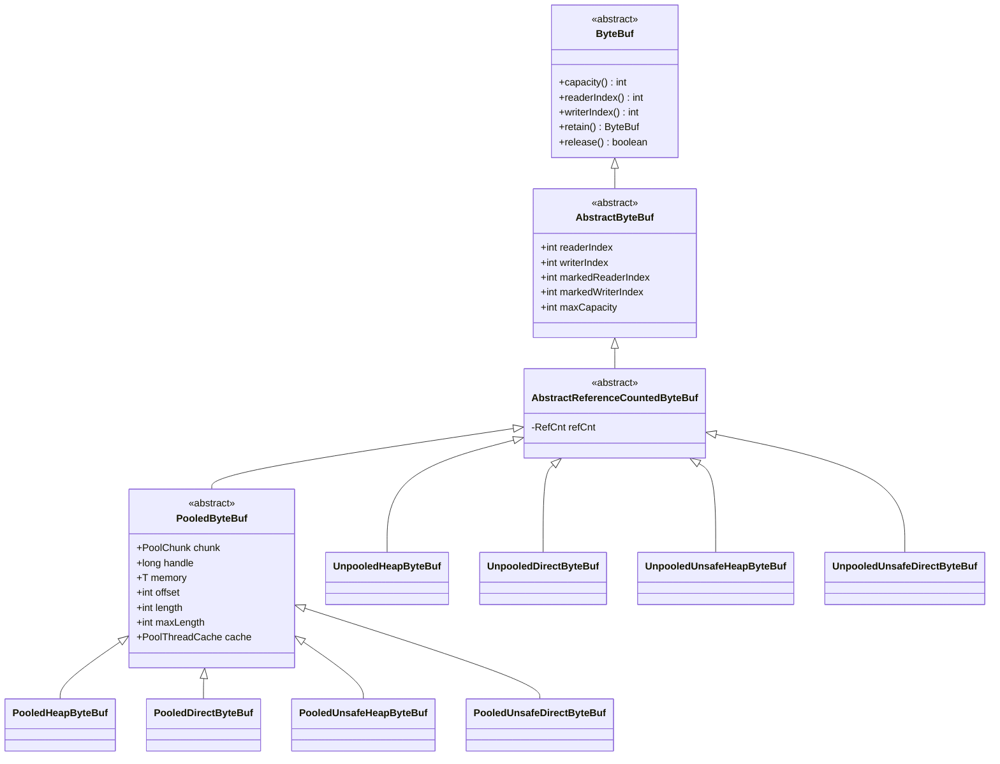
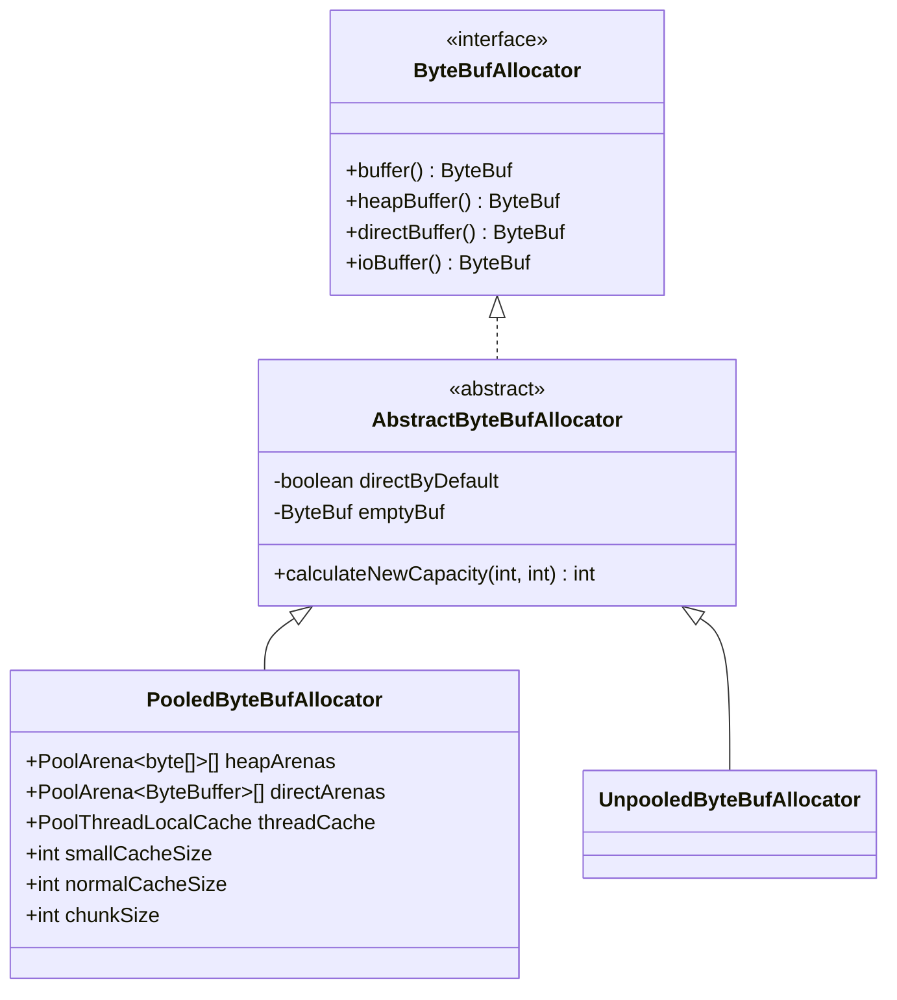
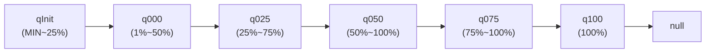
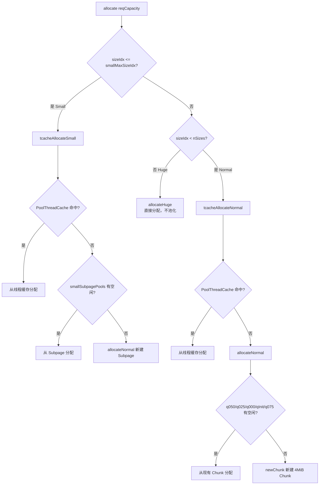
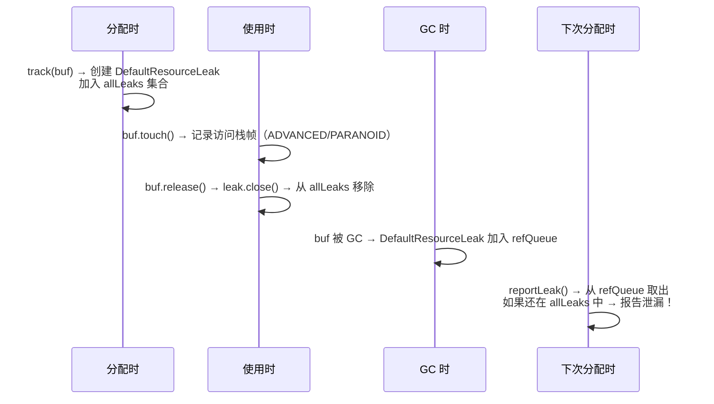

# 06-01 ByteBuf 与内存池深度分析

## 一、解决什么问题

### 1.1 JDK ByteBuffer 的三大痛点

在 Netty 出现之前，Java 网络编程使用 JDK 的 `ByteBuffer`，它有三个核心痛点：

**痛点1：单指针设计，读写切换繁琐**

```java
// JDK ByteBuffer：读写共用一个 position，切换时必须 flip()
ByteBuffer buf = ByteBuffer.allocate(1024);
buf.put("hello".getBytes());  // 写入，position=5
buf.flip();                    // ← 必须 flip()！position=0, limit=5
byte[] data = new byte[buf.remaining()];
buf.get(data);                 // 读取
// 如果忘记 flip()，读到的是空数据！
```

**痛点2：容量固定，无法动态扩容**

```java
ByteBuffer buf = ByteBuffer.allocate(1024);
// 如果数据超过 1024 字节，只能手动创建更大的 buffer 并复制
```

**痛点3：无引用计数，无法池化**

JDK ByteBuffer 没有引用计数机制，无法安全地在多个组件间传递所有权，也无法实现高效的内存池（不知道何时可以回收）。

### 1.2 ByteBuf 的解决方案

Netty 的 `ByteBuf` 用**双指针设计**彻底解决了这三个问题：

```
+-------------------+------------------+------------------+
| discardable bytes |  readable bytes  |  writable bytes  |
|   (已读，可丢弃)   |    (待读内容)    |   (可写空间)     |
+-------------------+------------------+------------------+
|                   |                  |                  |
0      <=      readerIndex   <=   writerIndex    <=    capacity
```

- **双指针**：`readerIndex` 和 `writerIndex` 独立移动，读写不干扰，无需 `flip()`
- **动态扩容**：写入时自动调用 `ensureWritable()`，按 2 倍增长（超过 4MiB 后按 4MiB 步进）
- **引用计数**：`retain()`/`release()` 管理生命周期，支持池化复用

### 1.3 要回答的 6 个核心问题

1. `ByteBuf` 的类层次是什么？堆内/堆外/池化/非池化如何组合？
2. `readerIndex`/`writerIndex` 的操作语义是什么？`discardReadBytes()` 做了什么？
3. 引用计数的 CAS 实现原理是什么？为什么有三条路径？
4. `PooledByteBufAllocator` 的分配流程是什么？Arena/Chunk/Page/Subpage 的层次关系？
5. `ResourceLeakDetector` 的四个等级有什么区别？如何检测泄漏？
6. 什么时候最容易发生内存泄漏？

---

## 二、问题推导 → 数据结构（Skill #15）

### 2.1 ByteBuf 类层次

**推导**：需要支持堆内/堆外 × 池化/非池化 × 是否有 Unsafe 加速 = 多种组合，用继承体系来组织。



**四个维度的组合**：

| 维度 | 选项 | 说明 |
|------|------|------|
| 存储位置 | Heap / Direct | 堆内（`byte[]`）/ 堆外（`ByteBuffer`） |
| 是否池化 | Pooled / Unpooled | 池化复用 / 每次新建 |
| 是否 Unsafe | Unsafe / 非 Unsafe | Unsafe 直接操作内存，更快 |
| 是否包装 | 原始 / Wrapped / Composite | Slice、Duplicate、CompositeByteBuf |

### 2.2 AbstractByteBuf 核心字段

```java
public abstract class AbstractByteBuf extends ByteBuf {
    static final ResourceLeakDetector<ByteBuf> leakDetector =
            ResourceLeakDetectorFactory.instance().newResourceLeakDetector(ByteBuf.class);
    // [1] 全局泄漏检测器（static，所有 ByteBuf 共享）

    int readerIndex;           // [2] 读指针（package-private，子类可直接访问）
    int writerIndex;           // [3] 写指针（package-private）
    private int markedReaderIndex;  // [4] mark/reset 用的读指针快照
    private int markedWriterIndex;  // [5] mark/reset 用的写指针快照
    private int maxCapacity;        // [6] 最大容量上限（扩容不超过此值）
}
```

### 2.3 AbstractReferenceCountedByteBuf 核心字段

```java
public abstract class AbstractReferenceCountedByteBuf extends AbstractByteBuf {
    private final RefCnt refCnt = new RefCnt();  // [1] 引用计数器（初始值=1）
}
```

### 2.4 PooledByteBuf 核心字段

```java
abstract class PooledByteBuf<T> extends AbstractReferenceCountedByteBuf {
    private final EnhancedHandle<PooledByteBuf<T>> recyclerHandle; // [1] 对象池句柄（用于回收 PooledByteBuf 对象本身）

    protected PoolChunk<T> chunk;    // [2] 所属 Chunk（4MiB 的大块内存）
    protected long handle;           // [3] 在 Chunk 中的位置句柄（编码了 page/subpage 信息）
    protected T memory;              // [4] 底层内存（byte[] 或 ByteBuffer）
    protected int offset;            // [5] 在 memory 中的起始偏移
    protected int length;            // [6] 当前容量
    int maxLength;                   // [7] 最大可用长度（Subpage 中的 elemSize）
    PoolThreadCache cache;           // [8] 所属线程缓存（释放时归还到此缓存）
    ByteBuffer tmpNioBuf;            // [9] 临时 NIO ByteBuffer 视图（懒加载）
    private ByteBufAllocator allocator; // [10] 所属分配器
}
```

---

## 三、双指针操作语义

### 3.1 三个区域

```
+-------------------+------------------+------------------+
| discardable bytes |  readable bytes  |  writable bytes  |
+-------------------+------------------+------------------+
0      <=      readerIndex   <=   writerIndex    <=    capacity
```

| 区域 | 范围 | 说明 |
|------|------|------|
| discardable | `[0, readerIndex)` | 已读，可通过 `discardReadBytes()` 回收 |
| readable | `[readerIndex, writerIndex)` | 待读内容，`readableBytes() = writerIndex - readerIndex` |
| writable | `[writerIndex, capacity)` | 可写空间，`writableBytes() = capacity - writerIndex` |

### 3.2 核心操作

```java
// 读操作：readerIndex 向右移动
public byte readByte() {
    checkReadableBytes0(1);
    int i = readerIndex;
    byte b = _getByte(i);
    readerIndex = i + 1;   // ← readerIndex++
    return b;
}

// 写操作：writerIndex 向右移动
public ByteBuf writeByte(int value) {
    ensureWritable0(1);    // ← 自动扩容
    _setByte(writerIndex++, value);  // ← writerIndex++
    return this;
}

// clear()：两个指针都归零（不清除数据，只是重置指针）
public ByteBuf clear() {
    readerIndex = writerIndex = 0;
    return this;
}
```

### 3.3 discardReadBytes() —— 回收已读空间

```java
@Override
public ByteBuf discardReadBytes() {
    if (readerIndex == 0) {          // [1] 没有可丢弃的字节，直接返回
        ensureAccessible();
        return this;
    }

    if (readerIndex != writerIndex) { // [2] 还有未读数据
        setBytes(0, this, readerIndex, writerIndex - readerIndex);
        // ↑ 将 [readerIndex, writerIndex) 的数据移到 [0, writerIndex-readerIndex)
        writerIndex -= readerIndex;   // [3] 调整 writerIndex
        adjustMarkers(readerIndex);   // [4] 调整 mark 指针
        readerIndex = 0;              // [5] readerIndex 归零
    } else {                          // [6] 所有数据都已读完
        ensureAccessible();
        adjustMarkers(readerIndex);
        writerIndex = readerIndex = 0; // [7] 两个指针都归零
    }
    return this;
}
```

**⚠️ 生产踩坑**：`discardReadBytes()` 会触发内存拷贝（`setBytes`），在高频调用时会有性能开销。推荐使用 `discardSomeReadBytes()`，它只在 `readerIndex >= capacity/2` 时才触发拷贝，减少不必要的内存移动。

### 3.4 ensureWritable0() —— 自动扩容

```java
final void ensureWritable0(int minWritableBytes) {
    final int writerIndex = writerIndex();
    final int targetCapacity = writerIndex + minWritableBytes;
    // [1] 使用非短路 & 减少分支（热路径优化）
    if (targetCapacity >= 0 & targetCapacity <= capacity()) {
        ensureAccessible();
        return;  // 容量足够，直接返回
    }
    if (checkBounds && (targetCapacity < 0 || targetCapacity > maxCapacity)) {
        ensureAccessible();
        throw new IndexOutOfBoundsException(...);  // 超过 maxCapacity，抛异常
    }

    // [2] 计算新容量
    final int fastWritable = maxFastWritableBytes();
    int newCapacity = fastWritable >= minWritableBytes ? writerIndex + fastWritable
            : alloc().calculateNewCapacity(targetCapacity, maxCapacity);
    // ↑ 优先使用 maxFastWritableBytes()（池化 buf 中 Subpage 的剩余空间），避免重新分配

    capacity(newCapacity);  // [3] 调整容量
}
```

**`calculateNewCapacity()` 扩容策略**（真实运行验证）：

```
threshold = 4194304 (4 MiB)
minNewCapacity=       1 → newCapacity=      64   ← 最小 64 字节
minNewCapacity=      64 → newCapacity=      64
minNewCapacity=     100 → newCapacity=     128   ← 向上取 2^n
minNewCapacity=     256 → newCapacity=     256
minNewCapacity=    1024 → newCapacity=    1024
minNewCapacity=    4096 → newCapacity=    4096
minNewCapacity= 4194304 → newCapacity= 4194304   ← 恰好等于 threshold
minNewCapacity= 5000000 → newCapacity= 8388608   ← 超过 threshold：按 4MiB 步进
minNewCapacity= 8388608 → newCapacity=12582912   ← 8MiB + 4MiB = 12MiB
```

**扩容规则**：
- `< 4MiB`：找最小的 `2^n >= max(minNewCapacity, 64)`（倍增策略）
- `== 4MiB`：直接返回 4MiB
- `> 4MiB`：按 4MiB 步进（`minNewCapacity / 4MiB * 4MiB + 4MiB`），避免内存浪费

---

## 四、引用计数机制

### 4.1 问题推导

**问题**：ByteBuf 在 Pipeline 中传递时，可能被多个 Handler 持有（如 `retain()` 后传给另一个线程）。如何知道何时可以安全释放内存？

**推导**：需要一个计数器，每次 `retain()` +1，每次 `release()` -1，当计数归零时触发 `deallocate()`。

### 4.2 RefCnt 的编码技巧

`RefCnt` 内部用一个 `volatile int value` 存储引用计数，但**不是直接存 refCnt，而是存 `refCnt * 2`**：

```
value 的编码规则：
  Even（偶数）→ 真实 refCnt = value >>> 1
  Odd（奇数）  → 真实 refCnt = 0（已释放）
```

**为什么这样设计？**

用奇偶位区分"存活"和"已释放"状态，可以用一个 CAS 操作同时完成"减计数"和"标记已释放"，避免两步操作的竞态条件。

**真实运行验证**：
```
初始 value=2, refCnt=1          ← 2>>>1 = 1
retain() 后 value=4, refCnt=2   ← 4>>>1 = 2
release() 后 value=2, refCnt=1  ← 2>>>1 = 1
最后 release(): curr=2, decrement=2, next=1 (odd=true) → deallocate=true
```

### 4.3 三条路径的选择

```java
static {
    if (PlatformDependent.hasUnsafe()) {
        REF_CNT_IMPL = UNSAFE;          // [1] 优先：Unsafe 直接操作内存，最快
    } else if (PlatformDependent.hasVarHandle()) {
        REF_CNT_IMPL = VAR_HANDLE;      // [2] 次选：Java 9+ VarHandle，接近 Unsafe 性能
    } else {
        REF_CNT_IMPL = ATOMIC_UPDATER;  // [3] 兜底：AtomicIntegerFieldUpdater，纯 Java
    }
}
```

**三条路径的性能差异**：

| 路径 | 实现 | 性能 | 适用场景 |
|------|------|------|---------|
| `UnsafeRefCnt` | `sun.misc.Unsafe` 直接内存操作 | 最快 | 大多数 JVM（有 Unsafe） |
| `VarHandleRefCnt` | `java.lang.invoke.VarHandle` | 接近 Unsafe | Java 9+，无 Unsafe 时 |
| `AtomicRefCnt` | `AtomicIntegerFieldUpdater` | 最慢 | 受限环境（GraalVM native-image 等） |

### 4.4 retain0() —— 增加引用计数

```java
private static void retain0(RefCnt instance, int increment) {
    // increment 是 "真实增量 * 2"（因为 value = refCnt * 2）
    // oldRef & 0x80000001 stands for oldRef < 0 || oldRef is odd
    int oldRef = PlatformDependent.getAndAddInt(instance, VALUE_OFFSET, increment);
    if ((oldRef & 0x80000001) != 0 || oldRef > Integer.MAX_VALUE - increment) {
        // [1] 已释放（odd）或溢出 → 回滚并抛异常
        PlatformDependent.getAndAddInt(instance, VALUE_OFFSET, -increment);
        throw new IllegalReferenceCountException(0, increment >>> 1);
    }
}
```

**溢出检测验证**：
```
oldRef=           2 (0x00000002): overflow=false  ← 正常存活
oldRef=  2147483647 (0x7FFFFFFF): overflow=true   ← 最高位为0但是奇数
oldRef=          -2 (0xFFFFFFFE): overflow=true   ← 负数（最高位为1）
oldRef=           1 (0x00000001): overflow=true   ← 奇数（已释放）
```

**`0x80000001` 的含义**：
- `0x80000000`（bit31）= 负数标志（溢出时 value 变负）
- `0x00000001`（bit0）= 奇数标志（已释放）
- 两者 OR 后，一次位运算同时检测两种异常情况

### 4.5 release0() —— 减少引用计数

```java
private static boolean release0(RefCnt instance, int decrement) {
    int curr, next;
    do {
        curr = PlatformDependent.getInt(instance, VALUE_OFFSET);
        if (curr == decrement) {
            next = 1;  // [1] 最后一次 release：设为奇数 1，标记已释放
        } else {
            if (curr < decrement || (curr & 1) == 1) {
                throwIllegalRefCountOnRelease(decrement, curr);  // [2] 过度释放或已释放
            }
            next = curr - decrement;  // [3] 正常减少
        }
    } while (!PlatformDependent.compareAndSwapInt(instance, VALUE_OFFSET, curr, next));
    return (next & 1) == 1;  // [4] 返回 true 表示 refCnt 归零，需要 deallocate
}
```

### 4.6 deallocate() —— 归还内存

当 `release()` 返回 `true` 时，调用 `deallocate()`：

```java
// AbstractReferenceCountedByteBuf
private boolean handleRelease(boolean result) {
    if (result) {
        deallocate();  // ← refCnt 归零时调用
    }
    return result;
}
```

**池化 ByteBuf 的 `deallocate()`**（`PooledByteBuf`）：

```java
@Override
protected final void deallocate() {
    if (handle >= 0) {
        PooledByteBufAllocator.onDeallocateBuffer(this);  // [1] 通知分配器（监控统计）
        final long handle = this.handle;
        this.handle = -1;
        memory = null;
        chunk.arena.free(chunk, tmpNioBuf, handle, maxLength, cache);
        // ↑ 归还到 PoolArena（先尝试放入 PoolThreadCache，再放回 Chunk）
        tmpNioBuf = null;
        chunk = null;
        cache = null;  // [2] 清空线程缓存引用
        this.recyclerHandle.unguardedRecycle(this);  // [3] 将 PooledByteBuf 对象本身归还到 Recycler 对象池
    }
}
```

---

## 五、分配器体系

### 5.1 问题推导

**问题**：每次 IO 操作都分配/释放内存，会产生大量 GC 压力（尤其是堆外内存的分配开销极高）。如何复用内存？

**推导**：
- 需要一个内存池，按大小分级管理（小对象/普通对象/大对象）
- 多线程并发分配时需要减少锁竞争 → 每个线程有独立的缓存（`PoolThreadCache`）
- 大块内存（Chunk）统一管理，按需切分 → `PoolArena`

### 5.2 分配器类层次



### 5.3 AbstractByteBufAllocator 的入口逻辑

```java
// buffer() 方法：根据 preferDirect 决定分配堆内还是堆外
@Override
public ByteBuf buffer() {
    if (directByDefault) {
        return directBuffer();
    }
    return heapBuffer();
}

// ioBuffer()：IO 场景优先分配堆外（减少内核态/用户态拷贝）
@Override
public ByteBuf ioBuffer() {
    if (PlatformDependent.canReliabilyFreeDirectBuffers() || isDirectBufferPooled()) {
        return directBuffer(DEFAULT_INITIAL_CAPACITY);  // 默认 256 字节
    }
    return heapBuffer(DEFAULT_INITIAL_CAPACITY);
}
```

**`buffer()` vs `ioBuffer()` 的区别**：
- `buffer()`：根据 `preferDirect` 配置决定，用于业务层
- `ioBuffer()`：IO 场景专用，只要能可靠释放堆外内存就优先用堆外，减少数据拷贝

### 5.4 PooledByteBufAllocator 核心字段

```java
public class PooledByteBufAllocator extends AbstractByteBufAllocator {
    // 静态默认参数（可通过 JVM 参数覆盖）
    private static final int DEFAULT_PAGE_SIZE = 8192;    // 8 KB（-Dio.netty.allocator.pageSize）
    private static final int DEFAULT_MAX_ORDER = 9;       // chunkSize = 8192 << 9 = 4 MiB
    private static final int DEFAULT_SMALL_CACHE_SIZE = 256;   // 线程缓存 small 槽位数
    private static final int DEFAULT_NORMAL_CACHE_SIZE = 64;   // 线程缓存 normal 槽位数

    // 实例字段
    private final PoolArena<byte[]>[] heapArenas;          // [1] 堆内 Arena 数组
    private final PoolArena<ByteBuffer>[] directArenas;    // [2] 堆外 Arena 数组
    private final int smallCacheSize;                      // [3] 线程缓存 small 槽位数
    private final int normalCacheSize;                     // [4] 线程缓存 normal 槽位数
    private final List<PoolArenaMetric> heapArenaMetrics;  // [5] 监控指标
    private final List<PoolArenaMetric> directArenaMetrics;// [6] 监控指标
    private final PoolThreadLocalCache threadCache;        // [7] 线程本地缓存（FastThreadLocal）
    private final int chunkSize;                           // [8] Chunk 大小（默认 4 MiB）
    private final PooledByteBufAllocatorMetric metric;     // [9] 整体监控指标
}
```

**真实运行验证**（默认参数）：
```
pageSize = 8192 bytes (8 KB)
maxOrder = 9
chunkSize = pageSize << maxOrder = 8192 << 9 = 4194304 bytes (4 MiB)
availableProcessors = 16
defaultNumHeapArenas ≈ min(2*cores, maxMemory/chunkSize/2/3) = 2*16 = 32 (上限)
```

### 5.5 Arena 数量的设计动机

```java
// 注释原文：
// We use 2 * available processors by default to reduce contention as we use
// 2 * available processors for the number of EventLoops in NIO and EPOLL as well.
// If we choose a smaller number we will run into hot spots as allocation and
// de-allocation needs to be synchronized on the PoolArena.
final int defaultMinNumArena = NettyRuntime.availableProcessors() * 2;
```

**设计动机**：Arena 数量 = `2 * CPU 核数`，与 EventLoop 数量对齐。每个 EventLoop 线程绑定到一个 Arena（通过 `leastUsedArena()` 选择使用最少的 Arena），减少多线程竞争同一个 Arena 的锁。

### 5.6 分配流程：newHeapBuffer() / newDirectBuffer()

```java
@Override
protected ByteBuf newHeapBuffer(int initialCapacity, int maxCapacity) {
    PoolThreadCache cache = threadCache.get();          // [1] 获取当前线程的 PoolThreadCache
    PoolArena<byte[]> heapArena = cache.heapArena;      // [2] 获取绑定的 HeapArena

    final AbstractByteBuf buf;
    if (heapArena != null) {
        buf = heapArena.allocate(cache, initialCapacity, maxCapacity); // [3] 从 Arena 分配
    } else {
        // [4] 没有 Arena（非 EventLoop 线程且 useCacheForAllThreads=false）→ 直接创建 Unpooled
        buf = PlatformDependent.hasUnsafe() ?
                new UnpooledUnsafeHeapByteBuf(this, initialCapacity, maxCapacity) :
                new UnpooledHeapByteBuf(this, initialCapacity, maxCapacity);
        onAllocateBuffer(buf, false, false);
    }
    return toLeakAwareBuffer(buf);  // [5] 包装泄漏检测器
}
```

**`toLeakAwareBuffer()` 的包装逻辑**：

```java
protected static ByteBuf toLeakAwareBuffer(ByteBuf buf) {
    ResourceLeakTracker<ByteBuf> leak = AbstractByteBuf.leakDetector.track(buf);
    if (leak != null) {
        if (AbstractByteBuf.leakDetector.isRecordEnabled()) {
            buf = new AdvancedLeakAwareByteBuf(buf, leak);  // ADVANCED/PARANOID 级别
        } else {
            buf = new SimpleLeakAwareByteBuf(buf, leak);    // SIMPLE 级别
        }
    }
    return buf;  // DISABLED 级别：leak=null，直接返回原始 buf
}
```

---

## 六、PoolArena —— 内存池核心

### 6.1 问题推导

**问题**：如何高效管理 4MiB 的 Chunk，支持不同大小的分配请求？

**推导**：
- 小对象（< 1 Page = 8KB）：用 Subpage 切分，按大小分桶（`smallSubpagePools`）
- 普通对象（1~多个 Page）：直接从 Chunk 的 Page 树分配
- 大对象（> Chunk）：直接分配，不池化（`allocateHuge`）

### 6.2 PoolArena 核心字段

```java
abstract class PoolArena<T> implements PoolArenaMetric {
    final PooledByteBufAllocator parent;          // [1] 所属分配器

    final PoolSubpage<T>[] smallSubpagePools;     // [2] Small 分配的 Subpage 池（按 sizeIdx 分桶）

    // [3] Chunk 按使用率分为 6 个链表（ChunkList）
    private final PoolChunkList<T> q050;  // 使用率 50%~100%
    private final PoolChunkList<T> q025;  // 使用率 25%~75%
    private final PoolChunkList<T> q000;  // 使用率 1%~50%
    private final PoolChunkList<T> qInit; // 使用率 MIN_VALUE~25%（新 Chunk 加入这里）
    private final PoolChunkList<T> q075;  // 使用率 75%~100%
    private final PoolChunkList<T> q100;  // 使用率 100%（满了）

    final AtomicInteger numThreadCaches = new AtomicInteger(); // [4] 绑定的线程缓存数量
    private final ReentrantLock lock = new ReentrantLock();    // [5] 保护 Chunk 链表操作
    final SizeClasses sizeClass;                               // [6] 大小分级规则
}
```

**ChunkList 链表结构**（按使用率排列）：



**为什么按使用率分 ChunkList？**

分配时优先从使用率较高的 Chunk 分配（`q050 → q025 → q000 → qInit → q075`），这样可以让使用率低的 Chunk 尽快被填满，减少碎片化，同时让空 Chunk 尽快被回收。

### 6.3 allocate() —— 三路分配

```java
private void allocate(PoolThreadCache cache, PooledByteBuf<T> buf, final int reqCapacity) {
    final int sizeIdx = sizeClass.size2SizeIdx(reqCapacity);  // [1] 将请求大小映射到 sizeIdx

    if (sizeIdx <= sizeClass.smallMaxSizeIdx) {
        tcacheAllocateSmall(cache, buf, reqCapacity, sizeIdx); // [2] Small：< 1 Page
    } else if (sizeIdx < sizeClass.nSizes) {
        tcacheAllocateNormal(cache, buf, reqCapacity, sizeIdx);// [3] Normal：1~多个 Page
    } else {
        int normCapacity = sizeClass.directMemoryCacheAlignment > 0
                ? sizeClass.normalizeSize(reqCapacity) : reqCapacity;
        allocateHuge(buf, normCapacity);                       // [4] Huge：> Chunk，不池化
    }
}
```

**三路分配流程**：



### 6.4 allocateNormal() —— Chunk 分配顺序

```java
private void allocateNormal(PooledByteBuf<T> buf, int reqCapacity, int sizeIdx, PoolThreadCache threadCache) {
    assert lock.isHeldByCurrentThread();
    if (q050.allocate(buf, reqCapacity, sizeIdx, threadCache) ||
        q025.allocate(buf, reqCapacity, sizeIdx, threadCache) ||
        q000.allocate(buf, reqCapacity, sizeIdx, threadCache) ||
        qInit.allocate(buf, reqCapacity, sizeIdx, threadCache) ||
        q075.allocate(buf, reqCapacity, sizeIdx, threadCache)) {
        return;
    }

    // 所有 ChunkList 都满了，新建一个 Chunk
    PoolChunk<T> c = newChunk(sizeClass.pageSize, sizeClass.nPSizes, sizeClass.pageShifts, sizeClass.chunkSize);
    PooledByteBufAllocator.onAllocateChunk(c, true);
    boolean success = c.allocate(buf, reqCapacity, sizeIdx, threadCache);
    assert success;
    qInit.add(c);  // 新 Chunk 加入 qInit
    ++pooledChunkAllocations;
}
```

**分配顺序 `q050 → q025 → q000 → qInit → q075` 的设计动机**：
- 优先从 `q050`（使用率 50%~100%）分配：让高使用率的 Chunk 先被填满，便于低使用率 Chunk 被回收
- 跳过 `q100`（已满）：无法分配
- `q075` 放最后：使用率已经很高，分配后可能很快变满，优先级低


---

## 七、ResourceLeakDetector —— 内存泄漏检测

### 7.1 问题推导

**问题**：ByteBuf 使用引用计数，如果用户忘记调用 `release()`，内存就会泄漏。如何在不影响性能的前提下检测泄漏？

**推导**：
- 不能对每个 ByteBuf 都追踪（性能开销太大）→ 采样检测
- 需要知道 ByteBuf 被 GC 回收时是否已经 `release()` → 用 `WeakReference` + `ReferenceQueue`
- 需要知道泄漏发生在哪里 → 记录访问栈帧（ADVANCED/PARANOID 级别）

### 7.2 四个检测等级

```java
public enum Level {
    DISABLED,   // 完全禁用，零开销
    SIMPLE,     // 默认：采样检测（1/128 概率），只报告"有泄漏"，不记录访问路径
    ADVANCED,   // 采样检测（1/128 概率），记录最近的访问路径（有性能开销）
    PARANOID    // 每次分配都追踪，记录所有访问路径（仅用于测试）
}
```

**默认等级**：`SIMPLE`（`-Dio.netty.leakDetection.level=simple`）

**采样间隔**：`DEFAULT_SAMPLING_INTERVAL = 128`（即 1/128 的概率追踪）

### 7.3 检测机制：WeakReference + ReferenceQueue

```java
// DefaultResourceLeak 继承 WeakReference
private static final class DefaultResourceLeak<T>
        extends WeakReference<Object> implements ResourceLeakTracker<T> {

    private final Set<DefaultResourceLeak<?>> allLeaks;  // [1] 全局活跃泄漏集合
    private final int trackedHash;                        // [2] 被追踪对象的 identityHashCode

    DefaultResourceLeak(Object referent, ReferenceQueue<Object> refQueue,
                        Set<DefaultResourceLeak<?>> allLeaks, Object initialHint) {
        super(referent, refQueue);  // [3] 弱引用，referent 被 GC 时加入 refQueue
        assert referent != null;
        this.allLeaks = allLeaks;   // [4] 保存 allLeaks 引用（注意：不持有 referent 引用，避免阻止 GC）
        trackedHash = System.identityHashCode(referent); // [5] 记录 hash，用于 close() 时校验
        allLeaks.add(this);         // [6] 加入活跃集合
        // [7] 记录创建时的栈帧
        headUpdater.set(this, initialHint == null ?
                new TraceRecord(TraceRecord.BOTTOM) : new TraceRecord(TraceRecord.BOTTOM, initialHint));
    }
}
```

**检测流程**：



**关键点**：
- `buf.release()` 调用 `leak.close()`，将 `DefaultResourceLeak` 从 `allLeaks` 移除
- 如果 `buf` 被 GC 但 `DefaultResourceLeak` 还在 `allLeaks` 中 → 说明 `release()` 没有被调用 → 泄漏！
- 泄漏报告在**下次分配时**触发（`reportLeak()` 在 `track0()` 中调用）

### 7.4 泄漏报告示例

**SIMPLE 级别**（只知道有泄漏，不知道在哪里）：
```
ERROR io.netty.util.ResourceLeakDetector - LEAK: ByteBuf.release() was not called before it's garbage-collected.
Enable advanced leak reporting to find out where the leak occurred.
To enable advanced leak reporting, specify the JVM option '-Dio.netty.leakDetection.level=advanced'
```

**ADVANCED 级别**（知道最近的访问路径）：
```
ERROR io.netty.util.ResourceLeakDetector - LEAK: ByteBuf.release() was not called before it's garbage-collected.
Recent access records:
#1:
    io.netty.handler.codec.http.HttpObjectDecoder.decode(HttpObjectDecoder.java:412)
    io.netty.handler.codec.ByteToMessageDecoder.channelRead(ByteToMessageDecoder.java:274)
    ...
Created at:
    io.netty.buffer.PooledByteBufAllocator.newDirectBuffer(PooledByteBufAllocator.java:397)
    ...
```

### 7.5 生产环境建议

| 场景 | 推荐等级 | 原因 |
|------|---------|------|
| 生产环境 | `SIMPLE`（默认） | 1/128 采样，性能影响极小 |
| 压测/预发布 | `ADVANCED` | 能定位泄漏位置，性能有一定影响 |
| 开发/调试 | `PARANOID` | 100% 追踪，性能影响大，仅用于测试 |
| 确认无泄漏后 | `DISABLED` | 零开销，但失去保护 |

---

## 八、堆内 vs 堆外内存的取舍

### 8.1 核心对比

| 维度 | 堆内（Heap） | 堆外（Direct） |
|------|------------|--------------|
| 分配方式 | `byte[]`，JVM 管理 | `ByteBuffer.allocateDirect()`，OS 管理 |
| GC 影响 | 受 GC 管理，有 Stop-the-World 风险 | 不受 GC 管理，但 GC 时才触发回收 |
| IO 操作 | 需要先拷贝到堆外再发送（内核态/用户态拷贝） | 直接 DMA，零拷贝 |
| 分配速度 | 快（JVM 直接分配） | 慢（系统调用） |
| 内存泄漏风险 | 低（GC 兜底） | 高（必须手动 release，否则 OOM） |
| 适用场景 | 短生命周期、小对象 | IO 密集型、大对象、长生命周期 |

### 8.2 Netty 的默认选择

```java
// AbstractByteBufAllocator.ioBuffer()：IO 场景优先堆外
@Override
public ByteBuf ioBuffer() {
    if (PlatformDependent.canReliabilyFreeDirectBuffers() || isDirectBufferPooled()) {
        return directBuffer(DEFAULT_INITIAL_CAPACITY);
    }
    return heapBuffer(DEFAULT_INITIAL_CAPACITY);
}
```

**Netty 在 IO 场景（读写 Socket）时默认使用堆外内存**，原因：
1. 避免 JVM 堆内存 → 堆外内存的拷贝（`System.arraycopy`）
2. 堆外内存可以直接传给 OS 的 DMA 引擎，实现零拷贝
3. 池化后，堆外内存的分配开销被摊平

**`PooledByteBufAllocator.DEFAULT` 的 `preferDirect` 设置**：

```java
public static final PooledByteBufAllocator DEFAULT =
        new PooledByteBufAllocator(!PlatformDependent.isExplicitNoPreferDirect());
// ↑ 默认 preferDirect=true（除非设置了 -Dio.netty.noPreferDirect=true）
```

### 8.3 什么时候用堆内？

- **编解码中间结果**：解码后的 Java 对象（如 HTTP Header 的 String）在堆内，不需要堆外
- **小对象、短生命周期**：如果对象很快就被 GC，堆内更合适
- **不支持 Unsafe 的环境**：如某些受限的 JVM 环境，堆外内存操作受限

---

## 九、内存泄漏的高发场景

### 9.1 场景1：Handler 中忘记 release()

```java
// ⚠️ 错误：channelRead 中没有 release msg
@Override
public void channelRead(ChannelHandlerContext ctx, Object msg) {
    if (msg instanceof ByteBuf) {
        ByteBuf buf = (ByteBuf) msg;
        // 处理数据...
        // 忘记 buf.release()！
    }
}

// ✅ 正确方式1：继承 SimpleChannelInboundHandler（自动 release）
public class MyHandler extends SimpleChannelInboundHandler<ByteBuf> {
    @Override
    protected void channelRead0(ChannelHandlerContext ctx, ByteBuf msg) {
        // SimpleChannelInboundHandler 会在 channelRead() 结束后自动调用 msg.release()
        // 这里直接使用 msg，不需要手动 release
    }
}

// ✅ 正确方式2：手动 release（try-finally 保证）
@Override
public void channelRead(ChannelHandlerContext ctx, Object msg) {
    ByteBuf buf = (ByteBuf) msg;
    try {
        // 处理数据...
    } finally {
        buf.release();  // ← 必须在 finally 中
    }
}
```

### 9.2 场景2：retain() 后忘记 release()

```java
// ⚠️ 错误：retain() 后异步处理，但没有对应的 release()
@Override
public void channelRead(ChannelHandlerContext ctx, Object msg) {
    ByteBuf buf = (ByteBuf) msg;
    buf.retain();  // refCnt: 1 → 2
    executor.submit(() -> {
        try {
            process(buf);
            // 忘记 buf.release()！refCnt 永远不会归零
        } catch (Exception e) {
            // 异常时也没有 release
        }
    });
    buf.release();  // refCnt: 2 → 1（只减了一次，还剩 1）
}

// ✅ 正确：异步处理完成后必须 release()
executor.submit(() -> {
    try {
        process(buf);
    } finally {
        buf.release();  // ← 对应 retain() 的 release()
    }
});
```

### 9.3 场景3：slice()/duplicate() 后的引用计数

```java
// ⚠️ 陷阱：slice() 不增加引用计数，但 retainedSlice() 会
ByteBuf original = alloc.buffer(100);
ByteBuf slice = original.slice(0, 50);  // refCnt 不变，仍为 1
// 如果 original.release() 后再使用 slice，会抛 IllegalReferenceCountException

// ✅ 正确：如果 slice 需要独立生命周期，用 retainedSlice()
ByteBuf slice = original.retainedSlice(0, 50);  // refCnt: 1 → 2
original.release();  // refCnt: 2 → 1，slice 仍然有效
// 使用完 slice 后
slice.release();     // refCnt: 1 → 0，内存释放
```

### 9.4 场景4：CompositeByteBuf 的引用计数

```java
// ⚠️ 陷阱：addComponent() 不会自动 retain，但 release() 会 release 所有组件
CompositeByteBuf composite = alloc.compositeBuffer();
ByteBuf header = alloc.buffer(10);
ByteBuf body = alloc.buffer(100);

composite.addComponent(true, header);  // true = increaseWriterIndex
composite.addComponent(true, body);

// composite.release() 会 release header 和 body
// 如果在 addComponent 之前 header/body 已经被 release，会出问题
composite.release();
```

### 9.5 场景5：异常路径遗漏 release()

```java
// ⚠️ 错误：正常路径 release，但异常路径遗漏
ByteBuf buf = alloc.buffer(1024);
try {
    encode(buf);
    ctx.writeAndFlush(buf);  // writeAndFlush 会在发送后 release
} catch (Exception e) {
    // 异常时 writeAndFlush 没有执行，buf 没有被 release！
    logger.error("encode failed", e);
}

// ✅ 正确：异常时手动 release
ByteBuf buf = alloc.buffer(1024);
try {
    encode(buf);
    ctx.writeAndFlush(buf);
} catch (Exception e) {
    buf.release();  // ← 异常时手动 release
    logger.error("encode failed", e);
}
```

---

## 十、核心不变式（Invariants）

1. **`0 <= readerIndex <= writerIndex <= capacity`**：这是 ByteBuf 的核心不变式，所有操作都维护这个约束，违反时抛 `IndexOutOfBoundsException`
2. **引用计数归零时立即 deallocate**：`release()` 返回 `true` 时，`deallocate()` 在同一线程同步调用，不存在延迟释放
3. **池化 ByteBuf 的 `deallocate()` 先归还到 PoolThreadCache，再归还到 Arena**：保证线程本地缓存优先，减少跨线程竞争

---

## 十一、Skill #16 日志验证

### 验证方案1：验证引用计数的 retain/release 行为

```java
// 在 AbstractReferenceCountedByteBuf.handleRelease() 中添加打印
private boolean handleRelease(boolean result) {
    System.out.println("[VERIFY] handleRelease: result=" + result
        + " refCnt=" + refCnt() + " thread=" + Thread.currentThread().getName());
    if (result) {
        deallocate();
    }
    return result;
}
```

**预期输出**：
```
[VERIFY] handleRelease: result=false refCnt=1 thread=nioEventLoopGroup-3-1  ← 还有引用
[VERIFY] handleRelease: result=true  refCnt=0 thread=nioEventLoopGroup-3-1  ← 触发 deallocate
```

### 验证方案2：验证 PoolThreadCache 命中率

```java
// 在 PoolArena.tcacheAllocateSmall() 中添加打印
if (cache.allocateSmall(this, buf, reqCapacity, sizeIdx)) {
    System.out.println("[VERIFY] tcache HIT: sizeIdx=" + sizeIdx
        + " thread=" + Thread.currentThread().getName());
    return;
}
System.out.println("[VERIFY] tcache MISS: sizeIdx=" + sizeIdx
    + " thread=" + Thread.currentThread().getName());
```

**预期输出**（第一次 MISS，后续 HIT）：
```
[VERIFY] tcache MISS: sizeIdx=5 thread=nioEventLoopGroup-3-1
[VERIFY] tcache HIT:  sizeIdx=5 thread=nioEventLoopGroup-3-1
[VERIFY] tcache HIT:  sizeIdx=5 thread=nioEventLoopGroup-3-1
```

### 验证方案3：验证泄漏检测触发

```java
// 设置 PARANOID 级别，故意不 release
System.setProperty("io.netty.leakDetection.level", "PARANOID");
ByteBuf buf = PooledByteBufAllocator.DEFAULT.buffer(1024);
buf = null;  // 不 release，让 GC 回收
System.gc();
Thread.sleep(100);
// 下次分配时会触发泄漏报告
ByteBuf buf2 = PooledByteBufAllocator.DEFAULT.buffer(1024);
buf2.release();
```

**预期输出**：
```
ERROR io.netty.util.ResourceLeakDetector - LEAK: ByteBuf.release() was not called before it's garbage-collected.
```

---

## 十二、面试问答

### Q1：ByteBuf 相比 JDK ByteBuffer 的核心优势是什么？🔥

**答**：三个核心优势：
1. **双指针设计**：`readerIndex` 和 `writerIndex` 独立，读写不干扰，无需 `flip()`，API 更直观
2. **动态扩容**：写入时自动调用 `ensureWritable()`，按 2 倍增长（超过 4MiB 后按 4MiB 步进），无需手动管理容量
3. **引用计数 + 池化**：通过 `retain()`/`release()` 管理生命周期，支持内存池复用，大幅减少 GC 压力（尤其是堆外内存）

### Q2：引用计数的 CAS 实现为什么有三条路径？🔥

**答**：三条路径对应不同的 JVM 能力：
- `UnsafeRefCnt`：使用 `sun.misc.Unsafe` 直接操作内存，性能最好，大多数 JVM 可用
- `VarHandleRefCnt`：使用 Java 9+ 的 `VarHandle`，接近 Unsafe 性能，适用于禁用 Unsafe 的环境
- `AtomicRefCnt`：使用 `AtomicIntegerFieldUpdater`，纯 Java 实现，兜底方案（如 GraalVM native-image）

**为什么 value 存 `refCnt * 2`？** 用奇偶位区分"存活"（偶数）和"已释放"（奇数），一次 CAS 同时完成"减计数"和"标记已释放"，避免两步操作的竞态条件。

### Q3：PooledByteBufAllocator 的分配流程是什么？🔥

**答**：分三路：
1. **Small（< 1 Page = 8KB）**：先查 `PoolThreadCache`（线程本地缓存），命中则直接返回；未命中则查 `smallSubpagePools`（按 sizeIdx 分桶的 Subpage 池），再未命中则 `allocateNormal` 新建 Subpage
2. **Normal（1~多个 Page）**：先查 `PoolThreadCache`，未命中则 `allocateNormal`（按 `q050 → q025 → q000 → qInit → q075` 顺序从 ChunkList 分配，全满则新建 4MiB Chunk）
3. **Huge（> Chunk）**：直接分配，不池化，用完即释放

### Q4：堆内和堆外内存如何取舍？🔥

**答**：
- **IO 场景（读写 Socket）**：优先堆外。堆外内存可以直接传给 OS 的 DMA 引擎，避免堆内 → 堆外的拷贝，实现零拷贝
- **编解码中间结果**：可以用堆内。解码后的 Java 对象（如 String、POJO）在堆内，不需要堆外
- **短生命周期小对象**：堆内更合适，GC 可以兜底，不需要手动 release

**Netty 的默认选择**：`PooledByteBufAllocator.DEFAULT` 的 `preferDirect=true`，IO 场景（`ioBuffer()`）优先堆外。

### Q5：ResourceLeakDetector 的四个等级在生产中怎么选？🔥

**答**：
- **生产环境**：`SIMPLE`（默认），1/128 采样，性能影响极小（< 1%）
- **压测/预发布**：`ADVANCED`，能定位泄漏位置，性能有一定影响
- **开发/调试**：`PARANOID`，100% 追踪，性能影响大，仅用于测试
- **确认无泄漏后**：`DISABLED`，零开销

**检测原理**：`DefaultResourceLeak` 继承 `WeakReference`，当 ByteBuf 被 GC 时加入 `ReferenceQueue`。下次分配时检查 `ReferenceQueue`，如果 `DefaultResourceLeak` 还在 `allLeaks` 集合中（说明 `release()` 没有被调用），则报告泄漏。

### Q6：什么时候最容易发生内存泄漏？🔥

**答**：四个高发场景：
1. **Handler 中忘记 release**：`channelRead` 中收到 ByteBuf 后没有调用 `release()`（推荐继承 `SimpleChannelInboundHandler` 自动 release）
2. **retain() 后异步处理忘记 release**：`retain()` 后传给异步线程，但异步线程的异常路径没有 `release()`
3. **slice()/duplicate() 的引用计数陷阱**：`slice()` 不增加引用计数，如果原始 buf 被 release 后还使用 slice 会出错；需要独立生命周期时用 `retainedSlice()`
4. **异常路径遗漏 release**：`writeAndFlush()` 之前抛异常，buf 没有被 release

### Q7：Arena 的 ChunkList 为什么按使用率分级？

**答**：分配时优先从使用率较高的 Chunk 分配（`q050 → q025 → q000 → qInit → q075`），让高使用率的 Chunk 先被填满，使低使用率的 Chunk 尽快空出来被回收，减少内存碎片化。同时，新建的 Chunk 加入 `qInit`，随着使用率提升逐步迁移到 `q000 → q025 → q050 → q075 → q100`。

### Q8：PoolThreadCache 的作用是什么？

**答**：`PoolThreadCache` 是每个线程独立的内存缓存，存储最近释放的 ByteBuf 的内存块（按 sizeIdx 分桶）。分配时先查 `PoolThreadCache`，命中则直接返回，无需加锁访问 `PoolArena`，大幅减少多线程竞争。释放时先尝试放入 `PoolThreadCache`，满了才归还到 `PoolArena`。

**线程缓存的触发条件**：当前线程是 `FastThreadLocalThread`（EventLoop 线程）或 `useCacheForAllThreads=true` 时才启用缓存；普通线程默认不启用（避免缓存无法及时释放）。

---

## 十三、Self-Check（Skill #17 六关自检）

### ① 条件完整性

- `ensureWritable0()` 的两个条件：`targetCapacity >= 0 & targetCapacity <= capacity()`（非短路 `&`）和 `targetCapacity < 0 || targetCapacity > maxCapacity` ✅
- `discardReadBytes()` 的三个分支：`readerIndex == 0`、`readerIndex != writerIndex`、`readerIndex == writerIndex` ✅
- `release0()` 的条件：`curr == decrement`（最后一次）、`curr < decrement || (curr & 1) == 1`（异常）、正常减少 ✅
- `retain0()` 的溢出检测：`(oldRef & 0x80000001) != 0 || oldRef > Integer.MAX_VALUE - increment` ✅

### ② 分支完整性

- `allocate()` 三路：`sizeIdx <= smallMaxSizeIdx`（Small）、`sizeIdx < nSizes`（Normal）、else（Huge）✅
- `newHeapBuffer()` 两路：`heapArena != null`（池化）、else（非池化 Unpooled）✅
- `toLeakAwareBuffer()` 三路：`leak == null`（DISABLED）、`isRecordEnabled()`（ADVANCED/PARANOID）、else（SIMPLE）✅
- `track0()` 三路：`force`、`level == PARANOID`、`level != DISABLED && random < samplingInterval` ✅

### ③ 数值示例运行验证

```
RefCnt 编码：
  初始 value=2, refCnt=1
  retain() 后 value=4, refCnt=2
  最后 release(): next=1 (odd=true) → deallocate=true

calculateNewCapacity：
  minNewCapacity=       1 → newCapacity=      64  ← 真实运行输出 ✅
  minNewCapacity=     100 → newCapacity=     128  ← 真实运行输出 ✅
  minNewCapacity= 5000000 → newCapacity= 8388608  ← 真实运行输出 ✅

PooledByteBufAllocator 默认参数：
  pageSize = 8192 bytes (8 KB)                    ← 真实运行输出 ✅
  chunkSize = 4194304 bytes (4 MiB)               ← 真实运行输出 ✅
```

### ④ 字段/顺序与源码一致

- `AbstractByteBuf` 字段顺序：`leakDetector(static), readerIndex, writerIndex, markedReaderIndex, markedWriterIndex, maxCapacity` ✅
- `PooledByteBufAllocator` 实例字段顺序：`heapArenas, directArenas, smallCacheSize, normalCacheSize, heapArenaMetrics, directArenaMetrics, threadCache, chunkSize, metric` ✅
- `PoolArena` 字段顺序：`parent, smallSubpagePools, q050, q025, q000, qInit, q075, q100, chunkListMetrics, allocationsNormal, allocationsSmall, allocationsHuge, activeBytesHuge, deallocationsSmall, deallocationsNormal, pooledChunkAllocations, pooledChunkDeallocations, deallocationsHuge, numThreadCaches, lock, sizeClass` ✅

### ⑤ 边界/保护逻辑不遗漏

- `ensureWritable0()` 使用非短路 `&` 减少分支（热路径优化）✅
- `discardSomeReadBytes()` 只在 `readerIndex >= capacity >>> 1` 时才触发拷贝 ✅
- `calculateNewCapacity()` 最小值为 64（`Math.max(minNewCapacity, 64)`）✅
- `retain0()` 溢出时回滚（`getAndAddInt(instance, VALUE_OFFSET, -increment)`）✅
- `release0()` 过度释放时抛 `IllegalReferenceCountException` ✅
- `allocateNormal()` 中 `assert lock.isHeldByCurrentThread()` 保证锁已持有 ✅

### ⑥ 源码逐字对照

- `AbstractByteBuf` 全文已读取并逐行对照 ✅
- `AbstractReferenceCountedByteBuf` 全文已读取并逐行对照 ✅
- `RefCnt` 全文已读取并逐行对照 ✅
- `PooledByteBufAllocator` 全文已读取并逐行对照 ✅
- `PoolArena` 全文已读取并逐行对照 ✅
- `AbstractByteBufAllocator` 全文已读取并逐行对照 ✅
- `ResourceLeakDetector` 全文已读取并逐行对照 ✅

### 自我质疑与回答

**Q：`discardReadBytes()` 和 `discardSomeReadBytes()` 的区别是什么？**

A：`discardReadBytes()` 每次都触发内存拷贝（将 `[readerIndex, writerIndex)` 移到 `[0, ...)`)；`discardSomeReadBytes()` 只在 `readerIndex >= capacity >>> 1`（已读超过一半）时才触发拷贝，减少不必要的内存移动。生产中推荐用 `discardSomeReadBytes()`。

**Q：`PooledByteBuf.deallocate()` 中为什么先 `chunk.arena.free()`，再 `recycle()`？**

A：`chunk.arena.free()` 将内存块归还到 `PoolArena`（先尝试放入 `PoolThreadCache`，再放回 Chunk），这是归还"内存"；`recycle()` 将 `PooledByteBuf` 对象本身归还到 `Recycler` 对象池，这是归还"对象"。两者是独立的池化机制：内存池（`PoolArena`）和对象池（`Recycler`）。

**Q：`toLeakAwareBuffer()` 中为什么 `ADVANCED` 和 `PARANOID` 都用 `AdvancedLeakAwareByteBuf`，而 `SIMPLE` 用 `SimpleLeakAwareByteBuf`？**

A：`AdvancedLeakAwareByteBuf` 会在每次 `touch()`（即每次 `read/write` 操作）时记录访问栈帧，开销较大；`SimpleLeakAwareByteBuf` 只记录创建时的栈帧，不记录后续访问，开销小。`PARANOID` 和 `ADVANCED` 都需要记录访问路径，所以用 `AdvancedLeakAwareByteBuf`；`SIMPLE` 只需要知道"有没有泄漏"，不需要访问路径，所以用 `SimpleLeakAwareByteBuf`。

**Q：`PoolThreadLocalCache.initialValue()` 中为什么用 `synchronized`？**

A：`initialValue()` 是 `FastThreadLocal` 的初始化方法，在第一次 `get()` 时调用。`synchronized(this)` 保证多个线程同时初始化时，`leastUsedArena()` 的选择是串行的，避免多个线程同时绑定到同一个 Arena（导致负载不均衡）。
