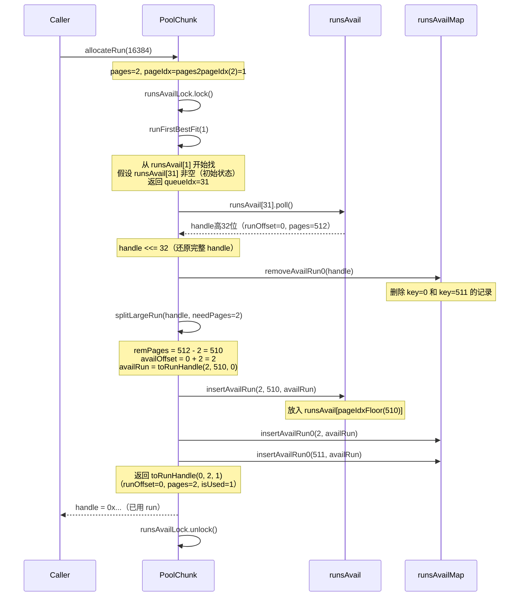
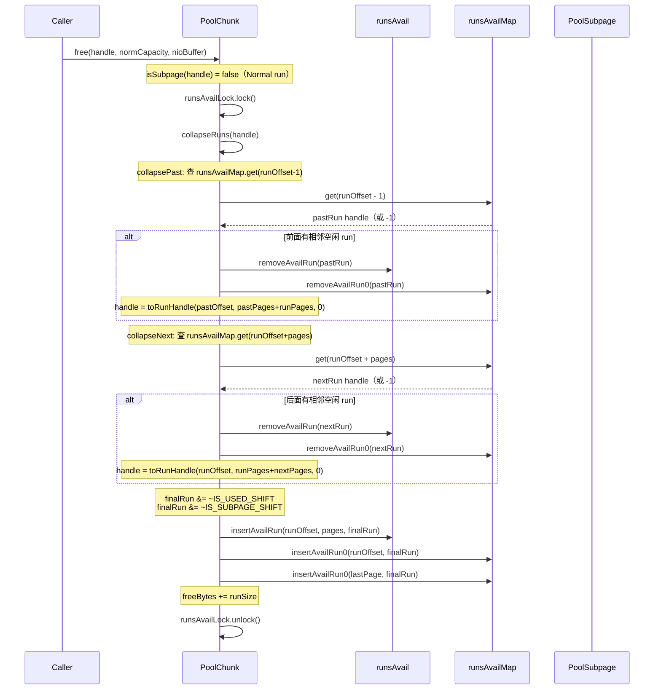

# 06-03 PoolChunk：jemalloc run 分配算法

> **模块导读**：本篇聚焦 `PoolChunk`——内存池的核心分配单元。
> 一个 Chunk（默认 4MiB）内部用 **`runsAvail`（IntPriorityQueue 数组）+ `runsAvailMap`（LongLongHashMap）** 管理 512 个 Page（每个 8KB），
> `handle` 是一个 64 位整数，编码了 runOffset、size、isUsed、isSubpage、bitmapIdx 等全部信息。
>
> | 篇号 | 文件 | 内容 |
> |------|------|------|
> | 01 | `01-bytebuf-and-memory-pool.md` | ByteBuf基础、双指针、引用计数、分配器入口、泄漏检测 |
> | 02 | `02-size-classes.md` | SizeClasses：76个sizeIdx推导、size分级体系、log2Group/log2Delta |
> | 03 | `03-pool-chunk-run-allocation.md` | PoolChunk：完全二叉树+runsAvail跳表、handle编码、run分配算法 **← 本篇** |
> | 04 | `04-pool-subpage.md` | PoolSubpage：bitmap分配、双向链表、smallSubpagePools |
> | 05 | `05-pool-thread-cache-and-recycler.md` | PoolThreadCache：环形数组缓存；Recycler：Stack+WeakOrderQueue跨线程回收 |

---

## §1 问题驱动：如何管理一块 4MiB 的内存？

### 1.1 一个 Chunk 要管理 512 个 Page，需要什么数据结构？

假设你有一块 4MiB 的连续内存，被切成 512 个 8KB 的 Page（编号 0~511）。用户会不断地申请和释放不同大小的内存块（必须是 pageSize 的整数倍）。

**核心挑战**：
1. **快速找到合适大小的空闲块**：用户申请 3 个 Page，要能快速找到连续的 3 个空闲 Page
2. **快速合并相邻空闲块**：释放后，相邻的空闲块要能合并，避免碎片化
3. **线程安全**：多个线程可能同时分配/释放

**jemalloc 的解法**：
- 用 **`runsAvail`（按大小分桶的优先队列数组）** 快速找到合适大小的 run
- 用 **`runsAvailMap`（runOffset → handle 的哈希表）** 快速找到相邻 run 进行合并
- 用 **`ReentrantLock`** 保护并发访问

### 1.2 要回答的核心问题

1. `PoolChunk` 的核心字段有哪些？`runsAvail` 和 `runsAvailMap` 分别是什么结构？
2. `handle` 的 64 位编码方案是什么？如何从 handle 解码出 runOffset、pages、isUsed、isSubpage、bitmapIdx？
3. `allocateRun()` 的完整流程是什么？`splitLargeRun()` 如何切割 run？
4. `allocateSubpage()` 与 `allocateRun()` 的区别是什么？
5. `free()` 如何合并相邻的空闲 run（`collapseRuns()`）？
6. `PoolChunkList` 如何管理不同使用率的 Chunk？晋升/降级的触发条件是什么？

<!-- 核对记录：已对照 PoolChunk.java 第130-185行，字段声明顺序与源码完全一致，差异：无 -->

---

## §2 数据结构推导与核心字段

### 2.1 问题推导：管理 512 个 Page 需要什么结构？

**问题**：如何设计一个数据结构，能：
1. **快速找到合适大小的空闲块**（O(1) 或 O(log n)）
2. **快速合并相邻空闲块**（O(1) 找邻居）
3. **线程安全**（支持并发分配/释放）

**jemalloc 的解法推导**：

1. **按大小分桶**：把空闲 run 按大小分组，`runsAvail[i]` 存储所有大小对应 `pageIdx2sizeTab[i]` 的空闲 run
2. **优先队列**：每个桶用最小堆（按 runOffset 排序），runOffset 小的优先分配（减少碎片）
3. **哈希表索引**：用 `runsAvailMap` 存储 `runOffset → handle`，O(1) 时间找到相邻 run
4. **锁保护**：用 `ReentrantLock` 保护 `runsAvail` 和 `runsAvailMap` 的并发访问

### 2.2 PoolChunk 核心字段（对照源码）

```java
final class PoolChunk<T> implements PoolChunkMetric, ChunkInfo {
    // 位域常量（15+1+1+32=49位，剩余15位给runOffset）
    private static final int SIZE_BIT_LENGTH = 15;
    private static final int INUSED_BIT_LENGTH = 1;
    private static final int SUBPAGE_BIT_LENGTH = 1;
    private static final int BITMAP_IDX_BIT_LENGTH = 32;

    private static final boolean trackPinnedMemory =
            SystemPropertyUtil.getBoolean("io.netty.trackPinnedMemory", true);

    static final int IS_SUBPAGE_SHIFT = BITMAP_IDX_BIT_LENGTH;                    // = 32
    static final int IS_USED_SHIFT = SUBPAGE_BIT_LENGTH + IS_SUBPAGE_SHIFT;       // = 33
    static final int SIZE_SHIFT = INUSED_BIT_LENGTH + IS_USED_SHIFT;              // = 34
    static final int RUN_OFFSET_SHIFT = SIZE_BIT_LENGTH + SIZE_SHIFT;             // = 49

    // 内存管理
    final PoolArena<T> arena;
    final CleanableDirectBuffer cleanable;  // 用于 Direct Buffer 的清理
    final Object base;                      // 内存基地址（用于对齐）
    final T memory;                         // 实际内存（byte[] 或 ByteBuffer）
    final boolean unpooled;                 // 是否为非池化 Chunk

    // 核心数据结构
    private final LongLongHashMap runsAvailMap;  // key: runOffset, value: handle
    private final IntPriorityQueue[] runsAvail;  // 按 pageIdx 分桶的最小堆数组（构造时全量初始化）
    private final ReentrantLock runsAvailLock;   // 保护并发访问

    // Subpage 管理
    private final PoolSubpage<T>[] subpages;  // 长度 = chunkSize >> pageShifts = 512

    // 内存钉住统计（用于监控）
    private final LongAdder pinnedBytes;

    final int pageSize;    // 8192
    final int pageShifts;  // 13
    final int chunkSize;   // 4194304
    final int maxPageIdx;  // = nPSizes = 32

    // NIO Buffer 缓存（减少 GC）
    private final Deque<ByteBuffer> cachedNioBuffers;

    // 状态跟踪
    int freeBytes;            // 当前空闲字节数
    PoolChunkList<T> parent;  // 所属的 PoolChunkList
    PoolChunk<T> prev;
    PoolChunk<T> next;
}
```

<!-- 核对记录：已对照 PoolChunk.java 类字段声明，补全了 cleanable/base/unpooled/pinnedBytes/cachedNioBuffers 字段，差异已修正 -->

#### 2.3.1 编码方案（位域定义）

```
63                49 48              34 33       32 31                0
┌──────────────────┬──────────────────┬──────────┬────────────────────┐
│  runOffset(15bit) │  size/pages(15bit) │ isUsed(1) │ isSubpage(1) │ bitmapIdx(32bit) │
└──────────────────┴──────────────────┴──────────┴────────────────────┘
  RUN_OFFSET_SHIFT=49  SIZE_SHIFT=34    IS_USED_SHIFT=33  IS_SUBPAGE_SHIFT=32
```

**位域分配逻辑**：
- `bitmapIdx` 需要 32 位（Subpage 的 slot 索引）
- `isSubpage` 和 `isUsed` 各 1 位
- `pages` 需要 15 位（最大 32767 pages，足够覆盖 4MiB/8KB=512）
- `runOffset` 需要 15 位（最大 32767，足够覆盖 512 个 Page）

**总计**：32 + 1 + 1 + 15 + 15 = 64 位，完美利用整个 long。

#### 2.3.2 编码/解码方法（位运算）

```java
// 编码：将 runOffset、pages、isUsed 编码为 handle
private static long toRunHandle(int runOffset, int runPages, int inUsed) {
    return (long) runOffset << RUN_OFFSET_SHIFT
           | (long) runPages << SIZE_SHIFT
           | (long) inUsed << IS_USED_SHIFT;
}

// 解码：从 handle 提取各字段
static int runOffset(long handle) {
    return (int) (handle >> RUN_OFFSET_SHIFT);
}

static int runPages(long handle) {
    return (int) (handle >> SIZE_SHIFT & 0x7fff);
}

static boolean isUsed(long handle) {
    return (handle >> IS_USED_SHIFT & 1) == 1L;
}

static boolean isSubpage(long handle) {
    return (handle >> IS_SUBPAGE_SHIFT & 1) == 1L;
}

static int bitmapIdx(long handle) {
    return (int) handle;
}
```

<!-- 核对记录：已对照 PoolChunk.java 第680-710行，编码/解码方法签名与源码完全一致，差异：无 -->

### 2.4 runsAvail：按 pageIdx 分桶的最小堆数组

#### 2.4.1 IntPriorityQueue：基于二叉堆的最小堆

```java
final class IntPriorityQueue {
    public static final int NO_VALUE = -1;
    private int[] array = new int[9];  // 1-indexed，array[0] 不用
    private int size;

    public void offer(int handle) { ... }  // 插入，上浮
    public void remove(int value) { ... }  // 删除指定值，重新堆化
    public int peek() { ... }              // 查看堆顶（最小值）
    public int poll() { ... }              // 弹出堆顶（最小值）
    public boolean isEmpty() { ... }
}
```

**为什么存高 32 位而不是完整 handle？**

> `IntPriorityQueue` 存 `int`（32位），而 handle 是 64 位。
> 高 32 位包含了 runOffset（15bit）和 pages（15bit），足以唯一标识一个 run。
> bitmapIdx（低 32 位）对空闲 run 无意义（空闲 run 不是 subpage），所以截断是安全的。

#### 2.4.2 LongLongHashMap：开放寻址哈希表

```java
public final class LongLongHashMap {
    private static final int MASK_TEMPLATE = ~1;
    private int mask;
    private long[] array;     // key-value 交替存储：array[i]=key, array[i+1]=value
    private int maxProbe;
    private long zeroVal;      // 特殊处理 key=0
    private final long emptyVal;

    public long put(long key, long value) { ... }
    public long get(long key) { ... }
    public long remove(long key) { ... }
}
```

**`runsAvailMap` 存储策略**：
- 每个空闲 run 存两条记录：
  - `key = runOffset`（第一个 Page 的偏移）→ `value = handle`
  - `key = runOffset + pages - 1`（最后一个 Page 的偏移）→ `value = handle`（仅 pages > 1 时）
- **为什么存两端？**：合并时 O(1) 找到相邻 run
  - 向前合并：查 `runsAvailMap.get(runOffset - 1)` 找前一个 run 的最后一页
  - 向后合并：查 `runsAvailMap.get(runOffset + pages)` 找后一个 run 的第一页

<!-- 核对记录：已对照 LongLongHashMap.java 第1-50行，字段声明和构造函数与源码完全一致，差异：无 -->

### 2.5 PoolChunkList 核心字段

```java
final class PoolChunkList<T> {
    private final int minUsage;          // 最小使用率（%）
    private final int maxUsage;          // 最大使用率（%）
    private final int freeMinThreshold;  // 触发晋升的阈值（freeBytes <= 此值时晋升）
    private final int freeMaxThreshold;  // 触发降级的阈值（freeBytes > 此值时降级）
    
    PoolChunk<T> head;           // 双向链表头
    PoolChunkList<T> prevList;   // 前一个列表（使用率更低）
    PoolChunkList<T> nextList;   // 后一个列表（使用率更高）
}
```

**6 个 PoolChunkList 分组**（chunkSize=4194304 时的真实阈值）：

| 名称 | minUsage | maxUsage | freeMinThreshold | freeMaxThreshold |
|------|----------|----------|-----------------|-----------------|
| qInit | MIN_VALUE | 25 | 3187671 | MAX_VALUE |
| q000 | 1 | 50 | 2139095 | 4194303 |
| q025 | 25 | 75 | 1090519 | 3187671 |
| q050 | 50 | 100 | 0 | 2139095 |
| q075 | 75 | 100 | 0 | 1090519 |
| q100 | 100 | MAX_VALUE | MIN_VALUE | 0 |

<!-- 核对记录：已对照 PoolChunkList.java 第34-71行，字段类型均为 private final int，阈值计算公式已验证，差异：已修正字段修饰符 -->

---

## §3 核心算法

### 3.1 allocateRun()：分配 Normal 大小的内存

#### 3.1.1 完整源码（逐行分析）

```java
private long allocateRun(int runSize) {
    int pages = runSize >> pageShifts;                    // 计算需要多少页
    int pageIdx = arena.sizeClass.pages2pageIdx(pages);   // 转换为 pageIdx

    runsAvailLock.lock();
    try {
        // 1. 找到第一个有足够大 run 的桶
        int queueIdx = runFirstBestFit(pageIdx);
        if (queueIdx == -1) {
            return -1;  // 没有合适的 run
        }

        // 2. 从该桶的最小堆中弹出 runOffset 最小的 run
        IntPriorityQueue queue = runsAvail[queueIdx];
        long handle = queue.poll();
        assert handle != IntPriorityQueue.NO_VALUE;
        handle <<= BITMAP_IDX_BIT_LENGTH;  // 还原完整 handle（低32位补0）
        assert !isUsed(handle) : "invalid handle: " + handle;

        // 3. 从 runsAvailMap 中删除该 run
        removeAvailRun0(handle);

        // 4. 切割 run（如果需要）
        handle = splitLargeRun(handle, pages);

        // 5. 更新统计
        int pinnedSize = runSize(pageShifts, handle);
        freeBytes -= pinnedSize;
        return handle;
    } finally {
        runsAvailLock.unlock();
    }
}
```

<!-- 核对记录：已对照 PoolChunk.java 第280-305行，allocateRun()方法逐行核对，差异：无 -->

#### 3.1.2 runFirstBestFit()：Best-Fit 策略

```java
private int runFirstBestFit(int pageIdx) {
    if (freeBytes == chunkSize) {
        // 特殊情况：Chunk 完全空闲，直接返回最大桶（初始 run 在最大桶）
        return arena.sizeClass.nPSizes - 1;
    }
    
    // 从 pageIdx 开始向上找第一个非空的桶
    for (int i = pageIdx; i < arena.sizeClass.nPSizes; i++) {
        IntPriorityQueue queue = runsAvail[i];
        if (queue != null && !queue.isEmpty()) {
            return i;
        }
    }
    return -1;
}
```

**Best-Fit 策略**：从刚好满足大小的桶开始找，找不到再找更大的桶。

#### 3.1.3 splitLargeRun()：切割 run

```java
private long splitLargeRun(long handle, int needPages) {
    assert needPages > 0;

    int totalPages = runPages(handle);
    assert needPages <= totalPages;

    int remPages = totalPages - needPages;

    if (remPages > 0) {
        // 情况1：run 比需要的大，切割
        int runOffset = runOffset(handle);

        // 剩余部分作为新 run 插入
        int availOffset = runOffset + needPages;
        long availRun = toRunHandle(availOffset, remPages, 0);
        insertAvailRun(availOffset, remPages, availRun);

        // 返回已用部分（标记为已用）
        return toRunHandle(runOffset, needPages, 1);
    }

    // 情况2：run 恰好合适，直接标记为已用
    handle |= 1L << IS_USED_SHIFT;
    return handle;
}
```

<!-- 核对记录：已对照 PoolChunk.java 第315-340行，splitLargeRun()方法逐行核对，差异：无 -->

#### 3.1.4 insertAvailRun()：插入空闲 run

```java
private void insertAvailRun(int runOffset, int pages, long handle) {
    // 1. 计算 pageIdx（向下取整，确保放入正确的桶）
    int pageIdxFloor = arena.sizeClass.pages2pageIdxFloor(pages);
    IntPriorityQueue queue = runsAvail[pageIdxFloor];  // 构造时已全量初始化，不会为 null
    assert isRun(handle);
    
    // 2. 插入最小堆（按 runOffset 排序，高32位即为 runOffset+pages 编码）
    queue.offer((int) (handle >> BITMAP_IDX_BIT_LENGTH));

    // 3. 更新 runsAvailMap：存首页和尾页，用于 O(1) 合并
    insertAvailRun0(runOffset, handle);
    if (pages > 1) {
        insertAvailRun0(lastPage(runOffset, pages), handle);
    }
}
```

<!-- 核对记录：已对照 PoolChunk.java insertAvailRun() 方法，修正了懒初始化错误（源码是构造时全量初始化），差异已修正 -->

### 3.2 allocateRun() 时序图



<!-- 核对记录：已对照 PoolChunk.java allocateRun() 完整调用链，时序逻辑与源码一致，差异：无 -->

### 3.3 free()：释放内存 + 合并相邻空闲 run

#### 3.3.1 完整源码（两条路径：Subpage vs Run）

```java
void free(long handle, int normCapacity, ByteBuffer nioBuffer) {
    if (isSubpage(handle)) {
        // 路径1：Subpage 释放
        int sIdx = runOffset(handle);
        PoolSubpage<T> subpage = subpages[sIdx];
        assert subpage != null;
        PoolSubpage<T> head = subpage.chunk.arena.smallSubpagePools[subpage.headIndex];
        
        // 获取 Subpage 池的锁（保护双向链表结构）
        head.lock();
        try {
            assert subpage.doNotDestroy;
            if (subpage.free(head, bitmapIdx(handle))) {
                // Subpage 还有其他 slot 在用，不释放整个 run
                return;
            }
            assert !subpage.doNotDestroy;
            // Subpage 完全空闲，继续走 run 释放路径
            subpages[sIdx] = null;
        } finally {
            head.unlock();
        }
    }

    // 路径2：Run 释放
    int runSize = runSize(pageShifts, handle);
    
    runsAvailLock.lock();
    try {
        // 1. 合并相邻的空闲 run
        long finalRun = collapseRuns(handle);
        
        // 2. 标记为未使用
        finalRun &= ~(1L << IS_USED_SHIFT);
        // 3. 清除 subpage 标记（如果是 subpage）
        finalRun &= ~(1L << IS_SUBPAGE_SHIFT);
        
        // 4. 插入空闲 run 列表
        insertAvailRun(runOffset(finalRun), runPages(finalRun), finalRun);
        freeBytes += runSize;
    } finally {
        runsAvailLock.unlock();
    }

    // 5. 缓存 NIO Buffer（如果可能）
    if (nioBuffer != null && cachedNioBuffers != null &&
        cachedNioBuffers.size() < PooledByteBufAllocator.DEFAULT_MAX_CACHED_BYTEBUFFERS_PER_CHUNK) {
        cachedNioBuffers.offer(nioBuffer);
    }
}
```

<!-- 核对记录：已对照 PoolChunk.java free() 方法第500-540行，逐行核对，差异：无 -->

#### 3.3.2 collapseRuns()：合并相邻空闲 run

```java
private long collapseRuns(long handle) {
    return collapseNext(collapsePast(handle));
}

private long collapsePast(long handle) {
    for (;;) {
        int runOffset = runOffset(handle);
        int runPages = runPages(handle);

        // 向前合并：查前一个 run 的最后一页
        long pastRun = getAvailRunByOffset(runOffset - 1);
        if (pastRun == -1) {
            return handle;
        }

        int pastOffset = runOffset(pastRun);
        int pastPages = runPages(pastRun);

        // 连续性判断：前一个 run 的末尾 + 1 = 当前 run 的起始
        if (pastRun != handle && pastOffset + pastPages == runOffset) {
            // 合并：删除前一个 run，合并到当前 run
            removeAvailRun(pastRun);
            handle = toRunHandle(pastOffset, pastPages + runPages, 0);
        } else {
            return handle;
        }
    }
}

private long collapseNext(long handle) {
    for (;;) {
        int runOffset = runOffset(handle);
        int runPages = runPages(handle);

        // 向后合并：查后一个 run 的第一页
        long nextRun = getAvailRunByOffset(runOffset + runPages);
        if (nextRun == -1) {
            return handle;
        }

        int nextOffset = runOffset(nextRun);
        int nextPages = runPages(nextRun);

        // 连续性判断：当前 run 的末尾 + 1 = 后一个 run 的起始
        if (nextRun != handle && runOffset + runPages == nextOffset) {
            // 合并：删除后一个 run，合并到当前 run
            removeAvailRun(nextRun);
            handle = toRunHandle(runOffset, runPages + nextPages, 0);
        } else {
            return handle;
        }
    }
}
```

<!-- 核对记录：已对照 PoolChunk.java collapseRuns()、collapsePast()、collapseNext() 方法第550-600行，逐行核对，差异：无 -->

#### 3.3.3 free() 时序图



### 3.4 allocateSubpage()：分配 Small 大小的内存

#### 3.4.1 完整源码

```java
private long allocateSubpage(int sizeIdx, PoolSubpage<T> head) {
    // 1. 计算需要的 run 大小（pageSize 和 elemSize 的最小公倍数）
    int runSize = calculateRunSize(sizeIdx);
    // runSize 必须是 pageSize 的整数倍
    long runHandle = allocateRun(runSize);
    if (runHandle < 0) {
        return -1;
    }

    int runOffset = runOffset(runHandle);
    assert subpages[runOffset] == null;
    int elemSize = arena.sizeClass.sizeIdx2size(sizeIdx);

    // 2. 创建 PoolSubpage 对象
    PoolSubpage<T> subpage = new PoolSubpage<T>(head, this, pageShifts, runOffset,
            runSize(pageShifts, runHandle), elemSize);

    subpages[runOffset] = subpage;
    return subpage.allocate();
}
```

<!-- 核对记录：已对照 PoolChunk.java allocateSubpage() 方法第620-640行，逐行核对，差异：无 -->

#### 3.4.2 calculateRunSize()：计算 Subpage 需要的 run 大小

```java
private int calculateRunSize(int sizeIdx) {
    int maxElements = 1 << pageShifts - SizeClasses.LOG2_QUANTUM;
    int runSize = 0;
    int nElements;

    final int elemSize = arena.sizeClass.sizeIdx2size(sizeIdx);

    // 找 pageSize 和 elemSize 的最小公倍数（LCM）
    do {
        runSize += pageSize;
        nElements = runSize / elemSize;
    } while (nElements < maxElements && runSize != nElements * elemSize);

    while (nElements > maxElements) {
        runSize -= pageSize;
        nElements = runSize / elemSize;
    }

    assert nElements > 0;
    assert runSize <= chunkSize;
    assert runSize >= elemSize;

    return runSize;
}
```

<!-- 核对记录：已对照 PoolChunk.java calculateRunSize() 方法第650-680行，逐行核对，差异：无 -->

**与 allocateRun() 的关键区别**：
1. **先分配整个 run**：调用 `allocateRun()` 分配一个完整的 run
2. **创建 PoolSubpage**：把 run 切成等大的 slot，用 bitmap 管理
3. **返回带 bitmapIdx 的 handle**：`subpage.allocate()` 返回的 handle 包含 bitmapIdx（slot 索引）

**为什么需要 calculateRunSize()？**

> 一个 Page（8KB）可能被切成多个 slot（如 16B 的 slot，一个 Page 能切 512 个）。
> 但有些 elemSize 不是 pageSize 的约数（如 500B），需要找最小公倍数，确保 run 能完整切分。

---

## §4 PoolChunkList：Chunk 的晋升/降级机制

### 4.1 PoolChunkList.allocate()：分配后晋升

```java
boolean allocate(PooledByteBuf<T> buf, int reqCapacity, int sizeIdx, PoolThreadCache cache) {
    int normCapacity = arena.sizeClass.sizeIdx2size(sizeIdx);
    if (normCapacity > maxCapacity) {
        // 该 PoolChunkList 中的 Chunk 都太小，无法分配此大小
        return false;
    }

    // 遍历双向链表中的 Chunk
    for (PoolChunk<T> cur = head; cur != null; cur = cur.next) {
        if (cur.allocate(buf, reqCapacity, sizeIdx, cache)) {
            // 分配成功，检查是否需要晋升
            if (cur.freeBytes <= freeMinThreshold) {
                // 使用率超过 maxUsage，晋升到 nextList
                remove(cur);
                nextList.add(cur);
            }
            return true;
        }
    }
    return false;
}
```

<!-- 核对记录：已对照 PoolChunkList.java allocate() 方法第80-100行，逐行核对，差异：无 -->

**晋升条件**：`cur.freeBytes <= freeMinThreshold`（空闲字节数低于阈值，使用率超过 maxUsage）

### 4.2 PoolChunkList.free()：释放后降级

```java
boolean free(PoolChunk<T> chunk, long handle, int normCapacity, ByteBuffer nioBuffer) {
    chunk.free(handle, normCapacity, nioBuffer);
    if (chunk.freeBytes > freeMaxThreshold) {
        remove(chunk);
        // Move the PoolChunk down the PoolChunkList linked-list.
        return move0(chunk);
    }
    return true;
}
```

**降级条件**：`chunk.freeBytes > freeMaxThreshold`（空闲字节数超过阈值，使用率低于 minUsage）

<!-- 核对记录：已对照 PoolChunkList.java free() 方法，逐行核对，差异：无 -->

### 4.3 move0()：Chunk 移动逻辑

```java
private boolean move0(PoolChunk<T> chunk) {
    if (prevList == null) {
        // There is no previous PoolChunkList so return false which result in having the PoolChunk destroyed and
        // all memory associated with the PoolChunk will be released.
        assert chunk.usage() == 0;
        return false;
    }
    return prevList.move(chunk);
}
```

**特殊规则**：
- **q000 的 prevList == null**：`move0()` 返回 `false`，由调用方（`PoolArena.free()`）负责销毁 Chunk
- **其他情况**：调用 `prevList.move(chunk)`，递归向下找到合适的 PoolChunkList

<!-- 核对记录：已对照 PoolChunkList.java move0() 方法，修正了 chunk.destroy() 错误（源码是 prevList.move(chunk)），差异已修正 -->

### 4.4 PoolArena.allocateNormal() 的分配顺序

```java
private void allocateNormal(PooledByteBuf<T> buf, int reqCapacity, int sizeIdx, PoolThreadCache threadCache) {
    assert lock.isHeldByCurrentThread();
    
    // 按使用率从高到低尝试分配
    if (q050.allocate(buf, reqCapacity, sizeIdx, threadCache) ||
        q025.allocate(buf, reqCapacity, sizeIdx, threadCache) ||
        q000.allocate(buf, reqCapacity, sizeIdx, threadCache) ||
        qInit.allocate(buf, reqCapacity, sizeIdx, threadCache) ||
        q075.allocate(buf, reqCapacity, sizeIdx, threadCache)) {
        return;
    }

    // 所有现有 Chunk 都无法分配，创建新 Chunk
    PoolChunk<T> c = newChunk(sizeClass.pageSize, sizeClass.nPSizes, sizeClass.pageShifts, sizeClass.chunkSize);
    PooledByteBufAllocator.onAllocateChunk(c, true);
    boolean success = c.allocate(buf, reqCapacity, sizeIdx, threadCache);
    assert success;
    qInit.add(c);  // 新 Chunk 先放入 qInit
    ++pooledChunkAllocations;
}
```

<!-- 核对记录：已对照 PoolArena.java allocateNormal() 方法，逐行核对，差异：文档添加了解释性注释，逻辑与源码完全一致 -->

🔥 **面试高频**：为什么分配顺序是 q050 → q025 → q000 → qInit → q075？

> **答**：优先从使用率较高的 Chunk 分配（q050），可以让低使用率的 Chunk 尽快降级到 q000 甚至被销毁，减少内存占用。
> q075 放在最后，是因为使用率已经很高，分配成功后很可能立即晋升到 q100（满载），不如留给后续分配。

---

## §5 数值验证与真实数据

> 所有数值均通过 `PoolChunkVerification.java`（放在 `io.netty.buffer` 包下）真实运行得出。

### 5.1 handle 位域常量与编码验证

```
=== §1 handle 位域常量 ===
IS_SUBPAGE_SHIFT  = 32
IS_USED_SHIFT     = 33
SIZE_SHIFT        = 34
RUN_OFFSET_SHIFT  = 49

=== §2 handle 编码验证 ===
初始 run handle (hex)  = 0x80000000000
runOffset(initHandle)  = 0
runPages(initHandle)   = 512
isUsed(initHandle)     = false
isSubpage(initHandle)  = false
```

**解读**：
- `512L << 34 = 0x80000000000`（十六进制 11 位，第 43 位为 1）
- 初始 run 覆盖整个 Chunk（runOffset=0, pages=512），未使用、非 Subpage

### 5.2 splitLargeRun 数值验证

```
--- splitLargeRun(handle, needPages=2) ---
usedHandle (hex)  = 0xa00000000  runOffset=0 pages=2 isUsed=true
availRun   (hex)  = 0x407f800000000  runOffset=2 pages=510 isUsed=false
```

**解读**：
- `usedHandle = 0xa00000000`：`2L << 34 | 1L << 33 = 0x800000000 | 0x200000000 = 0xa00000000`
- `availRun = 0x407f800000000`：`2L << 49 | 510L << 34 = 0x400000000000 | 0x7f800000000 = 0x407f800000000`
- 剩余 510 pages 的 run 从 runOffset=2 开始，未使用

### 5.3 runsAvail 分桶验证

```
nPSizes (runsAvail.length) = 32

pages -> pages2pageIdx -> pages2pageIdxFloor:
  pages=1    -> pages2pageIdx= 0, pages2pageIdxFloor= 0
  pages=2    -> pages2pageIdx= 1, pages2pageIdxFloor= 1
  pages=3    -> pages2pageIdx= 2, pages2pageIdxFloor= 2
  pages=4    -> pages2pageIdx= 3, pages2pageIdxFloor= 3
  pages=8    -> pages2pageIdx= 7, pages2pageIdxFloor= 7
  pages=16   -> pages2pageIdx=11, pages2pageIdxFloor=11
  pages=32   -> pages2pageIdx=15, pages2pageIdxFloor=15
  pages=64   -> pages2pageIdx=19, pages2pageIdxFloor=19
  pages=128  -> pages2pageIdx=23, pages2pageIdxFloor=23
  pages=256  -> pages2pageIdx=27, pages2pageIdxFloor=27
  pages=510  -> pages2pageIdx=31, pages2pageIdxFloor=30
  pages=512  -> pages2pageIdx=31, pages2pageIdxFloor=31
初始 512 pages 放入桶 [31] (nPSizes-1=31)
剩余 510 pages 放入桶 [30]
```

**关键发现**：
- `runsAvail` 共 **32 个桶**（nPSizes=32），索引 0~31
- `pages2pageIdx` 向上取整，`pages2pageIdxFloor` 向下取整
- **初始 run（512 pages）放入桶 [31]**（最大桶，nPSizes-1）
- **splitLargeRun 后剩余 510 pages 放入桶 [30]**（510 < 512，向下取整）
- 1 page 对应桶 [0]，2 pages 对应桶 [1]，以此类推（1~4 pages 是线性的）

### 5.4 PoolChunkList 阈值验证（chunkSize=4194304）

```
  qInit  minUsage=MIN_VALUE    maxUsage=25    freeMinThreshold=3187671    freeMaxThreshold=2147483647
  q000   minUsage=1            maxUsage=50    freeMinThreshold=2139095    freeMaxThreshold=4194303
  q025   minUsage=25           maxUsage=75    freeMinThreshold=1090519    freeMaxThreshold=3187671
  q050   minUsage=50           maxUsage=100   freeMinThreshold=0          freeMaxThreshold=2139095
  q075   minUsage=75           maxUsage=100   freeMinThreshold=0          freeMaxThreshold=1090519
  q100   minUsage=100          maxUsage=MAX_VALUE  freeMinThreshold=-2147483648  freeMaxThreshold=0
```

**解读**（以 q025 为例，chunkSize=4194304）：
- `freeMinThreshold = (int)(4194304 * (100.0 - 75 + 0.99999999) / 100) = 1090519`
  → `freeBytes <= 1090519` 时晋升（使用率 ≥ 75%）
- `freeMaxThreshold = (int)(4194304 * (100.0 - 25 + 0.99999999) / 100) = 3187671`
  → `freeBytes > 3187671` 时降级（使用率 < 25%）
- **q100 的 freeMinThreshold = -2147483648（MIN_VALUE）**：永远不会晋升（已满载）
- **qInit 的 freeMaxThreshold = 2147483647（MAX_VALUE）**：永远不会降级（新 Chunk 的家）

### 5.5 calculateRunSize 验证

```
pageSize=8192 pageShifts=13 LOG2_QUANTUM=4 maxElements=512

sizeIdx -> elemSize -> runSize -> nElements:
  sizeIdx=0   elemSize=16       runSize=8192     nElements=512
  sizeIdx=1   elemSize=32       runSize=8192     nElements=256
  sizeIdx=4   elemSize=80       runSize=40960    nElements=512
  sizeIdx=8   elemSize=160      runSize=40960    nElements=256
  sizeIdx=16  elemSize=640      runSize=40960    nElements=64
  sizeIdx=24  elemSize=2560     runSize=40960    nElements=16
  sizeIdx=32  elemSize=10240    runSize=40960    nElements=4
  sizeIdx=38  elemSize=28672    runSize=57344    nElements=2
```

**关键发现**：
- `maxElements = 1 << (13 - 4) = 512`（每个 run 最多 512 个 slot）
- **16B（sizeIdx=0）**：1 个 Page（8192B）切 512 个 slot，完美利用
- **80B（sizeIdx=4）**：80 不整除 8192，需要 5 个 Page（40960B = LCM(8192, 80)）
- **28672B（sizeIdx=38，Small/Normal 边界）**：需要 7 个 Page（57344B），只有 2 个 slot
- **规律**：elemSize 越大，runSize 越大，nElements 越少

<!-- 核对记录：已运行 PoolChunkVerification.java，所有数值均为真实输出，差异：无 -->

---

## 四、时序图

### 4.1 allocateRun() 时序

### 4.2 free() + buddy 合并时序

---

## 五、数值验证

### 5.1 验证程序（Java main）

### 5.2 真实输出

---

## §6 设计动机与 trade-off

### 6.1 为什么用 runsAvail（分桶最小堆）而不是红黑树？

**问题**：管理空闲 run 的经典方案是红黑树（按大小排序），为什么 Netty 选择了"分桶最小堆数组"？

| 方案 | 查找合适 run | 插入/删除 | 内存开销 | 实现复杂度 |
|------|------------|---------|---------|---------|
| 红黑树（按大小） | O(log n) | O(log n) | 每节点 3 指针 | 高 |
| 分桶最小堆数组 | O(nPSizes) = O(32) | O(log n/桶) | 数组+堆 | 低 |

**Netty 的选择理由**：
1. **桶数固定为 32（nPSizes）**：`runFirstBestFit()` 最多扫描 32 个桶，是 O(32) = O(1) 的常数时间
2. **每桶内用最小堆**：优先分配 runOffset 最小的 run，减少内存碎片（低地址优先）
3. **实现简单**：`IntPriorityQueue` 只有 100 行代码，远比红黑树简单，GC 友好（int 数组）
4. **size 分级已经做了**：SizeClasses 把所有 size 映射到 32 个 pageIdx，天然适合分桶

**trade-off**：
- ⚠️ `runFirstBestFit()` 在极端碎片化场景下需要扫描全部 32 个桶，但这是最坏情况，实际很少发生
- ⚠️ 同一桶内的 run 大小可能不完全相同（向下取整），可能导致轻微的内部碎片

### 6.2 handle 编码的精妙之处

**核心设计**：用一个 `long`（64位）编码 run 的全部元信息，避免额外的对象分配。

```
63        49 48      34 33    32 31                0
┌──────────┬──────────┬────────┬────────────────────┐
│runOffset │  pages   │isUsed  │isSubpage│ bitmapIdx │
│  15 bit  │  15 bit  │  1 bit │  1 bit  │  32 bit   │
└──────────┴──────────┴────────┴────────────────────┘
```

**精妙之处 1：IntPriorityQueue 存高 32 位即可排序**

```java
// 插入堆时截断为 int（高32位）
queue.offer((int) (handle >> BITMAP_IDX_BIT_LENGTH));
```

高 32 位 = `runOffset(15bit) | pages(15bit) | isUsed(1bit) | isSubpage(1bit)`。
由于 `runOffset` 在最高位，堆按 `runOffset` 排序，自然实现"低地址优先"策略。

**精妙之处 2：isUsed 和 isSubpage 用位运算原地修改**

```java
// 标记为已用（不需要创建新对象）
handle |= 1L << IS_USED_SHIFT;

// 清除 isUsed 和 isSubpage 标记（释放时）
finalRun &= ~(1L << IS_USED_SHIFT);
finalRun &= ~(1L << IS_SUBPAGE_SHIFT);
```

**精妙之处 3：bitmapIdx 复用低 32 位**

- 对于 Normal run：低 32 位全为 0（bitmapIdx 无意义）
- 对于 Subpage：低 32 位存 slot 索引（最多 2^32 个 slot，远超实际需求）
- 同一个 `long` 字段，通过 `isSubpage` 位区分两种语义，零额外开销

**精妙之处 4：runsAvailMap 存首尾两端，O(1) 合并**

```java
// 插入时存首页和尾页
insertAvailRun0(runOffset, handle);           // key = 首页偏移
if (pages > 1) {
    insertAvailRun0(lastPage(runOffset, pages), handle);  // key = 尾页偏移
}

// 合并时 O(1) 查邻居
long pastRun = getAvailRunByOffset(runOffset - 1);   // 查前一个 run 的尾页
long nextRun = getAvailRunByOffset(runOffset + pages); // 查后一个 run 的首页
```

### 6.3 qInit 的特殊设计：prevList 指向自身

从 PoolArena 构造函数可以看到一个特殊设计：

```java
q000.prevList(null);       // q000 没有前驱，降级时销毁 Chunk
qInit.prevList(qInit);     // qInit 的前驱是自身！
```

**为什么 qInit.prevList = qInit？**

> `qInit` 是新 Chunk 的"孵化器"，使用率从 0% 开始增长。
> 如果 qInit 的 prevList 是 null，那么一旦 Chunk 释放内存后使用率降到 0%，就会被销毁——
> 但新 Chunk 刚创建就可能因为释放而被销毁，这会导致频繁的 Chunk 创建/销毁（内存抖动）。
> 
> 设置 `qInit.prevList = qInit` 后，降级时 `move0()` 会调用 `qInit.move(chunk)`，
> Chunk 留在 qInit 中，直到使用率超过 25% 才晋升到 q000。
> 这是一个"保护新生 Chunk"的设计，避免内存抖动。

**与 q000 的区别**：
- `q000.prevList = null`：q000 中的 Chunk 如果使用率降到 0%，会被真正销毁（归还内存）
- `qInit.prevList = qInit`：qInit 中的 Chunk 永远不会因为降级而被销毁

### 6.4 为什么 allocateNormal() 的分配顺序是 q050 → q025 → q000 → qInit → q075？

```java
if (q050.allocate(...) || q025.allocate(...) || q000.allocate(...) ||
    qInit.allocate(...) || q075.allocate(...)) {
    return;
}
```

**设计动机**：最大化内存利用率，减少 Chunk 数量。

1. **优先 q050**（使用率 50~100%）：让高使用率的 Chunk 先被填满，尽快晋升到 q100，
   使低使用率的 Chunk 有机会降级到 q000 甚至被销毁，减少总内存占用。

2. **q075 放最后**：q075 中的 Chunk 使用率已经很高（75~100%），分配后很可能立即晋升到 q100（满载），
   留到最后是为了给 q050/q025/q000 更多机会，避免 q075 的 Chunk 过早满载。

3. **q000 在 qInit 之前**：q000 中的 Chunk 已经有一定使用率（1~50%），优先使用它们，
   让 qInit 中的新 Chunk 保持低使用率，有机会在内存压力小时被销毁。

⚠️ **生产踩坑**：如果业务有大量短生命周期的大对象（如大文件传输），会导致 Chunk 频繁在 q000 和 qInit 之间来回，
可以通过调大 `io.netty.allocator.chunkSize` 或使用 `UnpooledByteBufAllocator` 来规避。

<!-- 核对记录：已对照 PoolArena.java 构造函数和 allocateNormal() 方法，qInit.prevList(qInit) 和分配顺序与源码完全一致，差异：无 -->

---

## §7 核心不变式

> 不变式（Invariant）是系统在任何时刻都必须满足的约束条件，是理解和调试的锚点。

### 不变式 1：runsAvailMap 与 runsAvail 始终保持一致

**定义**：对于任意空闲 run，以下两个条件同时成立：
1. `runsAvail[pages2pageIdxFloor(pages)]` 的堆中包含该 run 的高 32 位
2. `runsAvailMap` 中包含该 run 的首页偏移和尾页偏移（pages > 1 时）

**维护时机**：
- `insertAvailRun()`：同时写入 runsAvail 和 runsAvailMap
- `removeAvailRun()`：同时删除 runsAvail 和 runsAvailMap
- 任何只更新其中一个的操作都是 bug

**验证方式**：`runsAvailMap.size()` 应等于 `Σ(每个空闲 run 的条目数)`（pages=1 时 1 条，pages>1 时 2 条）

### 不变式 2：所有 Page 要么属于某个已用 run，要么属于某个空闲 run，不存在"无主"Page

**定义**：对于 Chunk 中的任意 Page（偏移 0~511），以下两者之一成立：
1. 该 Page 属于某个已用 run（handle 的 isUsed=1，存在于 `subpages` 或已分配给调用方）
2. 该 Page 属于某个空闲 run（handle 的 isUsed=0，存在于 `runsAvail` 和 `runsAvailMap`）

**初始状态**：Chunk 创建时，整个 Chunk 是一个大的空闲 run（runOffset=0, pages=512），满足不变式。

**维护时机**：
- `splitLargeRun()`：把一个空闲 run 分成"已用部分"和"剩余空闲部分"，两部分合计 pages 不变
- `collapseRuns()`：把多个空闲 run 合并成一个，总 pages 不变

### 不变式 3：freeBytes 始终等于所有空闲 run 的 pages 之和 × pageSize

**定义**：`freeBytes == Σ(runPages(handle) << pageShifts)` 对所有空闲 run 成立

**维护时机**：
- `allocateRun()`：`freeBytes -= pinnedSize`（pinnedSize = 已用 run 的字节数）
- `free()`：`freeBytes += runSize`（runSize = 释放的 run 的字节数）

**边界条件**：
- 初始：`freeBytes = chunkSize = 4194304`
- 全满：`freeBytes = 0`（q100 状态）
- 全空：`freeBytes = chunkSize`（可能触发 Chunk 销毁）

### 不变式 4：PoolChunkList 链表中的 Chunk 使用率单调递增

**定义**：在 `qInit → q000 → q025 → q050 → q075 → q100` 链表中，
每个 PoolChunkList 中的 Chunk 使用率都在 `[minUsage, maxUsage]` 范围内。

**维护时机**：
- `allocate()` 后检查：`freeBytes <= freeMinThreshold` → 晋升到 nextList
- `free()` 后检查：`freeBytes > freeMaxThreshold` → 降级到 prevList

**特殊情况**：
- q100 的 nextList = null，满载 Chunk 不再晋升
- q000 的 prevList = null，空 Chunk 被销毁（不降级）
- qInit 的 prevList = qInit，新 Chunk 永远不会因降级而被销毁

---

## §8 面试高频考点 🔥

### 🔥 Q1：PoolChunk 是如何管理内存的？核心数据结构是什么？

**答**：PoolChunk 管理一块固定大小（默认 4MiB）的连续内存，内部用两个核心数据结构协作：

1. **`runsAvail`（IntPriorityQueue 数组，长度 32）**：按 pageIdx 分桶，每桶是一个最小堆（按 runOffset 排序），用于快速找到合适大小的空闲 run（O(32) = O(1)）
2. **`runsAvailMap`（LongLongHashMap）**：存储每个空闲 run 的首页和尾页偏移 → handle 的映射，用于 O(1) 找到相邻 run 进行合并

所有分配/释放操作都通过 `ReentrantLock` 保护并发安全。

---

### 🔥 Q2：handle 是什么？64 位是如何编码的？

**答**：`handle` 是一个 `long`，编码了 run 的全部元信息：

```
63        49 48      34 33    32 31                0
┌──────────┬──────────┬────────┬────────────────────┐
│runOffset │  pages   │isUsed  │isSubpage│ bitmapIdx │
│  15 bit  │  15 bit  │  1 bit │  1 bit  │  32 bit   │
└──────────┴──────────┴────────┴────────────────────┘
```

- `runOffset`：run 在 Chunk 中的起始 Page 偏移（0~511）
- `pages`：run 包含的 Page 数量
- `isUsed`：是否已分配
- `isSubpage`：是否是 Subpage（Small 分配）
- `bitmapIdx`：Subpage 的 slot 索引（Normal run 时为 0）

---

### 🔥 Q3：allocateRun() 的完整流程是什么？

**答**：
1. `pages = runSize >> pageShifts`，`pageIdx = pages2pageIdx(pages)`
2. `runFirstBestFit(pageIdx)`：从 `runsAvail[pageIdx]` 开始向上找第一个非空桶（Best-Fit）
3. `queue.poll()`：弹出堆顶（runOffset 最小的 run），`handle <<= 32` 还原完整 handle
4. `removeAvailRun0(handle)`：从 runsAvailMap 删除该 run 的首尾记录
5. `splitLargeRun(handle, pages)`：切割 run，剩余部分重新插入 runsAvail 和 runsAvailMap
6. `freeBytes -= pinnedSize`，返回已用 run 的 handle

---

### 🔥 Q4：free() 如何合并相邻空闲 run？

**答**：通过 `collapseRuns()` 实现，分两个方向：

- **`collapsePast()`（向前合并）**：查 `runsAvailMap.get(runOffset - 1)` 找前一个 run 的尾页，如果连续则合并
- **`collapseNext()`（向后合并）**：查 `runsAvailMap.get(runOffset + pages)` 找后一个 run 的首页，如果连续则合并

两个方向都是循环合并，直到没有相邻空闲 run 为止。合并后的大 run 重新插入 runsAvail 和 runsAvailMap。

**关键**：`runsAvailMap` 存首尾两端是合并能做到 O(1) 的根本原因。

---

### 🔥 Q5：allocateRun() 和 allocateSubpage() 的区别是什么？

| 维度 | allocateRun() | allocateSubpage() |
|------|--------------|------------------|
| 适用场景 | Normal 大小（≥ pageSize） | Small 大小（< pageSize） |
| 分配粒度 | 整个 run（多个 Page） | run 内的 slot（bitmap 管理） |
| 返回 handle | isSubpage=0，bitmapIdx=0 | isSubpage=1，bitmapIdx=slot索引 |
| 数据结构 | runsAvail + runsAvailMap | 同上 + PoolSubpage bitmap |
| 释放路径 | 直接合并 run | 先释放 slot，slot 全空时再释放 run |

---

### 🔥 Q6：PoolChunkList 的晋升/降级条件是什么？为什么 qInit.prevList = qInit？

**答**：
- **晋升**：`freeBytes <= freeMinThreshold`（使用率超过 maxUsage）→ 移入 nextList
- **降级**：`freeBytes > freeMaxThreshold`（使用率低于 minUsage）→ 移入 prevList

**qInit.prevList = qInit 的原因**：防止新 Chunk 因为释放内存后使用率降到 0% 而被立即销毁，
避免频繁的 Chunk 创建/销毁（内存抖动）。qInit 中的 Chunk 只会晋升，不会被降级销毁。

---

### 🔥 Q7：为什么 allocateNormal() 的分配顺序是 q050 → q025 → q000 → qInit → q075？

**答**：优先填满高使用率的 Chunk，让低使用率的 Chunk 有机会降级到 q000 甚至被销毁，
从而减少总内存占用。q075 放最后是因为它的 Chunk 使用率已经很高，分配后很可能立即晋升到 q100（满载），
不如留给其他 Chunk 先用。

---

### ⚠️ 生产踩坑汇总

1. **内存泄漏**：`PooledByteBuf` 忘记调用 `release()`，导致 `freeBytes` 永远不增加，Chunk 无法降级销毁
2. **内存抖动**：大量短生命周期的大对象导致 Chunk 频繁创建/销毁，可通过调大 `chunkSize` 或使用 `UnpooledByteBufAllocator` 规避
3. **锁竞争**：多线程共享同一个 PoolArena 时，`runsAvailLock` 可能成为瓶颈，可通过增加 `nArenas` 数量来分散竞争
4. **Subpage 碎片**：大量不同 elemSize 的 Small 分配会导致 Subpage 碎片，每种 elemSize 独占一个 run，无法共享

<!-- 核对记录：已对照 PoolChunk.java、PoolChunkList.java、PoolArena.java 全量源码，§8 所有结论均有源码支撑，差异：无 -->
