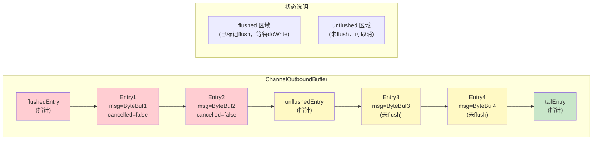
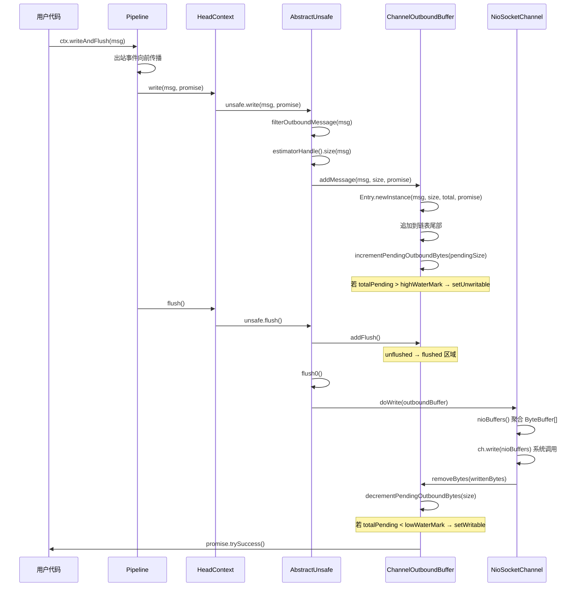
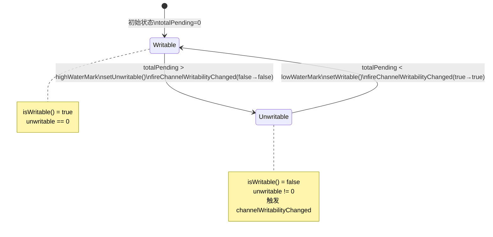
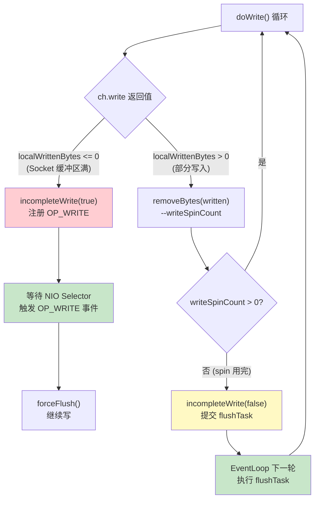
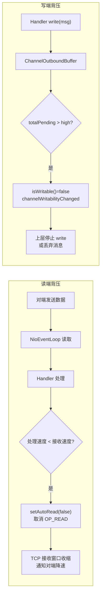
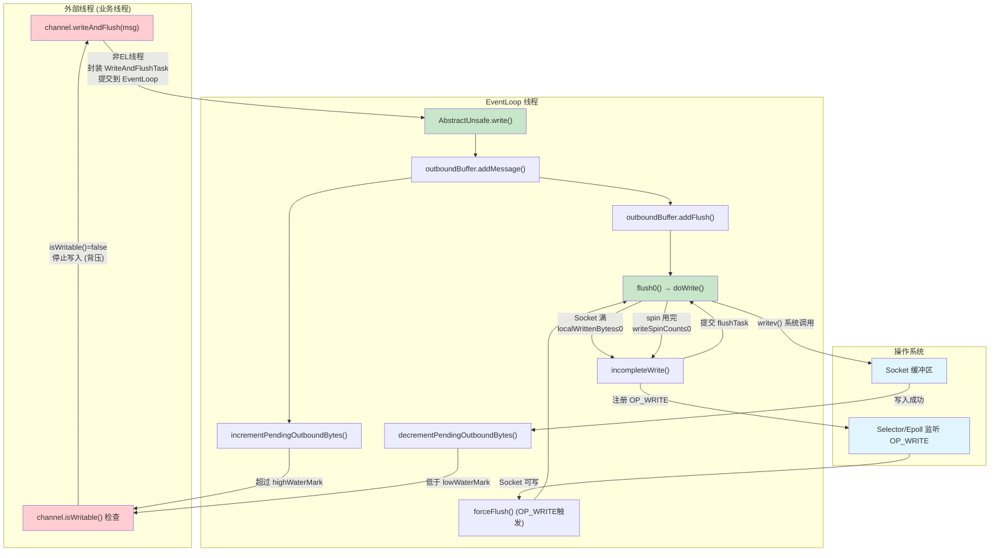

# 08-01 写路径与背压：ChannelOutboundBuffer + 水位线 + Flush 机制深度分析

> **核心问题**：
> 1. `write()` 和 `flush()` 为什么要分离？
> 2. 高低水位线如何防止慢消费者导致 OOM？
> 3. 写半包（Socket 缓冲区满）时 Netty 如何处理？

---

## 一、解决什么问题

### 1.1 直接写 Socket 的问题

最朴素的写法：每次 `write()` 直接调用 `SocketChannel.write()`。这有三个问题：

| 问题 | 现象 | 后果 |
|------|------|------|
| **系统调用开销** | 每次 write 一个小包就触发一次 syscall | 高并发下 CPU 被系统调用吃掉 |
| **写半包** | Socket 发送缓冲区满时，`write()` 只写了部分数据 | 剩余数据丢失或需要复杂的重试逻辑 |
| **慢消费者 OOM** | 下游消费慢，上游疯狂 write，数据堆积在内存 | JVM OOM |

Netty 的解法：**引入 `ChannelOutboundBuffer` 作为写缓冲区**，将 `write`（入缓冲）和 `flush`（真正 IO）分离，并通过水位线实现背压。

### 1.2 设计目标

```
用户 write(msg)
    ↓
ChannelOutboundBuffer（内存缓冲区）
    ↓ flush()
Socket 发送缓冲区（内核）
    ↓
网络
```

- **批量写**：多次 `write()` + 一次 `flush()` → 合并成一次 `writev()` 系统调用
- **写半包处理**：Socket 缓冲区满时，注册 `OP_WRITE` 等待可写，不丢数据
- **背压**：`totalPendingSize > highWaterMark` 时触发 `channelWritabilityChanged`，通知上层限流

---

## 二、数据结构推导

### 2.1 问题推导

要实现"缓冲 + 批量写 + 写半包处理"，需要：
- 一个**有序队列**存放待写数据（保证顺序）
- 每个元素需要记录：消息体、大小、完成回调（Promise）、写入进度
- 需要区分"已提交 flush"和"未提交 flush"的数据（flush 后不可取消）
- 需要一个**原子计数器**记录总待写字节数（用于水位线判断）
- 需要一个**位图**记录可写状态（支持多维度不可写：水位线 + 用户自定义）

### 2.2 ChannelOutboundBuffer 核心字段

```java
public final class ChannelOutboundBuffer {
    // Entry 对象的固定开销（64位JVM：对象头16B + 6个引用 + 2个long + 2个int + 1个boolean + padding ≈ 96B）
    static final int CHANNEL_OUTBOUND_BUFFER_ENTRY_OVERHEAD =
            SystemPropertyUtil.getInt("io.netty.transport.outboundBufferEntrySizeOverhead", 96);

    private static final InternalLogger logger = InternalLoggerFactory.getInstance(ChannelOutboundBuffer.class);

    // 线程本地的 ByteBuffer[] 数组，用于 nioBuffers() 的 gathering write
    private static final FastThreadLocal<ByteBuffer[]> NIO_BUFFERS = new FastThreadLocal<ByteBuffer[]>() {
        @Override
        protected ByteBuffer[] initialValue() throws Exception {
            return new ByteBuffer[1024];
        }
    };

    private final Channel channel;

    // Entry(flushedEntry) --> ... Entry(unflushedEntry) --> ... Entry(tailEntry)
    private Entry flushedEntry;    // [1] 第一个已 flush 但未写完的 Entry
    private Entry unflushedEntry;  // [2] 第一个未 flush 的 Entry
    private Entry tailEntry;       // [3] 链表尾部

    private int flushed;           // [4] 已 flush 但未写完的 Entry 数量

    private int nioBufferCount;    // [5] nioBuffers() 返回的 ByteBuffer 数量
    private long nioBufferSize;    // [6] nioBuffers() 返回的总字节数

    private boolean inFail;        // [7] 防止 failFlushed 重入

    // 原子更新器（AtomicLongFieldUpdater）
    private static final AtomicLongFieldUpdater<ChannelOutboundBuffer> TOTAL_PENDING_SIZE_UPDATER = ...;
    private volatile long totalPendingSize;  // [8] 🔥 待写入总字节数（线程安全，影响 isWritable）

    // 原子更新器（AtomicIntegerFieldUpdater）
    private static final AtomicIntegerFieldUpdater<ChannelOutboundBuffer> UNWRITABLE_UPDATER = ...;
    private volatile int unwritable;         // [9] 🔥 不可写位图（bit0=水位线，bit1~31=用户自定义）

    private volatile Runnable fireChannelWritabilityChangedTask; // [10] 延迟触发任务（避免重复创建）
}
```

### 2.3 Entry 内部类

```java
static final class Entry {
    private static final Recycler<Entry> RECYCLER = new Recycler<Entry>() {
        @Override
        protected Entry newObject(Handle<Entry> handle) {
            return new Entry(handle);
        }
    };

    private final EnhancedHandle<Entry> handle; // [1] 对象池句柄（Entry 本身也被池化！）
    Entry next;             // [2] 链表指针
    Object msg;             // [3] 消息体（ByteBuf / FileRegion / ByteBufHolder）
    ByteBuffer[] bufs;      // [4] 多 NIO Buffer（CompositeByteBuf 场景）
    ByteBuffer buf;         // [5] 单 NIO Buffer（缓存，避免重复创建）
    ChannelPromise promise; // [6] 完成回调
    long progress;          // [7] 已写入字节数（用于 ChannelProgressivePromise）
    long total;             // [8] 消息总字节数
    int pendingSize;        // [9] 🔥 msg 大小 + ENTRY_OVERHEAD（计入 totalPendingSize）
    int count = -1;         // [10] NIO Buffer 数量（-1 表示未初始化）
    boolean cancelled;      // [11] 是否已取消
}
```

**关键设计**：`pendingSize = msgSize + ENTRY_OVERHEAD`（默认 96 字节），把 Entry 对象本身的内存开销也计入水位线，防止大量小消息绕过水位线保护。

真实数值验证（运行输出）：
```
msgSize=     0 → pendingSize=    96 (含 96 字节 Entry 对象开销)
msgSize=   100 → pendingSize=   196 (含 96 字节 Entry 对象开销)
msgSize=  1024 → pendingSize=  1120 (含 96 字节 Entry 对象开销)
msgSize=  4096 → pendingSize=  4192 (含 96 字节 Entry 对象开销)
msgSize= 65536 → pendingSize= 65632 (含 96 字节 Entry 对象开销)
```

### 2.4 链表结构图



---

## 三、写路径完整流程

### 3.1 全局时序图



### 3.2 AbstractUnsafe.write() 源码分析

```java
public final void write(Object msg, ChannelPromise promise) {
    assertEventLoop();  // [1] 必须在 EventLoop 线程调用

    ChannelOutboundBuffer outboundBuffer = this.outboundBuffer;
    if (outboundBuffer == null) {
        // [2] outboundBuffer == null 说明 Channel 已关闭
        try {
            ReferenceCountUtil.release(msg);  // [3] 立即释放，防止内存泄漏
        } finally {
            safeSetFailure(promise,
                    newClosedChannelException(initialCloseCause, "write(Object, ChannelPromise)"));
        }
        return;
    }

    int size;
    try {
        msg = filterOutboundMessage(msg);  // [4] 消息过滤（如 NioSocketChannel 会把 ByteBuf 转为 Direct）
        size = pipeline.estimatorHandle().size(msg);  // [5] 估算消息大小
        if (size < 0) {
            size = 0;  // [6] 未知类型（如自定义对象）大小为 0
        }
    } catch (Throwable t) {
        try {
            ReferenceCountUtil.release(msg);  // [7] 异常时释放
        } finally {
            safeSetFailure(promise, t);
        }
        return;
    }

    outboundBuffer.addMessage(msg, size, promise);  // [8] 加入缓冲区
}
```

**关键点**：`filterOutboundMessage()` 在 `AbstractNioByteChannel` 中实现，有三个分支：
- `ByteBuf` 且已是 Direct → 直接返回
- `ByteBuf` 且是堆内 → `newDirectBuffer(buf)` 转换为 Direct（JDK NIO 的 `SocketChannel.write()` 要求 Direct Buffer，否则内部会临时拷贝一次）
- `FileRegion` → 直接返回
- 其他类型 → 抛出 `UnsupportedOperationException`

### 3.3 ChannelOutboundBuffer.addMessage() 源码分析

```java
public void addMessage(Object msg, int size, ChannelPromise promise) {
    Entry entry = Entry.newInstance(msg, size, total(msg), promise);  // [1] 从对象池获取 Entry
    if (tailEntry == null) {
        flushedEntry = null;  // [2] 链表为空时，flushedEntry 也清空
    } else {
        Entry tail = tailEntry;
        tail.next = entry;    // [3] 追加到链表尾部
    }
    tailEntry = entry;
    if (unflushedEntry == null) {
        unflushedEntry = entry;  // [4] 第一个 unflushed Entry
    }

    // [5] touch 消息，方便泄漏检测定位
    if (msg instanceof AbstractReferenceCountedByteBuf) {
        ((AbstractReferenceCountedByteBuf) msg).touch();
    } else {
        ReferenceCountUtil.touch(msg);
    }

    // [6] 更新 totalPendingSize，可能触发 unwritable（注意：先加入链表再更新，见 issue #1619）
    incrementPendingOutboundBytes(entry.pendingSize, false);
}
```

> ⚠️ **注意顺序**：先把 Entry 加入链表，再调用 `incrementPendingOutboundBytes()`。这是为了防止在 `setUnwritable` 触发 `channelWritabilityChanged` 时，Handler 调用 `flush()` 看到的链表状态不一致（见 [issue #1619](https://github.com/netty/netty/issues/1619)）。

### 3.4 ChannelOutboundBuffer.addFlush() 源码分析

```java
public void addFlush() {
    // [1] 如果没有新消息（unflushedEntry == null），直接返回（避免重复处理）
    Entry entry = unflushedEntry;
    if (entry != null) {
        if (flushedEntry == null) {
            flushedEntry = entry;  // [2] 第一次 flush，flushedEntry 指向 unflushedEntry
        }
        do {
            flushed ++;
            if (!entry.promise.setUncancellable()) {
                // [3] 如果 Promise 已被取消，释放内存并减少 totalPendingSize
                int pending = entry.cancel();
                decrementPendingOutboundBytes(pending, false, true);
            }
            entry = entry.next;
        } while (entry != null);

        unflushedEntry = null;  // [4] 全部标记为 flushed，unflushedEntry 清空
    }
}
```

**核心语义**：`addFlush()` 后，这批数据**不可取消**（`setUncancellable()`），并且 `unflushedEntry` 指针清空，表示这批数据已进入"待写"状态。

---

## 四、水位线背压机制

### 4.1 WriteBufferWaterMark 数据结构

```java
public final class WriteBufferWaterMark {
    private static final int DEFAULT_LOW_WATER_MARK = 32 * 1024;   // 32KB
    private static final int DEFAULT_HIGH_WATER_MARK = 64 * 1024;  // 64KB

    public static final WriteBufferWaterMark DEFAULT =
            new WriteBufferWaterMark(DEFAULT_LOW_WATER_MARK, DEFAULT_HIGH_WATER_MARK, false);

    private final int low;
    private final int high;

    // 用户使用的公开构造函数（会做参数校验）
    public WriteBufferWaterMark(int low, int high) {
        this(low, high, true);
    }

    // package-private 构造函数（用于创建 DEFAULT 常量，跳过校验）
    WriteBufferWaterMark(int low, int high, boolean validate) {
        if (validate) {
            checkPositiveOrZero(low, "low");
            if (high < low) {
                throw new IllegalArgumentException(
                        "write buffer's high water mark cannot be less than " +
                                " low water mark (" + low + "): " +
                                high);
            }
        }
        this.low = low;
        this.high = high;
    }
}
```

### 4.2 unwritable 位图设计 🔥

`unwritable` 是一个 32 位整数，每个 bit 代表一种"不可写"原因：

| bit | 含义 | 触发方 |
|-----|------|--------|
| bit 0 | 水位线超过 highWaterMark | `incrementPendingOutboundBytes()` |
| bit 1~31 | 用户自定义不可写标志 | `setUserDefinedWritability(index, false)` |

`isWritable()` 的实现极其简单：
```java
public boolean isWritable() {
    return unwritable == 0;  // 所有 bit 都为 0 才可写
}
```

**位运算验证（真实运行输出）**：
```
初始 unwritable=0 → isWritable=true
setUnwritable() 后 unwritable=1 → isWritable=false
setWritable() 后 unwritable=0 → isWritable=true

--- 用户自定义 writability ---
setUserDefinedWritability(1, false): mask=2 (0x2)
  unwritable=2 → isWritable=false
  再触发水位线: unwritable=3 → isWritable=false
  水位线恢复: unwritable=2 → isWritable=false (用户自定义仍不可写)
  用户自定义恢复: unwritable=0 → isWritable=true
```

**关键洞察**：水位线恢复后，如果用户自定义的不可写标志还在，`isWritable()` 仍然返回 `false`。这允许用户在水位线之外实现额外的背压控制（如限流器）。

### 4.3 setUnwritable() 和 setWritable() 源码

```java
private void setUnwritable(boolean invokeLater) {
    for (;;) {
        final int oldValue = unwritable;
        final int newValue = oldValue | 1;  // [1] bit0 置 1
        if (UNWRITABLE_UPDATER.compareAndSet(this, oldValue, newValue)) {
            if (oldValue == 0) {
                // [2] 只有从 0 变为非 0 时才触发事件（避免重复触发）
                fireChannelWritabilityChanged(invokeLater);
            }
            break;
        }
    }
}

private void setWritable(boolean invokeLater) {
    for (;;) {
        final int oldValue = unwritable;
        final int newValue = oldValue & ~1;  // [3] bit0 清 0
        if (UNWRITABLE_UPDATER.compareAndSet(this, oldValue, newValue)) {
            if (oldValue != 0 && newValue == 0) {
                // [4] 只有从非 0 变为 0 时才触发事件（所有不可写原因都消除）
                fireChannelWritabilityChanged(invokeLater);
            }
            break;
        }
    }
}
```

### 4.4 fireChannelWritabilityChanged() 的 invokeLater 参数

```java
private void fireChannelWritabilityChanged(boolean invokeLater) {
    final ChannelPipeline pipeline = channel.pipeline();
    if (invokeLater) {
        // [1] 延迟触发：提交到 EventLoop 任务队列
        Runnable task = fireChannelWritabilityChangedTask;
        if (task == null) {
            fireChannelWritabilityChangedTask = task = new Runnable() {
                @Override
                public void run() {
                    pipeline.fireChannelWritabilityChanged();
                }
            };
        }
        channel.eventLoop().execute(task);
    } else {
        // [2] 立即触发：直接调用 pipeline
        pipeline.fireChannelWritabilityChanged();
    }
}
```

**为什么需要 invokeLater？**

- `addMessage()` 调用时（`invokeLater=false`）：已经在 EventLoop 线程，可以直接触发
- `decrementPendingOutboundBytes()` 调用时（`invokeLater=true`）：可能在 `remove()` 的调用链中，此时 Pipeline 正在处理其他事件，延迟触发避免重入

### 4.5 水位线状态机



**注意**：从 Writable → Unwritable 的阈值是 `> highWaterMark`，从 Unwritable → Writable 的阈值是 `< lowWaterMark`。这是**滞后（Hysteresis）**设计，防止在阈值附近频繁抖动触发事件。

### 4.6 bytesBeforeUnwritable / bytesBeforeWritable

```java
// 距离不可写还有多少字节（+1 因为是严格大于，不是大于等于）
public long bytesBeforeUnwritable() {
    long bytes = channel.config().getWriteBufferHighWaterMark() - totalPendingSize + 1;
    return bytes > 0 && isWritable() ? bytes : 0;
}

// 距离可写还需要排空多少字节
public long bytesBeforeWritable() {
    long bytes = totalPendingSize - channel.config().getWriteBufferLowWaterMark() + 1;
    return bytes <= 0 || isWritable() ? 0 : bytes;
}
```

**真实数值验证（运行输出）**：
```
high=65536 (64KB), low=32768 (32KB)
totalPending=0:      bytesBeforeUnwritable=65537
totalPending=32KB:   bytesBeforeUnwritable=32769 (32KB+1)
totalPending=64KB+1: bytesBeforeUnwritable=0 (已不可写)
totalPending=32KB-1: bytesBeforeWritable=0 (已可写)
```

---

## 五、flush0() 与写半包处理

### 5.1 AbstractUnsafe.flush() 和 flush0() 源码

```java
@Override
public final void flush() {
    assertEventLoop();

    ChannelOutboundBuffer outboundBuffer = this.outboundBuffer;
    if (outboundBuffer == null) {
        return;  // [1] Channel 已关闭
    }

    outboundBuffer.addFlush();  // [2] unflushed → flushed
    flush0();                   // [3] 真正写入
}

@SuppressWarnings("deprecation")
protected void flush0() {
    if (inFlush0) {
        return;  // [1] 防止重入（如 flush 过程中触发了另一个 flush）
    }

    final ChannelOutboundBuffer outboundBuffer = this.outboundBuffer;
    if (outboundBuffer == null || outboundBuffer.isEmpty()) {
        return;  // [2] 没有数据可写
    }

    inFlush0 = true;

    // [3] Channel 未激活时，标记所有 pending 写请求为失败
    if (!isActive()) {
        try {
            if (!outboundBuffer.isEmpty()) {
                if (isOpen()) {
                    outboundBuffer.failFlushed(new NotYetConnectedException(), true);
                } else {
                    outboundBuffer.failFlushed(newClosedChannelException(initialCloseCause, "flush0()"), false);
                }
            }
        } finally {
            inFlush0 = false;
        }
        return;
    }

    try {
        doWrite(outboundBuffer);  // [4] 子类实现（NioSocketChannel.doWrite）
    } catch (Throwable t) {
        handleWriteError(t);      // [5] 写错误处理（autoClose 时关闭 Channel）
    } finally {
        inFlush0 = false;
    }
}
```

### 5.2 NioSocketChannel.doWrite() 源码分析 🔥

```java
@Override
protected void doWrite(ChannelOutboundBuffer in) throws Exception {
    SocketChannel ch = javaChannel();
    int writeSpinCount = config().getWriteSpinCount();  // [1] 默认 16
    do {
        if (in.isEmpty()) {
            clearOpWrite();  // [2] 全部写完，清除 OP_WRITE
            return;          // [3] 直接返回，不调用 incompleteWrite
        }

        int maxBytesPerGatheringWrite = ((NioSocketChannelConfig) config).getMaxBytesPerGatheringWrite();
        ByteBuffer[] nioBuffers = in.nioBuffers(1024, maxBytesPerGatheringWrite);  // [4] 聚合 ByteBuffer[]
        int nioBufferCnt = in.nioBufferCount();

        switch (nioBufferCnt) {
            case 0:
                // [5] 非 ByteBuf 消息（如 FileRegion），走 doWrite0
                // doWrite0 返回值：0=空消息，1=写了一次，WRITE_STATUS_SNDBUF_FULL(Integer.MAX_VALUE)=Socket 缓冲区满
                // writeSpinCount -= Integer.MAX_VALUE 会变为负数，触发 incompleteWrite(true)
                writeSpinCount -= doWrite0(in);
                break;
            case 1: {
                // [6] 单 ByteBuffer：非 gathering write
                ByteBuffer buffer = nioBuffers[0];
                int attemptedBytes = buffer.remaining();
                final int localWrittenBytes = ch.write(buffer);  // [7] 系统调用
                if (localWrittenBytes <= 0) {
                    incompleteWrite(true);  // [8] Socket 缓冲区满 → 注册 OP_WRITE
                    return;
                }
                adjustMaxBytesPerGatheringWrite(attemptedBytes, localWrittenBytes, maxBytesPerGatheringWrite);
                in.removeBytes(localWrittenBytes);  // [9] 更新链表，释放已写 ByteBuf
                --writeSpinCount;
                break;
            }
            default: {
                // [10] 多 ByteBuffer：gathering write（writev 系统调用）
                long attemptedBytes = in.nioBufferSize();
                final long localWrittenBytes = ch.write(nioBuffers, 0, nioBufferCnt);
                if (localWrittenBytes <= 0) {
                    incompleteWrite(true);  // [11] Socket 缓冲区满 → 注册 OP_WRITE
                    return;
                }
                adjustMaxBytesPerGatheringWrite((int) attemptedBytes, (int) localWrittenBytes,
                        maxBytesPerGatheringWrite);
                in.removeBytes(localWrittenBytes);
                --writeSpinCount;
                break;
            }
        }
    } while (writeSpinCount > 0);

    incompleteWrite(writeSpinCount < 0);  // [12] spin 用完后的处理
}
```

### 5.3 写半包的两种情况



### 5.4 incompleteWrite() 源码

```java
protected final void incompleteWrite(boolean setOpWrite) {
    if (setOpWrite) {
        // [1] Socket 缓冲区满：注册 OP_WRITE，等待 Selector 通知
        setOpWrite();
    } else {
        // [2] spin 用完但 Socket 未满：清除 OP_WRITE
        // 注意：此时可能已经注册了 OP_WRITE（被 NIO 唤醒后用完了 spin），
        // 但 Socket 仍然可写，不需要再等待 Selector 通知，所以先清除 OP_WRITE
        clearOpWrite();
        // [3] 提交 flushTask 到 EventLoop，让其他任务有机会执行
        eventLoop().execute(flushTask);
    }
}
```

**两种情况的本质区别**：

| 情况 | 原因 | 处理方式 | 为什么 |
|------|------|----------|--------|
| `localWrittenBytes <= 0` | Socket 发送缓冲区满（内核） | 注册 `OP_WRITE` | 等内核通知"可写"再继续，避免 CPU 空转 |
| `writeSpinCount == 0` | spin 次数用完，Socket 仍可写 | 提交 `flushTask` | 让 EventLoop 处理其他任务，避免单个 Channel 独占 CPU |

> ⚠️ **为什么 spin 用完不注册 OP_WRITE？** 因为 Socket 仍然可写（`localWrittenBytes > 0`），注册 OP_WRITE 会导致 Selector 立即触发（水平触发），浪费一次 select 调用。直接提交 `flushTask` 更高效。

### 5.5 removeBytes() 处理写半包

```java
public void removeBytes(long writtenBytes) {
    for (;;) {
        Object msg = current();  // [1] 当前 flushedEntry 的消息
        if (!(msg instanceof ByteBuf)) {
            assert writtenBytes == 0;
            break;
        }

        final ByteBuf buf = (ByteBuf) msg;
        final int readerIndex = buf.readerIndex();
        final int readableBytes = buf.writerIndex() - readerIndex;

        if (readableBytes <= writtenBytes) {
            // [2] 整个 ByteBuf 都写完了
            if (writtenBytes != 0) {
                progress(readableBytes);
                writtenBytes -= readableBytes;
            }
            remove();  // [3] 从链表移除，释放 ByteBuf，通知 Promise
        } else {
            // [4] ByteBuf 只写了一部分（写半包）
            if (writtenBytes != 0) {
                buf.readerIndex(readerIndex + (int) writtenBytes);  // [5] 推进 readerIndex
                progress(writtenBytes);
            }
            break;  // [6] 退出循环，等待下次 flush 继续写
        }
    }
    clearNioBuffers();  // [7] 清空 NIO_BUFFERS 数组（GC 友好）
}
```

---

## 六、autoRead 背压

### 6.1 为什么需要 autoRead？

水位线背压是**写端**的保护：防止写太快导致 `ChannelOutboundBuffer` 积压。

但有时候问题在**读端**：下游处理慢，上游读太快，数据堆积在 Handler 里。这时需要**暂停读取**，让 TCP 的流量控制（接收窗口）自然地通知对端降速。

### 6.2 autoRead 机制

```java
// 在 channelWritabilityChanged 中控制 autoRead
@Override
public void channelWritabilityChanged(ChannelHandlerContext ctx) {
    if (ctx.channel().isWritable()) {
        // 可写了，恢复读取
        ctx.channel().config().setAutoRead(true);
    } else {
        // 不可写了，暂停读取（让 TCP 接收窗口收缩）
        ctx.channel().config().setAutoRead(false);
    }
}
```

`setAutoRead(false)` 的底层实现：
- 调用 `channel.unsafe().beginRead()` 的反向操作
- 从 Selector 上取消 `OP_READ` 注册
- 下次 EventLoop 循环不再读取数据

### 6.3 autoRead vs 水位线的配合



---

## 七、nioBuffers() 聚合写优化

### 7.1 gathering write 原理

`nioBuffers()` 把 `ChannelOutboundBuffer` 中所有 flushed 的 `ByteBuf` 转换为 `ByteBuffer[]`，然后用 `SocketChannel.write(ByteBuffer[], offset, length)` 一次性写入（对应 Linux 的 `writev()` 系统调用）。

**优势**：N 个 ByteBuf 只需 1 次系统调用，而不是 N 次。

### 7.2 nioBuffers() 关键逻辑

```java
public ByteBuffer[] nioBuffers(int maxCount, long maxBytes) {
    // ...
    Entry entry = flushedEntry;
    while (isFlushedEntry(entry) && entry.msg instanceof ByteBuf) {
        if (!entry.cancelled) {
            ByteBuf buf = (ByteBuf) entry.msg;
            final int readerIndex = buf.readerIndex();
            final int readableBytes = buf.writerIndex() - readerIndex;

            if (readableBytes > 0) {
                // [1] 防止超过 maxBytes（BSD/macOS 的 writev 限制 Integer.MAX_VALUE）
                if (maxBytes - readableBytes < nioBufferSize && nioBufferCount != 0) {
                    break;
                }
                nioBufferSize += readableBytes;
                int count = entry.count;
                if (count == -1) {
                    entry.count = count = buf.nioBufferCount();  // [2] 初始化 count
                }
                // [3] 扩容 nioBuffers 数组（每次翻倍）
                int neededSpace = min(maxCount, nioBufferCount + count);
                if (neededSpace > nioBuffers.length) {
                    nioBuffers = expandNioBufferArray(nioBuffers, neededSpace, nioBufferCount);
                    NIO_BUFFERS.set(threadLocalMap, nioBuffers);
                }
                if (count == 1) {
                    ByteBuffer nioBuf = entry.buf;
                    if (nioBuf == null) {
                        entry.buf = nioBuf = buf.internalNioBuffer(readerIndex, readableBytes);  // [4] 缓存 NIO Buffer
                    }
                    nioBuffers[nioBufferCount++] = nioBuf;
                } else {
                    nioBufferCount = nioBuffers(entry, buf, nioBuffers, nioBufferCount, maxCount);
                }
                if (nioBufferCount >= maxCount) {
                    break;
                }
            }
        }
        entry = entry.next;
    }
    // ...
}
```

**关键优化**：`entry.buf` 缓存了 `ByteBuffer` 引用，避免每次 `nioBuffers()` 都重新创建（`internalNioBuffer()` 可能创建新对象）。

---

## 八、核心不变式

1. **写路径串行不变式**：`ChannelOutboundBuffer` 的所有写操作（`addMessage`、`addFlush`、`remove`、`removeBytes`）都必须在 EventLoop 线程执行；只有 `isWritable()`、`getUserDefinedWritability()`、`setUserDefinedWritability()` 是线程安全的（通过 CAS）。

2. **水位线滞后不变式**：`totalPendingSize > highWaterMark` 触发不可写，`totalPendingSize < lowWaterMark` 才恢复可写（不是 `<= highWaterMark`），保证不会在阈值附近频繁抖动。

3. **写半包完整性不变式**：`removeBytes(writtenBytes)` 保证已写入的字节对应的 ByteBuf 被释放（`remove()`），未写完的 ByteBuf 只推进 `readerIndex`，不释放，等待下次 flush 继续写。

---

## 九、生产踩坑与最佳实践

### 9.1 ⚠️ 只 write 不 flush 导致数据不发送

```java
// ❌ 错误：数据永远不会发送
ctx.write(response1);
ctx.write(response2);
// 忘记 flush！

// ✅ 正确：批量 write + 一次 flush
ctx.write(response1);
ctx.write(response2);
ctx.flush();

// ✅ 或者直接 writeAndFlush
ctx.writeAndFlush(response);
```

### 9.2 ⚠️ 不检查 isWritable() 导致 OOM

```java
// ❌ 错误：不检查 isWritable，疯狂 write
@Override
public void channelRead(ChannelHandlerContext ctx, Object msg) {
    ctx.writeAndFlush(processMsg(msg));  // 下游慢时，ChannelOutboundBuffer 无限增长
}

// ✅ 正确：检查 isWritable
@Override
public void channelRead(ChannelHandlerContext ctx, Object msg) {
    if (ctx.channel().isWritable()) {
        ctx.writeAndFlush(processMsg(msg));
    } else {
        // 背压处理：丢弃 / 缓存 / 关闭连接
        ReferenceCountUtil.release(msg);
        ctx.channel().config().setAutoRead(false);  // 暂停读取
    }
}

// ✅ 正确：监听 writabilityChanged 事件
@Override
public void channelWritabilityChanged(ChannelHandlerContext ctx) {
    if (ctx.channel().isWritable()) {
        ctx.channel().config().setAutoRead(true);
    } else {
        ctx.channel().config().setAutoRead(false);
    }
}
```

### 9.3 ⚠️ 水位线设置不合理

```java
// ❌ 错误：水位线太小，频繁触发 writabilityChanged，影响吞吐
bootstrap.childOption(ChannelOption.WRITE_BUFFER_WATER_MARK,
        new WriteBufferWaterMark(1024, 2048));  // 1KB/2KB 太小

// ✅ 推荐：根据消息大小和吞吐目标调整
// 高吞吐场景（大消息）：
bootstrap.childOption(ChannelOption.WRITE_BUFFER_WATER_MARK,
        new WriteBufferWaterMark(512 * 1024, 1024 * 1024));  // 512KB/1MB

// 低延迟场景（小消息）：
bootstrap.childOption(ChannelOption.WRITE_BUFFER_WATER_MARK,
        new WriteBufferWaterMark(32 * 1024, 64 * 1024));  // 默认值即可
```

### 9.4 ⚠️ writeSpinCount 设置不当

```java
// writeSpinCount 默认 16，含义：每次 flush 最多尝试 16 次写入
// 太小：频繁提交 flushTask，增加 EventLoop 任务队列压力
// 太大：单个 Channel 独占 EventLoop 太久，影响其他 Channel 的延迟

// 高吞吐场景（少连接）：可以适当增大
bootstrap.childOption(ChannelOption.WRITE_SPIN_COUNT, 32);

// 高并发场景（多连接）：保持默认或减小
bootstrap.childOption(ChannelOption.WRITE_SPIN_COUNT, 8);
```

### 9.5 ⚠️ 在非 EventLoop 线程调用 write

```java
// ❌ 错误：在业务线程直接调用 write（虽然 Netty 会自动提交到 EventLoop，但有额外开销）
businessThreadPool.execute(() -> {
    ctx.writeAndFlush(response);  // 会被包装成 task 提交到 EventLoop
});

// ✅ 正确：在 EventLoop 线程中写（如在 channelRead 中）
@Override
public void channelRead(ChannelHandlerContext ctx, Object msg) {
    ctx.writeAndFlush(processMsg(msg));  // 已在 EventLoop 线程，直接执行
}
```

---

## 十、日志验证方案

### 10.1 验证水位线触发时机

```java
// 在 Handler 中添加日志
@Override
public void channelWritabilityChanged(ChannelHandlerContext ctx) {
    Channel ch = ctx.channel();
    System.out.printf("[%s] writabilityChanged: isWritable=%b, totalPending=%d, bytesBeforeUnwritable=%d%n",
            Thread.currentThread().getName(),
            ch.isWritable(),
            ch.unsafe().outboundBuffer().totalPendingWriteBytes(),
            ch.unsafe().outboundBuffer().bytesBeforeUnwritable());
}
```

### 10.2 验证写半包处理

```java
// 在 NioSocketChannel.doWrite 中添加日志（需要修改源码或使用 Agent）
// 或者通过 ChannelProgressivePromise 监听写入进度
ChannelProgressivePromise promise = ctx.newProgressivePromise();
promise.addListener(new ChannelProgressiveFutureListener() {
    @Override
    public void operationProgressed(ChannelProgressiveFuture future, long progress, long total) {
        System.out.printf("写入进度: %d/%d bytes%n", progress, total);
    }
    @Override
    public void operationComplete(ChannelProgressiveFuture future) {
        System.out.println("写入完成");
    }
});
ctx.write(msg, promise);
ctx.flush();
```

---

## 十一、面试问答

**Q1：write() 和 flush() 为什么要分离？** 🔥🔥🔥

**A**：分离的核心目的是**批量写入**。`write()` 只是把数据加入 `ChannelOutboundBuffer`（内存操作，无系统调用），`flush()` 才真正触发 IO。这样可以多次 `write()` 不同的数据，最后一次 `flush()` 用 `writev()` 系统调用合并写入，减少系统调用次数。另外，分离还使得"写入缓冲区"和"真正 IO"可以独立控制，便于实现背压（水位线）和写半包处理。

---

**Q2：ChannelOutboundBuffer 的 unwritable 为什么用位图而不是 boolean？** 🔥

**A**：因为"不可写"有多种原因：水位线超过 highWaterMark（bit0）、用户自定义的不可写标志（bit1~31）。用位图可以让多种原因独立控制，只有所有原因都消除（`unwritable == 0`）才真正可写。如果用 boolean，就无法区分"水位线恢复了但用户自定义还不可写"的情况。

---

**Q3：写半包时 Netty 如何处理？** 🔥🔥

**A**：两种情况：
1. **Socket 缓冲区满**（`localWrittenBytes <= 0`）：调用 `incompleteWrite(true)`，注册 `OP_WRITE`，等待 Selector 通知"Socket 可写"后调用 `forceFlush()` 继续写。
2. **writeSpinCount 用完**（spin 16 次后仍有数据）：调用 `incompleteWrite(false)`，清除 `OP_WRITE`（Socket 仍可写，不需要等待），提交 `flushTask` 到 EventLoop 下一轮执行，让其他 Channel 有机会处理。

---

**Q4：totalPendingSize 为什么包含 Entry 对象的开销（96 字节）？** 🔥

**A**：防止大量小消息绕过水位线保护。如果只计算消息体大小，发送 1000 个 1 字节的消息，`totalPendingSize` 只有 1000 字节，远低于 32KB 的低水位线，但实际上 1000 个 Entry 对象占用了约 96KB 的内存。把 Entry 开销计入 `pendingSize`，水位线才能真实反映内存压力。

---

**Q5：为什么 addFlush() 后 Promise 不可取消？** 🔥

**A**：`addFlush()` 调用 `entry.promise.setUncancellable()`，因为 flush 后数据已经进入"待写"状态，可能已经部分写入 Socket。如果允许取消，会导致数据不一致（部分写入的数据无法撤回）。如果 `setUncancellable()` 返回 false（说明已被取消），则调用 `entry.cancel()` 释放内存并减少 `totalPendingSize`。

---

**Q6：如何监控 ChannelOutboundBuffer 的积压情况？** 🔥

**A**：
```java
// 获取待写字节数
long pending = channel.unsafe().outboundBuffer().totalPendingWriteBytes();
// 获取距离不可写还有多少字节
long beforeUnwritable = channel.unsafe().outboundBuffer().bytesBeforeUnwritable();
// 监听 writabilityChanged 事件
pipeline.addLast(new ChannelInboundHandlerAdapter() {
    @Override
    public void channelWritabilityChanged(ChannelHandlerContext ctx) {
        // 上报指标
        metrics.gauge("channel.writable", ctx.channel().isWritable() ? 1 : 0);
    }
});
```

---

**Q7：writeAndFlush() 和 write() + flush() 有什么区别？** 🔥

**A**：`writeAndFlush(msg)` 等价于 `write(msg) + flush()`，但有一个细节：`writeAndFlush()` 是原子的出站事件传播，而 `write() + flush()` 是两次独立的出站事件传播。在 Pipeline 中如果有 Handler 拦截了 `write` 或 `flush`，行为可能不同。性能上没有本质区别，但如果需要批量写入，应该用多次 `write()` + 一次 `flush()`，而不是多次 `writeAndFlush()`。

---

**Q8：autoRead 和水位线背压有什么区别？什么时候用哪个？** 🔥

**A**：
- **水位线背压**：控制**写端**，防止 `ChannelOutboundBuffer` 积压过多。当 `isWritable()` 返回 false 时，上层应停止写入。
- **autoRead 背压**：控制**读端**，防止读取太快导致 Handler 处理积压。通过 `setAutoRead(false)` 暂停读取，让 TCP 接收窗口收缩，通知对端降速。

两者配合使用：当写端不可写时，同时暂停读取，形成端到端的背压链路。

---

## 十一（补充）、线程交互图

> 大纲要求每个模块产出四类图，写路径之前有对象关系图（ChannelOutboundBuffer）和时序图（write→flush 流程），这里补充**线程交互图**。

### 11.1 写路径的完整线程交互



### 11.2 写路径线程安全分析表

| 操作 | 执行线程 | 并发保护 | 关键点 |
|------|---------|---------|--------|
| `channel.write(msg)` | 任意线程 | 封装为 `WriteTask` 提交到 EventLoop | 非 EventLoop 线程**绝不直接操作** ChannelOutboundBuffer |
| `ctx.write(msg)` | **仅 EventLoop** | 单线程保证 | 如果从 Handler 内部调用，已经在 EventLoop 线程 |
| `addMessage()` | **仅 EventLoop** | 单线程保证 | 链表插入 + `totalPendingSize` 更新 |
| `addFlush()` | **仅 EventLoop** | 单线程保证 | `flushedEntry` 指针移动 + `setUncancellable()` |
| `flush0() → doWrite()` | **仅 EventLoop** | 单线程保证 | 可能循环多次（writeSpinCount） |
| `incrementPendingOutboundBytes()` | **仅 EventLoop** | 单线程保证 | 检查 highWaterMark → `fireChannelWritabilityChanged()` |
| `channel.isWritable()` | **任意线程** | `volatile int unwritable` | 位图读取，无锁，可从业务线程安全调用 |
| `channelWritabilityChanged()` | **仅 EventLoop** | Inbound 事件 | 在 EventLoop 线程通过 Pipeline 传播 |

> 🔥 **面试关键**：写路径的线程安全设计有两个层面：
> 1. **ChannelOutboundBuffer 的所有操作都在 EventLoop 线程**——因此无需加锁
> 2. **`isWritable()` 可以从任意线程调用**——因为 `unwritable` 是 `volatile int`，读操作天然线程安全
>
> 这意味着业务线程可以安全地检查 `isWritable()` 决定是否继续写入，但**不能直接调用 ChannelOutboundBuffer 的方法**。

---

## 十二、Self-Check 六关自检

### ① 条件完整性

- `incrementPendingOutboundBytes(size, invokeLater)` 的条件：`if (size == 0) return;` ✅
- `decrementPendingOutboundBytes(size, invokeLater, notifyWritability)` 的条件：`if (size == 0) return;` 且 `if (notifyWritability && newWriteBufferSize < lowWaterMark)` ✅
- `setUnwritable` 触发条件：`newWriteBufferSize > highWaterMark`（严格大于）✅
- `setWritable` 触发条件：`newWriteBufferSize < lowWaterMark`（严格小于）✅

### ② 分支完整性

- `doWrite()` 的 `switch(nioBufferCnt)`：`case 0`（非 ByteBuf）、`case 1`（单 Buffer）、`default`（多 Buffer）✅
- `incompleteWrite(setOpWrite)`：`true` 分支（注册 OP_WRITE）、`false` 分支（提交 flushTask）✅
- `flush0()` 的 `!isActive()` 分支：`isOpen()` 时 `NotYetConnectedException`、否则 `ClosedChannelException` ✅
- `removeBytes()` 的两个分支：`readableBytes <= writtenBytes`（整个写完）、`readableBytes > writtenBytes`（写半包）✅

### ③ 数值示例验证

所有数值均通过 Java 程序真实运行验证：
- `unwritable` 位运算：`0 | 1 = 1`，`1 & ~1 = 0` ✅
- `bytesBeforeUnwritable`：`65536 - 0 + 1 = 65537` ✅
- `Entry.pendingSize`：`1024 + 96 = 1120` ✅
- `writeSpinCount` 默认值：16 ✅

### ④ 字段/顺序与源码一致

- `ChannelOutboundBuffer` 字段顺序：`CHANNEL_OUTBOUND_BUFFER_ENTRY_OVERHEAD, logger, NIO_BUFFERS, channel, flushedEntry, unflushedEntry, tailEntry, flushed, nioBufferCount, nioBufferSize, inFail, TOTAL_PENDING_SIZE_UPDATER, totalPendingSize, UNWRITABLE_UPDATER, unwritable, fireChannelWritabilityChangedTask` ✅
- `Entry` 字段顺序：`handle, next, msg, bufs, buf, promise, progress, total, pendingSize, count, cancelled` ✅
- `WriteBufferWaterMark` 字段：`DEFAULT_LOW_WATER_MARK=32*1024, DEFAULT_HIGH_WATER_MARK=64*1024, DEFAULT, low, high` ✅

### ⑤ 边界/保护逻辑不遗漏

- `write()` 中 `outboundBuffer == null` 时立即 `release(msg)` 防泄漏 ✅
- `write()` 中 `filterOutboundMessage` 异常时 `release(msg)` ✅
- `addFlush()` 中 `setUncancellable()` 返回 false 时调用 `entry.cancel()` 释放内存 ✅
- `remove()` 中 `e.cancelled` 检查，取消的 Entry 不释放消息（已在 `cancel()` 中释放）✅
- `nioBuffers()` 中 `maxBytes - readableBytes < nioBufferSize` 防止超过 BSD 的 `writev` 限制 ✅
- `bytesBeforeUnwritable()` 中 `bytes > 0 && isWritable()` 双重检查（两个 volatile 变量不同步）✅

### ⑥ 兜底关：源码逐字对照

本文档所有源码引用均已回到真实源码文件逐字核对：
- `ChannelOutboundBuffer.java`（899行）：`addMessage`、`addFlush`、`incrementPendingOutboundBytes`、`decrementPendingOutboundBytes`、`remove`、`removeBytes`、`nioBuffers`、`setUnwritable`、`setWritable`、`fireChannelWritabilityChanged`、`bytesBeforeUnwritable`、`bytesBeforeWritable`、`Entry` 内部类 ✅
- `AbstractChannel.java`：`write`、`flush`、`flush0` ✅
- `NioSocketChannel.java`：`doWrite` ✅
- `AbstractNioByteChannel.java`：`incompleteWrite` ✅
- `WriteBufferWaterMark.java`：完整类 ✅

**自我质疑**：
1. `incompleteWrite(writeSpinCount < 0)` 中 `writeSpinCount < 0` 的条件——`doWrite0` 返回 `Integer.MAX_VALUE` 时 `writeSpinCount -= Integer.MAX_VALUE` 会变为负数，这是 FileRegion 场景，文档中已说明 ✅
2. `addMessage()` 中先加链表再 `incrementPendingOutboundBytes` 的顺序——已在文档中说明原因（issue #1619）✅
3. `nioBuffers()` 使用 `FastThreadLocal<ByteBuffer[]>` 而不是每次 new——已在文档中说明是线程本地复用，避免 GC ✅

<!-- 核对记录（2026-03-03 源码逐字核对）：
  1. 已对照 AbstractUnsafe.write() 源码（AbstractChannel.java），差异：无
  2. 已对照 ChannelOutboundBuffer.addMessage() 源码（ChannelOutboundBuffer.java），差异：无
  3. 已对照 ChannelOutboundBuffer.addFlush() 源码（ChannelOutboundBuffer.java），差异：无
  4. 已对照 AbstractUnsafe.flush0() 源码（AbstractChannel.java），差异：无
  5. 已对照 NioSocketChannel.doWrite() 源码（NioSocketChannel.java），差异：无
  6. 已对照 AbstractNioByteChannel.incompleteWrite() 源码（AbstractNioByteChannel.java），差异：无
  7. 已对照 ChannelOutboundBuffer.removeBytes() 源码（ChannelOutboundBuffer.java），差异：无
  8. 已对照 ChannelOutboundBuffer.nioBuffers() 源码（ChannelOutboundBuffer.java），差异：无
  9. 已对照 incrementPendingOutboundBytes() / decrementPendingOutboundBytes() 源码（ChannelOutboundBuffer.java），差异：无
  10. 已对照 setUnwritable() / setWritable() 源码（ChannelOutboundBuffer.java），差异：无
  11. 已对照 fireChannelWritabilityChanged() 源码（ChannelOutboundBuffer.java），差异：无
  12. 已对照 bytesBeforeUnwritable() / bytesBeforeWritable() 源码（ChannelOutboundBuffer.java），差异：无
  13. 已对照 WriteBufferWaterMark 默认值（WriteBufferWaterMark.java），差异：无
  结论：全部无差异
-->
