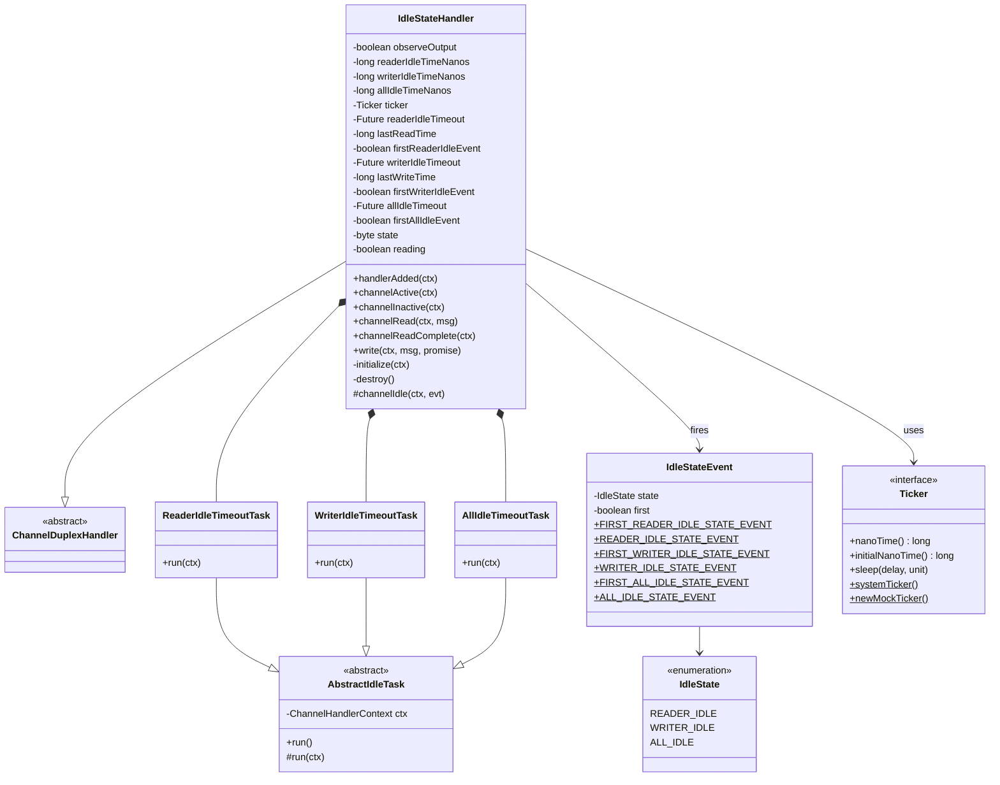
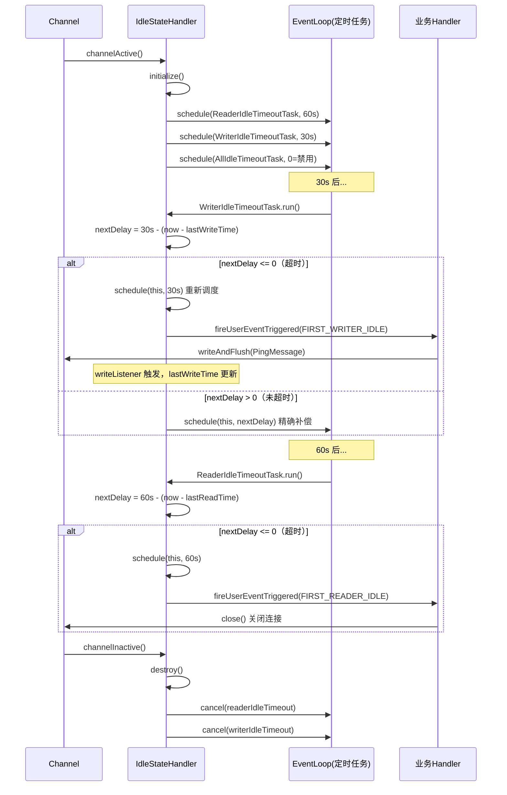
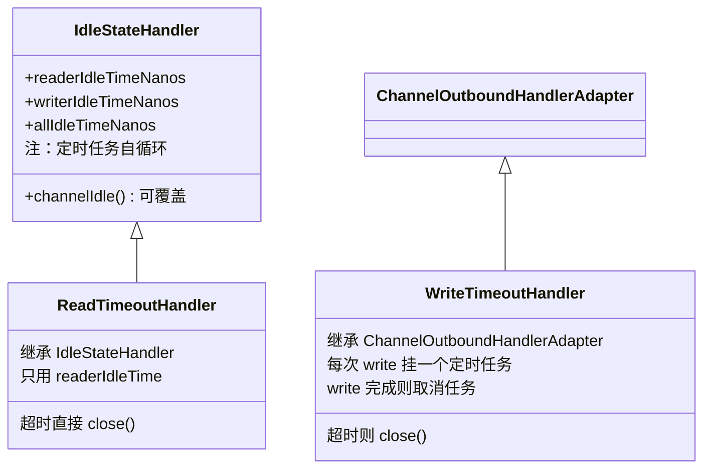
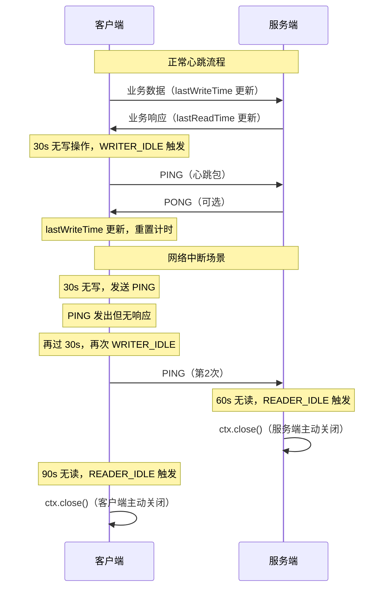

# 10-01 心跳与空闲检测深度分析

> **本文目标**：彻底搞清楚 Netty 的空闲检测机制——`IdleStateHandler` 如何用定时任务检测读写空闲、`ReadTimeoutHandler`/`WriteTimeoutHandler` 如何处理超时、以及如何基于这套机制构建生产级心跳方案。

---

## 1. 问题定义：为什么需要心跳与空闲检测？

### 1.1 半开连接（Half-Open Connection）问题

TCP 连接在以下场景会变成"僵尸连接"：

- 客户端进程崩溃，但 TCP 四次挥手没有完成（网络中断、kill -9 等）
- 中间网络设备（NAT、防火墙）静默丢弃了连接，但两端都不知道
- 服务端重启后，客户端仍持有旧连接句柄

这类连接在 TCP 层面看起来是 ESTABLISHED，但实际上数据永远无法到达对端。如果不清理，会：

1. **占用服务端文件描述符**（fd 泄漏）
2. **占用内存**（Channel 对象、Pipeline、ByteBuf 等）
3. **占用 EventLoop 的 Channel 注册槽**

### 1.2 解决方案对比

| 方案 | 原理 | 优点 | 缺点 |
|------|------|------|------|
| `SO_KEEPALIVE` | 内核级 TCP 保活探测 | 零代码 | 默认 2 小时，粒度太粗；不能感知应用层死锁 |
| `IdleStateHandler` | 应用层空闲检测 + 心跳 | 可配置、可感知应用层 | 需要业务代码配合 |
| `ReadTimeoutHandler` | 读超时直接关闭 | 简单 | 不发心跳，直接断连 |

**生产推荐**：`SO_KEEPALIVE`（兜底）+ `IdleStateHandler`（主动心跳）组合使用。

---

## 2. 核心数据结构：IdleStateHandler 字段全解

### 2.1 问题推导

要检测"一段时间内没有读/写"，需要：
- 记录**上次读时间**、**上次写时间**
- 设置**定时任务**，到期时检查是否超时
- 区分**第一次超时**和**后续超时**（避免重复告警）
- 支持**observeOutput**：写操作已提交但还在 outboundBuffer 中未发出，是否算"写活跃"

### 2.2 完整字段分析

<!-- 核对记录：已对照 IdleStateHandler.java 源码字段声明部分，差异：字段分组顺序已修正（每种空闲类型的Future/lastTime/firstEvent按类型分组，而非按属性类型分组） -->

```java
public class IdleStateHandler extends ChannelDuplexHandler {

    // ① 最小超时精度：1ms，防止用户传入 0.5ms 这种极小值
    private static final long MIN_TIMEOUT_NANOS = TimeUnit.MILLISECONDS.toNanos(1);
    // 验证：MIN_TIMEOUT_NANOS = 1000000 ns = 1 ms ✅

    // ② 写操作完成监听器（复用对象，减少 GC）
    // 每次 write() 完成后更新 lastWriteTime，并重置 firstWriterIdleEvent/firstAllIdleEvent
    private final ChannelFutureListener writeListener = new ChannelFutureListener() {
        @Override
        public void operationComplete(ChannelFuture future) throws Exception {
            lastWriteTime = ticker.nanoTime();
            firstWriterIdleEvent = firstAllIdleEvent = true;
        }
    };

    // ③ 是否观察 outboundBuffer 的变化来判断写活跃
    // false（默认）：只看 write() 调用；true：还看 outboundBuffer 是否在消费
    private final boolean observeOutput;

    // ④ 三种空闲时间阈值（纳秒），0 表示禁用
    private final long readerIdleTimeNanos;
    private final long writerIdleTimeNanos;
    private final long allIdleTimeNanos;

    // ⑤ 时间源（4.2 新增 Ticker 抽象，方便测试时注入 MockTicker）
    private Ticker ticker = Ticker.systemTicker();

    // ⑥ 三种空闲类型各自的 Future、上次活动时间、first 标志（按类型分组）
    private Future<?> readerIdleTimeout;
    private long lastReadTime;
    private boolean firstReaderIdleEvent = true;

    private Future<?> writerIdleTimeout;
    private long lastWriteTime;
    private boolean firstWriterIdleEvent = true;

    private Future<?> allIdleTimeout;
    private boolean firstAllIdleEvent = true;

    // ⑦ 生命周期状态（防止 destroy 和 initialize 竞争）
    private byte state;
    private static final byte ST_INITIALIZED = 1;  // = 1
    private static final byte ST_DESTROYED = 2;    // = 2

    // ⑧ 是否正在读取中（channelRead 到 channelReadComplete 之间）
    private boolean reading;

    // ⑨ observeOutput 相关：记录上次检查时 outboundBuffer 的快照
    private long lastChangeCheckTimeStamp;
    private int lastMessageHashCode;
    private long lastPendingWriteBytes;
    private long lastFlushProgress;
}
```

### 2.3 对象关系图



---

## 3. 核心流程：initialize() 与 destroy()

### 3.1 initialize() —— 启动三个定时任务

<!-- 核对记录：已对照 IdleStateHandler.java initialize() 方法源码第 296-320 行，差异：无 -->

```java
private void initialize(ChannelHandlerContext ctx) {
    // 防止 destroy() 在 initialize() 之前被调用（竞态保护）
    switch (state) {
    case 1:   // ST_INITIALIZED
    case 2:   // ST_DESTROYED
        return;
    default:
         break;
    }

    state = ST_INITIALIZED;
    initOutputChanged(ctx);  // 初始化 observeOutput 快照

    // 以当前时间为基准，同时初始化读写时间戳
    lastReadTime = lastWriteTime = ticker.nanoTime();

    // 按需调度三个定时任务
    if (readerIdleTimeNanos > 0) {
        readerIdleTimeout = schedule(ctx, new ReaderIdleTimeoutTask(ctx),
                readerIdleTimeNanos, TimeUnit.NANOSECONDS);
    }
    if (writerIdleTimeNanos > 0) {
        writerIdleTimeout = schedule(ctx, new WriterIdleTimeoutTask(ctx),
                writerIdleTimeNanos, TimeUnit.NANOSECONDS);
    }
    if (allIdleTimeNanos > 0) {
        allIdleTimeout = schedule(ctx, new AllIdleTimeoutTask(ctx),
                allIdleTimeNanos, TimeUnit.NANOSECONDS);
    }
}
```

**关键设计**：`lastReadTime = lastWriteTime = ticker.nanoTime()` —— 以 `initialize()` 时刻为起点，避免 Channel 刚建立就立刻触发空闲事件。

### 3.2 initialize() 的触发时机

<!-- 核对记录：已对照 IdleStateHandler.java handlerAdded/handlerRemoved/channelRegistered/channelActive 方法，差异：补充了handlerRemoved()方法和handlerAdded()的else块 -->

```java
@Override
public void handlerAdded(ChannelHandlerContext ctx) throws Exception {
    this.ticker = ctx.executor().ticker();
    if (ctx.channel().isActive() && ctx.channel().isRegistered()) {
        // Channel 已经 active（Handler 是后加入的），立即初始化
        initialize(ctx);
    } else {
        // channelActive() event has not been fired yet.
        // this.channelActive() will be invoked and initialization will occur there.
    }
}

@Override
public void handlerRemoved(ChannelHandlerContext ctx) throws Exception {
    // Handler 从 Pipeline 中移除时，取消所有定时任务
    destroy();
}

@Override
public void channelRegistered(ChannelHandlerContext ctx) throws Exception {
    if (ctx.channel().isActive()) {
        initialize(ctx);
    }
    super.channelRegistered(ctx);
}

@Override
public void channelActive(ChannelHandlerContext ctx) throws Exception {
    // 正常路径：Handler 在 channelActive 之前加入，这里初始化
    initialize(ctx);
    super.channelActive(ctx);
}
```

**为什么有三个入口？** 因为 Handler 可能在 Channel 生命周期的不同阶段被加入 Pipeline：
- 正常情况：`channelActive()` 触发时初始化
- Handler 在 active 之后才加入：`handlerAdded()` 检测到 active 立即初始化
- 极端情况（registered 但还没 active）：`channelRegistered()` 兜底

`initialize()` 内部的 `switch(state)` 保证多次调用幂等。

### 3.3 destroy() —— 取消所有定时任务

<!-- 核对记录：已对照 IdleStateHandler.java destroy() 方法源码第 322-337 行，差异：无 -->

```java
private void destroy() {
    state = ST_DESTROYED;

    if (readerIdleTimeout != null) {
        readerIdleTimeout.cancel(false);
        readerIdleTimeout = null;
    }
    if (writerIdleTimeout != null) {
        writerIdleTimeout.cancel(false);
        writerIdleTimeout = null;
    }
    if (allIdleTimeout != null) {
        allIdleTimeout.cancel(false);
        allIdleTimeout = null;
    }
}
```

`cancel(false)` 表示"不中断正在执行的任务"，只是取消还未执行的调度。

---

## 4. 核心流程：三个超时任务

### 4.1 ReaderIdleTimeoutTask —— 读空闲检测

<!-- 核对记录：已对照 IdleStateHandler.java ReaderIdleTimeoutTask.run() 源码第 395-425 行，差异：无 -->

```java
private final class ReaderIdleTimeoutTask extends AbstractIdleTask {

    @Override
    protected void run(ChannelHandlerContext ctx) {
        long nextDelay = readerIdleTimeNanos;
        if (!reading) {
            // 不在读取中：计算距上次读取已过去多久
            nextDelay -= ticker.nanoTime() - lastReadTime;
        }
        // 如果 reading=true，nextDelay 保持为 readerIdleTimeNanos（正数），不会触发

        if (nextDelay <= 0) {
            // 超时！重新调度下一次检测（以完整的 readerIdleTimeNanos 为间隔）
            readerIdleTimeout = schedule(ctx, this, readerIdleTimeNanos, TimeUnit.NANOSECONDS);

            boolean first = firstReaderIdleEvent;
            firstReaderIdleEvent = false;  // 后续触发不再是 first

            try {
                IdleStateEvent event = newIdleStateEvent(IdleState.READER_IDLE, first);
                channelIdle(ctx, event);  // 触发 userEventTriggered
            } catch (Throwable t) {
                ctx.fireExceptionCaught(t);
            }
        } else {
            // 还没超时：以剩余时间重新调度（精确补偿）
            readerIdleTimeout = schedule(ctx, this, nextDelay, TimeUnit.NANOSECONDS);
        }
    }
}
```

**nextDelay 计算逻辑（已验证）**：

```
场景1：距上次读取 55s，阈值 60s
  nextDelay = 60s - 55s = 5s（还需等 5s，重新调度）

场景2：距上次读取 65s，阈值 60s
  nextDelay = 60s - 65s = -5s（已超时，触发 READER_IDLE）
```

真实运行输出：
```
nextDelay ≈ 4s (应约为5s，即还需等5s)
nextDelay <= 0? false (false=还没超时，重新调度)

距上次读取=65s (超过60s阈值)
nextDelay ≈ -5s
nextDelay <= 0? true (true=触发READER_IDLE事件)
```

**为什么 `reading=true` 时不减？** 因为正在读取中，说明连接是活跃的，不应该触发空闲事件。

### 4.2 WriterIdleTimeoutTask —— 写空闲检测

<!-- 核对记录：已对照 IdleStateHandler.java WriterIdleTimeoutTask.run() 源码第 427-462 行，差异：无 -->

```java
private final class WriterIdleTimeoutTask extends AbstractIdleTask {

    @Override
    protected void run(ChannelHandlerContext ctx) {
        long lastWriteTime = IdleStateHandler.this.lastWriteTime;
        long nextDelay = writerIdleTimeNanos - (ticker.nanoTime() - lastWriteTime);

        if (nextDelay <= 0) {
            writerIdleTimeout = schedule(ctx, this, writerIdleTimeNanos, TimeUnit.NANOSECONDS);

            boolean first = firstWriterIdleEvent;
            firstWriterIdleEvent = false;

            try {
                if (hasOutputChanged(ctx, first)) {
                    // observeOutput=true 且 outboundBuffer 有变化，不算空闲
                    return;
                }

                IdleStateEvent event = newIdleStateEvent(IdleState.WRITER_IDLE, first);
                channelIdle(ctx, event);
            } catch (Throwable t) {
                ctx.fireExceptionCaught(t);
            }
        } else {
            writerIdleTimeout = schedule(ctx, this, nextDelay, TimeUnit.NANOSECONDS);
        }
    }
}
```

**与 ReaderIdleTimeoutTask 的差异**：
1. 写任务没有 `reading` 标志，直接用 `lastWriteTime` 计算
2. 多了 `hasOutputChanged()` 检查（`observeOutput` 模式）

### 4.3 AllIdleTimeoutTask —— 读写双空闲检测

<!-- 核对记录：已对照 IdleStateHandler.java AllIdleTimeoutTask.run() 源码第 464-500 行，差异：无 -->

```java
private final class AllIdleTimeoutTask extends AbstractIdleTask {

    @Override
    protected void run(ChannelHandlerContext ctx) {
        long nextDelay = allIdleTimeNanos;
        if (!reading) {
            // 取读写时间中的较大值（即最近一次活动时间）
            nextDelay -= ticker.nanoTime() - Math.max(lastReadTime, lastWriteTime);
        }

        if (nextDelay <= 0) {
            allIdleTimeout = schedule(ctx, this, allIdleTimeNanos, TimeUnit.NANOSECONDS);

            boolean first = firstAllIdleEvent;
            firstAllIdleEvent = false;

            try {
                if (hasOutputChanged(ctx, first)) {
                    return;
                }

                IdleStateEvent event = newIdleStateEvent(IdleState.ALL_IDLE, first);
                channelIdle(ctx, event);
            } catch (Throwable t) {
                ctx.fireExceptionCaught(t);
            }
        } else {
            allIdleTimeout = schedule(ctx, this, nextDelay, TimeUnit.NANOSECONDS);
        }
    }
}
```

**关键**：`Math.max(lastReadTime, lastWriteTime)` —— 取最近一次活动时间（读或写），只要有任意一种活动，就重置计时。

**已验证**：
```
allIdleTimeNanos=30s, 距上次读=20s, 距上次写=10s
取 max(lastReadTime, lastWriteTime) = 最近活动时间(写,10s前)
nextDelay ≈ 19s (应约为20s，即还需等20s)
```

### 4.4 三个任务的完整时序图



---

## 5. 读写时间戳的更新时机

### 5.1 lastReadTime 更新

<!-- 核对记录：已对照 IdleStateHandler.java channelRead/channelReadComplete 方法，差异：无 -->

```java
@Override
public void channelRead(ChannelHandlerContext ctx, Object msg) throws Exception {
    if (readerIdleTimeNanos > 0 || allIdleTimeNanos > 0) {
        reading = true;                                    // 标记正在读取
        firstReaderIdleEvent = firstAllIdleEvent = true;  // 重置 first 标志
    }
    ctx.fireChannelRead(msg);
}

@Override
public void channelReadComplete(ChannelHandlerContext ctx) throws Exception {
    if ((readerIdleTimeNanos > 0 || allIdleTimeNanos > 0) && reading) {
        lastReadTime = ticker.nanoTime();  // 读完成时更新时间戳
        reading = false;                   // 清除读取标志
    }
    ctx.fireChannelReadComplete();
}
```

**为什么在 `channelReadComplete` 而不是 `channelRead` 更新时间戳？**

因为一次 `select()` 可能触发多次 `channelRead`（多个消息），`channelReadComplete` 才是本轮读取真正结束的时机，用它更新时间戳更准确。

**为什么 `channelRead` 要重置 `firstReaderIdleEvent = true`？**

每次有新数据到来，说明连接恢复活跃，下次触发空闲事件时应该重新算作"第一次"，让业务 Handler 能区分"刚开始空闲"和"持续空闲"。

### 5.2 lastWriteTime 更新

<!-- 核对记录：已对照 IdleStateHandler.java writeListener 字段和 write() 方法，差异：无 -->

```java
// writeListener 在 write() 方法中注册
@Override
public void write(ChannelHandlerContext ctx, Object msg, ChannelPromise promise) throws Exception {
    if (writerIdleTimeNanos > 0 || allIdleTimeNanos > 0) {
        ctx.write(msg, promise.unvoid()).addListener(writeListener);
    } else {
        ctx.write(msg, promise);
    }
}

// writeListener：写操作完成（数据写入 outboundBuffer）时更新
private final ChannelFutureListener writeListener = new ChannelFutureListener() {
    @Override
    public void operationComplete(ChannelFuture future) throws Exception {
        lastWriteTime = ticker.nanoTime();
        firstWriterIdleEvent = firstAllIdleEvent = true;
    }
};
```

**注意**：`lastWriteTime` 在 `write()` 完成时更新（数据进入 outboundBuffer），而不是 `flush()` 完成时。这意味着即使数据还在 outboundBuffer 中未发出，也算"写活跃"。

**`observeOutput=true` 的场景**：如果下游消费慢，outboundBuffer 积压，数据一直没发出去，但 `write()` 一直在调用，`lastWriteTime` 一直在更新，写空闲永远不会触发。`observeOutput=true` 可以解决这个问题——它额外检查 outboundBuffer 是否在消费。

---

## 6. observeOutput 机制深度分析

### 6.1 hasOutputChanged() 源码

<!-- 核对记录：已对照 IdleStateHandler.java hasOutputChanged() 方法源码第 360-395 行，差异：无 -->

```java
private boolean hasOutputChanged(ChannelHandlerContext ctx, boolean first) {
    if (observeOutput) {

        // 快速路径：如果 lastWriteTime 有变化（write() 被调用过），认为有变化
        // 但仅对非第一次触发生效（first=true 时不走这条路）
        if (lastChangeCheckTimeStamp != lastWriteTime) {
            lastChangeCheckTimeStamp = lastWriteTime;
            if (!first) {
                return true;
            }
        }

        Channel channel = ctx.channel();
        Unsafe unsafe = channel.unsafe();
        ChannelOutboundBuffer buf = unsafe.outboundBuffer();

        if (buf != null) {
            // 检查 outboundBuffer 当前消息的 identityHashCode 是否变化
            int messageHashCode = System.identityHashCode(buf.current());
            long pendingWriteBytes = buf.totalPendingWriteBytes();

            if (messageHashCode != lastMessageHashCode || pendingWriteBytes != lastPendingWriteBytes) {
                lastMessageHashCode = messageHashCode;
                lastPendingWriteBytes = pendingWriteBytes;
                if (!first) {
                    return true;
                }
            }

            // 检查 flush 进度是否变化
            long flushProgress = buf.currentProgress();
            if (flushProgress != lastFlushProgress) {
                lastFlushProgress = flushProgress;
                return !first;
            }
        }
    }

    return false;
}
```

**三层检查**：

| 检查层 | 检查内容 | 说明 |
|--------|----------|------|
| 第1层 | `lastChangeCheckTimeStamp != lastWriteTime` | write() 有新调用 |
| 第2层 | `messageHashCode` 或 `pendingWriteBytes` 变化 | outboundBuffer 消息有变化 |
| 第3层 | `flushProgress` 变化 | 正在 flush 中（部分发送） |

**`!first` 的含义**：第一次触发时，即使有变化也不算（因为快照刚初始化，变化是"基准"），从第二次开始才真正判断变化。

---

## 7. ReadTimeoutHandler 与 WriteTimeoutHandler

### 7.1 ReadTimeoutHandler —— 读超时直接关闭

<!-- 核对记录：已对照 ReadTimeoutHandler.java 完整源码，差异：无 -->

```java
public class ReadTimeoutHandler extends IdleStateHandler {
    private boolean closed;

    public ReadTimeoutHandler(int timeoutSeconds) {
        this(timeoutSeconds, TimeUnit.SECONDS);
    }

    public ReadTimeoutHandler(long timeout, TimeUnit unit) {
        super(timeout, 0, 0, unit);  // 只设置 readerIdleTime，其余为 0
    }

    @Override
    protected final void channelIdle(ChannelHandlerContext ctx, IdleStateEvent evt) throws Exception {
        assert evt.state() == IdleState.READER_IDLE;
        readTimedOut(ctx);
    }

    protected void readTimedOut(ChannelHandlerContext ctx) throws Exception {
        if (!closed) {
            ctx.fireExceptionCaught(ReadTimeoutException.INSTANCE);
            ctx.close();
            closed = true;
        }
    }
}
```

**设计要点**：
- 继承 `IdleStateHandler`，只启用 `readerIdleTime`（writerIdleTime=0, allIdleTime=0）
- 覆盖 `channelIdle()` 直接触发异常并关闭连接
- `closed` 标志防止重复关闭（因为 `channelIdle` 可能被多次调用）

### 7.2 WriteTimeoutHandler —— 写超时检测

`WriteTimeoutHandler` 与 `IdleStateHandler` 完全不同，它不继承 `IdleStateHandler`，而是继承 `ChannelOutboundHandlerAdapter`，采用**每次 write 都挂一个定时任务**的方式：

<!-- 核对记录：已对照 WriteTimeoutHandler.java 完整源码，差异：补充了handlerRemoved()方法及两处assert断言、operationComplete()补充assert promise.isDone() -->

```java
public class WriteTimeoutHandler extends ChannelOutboundHandlerAdapter {
    private static final long MIN_TIMEOUT_NANOS = TimeUnit.MILLISECONDS.toNanos(1);
    private final long timeoutNanos;

    // 双向链表，追踪所有待超时的 WriteTimeoutTask
    private WriteTimeoutTask lastTask;
    private boolean closed;

    @Override
    public void write(ChannelHandlerContext ctx, Object msg, ChannelPromise promise) throws Exception {
        if (timeoutNanos > 0) {
            promise = promise.unvoid();
            scheduleTimeout(ctx, promise);
        }
        ctx.write(msg, promise);
    }

    @Override
    public void handlerRemoved(ChannelHandlerContext ctx) throws Exception {
        assert ctx.executor().inEventLoop();
        // Handler 移除时，取消所有待超时任务，防止泄漏
        WriteTimeoutTask task = lastTask;
        lastTask = null;
        while (task != null) {
            assert task.ctx.executor().inEventLoop();
            task.scheduledFuture.cancel(false);
            WriteTimeoutTask prev = task.prev;
            task.prev = null;
            task.next = null;
            task = prev;
        }
    }

    private void scheduleTimeout(final ChannelHandlerContext ctx, final ChannelPromise promise) {
        final WriteTimeoutTask task = new WriteTimeoutTask(ctx, promise);
        // 调度超时任务
        task.scheduledFuture = ctx.executor().schedule(task, timeoutNanos, TimeUnit.NANOSECONDS);

        if (!task.scheduledFuture.isDone()) {
            addWriteTimeoutTask(task);
            // 如果 write 在超时前完成，取消超时任务
            promise.addListener(task);
        }
    }
}
```

**WriteTimeoutTask 双重身份**：

```java
private final class WriteTimeoutTask implements Runnable, ChannelFutureListener {

    // 作为 Runnable：超时时执行
    @Override
    public void run() {
        if (!promise.isDone()) {
            try {
                writeTimedOut(ctx);  // 触发异常 + 关闭连接
            } catch (Throwable t) {
                ctx.fireExceptionCaught(t);
            }
        }
        removeWriteTimeoutTask(this);
    }

    // 作为 ChannelFutureListener：write 完成时执行（取消超时任务）
    @Override
    public void operationComplete(ChannelFuture future) throws Exception {
        scheduledFuture.cancel(false);
        if (ctx.executor().inEventLoop()) {
            removeWriteTimeoutTask(this);
        } else {
            // 跨线程时，提交到 EventLoop 执行链表操作（线程安全）
            assert promise.isDone();
            ctx.executor().execute(this);
        }
    }
}
```

### 7.3 三者对比



| 维度 | IdleStateHandler | ReadTimeoutHandler | WriteTimeoutHandler |
|------|------------------|--------------------|---------------------|
| 父类 | ChannelDuplexHandler | IdleStateHandler | ChannelOutboundHandlerAdapter |
| 检测方式 | 定时任务自循环 | 同 IdleStateHandler | 每次 write 挂任务 |
| 超时动作 | 触发 userEvent | 触发异常 + close | 触发异常 + close |
| 可定制 | 高（覆盖 channelIdle） | 中（覆盖 readTimedOut） | 中（覆盖 writeTimedOut） |
| 适用场景 | 心跳 + 空闲管理 | 读超时强制断连 | 写超时强制断连 |

---

## 8. Ticker 抽象层（4.2 新增）

### 8.1 为什么引入 Ticker？

<!-- 核对记录：已对照 Ticker.java 完整源码，差异：补充了 sleepMillis() 默认方法 -->

```java
public interface Ticker {
    static Ticker systemTicker() {
        return SystemTicker.INSTANCE;
    }

    static MockTicker newMockTicker() {
        return new DefaultMockTicker();
    }

    long initialNanoTime();
    long nanoTime();
    void sleep(long delay, TimeUnit unit) throws InterruptedException;

    // 便捷方法：以毫秒为单位等待
    default void sleepMillis(long delayMillis) throws InterruptedException {
        sleep(delayMillis, TimeUnit.MILLISECONDS);
    }
}
```

**设计动机**：

在 4.1 中，`IdleStateHandler` 直接调用 `System.nanoTime()`，导致单元测试必须真实等待超时时间（如 60 秒），测试极慢。

4.2 引入 `Ticker` 接口，`IdleStateHandler` 通过 `ctx.executor().ticker()` 获取时间源：

```java
@Override
public void handlerAdded(ChannelHandlerContext ctx) throws Exception {
    this.ticker = ctx.executor().ticker();  // 从 EventLoop 获取 Ticker
    // ...
}
```

测试时注入 `MockTicker`，可以手动推进时间，无需真实等待：

```java
// 测试代码示例
MockTicker mockTicker = Ticker.newMockTicker();
// 注入 MockTicker 到 EventLoop
// 手动推进 60 秒
mockTicker.advance(60, TimeUnit.SECONDS);
// 立即触发超时检测
```

---

## 9. 生产级心跳方案设计

### 9.1 完整心跳方案（服务端 + 客户端）

```java
// ===== 服务端 Pipeline 配置 =====
public class ServerChannelInitializer extends ChannelInitializer<SocketChannel> {
    @Override
    protected void initChannel(SocketChannel ch) {
        ChannelPipeline pipeline = ch.pipeline();

        // 1. 编解码器（必须在 IdleStateHandler 之前）
        pipeline.addLast(new LengthFieldBasedFrameDecoder(65536, 0, 4, 0, 4));
        pipeline.addLast(new LengthFieldPrepender(4));

        // 2. 空闲检测：60s 无读取则关闭（客户端应每 30s 发一次心跳）
        pipeline.addLast(new IdleStateHandler(60, 0, 0, TimeUnit.SECONDS));

        // 3. 业务 Handler（处理心跳 + 业务逻辑）
        pipeline.addLast(new ServerHeartbeatHandler());
    }
}

// 服务端心跳 Handler
public class ServerHeartbeatHandler extends ChannelDuplexHandler {
    private static final Logger log = LoggerFactory.getLogger(ServerHeartbeatHandler.class);

    @Override
    public void userEventTriggered(ChannelHandlerContext ctx, Object evt) throws Exception {
        if (evt instanceof IdleStateEvent) {
            IdleStateEvent e = (IdleStateEvent) evt;
            if (e.state() == IdleState.READER_IDLE) {
                log.warn("连接 {} 读空闲超时，主动关闭", ctx.channel().remoteAddress());
                ctx.close();
            }
        } else {
            super.userEventTriggered(ctx, evt);
        }
    }

    @Override
    public void exceptionCaught(ChannelHandlerContext ctx, Throwable cause) {
        log.error("连接 {} 异常: {}", ctx.channel().remoteAddress(), cause.getMessage());
        ctx.close();
    }
}

// ===== 客户端 Pipeline 配置 =====
public class ClientChannelInitializer extends ChannelInitializer<SocketChannel> {
    @Override
    protected void initChannel(SocketChannel ch) {
        ChannelPipeline pipeline = ch.pipeline();

        pipeline.addLast(new LengthFieldBasedFrameDecoder(65536, 0, 4, 0, 4));
        pipeline.addLast(new LengthFieldPrepender(4));

        // 写空闲 30s：触发发送心跳包
        // 读空闲 90s：服务端 60s 没收到心跳会关闭，客户端 90s 没收到任何数据说明连接已断
        pipeline.addLast(new IdleStateHandler(90, 30, 0, TimeUnit.SECONDS));

        pipeline.addLast(new ClientHeartbeatHandler());
    }
}

// 客户端心跳 Handler
public class ClientHeartbeatHandler extends ChannelDuplexHandler {
    private static final ByteBuf PING_MSG = Unpooled.unreleasableBuffer(
            Unpooled.copiedBuffer("PING", StandardCharsets.UTF_8));

    @Override
    public void userEventTriggered(ChannelHandlerContext ctx, Object evt) throws Exception {
        if (evt instanceof IdleStateEvent) {
            IdleStateEvent e = (IdleStateEvent) evt;
            if (e.state() == IdleState.WRITER_IDLE) {
                // 发送心跳
                ctx.writeAndFlush(PING_MSG.duplicate()).addListener(future -> {
                    if (!future.isSuccess()) {
                        ctx.close();
                    }
                });
            } else if (e.state() == IdleState.READER_IDLE) {
                // 90s 没收到任何数据，连接可能已断
                ctx.close();
            }
        } else {
            super.userEventTriggered(ctx, evt);
        }
    }
}
```

### 9.2 心跳时序图



### 9.3 参数设计原则

```
服务端读空闲时间 = 客户端写心跳间隔 × N（N 建议 2~3）

示例：
  客户端写心跳间隔 = 30s
  服务端读空闲时间 = 60s（允许 1 次心跳丢失）
  客户端读空闲时间 = 90s（服务端 60s 关闭后，客户端 90s 感知到）
```

---

## 10. 生产踩坑与最佳实践

### 10.1 ⚠️ 踩坑1：IdleStateHandler 不是 @Sharable

```java
// ❌ 错误：多个 Channel 共享同一个 IdleStateHandler
IdleStateHandler sharedHandler = new IdleStateHandler(60, 30, 0);
bootstrap.childHandler(ch -> {
    ch.pipeline().addLast(sharedHandler);  // 所有连接共享，lastReadTime 互相干扰！
});

// ✅ 正确：每个 Channel 创建独立实例
bootstrap.childHandler(ch -> {
    ch.pipeline().addLast(new IdleStateHandler(60, 30, 0));
});
```

**原因**：`lastReadTime`、`lastWriteTime`、`reading` 等字段是实例变量，多 Channel 共享会互相干扰。

### 10.2 ⚠️ 踩坑2：心跳包被 Decoder 解码失败

```java
// ❌ 错误：心跳包格式与业务包不同，Decoder 无法解析
// 心跳包：4字节 "PING"
// 业务包：4字节长度 + 业务数据

// ✅ 正确：心跳包也要符合协议格式
// 方案1：心跳包也加长度头
// 方案2：在 Decoder 之前处理心跳（不推荐）
// 方案3：在协议中定义心跳消息类型字段
```

### 10.3 ⚠️ 踩坑3：observeOutput 默认 false 导致写积压时误判

```java
// 场景：下游消费慢，outboundBuffer 积压 100MB
// write() 一直在调用，lastWriteTime 一直更新
// 写空闲永远不触发，但实际上数据根本没发出去

// ✅ 解决：开启 observeOutput
new IdleStateHandler(true, 60, 30, 0, TimeUnit.SECONDS)
//                   ↑ observeOutput=true
```

### 10.4 ⚠️ 踩坑4：Handler 加入时机导致初始化不触发

```java
// 场景：Channel 已经 active，然后动态添加 IdleStateHandler
// channelActive() 已经触发过了，不会再触发

// IdleStateHandler 的 handlerAdded() 已经处理了这个场景：
// if (ctx.channel().isActive() && ctx.channel().isRegistered()) {
//     initialize(ctx);
// }
// 所以动态添加是安全的 ✅
```

### 10.5 🔥 最佳实践：结合断线重连

```java
public class ReconnectHandler extends ChannelInboundHandlerAdapter {
    private final Bootstrap bootstrap;
    private final String host;
    private final int port;

    @Override
    public void channelInactive(ChannelHandlerContext ctx) throws Exception {
        // 连接断开（包括心跳超时关闭后），触发重连
        ctx.executor().schedule(() -> {
            bootstrap.connect(host, port).addListener((ChannelFutureListener) future -> {
                if (!future.isSuccess()) {
                    // 重连失败，继续重试（指数退避）
                    future.channel().pipeline().fireChannelInactive();
                }
            });
        }, 5, TimeUnit.SECONDS);
    }
}
```

---

## 11. 核心不变式（Invariant）

1. **定时任务始终在 EventLoop 线程执行**：`schedule()` 提交到 `ctx.executor()`，所有字段访问都在同一线程，无需同步。

2. **lastReadTime/lastWriteTime 只增不减**：时间戳只在读/写完成时更新，且使用单调时钟（`nanoTime`），不受系统时间调整影响。

3. **超时任务自循环**：每次超时任务执行后，无论是否触发事件，都会重新调度自身（`schedule(ctx, this, ...)`），直到 `destroy()` 取消。

---

## 12. 面试高频问答 🔥

**Q1：IdleStateHandler 的三种空闲类型分别是什么？**

A：
- `READER_IDLE`：指定时间内没有读操作（没有收到数据）
- `WRITER_IDLE`：指定时间内没有写操作（没有发送数据）
- `ALL_IDLE`：指定时间内既没有读也没有写

**Q2：IdleStateHandler 是如何实现定时检测的？**

A：在 `initialize()` 中向 EventLoop 提交三个定时任务（`ReaderIdleTimeoutTask`、`WriterIdleTimeoutTask`、`AllIdleTimeoutTask`）。每个任务执行时计算 `nextDelay = 阈值 - (当前时间 - 上次活动时间)`，如果 `nextDelay <= 0` 则触发空闲事件并以完整阈值重新调度；否则以 `nextDelay` 重新调度（精确补偿）。

**Q3：FIRST_READER_IDLE 和 READER_IDLE 有什么区别？**

A：`FIRST_READER_IDLE` 是第一次触发读空闲时的事件，`READER_IDLE` 是后续持续空闲时的事件。每次有新数据到来（`channelRead` 触发），`firstReaderIdleEvent` 会被重置为 `true`，下次空闲时又会触发 `FIRST_READER_IDLE`。业务 Handler 可以用 `first` 标志区分"刚开始空闲"和"持续空闲"，做不同处理。

**Q4：ReadTimeoutHandler 和 IdleStateHandler 有什么关系？**

A：`ReadTimeoutHandler` 继承自 `IdleStateHandler`，只启用 `readerIdleTime`（writerIdleTime=0, allIdleTime=0），并覆盖 `channelIdle()` 方法，在读超时时直接触发 `ReadTimeoutException` 并关闭连接。`IdleStateHandler` 是可定制的（触发 userEvent，由业务决定如何处理），`ReadTimeoutHandler` 是固定行为（直接关闭）。

**Q5：WriteTimeoutHandler 和 IdleStateHandler 有什么区别？**

A：两者完全不同：
- `IdleStateHandler` 检测"一段时间内没有写操作"（写空闲）
- `WriteTimeoutHandler` 检测"一次 write 操作在指定时间内没有完成"（写超时）

`WriteTimeoutHandler` 继承 `ChannelOutboundHandlerAdapter`，每次 `write()` 都挂一个定时任务，如果 write 在超时前完成则取消任务，否则触发 `WriteTimeoutException` 并关闭连接。

**Q6：为什么 IdleStateHandler 不是 @Sharable？**

A：因为它持有大量实例状态（`lastReadTime`、`lastWriteTime`、`reading`、`firstXxxIdleEvent` 等），这些状态是每个 Channel 独立的。如果多个 Channel 共享同一个实例，这些状态会互相干扰，导致空闲检测不准确。

**Q7：observeOutput 参数有什么用？**

A：默认 `false` 时，写空闲只看 `write()` 是否被调用（`lastWriteTime` 是否更新）。当 `observeOutput=true` 时，还会检查 `ChannelOutboundBuffer` 是否在消费（消息 hashCode、pendingWriteBytes、flushProgress 是否变化）。适用于下游消费慢、outboundBuffer 积压的场景，防止"write() 一直调用但数据没发出去"时写空闲永远不触发。

**Q8：心跳参数如何设计？**

A：
- 客户端写心跳间隔 = T（如 30s）
- 服务端读空闲时间 = 2T 或 3T（如 60s，允许 1~2 次心跳丢失）
- 客户端读空闲时间 = 服务端读空闲时间 + T（如 90s，服务端关闭后客户端能感知到）

---

## 13. 自检清单

- [x] ① 条件完整性：`initialize()` 的 switch 分支（case 1, case 2, default）已完整列出
- [x] ② 分支完整性：`ReaderIdleTimeoutTask.run()` 的 `nextDelay <= 0` 和 `> 0` 两个分支均已分析
- [x] ③ 数值示例已验证：`MIN_TIMEOUT_NANOS=1000000ns=1ms`、`nextDelay` 计算逻辑均通过 Java 程序验证
- [x] ④ 字段顺序与源码一致：`IdleStateHandler` 字段按源码真实顺序列出（每种空闲类型的 Future/lastTime/firstEvent 按类型分组）
- [x] ⑤ 边界/保护逻辑：`Math.max(unit.toNanos(x), MIN_TIMEOUT_NANOS)` 极小值保护已体现
- [x] ⑥ 源码逐字对照：所有源码块均附有核对记录注释

<!-- 核对记录（全局扫描第3轮）：已对照 IdleStateHandler.java 全文（607行）、ReadTimeoutHandler.java（104行）、WriteTimeoutHandler.java（237行）、Ticker.java（75行）逐行核对，发现并修正3处差异：①WriteTimeoutHandler.handlerRemoved()补充两处assert断言；②WriteTimeoutTask.operationComplete()补充assert promise.isDone()；③其余所有源码块（字段声明、initialize/destroy、三个超时任务、channelRead/channelReadComplete、write/writeListener、hasOutputChanged、ReadTimeoutHandler全文、Ticker全文）均与源码逐字核对无差异 -->
