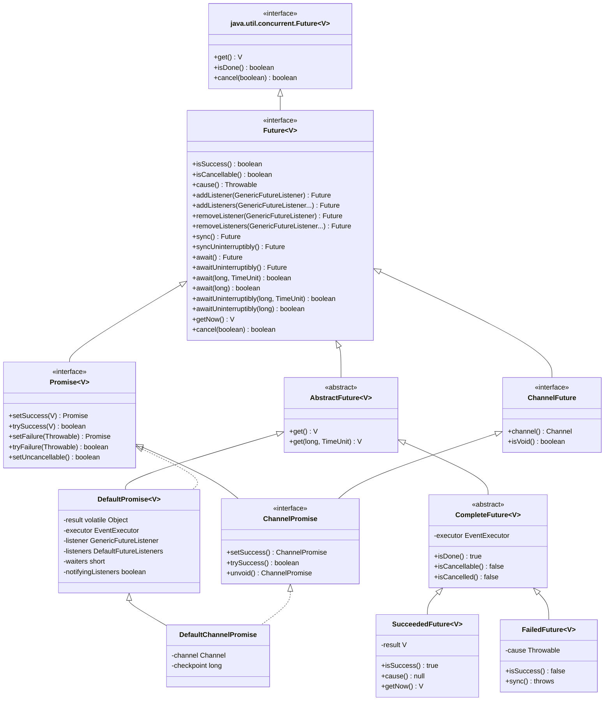
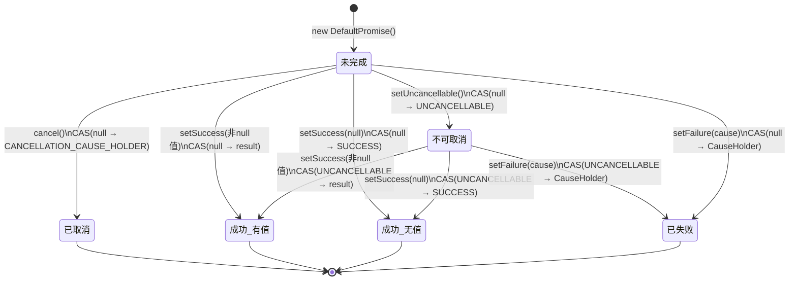
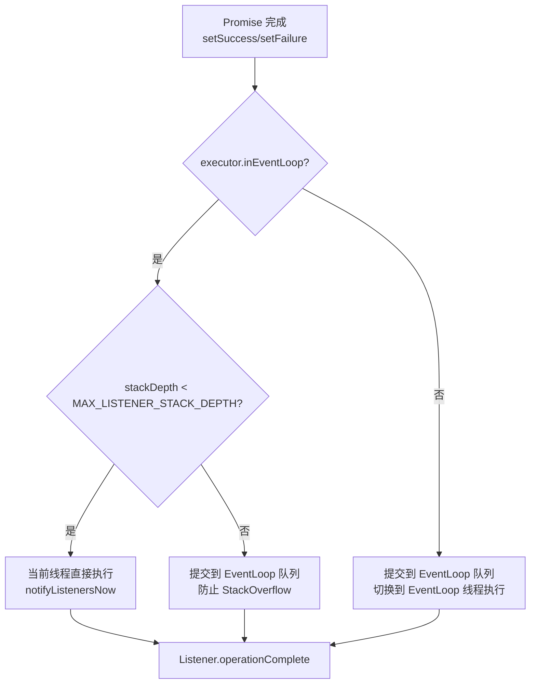
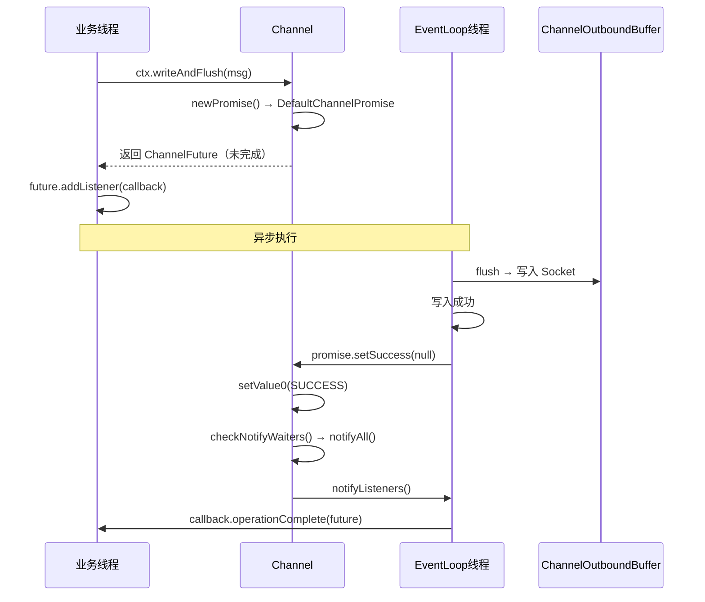
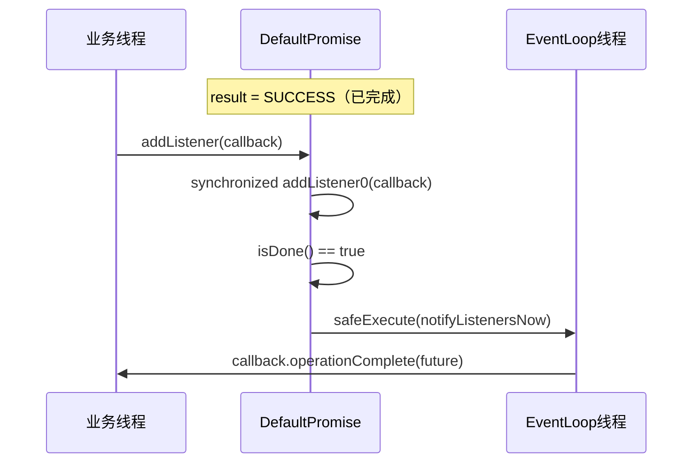

# 15. Future 与 Promise 异步模型

> **核心问题**：Netty 所有 I/O 操作都是异步的——`write()`、`connect()`、`close()` 调用后立即返回，结果在未来某个时刻才会就绪。如何让调用方既能**非阻塞地注册回调**，又能在必要时**阻塞等待结果**，同时保证**线程安全**？这就是 Future/Promise 模型要解决的问题。

---

## 一、问题推导：为什么需要 Future/Promise？

### 1.1 同步 vs 异步的本质矛盾

```
同步模型：
  调用方 ──────────────────────────────────────────→ 返回结果
         ← 阻塞等待 IO 完成 →

异步模型：
  调用方 ──→ 提交操作 ──→ 立即返回 Future
                              ↓
                         IO 线程执行
                              ↓
                         Future 完成 ──→ 通知 Listener
```

JDK 的 `java.util.concurrent.Future` 只提供了 `get()` 阻塞等待，没有回调机制。Netty 需要：
1. **非阻塞回调**：`addListener()` 注册回调，IO 完成时自动触发
2. **可写入结果**：生产者（IO 线程）能主动设置成功/失败
3. **死锁检测**：在 EventLoop 线程内调用 `await()` 会死锁，必须检测并抛异常
4. **线程安全**：多线程并发 `addListener` / `setSuccess` 不能有竞态

### 1.2 推导出需要的结构

| 需求 | 对应设计 |
|------|---------|
| 异步结果容器 | `Future<V>` 接口（只读视图） |
| 可写入结果 | `Promise<V>` 接口（继承 Future，增加 set 方法） |
| Channel I/O 专用 | `ChannelFuture` / `ChannelPromise` |
| 状态机 | `result` 字段（volatile Object）+ 哨兵对象 |
| 回调链 | `listener` + `listeners` 字段 |
| 阻塞等待 | `waiters` 计数 + `wait()/notifyAll()` |
| 死锁检测 | `checkDeadLock()` 检查是否在 EventLoop 线程 |

---

## 二、类层次结构



<!-- 核对记录：已对照 Future.java、Promise.java、DefaultPromise.java、ChannelFuture.java、ChannelPromise.java、DefaultChannelPromise.java、CompleteFuture.java、SucceededFuture.java、FailedFuture.java 源码，差异：无 -->

**关键继承关系**：
- `ChannelFuture extends Future<Void>`：Channel I/O 操作结果类型固定为 `Void`（只关心成功/失败，不关心返回值）
- `ChannelPromise extends ChannelFuture, Promise<Void>`：双继承，既是可读的 Future 又是可写的 Promise
- `DefaultChannelPromise extends DefaultPromise<Void> implements ChannelPromise, FlushCheckpoint`：额外实现了 `FlushCheckpoint`，用于 `ChannelOutboundBuffer` 的 flush 进度追踪

---

## 三、DefaultPromise 核心数据结构

### 3.1 问题推导

要实现线程安全的状态机，需要：
- 一个字段表示"当前状态 + 结果值"（合二为一，减少字段数）
- 用哨兵对象区分不同状态（避免 null 歧义）
- CAS 保证状态流转的原子性

### 3.2 字段声明

```java
// DefaultPromise.java 字段声明（第55-82行）

// 最大 Listener 递归深度，防止 StackOverflow
private static final int MAX_LISTENER_STACK_DEPTH = Math.min(8,
        SystemPropertyUtil.getInt(PROPERTY_MAX_LISTENER_STACK_DEPTH, 8));

// CAS 更新器，操作 result 字段
@SuppressWarnings("rawtypes")
private static final AtomicReferenceFieldUpdater<DefaultPromise, Object> RESULT_UPDATER =
        AtomicReferenceFieldUpdater.newUpdater(DefaultPromise.class, Object.class, "result");

// 哨兵：setSuccess(null) 时用 SUCCESS 代替 null，避免 null 歧义
private static final Object SUCCESS = new Object();

// 哨兵：已调用 setUncancellable()，不可取消但尚未完成
private static final Object UNCANCELLABLE = new Object();

// 哨兵：已取消，包装了 CancellationException
private static final CauseHolder CANCELLATION_CAUSE_HOLDER = new CauseHolder(
        StacklessCancellationException.newInstance(DefaultPromise.class, "cancel(...)"));
private static final StackTraceElement[] CANCELLATION_STACK = CANCELLATION_CAUSE_HOLDER.cause.getStackTrace();

// ★ 核心字段：volatile，存储当前状态
private volatile Object result;

// 关联的 EventExecutor，用于 Listener 通知线程选择
private final EventExecutor executor;

// 单个 Listener（优化：只有一个时不创建数组）
private GenericFutureListener<? extends Future<?>> listener;

// 多个 Listener（第二个 Listener 加入时升级为此）
private DefaultFutureListeners listeners;

// 等待线程计数（short，最大 Short.MAX_VALUE = 32767）
private short waiters;

// 防止并发通知的标志
private boolean notifyingListeners;
```

<!-- 核对记录：已对照 DefaultPromise.java 第44-82行源码，差异：无 -->

### 3.3 状态机设计 🔥

`result` 字段的取值决定了 Promise 的状态：



| `result` 值 | 状态 | `isDone()` | `isSuccess()` | `isCancelled()` |
|------------|------|-----------|--------------|----------------|
| `null` | 未完成（初始） | false | false | false |
| `UNCANCELLABLE` | 不可取消（进行中） | false | false | false |
| `SUCCESS` | 成功（结果为 null） | true | true | false |
| 任意非哨兵对象 | 成功（有结果值） | true | true | false |
| `CauseHolder(CancellationException)` | 已取消 | true | false | true |
| `CauseHolder(其他 Throwable)` | 已失败 | true | false | false |

**判断逻辑**（源码）：

```java
// isDone0：result != null 且 result != UNCANCELLABLE
private static boolean isDone0(Object result) {
    return result != null && result != UNCANCELLABLE;
}

// isSuccess：result != null 且 != UNCANCELLABLE 且不是 CauseHolder
@Override
public boolean isSuccess() {
    Object result = this.result;
    return result != null && result != UNCANCELLABLE && !(result instanceof CauseHolder);
}

// isCancelled0：是 CauseHolder 且 cause 是 CancellationException
private static boolean isCancelled0(Object result) {
    return result instanceof CauseHolder && ((CauseHolder) result).cause instanceof CancellationException;
}
```

<!-- 核对记录：已对照 DefaultPromise.java isDone0/isSuccess/isCancelled0 方法源码，差异：无 -->

---

## 四、核心流程分析

### 4.1 setSuccess / setFailure 流程

```java
// setSuccess0 → setValue0（第 setSuccess0 方法）
private boolean setSuccess0(V result) {
    return setValue0(result == null ? SUCCESS : result);
}

private boolean setFailure0(Throwable cause) {
    return setValue0(new CauseHolder(checkNotNull(cause, "cause")));
}

private boolean setValue0(Object objResult) {
    // CAS：从 null 或 UNCANCELLABLE 转为最终状态
    if (RESULT_UPDATER.compareAndSet(this, null, objResult) ||
        RESULT_UPDATER.compareAndSet(this, UNCANCELLABLE, objResult)) {
        if (checkNotifyWaiters()) {
            notifyListeners();
        }
        return true;
    }
    return false;
}

// checkNotifyWaiters：唤醒所有 await() 等待线程，返回是否有 Listener
private synchronized boolean checkNotifyWaiters() {
    if (waiters > 0) {
        notifyAll();
    }
    return listener != null || listeners != null;
}
```

<!-- 核对记录：已对照 DefaultPromise.java setSuccess0/setFailure0/setValue0/checkNotifyWaiters 方法源码，差异：无 -->

**两次 CAS 的原因**：`setValue0` 中有两个 `compareAndSet`：
- 第一个：`null → objResult`（正常路径，Promise 尚未被 setUncancellable）
- 第二个：`UNCANCELLABLE → objResult`（Promise 已被标记为不可取消，但仍可完成）

### 4.2 addListener 流程 🔥

```java
@Override
public Promise<V> addListener(GenericFutureListener<? extends Future<? super V>> listener) {
    checkNotNull(listener, "listener");

    synchronized (this) {
        addListener0(listener);   // ① 加入 listener 链
    }

    if (isDone()) {
        notifyListeners();        // ② 如果已完成，立即触发通知
    }

    return this;
}

private void addListener0(GenericFutureListener<? extends Future<? super V>> listener) {
    if (this.listener == null) {
        if (listeners == null) {
            this.listener = listener;          // 第 1 个 listener：直接存字段
        } else {
            listeners.add(listener);           // 已有多个：加入数组
        }
    } else {
        assert listeners == null;
        listeners = new DefaultFutureListeners(this.listener, listener);  // 第 2 个：升级为数组
        this.listener = null;
    }
}
```

<!-- 核对记录：已对照 DefaultPromise.java addListener/addListener0 方法源码，差异：无 -->

**关键设计**：
- `listener` 字段（单个）+ `listeners` 字段（多个）的二级结构，避免只有一个 Listener 时创建数组对象
- `addListener` 后立即检查 `isDone()`：**如果 Promise 在 `addListener` 之前已经完成，Listener 会立即被通知**，不会丢失

### 4.3 notifyListeners 通知线程选择 🔥

```java
private void notifyListeners() {
    EventExecutor executor = executor();
    if (executor.inEventLoop()) {
        // 当前已在 EventLoop 线程：直接调用，但检查递归深度
        final InternalThreadLocalMap threadLocals = InternalThreadLocalMap.get();
        final int stackDepth = threadLocals.futureListenerStackDepth();
        if (stackDepth < MAX_LISTENER_STACK_DEPTH) {
            threadLocals.setFutureListenerStackDepth(stackDepth + 1);
            try {
                notifyListenersNow();
            } finally {
                threadLocals.setFutureListenerStackDepth(stackDepth);
            }
            return;
        }
    }
    // 不在 EventLoop 线程，或递归深度超限：提交任务到 EventLoop
    safeExecute(executor, new Runnable() {
        @Override
        public void run() {
            notifyListenersNow();
        }
    });
}
```

<!-- 核对记录：已对照 DefaultPromise.java notifyListeners 方法源码，差异：无 -->

**Listener 在哪个线程执行？**



**结论**：Listener **总是在 EventLoop 线程执行**（除非 executor 是 `ImmediateEventExecutor`）。这是 Netty 线程模型的核心保证——Handler 中的回调不需要额外同步。

### 4.4 await() 与 sync() 的区别 🔥

```java
@Override
public Promise<V> await() throws InterruptedException {
    if (isDone()) {
        return this;
    }
    if (Thread.interrupted()) {
        throw new InterruptedException(toString());
    }
    checkDeadLock();   // ← 死锁检测

    synchronized (this) {
        while (!isDone()) {
            incWaiters();
            try {
                wait();
            } finally {
                decWaiters();
            }
        }
    }
    return this;
}

@Override
public Promise<V> sync() throws InterruptedException {
    await();
    rethrowIfFailed();   // ← 额外：如果失败则重新抛出异常
    return this;
}

private void rethrowIfFailed() {
    Throwable cause = cause();
    if (cause == null) {
        return;
    }
    if (!(cause instanceof CancellationException) && cause.getSuppressed().length == 0) {
        cause.addSuppressed(new CompletionException("Rethrowing promise failure cause", null));
    }
    PlatformDependent.throwException(cause);
}
```

<!-- 核对记录：已对照 DefaultPromise.java await/sync/rethrowIfFailed 方法源码，差异：无 -->

| 方法 | 等待完成 | 失败时 | 中断处理 |
|------|---------|--------|---------|
| `await()` | ✅ | 不抛异常，需手动检查 `cause()` | 抛 `InterruptedException` |
| `awaitUninterruptibly()` | ✅ | 不抛异常 | 吞掉中断，恢复中断标志 |
| `sync()` | ✅ | **重新抛出原始异常** | 抛 `InterruptedException` |
| `syncUninterruptibly()` | ✅ | **重新抛出原始异常** | 吞掉中断，恢复中断标志 |

⚠️ **生产踩坑**：在 `ChannelHandler` 中调用 `future.sync()` 或 `future.await()` 会触发 `checkDeadLock()` 抛出 `BlockingOperationException`，因为 Handler 运行在 EventLoop 线程，而 `await()` 需要等待 EventLoop 完成 I/O 操作——死锁！

### 4.5 死锁检测机制

```java
protected void checkDeadLock() {
    EventExecutor e = executor();
    if (e != null && e.inEventLoop()) {
        throw new BlockingOperationException(toString());
    }
}
```

<!-- 核对记录：已对照 DefaultPromise.java checkDeadLock 方法源码，差异：无 -->

`DefaultChannelPromise` 重写了此方法，增加了 `channel().isRegistered()` 的前置检查：

```java
// DefaultChannelPromise.java
@Override
protected void checkDeadLock() {
    if (channel().isRegistered()) {
        super.checkDeadLock();
    }
}
```

<!-- 核对记录：已对照 DefaultChannelPromise.java checkDeadLock 方法源码，差异：无 -->

**为什么要加 `isRegistered()` 检查？**  
Channel 在注册到 EventLoop 之前，`executor()` 返回的是 Channel 的 EventLoop，但此时 EventLoop 还没有开始运行，不存在死锁风险。只有注册后才需要检测。

---

## 五、DefaultFutureListeners：Listener 数组管理

### 5.1 字段声明

```java
// DefaultFutureListeners.java
final class DefaultFutureListeners {

    private GenericFutureListener<? extends Future<?>>[] listeners;
    private int size;
    private int progressiveSize; // the number of progressive listeners
    // ...
}
```

<!-- 核对记录：已对照 DefaultFutureListeners.java 源码，差异：无 -->

### 5.2 扩容策略

```java
public void add(GenericFutureListener<? extends Future<?>> l) {
    GenericFutureListener<? extends Future<?>>[] listeners = this.listeners;
    final int size = this.size;
    if (size == listeners.length) {
        this.listeners = listeners = Arrays.copyOf(listeners, size << 1);  // 容量翻倍
    }
    listeners[size] = l;
    this.size = size + 1;

    if (l instanceof GenericProgressiveFutureListener) {
        progressiveSize ++;
    }
}
```

<!-- 核对记录：已对照 DefaultFutureListeners.java add 方法源码，差异：无 -->

**初始容量为 2**（构造函数中 `new GenericFutureListener[2]`），每次扩容翻倍（`size << 1`）。

### 5.3 notifyListenersNow 的并发安全

```java
private void notifyListenersNow() {
    GenericFutureListener listener;
    DefaultFutureListeners listeners;
    synchronized (this) {
        listener = this.listener;
        listeners = this.listeners;
        // 如果正在通知中，或没有 Listener，直接返回
        if (notifyingListeners || (listener == null && listeners == null)) {
            return;
        }
        notifyingListeners = true;
        if (listener != null) {
            this.listener = null;
        } else {
            this.listeners = null;
        }
    }
    for (;;) {
        if (listener != null) {
            notifyListener0(this, listener);
        } else {
            notifyListeners0(listeners);
        }
        synchronized (this) {
            if (this.listener == null && this.listeners == null) {
                notifyingListeners = false;
                return;
            }
            // 通知期间又加入了新 Listener，继续通知
            listener = this.listener;
            listeners = this.listeners;
            if (listener != null) {
                this.listener = null;
            } else {
                this.listeners = null;
            }
        }
    }
}
```

<!-- 核对记录：已对照 DefaultPromise.java notifyListenersNow 方法源码，差异：无 -->

**关键设计**：
- `notifyingListeners` 标志防止重入（同一线程递归通知）
- 通知完成后再次检查是否有新加入的 Listener（通知期间可能有新 Listener 加入），形成 `for(;;)` 循环直到清空

---

## 六、PromiseCombiner：多 Future 聚合

### 6.1 字段声明

```java
// PromiseCombiner.java
public final class PromiseCombiner {
    private int expectedCount;          // 预期完成的 Future 数量
    private int doneCount;              // 已完成的 Future 数量
    private Promise<Void> aggregatePromise;  // 聚合 Promise
    private Throwable cause;            // 第一个失败的原因
    private final GenericFutureListener<Future<?>> listener = ...;  // 共享 Listener
    private final EventExecutor executor;   // 必须在此 EventExecutor 线程调用
}
```

<!-- 核对记录：已对照 PromiseCombiner.java 字段声明源码，差异：无 -->

### 6.2 使用方式

```java
// 典型用法：等待多个 Channel 写操作全部完成
PromiseCombiner combiner = new PromiseCombiner(ctx.executor());
combiner.add(ctx.write(msg1));
combiner.add(ctx.write(msg2));
combiner.add(ctx.write(msg3));

ChannelPromise aggregatePromise = ctx.newPromise();
combiner.finish(aggregatePromise);

aggregatePromise.addListener(f -> {
    if (f.isSuccess()) {
        ctx.flush();
    }
});
```

### 6.3 核心逻辑

```java
// add 方法：expectedCount++ 并注册 Listener
@SuppressWarnings({ "unchecked", "rawtypes" })
public void add(Future future) {
    checkAddAllowed();
    checkInEventLoop();
    ++expectedCount;
    future.addListener(listener);
}

// finish 方法：设置聚合 Promise，如果已全部完成则立即触发
public void finish(Promise<Void> aggregatePromise) {
    ObjectUtil.checkNotNull(aggregatePromise, "aggregatePromise");
    checkInEventLoop();
    if (this.aggregatePromise != null) {
        throw new IllegalStateException("Already finished");
    }
    this.aggregatePromise = aggregatePromise;
    if (doneCount == expectedCount) {
        tryPromise();
    }
}

// 每个子 Future 完成时的回调
private void operationComplete0(Future<?> future) {
    assert executor.inEventLoop();
    ++doneCount;
    if (!future.isSuccess() && cause == null) {
        cause = future.cause();
    }
    if (doneCount == expectedCount && aggregatePromise != null) {
        tryPromise();
    }
}

private boolean tryPromise() {
    return (cause == null) ? aggregatePromise.trySuccess(null) : aggregatePromise.tryFailure(cause);
}
```

<!-- 核对记录：已对照 PromiseCombiner.java add/finish/operationComplete0/tryPromise 方法源码，差异：无 -->

⚠️ **注意**：`PromiseCombiner` **不是线程安全的**，所有方法必须在同一个 `EventExecutor` 线程调用（源码注释明确说明）。

---

## 七、轻量级常量 Future

### 7.1 CompleteFuture 抽象基类

```java
// CompleteFuture.java
public abstract class CompleteFuture<V> extends AbstractFuture<V> {
    private final EventExecutor executor;

    // isDone() 永远返回 true
    @Override
    public boolean isDone() {
        return true;
    }

    // isCancellable() 永远返回 false
    @Override
    public boolean isCancellable() {
        return false;
    }

    // addListener 立即触发通知（已完成）
    @Override
    public Future<V> addListener(GenericFutureListener<? extends Future<? super V>> listener) {
        DefaultPromise.notifyListener(executor(), this, ObjectUtil.checkNotNull(listener, "listener"));
        return this;
    }
}
```

<!-- 核对记录：已对照 CompleteFuture.java 源码，差异：无 -->

### 7.2 SucceededFuture / FailedFuture

```java
// SucceededFuture：持有成功结果
public final class SucceededFuture<V> extends CompleteFuture<V> {
    private final V result;

    public SucceededFuture(EventExecutor executor, V result) {
        super(executor);
        this.result = result;
    }

    @Override
    public Throwable cause() { return null; }

    @Override
    public boolean isSuccess() { return true; }

    @Override
    public V getNow() { return result; }
}

// FailedFuture：持有失败原因
public final class FailedFuture<V> extends CompleteFuture<V> {
    private final Throwable cause;

    public FailedFuture(EventExecutor executor, Throwable cause) {
        super(executor);
        this.cause = ObjectUtil.checkNotNull(cause, "cause");
    }

    @Override
    public Throwable cause() { return cause; }

    @Override
    public boolean isSuccess() { return false; }

    @Override
    public Future<V> sync() {
        PlatformDependent.throwException(cause);
        return this;
    }

    @Override
    public Future<V> syncUninterruptibly() {
        PlatformDependent.throwException(cause);
        return this;
    }

    @Override
    public V getNow() { return null; }
}
```

<!-- 核对记录：已对照 SucceededFuture.java、FailedFuture.java 源码，差异：无 -->

**使用场景**：当操作结果已知（如参数校验失败、缓存命中）时，直接返回 `SucceededFuture` / `FailedFuture`，避免创建 `DefaultPromise` 的开销。

---

## 八、ChannelFuture / ChannelPromise 专项

### 8.1 ChannelFuture 接口

```java
// ChannelFuture.java（第165行）
public interface ChannelFuture extends Future<Void> {
    Channel channel();   // 关联的 Channel

    // 重写所有方法，返回类型协变为 ChannelFuture
    @Override ChannelFuture addListener(GenericFutureListener<? extends Future<? super Void>> listener);
    @Override ChannelFuture addListeners(GenericFutureListener<? extends Future<? super Void>>... listeners);
    @Override ChannelFuture removeListener(GenericFutureListener<? extends Future<? super Void>> listener);
    @Override ChannelFuture removeListeners(GenericFutureListener<? extends Future<? super Void>>... listeners);
    @Override ChannelFuture sync() throws InterruptedException;
    @Override ChannelFuture syncUninterruptibly();
    @Override ChannelFuture await() throws InterruptedException;
    @Override ChannelFuture awaitUninterruptibly();

    boolean isVoid();   // 是否是 void future（不允许添加 Listener 等操作）
}
```

<!-- 核对记录：已对照 ChannelFuture.java 源码，差异：无 -->

### 8.2 DefaultChannelPromise 的 FlushCheckpoint

```java
// DefaultChannelPromise.java
public class DefaultChannelPromise extends DefaultPromise<Void>
        implements ChannelPromise, FlushCheckpoint {

    private final Channel channel;
    private long checkpoint;   // flush 进度检查点，由 ChannelOutboundBuffer 使用

    @Override
    public long flushCheckpoint() {
        return checkpoint;
    }

    @Override
    public void flushCheckpoint(long checkpoint) {
        this.checkpoint = checkpoint;
    }
}
```

<!-- 核对记录：已对照 DefaultChannelPromise.java 源码，差异：无 -->

`checkpoint` 字段是 `ChannelOutboundBuffer` 用来追踪"这个 Promise 对应的数据是否已经 flush 完成"的标记，与 Future/Promise 的异步语义无关，是 Channel 写路径的专用扩展。

---

## 九、完整调用链时序图

### 9.1 正常写操作的 Future 生命周期



### 9.2 addListener 时 Promise 已完成的情况



---

## 十、为什么不用 JDK CompletableFuture？🔥

| 维度 | Netty Future/Promise | JDK CompletableFuture |
|------|---------------------|----------------------|
| 设计年代 | Netty 3.x（2012年前） | JDK 8（2014年） |
| 线程控制 | Listener 总在 EventLoop 执行，无需额外同步 | 默认 ForkJoinPool，需要显式指定 Executor |
| 死锁检测 | 内置 `checkDeadLock()`，EventLoop 内 await 直接报错 | 无内置检测 |
| 取消语义 | `cancel()` 设置 `CANCELLATION_CAUSE_HOLDER`，不中断线程 | `cancel(true)` 可中断线程 |
| 与 Channel 绑定 | `ChannelFuture.channel()` 直接获取关联 Channel | 无 Channel 概念 |
| 进度通知 | `ProgressiveFuture` 支持进度回调 | 不支持 |
| 历史包袱 | 大量框架（Dubbo/gRPC）依赖 Netty Future API | 无法替换 |

**核心原因**：Netty 的 Future/Promise 与 EventLoop 线程模型深度耦合——Listener 必须在 EventLoop 线程执行，这是 Netty 无锁化设计的基础。`CompletableFuture` 的线程模型与此不兼容。

---

## 十一、核心不变式

1. **状态单调递进**：`result` 字段只能从 `null` → `UNCANCELLABLE` → 终态（SUCCESS/CauseHolder/非null值），不可逆转，由 CAS 保证。

2. **Listener 不丢失**：`addListener` 后立即检查 `isDone()`；`setSuccess/setFailure` 后立即调用 `notifyListeners()`。两个方向都有保护，Listener 不会因为竞态而丢失通知。

3. **Listener 总在 EventLoop 执行**：`notifyListeners()` 始终将通知任务提交到 `executor`（即 EventLoop），保证 Listener 回调的线程安全性，调用方无需额外同步。

---

## 十二、面试高频问答 🔥

**Q1：DefaultPromise 的状态机有哪些状态？如何做到线程安全的状态流转？**

A：`result` 字段有 5 种取值：`null`（未完成）、`UNCANCELLABLE`（不可取消）、`SUCCESS`（成功无值）、任意对象（成功有值）、`CauseHolder`（失败/取消）。状态流转通过 `AtomicReferenceFieldUpdater.compareAndSet()` 实现 CAS 原子操作，保证只有一个线程能成功设置终态。

**Q2：addListener() 如果 Promise 已完成，Listener 何时被执行？在哪个线程？**

A：`addListener()` 内部先 `synchronized` 加入 Listener，然后检查 `isDone()`，如果已完成则立即调用 `notifyListeners()`，将通知任务提交到 EventLoop 线程执行。Listener **总是在 EventLoop 线程执行**（除非使用 `ImmediateEventExecutor`）。

**Q3：await() 与 sync() 的区别是什么？为什么 sync() 会抛异常而 await() 不会？**

A：`await()` 只等待 Promise 完成，不关心结果，需要调用方手动检查 `isSuccess()` / `cause()`。`sync()` 在 `await()` 基础上调用 `rethrowIfFailed()`，如果 Promise 失败则重新抛出原始异常，适合"失败即异常"的场景。两者都会调用 `checkDeadLock()`，在 EventLoop 线程内调用都会抛 `BlockingOperationException`。

**Q4：为什么 Netty 不直接使用 JDK 的 CompletableFuture？**

A：Netty Future/Promise 与 EventLoop 线程模型深度耦合，Listener 必须在 EventLoop 线程执行以保证无锁化。`CompletableFuture` 默认使用 ForkJoinPool，线程模型不兼容。此外，Netty 的 `ChannelFuture` 需要绑定 Channel、支持进度通知、内置死锁检测，这些都是 `CompletableFuture` 不具备的。

**Q5：PromiseCombiner 在什么场景使用？如何保证所有子 Future 完成后通知？**

A：用于等待多个异步操作全部完成后触发聚合回调，典型场景是批量写操作。实现原理：`add()` 时 `expectedCount++` 并注册共享 Listener；每个子 Future 完成时 `doneCount++`；当 `doneCount == expectedCount` 且 `aggregatePromise != null` 时调用 `tryPromise()`。注意 `PromiseCombiner` 不是线程安全的，必须在同一 EventExecutor 线程使用。

**Q6：DefaultChannelPromise 的 checkpoint 字段是做什么的？**

A：`checkpoint` 是 `FlushCheckpoint` 接口的实现，由 `ChannelOutboundBuffer` 用来追踪"这个 Promise 对应的数据是否已经 flush 完成"。它与 Future/Promise 的异步语义无关，是 Channel 写路径的专用扩展，记录了该 Promise 对应的 flush 进度位置。
