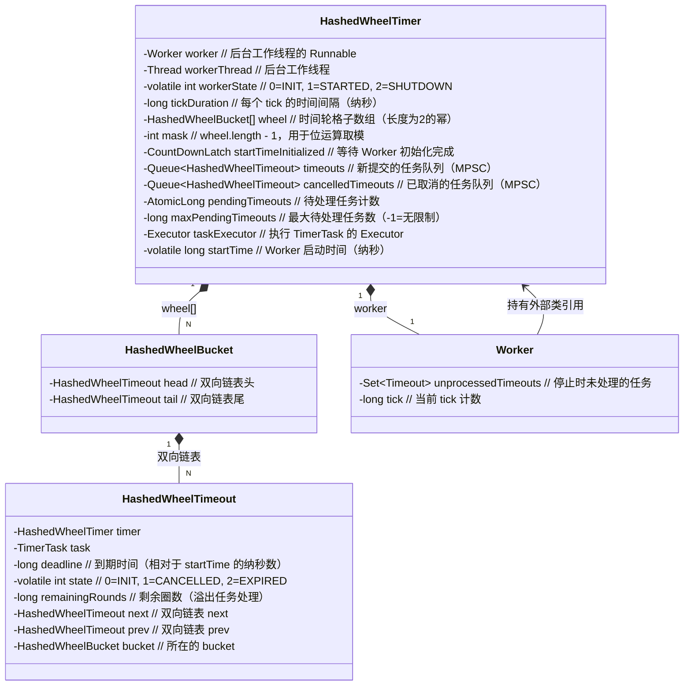
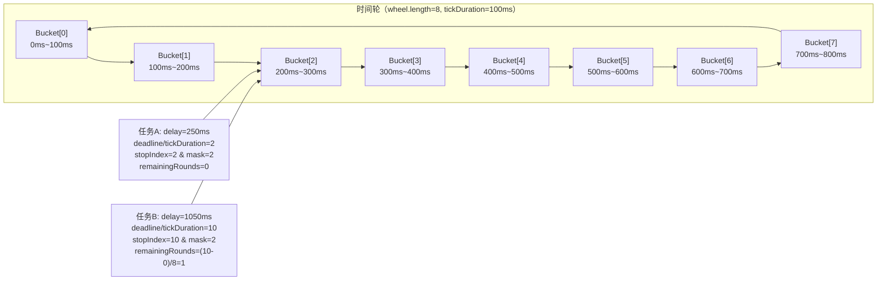
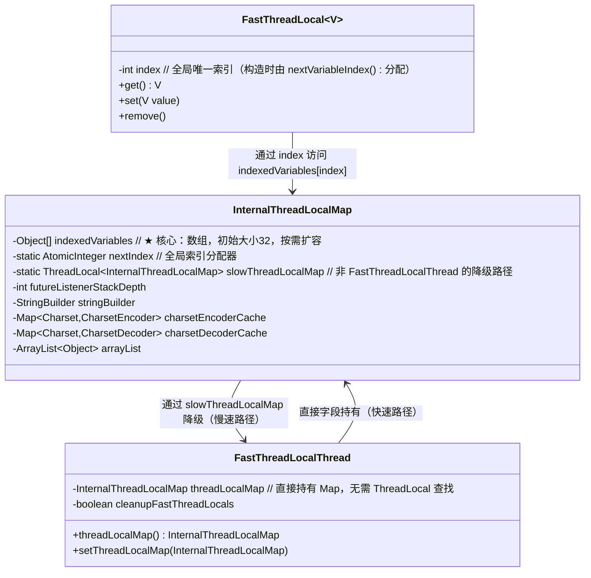
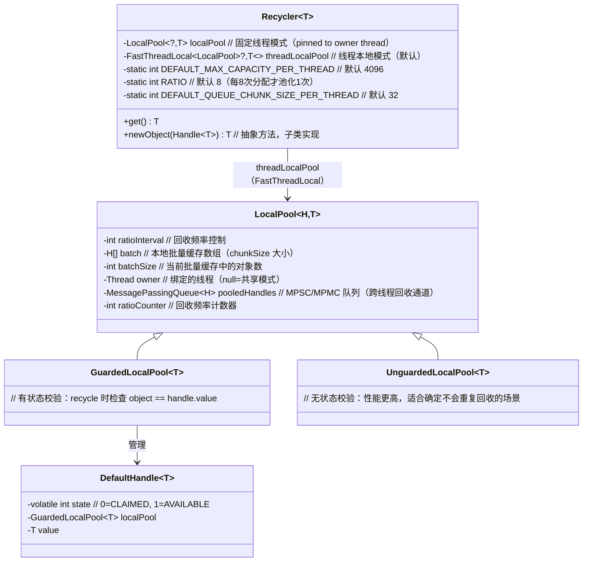
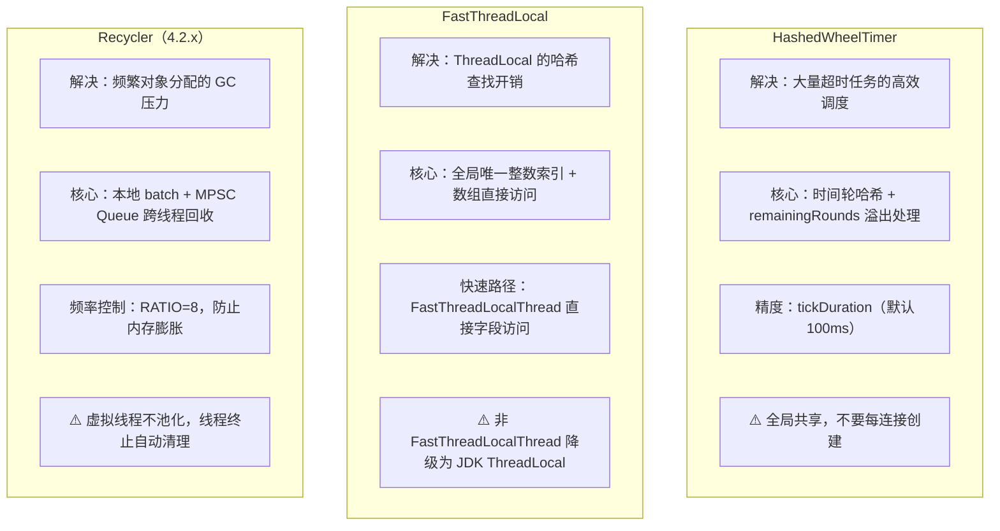

# 16. 并发工具箱：HashedWheelTimer、Recycler、FastThreadLocal

> **核心问题**：Netty 为什么不直接用 JDK 的 `ScheduledExecutorService`、对象池、`ThreadLocal`？这三个工具分别解决了什么 JDK 标准库解决不好的问题？

---

## 一、HashedWheelTimer：时间轮算法

### 1.1 问题推导

**场景**：Netty 需要管理大量连接的超时检测（读超时、写超时、连接超时），每个连接都有一个独立的超时任务。

**JDK `ScheduledExecutorService` 的问题**：
- 底层使用 `DelayQueue`（最小堆），每次插入/删除时间复杂度 O(log N)
- 10 万个连接 = 10 万个堆节点，每次 tick 都要做堆操作
- 精度高但开销大，对于 I/O 超时这种"近似精度"场景过于昂贵

**推导**：I/O 超时不需要精确到毫秒，只需要"大约在 X 秒后触发"。能不能用一个**哈希表**把超时任务按"到期时间槽"分组，每次只检查当前槽，O(1) 定位？

这就是**时间轮（Hashed Wheel Timer）**的核心思想：把时间轴"卷成一个圆"，用哈希函数把任务分配到对应的槽（bucket）。

### 1.2 核心数据结构



<!-- 核对记录：已对照 HashedWheelTimer.java 字段声明（第88-115行）、HashedWheelBucket 内部类、HashedWheelTimeout 内部类、Worker 内部类，差异：无 -->

**关键字段解析**：

| 字段 | 类型 | 含义 |
|------|------|------|
| `wheel` | `HashedWheelBucket[]` | 时间轮格子数组，长度为 2 的幂（由 `MathUtil.findNextPositivePowerOfTwo` 保证） |
| `mask` | `int` | `wheel.length - 1`，用 `tick & mask` 代替 `tick % wheel.length`（位运算更快） |
| `tickDuration` | `long` | 每个 tick 的时间间隔（纳秒），最小 1ms |
| `timeouts` | `Queue<HashedWheelTimeout>` | 新提交任务的暂存队列（MPSC，多生产者单消费者） |
| `remainingRounds` | `long` | 任务还需要转几圈才到期（处理延迟超过一轮的任务） |

### 1.3 时间轮工作原理



**任务分配算法**（`transferTimeoutsToBuckets`）：

```java
// Worker.transferTimeoutsToBuckets() — 每 tick 最多处理 100000 个新任务
private void transferTimeoutsToBuckets() {
    for (int i = 0; i < 100000; i++) {
        HashedWheelTimeout timeout = timeouts.poll();
        if (timeout == null) {
            break;
        }
        if (timeout.state() == HashedWheelTimeout.ST_CANCELLED) {
            continue;
        }

        long calculated = timeout.deadline / tickDuration;
        timeout.remainingRounds = (calculated - tick) / wheel.length;

        final long ticks = Math.max(calculated, tick); // 防止调度到过去的 tick
        int stopIndex = (int) (ticks & mask);

        HashedWheelBucket bucket = wheel[stopIndex];
        bucket.addTimeout(timeout);
    }
}
```

<!-- 核对记录：已对照 HashedWheelTimer.java Worker.transferTimeoutsToBuckets() 方法（第476-503行），差异：无 -->

**关键公式**：
- `calculated = deadline / tickDuration`：任务应该在第几个 tick 触发
- `remainingRounds = (calculated - tick) / wheel.length`：还需要转几圈
- `stopIndex = ticks & mask`：落在哪个 bucket（位运算取模）

### 1.4 Worker 主循环

```java
// Worker.run() — 时间轮的核心驱动循环
public void run() {
    startTime = System.nanoTime();
    if (startTime == 0) {
        startTime = 1;  // 0 是未初始化标志，避免歧义
    }
    startTimeInitialized.countDown();  // 通知 start() 方法初始化完成

    do {
        final long deadline = waitForNextTick();  // 睡眠到下一个 tick
        if (deadline > 0) {
            int idx = (int) (tick & mask);        // 当前 tick 对应的 bucket 索引
            processCancelledTasks();               // 处理取消队列
            HashedWheelBucket bucket = wheel[idx];
            transferTimeoutsToBuckets();           // 把新任务分配到 bucket
            bucket.expireTimeouts(deadline);       // 触发当前 bucket 中到期的任务
            tick++;
        }
    } while (WORKER_STATE_UPDATER.get(HashedWheelTimer.this) == WORKER_STATE_STARTED);
    // ... 停止时清理未处理任务
}
```

<!-- 核对记录：已对照 HashedWheelTimer.java Worker.run() 方法（第432-465行），差异：无 -->

### 1.5 expireTimeouts：触发到期任务

```java
// HashedWheelBucket.expireTimeouts(long deadline)
public void expireTimeouts(long deadline) {
    HashedWheelTimeout timeout = head;
    while (timeout != null) {
        HashedWheelTimeout next = timeout.next;
        if (timeout.remainingRounds <= 0) {
            // 圈数耗尽，检查是否真的到期
            if (timeout.deadline <= deadline) {
                timeout.expire();  // 触发任务
            } else {
                // 不应该发生：任务被放到了错误的 slot
                throw new IllegalStateException(String.format(
                        "timeout.deadline (%d) > deadline (%d)", timeout.deadline, deadline));
            }
        } else if (!timeout.isCancelled()) {
            timeout.remainingRounds--;  // 圈数减一，等待下一圈
        }
        timeout = next;
    }
}
```

<!-- 核对记录：已对照 HashedWheelTimer.java HashedWheelBucket.expireTimeouts() 方法（第726-748行），差异：无 -->

### 1.6 newTimeout：提交任务

```java
@Override
public Timeout newTimeout(TimerTask task, long delay, TimeUnit unit) {
    checkNotNull(task, "task");
    checkNotNull(unit, "unit");

    long pendingTimeoutsCount = pendingTimeouts.incrementAndGet();
    if (maxPendingTimeouts > 0 && pendingTimeoutsCount > maxPendingTimeouts) {
        pendingTimeouts.decrementAndGet();
        throw new RejectedExecutionException("Number of pending timeouts ("
            + pendingTimeoutsCount + ") is greater than or equal to maximum allowed pending "
            + "timeouts (" + maxPendingTimeouts + ")");
    }

    start();  // 懒启动：第一次 newTimeout 时才启动 Worker 线程

    // deadline = 相对于 startTime 的纳秒数
    long deadline = System.nanoTime() + unit.toNanos(delay) - startTime;

    // 防止溢出：delay > 0 但 deadline 溢出为负数时，设为 Long.MAX_VALUE
    if (delay > 0 && deadline < 0) {
        deadline = Long.MAX_VALUE;
    }
    HashedWheelTimeout timeout = new HashedWheelTimeout(this, task, deadline);
    timeouts.add(timeout);  // 加入 MPSC 队列，由 Worker 线程在下一个 tick 处理
    return timeout;
}
```

<!-- 核对记录：已对照 HashedWheelTimer.java newTimeout() 方法（第337-363行），差异：无 -->

### 1.7 精度分析与生产建议

**精度公式**：最大误差 = `tickDuration`（默认 100ms）

```
任务实际触发时间 ∈ [deadline, deadline + tickDuration]
```

**为什么不用 `ScheduledExecutorService`？**

| 维度 | `ScheduledExecutorService` | `HashedWheelTimer` |
|------|---------------------------|-------------------|
| 数据结构 | 最小堆（DelayQueue） | 哈希数组 + 双向链表 |
| 插入复杂度 | O(log N) | O(1) |
| 触发复杂度 | O(log N) | O(1)（遍历当前 bucket） |
| 精度 | 高（纳秒级） | 低（tickDuration 级） |
| 适用场景 | 少量高精度定时任务 | 大量低精度超时检测 |
| 10万任务内存 | 10万个堆节点 | 分散在 512 个 bucket |

### 1.8 ⚠️ 生产踩坑

```java
// ❌ 错误：每个连接创建一个 HashedWheelTimer
// HashedWheelTimer 每次实例化都会创建一个后台线程！
channel.pipeline().addLast(new IdleStateHandler(
    new HashedWheelTimer(), 60, 0, 0, TimeUnit.SECONDS));

// ✅ 正确：全局共享一个 HashedWheelTimer
private static final HashedWheelTimer TIMER = new HashedWheelTimer();
channel.pipeline().addLast(new IdleStateHandler(TIMER, 60, 0, 0, TimeUnit.SECONDS));
```

源码中有明确的实例数量检测：
```java
// HashedWheelTimer 构造函数末尾
if (INSTANCE_COUNTER.incrementAndGet() > INSTANCE_COUNT_LIMIT &&  // INSTANCE_COUNT_LIMIT = 64
    WARNED_TOO_MANY_INSTANCES.compareAndSet(false, true)) {
    reportTooManyInstances();  // 打印 ERROR 日志警告
}
```

<!-- 核对记录：已对照 HashedWheelTimer.java 构造函数末尾（第296-300行），差异：无 -->

---

## 二、FastThreadLocal：数组替代 HashMap

### 2.1 问题推导

**JDK `ThreadLocal` 的实现**：
- 每个 `Thread` 持有一个 `ThreadLocalMap`（内部是 `Entry[]` 哈希表）
- `get()` 时：计算 `ThreadLocal` 的 `threadLocalHashCode`，做哈希查找（线性探测）
- 哈希冲突时需要线性探测，性能不稳定

**推导**：如果每个 `FastThreadLocal` 在创建时就分配一个**全局唯一的整数索引**，`get()` 时直接用这个索引访问数组，就是 O(1) 的数组随机访问，完全没有哈希计算和冲突处理。

### 2.2 核心数据结构



<!-- 核对记录：已对照 FastThreadLocal.java、FastThreadLocalThread.java、InternalThreadLocalMap.java 字段声明，差异：无 -->

### 2.3 get() 的两条路径

```java
// FastThreadLocal.get()
public final V get() {
    InternalThreadLocalMap threadLocalMap = InternalThreadLocalMap.get();
    Object v = threadLocalMap.indexedVariable(index);  // 直接数组访问：O(1)
    if (v != InternalThreadLocalMap.UNSET) {
        return (V) v;
    }
    return initialize(threadLocalMap);  // 首次访问，调用 initialValue()
}
```

```java
// InternalThreadLocalMap.get() — 两条路径
public static InternalThreadLocalMap get() {
    Thread thread = Thread.currentThread();
    if (thread instanceof FastThreadLocalThread) {
        return fastGet((FastThreadLocalThread) thread);  // ★ 快速路径
    } else {
        return slowGet();  // 降级路径
    }
}

// 快速路径：直接访问 FastThreadLocalThread 的字段
private static InternalThreadLocalMap fastGet(FastThreadLocalThread thread) {
    InternalThreadLocalMap threadLocalMap = thread.threadLocalMap();  // 直接字段访问
    if (threadLocalMap == null) {
        thread.setThreadLocalMap(threadLocalMap = new InternalThreadLocalMap());
    }
    return threadLocalMap;
}

// 慢速路径：通过 JDK ThreadLocal 查找（非 FastThreadLocalThread 时）
private static InternalThreadLocalMap slowGet() {
    InternalThreadLocalMap ret = slowThreadLocalMap.get();  // JDK ThreadLocal.get()
    if (ret == null) {
        ret = new InternalThreadLocalMap();
        slowThreadLocalMap.set(ret);
    }
    return ret;
}
```

<!-- 核对记录：已对照 InternalThreadLocalMap.java get()/fastGet()/slowGet() 方法（第97-120行），差异：无 -->

### 2.4 indexedVariables 数组扩容

```java
// InternalThreadLocalMap.getAndSetIndexedVariable(int index, Object value)
public Object getAndSetIndexedVariable(int index, Object value) {
    Object[] lookup = indexedVariables;
    if (index < lookup.length) {
        Object oldValue = lookup[index];
        lookup[index] = value;
        return oldValue;
    }
    expandIndexedVariableTableAndSet(index, value);  // 需要扩容
    return UNSET;
}

// 扩容策略：找到大于 index 的最小 2 的幂
private void expandIndexedVariableTableAndSet(int index, Object value) {
    Object[] oldArray = indexedVariables;
    final int oldCapacity = oldArray.length;
    int newCapacity;
    if (index < ARRAY_LIST_CAPACITY_EXPAND_THRESHOLD) {  // 1 << 30
        newCapacity = index;
        newCapacity |= newCapacity >>>  1;
        newCapacity |= newCapacity >>>  2;
        newCapacity |= newCapacity >>>  4;
        newCapacity |= newCapacity >>>  8;
        newCapacity |= newCapacity >>> 16;
        newCapacity ++;  // 找到大于 index 的最小 2 的幂
    } else {
        newCapacity = ARRAY_LIST_CAPACITY_MAX_SIZE;  // Integer.MAX_VALUE - 8
    }
    Object[] newArray = Arrays.copyOf(oldArray, newCapacity);
    Arrays.fill(newArray, oldCapacity, newArray.length, UNSET);
    newArray[index] = value;
    indexedVariables = newArray;
}
```

<!-- 核对记录：已对照 InternalThreadLocalMap.java getAndSetIndexedVariable()/expandIndexedVariableTableAndSet() 方法（第296-325行），差异：无 -->

**初始大小**：`INDEXED_VARIABLE_TABLE_INITIAL_SIZE = 32`，初始化时全部填充 `UNSET` 哨兵对象。

### 2.5 FastThreadLocal vs JDK ThreadLocal 性能对比 🔥

| 维度 | JDK `ThreadLocal` | Netty `FastThreadLocal` |
|------|------------------|------------------------|
| 存储结构 | `Entry[]` 哈希表（线性探测） | `Object[]` 数组（直接索引） |
| `get()` 复杂度 | O(1) 均摊，但有哈希计算 + 冲突处理 | O(1)，纯数组访问 |
| 索引分配 | 运行时哈希计算 | 构造时静态分配全局唯一整数 |
| 内存布局 | 哈希表，不连续 | 数组，连续内存，CPU 缓存友好 |
| 线程类型要求 | 任意线程 | 快速路径需要 `FastThreadLocalThread` |
| 清理机制 | 弱引用 GC 回收（可能泄漏） | `FastThreadLocalRunnable` 线程结束时主动 `removeAll()` |

**为什么 Netty 的 EventLoop 线程都是 `FastThreadLocalThread`？**  
`DefaultThreadFactory` 创建的线程默认是 `FastThreadLocalThread`，确保所有 EventLoop 线程都走快速路径，避免哈希查找开销。

### 2.6 ⚠️ 生产踩坑：非 FastThreadLocalThread 的降级

```java
// 如果在普通线程（如业务线程池）中使用 FastThreadLocal，会走慢速路径
// 慢速路径通过 JDK ThreadLocal 存储 InternalThreadLocalMap，性能与 JDK ThreadLocal 相当
// 但不会有 FastThreadLocalThread 的主动清理机制，可能导致内存泄漏！

// ✅ 解决方案：使用 FastThreadLocalThread 包装业务线程
ThreadFactory factory = new DefaultThreadFactory("business-pool");
ExecutorService executor = new ThreadPoolExecutor(
    4, 4, 0, TimeUnit.SECONDS,
    new LinkedBlockingQueue<>(),
    factory  // DefaultThreadFactory 创建 FastThreadLocalThread
);
```

---

## 三、Recycler：对象回收池（4.2.x 新架构）

### 3.1 问题推导

**场景**：Netty 每次 I/O 读写都需要分配 `ByteBuf`、`ChannelOutboundBuffer.Entry` 等对象，频繁分配/GC 会造成 GC 压力。

**传统对象池的问题**：
- 全局锁保护的对象池：高并发下锁竞争严重
- 每线程独立池：跨线程回收（A 线程分配，B 线程释放）需要特殊处理

**推导**：需要一个**每线程本地池**（无锁快速路径）+ **跨线程回收机制**（有锁但低频）。

### 3.2 4.2.x 架构重构：从 Stack+WeakOrderQueue 到 LocalPool+MPSC

> ⚠️ **重要**：Netty 4.2.x 的 `Recycler` 已经完全重构，不再使用旧版的 `Stack + WeakOrderQueue` 设计。如果你看到的资料还在讲 `Stack`，那是 4.1.x 的旧架构。

**4.1.x 旧架构**：每线程一个 `Stack`，跨线程回收通过 `WeakOrderQueue` 链表延迟归还。

**4.2.x 新架构**：每线程一个 `LocalPool`，内部使用 **jctools MPSC/MPMC Queue** 作为跨线程回收通道。



<!-- 核对记录：已对照 Recycler.java 字段声明和内部类定义（第44-730行），差异：无 -->

### 3.3 get() 流程

```java
// Recycler.get()
public final T get() {
    if (localPool != null) {
        return localPool.getWith(this);  // 固定线程模式
    } else {
        if (PlatformDependent.isVirtualThread(Thread.currentThread()) &&
            !FastThreadLocalThread.currentThreadHasFastThreadLocal()) {
            return newObject((Handle<T>) NOOP_HANDLE);  // 虚拟线程：不池化
        }
        return threadLocalPool.get().getWith(this);  // 线程本地模式（默认）
    }
}

// GuardedLocalPool.getWith(Recycler<T> recycler)
public T getWith(Recycler<T> recycler) {
    DefaultHandle<T> handle = acquire();  // 从本地 batch 或 MPSC 队列取
    T obj;
    if (handle == null) {
        handle = canAllocatePooled()? new DefaultHandle<>(this) : null;
        if (handle != null) {
            obj = recycler.newObject(handle);  // 创建新对象
            handle.set(obj);
        } else {
            obj = recycler.newObject((Handle<T>) NOOP_HANDLE);  // 不池化
        }
    } else {
        obj = handle.claim();  // 从池中取出，标记为 CLAIMED
    }
    return obj;
}
```

<!-- 核对记录：已对照 Recycler.java get() 方法（第270-283行）和 GuardedLocalPool.getWith() 方法（第393-411行），差异：无 -->

### 3.4 acquire() 和 release()：本地 batch + MPSC 队列

```java
// LocalPool.acquire() — 先从本地 batch 取，再从 MPSC 队列取
protected final H acquire() {
    int size = batchSize;
    if (size == 0) {
        // 本地 batch 为空，从 MPSC 队列取
        final MessagePassingQueue<H> handles = pooledHandles;
        if (handles == null) {
            return null;
        }
        return handles.relaxedPoll();  // 无锁 poll
    }
    int top = size - 1;
    final H h = batch[top];
    batchSize = top;
    batch[top] = null;
    return h;
}

// LocalPool.release() — 同线程放入 batch，跨线程放入 MPSC 队列
protected final void release(H handle) {
    Thread owner = this.owner;
    if (owner != null && Thread.currentThread() == owner && batchSize < batch.length) {
        // 同线程：放入本地 batch（无锁，最快路径）
        batch[batchSize] = handle;
        batchSize++;
    } else if (owner != null && isTerminated(owner)) {
        // owner 线程已终止：丢弃，防止内存泄漏
        pooledHandles = null;
        this.owner = null;
    } else {
        // 跨线程：放入 MPSC 队列（无锁，jctools 实现）
        MessagePassingQueue<H> handles = pooledHandles;
        if (handles != null) {
            handles.relaxedOffer(handle);
        }
    }
}
```

<!-- 核对记录：已对照 Recycler.java LocalPool.acquire()/release() 方法（第490-530行），差异：无 -->

### 3.5 canAllocatePooled()：回收频率控制

```java
// LocalPool.canAllocatePooled() — 控制池化频率，防止内存膨胀
boolean canAllocatePooled() {
    if (ratioInterval < 0) {
        return false;  // 禁用池化
    }
    if (ratioInterval == 0) {
        return true;   // 总是池化
    }
    if (++ratioCounter >= ratioInterval) {
        ratioCounter = 0;
        return true;   // 每 ratioInterval 次分配才池化一次
    }
    return false;
}
```

<!-- 核对记录：已对照 Recycler.java LocalPool.canAllocatePooled() 方法（第535-546行），差异：无 -->

**默认 `RATIO = 8`**：每 8 次 `get()` 调用，只有 1 次会创建可池化的对象（`DefaultHandle`），其余 7 次创建的对象使用 `NOOP_HANDLE`，不会被回收到池中。这防止了池容量无限膨胀。

### 3.6 4.2.x vs 4.1.x 架构对比 🔥

| 维度 | 4.1.x（Stack + WeakOrderQueue） | 4.2.x（LocalPool + MPSC Queue） |
|------|--------------------------------|--------------------------------|
| 本地存储 | `Stack<DefaultHandle>`（数组） | `H[] batch`（小数组）+ `MessagePassingQueue` |
| 跨线程回收 | `WeakOrderQueue` 链表（延迟归还） | jctools MPSC/MPMC Queue（直接入队） |
| 内存模型 | 每线程一个大 Stack | 每线程一个小 batch + 共享 MPSC Queue |
| 虚拟线程支持 | 不支持 | 支持（虚拟线程走 NOOP_HANDLE 不池化） |
| 线程终止处理 | 弱引用 GC 回收 | `isTerminated()` 检测后主动丢弃 |
| 代码复杂度 | 高（WeakOrderQueue 链表管理复杂） | 低（委托给 jctools 队列） |

### 3.7 使用示例

```java
// 自定义对象池
public class MyObjectPool extends Recycler<MyObject> {
    @Override
    protected MyObject newObject(Handle<MyObject> handle) {
        return new MyObject(handle);
    }
}

public class MyObject {
    private final Recycler.Handle<MyObject> handle;

    MyObject(Recycler.Handle<MyObject> handle) {
        this.handle = handle;
    }

    public void recycle() {
        handle.recycle(this);  // 归还到池
    }
}

// 使用
private static final MyObjectPool POOL = new MyObjectPool();

MyObject obj = POOL.get();
try {
    // 使用 obj
} finally {
    obj.recycle();  // 归还
}
```

### 3.8 ⚠️ 生产踩坑

```java
// ❌ 错误：重复回收（GuardedLocalPool 会抛异常）
obj.recycle();
obj.recycle();  // IllegalStateException: Object has been recycled already.

// ❌ 错误：回收后继续使用（use-after-recycle）
obj.recycle();
obj.doSomething();  // 对象可能已被其他线程取走并修改！

// ⚠️ 注意：maxCapacityPerThread 默认 4096，超过后新对象不会被池化
// 如果业务对象很大，要适当减小 maxCapacityPerThread 防止内存膨胀
```

---

## 四、三大工具对比总结



| 工具 | 解决的问题 | 核心数据结构 | JDK 替代方案 | 为什么不用 JDK |
|------|-----------|------------|------------|--------------|
| `HashedWheelTimer` | 大量超时任务调度 | 哈希数组 + 双向链表 | `ScheduledExecutorService` | 最小堆 O(log N) 开销太大 |
| `FastThreadLocal` | ThreadLocal 查找开销 | `Object[]` 数组 | `ThreadLocal` | 哈希计算 + 冲突处理 |
| `Recycler` | 频繁对象分配 GC 压力 | batch + MPSC Queue | 无标准对象池 | JDK 无内置对象池 |

---

## 五、核心不变式

1. **HashedWheelTimer 时间单调不变式**：`tick` 只增不减，`deadline = System.nanoTime() + delay - startTime` 是相对于 `startTime` 的纳秒偏移，保证时间轮的 bucket 分配始终正确。

2. **FastThreadLocal 索引唯一不变式**：`InternalThreadLocalMap.nextIndex` 是全局单调递增的 `AtomicInteger`，每个 `FastThreadLocal` 实例的 `index` 全局唯一，保证不同 `FastThreadLocal` 不会访问同一个数组槽。

3. **Recycler 状态不变式**：`DefaultHandle.state` 只能从 `STATE_CLAIMED(0)` → `STATE_AVAILABLE(1)`，`recycle()` 时检测到 `STATE_AVAILABLE` 会抛 `IllegalStateException`，防止重复回收。

---

## 六、面试高频问答 🔥

**Q1：HashedWheelTimer 的精度由什么决定？为什么不用 `ScheduledExecutorService`？**

**A**：精度由 `tickDuration` 决定（默认 100ms），最大误差 = `tickDuration`。不用 `ScheduledExecutorService` 的原因：后者底层是 `DelayQueue`（最小堆），插入/删除 O(log N)，10 万个超时任务会有大量堆操作。`HashedWheelTimer` 用哈希数组，插入 O(1)，触发时只遍历当前 bucket，适合大量低精度超时检测场景（如 I/O 超时）。

**Q2：HashedWheelTimer 如何处理延迟超过一轮的任务（溢出任务）？**

**A**：通过 `remainingRounds` 字段。`transferTimeoutsToBuckets()` 计算 `remainingRounds = (calculated - tick) / wheel.length`，任务被放入对应 bucket 后，每次 `expireTimeouts()` 时先检查 `remainingRounds`，如果 > 0 则减一，等待下一圈；只有 `remainingRounds <= 0` 时才真正触发。

**Q3：FastThreadLocal 为什么比 JDK ThreadLocal 快？**

**A**：两个层面的优化：
1. **存储结构**：JDK `ThreadLocal` 用 `Entry[]` 哈希表（线性探测），`FastThreadLocal` 用 `Object[]` 数组（直接索引），数组访问无哈希计算和冲突处理。
2. **Map 获取**：JDK `ThreadLocal.get()` 需要先获取当前线程的 `ThreadLocalMap`（通过 `Thread.threadLocals` 字段）；`FastThreadLocal` 在 `FastThreadLocalThread` 上直接访问 `threadLocalMap` 字段，少一次间接访问。

**Q4：Netty 4.2.x 的 Recycler 和 4.1.x 有什么区别？**

**A**：4.1.x 使用 `Stack + WeakOrderQueue` 设计：每线程一个 `Stack`，跨线程回收通过 `WeakOrderQueue` 链表延迟归还，实现复杂。4.2.x 重构为 `LocalPool + MPSC/MPMC Queue`：本地用小数组 `batch` 缓存，跨线程回收直接通过 jctools 的无锁队列，代码更简洁，同时支持虚拟线程（虚拟线程走 `NOOP_HANDLE` 不池化）。

**Q5：Recycler 的 RATIO 参数是什么？为什么需要它？**

**A**：`RATIO`（默认 8）控制池化频率：每 `RATIO` 次 `get()` 调用，只有 1 次会创建可池化的对象（`DefaultHandle`），其余创建的对象使用 `NOOP_HANDLE`，不会被回收到池中。这防止了池容量无限膨胀——如果每次分配的对象都被池化，在高并发场景下池会迅速膨胀到 `maxCapacityPerThread`（默认 4096），占用大量内存。

**Q6：FastThreadLocal 在非 FastThreadLocalThread 中使用会怎样？**

**A**：会走慢速路径（`slowGet()`），通过 JDK `ThreadLocal` 存储 `InternalThreadLocalMap`，性能与 JDK `ThreadLocal` 相当，失去了数组直接访问的优势。此外，非 `FastThreadLocalThread` 没有 `FastThreadLocalRunnable` 的自动清理机制，线程结束时 `FastThreadLocal` 变量不会被主动清理，可能导致内存泄漏（依赖 JDK `ThreadLocal` 的弱引用 GC 回收）。
