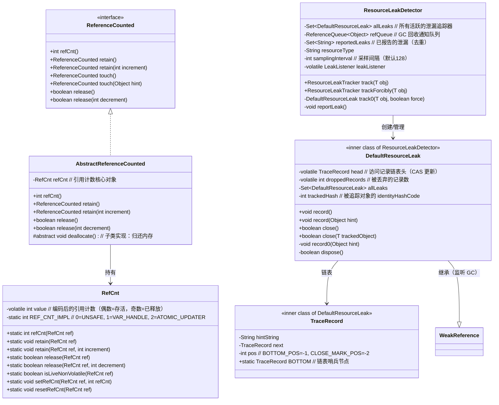
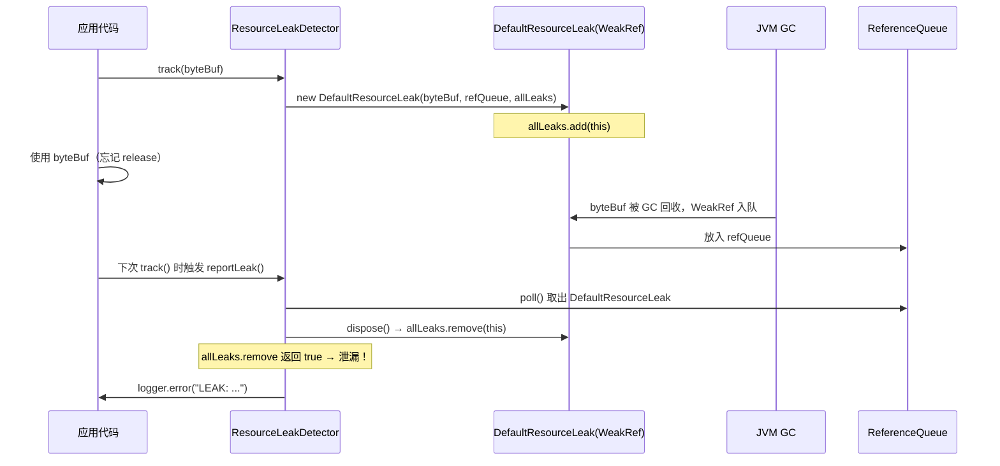
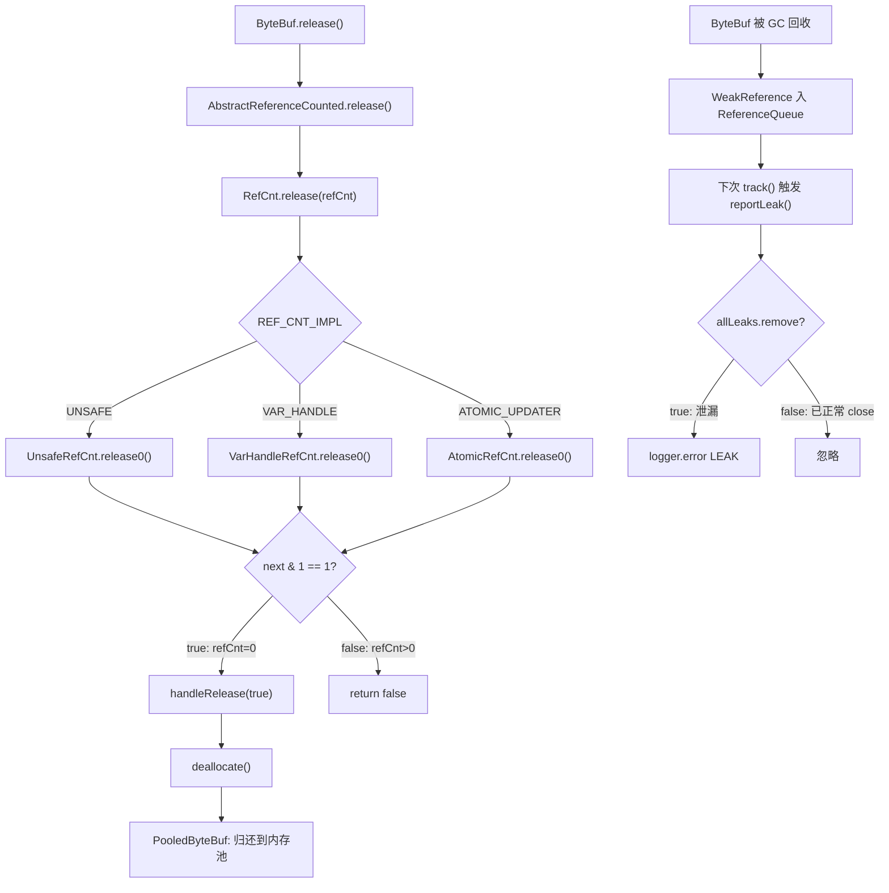

# 第18章：引用计数与平台适配层

> **本章要回答的问题**
> 1. Netty 为什么要自己实现引用计数，而不用 JVM GC？
> 2. `RefCnt` 的 CAS 实现为什么有三条路径（Unsafe / VarHandle / AtomicUpdater）？
> 3. `value` 字段为什么用偶数表示存活、奇数表示已释放？
> 4. `ResourceLeakDetector` 的四个等级如何工作？采样机制是什么？
> 5. `PlatformDependent` 如何选择 MPSC 队列实现？jctools vs JDK 的差异？
> 6. Unsafe 在 Netty 中有哪些关键用途？

---


> 📦 **可运行 Demo**：[Ch17_RefCountDemo.java](./Ch17_RefCountDemo.java) —— 引用计数机制验证，直接运行 `main` 方法即可。

## 1. 问题驱动：为什么需要引用计数？

### 1.1 JVM GC 的局限性

```
场景：一个 ByteBuf 在 Pipeline 中被多个 Handler 传递
Handler1 → Handler2 → Handler3 → ... → 最终写出
```

**问题**：
- **堆外内存（Direct Memory）不受 GC 管理**：`ByteBuffer.allocateDirect()` 分配的内存在 JVM 堆外，GC 无法直接回收，只能靠 `Cleaner`（PhantomReference）触发，但触发时机不可控。
- **GC 延迟不可预测**：高吞吐场景下，ByteBuf 对象可能在 Full GC 前积累大量堆外内存，导致 OOM。
- **池化内存无法 GC 回收**：`PooledByteBufAllocator` 分配的内存来自预分配的 Chunk，GC 只能回收 Java 对象壳，无法把内存还给池子。

**解决方案**：引用计数（Reference Counting）——**谁用谁负责，用完立刻归还**。

### 1.2 引用计数的核心契约

```
初始 refCnt = 1
retain()  → refCnt++
release() → refCnt--，当 refCnt == 0 时触发 deallocate()
```

**不变式（Invariant）**：
1. `refCnt > 0` 时对象存活，可以安全访问。
2. `refCnt == 0` 时对象已释放，任何访问都会抛 `IllegalReferenceCountException`。
3. `retain()` 和 `release()` 必须成对出现，多一次 `release()` 会抛异常。

---

## 2. 数据结构全景图




---

## 3. RefCnt：三条路径的 CAS 实现

### 3.1 问题推导：为什么需要三条路径？

| 路径 | 条件 | 优势 |
|------|------|------|
| **Unsafe** | `PlatformDependent.hasUnsafe()` | 最快，直接操作内存偏移量，无反射开销 |
| **VarHandle** | `!hasUnsafe() && hasVarHandle()` | Java 9+ 标准 API，比 Unsafe 安全，性能接近 |
| **AtomicUpdater** | 兜底 | 纯 Java，跨平台，性能略低 |

**选择逻辑**（源码 `RefCnt` 静态初始化块）：

```java
static {
    if (PlatformDependent.hasUnsafe()) {
        REF_CNT_IMPL = UNSAFE;
    } else if (PlatformDependent.hasVarHandle()) {
        REF_CNT_IMPL = VAR_HANDLE;
    } else {
        REF_CNT_IMPL = ATOMIC_UPDATER;
    }
}
```


### 3.2 核心编码技巧：偶数=存活，奇数=已释放 🔥

这是 `RefCnt` 最精妙的设计。`value` 字段存储的**不是真实引用计数**，而是编码后的值：

```
真实 refCnt = value >>> 1   （右移1位）
value 为偶数 → 对象存活（真实 refCnt = value/2）
value 为奇数 → 对象已释放（真实 refCnt = 0）
```

**为什么这样设计？**

用奇偶位作为"已释放"标志，可以在一次 CAS 操作中同时完成"减计数"和"标记已释放"，避免两步操作的竞态条件。

**初始化**：`value = 2`（真实 refCnt = 1）

```java
// AtomicRefCnt.init()
static void init(RefCnt instance) {
    UPDATER.set(instance, 2);
}
```

**读取真实 refCnt**：

```java
// AtomicRefCnt.refCnt()
static int refCnt(RefCnt instance) {
    return UPDATER.get(instance) >>> 1;
}
```


### 3.3 retain() 实现：getAndAdd + 溢出检测

```java
// AtomicRefCnt.retain0()
private static void retain0(RefCnt instance, int increment) {
    // oldRef & 0x80000001 stands for oldRef < 0 || oldRef is odd
    int oldRef = UPDATER.getAndAdd(instance, increment);
    if ((oldRef & 0x80000001) != 0 || oldRef > Integer.MAX_VALUE - increment) {
        UPDATER.getAndAdd(instance, -increment);
        throw new IllegalReferenceCountException(0, increment >>> 1);
    }
}
```

**关键点**：
- `retain()` 传入的 `increment` 是 `2`（真实+1 → 编码+2）
- `retain(int n)` 传入的是 `n << 1`
- `(oldRef & 0x80000001) != 0`：检测 `oldRef < 0`（符号位）或 `oldRef` 为奇数（已释放）
- 溢出检测：`oldRef > Integer.MAX_VALUE - increment`
- 检测到异常后**先回滚**（`getAndAdd(-increment)`），再抛异常


### 3.4 release() 实现：CAS 自旋 + 奇数标记

```java
// AtomicRefCnt.release0()
private static boolean release0(RefCnt instance, int decrement) {
    int curr, next;
    do {
        curr = instance.value;
        if (curr == decrement) {
            next = 1;   // 最后一次释放：设为奇数1，标记已释放
        } else {
            if (curr < decrement || (curr & 1) == 1) {
                throwIllegalRefCountOnRelease(decrement, curr);
            }
            next = curr - decrement;
        }
    } while (!UPDATER.compareAndSet(instance, curr, next));
    return (next & 1) == 1;  // 返回 true 表示已释放（next 为奇数）
}
```

**关键点**：
- `release()` 传入 `decrement = 2`（真实-1 → 编码-2）
- 当 `curr == decrement` 时（最后一次释放），`next = 1`（奇数，标记已释放）
- `curr < decrement`：释放过多，抛异常
- `(curr & 1) == 1`：已经是奇数（已释放），重复释放，抛异常
- 返回 `(next & 1) == 1`：`true` 表示触发 `deallocate()`


### 3.5 三条路径的差异对比

| 方法 | Unsafe | VarHandle | AtomicUpdater |
|------|--------|-----------|---------------|
| `init` | `safeConstructPutInt(instance, VALUE_OFFSET, 2)` | `VH.set(instance, 2)` + `storeStoreFence()` | `UPDATER.set(instance, 2)` |
| `refCnt` | `getVolatileInt(instance, VALUE_OFFSET) >>> 1` | `(int) VH.getAcquire(instance) >>> 1` | `UPDATER.get(instance) >>> 1` |
| `retain0` | `getAndAddInt(instance, VALUE_OFFSET, increment)` | `(int) VH.getAndAdd(instance, increment)` | `UPDATER.getAndAdd(instance, increment)` |
| `setRefCnt` | `putOrderedInt(instance, VALUE_OFFSET, rawRefCnt)` | `VH.setRelease(instance, rawRefCnt)` | `UPDATER.lazySet(instance, rawRefCnt)` |
| `resetRefCnt` | `putOrderedInt(instance, VALUE_OFFSET, 2)` | `VH.setRelease(instance, 2)` | `UPDATER.lazySet(instance, 2)` |

**内存语义差异**：
- `setRefCnt` / `resetRefCnt` 使用 **release 语义**（`putOrderedInt` / `lazySet` / `setRelease`），不是 volatile write，性能更好，适用于"静默状态"下的重置。
- `refCnt()` 使用 **acquire 语义**（`getVolatileInt` / `getAcquire` / `get`），保证读到最新值。


---

## 4. AbstractReferenceCounted：委托模式

```java
public abstract class AbstractReferenceCounted implements ReferenceCounted {

    private final RefCnt refCnt = new RefCnt();

    @Override
    public int refCnt() {
        return RefCnt.refCnt(refCnt);
    }

    /**
     * An unsafe operation intended for use by a subclass that sets the reference count of the object directly
     */
    protected void setRefCnt(int refCnt) {
        RefCnt.setRefCnt(this.refCnt, refCnt);
    }

    @Override
    public ReferenceCounted retain() {
        RefCnt.retain(refCnt);
        return this;
    }

    @Override
    public ReferenceCounted retain(int increment) {
        RefCnt.retain(refCnt, increment);
        return this;
    }

    @Override
    public boolean release() {
        return handleRelease(RefCnt.release(refCnt));
    }

    @Override
    public boolean release(int decrement) {
        return handleRelease(RefCnt.release(refCnt, decrement));
    }

    private boolean handleRelease(boolean result) {
        if (result) {
            deallocate();
        }
        return result;
    }

    protected abstract void deallocate();
}
```

**设计要点**：
- `AbstractReferenceCounted` 只是一个**委托层**，所有 CAS 逻辑都在 `RefCnt` 中。
- `deallocate()` 是模板方法，子类（如 `PooledByteBuf`）实现具体的内存归还逻辑。
- `touch()` 方法留给子类实现（与 `ResourceLeakDetector` 配合）。


---

## 5. ResourceLeakDetector：内存泄漏检测器

### 5.1 问题推导：如何检测"忘记 release()"？

**核心思路**：利用 JVM 的 **WeakReference + ReferenceQueue** 机制：
1. 当 ByteBuf 被 GC 回收时，其对应的 `WeakReference` 会被放入 `ReferenceQueue`。
2. 如果此时 `allLeaks` 集合中还有这个 ByteBuf 的追踪器（说明 `close()` 没被调用），就说明发生了泄漏。




### 5.2 四个检测等级 🔥

```java
public enum Level {
    DISABLED,   // 完全关闭，零开销
    SIMPLE,     // 默认：采样检测，只报告"有泄漏"，不记录访问路径
    ADVANCED,   // 采样检测，记录最近访问路径（需调用 touch()）
    PARANOID    // 每次分配都追踪，记录完整访问路径（仅测试用）
}
```

**采样机制**（`track0()` 方法）：

```java
private DefaultResourceLeak<T> track0(T obj, boolean force) {
    Level level = ResourceLeakDetector.level;
    if (force ||
            level == Level.PARANOID ||
            (level != Level.DISABLED && ThreadLocalRandom.current().nextInt(samplingInterval) == 0)) {
        reportLeak();
        return new DefaultResourceLeak<>(obj, refQueue, allLeaks, getInitialHint(resourceType));
    }
    return null;
}
```

**关键点**：
- `PARANOID`：每次都追踪（`force=false` 时也走追踪路径）。
- `SIMPLE` / `ADVANCED`：以 `1/samplingInterval`（默认 `1/128`）的概率追踪。
- `DISABLED`：`level != Level.DISABLED` 为 false，直接返回 `null`。
- 每次追踪前先调用 `reportLeak()` 检查上一批泄漏。


### 5.3 record0()：指数退避的访问记录

```java
private void record0(Object hint) {
    if (TARGET_RECORDS > 0) {
        TraceRecord oldHead;
        TraceRecord prevHead;
        TraceRecord newHead;
        boolean dropped;
        do {
            if ((prevHead = oldHead = headUpdater.get(this)) == null ||
                    oldHead.pos == TraceRecord.CLOSE_MARK_POS) {
                // already closed.
                return;
            }
            final int numElements = oldHead.pos + 1;
            if (numElements >= TARGET_RECORDS) {
                final int backOffFactor = Math.min(numElements - TARGET_RECORDS, 30);
                dropped = ThreadLocalRandom.current().nextInt(1 << backOffFactor) != 0;
                if (dropped) {
                    prevHead = oldHead.next;
                }
            } else {
                dropped = false;
            }
            newHead = hint != null ? new TraceRecord(prevHead, hint) : new TraceRecord(prevHead);
        } while (!headUpdater.compareAndSet(this, oldHead, newHead));
        if (dropped) {
            droppedRecordsUpdater.incrementAndGet(this);
        }
    }
}
```

**指数退避算法**：
- 当记录数 `numElements < TARGET_RECORDS`（默认4）时，每次都记录。
- 当记录数 ≥ `TARGET_RECORDS` 时，以 `1 / 2^backOffFactor` 的概率保留当前记录（`backOffFactor` 最大30）。
- 这保证了：**最新的访问总是被记录**（因为 CAS 替换的是旧 head，而不是新 head）。


### 5.4 DefaultResourceLeak 字段声明

```java
private static final class DefaultResourceLeak<T>
        extends WeakReference<Object> implements ResourceLeakTracker<T>, ResourceLeak {

    private static final AtomicReferenceFieldUpdater<DefaultResourceLeak<?>, TraceRecord> headUpdater = ...;
    private static final AtomicIntegerFieldUpdater<DefaultResourceLeak<?>> droppedRecordsUpdater = ...;

    @SuppressWarnings("unused")
    private volatile TraceRecord head;
    @SuppressWarnings("unused")
    private volatile int droppedRecords;

    private final Set<DefaultResourceLeak<?>> allLeaks;
    private final int trackedHash;
    ...
}
```


### 5.5 生产建议 ⚠️

| 环境 | 推荐等级 | 原因 |
|------|---------|------|
| 生产环境 | `SIMPLE`（默认） | 1/128 采样，开销极小 |
| 压测/预发 | `ADVANCED` | 能定位泄漏位置，开销可接受 |
| 单元测试 | `PARANOID` | 100% 检测，确保无泄漏 |
| 极致性能场景 | `DISABLED` | 零开销，但失去保护 |

**设置方式**：
```bash
# JVM 参数
-Dio.netty.leakDetection.level=advanced
# 代码设置
ResourceLeakDetector.setLevel(ResourceLeakDetector.Level.ADVANCED);
```

---

## 6. PlatformDependent：平台适配层

### 6.1 问题推导：为什么需要平台适配层？

Netty 需要在不同 JVM 版本、不同操作系统、不同硬件架构上运行，但底层能力差异巨大：

| 能力 | Java 8 | Java 9+ | GraalVM Native |
|------|--------|---------|----------------|
| `sun.misc.Unsafe` | ✅ | ⚠️ 警告 | ❌ 不可用 |
| `VarHandle` | ❌ | ✅ | ✅ |
| `AtomicFieldUpdater` | ✅ | ✅ | ✅ |
| Direct Memory 无 Cleaner | ✅ | ⚠️ | ❌ |

`PlatformDependent` 的职责：**在运行时检测平台能力，选择最优实现**。

### 6.2 核心字段（静态初始化）

```java
public final class PlatformDependent {
    private static final Throwable UNSAFE_UNAVAILABILITY_CAUSE = unsafeUnavailabilityCause0();
    private static final boolean DIRECT_BUFFER_PREFERRED;
    private static final boolean EXPLICIT_NO_PREFER_DIRECT;
    private static final long MAX_DIRECT_MEMORY = estimateMaxDirectMemory();

    private static final int MPSC_CHUNK_SIZE =  1024;
    private static final int MIN_MAX_MPSC_CAPACITY =  MPSC_CHUNK_SIZE * 2;
    private static final int MAX_ALLOWED_MPSC_CAPACITY = Pow2.MAX_POW2;

    // ... BYTE_ARRAY_BASE_OFFSET / TMPDIR / BIT_MODE / NORMALIZED_ARCH / NORMALIZED_OS /
    // ... LINUX_OS_CLASSIFIERS / IS_WINDOWS / IS_OSX / IS_J9_JVM / IS_IVKVM_DOT_NET / ADDRESS_SIZE ...

    private static final boolean USE_DIRECT_BUFFER_NO_CLEANER;
    private static final AtomicLong DIRECT_MEMORY_COUNTER;
    private static final long DIRECT_MEMORY_LIMIT;
    private static final Cleaner CLEANER;
    private static final Cleaner DIRECT_CLEANER;
    private static final Cleaner LEGACY_CLEANER;

    private static final boolean JFR;
    private static final boolean VAR_HANDLE;
    ...
}
```


### 6.3 hasUnsafe() 与 hasVarHandle()

```java
// hasUnsafe()：UNSAFE_UNAVAILABILITY_CAUSE 为 null 表示 Unsafe 可用
public static boolean hasUnsafe() {
    return UNSAFE_UNAVAILABILITY_CAUSE == null;
}

// hasVarHandle()：VAR_HANDLE 静态字段
public static boolean hasVarHandle() {
    return VAR_HANDLE;
}
```

**`VAR_HANDLE` 的初始化逻辑**（`initializeVarHandle()`）：
```java
private static boolean initializeVarHandle() {
    if (UNSAFE_UNAVAILABILITY_CAUSE == null || javaVersion() < 9 ||
            PlatformDependent0.isNativeImage()) {
        return false;
    }
    // ... 检测 VarHandle 是否可用
    boolean varHandleEnabled = varHandleAvailable &&
            SystemPropertyUtil.getBoolean("io.netty.varHandle.enabled", varHandleAvailable);
    return varHandleEnabled;
}
```

**关键逻辑**：
- 如果 Unsafe 可用（`UNSAFE_UNAVAILABILITY_CAUSE == null`），**直接返回 false**，不启用 VarHandle。
- 即：**Unsafe 优先于 VarHandle**，VarHandle 只在 Unsafe 不可用时才启用。
- GraalVM Native Image 下两者都不可用，回退到 `AtomicUpdater`。


### 6.4 MPSC 队列选型：jctools vs JDK 🔥

**为什么不用 JDK 的 `ConcurrentLinkedQueue`？**

| 特性 | `ConcurrentLinkedQueue` | jctools `MpscUnboundedArrayQueue` |
|------|------------------------|----------------------------------|
| 算法 | Michael-Scott 无锁链表 | 数组环形缓冲区 |
| 内存分配 | 每次入队分配 Node 对象 | 预分配数组，chunk 扩容 |
| GC 压力 | 高（大量短命 Node） | 低（数组复用） |
| Cache 友好性 | 差（链表指针跳跃） | 好（数组连续内存） |
| 伪共享 | 无保护 | Padding 消除伪共享 |
| 适用场景 | 通用 | MPSC（多生产者单消费者） |

**`newMpscQueue()` 实现**：

```java
// PlatformDependent.Mpsc 内部类（方法顺序与源码一致）
static <T> Queue<T> newMpscQueue(final int maxCapacity) {
    // maxCapacity 不能超过 MAX_ALLOWED_MPSC_CAPACITY，也不能小于 MIN_MAX_MPSC_CAPACITY
    final int capacity = max(min(maxCapacity, MAX_ALLOWED_MPSC_CAPACITY), MIN_MAX_MPSC_CAPACITY);
    return newChunkedMpscQueue(MPSC_CHUNK_SIZE, capacity);
}

static <T> Queue<T> newChunkedMpscQueue(final int chunkSize, final int capacity) {
    return USE_MPSC_CHUNKED_ARRAY_QUEUE ? new MpscChunkedArrayQueue<T>(chunkSize, capacity)
            : new MpscChunkedAtomicArrayQueue<T>(chunkSize, capacity);
}

static <T> Queue<T> newMpscQueue() {
    return USE_MPSC_CHUNKED_ARRAY_QUEUE ? new MpscUnboundedArrayQueue<T>(MPSC_CHUNK_SIZE)
                                        : new MpscUnboundedAtomicArrayQueue<T>(MPSC_CHUNK_SIZE);
}
```

**两套实现的选择**：
- `USE_MPSC_CHUNKED_ARRAY_QUEUE = true`（Unsafe 可用）：使用 `MpscChunkedArrayQueue` / `MpscUnboundedArrayQueue`（基于 Unsafe 的高性能版本）。
- `USE_MPSC_CHUNKED_ARRAY_QUEUE = false`（Unsafe 不可用）：使用 `MpscChunkedAtomicArrayQueue` / `MpscUnboundedAtomicArrayQueue`（基于 `AtomicReferenceArray` 的安全版本）。


### 6.5 其他队列工厂方法

```java
// SPSC：单生产者单消费者
public static <T> Queue<T> newSpscQueue() {
    return hasUnsafe() ? new SpscLinkedQueue<T>() : new SpscLinkedAtomicQueue<T>();
}

// 固定容量 MPSC
public static <T> Queue<T> newFixedMpscQueue(int capacity) {
    return hasUnsafe() ? new MpscArrayQueue<T>(capacity) : new MpscAtomicArrayQueue<T>(capacity);
}

// 固定容量 MPSC（无 Padding，低竞争场景）
public static <T> Queue<T> newFixedMpscUnpaddedQueue(int capacity) {
    return hasUnsafe() ? new MpscUnpaddedArrayQueue<T>(capacity) : new MpscAtomicUnpaddedArrayQueue<T>(capacity);
}

// 固定容量 MPMC：多生产者多消费者
public static <T> Queue<T> newFixedMpmcQueue(int capacity) {
    return hasUnsafe() ? new MpmcArrayQueue<T>(capacity) : new MpmcAtomicArrayQueue<T>(capacity);
}
```


### 6.6 Direct Memory 管理

```java
// 分配 Direct Buffer（带 Cleaner）
public static CleanableDirectBuffer allocateDirect(int capacity) {
    return CLEANER.allocate(capacity);
}

// 当前已使用的 Direct Memory（字节）
public static long usedDirectMemory() {
    return DIRECT_MEMORY_COUNTER != null ? DIRECT_MEMORY_COUNTER.get() : -1;
}

// Direct Memory 上限
public static long maxDirectMemory() {
    return DIRECT_MEMORY_LIMIT;
}
```

**Cleaner 选择链**（按优先级）：
1. `USE_DIRECT_BUFFER_NO_CLEANER = true`（Unsafe 可用 + `maxDirectMemory != 0`）：使用 `DirectCleaner`（Unsafe 直接分配，无 JDK Cleaner 开销）。
2. Java 9+：`CleanerJava9`（基于 `Cleaner.create()`）。
3. Java 24+（有 native access）：`CleanerJava24Linker`（直接链接 `malloc/free`）。
4. Java 25+：`CleanerJava25`（基于 `MemorySegment`）。
5. Java 6-8：`CleanerJava6`（反射调用 `DirectByteBuffer.cleaner()`）。
6. 兜底：`NOOP`（不主动释放，依赖 GC）。


---

## 7. 整体调用链



---

## 8. 核心不变式

1. **`value` 偶数=存活，奇数=已释放**：`value >>> 1` 是真实引用计数，`value & 1 == 1` 表示已释放。
2. **`retain()` 和 `release()` 必须成对**：多余的 `release()` 会抛 `IllegalReferenceCountException`，多余的 `retain()` 会导致内存泄漏。
3. **`DefaultResourceLeak` 是 `WeakReference`**：被追踪对象被 GC 时，`WeakReference` 入队，此时若 `allLeaks` 中仍有记录，则判定为泄漏。

---

## 9. 面试高频问答 🔥

### Q1：RefCnt 的 value 字段为什么用偶数表示存活、奇数表示已释放？

**答**：这是一个编码技巧，将"引用计数"和"已释放标志"合并到一个 int 字段中：
- `value` 为偶数时，真实 refCnt = `value >>> 1`，对象存活。
- `value` 为奇数时，真实 refCnt = 0，对象已释放。
- 最后一次 `release()` 时，CAS 将 `value` 从 `2`（refCnt=1）改为 `1`（奇数，已释放），一步完成"减计数"和"标记已释放"，避免两步操作的竞态条件。

### Q2：RefCnt 为什么有三条路径？

**答**：为了在不同 JVM 环境下选择最优的原子操作实现：
- **Unsafe**（优先）：直接操作内存偏移量，无反射开销，性能最高，但在 GraalVM Native Image 下不可用。
- **VarHandle**（次选）：Java 9+ 标准 API，性能接近 Unsafe，但只在 Unsafe 不可用时才启用。
- **AtomicUpdater**（兜底）：纯 Java 实现，跨平台，性能略低。

### Q3：ResourceLeakDetector 如何检测泄漏？

**答**：利用 JVM 的 WeakReference + ReferenceQueue 机制：
1. `track(byteBuf)` 时创建 `DefaultResourceLeak`（继承 `WeakReference`），加入 `allLeaks` 集合。
2. 正常释放时，`close()` 从 `allLeaks` 中移除追踪器。
3. 如果 ByteBuf 被 GC 回收但 `close()` 未被调用，`WeakReference` 入队 `refQueue`。
4. 下次 `track()` 时触发 `reportLeak()`，从 `refQueue` 取出追踪器，发现 `allLeaks.remove()` 返回 `true`，说明泄漏，打印 ERROR 日志。

### Q4：SIMPLE 和 ADVANCED 等级的区别？

**答**：
- **SIMPLE**：以 1/128 概率采样追踪，只报告"有泄漏"，不记录访问路径（`record()` 不生效）。
- **ADVANCED**：同样 1/128 采样，但记录最近的访问路径（需要在代码中调用 `touch()`），泄漏时能看到最后几次访问的堆栈。
- **PARANOID**：每次分配都追踪，记录完整路径，仅用于测试。

### Q5：PlatformDependent 为什么要 shade jctools？

**答**：
1. **避免版本冲突**：用户项目可能依赖不同版本的 jctools，shade 后使用独立的包名（`io.netty.util.internal.shaded.org.jctools`），不会冲突。
2. **控制 API 暴露**：通过 `PlatformDependent` 统一封装，用户不直接依赖 jctools API，Netty 可以随时替换底层实现。
3. **GraalVM 兼容性**：shade 后可以对 jctools 做针对性的 GraalVM 配置。

### Q6：Unsafe 在 Netty 中有哪些关键用途？

**答**：
1. **引用计数 CAS**：`RefCnt` 的 `UnsafeRefCnt` 路径，直接操作 `value` 字段偏移量。
2. **Direct Memory 分配**：`allocateMemory(size)` / `freeMemory(address)`，绕过 JDK Cleaner。
3. **MPSC 队列**：jctools 的 `MpscChunkedArrayQueue` 内部使用 Unsafe 操作数组元素。
4. **字节数组快速访问**：`getByte(byte[], int)` 等方法，比 JDK 数组访问快（跳过边界检查）。
5. **对象字段偏移量**：`objectFieldOffset(Field)` 用于 CAS 操作任意对象字段。

---

## 10. 生产踩坑 ⚠️

### 坑1：忘记 release() 导致堆外内存 OOM

```java
// ❌ 错误：没有 release
ByteBuf buf = ctx.alloc().buffer(1024);
buf.writeBytes(data);
ctx.writeAndFlush(buf);  // writeAndFlush 会自动 release，但如果中途异常...

// ✅ 正确：用 try-finally 保证 release
ByteBuf buf = ctx.alloc().buffer(1024);
try {
    buf.writeBytes(data);
    ctx.writeAndFlush(buf.retain());  // writeAndFlush 会 release 一次，retain 补偿
} finally {
    buf.release();
}
```

### 坑2：Pipeline 传递时 retain/release 不对称

```java
// ❌ 错误：Handler 中 retain 了但没有对应 release
@Override
public void channelRead(ChannelHandlerContext ctx, Object msg) {
    ByteBuf buf = (ByteBuf) msg;
    buf.retain();  // 多 retain 了一次
    ctx.fireChannelRead(msg);  // 下游会 release 一次，但还差一次
}

// ✅ 正确：如果需要异步持有，retain 后在异步回调中 release
@Override
public void channelRead(ChannelHandlerContext ctx, Object msg) {
    ByteBuf buf = (ByteBuf) msg;
    buf.retain();
    asyncProcess(buf).addListener(f -> buf.release());  // 异步完成后 release
    ctx.fireChannelRead(msg);
}
```

### 坑3：PARANOID 模式在生产环境导致性能下降

```bash
# 生产环境误配置了 PARANOID
-Dio.netty.leakDetection.level=paranoid

# 现象：每次 ByteBuf 分配都创建 WeakReference + 记录堆栈，CPU 飙升
# 修复：改为 SIMPLE（默认）或 DISABLED
-Dio.netty.leakDetection.level=simple
```


---

## 真实运行验证（Ch17_RefCountDemo.java 完整输出）

> 以下输出通过直接运行 `Ch17_RefCountDemo.java` 的 `main` 方法获得（OpenJDK 11，Linux x86_64）：

```
===== 1. 正常引用计数流程 =====
创建: refCnt=1
写入后: refCnt=1
release(): refCnt=0 deallocated=true

===== 2. 多次 retain/release =====
创建:   refCnt=1
retain: refCnt=2
retain: refCnt=3
release: refCnt=2
release: refCnt=1
release: deallocated=true

===== 3. 释放后操作的异常 =====
✅ 操作已释放对象: IllegalReferenceCountException: refCnt: 0

===== 4. 共享对象的引用计数 =====
原始:   refCnt=1
slice后: original.refCnt=1
retainedSlice后: original.refCnt=2
释放retainedSlice后: original.refCnt=1
释放original后: deallocated

✅ Demo 结束
```

**验证结论**：
- ✅ **正常流程**：创建时 `refCnt=1`，`release()` 后 `refCnt=0` 且触发 `deallocate`
- ✅ **多次 retain/release**：`retain` 加 1，`release` 减 1，减到 0 触发 deallocate
- ✅ **释放后操作**：操作已释放对象抛 `IllegalReferenceCountException`，消息包含 `refCnt: 0`
- ✅ **共享引用计数**：`slice()` 不增加 refCnt，`retainedSlice()` 增加 refCnt（因为内部调用了 `retain()`）

---

## 附录：核对清单

> 以下为文档编写过程中的源码核对记录，供审计追溯使用。

1. 核对记录：已对照 AbstractReferenceCounted.java 全文、RefCnt.java 全文、ResourceLeakDetector.java 全文，差异：无
2. 核对记录：已对照 RefCnt.java 第38-46行，差异：无
3. 核对记录：已对照 RefCnt.java AtomicRefCnt 内部类，差异：无
4. 核对记录：已对照 RefCnt.java AtomicRefCnt.retain0() 方法，差异：无
5. 核对记录：已对照 RefCnt.java AtomicRefCnt.release0() 方法，差异：无
6. 核对记录：已对照 RefCnt.java UnsafeRefCnt/VarHandleRefCnt/AtomicRefCnt 三个内部类，差异：无
7. 核对记录：已对照 AbstractReferenceCounted.java 全文，差异：补充了 setRefCnt() 方法（已修正）
8. 核对记录：已对照 ResourceLeakDetector.java track0()、reportLeak()、DefaultResourceLeak.dispose() 方法，差异：无
9. 核对记录：已对照 ResourceLeakDetector.java track0() 方法第285-292行，差异：无
10. 核对记录：已对照 ResourceLeakDetector.java DefaultResourceLeak.record0() 方法第480-510行，差异：无
11. 核对记录：已对照 ResourceLeakDetector.java DefaultResourceLeak 内部类字段声明，差异：无
12. 核对记录：已对照 PlatformDependent.java 第85-135行字段声明，差异：补充了中间省略字段的注释说明（已修正）
13. 核对记录：已对照 PlatformDependent.java initializeVarHandle() 方法第260-290行，差异：无
14. 核对记录：已对照 PlatformDependent.java Mpsc 内部类第1241-1258行，差异：方法顺序已与源码对齐（newMpscQueue(maxCapacity) → newChunkedMpscQueue → newMpscQueue()，已修正）
15. 核对记录：已对照 PlatformDependent.java 第1290-1320行，差异：无
16. 核对记录：已对照 PlatformDependent.java 静态初始化块第155-230行，差异：无

