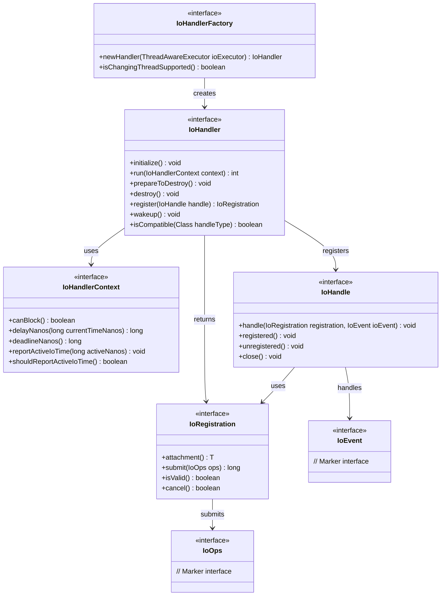
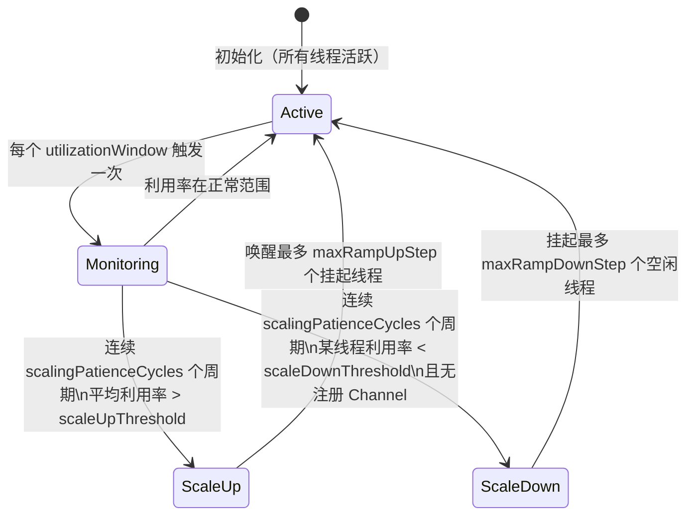
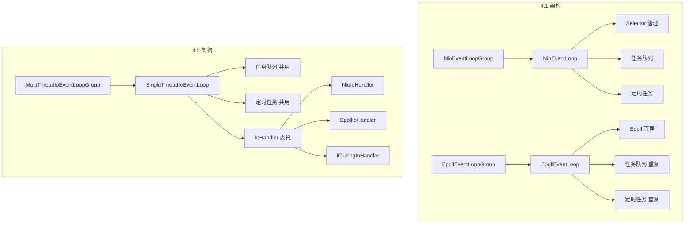

# 第19章：4.2 新架构——IoHandler 与弹性线程

> **本章目标**：理解 Netty 4.2 最大的架构重构——将 I/O 处理从 EventLoop 解耦为独立的 `IoHandler` SPI，以及基于利用率的弹性线程伸缩机制。

---

## 1. 问题驱动：为什么要重构 EventLoop？

### 1.1 4.1 的痛点

在 Netty 4.1 中，`NioEventLoop` 是一个"大杂烩"：

```
NioEventLoop（4.1）
├── Selector 管理（openSelector、rebuildSelector）
├── SelectionKey 处理（processSelectedKeys）
├── 任务队列（taskQueue、tailTaskQueue）
├── 定时任务（scheduledTaskQueue）
└── 线程生命周期（run、shutdown、cleanup）
```

这带来三个问题：

1. **不可插拔**：想换成 Epoll 就必须换整个 `EpollEventLoop`，NIO 和 Epoll 的代码大量重复（任务队列、定时任务、线程生命周期逻辑完全相同）。
2. **线程数固定**：`NioEventLoopGroup` 创建时线程数就固定了，无法根据负载动态伸缩。
3. **测试困难**：I/O 逻辑和任务调度逻辑耦合在一起，单元测试需要启动完整的 EventLoop。

### 1.2 4.2 的解法：IoHandler SPI

```
SingleThreadIoEventLoop（4.2）
├── 任务队列（taskQueue、tailTaskQueue）    ← 不变
├── 定时任务（scheduledTaskQueue）          ← 不变
├── 线程生命周期（run、shutdown）            ← 不变
└── IoHandler（委托）                       ← ⭐ 新增：I/O 处理完全外包
     ├── NioIoHandler（NIO 实现）
     ├── EpollIoHandler（Epoll 实现）
     └── IOUringIoHandler（io_uring 实现）
```

**核心思想**：把"做什么 I/O"（IoHandler）和"怎么调度任务"（EventLoop）彻底分离。

---

## 2. IoHandler SPI 接口族

### 2.1 接口关系图




### 2.2 IoHandler 接口逐方法分析

```java
public interface IoHandler {

    // 初始化，在 EventLoop 线程第一次调用 run() 之前调用
    default void initialize() { }

    // ⭐ 核心方法：执行一轮 I/O 处理，返回处理的 IoHandle 数量
    // context 提供时间约束（canBlock/delayNanos/deadlineNanos）
    int run(IoHandlerContext context);

    // 准备销毁（可能被调用多次）
    default void prepareToDestroy() { }

    // 销毁并释放所有资源
    default void destroy() { }

    // 注册一个 IoHandle，返回 IoRegistration 凭证
    IoRegistration register(IoHandle handle) throws Exception;

    // 唤醒阻塞中的 IoHandler（唯一可以从非 EventLoop 线程调用的方法）
    void wakeup();

    // 判断给定类型的 IoHandle 是否与此 IoHandler 兼容
    boolean isCompatible(Class<? extends IoHandle> handleType);
}
```

**关键约束**：除 `wakeup()` 和 `isCompatible()` 外，所有方法**必须**在 EventLoop 线程上调用。

### 2.3 IoHandlerContext 的双重职责

`IoHandlerContext` 是 EventLoop 传给 IoHandler 的"时间预算"接口：

| 方法 | 作用 |
|------|------|
| `canBlock()` | 是否允许阻塞等待 I/O（无任务时才允许） |
| `delayNanos(currentTimeNanos)` | 距离最近定时任务还有多少纳秒 |
| `deadlineNanos()` | 最近定时任务的绝对截止时间（-1 表示无任务） |
| `reportActiveIoTime(activeNanos)` | 上报本轮主动处理 I/O 的耗时（供弹性伸缩使用） |
| `shouldReportActiveIoTime()` | 是否需要上报（弹性伸缩开启时才为 true） |

> 🔥 **面试考点**：`reportActiveIoTime` 是弹性伸缩的数据来源。IoHandler 在 `run()` 中测量"真正处理 I/O 事件"的时间（不含 `epoll_wait` 阻塞时间），通过此方法上报给 EventLoop，EventLoop 再汇报给 `AutoScalingEventExecutorChooserFactory` 的监控任务。

### 2.4 IoRegistration：Channel 注册的凭证

```java
public interface IoRegistration {
    <T> T attachment();       // 实现特定的附件（NIO 中是 SelectionKey）
    long submit(IoOps ops);   // 提交 I/O 操作（NIO 中是修改 interestOps）
    boolean isValid();        // 注册是否仍然有效
    boolean cancel();         // 取消注册
}
```

**NIO 实现**：`DefaultNioRegistration.attachment()` 返回 `SelectionKey`，`submit(NioIoOps)` 调用 `key.interestOps(v)`。

---

## 3. SingleThreadIoEventLoop：新的 EventLoop 基类

### 3.1 问题推导

> **问题**：EventLoop 需要同时管理"任务调度"和"I/O 处理"，如何让 I/O 部分可插拔？

**推导**：把 I/O 处理抽象为 `IoHandler`，EventLoop 只持有一个 `IoHandler` 引用，在主循环中委托调用。

### 3.2 核心字段

```java
public class SingleThreadIoEventLoop extends SingleThreadEventLoop implements IoEventLoop {

    // 默认最大任务处理时间量子：max(100ms, 系统属性配置)
    private static final long DEFAULT_MAX_TASK_PROCESSING_QUANTUM_NS = TimeUnit.MILLISECONDS.toNanos(Math.max(100,
            SystemPropertyUtil.getInt("io.netty.eventLoop.maxTaskProcessingQuantumMs", 1000)));

    private final long maxTaskProcessingQuantumNs;

    // ⭐ 匿名内部类实现 IoHandlerContext，桥接 EventLoop 的时间信息给 IoHandler
    private final IoHandlerContext context = new IoHandlerContext() {
        @Override
        public boolean canBlock() {
            assert inEventLoop();
            return !hasTasks() && !hasScheduledTasks();
        }

        @Override
        public long delayNanos(long currentTimeNanos) {
            assert inEventLoop();
            return SingleThreadIoEventLoop.this.delayNanos(currentTimeNanos);
        }

        @Override
        public long deadlineNanos() {
            assert inEventLoop();
            return SingleThreadIoEventLoop.this.deadlineNanos();
        }

        @Override
        public void reportActiveIoTime(long activeNanos) {
            SingleThreadIoEventLoop.this.reportActiveIoTime(activeNanos);
        }

        @Override
        public boolean shouldReportActiveIoTime() {
            return isSuspensionSupported();
        }
    };

    private final IoHandler ioHandler;

    // 当前注册的 IoHandle 数量（用于弹性伸缩的 canSuspend 判断）
    private final AtomicInteger numRegistrations = new AtomicInteger();
}
```


### 3.3 主循环 run() 方法

```java
@Override
protected void run() {
    assert inEventLoop();
    ioHandler.initialize();
    do {
        runIo();
        if (isShuttingDown()) {
            ioHandler.prepareToDestroy();
        }
        // 运行任务队列，最多运行 maxTaskProcessingQuantumNs 纳秒
        runAllTasks(maxTaskProcessingQuantumNs);

        // 继续循环，直到确认关闭或可以挂起
    } while (!confirmShutdown() && !canSuspend());
}

protected int runIo() {
    assert inEventLoop();
    return ioHandler.run(context);
}
```


**与 4.1 NioEventLoop.run() 的对比**：

| 维度 | 4.1 NioEventLoop.run() | 4.2 SingleThreadIoEventLoop.run() |
|------|------------------------|-----------------------------------|
| I/O 处理 | 直接调用 `processSelectedKeys()` | 委托 `ioHandler.run(context)` |
| 任务处理 | `runAllTasks(ioTime * ioRatio / (100 - ioRatio))` | `runAllTasks(maxTaskProcessingQuantumNs)` |
| 时间控制 | ioRatio 比例控制 | 固定时间量子控制 |
| 可插拔性 | ❌ 硬编码 NIO | ✅ 任意 IoHandler |
| 弹性伸缩 | ❌ 不支持 | ✅ `canSuspend()` 支持挂起 |

> ⚠️ **生产踩坑**：`maxTaskProcessingQuantumNs` 默认是 `max(100ms, 系统属性)`，即最多运行 100ms 任务后就去处理 I/O。如果业务任务执行时间超过 100ms，会导致 I/O 延迟。可通过 `-Dio.netty.eventLoop.maxTaskProcessingQuantumMs=50` 调小。

### 3.4 register() 与 IoRegistrationWrapper

```java
@Override
public final Future<IoRegistration> register(final IoHandle handle) {
    Promise<IoRegistration> promise = newPromise();
    if (inEventLoop()) {
        registerForIo0(handle, promise);
    } else {
        execute(() -> registerForIo0(handle, promise));
    }
    return promise;
}

private void registerForIo0(final IoHandle handle, Promise<IoRegistration> promise) {
    assert inEventLoop();
    final IoRegistration registration;
    try {
        registration = ioHandler.register(handle);
    } catch (Exception e) {
        promise.setFailure(e);
        return;
    }
    numRegistrations.incrementAndGet();
    promise.setSuccess(new IoRegistrationWrapper(registration));
}
```

**IoRegistrationWrapper 的作用**：包装真实的 `IoRegistration`，在 `cancel()` 时同步递减 `numRegistrations`，确保弹性伸缩的 `canSuspend()` 判断准确。


### 3.5 canSuspend() 与弹性伸缩的联动

```java
@Override
protected boolean canSuspend(int state) {
    // 只有当前没有注册的 Channel 时，才允许挂起
    return super.canSuspend(state) && numRegistrations.get() == 0;
}
```

**不变式**：一个 EventLoop 只有在没有任何 Channel 注册时，才能被弹性伸缩机制挂起。这保证了已有连接不会因为 EventLoop 挂起而丢失事件。

---

## 4. NioIoHandler：NIO 的 IoHandler 实现

### 4.1 核心字段

```java
public final class NioIoHandler implements IoHandler {

    private static final int CLEANUP_INTERVAL = 256;
    private static final boolean DISABLE_KEY_SET_OPTIMIZATION =
            SystemPropertyUtil.getBoolean("io.netty.noKeySetOptimization", false);
    private static final int MIN_PREMATURE_SELECTOR_RETURNS = 3;
    private static final int SELECTOR_AUTO_REBUILD_THRESHOLD; // 默认 512

    private Selector selector;
    private Selector unwrappedSelector;
    private SelectedSelectionKeySet selectedKeys; // 优化后的 SelectionKey 集合（数组替代 HashSet）

    private final SelectorProvider provider;
    private final AtomicBoolean wakenUp = new AtomicBoolean();
    private final SelectStrategy selectStrategy;
    private final ThreadAwareExecutor executor;
    private int cancelledKeys;
    private boolean needsToSelectAgain;
}
```


### 4.2 run() 方法：SelectStrategy 三路分支

```java
@Override
public int run(IoHandlerContext context) {
    int handled = 0;
    try {
        try {
            switch (selectStrategy.calculateStrategy(selectNowSupplier, !context.canBlock())) {
                case SelectStrategy.CONTINUE:
                    if (context.shouldReportActiveIoTime()) {
                        context.reportActiveIoTime(0); // 本轮无 I/O，上报 0
                    }
                    return 0;

                case SelectStrategy.BUSY_WAIT:
                    // NIO 不支持 BUSY_WAIT，fall-through 到 SELECT

                case SelectStrategy.SELECT:
                    select(context, wakenUp.getAndSet(false));
                    if (wakenUp.get()) {
                        selector.wakeup();
                    }
                    // fall through
                default:
            }
        } catch (IOException e) {
            rebuildSelector0();
            handleLoopException(e);
            return 0;
        }

        cancelledKeys = 0;
        needsToSelectAgain = false;

        if (context.shouldReportActiveIoTime()) {
            long activeIoStartTimeNanos = System.nanoTime();
            handled = processSelectedKeys();
            long activeIoEndTimeNanos = System.nanoTime();
            context.reportActiveIoTime(activeIoEndTimeNanos - activeIoStartTimeNanos);
        } else {
            handled = processSelectedKeys();
        }
    } catch (Error e) {
        throw e;
    } catch (Throwable t) {
        handleLoopException(t);
    }
    return handled;
}
```


**关键设计**：`reportActiveIoTime` 只计算 `processSelectedKeys()` 的耗时，**不包含** `select()` 的阻塞等待时间。这样弹性伸缩看到的是"真实 I/O 处理负载"，而不是"等待时间"。

### 4.3 DefaultNioRegistration：SelectionKey 的封装

```java
final class DefaultNioRegistration implements IoRegistration {
    private final AtomicBoolean canceled = new AtomicBoolean();
    private final NioIoHandle handle;
    private volatile SelectionKey key;

    DefaultNioRegistration(ThreadAwareExecutor executor, NioIoHandle handle,
                           NioIoOps initialOps, Selector selector) throws IOException {
        this.handle = handle;
        key = handle.selectableChannel().register(selector, initialOps.value, this);
    }

    @Override
    public <T> T attachment() {
        return (T) key;  // 返回 SelectionKey 本身作为附件
    }

    @Override
    public boolean isValid() {
        return !canceled.get() && key.isValid();
    }

    @Override
    public long submit(IoOps ops) {
        if (!isValid()) {
            return -1;
        }
        int v = cast(ops).value;
        key.interestOps(v);
        return v;
    }

    @Override
    public boolean cancel() {
        if (!canceled.compareAndSet(false, true)) {
            return false;
        }
        key.cancel();
        cancelledKeys++;
        if (cancelledKeys >= CLEANUP_INTERVAL) {
            cancelledKeys = 0;
            needsToSelectAgain = true;
        }
        handle.unregistered();
        return true;
    }
}
```


### 4.4 工厂方法：isChangingThreadSupported = true

```java
public static IoHandlerFactory newFactory(final SelectorProvider selectorProvider,
                                          final SelectStrategyFactory selectStrategyFactory) {
    ObjectUtil.checkNotNull(selectorProvider, "selectorProvider");
    ObjectUtil.checkNotNull(selectStrategyFactory, "selectStrategyFactory");
    return new IoHandlerFactory() {
        @Override
        public IoHandler newHandler(ThreadAwareExecutor executor) {
            return new NioIoHandler(executor, selectorProvider,
                                    selectStrategyFactory.newSelectStrategy());
        }

        @Override
        public boolean isChangingThreadSupported() {
            return true;  // ⭐ NioIoHandler 支持线程切换（弹性伸缩需要）
        }
    };
}
```


---

## 5. MultiThreadIoEventLoopGroup：新的 EventLoopGroup 基类

### 5.1 核心设计

```java
public class MultiThreadIoEventLoopGroup extends MultithreadEventLoopGroup implements IoEventLoopGroup {

    // 最简构造：默认线程数 + IoHandlerFactory
    public MultiThreadIoEventLoopGroup(IoHandlerFactory ioHandlerFactory) {
        this(0, ioHandlerFactory);
    }

    // 支持自定义 EventExecutorChooserFactory（弹性伸缩入口）
    public MultiThreadIoEventLoopGroup(int nThreads, Executor executor,
                                       EventExecutorChooserFactory chooserFactory,
                                       IoHandlerFactory ioHandlerFactory) {
        super(nThreads, executor, chooserFactory, ioHandlerFactory);
    }

    // newChild 工厂方法：创建 SingleThreadIoEventLoop
    protected IoEventLoop newChild(Executor executor, IoHandlerFactory ioHandlerFactory,
                                   @SuppressWarnings("unused") Object... args) {
        return new SingleThreadIoEventLoop(this, executor, ioHandlerFactory);
    }
}
```


**启用弹性伸缩的用法**：

```java
// 传统固定线程数
EventLoopGroup group = new MultiThreadIoEventLoopGroup(8, NioIoHandler.newFactory());

// 4.2 弹性伸缩：最少 2 线程，最多 16 线程
AutoScalingEventExecutorChooserFactory chooserFactory =
    new AutoScalingEventExecutorChooserFactory(
        2,          // minThreads
        16,         // maxThreads
        5,          // utilizationWindow（检测周期）
        TimeUnit.SECONDS,
        0.2,        // scaleDownThreshold（低于 20% 利用率考虑缩容）
        0.8,        // scaleUpThreshold（高于 80% 利用率考虑扩容）
        2,          // maxRampUpStep（每次最多扩 2 个线程）
        1,          // maxRampDownStep（每次最多缩 1 个线程）
        3           // scalingPatienceCycles（连续 3 个周期才触发）
    );

EventLoopGroup group = new MultiThreadIoEventLoopGroup(
    16, null, chooserFactory, NioIoHandler.newFactory());
```

---

## 6. AutoScalingEventExecutorChooserFactory：弹性线程伸缩

### 6.1 问题推导

> **问题**：固定线程数的 EventLoopGroup 在低负载时浪费资源，高负载时又不够用。如何根据实际负载动态调整活跃线程数？

**推导**：
1. 需要**度量**每个 EventLoop 的负载（利用率）
2. 需要**决策**：什么时候扩容、什么时候缩容
3. 需要**执行**：挂起/唤醒 EventLoop 线程
4. 需要**防抖**：避免频繁抖动（patience cycles）

### 6.2 核心字段

```java
public final class AutoScalingEventExecutorChooserFactory implements EventExecutorChooserFactory {

    private static final Runnable NO_OOP_TASK = () -> { };  // 用于唤醒挂起线程的空任务
    private final int minChildren;
    private final int maxChildren;
    private final long utilizationCheckPeriodNanos;  // 检测周期（纳秒）
    private final double scaleDownThreshold;          // 缩容阈值（如 0.2）
    private final double scaleUpThreshold;            // 扩容阈值（如 0.8）
    private final int maxRampUpStep;                  // 每次最多扩容线程数
    private final int maxRampDownStep;                // 每次最多缩容线程数
    private final int scalingPatienceCycles;          // 触发伸缩所需的连续周期数
}
```


### 6.3 AutoScalingState：不可变状态快照

```java
private static final class AutoScalingState {
    final int activeChildrenCount;
    final long nextWakeUpIndex;
    final EventExecutor[] activeExecutors;
    final EventExecutorChooser activeExecutorsChooser;

    AutoScalingState(int activeChildrenCount, long nextWakeUpIndex, EventExecutor[] activeExecutors) {
        this.activeChildrenCount = activeChildrenCount;
        this.nextWakeUpIndex = nextWakeUpIndex;
        this.activeExecutors = activeExecutors;
        activeExecutorsChooser = DefaultEventExecutorChooserFactory.INSTANCE.newChooser(activeExecutors);
    }
}
```


**设计精髓**：所有状态封装在一个不可变对象中，通过 `AtomicReference<AutoScalingState>` 做 CAS 原子替换，实现无锁的线程安全状态转换。

### 6.4 状态机与伸缩流程



### 6.5 UtilizationMonitor：监控与决策核心

```java
private final class UtilizationMonitor implements Runnable {
    private final List<SingleThreadEventExecutor> consistentlyIdleChildren = new ArrayList<>(maxChildren);
    private long lastCheckTimeNanos;

    @Override
    public void run() {
        if (executors.length == 0 || executors[0].isShuttingDown()) {
            return;
        }

        final long now = executors[0].ticker().nanoTime();
        long totalTime;
        if (lastCheckTimeNanos == 0) {
            totalTime = utilizationCheckPeriodNanos;  // 第一次用配置周期作为基准
        } else {
            totalTime = now - lastCheckTimeNanos;     // 后续用实际经过时间
        }
        lastCheckTimeNanos = now;

        if (totalTime <= 0) {
            return;
        }

        int consistentlyBusyChildren = 0;
        consistentlyIdleChildren.clear();

        final AutoScalingState currentState = state.get();

        for (int i = 0; i < executors.length; i++) {
            EventExecutor child = executors[i];
            if (!(child instanceof SingleThreadEventExecutor)) {
                continue;
            }
            SingleThreadEventExecutor eventExecutor = (SingleThreadEventExecutor) child;

            double utilization = 0.0;
            if (!eventExecutor.isSuspended()) {
                long activeTime = eventExecutor.getAndResetAccumulatedActiveTimeNanos();

                if (activeTime == 0) {
                    long lastActivity = eventExecutor.getLastActivityTimeNanos();
                    long idleTime = now - lastActivity;
                    if (idleTime < totalTime) {
                        activeTime = totalTime - idleTime;
                    }
                }

                utilization = Math.min(1.0, (double) activeTime / totalTime);

                if (utilization < scaleDownThreshold) {
                    int idleCycles = eventExecutor.getAndIncrementIdleCycles();
                    eventExecutor.resetBusyCycles();
                    if (idleCycles >= scalingPatienceCycles &&
                        eventExecutor.getNumOfRegisteredChannels() <= 0) {
                        consistentlyIdleChildren.add(eventExecutor);
                    }
                } else if (utilization > scaleUpThreshold) {
                    int busyCycles = eventExecutor.getAndIncrementBusyCycles();
                    eventExecutor.resetIdleCycles();
                    if (busyCycles >= scalingPatienceCycles) {
                        consistentlyBusyChildren++;
                    }
                } else {
                    eventExecutor.resetIdleCycles();
                    eventExecutor.resetBusyCycles();
                }
            }

            utilizationMetrics.get(i).setUtilization(utilization);
        }

        int currentActive = currentState.activeChildrenCount;

        // 扩容优先
        if (consistentlyBusyChildren > 0 && currentActive < maxChildren) {
            int threadsToAdd = Math.min(consistentlyBusyChildren, maxRampUpStep);
            threadsToAdd = Math.min(threadsToAdd, maxChildren - currentActive);
            if (threadsToAdd > 0) {
                tryScaleUpBy(threadsToAdd);
                return; // 本周期只做扩容，不做缩容
            }
        }

        // 缩容
        boolean changed = false;
        if (!consistentlyIdleChildren.isEmpty() && currentActive > minChildren) {
            int threadsToRemove = Math.min(consistentlyIdleChildren.size(), maxRampDownStep);
            threadsToRemove = Math.min(threadsToRemove, currentActive - minChildren);

            for (int i = 0; i < threadsToRemove; i++) {
                SingleThreadEventExecutor childToSuspend = consistentlyIdleChildren.get(i);
                if (childToSuspend.trySuspend()) {
                    childToSuspend.resetBusyCycles();
                    childToSuspend.resetIdleCycles();
                    changed = true;
                }
            }
        }

        if (changed || currentActive != currentState.activeExecutors.length) {
            rebuildActiveExecutors();
        }
    }
}
```


### 6.6 利用率计算的精妙之处

利用率计算有两条路径：

```
路径1（有 activeTime 上报）：
  utilization = min(1.0, activeTime / totalTime)
  ← IoHandler.run() 通过 context.reportActiveIoTime() 上报

路径2（activeTime == 0，即 IoHandler 没有上报）：
  idleTime = now - lastActivity
  if (idleTime < totalTime):
      activeTime = totalTime - idleTime  ← 用"最近活跃时间"反推
  utilization = min(1.0, activeTime / totalTime)
```

**为什么需要路径2**？如果 IoHandler 实现没有覆盖 `reportActiveIoTime()`（默认 no-op），监控任务仍然能通过"最近活跃时间"做粗粒度估算，保证弹性伸缩不会因为 IoHandler 实现不完整而完全失效。

### 6.7 tryScaleUpBy()：无锁扩容

```java
private void tryScaleUpBy(int amount) {
    if (amount <= 0) {
        return;
    }

    for (;;) {
        AutoScalingState oldState = state.get();
        if (oldState.activeChildrenCount >= maxChildren) {
            return;
        }

        int canAdd = Math.min(amount, maxChildren - oldState.activeChildrenCount);
        List<EventExecutor> wokenUp = new ArrayList<>(canAdd);
        final long startIndex = oldState.nextWakeUpIndex;

        for (int i = 0; i < executors.length; i++) {
            EventExecutor child = executors[(int) Math.abs((startIndex + i) % executors.length)];
            if (wokenUp.size() >= canAdd) {
                break;
            }
            if (child instanceof SingleThreadEventExecutor) {
                SingleThreadEventExecutor stee = (SingleThreadEventExecutor) child;
                if (stee.isSuspended()) {
                    stee.execute(NO_OOP_TASK);  // 提交一个空任务来唤醒挂起的线程
                    wokenUp.add(stee);
                }
            }
        }

        if (wokenUp.isEmpty()) {
            return;
        }

        List<EventExecutor> newActiveList = new ArrayList<>(oldState.activeExecutors.length + wokenUp.size());
        Collections.addAll(newActiveList, oldState.activeExecutors);
        newActiveList.addAll(wokenUp);

        AutoScalingState newState = new AutoScalingState(
                oldState.activeChildrenCount + wokenUp.size(),
                startIndex + wokenUp.size(),
                newActiveList.toArray(new EventExecutor[0]));

        if (state.compareAndSet(oldState, newState)) {
            return;
        }
        // CAS 失败，重试
    }
}
```


**唤醒机制**：通过 `stee.execute(NO_OOP_TASK)` 提交一个空 `Runnable`（`() -> { }`）来唤醒挂起的线程。线程被唤醒后执行这个空任务，然后继续正常的 EventLoop 循环。

---

## 7. DefaultEventExecutorChooserFactory：传统轮询选择

```java
public final class DefaultEventExecutorChooserFactory implements EventExecutorChooserFactory {

    public static final DefaultEventExecutorChooserFactory INSTANCE = new DefaultEventExecutorChooserFactory();

    @Override
    public EventExecutorChooser newChooser(EventExecutor[] executors) {
        if (isPowerOfTwo(executors.length)) {
            return new PowerOfTwoEventExecutorChooser(executors);
        } else {
            return new GenericEventExecutorChooser(executors);
        }
    }

    private static boolean isPowerOfTwo(int val) {
        return (val & -val) == val;
    }

    // 2 的幂次：用位运算替代取模（更快）
    private static final class PowerOfTwoEventExecutorChooser implements EventExecutorChooser {
        private final AtomicInteger idx = new AtomicInteger();
        private final EventExecutor[] executors;

        @Override
        public EventExecutor next() {
            return executors[idx.getAndIncrement() & executors.length - 1];
        }
    }

    // 非 2 的幂次：用 long 计数器避免 32 位溢出时的非均匀分布
    private static final class GenericEventExecutorChooser implements EventExecutorChooser {
        private final AtomicLong idx = new AtomicLong();
        private final EventExecutor[] executors;

        @Override
        public EventExecutor next() {
            return executors[(int) Math.abs(idx.getAndIncrement() % executors.length)];
        }
    }
}
```


> 🔥 **面试考点**：为什么 `GenericEventExecutorChooser` 用 `AtomicLong` 而不是 `AtomicInteger`？因为 `int` 在 `Integer.MAX_VALUE` 溢出后变为负数，`Math.abs(Integer.MIN_VALUE)` 仍然是负数（溢出），导致数组越界。`long` 的溢出点在 `Long.MAX_VALUE`，实际上不会遇到。

---

## 8. 架构演进对比

### 8.1 4.1 vs 4.2 EventLoop 架构



### 8.2 用户代码迁移

从 4.1 升级到 4.2，用户代码几乎不需要改变：

```java
// 4.1 写法（仍然兼容）
EventLoopGroup group = new NioEventLoopGroup(8);

// 4.2 新写法（等价）
EventLoopGroup group = new MultiThreadIoEventLoopGroup(8, NioIoHandler.newFactory());

// 4.2 弹性伸缩写法（新功能）
EventLoopGroup group = new MultiThreadIoEventLoopGroup(
    16, null,
    new AutoScalingEventExecutorChooserFactory(2, 16, 5, TimeUnit.SECONDS, 0.2, 0.8, 2, 1, 3),
    NioIoHandler.newFactory()
);
```

> ⚠️ **生产踩坑**：弹性伸缩的监控任务运行在 `GlobalEventExecutor.INSTANCE` 上（全局单线程调度器），不会占用业务 EventLoop 线程。但如果 `GlobalEventExecutor` 被其他任务阻塞，监控周期会延迟，导致伸缩决策滞后。

---

## 9. 核心不变式

1. **IoHandler 线程安全不变式**：除 `wakeup()` 和 `isCompatible()` 外，所有 `IoHandler` 方法必须在 EventLoop 线程上调用（`inEventLoop()` 为 true）。
2. **挂起安全不变式**：一个 EventLoop 只有在 `numRegistrations == 0`（无注册 Channel）时才能被挂起，保证已有连接不丢失事件。
3. **扩容优先不变式**：同一个监控周期内，扩容和缩容不会同时发生（扩容后直接 `return`），避免决策冲突。

---

## 10. 面试高频问题

**Q1：为什么 4.2 要把 I/O 处理从 EventLoop 中解耦成 IoHandler？**

> 4.1 中 `NioEventLoop`、`EpollEventLoop`、`IOUringEventLoop` 各自实现了完整的 EventLoop，导致任务队列、定时任务、线程生命周期逻辑大量重复。4.2 将 I/O 处理抽象为 `IoHandler` SPI，`SingleThreadIoEventLoop` 只负责任务调度，I/O 处理完全委托给 `IoHandler`。这样三种 Transport 只需实现 `IoHandler` 接口，共享同一套任务调度基础设施，代码复用率大幅提升，也为弹性伸缩奠定了基础。

**Q2：`AutoScalingEventExecutorChooserFactory` 如何检测负载并做伸缩决策？** 🔥

> 监控任务每隔 `utilizationWindow` 运行一次，对每个活跃 EventLoop 计算利用率：`utilization = activeTime / totalTime`，其中 `activeTime` 来自 `IoHandler.run()` 通过 `context.reportActiveIoTime()` 上报的"主动处理 I/O 事件"时间（不含阻塞等待）。如果某线程连续 `scalingPatienceCycles` 个周期利用率低于 `scaleDownThreshold` 且无注册 Channel，则挂起；如果连续多个周期利用率高于 `scaleUpThreshold`，则唤醒挂起的线程。扩容优先于缩容，同一周期不同时执行。

**Q3：从 4.1 升级到 4.2 对用户代码有什么影响？**

> 几乎无影响。`NioEventLoopGroup` 等旧类仍然保留（内部已改为基于 `SingleThreadIoEventLoop` + `NioIoHandler` 实现），用户代码无需修改。如果想使用弹性伸缩，需要改用 `MultiThreadIoEventLoopGroup` + `AutoScalingEventExecutorChooserFactory`。

**Q4：`DefaultEventExecutorChooserFactory` 为什么对 2 的幂次和非 2 的幂次分别处理？**

> 2 的幂次时，`idx & (length - 1)` 等价于 `idx % length`，但位运算比取模快。非 2 的幂次时，必须用取模，且用 `AtomicLong` 而非 `AtomicInteger`，因为 `int` 溢出后 `Math.abs(Integer.MIN_VALUE)` 仍为负数，会导致数组越界；`long` 的溢出点在实际中不会遇到。

---

## 11. Netty 4.1 → 4.2 变化总览与迁移指南

> 本节集中整理**散布在各章节中的 4.1 vs 4.2 差异**，方便升级参考和面试准备。

### 11.1 架构级变化总表

| # | 变化领域 | 4.1 | 4.2 | 影响程度 | 详细章节 |
|---|---------|-----|-----|---------|---------|
| 1 | **EventLoop 架构** | `NioEventLoop` 直接耦合 NIO 逻辑 | `SingleThreadIoEventLoop` + `IoHandler` SPI 分离 | ⭐⭐⭐ 架构级 | Ch03、Ch19 |
| 2 | **IO/任务时间分配** | `ioRatio`（默认 50，比例控制） | `maxTaskProcessingQuantumNs`（默认 1s，固定时间量子） | ⭐⭐ 行为变化 | Ch03-02 |
| 3 | **EventLoop 状态机** | 5 个状态（NOT_STARTED/STARTED/SHUTTING_DOWN/SHUTDOWN/TERMINATED） | 7 个状态（新增 `ST_SUSPENDING`/`ST_SUSPENDED`） | ⭐⭐ 新增 | Ch03-01 |
| 4 | **弹性线程池** | 固定线程数 | `AutoScalingEventExecutorChooserFactory` 支持动态伸缩 | ⭐⭐⭐ 新功能 | Ch19 |
| 5 | **IoRegistration** | `SelectionKey` 直接持有 | `IoRegistration` 抽象层 | ⭐ 内部实现 | Ch04-01 |
| 6 | **Recycler** | `Stack` + `WeakOrderQueue` | `LocalPool` + `MessagePassingQueue` | ⭐⭐ 全面重构 | Ch17 |
| 7 | **IdleStateHandler** | 直接用 `System.nanoTime()` | 新增 `Ticker` 抽象（方便测试 Mock） | ⭐ 小改进 | Ch11 |
| 8 | **ByteToMessageDecoder** | 无重入保护 | 新增重入保护队列（`fireChannelReadCompleteOnInactive`） | ⭐ 小改进 | Ch07 |
| 9 | **ByteBuf.isContiguous()** | 不存在 | 新增，用于 `MERGE_CUMULATOR` 优化路径 | ⭐ 小改进 | Ch07 |
| 10 | **AdaptiveByteBufAllocator** | 不存在 | 4.2 新增，反代际假说自适应分配器 | ⭐⭐ 新功能 | Ch20 |

### 11.2 ⚠️ 4.1 面试八股文在 4.2 中已过时的内容

> 🔥 **面试者注意**：如果面试官基于 4.1 出题，但你读的是 4.2 源码，以下内容需要特别说明版本差异。

| # | 过时的 4.1 八股文 | 4.2 的正确说法 | 面试建议 |
|---|------------------|---------------|---------|
| 1 | "ioRatio 默认是 50，IO 和任务各占一半时间" | 4.2 移除了 ioRatio，改用 `maxTaskProcessingQuantumNs`（默认 1s） | 主动说："4.1 用 ioRatio 比例控制，4.2 改用时间预算模式" |
| 2 | "NioEventLoop.run() 内有 select → processSelectedKeys → runAllTasks 三段" | run() 逻辑分离为 `IoHandler.run()`（IO 部分）+ `runAllTasks()`（任务部分） | 强调架构分离 |
| 3 | "NioEventLoop 直接管理 Selector" | Selector 由 `NioIoHandler` 管理，EventLoop 只负责线程调度 | 体现 SPI 设计思想 |
| 4 | "Recycler 用 Stack + WeakOrderQueue 跨线程传递对象" | 4.2 全面重构为 `LocalPool` + MPSC Queue | 说明重构原因 |
| 5 | "EventLoop 线程数固定，创建后不可变" | 4.2 支持弹性伸缩（基于负载自动 suspend/resume） | 展示新特性 |
| 6 | "NioEventLoopGroup 构造时传入线程数" | 推荐用 `MultiThreadIoEventLoopGroup(n, NioIoHandler.newFactory())` | 旧 API 仍兼容 |

### 11.3 API 迁移对照表

```java
// ═══════════════════════════════════════════
//  EventLoopGroup 创建
// ═══════════════════════════════════════════

// 4.1 写法（仍兼容，但不推荐新代码使用）
EventLoopGroup group = new NioEventLoopGroup(8);

// 4.2 标准写法
EventLoopGroup group = new MultiThreadIoEventLoopGroup(8, NioIoHandler.newFactory());

// 4.2 弹性伸缩写法
EventLoopGroup group = new MultiThreadIoEventLoopGroup(16, null,
    new AutoScalingEventExecutorChooserFactory(2, 16, 5, TimeUnit.SECONDS, 0.2, 0.8, 2, 1, 3),
    NioIoHandler.newFactory());

// ═══════════════════════════════════════════
//  Epoll Transport
// ═══════════════════════════════════════════

// 4.1 写法
EventLoopGroup group = new EpollEventLoopGroup(8);

// 4.2 写法
EventLoopGroup group = new MultiThreadIoEventLoopGroup(8, EpollIoHandler.newFactory());

// ═══════════════════════════════════════════
//  io_uring Transport（4.2 新增正式支持）
// ═══════════════════════════════════════════

// 4.2 写法（4.1 无此选项）
EventLoopGroup group = new MultiThreadIoEventLoopGroup(8, IOUringIoHandler.newFactory());

// ═══════════════════════════════════════════
//  ioRatio → maxTaskProcessingQuantumMs
// ═══════════════════════════════════════════

// 4.1 写法
((NioEventLoopGroup) group).setIoRatio(70);  // IO 占 70%

// 4.2 写法（通过系统属性）
// -Dio.netty.eventLoop.maxTaskProcessingQuantumMs=100

// ═══════════════════════════════════════════
//  ServerBootstrap 配置（完全不变）
// ═══════════════════════════════════════════

// 4.1 和 4.2 完全一致
ServerBootstrap b = new ServerBootstrap();
b.group(bossGroup, workerGroup)
 .channel(NioServerSocketChannel.class)
 .childHandler(new ChannelInitializer<SocketChannel>() {
     @Override
     protected void initChannel(SocketChannel ch) {
         ch.pipeline().addLast(new MyHandler());
     }
 });
```

### 11.4 升级检查清单

- [ ] 将 `NioEventLoopGroup` 替换为 `MultiThreadIoEventLoopGroup` + `NioIoHandler.newFactory()`（可选，旧 API 仍兼容）
- [ ] 移除所有 `setIoRatio()` 调用，改用 `-Dio.netty.eventLoop.maxTaskProcessingQuantumMs` 系统属性
- [ ] 检查是否依赖了 Recycler 的内部类（如 `Stack`、`WeakOrderQueue`），这些在 4.2 中已被移除
- [ ] 如果使用了自定义 `EventExecutorChooserFactory`，确认其兼容新的 `AutoScaling` 框架
- [ ] Epoll/io_uring 的 EventLoopGroup 也需要对应迁移
- [ ] 检查反射访问 EventLoop 内部字段的代码（字段名和位置可能变化）
- [ ] 单元测试中如果 Mock 了 `EventLoop.run()`，需适配新的 `IoHandler.run()` 签名

---

## 深度补充：Suspend/Resume 动态伸缩专题

> 本文从宏观角度分析了 IoHandler SPI + 弹性伸缩的整体架构。如果你想深入了解 **Suspend/Resume 的完整状态转换、挂起/唤醒的源码级逐行分析、边界竞态条件的完整推演**，请阅读：
>
> 📖 **[02-suspend-resume-deep-dive.md](./02-suspend-resume-deep-dive.md)** — Suspend/Resume 动态伸缩深度专题分析
>
> 它涵盖了 7 个状态的完整转换图、`doStartThread()` for(;;) 循环的逐行分析、`processingLock` 的线程移交保障、3 个关键竞态场景的推演、以及运行时验证代码。

---

## 附录：核对清单

> 以下为文档编写过程中的源码核对记录，供审计追溯使用。

1. 核对记录：已对照 IoHandler.java 全文（86行）、IoHandlerFactory.java（45行）、IoHandlerContext.java（84行）、IoHandle.java（61行）、IoRegistration.java（54行）、IoEvent.java（26行）、IoOps.java（27行），差异：无
2. 核对记录：已对照 SingleThreadIoEventLoop.java 第37-75行字段声明，差异：无
3. 核对记录：已对照 SingleThreadIoEventLoop.java 第196-213行 run() 方法，差异：无
4. 核对记录：已对照 SingleThreadIoEventLoop.java 第228-260行 register/registerForIo0 方法，差异：无
5. 核对记录：已对照 NioIoHandler.java 第55-107行字段声明，差异：无
6. 核对记录：已对照 NioIoHandler.java 第340-400行 run() 方法，差异：无
7. 核对记录：已对照 NioIoHandler.java 第270-380行 DefaultNioRegistration 内部类，差异：补充了 isValid() 方法（已修正）
8. 核对记录：已对照 NioIoHandler.java 第770-814行 newFactory() 方法，差异：补充了 ObjectUtil.checkNotNull 参数校验（已修正）
9. 核对记录：已对照 MultiThreadIoEventLoopGroup.java 第40-229行，差异：newChild() 补充了 @SuppressWarnings("unused") 注解（已修正）
10. 核对记录：已对照 AutoScalingEventExecutorChooserFactory.java 第83-92行字段声明，差异：补充了 NO_OOP_TASK 静态字段（已修正）
11. 核对记录：已对照 AutoScalingEventExecutorChooserFactory.java 第148-163行 AutoScalingState 内部类，差异：无
12. 核对记录：已对照 AutoScalingEventExecutorChooserFactory.java 第270-390行 UtilizationMonitor.run() 方法，差异：无
13. 核对记录：已对照 AutoScalingEventExecutorChooserFactory.java 第195-245行 tryScaleUpBy() 方法，差异：无
14. 核对记录：已对照 DefaultEventExecutorChooserFactory.java 全文（74行），差异：无

