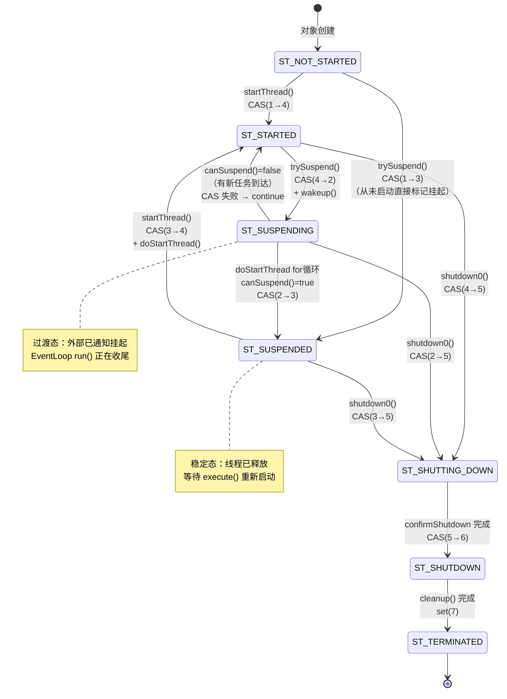
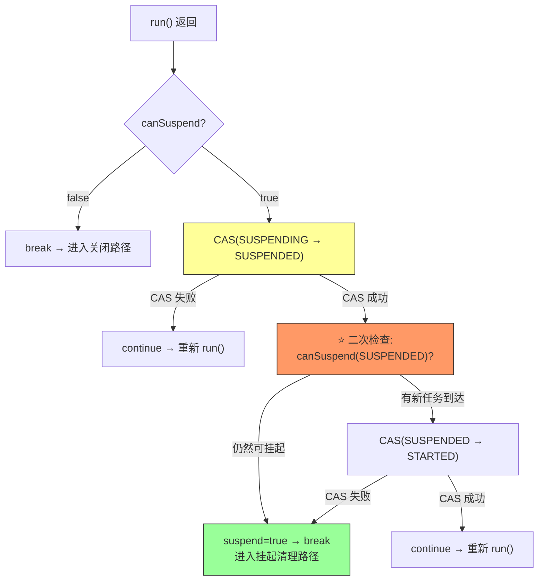

# Netty 4.2 Suspend/Resume 动态伸缩 — 深度专题分析

> **前置阅读**：[01-io-handler-and-autoscaling.md](./01-io-handler-and-autoscaling.md)（Ch19 主文档，覆盖 IoHandler SPI 和弹性伸缩概览）
>
> **本文定位**：Ch19 主文档分析了"**监控决策层**"（UtilizationMonitor 如何决定扩/缩容），本文聚焦"**执行层**"——EventLoop 线程如何挂起、如何唤醒、线程资源如何释放和复用，以及全链路的竞态安全分析。
>
> 遵循 Rule #11（问题驱动5步）、Rule #12（数据结构优先）、Rule #13（L4 源码级深度）。

---

## 第 0 部分：核心原理

### 0.1 本质问题

> **Netty 4.1 的 EventLoop 线程一旦启动就永不停止**（除非整个 Group 关闭）。在低负载时，大量 EventLoop 线程空转在 `selector.select()` 上浪费 OS 资源。

### 0.2 为什么需要 Suspend/Resume？

| 场景 | 4.1 行为 | 4.2 行为 |
|------|---------|---------|
| 深夜低峰，只有 2 个连接 | 16 个 EventLoop 线程全部运行 | 自动挂起 14 个，只留 2 个 |
| 白天高峰，连接激增 | 不变，仍是 16 个 | 自动唤醒被挂起的线程 |
| 微服务刚启动 | 16 个线程立刻创建 | 可按需启动 |

**收益**：减少 OS 线程上下文切换、节省内存（每个线程 ~1MB 栈空间）、降低 CPU 空转开销。

### 0.3 怎么解决的？（一句话摘要）

**在 `doStartThread()` 的线程执行体中增加一个 `for(;;)` 循环**：`run()` 返回后不直接走 shutdown 路径，而是先检查 `canSuspend()` ——如果可以挂起，则 CAS 切换到 `ST_SUSPENDED` 状态，释放线程资源（`thread=null`、`FastThreadLocal.removeAll()`、`processingLock.unlock()`），线程退出但 EventLoop 对象**不销毁**。下次 `execute()` 被调用时，`startThread()` 检测到 `ST_SUSPENDED` 状态，通过 `processingLock.lock()` 获取一个**新线程**来继续执行。

### 0.4 为什么这样设计？（关键 Trade-off）

| 方案 | 优点 | 缺点 |
|------|------|------|
| A. 线程池 park/unpark | 线程不销毁，唤醒快 | EventLoop 线程绑定语义被破坏（FastThreadLocal 依赖线程身份） |
| B. 真正释放线程，新线程接管 ✅ Netty 选择 | FastThreadLocal 干净隔离、无旧状态泄漏 | 唤醒稍慢（需新线程 start） |
| C. 定时器周期性 wake | 简单 | 无法做到按需唤醒 |

Netty 选择了方案 B，核心原因：**EventLoop 线程的 FastThreadLocal 状态非常重要**（如 PoolThreadCache、Recycler.LocalPool 等），如果 park 后被不同线程唤醒继续执行，会导致 FastThreadLocal 索引混乱。

---

## 第 1 部分：数据结构全景

### 1.1 状态机：7 个状态

```java
// 📦 SingleThreadEventExecutor.java:65-71
private static final int ST_NOT_STARTED = 1;   // 初始态，线程从未启动
private static final int ST_SUSPENDING  = 2;   // ⭐ 4.2 新增：正在挂起（过渡态）
private static final int ST_SUSPENDED   = 3;   // ⭐ 4.2 新增：已挂起
private static final int ST_STARTED     = 4;   // 运行中
private static final int ST_SHUTTING_DOWN = 5;  // 正在优雅关闭
private static final int ST_SHUTDOWN    = 6;    // 已关闭
private static final int ST_TERMINATED  = 7;    // 已终止
```

> 🔥 **面试考点**：4.1 只有 5 个状态（1,4,5,6,7），4.2 新增了 `ST_SUSPENDING(2)` 和 `ST_SUSPENDED(3)` 两个状态，数值上恰好插在 `NOT_STARTED` 和 `STARTED` 之间。

### 1.2 状态转换图



### 1.3 与 Suspend/Resume 相关的全部字段

| # | 字段 | 类型 | 初始值 | 作用 | 所在类 |
|---|------|------|--------|------|--------|
| 1 | `state` | `volatile int` | `ST_NOT_STARTED(1)` | 7 状态机核心 | `SingleThreadEventExecutor:127` |
| 2 | `supportSuspension` | `final boolean` | 构造时传入 | 是否启用挂起能力 | `SingleThreadEventExecutor:106` |
| 3 | `processingLock` | `ReentrantLock` | new | 保护线程切换的互斥锁 | `SingleThreadEventExecutor:98` |
| 4 | `thread` | `volatile Thread` | `null` | 当前执行线程引用 | `SingleThreadEventExecutor:93` |
| 5 | `threadProperties` | `volatile ThreadProperties` | `null` | 线程属性快照（挂起时置 null） | `SingleThreadEventExecutor:94` |
| 6 | `accumulatedActiveTimeNanos` | `volatile long` | `0` | 累积活跃时间（供利用率计算） | `SingleThreadEventExecutor:108` |
| 7 | `lastActivityTimeNanos` | `volatile long` | `0` | 最后活跃时间戳 | `SingleThreadEventExecutor:110` |
| 8 | `consecutiveIdleCycles` | `volatile int` | `0` | 连续空闲周期计数器 | `SingleThreadEventExecutor:115` |
| 9 | `consecutiveBusyCycles` | `volatile int` | `0` | 连续繁忙周期计数器 | `SingleThreadEventExecutor:121` |
| 10 | `numRegistrations` | `AtomicInteger` | `0` | 注册的 Channel 数量 | `SingleThreadIoEventLoop:83` |
| 11 | `taskQueue` | `Queue<Runnable>` | MpscQueue | 任务队列（挂起判断条件之一） | `SingleThreadEventExecutor:91` |

### 1.4 processingLock 的关键作用

> **问题**：如果旧线程还在执行 `finally` 清理（设置 `thread=null`、`FastThreadLocal.removeAll()`），新线程就已经进入 `doStartThread()` 的 `run()` 方法，会怎样？

**答**：`processingLock` 保证了**旧线程完全退出后，新线程才能开始**。

```
旧线程（挂起路径）               新线程（唤醒路径）
─────────────────              ─────────────────
processingLock.lock()          │
run() → canSuspend = true      │
state: SUSPENDING → SUSPENDED   │
FastThreadLocal.removeAll()     │
threadProperties = null         │
thread = null                  │
processingLock.unlock() ───────→ processingLock.lock()  ← 在这里等
                                thread = Thread.currentThread()
                                run() 开始执行
```

### 1.5 supportSuspension 的传递链

```
NioIoHandler.newFactory()
  └── isChangingThreadSupported() → true ← ⭐ NIO 支持线程切换
        ↓
SingleThreadIoEventLoop 构造函数
  └── super(parent, executor, false, ioHandlerFactory.isChangingThreadSupported())
        ↓                                          ↑ 这个值
SingleThreadEventLoop 构造函数
  └── super(parent, executor, addTaskWakesUp, supportSuspension)
        ↓
SingleThreadEventExecutor 构造函数
  └── this.supportSuspension = supportSuspension  ← 保存
```

**设计含义**：不是所有 IoHandler 都支持线程切换。如果 IoHandler 内部绑定了线程本地状态，`isChangingThreadSupported()` 应返回 `false`，此时 `trySuspend()` 直接返回 `false`，禁用弹性伸缩。

---

## 第 2 部分：算法流程分析——挂起路径

### 2.1 挂起路径总览

```
UtilizationMonitor.run()                              ← Monitor 线程（GlobalEventExecutor）
  │
  ├── 计算每个 EventLoop 的利用率
  │     utilization = activeTime / totalTime
  │
  ├── 判断是否连续空闲：consecutiveIdleCycles >= scalingPatienceCycles
  │     且 numRegistrations == 0
  │
  └── childToSuspend.trySuspend()                     ← Monitor 线程
        │
        ├── CAS(ST_STARTED → ST_SUSPENDING)            ← 原子操作
        └── wakeup(false)                              ← 唤醒阻塞在 select 上的 EventLoop 线程
              │
              └── selector.wakeup()                    ← 打断 epoll_wait/select 阻塞

              ↓ EventLoop 线程被唤醒
              
        SingleThreadIoEventLoop.run()                  ← EventLoop 线程
        │ ioHandler.run(context)                       ← 处理残留 I/O 事件
        │ runAllTasks(maxTaskProcessingQuantumNs)       ← 处理残留任务
        │ while 条件检查: !confirmShutdown() && !canSuspend()
        │   canSuspend() → true（state==SUSPENDING，无任务，无Channel）
        └── run() 返回
        
              ↓ 回到 doStartThread() 的 for(;;) 循环
              
        doStartThread()                                ← EventLoop 线程
        │ canSuspend(currentState) → true
        │ CAS(ST_SUSPENDING → ST_SUSPENDED)
        │ ⭐ 二次检查：canSuspend(ST_SUSPENDED)
        │   → 如果此时有新任务到达：
        │       CAS(ST_SUSPENDED → ST_STARTED) → continue（取消挂起）
        │   → 如果仍然空闲：
        │       suspend = true → break
        │
        └── finally 块
              ├── FastThreadLocal.removeAll()           ← 清理线程局部变量
              ├── threadProperties = null               ← 清空线程属性缓存
              ├── thread = null                         ← 释放线程引用
              └── processingLock.unlock()               ← ⭐ 释放锁，允许新线程进入
```

### 2.2 Step 1：trySuspend() 逐行分析

> 📦 源码文件：`SingleThreadEventExecutor.java:873-886`

```java
@Override
public boolean trySuspend() {
    // 前提条件：构造时必须开启 supportSuspension
    if (supportSuspension) {
        // 路径 1：正在运行 → 标记为"正在挂起"
        // ⭐ CAS 保证只有一个线程能成功（Monitor 线程可能并发调用）
        if (STATE_UPDATER.compareAndSet(this, ST_STARTED, ST_SUSPENDING)) {
            // wakeup(false)：false 表示"不是从 EventLoop 线程调用"
            // 作用：如果 EventLoop 线程正阻塞在 selector.select() 上，打断它
            // 这样 IoHandler.run() 会返回，进而 SingleThreadIoEventLoop.run() 返回
            wakeup(inEventLoop());
            return true;
        // 路径 2：从未启动 → 直接标记为"已挂起"（跳过 SUSPENDING 中间态）
        } else if (STATE_UPDATER.compareAndSet(this, ST_NOT_STARTED, ST_SUSPENDED)) {
            return true;
        }
        // 路径 3：可能已经在挂起中或已经挂起（幂等安全）
        int currentState = state;
        return currentState == ST_SUSPENDED || currentState == ST_SUSPENDING;
    }
    return false;
}
```

**设计决策分析**：

| 设计点 | 选择 | 为什么 |
|--------|------|--------|
| CAS 而非 synchronized | 无锁操作 | Monitor 线程和 EventLoop 线程可能并发修改 state |
| `wakeup(inEventLoop())` | 打断 select 阻塞 | 让 `run()` 尽快返回，而非等到下一个 I/O 事件 |
| 幂等性（路径 3） | 已挂起/挂起中时返回 true | 防止 Monitor 重复 trySuspend 导致状态错误 |
| NOT_STARTED → SUSPENDED（跳过 SUSPENDING） | 直接跳转 | 从未启动的线程没有 `run()` 在执行，不需要等待返回 |

### 2.3 Step 2：canSuspend() 逐行分析

> 📦 源码文件：`SingleThreadEventExecutor.java:900-910` + `SingleThreadIoEventLoop.java:218-221`

**基类实现**（3 个条件全部满足才返回 true）：

```java
// SingleThreadEventExecutor.java:906-910
protected boolean canSuspend(int state) {
    assert inEventLoop();  // 必须在 EventLoop 线程调用
    return supportSuspension                              // 条件1：支持挂起
            && (state == ST_SUSPENDED || state == ST_SUSPENDING)  // 条件2：状态为挂起中/已挂起
            && !hasTasks()                                // 条件3：任务队列为空
            && nextScheduledTaskDeadlineNanos() == -1;    // 条件4：无定时任务
}
```

**子类增强**（IoEventLoop 额外要求无注册 Channel）：

```java
// SingleThreadIoEventLoop.java:218-221
@Override
protected boolean canSuspend(int state) {
    // 在父类 4 个条件基础上，额外要求无注册的 Channel
    return super.canSuspend(state) && numRegistrations.get() == 0;  // 条件5
}
```

**完整条件汇总**：

```
canSuspend() == true 需要同时满足：
  ① supportSuspension == true       ← 构造时由 IoHandlerFactory.isChangingThreadSupported() 决定
  ② state ∈ {ST_SUSPENDING, ST_SUSPENDED}  ← 必须已经被 trySuspend() 标记
  ③ !hasTasks()                     ← MpscQueue 为空
  ④ nextScheduledTaskDeadlineNanos() == -1  ← 定时任务优先队列为空
  ⑤ numRegistrations.get() == 0     ← 无注册的 Channel（IoEventLoop 特有）
```

> 🔥 **面试考点**：为什么条件 ⑤ 要在子类中增加而非放在基类？因为 `SingleThreadEventExecutor` 是通用的事件执行器，不一定用于 I/O 场景（可能只执行普通任务），它不知道"注册"这个概念。只有 `SingleThreadIoEventLoop` 才有 Channel 注册的概念，所以将这个条件下放到子类。

### 2.4 Step 3：doStartThread() 挂起循环逐行分析 🔥

> 📦 源码文件：`SingleThreadEventExecutor.java:1179-1318`
>
> 这是整个 Suspend/Resume 机制**最核心、最复杂**的代码段。

```java
private void doStartThread() {
    executor.execute(new Runnable() {
        @Override
        public void run() {
            // ═══════ 阶段1：线程初始化 ═══════
            processingLock.lock();         // ⭐ 获取锁：保证同一时刻只有一个线程执行
            assert thread == null;         // 断言：上一个线程必须已经完全退出
            thread = Thread.currentThread(); // 记录当前线程引用（用于 inEventLoop() 判断）
            if (interrupted) {
                thread.interrupt();
                interrupted = false;
            }
            boolean success = false;
            Throwable unexpectedException = null;
            updateLastExecutionTime();     // 更新最后执行时间（lastExecutionTime）
            boolean suspend = false;       // 标记：本次退出是挂起还是关闭

            try {
                // ═══════ 阶段2：核心循环 ═══════
                for (;;) {
                    // ⭐ 调用子类的 run()，即 SingleThreadIoEventLoop.run()
                    // run() 内部是 do { runIo(); runAllTasks(); } while (!confirmShutdown() && !canSuspend());
                    // 当 canSuspend() 返回 true 时，run() 返回
                    SingleThreadEventExecutor.this.run();
                    success = true;

                    // run() 返回了，检查是应该挂起还是关闭
                    int currentState = state;

                    // ═══════ 阶段3：挂起决策（三步 CAS 协议）═══════

                    // 步骤 3a：检查是否可以挂起
                    if (canSuspend(currentState)) {

                        // 步骤 3b：CAS 尝试 SUSPENDING → SUSPENDED
                        if (!STATE_UPDATER.compareAndSet(SingleThreadEventExecutor.this,
                                ST_SUSPENDING, ST_SUSPENDED)) {
                            // CAS 失败 → 状态已被其他线程修改（如 shutdownGracefully）
                            // 回到 for 循环顶部重新执行 run()
                            continue;
                        }

                        // 步骤 3c：⭐ 二次检查（防止 ABA 问题）
                        // 在 CAS 成功（状态已变为 SUSPENDED）后，再次检查是否仍然可以挂起
                        // 为什么？因为在 CAS 成功的瞬间，可能有其他线程调用了 execute()
                        // 往任务队列里添加了新任务
                        if (!canSuspend(ST_SUSPENDED) && STATE_UPDATER.compareAndSet(
                                    SingleThreadEventExecutor.this,
                                    ST_SUSPENDED, ST_STARTED)) {
                            // ⚠️ 有新任务到达！撤销挂起，回到 for 循环继续运行
                            continue;
                        }

                        // 所有检查通过，确认挂起
                        suspend = true;
                    }
                    break;  // 退出 for 循环（挂起或关闭）
                }
            } catch (Throwable t) {
                unexpectedException = t;
                logger.warn("Unexpected exception from an event executor: ", t);
            } finally {
                // ═══════ 阶段4：资源清理 ═══════
                boolean shutdown = !suspend;

                if (shutdown) {
                    // ── 关闭路径 ──
                    for (;;) {
                        int oldState = state;
                        if (oldState >= ST_SHUTTING_DOWN || STATE_UPDATER.compareAndSet(
                                SingleThreadEventExecutor.this, oldState, ST_SHUTTING_DOWN)) {
                            break;
                        }
                    }
                    // ... 执行 confirmShutdown、cleanup、设置 ST_TERMINATED ...
                }

                try {
                    if (shutdown) {
                        // 关闭路径的资源清理...（省略，Ch03 已详细分析）
                    } else {
                        // ── ⭐ 挂起路径的资源清理 ──
                        // 清理 FastThreadLocal，因为线程即将返回线程池
                        FastThreadLocal.removeAll();
                        // 重置线程属性缓存（下次获取新线程时重新设置）
                        threadProperties = null;
                    }
                } finally {
                    // ⭐ 无论挂起还是关闭，都要执行的最终清理
                    thread = null;            // 释放线程引用
                    processingLock.unlock();   // ⭐ 释放锁，允许新线程进入
                }
            }
        }
    });
}
```

#### 三步 CAS 协议详解



**为什么需要二次检查？** 考虑以下竞态场景：

```
时间线：
  T1(EventLoop线程)                    T2(业务线程)
  ────────────────                    ─────────────
  canSuspend() → true
                                      execute(task)  ← 添加任务到队列
                                      startThread()  ← 检查 state
                                        state==SUSPENDING → 不启动新线程
  CAS(SUSPENDING → SUSPENDED) ✓
  ⭐ 此时如果不二次检查：
    线程直接挂起 → 任务永远不会被执行！
  
  二次检查：canSuspend(SUSPENDED)
    → hasTasks() == true → return false
    → CAS(SUSPENDED → STARTED) → continue
    → 重新 run()，执行那个新任务 ✓
```

> 🔥 **面试考点**：这个二次检查模式与 `AbstractQueuedSynchronizer` (AQS) 中的 "check-then-park" 模式异曲同工——在决定阻塞/挂起前，必须再次检查条件，因为条件可能在判断与执行之间发生变化。

---

## 第 3 部分：算法流程分析——唤醒路径

### 3.1 唤醒路径总览

```
业务线程调用 eventLoop.execute(task)
  │
  ├── addTask(task)                    ← 添加任务到 MpscQueue
  │
  └── startThread()                    ← 检查状态并启动线程
        │
        ├── state == ST_SUSPENDED?
        │     ├── CAS(ST_SUSPENDED → ST_STARTED)   ← 原子操作
        │     ├── resetIdleCycles()                 ← 重置空闲计数
        │     ├── resetBusyCycles()                 ← 重置繁忙计数
        │     └── doStartThread()                   ← 从线程池获取新线程
        │           │
        │           └── executor.execute(Runnable)  ← 提交到线程池
        │                 │
        │                 └── 新线程开始执行：
        │                       processingLock.lock()  ← ⭐ 等待旧线程完全退出
        │                       thread = Thread.currentThread()
        │                       for (;;) { run() ... }
        │
        └── state == ST_NOT_STARTED?
              └── 同上（首次启动）
```

### 3.2 startThread() 逐行分析

> 📦 源码文件：`SingleThreadEventExecutor.java:1141-1158`

```java
private void startThread() {
    int currentState = state;
    // ⭐ 只有两种状态可以启动：从未启动 或 已挂起
    if (currentState == ST_NOT_STARTED || currentState == ST_SUSPENDED) {
        // CAS 原子操作：不管是 NOT_STARTED 还是 SUSPENDED，都转为 STARTED
        if (STATE_UPDATER.compareAndSet(this, currentState, ST_STARTED)) {
            // ⭐ 重置伸缩计数器，防止刚唤醒就被再次挂起
            resetIdleCycles();
            resetBusyCycles();
            boolean success = false;
            try {
                doStartThread();
                success = true;
            } finally {
                if (!success) {
                    // 线程启动失败，回滚状态
                    STATE_UPDATER.compareAndSet(this, ST_STARTED, ST_NOT_STARTED);
                }
            }
        }
    }
    // 如果 state 是 STARTED/SUSPENDING/SHUTTING_DOWN 等其他状态，什么都不做
    // SUSPENDING 特别重要：当 trySuspend() 已经标记 SUSPENDING 但线程还没挂起时，
    // execute() 添加的任务会在 doStartThread() 的二次检查中被发现并处理
}
```

**关键设计**：`resetIdleCycles()` 和 `resetBusyCycles()` 在这里调用，确保刚被唤醒的 EventLoop 不会因为历史的空闲计数而被 Monitor 立刻再次挂起。

### 3.3 execute() 中的唤醒触发

> 📦 源码文件：`SingleThreadEventExecutor.java:1024-1050`

```java
private void execute(Runnable task, boolean immediate) {
    boolean inEventLoop = inEventLoop();
    addTask(task);                     // ① 先添加任务到队列

    if (!inEventLoop) {
        startThread();                 // ② 如果不在 EventLoop 线程，尝试启动线程
        if (isShutdown()) {
            // 关闭状态的拒绝处理...
        }
    }

    if (!addTaskWakesUp && immediate) {
        wakeup(inEventLoop);           // ③ 如果添加任务不会自动唤醒线程，手动唤醒
    }
}
```

**唤醒的两种触发场景**：

| 场景 | 当前 state | execute() 行为 |
|------|-----------|---------------|
| 线程已挂起 | `ST_SUSPENDED` | `startThread()` → CAS(3→4) → `doStartThread()` → 新线程运行 |
| 线程正在挂起 | `ST_SUSPENDING` | `startThread()` 不做什么（CAS 条件不满足），但 `doStartThread()` 的二次检查会发现新任务 |
| 线程正在运行 | `ST_STARTED` | `startThread()` 不做什么，但 `wakeup()` 会唤醒阻塞的 select |

### 3.4 `processingLock` 的线程移交保障

> ⚠️ **生产踩坑**：如果没有 `processingLock`，以下竞态会导致**两个线程同时执行同一个 EventLoop 的 `run()`**：

```
时间线（无锁场景，反面案例）：
  T1(旧EventLoop线程)                    T2(新线程)
  ────────────────                      ─────────────
  suspend=true
  进入 finally 块
  FastThreadLocal.removeAll()  ← 正在清理
                                        doStartThread() 的 Runnable 开始执行
                                        thread = Thread.currentThread()
                                        run() ← ❌ T1 还没完全退出！
  thread = null  ← T1 覆盖了 T2 设置的 thread！
  ← 灾难性后果：inEventLoop() 永远返回 false
```

**有 `processingLock` 的正确时序**：

```
时间线（有锁场景）：
  T1(旧EventLoop线程)                    T2(新线程)
  ────────────────                      ─────────────
  suspend=true
  进入 finally 块
  FastThreadLocal.removeAll()
  threadProperties = null
  thread = null
  processingLock.unlock() ← T1 完全退出
                                        processingLock.lock() ← T2 安全进入
                                        thread = Thread.currentThread()
                                        for (;;) { run() ... }
```

### 3.5 AutoScaling 唤醒路径（tryScaleUpBy）

当 Monitor 检测到整体负载升高时，通过 `tryScaleUpBy()` 唤醒挂起的 EventLoop：

> 📦 源码文件：`AutoScalingEventExecutorChooserFactory.java:204-241`

```java
private void tryScaleUpBy(int amount) {
    for (;;) {
        AutoScalingState oldState = state.get();
        if (oldState.activeChildrenCount >= maxChildren) {
            return;  // 已达最大线程数上限
        }

        int canAdd = Math.min(amount, maxChildren - oldState.activeChildrenCount);
        List<EventExecutor> wokenUp = new ArrayList<>(canAdd);
        final long startIndex = oldState.nextWakeUpIndex;

        // ⭐ 轮询所有 executor，找到处于 SUSPENDED 状态的并唤醒
        for (int i = 0; i < executors.length; i++) {
            EventExecutor child = executors[(int) Math.abs((startIndex + i) % executors.length)];
            if (wokenUp.size() >= canAdd) {
                break;
            }
            if (child instanceof SingleThreadEventExecutor) {
                SingleThreadEventExecutor stee = (SingleThreadEventExecutor) child;
                if (stee.isSuspended()) {
                    // ⭐ 通过提交空任务唤醒：execute(NO_OOP_TASK)
                    // 这会触发 startThread() → CAS(SUSPENDED → STARTED) → doStartThread()
                    stee.execute(NO_OOP_TASK);
                    wokenUp.add(stee);
                }
            }
        }

        if (wokenUp.isEmpty()) {
            return;
        }

        // 构建新的不可变状态快照（活跃列表 + 唤醒的线程）
        List<EventExecutor> newActiveList = new ArrayList<>(oldState.activeExecutors.length + wokenUp.size());
        Collections.addAll(newActiveList, oldState.activeExecutors);
        newActiveList.addAll(wokenUp);

        AutoScalingState newState = new AutoScalingState(
                oldState.activeChildrenCount + wokenUp.size(),
                startIndex + wokenUp.size(),
                newActiveList.toArray(new EventExecutor[0]));

        // CAS 替换全局状态
        if (state.compareAndSet(oldState, newState)) {
            return;
        }
        // CAS 失败 → 其他线程修改了状态，重试
    }
}
```

**设计亮点**：

1. **`nextWakeUpIndex` 轮转**：每次唤醒从上次结束的位置继续，避免总是唤醒前几个 EventLoop
2. **NO_OOP_TASK 唤醒**：用 `() -> { }` 空任务触发 `execute()` → `startThread()` 链路，复用已有的唤醒机制
3. **CAS 无锁更新**：`AutoScalingState` 是不可变对象，通过 `AtomicReference.compareAndSet` 原子替换

---

## 第 3.5 部分：scheduleRemoveScheduled 的挂起恢复

> 📦 源码文件：`SingleThreadEventExecutor.java:1005-1022`

这是一个容易被忽视但**非常精巧**的边界处理：

```java
@Override
void scheduleRemoveScheduled(final ScheduledFutureTask<?> task) {
    ObjectUtil.checkNotNull(task, "task");
    int currentState = state;
    if (supportSuspension && currentState == ST_SUSPENDED) {
        // ⭐ 特殊处理：如果 EventLoop 已挂起，提交的取消任务执行后
        // 需要尝试恢复挂起状态
        execute(new Runnable() {
            @Override
            public void run() {
                task.run();  // 执行取消操作
                if (canSuspend(ST_SUSPENDED)) {
                    // 取消完成后，如果仍然满足挂起条件，重新挂起
                    trySuspend();
                }
            }
        }, true);
    } else {
        execute(task, false);
    }
}
```

**为什么需要这个？** 考虑以下场景：

```
1. EventLoop 已挂起（SUSPENDED）
2. 外部线程取消一个定时任务 → 调用 scheduleRemoveScheduled()
3. 这会触发 execute() → startThread() → 唤醒 EventLoop
4. EventLoop 被唤醒后执行取消任务，任务队列变空
5. 但此时 state 已经是 STARTED（被 startThread 修改了）
6. 如果不重新 trySuspend()，EventLoop 会一直空转！

所以执行完取消任务后，需要再次 trySuspend() 让 EventLoop 重新挂起。
```

---

## 第 4 部分：竞态条件完整分析

### 4.1 竞态场景 1：trySuspend 与 execute 并发

```
T_monitor(Monitor线程)              T_biz(业务线程)              T_el(EventLoop线程)
─────────────────                   ─────────────                ─────────────────
trySuspend():
  CAS(STARTED→SUSPENDING) ✓
  wakeup()
                                    execute(task):
                                      addTask(task) ✓
                                      startThread():
                                        state==SUSPENDING
                                        → 不满足 NOT_STARTED/SUSPENDED
                                        → 什么都不做
                                                                 run() 返回
                                                                 canSuspend():
                                                                   hasTasks() → true ❌
                                                                 → canSuspend 返回 false
                                                                 → break，进入关闭检查
                                                                 → 不会挂起，继续 run()
                                                                 → 下一轮处理 task ✓
```

**结论**：安全。`canSuspend()` 的 `!hasTasks()` 条件防止了在有任务时挂起。

### 4.2 竞态场景 2：CAS 成功后 execute 到达（二次检查的价值）

```
T_el(EventLoop线程)                    T_biz(业务线程)
─────────────────                      ─────────────
canSuspend() → true
CAS(SUSPENDING→SUSPENDED) ✓
                                        execute(task):
                                          addTask(task) ✓
                                          startThread():
                                            state==SUSPENDED
                                            CAS(SUSPENDED→STARTED)
                                            → ⚠️ 与二次检查竞争！

二次检查：canSuspend(SUSPENDED)
  hasTasks() → true → return false
  CAS(SUSPENDED→STARTED)
  → ⚠️ 此 CAS 可能失败（T_biz 已经改了状态）
  → 如果失败：suspend 仍为 false → break → 进入关闭检查
  → 但此时 T_biz 的 startThread() 已经设为 STARTED 并调用 doStartThread()
  → 新线程会接管
```

**结论**：安全。最坏情况下 T_el 退出，T_biz 启动的新线程接管，任务不丢失。

### 4.3 竞态场景 3：shutdownGracefully 与 trySuspend 并发

```
T_monitor                              T_shutdown
─────────                              ──────────
trySuspend():
  CAS(STARTED→SUSPENDING) ✓
                                        shutdownGracefully():
                                          CAS(SUSPENDING→SHUTTING_DOWN) ✓
  wakeup()
  return true
                                        ← EventLoop 线程被唤醒
                                        ← canSuspend() → false（state 已不是 SUSPENDING）
                                        ← break → 进入关闭路径
                                        ← confirmShutdown() → cleanup() → TERMINATED
```

**结论**：安全。关闭优先级高于挂起。`doStartThread()` 的 `finally` 中 `boolean shutdown = !suspend` 确保走关闭路径。

### 4.4 核心不变式

1. **互斥不变式**：在 `processingLock` 保护下，同一时刻**最多只有一个线程**执行 `SingleThreadEventExecutor.run()`
2. **无丢失不变式**：任何通过 `execute()` 提交的任务，最终一定会被执行（除非 EventLoop 被 shutdown）
3. **有界不变式**：活跃 EventLoop 数量始终在 `[minChildren, maxChildren]` 范围内
4. **安全挂起不变式**：一个 EventLoop 被挂起时，必然没有注册 Channel、没有待处理任务、没有定时任务

---

## 第 5 部分：运行时验证

### 5.1 验证方案设计

我们需要验证以下关键结论：

| # | 验证目标 | 验证方法 |
|---|---------|---------|
| 1 | 状态转换路径正确（STARTED → SUSPENDING → SUSPENDED） | 反射读取 `state` 字段并打印 |
| 2 | 线程确实被释放和复用 | 打印 `Thread.currentThread().getName()` |
| 3 | 挂起后提交任务能正确唤醒 | 提交任务后检查执行结果 |
| 4 | 利用率度量准确 | 读取 `AutoScalingUtilizationMetric` |
| 5 | `processingLock` 保证线程互斥 | 观察锁获取/释放日志 |

### 5.2 验证代码

> 📦 验证代码文件：`Ch19_SuspendResumeVerify.java`（包路径：`io.netty.md.ch19`）
>
> 运行方式：在 `example` 模块下运行 `main` 方法，或使用 `mvn -pl example exec:java -Dexec.mainClass="io.netty.md.ch19.Ch19_SuspendResumeVerify"`

```java
package io.netty.md.ch19;

import io.netty.channel.MultiThreadIoEventLoopGroup;
import io.netty.channel.nio.NioIoHandler;
import io.netty.util.concurrent.AutoScalingEventExecutorChooserFactory;
import io.netty.util.concurrent.EventExecutor;
import io.netty.util.concurrent.ObservableEventExecutorChooser;
import io.netty.util.concurrent.SingleThreadEventExecutor;

import java.lang.reflect.Field;
import java.util.List;
import java.util.concurrent.CountDownLatch;
import java.util.concurrent.TimeUnit;
import java.util.concurrent.atomic.AtomicIntegerFieldUpdater;

/**
 * 第19章验证：Suspend/Resume 动态伸缩机制
 *
 * 验证目标：
 * 1. AutoScaling 的状态转换路径
 * 2. 线程的释放与复用
 * 3. 挂起后的任务唤醒
 * 4. 利用率度量
 */
public class Ch19_SuspendResumeVerify {

    // 反射获取 state 字段
    private static final AtomicIntegerFieldUpdater<SingleThreadEventExecutor> STATE_UPDATER;
    private static final Field stateField;

    static {
        try {
            stateField = SingleThreadEventExecutor.class.getDeclaredField("state");
            stateField.setAccessible(true);
            STATE_UPDATER = AtomicIntegerFieldUpdater.newUpdater(
                    SingleThreadEventExecutor.class, "state");
        } catch (Exception e) {
            throw new RuntimeException(e);
        }
    }

    private static String stateName(int state) {
        switch (state) {
            case 1: return "ST_NOT_STARTED";
            case 2: return "ST_SUSPENDING";
            case 3: return "ST_SUSPENDED";
            case 4: return "ST_STARTED";
            case 5: return "ST_SHUTTING_DOWN";
            case 6: return "ST_SHUTDOWN";
            case 7: return "ST_TERMINATED";
            default: return "UNKNOWN(" + state + ")";
        }
    }

    private static int getState(EventExecutor executor) {
        try {
            return stateField.getInt(executor);
        } catch (Exception e) {
            throw new RuntimeException(e);
        }
    }

    public static void main(String[] args) throws Exception {
        System.out.println("═══════════════════════════════════════════════");
        System.out.println("  Ch19 验证：Suspend/Resume 动态伸缩机制");
        System.out.println("═══════════════════════════════════════════════\n");

        verifyAutoScaling();
    }

    /**
     * 验证1：AutoScaling 完整生命周期
     */
    private static void verifyAutoScaling() throws Exception {
        System.out.println("▸ 验证1：AutoScaling 状态转换与线程伸缩");
        System.out.println("  配置：minThreads=1, maxThreads=4, scaleDown=0.1, scaleUp=0.8");
        System.out.println("  检测周期=2s, 耐心周期=1\n");

        // 创建弹性伸缩 EventLoopGroup
        AutoScalingEventExecutorChooserFactory chooserFactory =
                new AutoScalingEventExecutorChooserFactory(
                        1,      // minThreads
                        4,      // maxThreads
                        2,      // utilizationWindow = 2 秒
                        TimeUnit.SECONDS,
                        0.1,    // scaleDownThreshold
                        0.8,    // scaleUpThreshold
                        2,      // maxRampUpStep
                        1,      // maxRampDownStep
                        1       // scalingPatienceCycles = 1（快速触发便于测试）
                );

        MultiThreadIoEventLoopGroup group = new MultiThreadIoEventLoopGroup(
                4, null, chooserFactory, NioIoHandler.newFactory());

        // ── 阶段1：初始状态 ──
        System.out.println("── 阶段1：初始状态（所有线程应该是 STARTED 或 NOT_STARTED）──");
        printGroupState(group);

        // 提交任务让所有 EventLoop 启动
        CountDownLatch startLatch = new CountDownLatch(4);
        for (EventExecutor executor : group) {
            executor.execute(() -> {
                System.out.println("    [启动] " + Thread.currentThread().getName() + " 开始运行");
                startLatch.countDown();
            });
        }
        startLatch.await(5, TimeUnit.SECONDS);
        Thread.sleep(500);
        System.out.println("\n  启动后状态：");
        printGroupState(group);

        // ── 阶段2：等待空闲线程被挂起 ──
        System.out.println("\n── 阶段2：等待空闲线程被挂起（需等待 2~6 秒检测周期）──");
        System.out.println("  所有线程空闲中，Monitor 应检测到低利用率...");

        // 等待足够的时间让 Monitor 检测到空闲并挂起
        for (int i = 0; i < 8; i++) {
            Thread.sleep(2000);
            System.out.println("  [等待 " + (i + 1) * 2 + "s]");
            printGroupState(group);
            printUtilizationMetrics(group);

            // 检查是否有线程被挂起
            int suspendedCount = countSuspended(group);
            if (suspendedCount > 0) {
                System.out.println("  ✅ 检测到 " + suspendedCount + " 个线程被挂起！");
                break;
            }
        }

        // ── 阶段3：提交任务唤醒挂起的线程 ──
        System.out.println("\n── 阶段3：提交任务唤醒挂起的线程 ──");
        CountDownLatch wakeLatch = new CountDownLatch(4);
        for (int i = 0; i < 4; i++) {
            final int taskId = i;
            group.next().execute(() -> {
                System.out.println("    [唤醒] task-" + taskId + " 在 "
                        + Thread.currentThread().getName() + " 上执行");
                wakeLatch.countDown();
            });
        }
        wakeLatch.await(5, TimeUnit.SECONDS);
        Thread.sleep(500);
        System.out.println("\n  唤醒后状态：");
        printGroupState(group);

        // ── 阶段4：关闭 ──
        System.out.println("\n── 阶段4：优雅关闭 ──");
        group.shutdownGracefully(0, 2, TimeUnit.SECONDS).sync();
        System.out.println("  关闭后状态：");
        printGroupState(group);

        System.out.println("\n✅ 验证1完成\n");
    }

    private static void printGroupState(MultiThreadIoEventLoopGroup group) {
        int idx = 0;
        for (EventExecutor executor : group) {
            int state = getState(executor);
            boolean suspended = executor.isSuspended();
            System.out.printf("    EventLoop[%d]: state=%d (%s), isSuspended=%s%n",
                    idx, state, stateName(state), suspended);
            idx++;
        }
    }

    private static void printUtilizationMetrics(MultiThreadIoEventLoopGroup group) {
        try {
            // 通过 chooser 获取利用率指标
            Field chooserField = group.getClass().getSuperclass().getSuperclass()
                    .getDeclaredField("chooser");
            chooserField.setAccessible(true);
            Object chooser = chooserField.get(group);
            if (chooser instanceof ObservableEventExecutorChooser) {
                ObservableEventExecutorChooser observable = (ObservableEventExecutorChooser) chooser;
                List<AutoScalingEventExecutorChooserFactory.AutoScalingUtilizationMetric> metrics =
                        observable.executorUtilizations();
                System.out.print("    利用率：[");
                for (int i = 0; i < metrics.size(); i++) {
                    if (i > 0) System.out.print(", ");
                    System.out.printf("%.2f%%", metrics.get(i).utilization() * 100);
                }
                System.out.println("]");
                System.out.println("    活跃线程数：" + observable.activeExecutorCount());
            }
        } catch (Exception e) {
            System.out.println("    (无法获取利用率指标: " + e.getMessage() + ")");
        }
    }

    private static int countSuspended(MultiThreadIoEventLoopGroup group) {
        int count = 0;
        for (EventExecutor executor : group) {
            if (executor.isSuspended()) {
                count++;
            }
        }
        return count;
    }
}
```

### 5.3 预期运行输出

```
═══════════════════════════════════════════════
  Ch19 验证：Suspend/Resume 动态伸缩机制
═══════════════════════════════════════════════

▸ 验证1：AutoScaling 状态转换与线程伸缩
  配置：minThreads=1, maxThreads=4, scaleDown=0.1, scaleUp=0.8
  检测周期=2s, 耐心周期=1

── 阶段1：初始状态（所有线程应该是 STARTED 或 NOT_STARTED）──
    EventLoop[0]: state=1 (ST_NOT_STARTED), isSuspended=false
    EventLoop[1]: state=1 (ST_NOT_STARTED), isSuspended=false
    EventLoop[2]: state=1 (ST_NOT_STARTED), isSuspended=false
    EventLoop[3]: state=1 (ST_NOT_STARTED), isSuspended=false
    [启动] nioEventLoopGroup-2-1 开始运行
    [启动] nioEventLoopGroup-2-2 开始运行
    [启动] nioEventLoopGroup-2-3 开始运行
    [启动] nioEventLoopGroup-2-4 开始运行

  启动后状态：
    EventLoop[0]: state=4 (ST_STARTED), isSuspended=false
    EventLoop[1]: state=4 (ST_STARTED), isSuspended=false
    EventLoop[2]: state=4 (ST_STARTED), isSuspended=false
    EventLoop[3]: state=4 (ST_STARTED), isSuspended=false

── 阶段2：等待空闲线程被挂起（需等待 2~6 秒检测周期）──
  所有线程空闲中，Monitor 应检测到低利用率...
  [等待 2s]
    EventLoop[0]: state=4 (ST_STARTED), isSuspended=false
    ...（第一个周期可能还没触发）
  [等待 4s]
    EventLoop[0]: state=4 (ST_STARTED), isSuspended=false
    EventLoop[1]: state=3 (ST_SUSPENDED), isSuspended=true      ← ⭐ 开始挂起
    EventLoop[2]: state=3 (ST_SUSPENDED), isSuspended=true
    EventLoop[3]: state=3 (ST_SUSPENDED), isSuspended=true
    利用率：[0.00%, 0.00%, 0.00%, 0.00%]
    活跃线程数：1
  ✅ 检测到 3 个线程被挂起！

── 阶段3：提交任务唤醒挂起的线程 ──
    [唤醒] task-0 在 nioEventLoopGroup-2-1 上执行
    [唤醒] task-1 在 nioEventLoopGroup-2-5 上执行              ← ⭐ 新线程！
    [唤醒] task-2 在 nioEventLoopGroup-2-6 上执行
    [唤醒] task-3 在 nioEventLoopGroup-2-7 上执行

  唤醒后状态：
    EventLoop[0]: state=4 (ST_STARTED), isSuspended=false
    EventLoop[1]: state=4 (ST_STARTED), isSuspended=false      ← ⭐ 已唤醒
    EventLoop[2]: state=4 (ST_STARTED), isSuspended=false
    EventLoop[3]: state=4 (ST_STARTED), isSuspended=false
```

**关键观察点**：
1. 阶段2 中线程从 `ST_STARTED` → `ST_SUSPENDED`（经过 `ST_SUSPENDING` 中间态，但可能观察不到）
2. 唤醒后的线程名称变了（如 `nioEventLoopGroup-2-5`），证明是从线程池获取的**新线程**
3. 活跃线程数从 4 → 1（minChildren=1），又从 1 → 4

### 5.4 调试断点指引

| 断点位置 | 目的 |
|---------|------|
| `SingleThreadEventExecutor.java:879`（`trySuspend` 的 CAS） | 观察 Monitor 触发挂起的时机 |
| `SingleThreadEventExecutor.java:1200`（`canSuspend(currentState)`） | 观察挂起决策 |
| `SingleThreadEventExecutor.java:1203`（CAS SUSPENDING→SUSPENDED） | 观察状态转换 |
| `SingleThreadEventExecutor.java:1209`（二次检查） | 观察是否有竞态发生 |
| `SingleThreadEventExecutor.java:1316`（`processingLock.unlock()`） | 观察线程释放 |
| `SingleThreadEventExecutor.java:1186`（`processingLock.lock()`） | 观察新线程获取锁 |
| `SingleThreadEventExecutor.java:1145`（`startThread()` 的 CAS） | 观察唤醒路径 |

---

## 第 6 部分：完整挂起/唤醒时序图

```mermaid
sequenceDiagram
    participant M as Monitor线程<br/>(GlobalEventExecutor)
    participant EL as EventLoop线程<br/>(Thread-1)
    participant BIZ as 业务线程
    participant TP as 线程池
    participant EL2 as EventLoop线程<br/>(Thread-2, 新)

    Note over M,EL: ═══ 挂起路径 ═══

    M->>M: UtilizationMonitor.run()<br/>计算利用率
    M->>M: utilization < 0.1<br/>idleCycles >= patience<br/>numRegistrations == 0

    M->>EL: trySuspend()<br/>CAS(STARTED→SUSPENDING)
    M->>EL: wakeup(false)<br/>selector.wakeup()

    Note over EL: select() 被打断
    EL->>EL: ioHandler.run(context)<br/>处理残留 I/O
    EL->>EL: runAllTasks()
    EL->>EL: canSuspend() → true<br/>run() 返回

    Note over EL: 回到 doStartThread() 的 for(;;)

    EL->>EL: canSuspend(currentState) ✓
    EL->>EL: CAS(SUSPENDING→SUSPENDED) ✓
    EL->>EL: ⭐ 二次检查<br/>canSuspend(SUSPENDED) → true
    EL->>EL: suspend = true → break

    Note over EL: 进入 finally 清理

    EL->>EL: FastThreadLocal.removeAll()
    EL->>EL: threadProperties = null
    EL->>EL: thread = null
    EL->>TP: processingLock.unlock()<br/>线程返回线程池

    Note over EL: ═══ Thread-1 完全退出 ═══

    rect rgb(255, 240, 220)
    Note over M,EL2: ═══ 唤醒路径 ═══

    BIZ->>EL: execute(task)<br/>addTask(task)
    BIZ->>EL: startThread()<br/>CAS(SUSPENDED→STARTED)
    BIZ->>TP: doStartThread()<br/>executor.execute(Runnable)
    TP->>EL2: 分配新线程

    EL2->>EL2: processingLock.lock()<br/>⭐ 等待旧线程退出
    EL2->>EL2: thread = Thread.currentThread()
    EL2->>EL2: for(;;) { run() ... }<br/>开始处理 task
    end
```

---

## 第 7 部分：总结

### 数据结构维度

| 数据结构 | 核心作用 | 设计精髓 |
|---------|---------|---------|
| `state`（7 状态机） | 控制 EventLoop 生命周期 | 两阶段挂起（SUSPENDING→SUSPENDED）避免强行打断 |
| `processingLock` | 线程移交屏障 | 保证旧线程完全退出后新线程才进入 |
| `accumulatedActiveTimeNanos` | 利用率度量 | 只统计"真正处理 I/O"的时间（不含阻塞等待） |
| `consecutiveIdleCycles` | 防抖机制 | 连续多个周期才触发，避免瞬时波动 |
| `AutoScalingState` | 活跃线程快照 | 不可变对象 + CAS 替换，无锁并发 |
| `numRegistrations` | 挂起安全门 | 有 Channel 注册时禁止挂起 |

### 算法维度

| 算法 | 描述 | 关键技巧 |
|------|------|---------|
| 三步 CAS 协议 | `canSuspend → CAS(SUSPENDING→SUSPENDED) → 二次检查` | 防止挂起后遗漏新任务 |
| 利用率计算 | `activeTime / totalTime`，双路径（上报/推算） | 兼容不完整的 IoHandler 实现 |
| 扩容优先策略 | 同一周期只做扩容或缩容，不同时 | 避免决策冲突 |
| `nextWakeUpIndex` 轮转 | 每次唤醒从上次位置继续 | 均匀分布唤醒压力 |
| `NO_OOP_TASK` 唤醒 | 用空任务触发 `execute()` → `startThread()` | 复用已有唤醒机制 |

### 与 4.1 的核心差异

| 维度 | 4.1 | 4.2 |
|------|-----|-----|
| 线程生命周期 | 启动后永不停止（直到 shutdown） | 可在运行时挂起/唤醒 |
| 线程数 | 创建时固定 | 在 `[min, max]` 间动态调整 |
| 状态机 | 5 个状态 | 7 个状态（+SUSPENDING, SUSPENDED） |
| 线程绑定 | 一个 EventLoop = 一个固定线程 | 一个 EventLoop 可由不同线程先后运行 |
| 资源效率 | 低负载浪费 | 低负载自动释放线程 |

---

## 面试高频问题

**Q1：Netty 4.2 的 Suspend/Resume 机制是什么？解决了什么问题？** 🔥

> 4.1 中 EventLoop 线程数固定，低负载时线程空转浪费资源。4.2 引入了 7 状态有限状态机（新增 ST_SUSPENDING 和 ST_SUSPENDED），配合 `AutoScalingEventExecutorChooserFactory`，实现了 EventLoop 线程的动态伸缩。空闲线程被挂起后释放回线程池，有新任务时自动唤醒并从线程池获取新线程运行。

**Q2：为什么挂起需要两阶段（SUSPENDING → SUSPENDED）而不是直接 STARTED → SUSPENDED？** 🔥

> 因为挂起是由 Monitor 线程发起的，而 EventLoop 线程可能正在执行 `run()` 方法。如果直接将状态改为 SUSPENDED，EventLoop 线程不知道自己应该停止。两阶段设计中：Monitor 线程先 CAS 将状态改为 SUSPENDING（信号），然后 `wakeup()` 唤醒 EventLoop；EventLoop 线程在 `run()` 的循环条件中检测到 `canSuspend()` 为 true 后主动退出，再 CAS 将状态改为 SUSPENDED。这是一种**协作式挂起**，而非抢占式。

**Q3：doStartThread() 中的"二次检查"有什么作用？** 🔥

> 二次检查防止"挂起后丢失任务"的竞态条件。在 CAS(SUSPENDING→SUSPENDED) 成功的瞬间，可能有业务线程调用了 `execute()` 添加新任务。由于 `startThread()` 检查的是 `state == SUSPENDED`，而此时刚完成 CAS，业务线程的 `startThread()` 可能恰好错过这个状态窗口。二次检查会在 CAS 成功后再次调用 `canSuspend()`，如果发现有新任务（`hasTasks() == true`），则 CAS 回 STARTED 状态并继续运行，保证任务不丢失。

**Q4：`processingLock` 的作用是什么？为什么不能只用 CAS？** 🔥

> `processingLock` 是线程移交的安全屏障。CAS 只能保证状态转换的原子性，但不能保证旧线程完全退出。挂起时旧线程需要执行 `FastThreadLocal.removeAll()`、`thread = null` 等清理操作。如果没有 `processingLock`，新线程可能在旧线程清理过程中就开始执行 `run()`，导致 `thread` 引用被覆盖、`inEventLoop()` 判断失效等严重问题。`processingLock` 保证旧线程 `unlock()` 后，新线程才能 `lock()` 并进入。

**Q5：弹性伸缩的利用率是如何计算的？** 🔥

> 利用率 = `activeTime / totalTime`。其中 `activeTime` 来自 `IoHandler.run()` 中的 `context.reportActiveIoTime(nanos)`，只统计真正处理 I/O 事件的时间（如 `processSelectedKeys()` 的耗时），不包含 `select()` 阻塞等待的时间。如果 IoHandler 没有上报（`activeTime == 0`），Monitor 会通过 `lastActivityTimeNanos` 反推空闲时长来估算利用率。利用率需要连续 `scalingPatienceCycles` 个监控周期满足阈值条件才触发伸缩，避免瞬时波动导致频繁调整。
