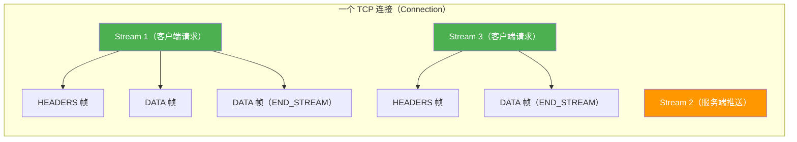
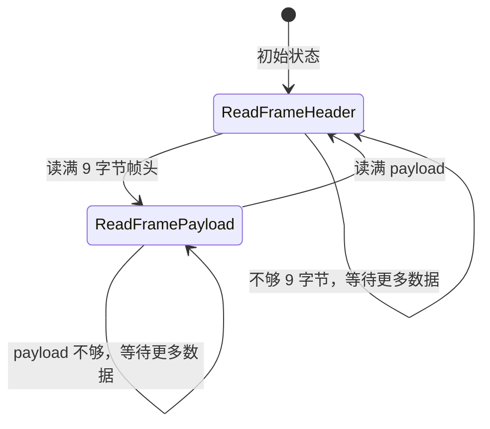
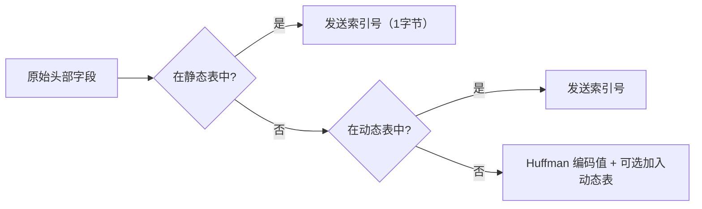
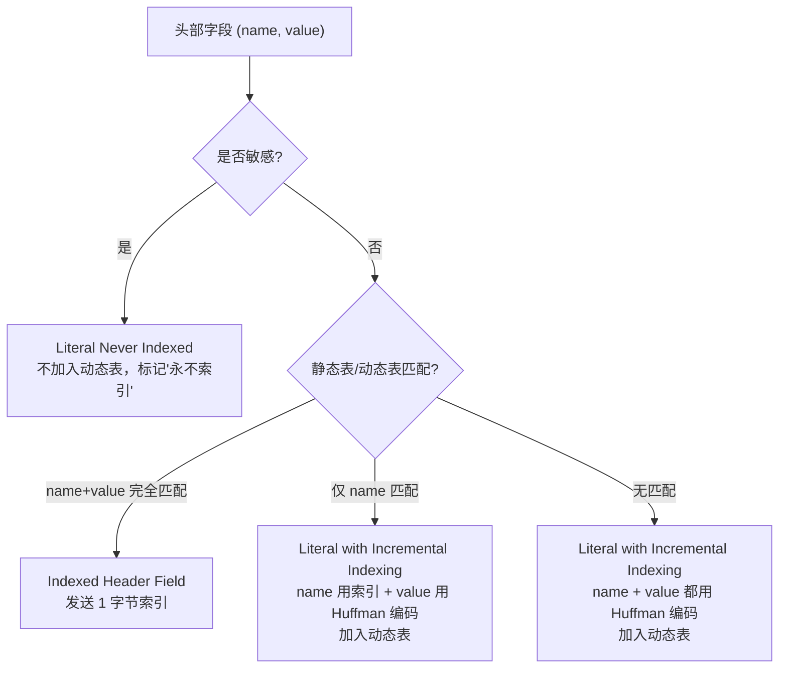
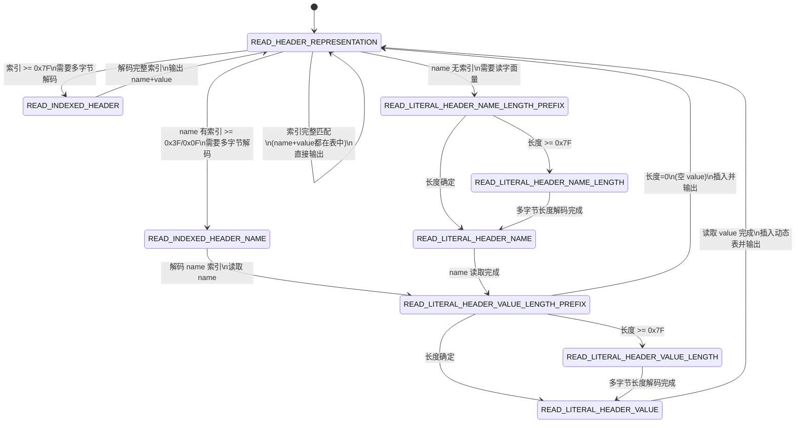

# 22-01 HTTP/2 协议基础与帧编解码

> **核心问题**：
> 1. HTTP/2 解决了 HTTP/1.1 的哪些问题？为什么需要二进制帧？
> 2. HTTP/2 帧的 9 字节帧头包含哪些字段？Netty 如何编解码？
> 3. HPACK 头部压缩的静态表、动态表、Huffman 编码分别是什么？Netty 如何实现？

---

## 一、解决什么问题

### 1.1 HTTP/1.1 的四大痛点

| 痛点 | 描述 | 后果 |
|------|------|------|
| **队头阻塞（HOL Blocking）** | 同一连接上的请求必须按顺序响应 | 一个慢请求阻塞所有后续请求 |
| **连接数爆炸** | 浏览器对每个域名开 6-8 个 TCP 连接来绕过 HOL | 服务端资源浪费、TCP 握手开销大 |
| **头部冗余** | 每次请求都携带完整的 Header（Cookie、User-Agent 等） | 带宽浪费，尤其移动网络 |
| **纯文本解析** | Header 以 `\r\n` 分隔的文本格式传输 | 解析效率低，边界判断复杂 |

### 1.2 HTTP/2 的核心设计

HTTP/2（RFC 7540）在**不改变 HTTP 语义**（方法、状态码、Header 字段含义不变）的前提下，重新设计了**传输层**：

| HTTP/2 特性 | 解决的痛点 | 核心机制 |
|-------------|-----------|---------|
| **多路复用（Multiplexing）** | 队头阻塞、连接数爆炸 | 一个 TCP 连接承载多个 Stream，请求/响应可交错传输 |
| **二进制帧（Binary Framing）** | 纯文本解析效率低 | 所有数据以二进制帧传输，固定 9 字节帧头 |
| **头部压缩（HPACK）** | 头部冗余 | 静态表 + 动态表 + Huffman 编码 |
| **服务端推送（Server Push）** | 需要客户端主动请求 | 服务端可主动推送资源（PUSH_PROMISE 帧） |
| **流优先级（Stream Priority）** | 资源优先级不可控 | 客户端可指定流的依赖关系和权重 |

### 1.3 核心概念关系



**三层抽象**：
- **连接（Connection）**：一个 TCP 连接，承载所有 Stream
- **流（Stream）**：一个逻辑双向通道，承载一个完整的请求/响应对
- **帧（Frame）**：最小传输单元，所有数据都以帧传输

> 🔥 **面试关键**：HTTP/2 的"多路复用"本质是在一个 TCP 连接内用 **Stream ID** 标识不同的请求/响应，帧可以交错传输，在接收端按 Stream ID 重新组装。

---

## 二、帧结构：9 字节帧头

### 2.1 问题推导

HTTP/2 的所有通信都基于帧，所以帧的格式决定了整个协议的编解码效率。帧结构需要：
- **快速定界**：定长帧头，一次读取就能知道载荷长度
- **类型区分**：不同帧有不同语义（数据、头部、控制）
- **流标识**：标明帧属于哪个 Stream
- **标志位**：携带帧的附加信息（如是否结束流）

### 2.2 帧格式（RFC 7540 §4.1）

```
+-----------------------------------------------+
|                Length (24)                     |
+---------------+-------------------------------+
|   Type (8)    |   Flags (8)                   |
+-+-------------+-------------------------------+
|R|           Stream Identifier (31)            |
+=+=============+===============================+
|                Frame Payload ...              |
+-----------------------------------------------+
```

| 字段 | 长度 | 描述 |
|------|------|------|
| **Length** | 3 字节（24 bit） | 载荷长度（不含 9 字节帧头），默认最大 16384（`2^14`），可通过 SETTINGS 调整到 16777215（`2^24 - 1`） |
| **Type** | 1 字节（8 bit） | 帧类型（DATA=0x0, HEADERS=0x1, ... 共 10 种） |
| **Flags** | 1 字节（8 bit） | 标志位，含义取决于帧类型 |
| **R** | 1 bit | 保留位，必须为 0 |
| **Stream Identifier** | 31 bit | 流标识符，0 表示连接级帧 |

> ⚠️ **帧头固定 9 字节**：`FRAME_HEADER_LENGTH = 9`，这是 HTTP/2 与 HTTP/1.1 文本格式最大的区别——接收方只需读 9 字节就能确定后续需要读多少数据。

### 2.3 Netty 中的帧头编解码

#### 写入帧头：`Http2CodecUtil.writeFrameHeaderInternal()`

```java
// Http2CodecUtil.java — 帧头写入
static void writeFrameHeaderInternal(ByteBuf out, int payloadLength, byte type,
        Http2Flags flags, int streamId) {
    out.writeMedium(payloadLength);    // 3 字节：载荷长度
    out.writeByte(type);               // 1 字节：帧类型
    out.writeByte(flags.value());      // 1 字节：标志位
    out.writeInt(streamId);            // 4 字节：R(1bit) + Stream ID(31bit)
}
```

<!-- 核对记录：已对照 Http2CodecUtil.writeFrameHeaderInternal() 源码，差异：无 -->

#### 读取帧头：`DefaultHttp2FrameReader.readFrame()`

`DefaultHttp2FrameReader` 是一个**两阶段状态机**：



**核心逻辑**：
1. **阶段1**：累积 9 字节帧头，解析出 `payloadLength`、`frameType`、`flags`、`streamId`
2. **阶段2**：累积 `payloadLength` 字节载荷，按 `frameType` 分派到对应的处理方法

### 2.4 十种标准帧类型 🔥

```java
// Http2FrameTypes.java — Netty 4.2.9 源码
public static final byte DATA          = 0x0;   // 传输请求/响应体
public static final byte HEADERS       = 0x1;   // 传输 HTTP 头部（开启新 Stream）
public static final byte PRIORITY      = 0x2;   // 指定流优先级
public static final byte RST_STREAM    = 0x3;   // 终止一个流
public static final byte SETTINGS      = 0x4;   // 连接级配置参数
public static final byte PUSH_PROMISE  = 0x5;   // 服务端推送预告
public static final byte PING          = 0x6;   // 连接保活 / RTT 测量
public static final byte GO_AWAY       = 0x7;   // 优雅关闭连接
public static final byte WINDOW_UPDATE = 0x8;   // 流控窗口更新
public static final byte CONTINUATION  = 0x9;   // HEADERS/PUSH_PROMISE 的续帧
```

<!-- 核对记录：已对照 Http2FrameTypes.java 源码，差异：无 -->

按功能分类：

| 分类 | 帧类型 | 说明 |
|------|--------|------|
| **数据传输** | DATA | 携带请求/响应体，受流控限制 |
| **头部传输** | HEADERS, CONTINUATION | 携带 HTTP 头部，HEADERS 开启新 Stream |
| **流控制** | WINDOW_UPDATE | 更新流控窗口大小（连接级 / 流级） |
| **连接管理** | SETTINGS, PING, GO_AWAY | 协商参数、保活、优雅关闭 |
| **流管理** | RST_STREAM, PRIORITY | 终止流、调整优先级 |
| **服务端推送** | PUSH_PROMISE | 预告即将推送的资源 |

### 2.5 标志位（Flags）

```java
// Http2Flags.java — Netty 4.2.9 源码
public static final short END_STREAM  = 0x1;    // 流结束（DATA, HEADERS）
public static final short END_HEADERS = 0x4;    // 头部结束（HEADERS, CONTINUATION）
public static final short ACK         = 0x1;    // 确认（SETTINGS, PING）
public static final short PADDED      = 0x8;    // 含填充（DATA, HEADERS）
public static final short PRIORITY    = 0x20;   // 含优先级（HEADERS）
```

<!-- 核对记录：已对照 Http2Flags.java 源码，差异：无 -->

> ⚠️ **注意**：`END_STREAM` 和 `ACK` 的值都是 `0x1`，但它们应用于不同的帧类型，不会冲突。

**关键标志位语义**：

| 标志 | 值 | 适用帧 | 含义 |
|------|-----|--------|------|
| `END_STREAM` | 0x1 | DATA, HEADERS | 发送方不会再发送该 Stream 的帧 |
| `END_HEADERS` | 0x4 | HEADERS, CONTINUATION | 头部块传输完毕，无需后续 CONTINUATION |
| `ACK` | 0x1 | SETTINGS, PING | 对 SETTINGS/PING 的确认回复 |
| `PADDED` | 0x8 | DATA, HEADERS | 帧尾有填充字节（用于混淆帧大小） |
| `PRIORITY` | 0x20 | HEADERS | 包含 Stream 依赖和权重字段 |

---

## 三、协议核心常量

Netty 在 `Http2CodecUtil` 中定义了所有协议常量：

```java
// Http2CodecUtil.java — 关键常量
public static final int FRAME_HEADER_LENGTH = 9;            // 帧头固定长度
public static final int DEFAULT_WINDOW_SIZE = 65535;         // 默认流控窗口（64KB - 1）
public static final int DEFAULT_MAX_FRAME_SIZE = 0x4000;     // 默认最大帧大小（16KB）
public static final int MAX_FRAME_SIZE_UPPER_BOUND = 0xffffff; // 最大帧大小上限（16MB - 1）
public static final int DEFAULT_HEADER_TABLE_SIZE = 4096;    // HPACK 默认动态表大小
public static final long DEFAULT_HEADER_LIST_SIZE = 8192;    // 默认头部列表大小限制

// Connection Preface：客户端必须先发送的魔术字节
// "PRI * HTTP/2.0\r\n\r\nSM\r\n\r\n"（24 字节）
```

<!-- 核对记录：已对照 Http2CodecUtil.java 源码，差异：无 -->

**SETTINGS 参数标识**（也是 `char` 类型常量）：

| 常量 | 值 | 默认值 | 含义 |
|------|-----|--------|------|
| `SETTINGS_HEADER_TABLE_SIZE` | 1 | 4096 | HPACK 动态表大小 |
| `SETTINGS_ENABLE_PUSH` | 2 | 1（开启） | 是否允许服务端推送 |
| `SETTINGS_MAX_CONCURRENT_STREAMS` | 3 | 无限制 | 最大并发 Stream 数 |
| `SETTINGS_INITIAL_WINDOW_SIZE` | 4 | 65535 | 初始流控窗口大小 |
| `SETTINGS_MAX_FRAME_SIZE` | 5 | 16384 | 最大帧载荷大小 |
| `SETTINGS_MAX_HEADER_LIST_SIZE` | 6 | 8192（Netty默认） | 头部列表最大字节数 |

---

## 四、HPACK 头部压缩

### 4.1 为什么需要头部压缩

HTTP 头部存在大量重复：
- 同一连接的多个请求，`Host`、`User-Agent`、`Cookie` 基本不变
- 响应头的 `Server`、`Content-Type` 也高度重复
- HTTP/1.1 每次都完整传输这些头部，浪费 **100-500 字节/请求**

HPACK（RFC 7541）通过三种机制压缩头部：

### 4.2 三种压缩机制



#### 机制1：静态表（Static Table）

RFC 7541 定义了 61 个常见头部字段的索引：

| 索引 | Header Name | Header Value |
|------|------------|--------------|
| 1 | `:authority` | （空） |
| 2 | `:method` | `GET` |
| 3 | `:method` | `POST` |
| 4 | `:path` | `/` |
| 5 | `:path` | `/index.html` |
| 6 | `:scheme` | `http` |
| 7 | `:scheme` | `https` |
| 8 | `:status` | `200` |
| ... | ... | ... |
| 61 | `www-authenticate` | （空） |

Netty 实现：`HpackStaticTable.java`，包含 61 个 `HpackHeaderField` 条目。

#### 机制2：动态表（Dynamic Table）

- **FIFO 环形缓冲区**，新条目在头部插入，旧条目从尾部淘汰
- 大小由 `SETTINGS_HEADER_TABLE_SIZE` 控制（默认 4096 字节）
- 索引从 62 开始（接在静态表之后）

Netty 实现：`HpackDynamicTable.java`

```java
// HpackDynamicTable.java 核心字段
final class HpackDynamicTable {
    HpackHeaderField[] hpackHeaderFields;  // 环形数组
    int head;                              // 头指针（最新条目）
    int tail;                              // 尾指针（最老条目）
    private long size;                     // 当前字节大小
    private long capacity;                 // 最大容量（字节）
}
```

**条目大小计算**（RFC 7541 §4.1）：
```
条目大小 = name 字节数 + value 字节数 + 32（固定开销）
```

#### 机制3：Huffman 编码

使用 RFC 7541 附录 B 定义的静态 Huffman 表，为 HTTP 头部常见字符（小写字母、数字、常见符号）分配更短的编码。

Netty 实现：`HpackHuffmanEncoder.java` / `HpackHuffmanDecoder.java`

### 4.3 Netty HPACK 编码流程

```java
// HpackEncoder.encodeHeaders() — 入口
public void encodeHeaders(int streamId, ByteBuf out, Http2Headers headers,
        SensitivityDetector sensitivityDetector) throws Http2Exception {
    if (ignoreMaxHeaderListSize) {
        encodeHeadersIgnoreMaxHeaderListSize(out, headers, sensitivityDetector);
    } else {
        encodeHeadersEnforceMaxHeaderListSize(streamId, out, headers, sensitivityDetector);
    }
}
```

<!-- 核对记录：已对照 HpackEncoder.encodeHeaders() 源码，差异：无 -->

编码单个头部字段的策略：



> 🔥 **面试高频**：HPACK 为什么不用 gzip？因为 gzip 存在 CRIME 攻击漏洞——攻击者可以通过控制请求头部内容、观察压缩后大小变化来猜测 Cookie 等敏感值。HPACK 使用静态 Huffman + 索引表的方式，不存在这个安全隐患。

---

## 五、错误码

HTTP/2 定义了 14 种错误码，用于 RST_STREAM 和 GO_AWAY 帧：

```java
// Http2Error.java — Netty 4.2.9 源码
public enum Http2Error {
    NO_ERROR(0x0),              // 正常关闭
    PROTOCOL_ERROR(0x1),        // 协议错误
    INTERNAL_ERROR(0x2),        // 内部错误
    FLOW_CONTROL_ERROR(0x3),    // 流控错误（窗口溢出）
    SETTINGS_TIMEOUT(0x4),      // SETTINGS ACK 超时
    STREAM_CLOSED(0x5),         // 在已关闭的流上操作
    FRAME_SIZE_ERROR(0x6),      // 帧大小不合法
    REFUSED_STREAM(0x7),        // 拒绝流（未处理就关闭）
    CANCEL(0x8),                // 取消流
    COMPRESSION_ERROR(0x9),     // HPACK 解压错误
    CONNECT_ERROR(0xA),         // CONNECT 方法错误
    ENHANCE_YOUR_CALM(0xB),     // 对方行为异常，要求降速
    INADEQUATE_SECURITY(0xC),   // TLS 安全等级不足
    HTTP_1_1_REQUIRED(0xD);     // 必须使用 HTTP/1.1
}
```

<!-- 核对记录：已对照 Http2Error.java 源码，差异：无 -->

> ⚠️ **生产踩坑**：`ENHANCE_YOUR_CALM`（0xB）是对端告知"你太激进了，请降速"。常见于客户端发送过多 RST_STREAM 或频繁重建 Stream。gRPC 中看到这个错误通常意味着服务端认为客户端行为异常。

---

## 六、DefaultHttp2FrameReader 源码深入分析

> §2.3 只给出了两阶段状态机的示意图，这里补充**完整的源码逐行分析**。

### 6.1 readFrame() 主循环

**源码位置**：`DefaultHttp2FrameReader.java` 第 137-176 行

```java
// DefaultHttp2FrameReader.readFrame() — 帧读取主循环
@Override
public void readFrame(ChannelHandlerContext ctx, ByteBuf input, Http2FrameListener listener)
        throws Http2Exception {
    if (readError) {
        input.skipBytes(input.readableBytes());  // ① 已出错，跳过所有数据
        return;
    }
    try {
        do {
            if (readingHeaders && !preProcessFrame(input)) {
                return;                          // ② 帧头不够 9 字节，等待更多数据
            }
            // ③ 帧头已解析完毕，等待载荷
            if (input.readableBytes() < payloadLength) {
                return;                          // ④ 载荷不够，等待更多数据
            }
            // ⑤ 切片出精确的载荷区间（零拷贝，不复制数据）
            ByteBuf framePayload = input.readSlice(payloadLength);
            readingHeaders = true;               // ⑥ 下一轮读新帧头
            verifyFrameState();                  // ⑦ 校验帧合法性（类型+标志+流ID组合）
            processPayloadState(ctx, framePayload, listener);  // ⑧ 按帧类型分派
        } while (input.isReadable());            // ⑨ 循环处理同一个 ByteBuf 中的多个帧
    } catch (Http2Exception e) {
        readError = !Http2Exception.isStreamError(e);  // ⑩ 连接级错误标记为不可恢复
        throw e;
    } catch (RuntimeException e) {
        readError = true;
        throw e;
    } catch (Throwable cause) {
        readError = true;
        PlatformDependent.throwException(cause);
    }
}
```

<!-- 核对记录：已对照 DefaultHttp2FrameReader.readFrame() 源码（第137-176行），差异：无 -->

**关键设计决策**：

| 设计点 | 说明 |
|--------|------|
| `readSlice` 而非 `readBytes` | 零拷贝——不复制数据，直接在原 ByteBuf 上创建切片视图，减少内存分配 |
| `do-while` 循环 | 一次 `channelRead` 可能带来多个完整帧，必须循环处理直到数据不够 |
| `readError` 标志 | 一旦出现连接级错误（如帧大小超限），后续所有数据都直接跳过 |
| `isStreamError` 判断 | Stream 级错误不影响其他 Stream，只标记 `readError=false` |

### 6.2 preProcessFrame() — 帧头解析

**源码位置**：`DefaultHttp2FrameReader.java` 第 178-196 行

```java
// DefaultHttp2FrameReader.preProcessFrame() — 解析 9 字节帧头
private boolean preProcessFrame(ByteBuf in) throws Http2Exception {
    if (in.readableBytes() < FRAME_HEADER_LENGTH) {
        return false;                              // ① 不够 9 字节，返回等待
    }
    payloadLength = in.readUnsignedMedium();       // ② 3 字节：载荷长度（0 ~ 16777215）
    if (payloadLength > maxFrameSize) {
        throw connectionError(FRAME_SIZE_ERROR,    // ③ 超过 SETTINGS_MAX_FRAME_SIZE → 连接错误
                "Frame length: %d exceeds maximum: %d", payloadLength, maxFrameSize);
    }
    frameType = in.readByte();                     // ④ 1 字节：帧类型
    flags = new Http2Flags(in.readUnsignedByte()); // ⑤ 1 字节：标志位
    streamId = readUnsignedInt(in);                // ⑥ 4 字节：R(1bit，忽略) + Stream ID(31bit)
    readingHeaders = false;                        // ⑦ 标记进入载荷读取阶段
    return true;
}
```

<!-- 核对记录：已对照 DefaultHttp2FrameReader.preProcessFrame() 源码（第178-196行），差异：无 -->

### 6.3 processPayloadState() — 帧类型分派

**源码位置**：`DefaultHttp2FrameReader.java` 第 236-287 行

```java
// DefaultHttp2FrameReader.processPayloadState() — 按帧类型分派到对应处理方法
private void processPayloadState(ChannelHandlerContext ctx, ByteBuf in,
        Http2FrameListener listener) throws Http2Exception {
    assert in.readableBytes() == payloadLength;  // 载荷长度必须精确匹配
    switch (frameType) {
        case DATA:          readDataFrame(ctx, in, listener);       break;
        case HEADERS:       readHeadersFrame(ctx, in, listener);    break;
        case PRIORITY:      readPriorityFrame(ctx, in, listener);   break;
        case RST_STREAM:    readRstStreamFrame(ctx, in, listener);  break;
        case SETTINGS:      readSettingsFrame(ctx, in, listener);   break;
        case PUSH_PROMISE:  readPushPromiseFrame(ctx, in, listener);break;
        case PING:          readPingFrame(ctx, in.readLong(), listener); break;  // PING 载荷固定 8 字节
        case GO_AWAY:       readGoAwayFrame(ctx, in, listener);     break;
        case WINDOW_UPDATE: readWindowUpdateFrame(ctx, in, listener);break;
        case CONTINUATION:  readContinuationFrame(in, listener);    break;
        default:            readUnknownFrame(ctx, in, listener);    break;  // 扩展帧类型
    }
}
```

<!-- 核对记录：已对照 DefaultHttp2FrameReader.processPayloadState() 源码（第236-287行），差异：无 -->

> ⚠️ **注意 PING 帧**：`in.readLong()` 直接读 8 字节（long），因为 RFC 7540 规定 PING 的载荷**必须**是 8 字节。

---

## 七、HpackDynamicTable 环形缓冲区源码分析

> §4.2 只展示了字段定义，这里深入分析**增删查的完整算法**。

### 7.1 数据结构

```java
// HpackDynamicTable.java — 完整字段
final class HpackDynamicTable {
    HpackHeaderField[] hpackHeaderFields;  // 环形数组（非 ArrayList，避免扩容/移动开销）
    int head;                              // 头指针：指向下一个插入位置（最新条目之后）
    int tail;                              // 尾指针：指向最老的条目
    private long size;                     // 当前总字节大小（所有条目 name+value+32 之和）
    private long capacity;                 // 最大容量（字节），由 SETTINGS_HEADER_TABLE_SIZE 控制
}
```

**内存布局示意**（容量=128，已有 3 个条目）：

```
hpackHeaderFields[]:
  [0]  [1]  [2]  [3]  [4]  [5]  ...
   ↑              ↑
  tail            head
  (最老)          (下一个插入位置)

  条目顺序：[0]=最老  [1]=中间  [2]=最新
  HPACK 索引：getEntry(1)=最新=[2], getEntry(3)=最老=[0]
```

> 🔥 **面试注意**：HPACK 的索引规则是 **1=最新，N=最老**（与数组下标相反），`getEntry()` 需要倒序映射。

### 7.2 add() — 添加新条目

**源码位置**：`HpackDynamicTable.java` 第 102-117 行

```java
// HpackDynamicTable.add() — 添加头部字段到动态表
public void add(HpackHeaderField header) {
    int headerSize = header.size();     // ① name.length + value.length + 32（RFC 7541 §4.1）
    if (headerSize > capacity) {
        clear();                        // ② 条目比整个表都大 → 清空表（RFC 规定）
        return;
    }
    while (capacity - size < headerSize) {
        remove();                       // ③ 空间不够 → 从尾部（最老）开始淘汰
    }
    hpackHeaderFields[head++] = header; // ④ 在 head 位置插入，head 前进
    size += headerSize;
    if (head == hpackHeaderFields.length) {
        head = 0;                       // ⑤ 环形：到达数组末尾时回绕到 0
    }
}
```

<!-- 核对记录：已对照 HpackDynamicTable.add() 源码（第102-117行），差异：无 -->

### 7.3 remove() — 淘汰最老条目

**源码位置**：`HpackDynamicTable.java` 第 122-133 行

```java
// HpackDynamicTable.remove() — 移除最老的条目
public HpackHeaderField remove() {
    HpackHeaderField removed = hpackHeaderFields[tail]; // ① 取出尾部（最老）条目
    if (removed == null) {
        return null;                                     // ② 空表保护
    }
    size -= removed.size();                              // ③ 减去字节大小
    hpackHeaderFields[tail++] = null;                    // ④ 置 null 帮助 GC，tail 前进
    if (tail == hpackHeaderFields.length) {
        tail = 0;                                        // ⑤ 环形回绕
    }
    return removed;
}
```

<!-- 核对记录：已对照 HpackDynamicTable.remove() 源码（第122-133行），差异：无 -->

### 7.4 getEntry() — 按 HPACK 索引查找

**源码位置**：`HpackDynamicTable.java` 第 85-94 行

```java
// HpackDynamicTable.getEntry() — 按 HPACK 索引（1=最新）查找
public HpackHeaderField getEntry(int index) {
    if (index <= 0 || index > length()) {
        throw new IndexOutOfBoundsException(
                "Index " + index + " out of bounds for length " + length());
    }
    int i = head - index;              // ① HPACK 索引 1=最新=head-1，反向计算
    if (i < 0) {
        return hpackHeaderFields[i + hpackHeaderFields.length]; // ② 负数回绕
    } else {
        return hpackHeaderFields[i];
    }
}
```

<!-- 核对记录：已对照 HpackDynamicTable.getEntry() 源码（第85-94行），差异：无 -->

### 7.5 setCapacity() — 调整容量（SETTINGS 触发）

**源码位置**：`HpackDynamicTable.java` 第 149-200 行

```java
// HpackDynamicTable.setCapacity() — 动态调整表大小
public void setCapacity(long capacity) {
    if (capacity < MIN_HEADER_TABLE_SIZE || capacity > MAX_HEADER_TABLE_SIZE) {
        throw new IllegalArgumentException("capacity is invalid: " + capacity);
    }
    if (this.capacity == capacity) {
        return;                          // ① 容量不变，直接返回
    }
    this.capacity = capacity;

    if (capacity == 0) {
        clear();                         // ② 容量为 0 → 清空（禁用动态表）
    } else {
        while (size > capacity) {
            remove();                    // ③ 容量缩小 → 从尾部淘汰直到满足
        }
    }
    // ④ 重新计算数组大小：最大条目数 = capacity / 32（每条至少 32 字节开销）
    int maxEntries = (int) (capacity / HpackHeaderField.HEADER_ENTRY_OVERHEAD);
    if (capacity % HpackHeaderField.HEADER_ENTRY_OVERHEAD != 0) {
        maxEntries++;
    }
    if (hpackHeaderFields != null && hpackHeaderFields.length == maxEntries) {
        return;                          // ⑤ 数组大小不变，无需重新分配
    }
    // ⑥ 重新分配数组，把现有条目复制过去（重置 head/tail）
    HpackHeaderField[] tmp = new HpackHeaderField[maxEntries];
    int len = length();
    if (hpackHeaderFields != null) {
        int cursor = tail;
        for (int i = 0; i < len; i++) {
            HpackHeaderField entry = hpackHeaderFields[cursor++];
            tmp[i] = entry;
            if (cursor == hpackHeaderFields.length) {
                cursor = 0;              // ⑦ 环形遍历
            }
        }
    }
    tail = 0;
    head = tail + len;
    hpackHeaderFields = tmp;
}
```

<!-- 核对记录：已对照 HpackDynamicTable.setCapacity() 源码（第149-200行），差异：无 -->

> **为什么不用 `ArrayList`？** 因为动态表的操作模式是 FIFO（头部插入、尾部淘汰），环形数组在这种场景下：① 无需移动元素（O(1) 插入/删除）②无需动态扩容（容量由 SETTINGS 确定）③内存局部性更好。

---

## 八、HpackDecoder 状态机源码分析

> §4 只展示了编码策略的流程图，这里补充**解码器的 9 状态状态机**和**核心源码**。

### 8.1 解码状态机

`HpackDecoder.decode()` 是一个**9 状态的有限状态机**，逐字节解析 HPACK 编码的头部块：

```java
// HpackDecoder.java — 状态常量
private static final byte READ_HEADER_REPRESENTATION = 0;         // 初始：读取表示类型
private static final byte READ_INDEXED_HEADER = 1;                // 读索引值（>127时多字节）
private static final byte READ_INDEXED_HEADER_NAME = 2;           // 读 name 的索引值
private static final byte READ_LITERAL_HEADER_NAME_LENGTH_PREFIX = 3; // 读 name 长度前缀
private static final byte READ_LITERAL_HEADER_NAME_LENGTH = 4;    // 读 name 长度（多字节）
private static final byte READ_LITERAL_HEADER_NAME = 5;           // 读 name 字面量
private static final byte READ_LITERAL_HEADER_VALUE_LENGTH_PREFIX = 6; // 读 value 长度前缀
private static final byte READ_LITERAL_HEADER_VALUE_LENGTH = 7;   // 读 value 长度（多字节）
private static final byte READ_LITERAL_HEADER_VALUE = 8;          // 读 value 字面量
```

<!-- 核对记录：已对照 HpackDecoder.java 状态常量（第80-88行），差异：无 -->



### 8.2 decode() 入口 — 表示类型判定

**源码位置**：`HpackDecoder.java` 第 152-180 行

```java
// HpackDecoder.decode() — 第一字节判定表示类型
private void decode(ByteBuf in, Http2HeadersSink sink) throws Http2Exception {
    int index = 0;
    int nameLength = 0;
    int valueLength = 0;
    byte state = READ_HEADER_REPRESENTATION;
    boolean huffmanEncoded = false;
    AsciiString name = null;
    IndexType indexType = IndexType.NONE;

    while (in.isReadable()) {
        switch (state) {
            case READ_HEADER_REPRESENTATION:
                byte b = in.readByte();
                if (b < 0) {
                    // ① 最高位=1 → Indexed Header Field（完全索引匹配）
                    //    二进制：1xxxxxxx → index = b & 0x7F
                    index = b & 0x7F;
                    if (index == 0) {
                        throw DECODE_ILLEGAL_INDEX_VALUE;  // 索引 0 不合法
                    } else if (index == 0x7F) {
                        state = READ_INDEXED_HEADER;       // 索引 >= 127，需要多字节解码
                    } else {
                        // 索引 < 127，直接查表输出
                        HpackHeaderField indexedHeader = getIndexedHeader(index);
                        sink.appendToHeaderList(indexedHeader.name, indexedHeader.value);
                    }
                } else if ((b & 0x40) == 0x40) {
                    // ② 次高位=01 → Literal with Incremental Indexing（加入动态表）
                    //    二进制：01xxxxxx → index = b & 0x3F
                    indexType = IndexType.INCREMENTAL;
                    index = b & 0x3F;
                    // ... 根据 index 值决定下一状态
                } else if ((b & 0x20) == 0x20) {
                    // ③ 001xxxxx → Dynamic Table Size Update
                    throw connectionError(COMPRESSION_ERROR,
                        "Dynamic table size update must happen at the beginning");
                } else {
                    // ④ 0000xxxx → Literal without Indexing / Never Indexed
                    indexType = (b & 0x10) == 0x10 ? IndexType.NEVER : IndexType.NONE;
                    index = b & 0x0F;
                    // ... 根据 index 值决定下一状态
                }
                break;
            // ... 其他状态处理
        }
    }
}
```

<!-- 核对记录：已对照 HpackDecoder.decode() 源码（第152-220行），差异：省略了 case 内部 switch(index) 的子分支 -->

**第一字节的位模式判定**：

| 位模式 | 含义 | HPACK 规范 | IndexType |
|--------|------|-----------|-----------|
| `1xxxxxxx` | Indexed Header Field | §6.1 | 直接查表 |
| `01xxxxxx` | Literal with Incremental Indexing | §6.2.1 | INCREMENTAL |
| `001xxxxx` | Dynamic Table Size Update | §6.3 | — |
| `0001xxxx` | Literal Never Indexed | §6.2.3 | NEVER |
| `0000xxxx` | Literal without Indexing | §6.2.2 | NONE |

> 🔥 **面试要点**：HPACK 解码器是一个**纯字节级状态机**，不依赖任何分隔符。第一字节的高位比特决定表示类型，低位比特携带索引值或长度的前缀。如果值太大（超过前缀比特能表达的范围），后续字节使用**变长整数编码**（类似 protobuf 的 varint）。

---

## 九、面试问答 🔥

### Q1：HTTP/2 的帧头为什么是固定 9 字节？为什么不做成变长？

**回答**：固定 9 字节帧头是 HTTP/2 协议效率的基石：
- **快速定界**：接收方只需一次读取（readUnsignedMedium + readByte + readByte + readInt）就能确定帧的长度、类型和归属的 Stream
- **对比 HTTP/1.1**：文本分隔的 Header 需要逐字节扫描 `\r\n`，无法预知长度
- **不做变长的原因**：9 字节在海量帧场景下的开销可以忽略（万分之一级别），而变长编码会增加**解析分支**和**状态保持的复杂度**

Netty 对应实现是 `DefaultHttp2FrameReader.preProcessFrame()`，直接读 3+1+1+4=9 字节。

### Q2：HPACK 动态表为什么用环形数组而不是 LinkedList？

**回答**：因为动态表的操作模式完全匹配环形数组的优势：
- **操作模式**：FIFO（头部插入新条目，尾部淘汰旧条目）
- **环形数组优势**：O(1) 插入和删除，无需移动元素，无 GC 压力（不产生 Node 对象），CPU 缓存友好
- **LinkedList 劣势**：每个 Node 对象 32 字节开销，GC 压力大，随机访问 O(n)
- **不需要动态扩容**：容量由 `SETTINGS_HEADER_TABLE_SIZE` 确定，`setCapacity()` 时一次性分配

### Q3：HPACK 解码器为什么是状态机而不是递归下降？

**回答**：
- HPACK 头部块可能跨帧传输（CONTINUATION 帧），**解码过程必须可中断和恢复**
- 状态机天然支持"读到一半数据不够→保存状态→等下次数据到来→继续解码"
- 递归下降解析器在数据不够时需要抛异常回退，代码更复杂且性能更差
- Netty 的 `HpackDecoder` 有 9 个状态，对应解码的不同阶段，每个字节都推进一次状态转换

---

## 十、本篇小结

| 概念 | 关键点 | Netty 类 |
|------|--------|---------|
| 帧头 | 固定 9 字节，3B长度 + 1B类型 + 1B标志 + 4B流ID | `Http2CodecUtil` |
| 帧类型 | 10 种标准帧，DATA/HEADERS 最常用 | `Http2FrameTypes` |
| 标志位 | END_STREAM/END_HEADERS/ACK/PADDED/PRIORITY | `Http2Flags` |
| HPACK | 静态表(61条) + 动态表(FIFO) + Huffman | `HpackEncoder/HpackDecoder` |
| 错误码 | 14 种，区分连接级错误和流级错误 | `Http2Error` |
| 帧读取 | 两阶段状态机（读帧头 → 读载荷） | `DefaultHttp2FrameReader` |
| 帧写入 | 按帧类型组装 9 字节帧头 + 载荷 | `DefaultHttp2FrameWriter` |

> **下一篇**：[02-连接模型、流状态机与流控机制](./02-http2-connection-stream-flowcontrol.md) —— 深入 `Http2Connection`、`Http2Stream` 状态机和双层流控。
