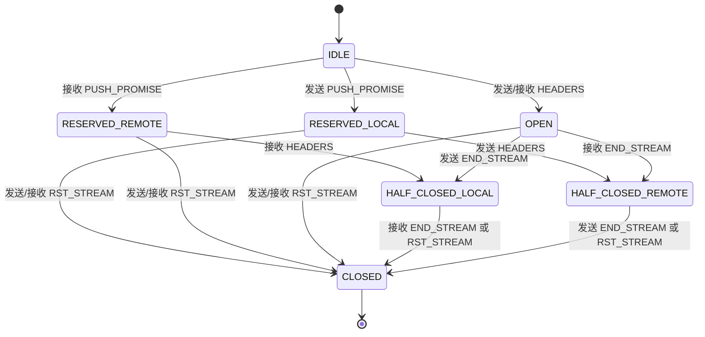
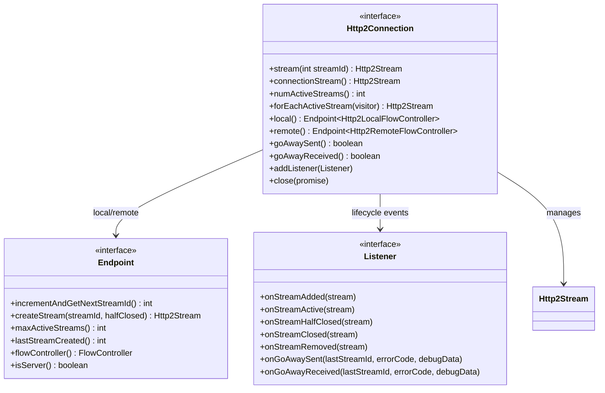
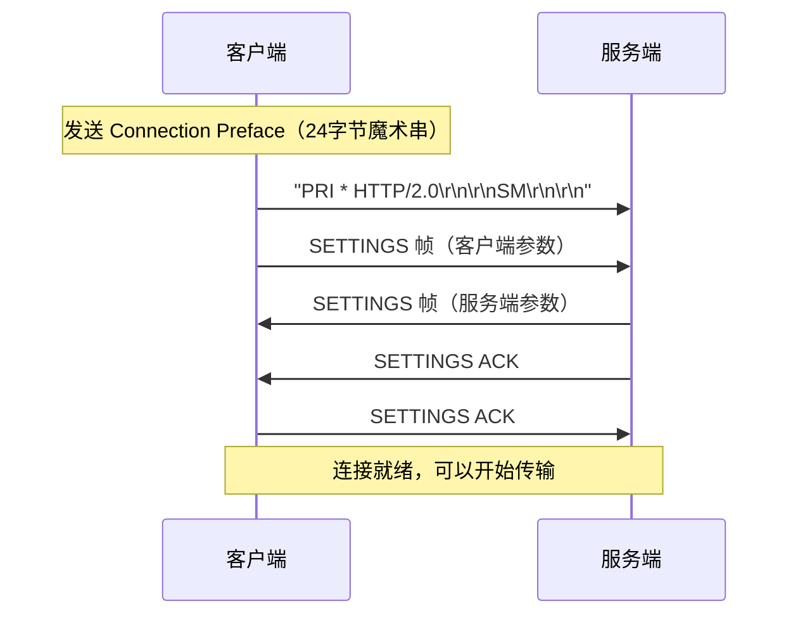
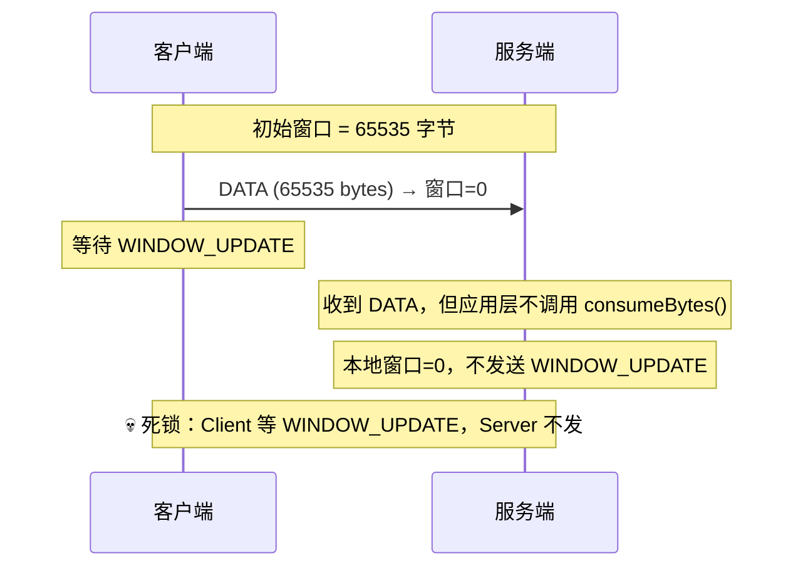

# 22-02 连接模型、流状态机与流控机制

> **核心问题**：
> 1. HTTP/2 Stream 有哪些状态？状态转换的触发条件是什么？
> 2. 流控窗口是什么？为什么需要连接级和流级两层流控？
> 3. Netty 的 `Http2Connection`、`Http2Stream`、`FlowController` 如何协作？

---

## 一、流（Stream）状态机 🔥

### 1.1 问题推导

HTTP/2 的一个连接承载多个 Stream，每个 Stream 有自己的生命周期。需要一个**状态机**来：
- 跟踪每个 Stream 的当前状态（是否可以发送/接收数据）
- 防止非法操作（如在已关闭的 Stream 上发送数据）
- 决定何时可以安全回收 Stream 资源

### 1.2 七种状态（RFC 7540 §5.1）

```java
// Http2Stream.State — Netty 4.2.9 源码
public enum State {
    IDLE(false, false),                    // 初始状态
    RESERVED_LOCAL(false, false),          // 本端预留（PUSH_PROMISE 发送方）
    RESERVED_REMOTE(false, false),         // 远端预留（PUSH_PROMISE 接收方）
    OPEN(true, true),                      // 双向开放
    HALF_CLOSED_LOCAL(false, true),        // 本端半关闭（已发 END_STREAM）
    HALF_CLOSED_REMOTE(true, false),       // 远端半关闭（已收 END_STREAM）
    CLOSED(false, false);                  // 完全关闭

    private final boolean localSideOpen;   // 本端是否可发送
    private final boolean remoteSideOpen;  // 远端是否可发送
}
```

<!-- 核对记录：已对照 Http2Stream.State 源码，差异：无 -->

### 1.3 状态转换图



**典型的请求-响应流程**（客户端发起）：

```
客户端                              服务端
  |                                   |
  |-- HEADERS (END_STREAM) -------->  |   Stream: IDLE -> OPEN -> HALF_CLOSED_LOCAL
  |                                   |   Stream: IDLE -> OPEN -> HALF_CLOSED_REMOTE
  |<-------- HEADERS --------------|  |
  |<-------- DATA (END_STREAM) ---|  |   Stream -> CLOSED (双方都发了 END_STREAM)
  |                                   |
```

> 🔥 **面试关键**：`HALF_CLOSED_LOCAL` 意味着"我不再发送了，但还能接收"（适用于客户端发完请求等待响应）。`HALF_CLOSED_REMOTE` 意味着"对方不再发送了，但我还能发送"。

### 1.4 Stream ID 分配规则

| 规则 | 说明 |
|------|------|
| 客户端发起的 Stream 用**奇数** ID | 1, 3, 5, 7, ... |
| 服务端发起的 Stream 用**偶数** ID | 2, 4, 6, 8, ...（Server Push） |
| Stream 0 是**连接控制流** | SETTINGS、PING、GO_AWAY 等 |
| ID 单调递增，不可复用 | 用完 2^31 - 1 后必须新建连接 |

```java
// Http2CodecUtil.java
public static final int CONNECTION_STREAM_ID = 0;
public static final int HTTP_UPGRADE_STREAM_ID = 1;

// Http2Connection.Endpoint
public boolean isValidStreamId(int streamId) { ... }  // 判断是否符合奇偶规则
```

---

## 二、连接模型：`Http2Connection`

### 2.1 核心接口设计

`Http2Connection` 是 Netty HTTP/2 实现的核心抽象，管理一个连接中的所有 Stream：



### 2.2 本地端点 vs 远端端点

`Http2Connection` 维护两个 `Endpoint`：
- `local()`：代表本端（如果是服务端，则 local 管理偶数 ID 的 Stream）
- `remote()`：代表对端（客户端的 Stream 由 remote 管理）

```java
// DefaultHttp2Connection 构造（简化）
public DefaultHttp2Connection(boolean server, int maxReservedStreams) {
    // server=true: local 管理偶数，remote 管理奇数
    // server=false: local 管理奇数，remote 管理偶数
    localEndpoint = new DefaultEndpoint<>(server, server ? Integer.MAX_VALUE : 0);
    remoteEndpoint = new DefaultEndpoint<>(!server, server ? 0 : Integer.MAX_VALUE);
}
```

### 2.3 PropertyKey 机制

`Http2Connection` 支持给每个 Stream 附加自定义属性，通过 `PropertyKey` 机制实现：

```java
// 创建 key
PropertyKey streamKey = connection().newKey();

// 在 Stream 上存取数据
stream.setProperty(streamKey, myFrameStream);
MyFrameStream obj = stream.getProperty(streamKey);
```

这个机制被 `Http2FrameCodec` 大量使用——它用 `streamKey` 在每个 `Http2Stream` 上存储对应的 `DefaultHttp2FrameStream` 对象。

### 2.4 生命周期事件

`Http2Connection.Listener` 定义了 Stream 生命周期的 7 个事件：

| 事件 | 触发时机 | 典型用途 |
|------|---------|---------|
| `onStreamAdded` | Stream 对象创建后 | 初始化 Stream 绑定的资源 |
| `onStreamActive` | Stream 变为 OPEN 或 HALF_CLOSED | 创建子 Channel（多路复用） |
| `onStreamHalfClosed` | 一端发送 END_STREAM | 通知应用层 |
| `onStreamClosed` | Stream 完全关闭 | 回收资源、关闭子 Channel |
| `onStreamRemoved` | Stream 从连接中移除 | 清理索引 |
| `onGoAwaySent` | 发送 GO_AWAY | 停止创建新 Stream |
| `onGoAwayReceived` | 收到 GO_AWAY | 停止创建新 Stream，处理未完成请求 |

---

## 三、流控机制 🔥🔥

### 3.1 为什么需要流控

HTTP/2 多路复用意味着多个 Stream 共享一个 TCP 连接。没有流控会导致：
- **快生产者淹没慢消费者**：一个高吞吐的 Stream 占满 TCP 缓冲区，饿死其他 Stream
- **内存溢出**：接收方来不及处理的数据堆积在内存中

### 3.2 双层窗口模型

HTTP/2 使用基于信用的流控，有**两层窗口**：

```
┌──────────────────────────────────────────────┐
│              连接级窗口（Connection Window）     │
│           默认 65535 字节（64KB - 1）            │
│                                               │
│  ┌─────────┐  ┌─────────┐  ┌─────────┐      │
│  │ Stream 1 │  │ Stream 3 │  │ Stream 5 │      │
│  │ 窗口:65535│  │ 窗口:65535│  │ 窗口:65535│      │
│  └─────────┘  └─────────┘  └─────────┘      │
│                                               │
│  DATA 帧可发送量 = min(连接窗口, 流窗口)          │
└──────────────────────────────────────────────┘
```

**发送规则**：
1. 发送 DATA 帧前，检查 `min(连接级窗口, 流级窗口)` 是否 >= 帧大小
2. 发送后，两个窗口都减去发送的字节数
3. 接收方处理完数据后，发送 `WINDOW_UPDATE` 帧归还信用额度

### 3.3 Netty 的流控实现

Netty 把流控分为**本地流控**（控制接收）和**远端流控**（控制发送）：

| 类 | 角色 | 核心方法 |
|----|------|---------|
| `DefaultHttp2LocalFlowController` | 接收方，控制对端的发送速率 | `receiveFlowControlledFrame()`、`consumeBytes()` |
| `DefaultHttp2RemoteFlowController` | 发送方，受对端窗口限制 | `addFlowControlled()`、`writePendingBytes()` |

#### 接收端流控：`consumeBytes()`

```java
// DefaultHttp2LocalFlowController.java
public boolean consumeBytes(Http2Stream stream, int numBytes) throws Http2Exception {
    assert ctx != null && ctx.executor().inEventLoop();
    checkPositiveOrZero(numBytes, "numBytes");
    if (numBytes == 0) {
        return false;
    }
    // 已关闭的流忽略
    if (stream != null && !isClosed(stream)) {
        if (stream.id() == CONNECTION_STREAM_ID) {
            throw new UnsupportedOperationException(
                "Returning bytes for the connection window is not supported");
        }
        return consumeAllBytes(state(stream), numBytes);
    }
    return false;
}
```

<!-- 核对记录：已对照 DefaultHttp2LocalFlowController.consumeBytes() 源码，差异：无 -->

**流控核心逻辑**：
1. 接收到 DATA 帧 → `receiveFlowControlledFrame()` → 减少本地窗口
2. 应用层处理完数据 → `consumeBytes()` → 计算是否需要发送 WINDOW_UPDATE
3. 如果已消费字节超过窗口的一半 → 自动发送 WINDOW_UPDATE 归还信用额度

#### 发送端流控

`DefaultHttp2RemoteFlowController` 管理一个**待发送队列**，按流控窗口限流：
- `addFlowControlled(stream, payload)`：将数据加入待发送队列
- `writePendingBytes()`：按流控窗口批量发送

### 3.4 WINDOW_UPDATE 帧

```
+-----------------------------------------------+
|                Length = 4                      |
+---------------+-------------------------------+
|  Type = 0x8   |   Flags = 0x0                 |
+-+-------------+-------------------------------+
|R|           Stream Identifier (31)            |
+=+=============+===============================+
|R|        Window Size Increment (31)           |
+-----------------------------------------------+
```

- `Stream ID = 0`：更新**连接级**窗口
- `Stream ID > 0`：更新**流级**窗口
- `Window Size Increment`：增加的字节数（1 到 2^31 - 1）

> ⚠️ **生产踩坑**：如果应用层不及时 consume bytes，本地窗口会降为 0，对端无法再发送数据，导致请求"卡住"。这是 gRPC 流式调用中常见的死锁原因。

### 3.5 流控参数调优

| 参数 | 默认值 | 调优建议 | 说明 |
|------|--------|---------|------|
| `SETTINGS_INITIAL_WINDOW_SIZE` | 65535 (64KB-1) | 1MB-16MB | 高吞吐场景增大，减少 WINDOW_UPDATE 次数 |
| 连接级窗口 | 65535 (64KB-1) | N × 流级窗口 | 确保多个流不会互相饿死 |
| `SETTINGS_MAX_CONCURRENT_STREAMS` | 无限制 | 100-1000 | Netty 推荐 `SMALLEST_MAX_CONCURRENT_STREAMS = 100` |
| `SETTINGS_MAX_FRAME_SIZE` | 16384 (16KB) | 16KB-1MB | 大文件传输可增大 |

---

## 四、SETTINGS 帧交换

### 4.1 连接建立流程

HTTP/2 连接建立后，双方必须交换 SETTINGS 帧：



### 4.2 Netty 的 `Http2Settings` 实现

```java
// Http2Settings 继承自 CharObjectHashMap<Long>
// 使用 char 类型作为 key（SETTINGS_HEADER_TABLE_SIZE=1, ...）
public final class Http2Settings extends CharObjectHashMap<Long> {

    // 工厂方法
    public static Http2Settings defaultSettings() {
        return new Http2Settings().maxHeaderListSize(DEFAULT_HEADER_LIST_SIZE); // 8192
    }

    // 所有 put 操作都会验证标准参数范围
    @Override
    public Long put(char key, Long value) {
        verifyStandardSetting(key, value);  // 范围校验
        return super.put(key, value);
    }
}
```

<!-- 核对记录：已对照 Http2Settings.java 源码（defaultSettings/put），差异：无 -->

---

## 五、GO_AWAY 优雅关闭

### 5.1 GO_AWAY 帧格式

```
+-----------------------------------------------+
|                Length (24)                     |
+---------------+-------------------------------+
|  Type = 0x7   |   Flags = 0x0                 |
+-+-------------+-------------------------------+
|R|          Stream Identifier = 0              |
+=+=============+===============================+
|R|          Last-Stream-ID (31)                |
+-----------------------------------------------+
|             Error Code (32)                   |
+-----------------------------------------------+
|       Additional Debug Data (*)               |
+-----------------------------------------------+
```

**语义**：告诉对端"我不会再处理 ID > Last-Stream-ID 的 Stream 了"。

- ID ≤ Last-Stream-ID 的 Stream：正常处理完
- ID > Last-Stream-ID 的 Stream：客户端可以安全重试（服务端保证没处理过）

### 5.2 Netty 的 GO_AWAY 处理

```java
// Http2Connection.java
boolean goAwaySent(int lastKnownStream, long errorCode, ByteBuf message);
void goAwayReceived(int lastKnownStream, long errorCode, ByteBuf message);
```

`Http2MultiplexHandler.onHttp2GoAwayFrame()` 会遍历所有活跃 Stream，对 ID > lastStreamId 的 Stream 发送 GO_AWAY 用户事件，通知子 Channel 关闭。

---

## 六、DefaultHttp2Connection 数据结构深入分析

### 6.1 核心字段

**源码位置**：`DefaultHttp2Connection.java` 第 63-84 行

```java
// DefaultHttp2Connection.java — 核心字段
public class DefaultHttp2Connection implements Http2Connection {
    // ① 全局 Stream 索引：IntObjectHashMap<Http2Stream>，O(1) 按 Stream ID 查找
    final IntObjectMap<Http2Stream> streamMap = new IntObjectHashMap<Http2Stream>();

    // ② 自定义属性注册表
    final PropertyKeyRegistry propertyKeyRegistry = new PropertyKeyRegistry();

    // ③ 连接控制流（Stream 0），永远存在
    final ConnectionStream connectionStream = new ConnectionStream();

    // ④ 本地端点和远端端点
    final DefaultEndpoint<Http2LocalFlowController> localEndpoint;
    final DefaultEndpoint<Http2RemoteFlowController> remoteEndpoint;

    // ⑤ 生命周期监听器列表（初始容量 4：local/remote FlowController + StreamByteDistributor + 预留1个）
    final List<Listener> listeners = new ArrayList<Listener>(4);

    // ⑥ 活跃 Stream 管理器（支持并发安全的迭代+修改）
    final ActiveStreams activeStreams;

    // ⑦ 关闭 Promise
    Promise<Void> closePromise;
}
```

<!-- 核对记录：已对照 DefaultHttp2Connection.java 字段声明（第63-84行），差异：无 -->

### 6.2 ActiveStreams — 并发安全的活跃流管理

**设计问题**：遍历活跃 Stream 时（如 `forEachActiveStream`），可能有新的 Stream 被添加或移除（如 GO_AWAY 触发关闭）。如何保证迭代安全？

**解法**：`pendingIterations` 计数器 + `pendingEvents` 延迟队列

```java
// DefaultHttp2Connection.ActiveStreams — 核心逻辑
private final class ActiveStreams {
    private final Queue<Event> pendingEvents = new ArrayDeque<Event>(4);
    private final Set<Http2Stream> streams = new LinkedHashSet<Http2Stream>();
    private int pendingIterations;  // 当前正在进行的迭代次数

    public void activate(final DefaultStream stream) {
        if (allowModifications()) {
            addToActiveStreams(stream);           // 无迭代中 → 直接添加
        } else {
            pendingEvents.add(() -> addToActiveStreams(stream));  // 迭代中 → 延迟
        }
    }

    public void deactivate(final DefaultStream stream, final Iterator<?> itr) {
        if (allowModifications() || itr != null) {
            removeFromActiveStreams(stream, itr); // 无迭代中 或 有迭代器（安全移除）→ 直接删除
        } else {
            pendingEvents.add(() -> removeFromActiveStreams(stream, itr)); // 延迟
        }
    }

    public Http2Stream forEachActiveStream(Http2StreamVisitor visitor) throws Http2Exception {
        incrementPendingIterations();            // ① 进入迭代：计数器+1
        try {
            for (Http2Stream stream : streams) {
                if (!visitor.visit(stream)) {
                    return stream;               // visitor 返回 false → 提前终止
                }
            }
            return null;
        } finally {
            decrementPendingIterations();        // ② 退出迭代：计数器-1
            // 如果计数器归零 → 执行所有延迟事件
        }
    }

    boolean allowModifications() {
        return pendingIterations == 0;           // 没有迭代在进行时才允许直接修改
    }
}
```

<!-- 核对记录：已对照 DefaultHttp2Connection.ActiveStreams 源码（第970-1076行），差异：简化了 lambda 表示延迟 Event -->

> **为什么用 `LinkedHashSet` 而不是 `HashSet`？** 因为 `forEachActiveStream` 的遍历顺序需要可预测（按添加顺序），以保证 GO_AWAY 等场景下 Stream 的处理顺序一致。

### 6.3 Stream 查找与创建

```java
// DefaultHttp2Connection — Stream 操作
@Override
public Http2Stream stream(int streamId) {
    return streamMap.get(streamId);  // O(1) 查找：IntObjectHashMap 基于开放寻址哈希
}

// DefaultEndpoint.createStream() — 创建新 Stream
public DefaultStream createStream(int streamId, boolean halfClosed) throws Http2Exception {
    // ① 校验 Stream ID 合法性（奇偶、单调递增、未关闭）
    // ② 检查并发流数限制（maxActiveStreams）
    // ③ 创建 DefaultStream 对象
    DefaultStream stream = new DefaultStream(streamId, activeState(streamId, IDLE, isLocal, halfClosed));
    // ④ 放入 streamMap
    streamMap.put(streamId, stream);
    // ⑤ 触发 onStreamAdded 事件
    // ⑥ 标记为活跃，触发 onStreamActive 事件
    return stream;
}
```

---

## 七、StreamByteDistributor — 字节分配算法

### 7.1 问题推导

当多个 Stream 同时有数据要发送，且连接级流控窗口有限时，如何**公平地分配字节给各个 Stream**？

Netty 提供了两种 `StreamByteDistributor` 实现：

| 实现 | 策略 | 灵感来源 | 适用场景 |
|------|------|---------|---------|
| `UniformStreamByteDistributor` | 均匀分配，忽略优先级 | 简单轮询 | 所有 Stream 同等重要 |
| `WeightedFairQueueByteDistributor` | 按权重公平分配 | Linux CFS 调度器 | 需要流优先级支持 |

### 7.2 UniformStreamByteDistributor — 均匀分配

**源码位置**：`UniformStreamByteDistributor.java` 第 84-130 行

```java
// UniformStreamByteDistributor.distribute() — 核心逻辑
@Override
public boolean distribute(int maxBytes, Writer writer) throws Http2Exception {
    final int size = queue.size();
    if (size == 0) {
        return totalStreamableBytes > 0;
    }

    // ① 计算每个 Stream 的分配量：max(最小块, 总量 / Stream数)
    final int chunkSize = max(minAllocationChunk, maxBytes / size);

    State state = queue.pollFirst();      // ② 从队列头部取出
    do {
        state.enqueued = false;
        if (state.windowNegative) {
            continue;                     // ③ 窗口为负 → 跳过
        }
        if (maxBytes == 0 && state.streamableBytes > 0) {
            queue.addFirst(state);        // ④ 总配额用完但 Stream 还有数据 → 放回队首
            state.enqueued = true;
            break;
        }
        // ⑤ 分配量 = min(chunkSize, min(剩余配额, Stream 可发送量))
        int chunk = min(chunkSize, min(maxBytes, state.streamableBytes));
        maxBytes -= chunk;
        state.write(chunk, writer);       // ⑥ 写入分配的字节
    } while ((state = queue.pollFirst()) != null);

    return totalStreamableBytes > 0;
}
```

<!-- 核对记录：已对照 UniformStreamByteDistributor.distribute() 源码（第84-130行），差异：无 -->

### 7.3 WeightedFairQueueByteDistributor — CFS 风格调度

灵感来自 Linux **Completely Fair Scheduler（CFS）**，使用**虚拟时间（virtual clock）**概念：

- 每个 Stream 有一个 `pseudoTimeQueueIndex`（虚拟时间戳）
- 权重越高的 Stream，虚拟时间增长越慢 → 优先级队列中排名靠前 → 获得更多字节
- 使用 `PriorityQueue`（最小堆）按虚拟时间排序

```java
// WeightedFairQueueByteDistributor 核心概念
//
// Stream A: weight=50  → 每分配 100 字节，虚拟时间增加 100/50 = 2
// Stream B: weight=200 → 每分配 100 字节，虚拟时间增加 100/200 = 0.5
//
// B 的虚拟时间增长更慢，所以在优先级队列中更靠前，获得更多分配机会
```

**测试验证**（来自 `WeightedFairQueueByteDistributorTest`）：

```java
// 权重比 A:B:C:D = 50:200:100:100，分配 1000 字节
// 实际分配结果：
assertEquals(100, captureWrites(STREAM_A));   // 50/(50+200+100+100) ≈ 11% → 100
assertEquals(450, captureWrites(STREAM_B));   // 200/450 ≈ 44% → 450
assertEquals(225, captureWrites(STREAM_C));   // 100/450 ≈ 22% → 225
assertEquals(225, captureWrites(STREAM_D));   // 100/450 ≈ 22% → 225
```

**分配结果精确符合权重比例** ✅

### 7.4 FlowState — 每个 Stream 的流控状态

**源码位置**：`DefaultHttp2RemoteFlowController.FlowState` 第 271-343 行

```java
// DefaultHttp2RemoteFlowController.FlowState — 每 Stream 流控状态
private final class FlowState implements StreamByteDistributor.StreamState {
    private final Http2Stream stream;
    private final Deque<FlowControlled> pendingWriteQueue; // 待发送帧队列
    private int window;                                     // 当前流控窗口大小
    private long pendingBytes;                              // 待发送字节总数
    private boolean markedWritable;                         // 可写性标记
    private boolean writing;                                // 正在写入标记（防重入）
    private boolean cancelled;                              // 已取消标记

    boolean isWritable() {
        return windowSize() > pendingBytes() && !cancelled;
        // 可写 = 窗口 > 待发送量 且 未取消
    }
}
```

<!-- 核对记录：已对照 DefaultHttp2RemoteFlowController.FlowState 字段（第271-305行），差异：无 -->

---

## 八、流控死锁场景分析 ⚠️

### 8.1 经典死锁场景



**根因**：应用层收到 DATA 帧后没有及时调用 `consumeBytes()` 告知流控层"数据已处理"。

### 8.2 gRPC 流式调用中的死锁

```
// gRPC 服务端流式响应
rpc ListItems(Request) returns (stream Item);

// 如果客户端消费速度 < 服务端生产速度：
// 1. 客户端窗口被填满（发送 WINDOW_UPDATE 越来越慢）
// 2. 服务端阻塞在 flow control 上
// 3. 如果服务端在同一线程等待客户端确认 → 死锁
```

### 8.3 排查和预防

| 方法 | 说明 |
|------|------|
| **Frame API：必须发 WINDOW_UPDATE** | `ctx.write(new DefaultHttp2WindowUpdateFrame(numBytes).stream(...))` |
| **Multiplex API：确保 autoRead** | 子 Channel 的 `autoRead=true` 会自动管理流控 |
| **监控窗口大小** | 通过 `Http2RemoteFlowController.windowSize()` 监控窗口是否趋近 0 |
| **调大初始窗口** | `SETTINGS_INITIAL_WINDOW_SIZE` 设为 1MB+，延缓窗口耗尽 |
| **不要在 EventLoop 中阻塞** | 应用层处理数据必须异步，否则阻塞 EventLoop 导致无法处理 WINDOW_UPDATE |

---

## 九、面试问答 🔥

### Q1：HTTP/2 Stream 为什么有 7 种状态？能否只用 OPEN 和 CLOSED？

**回答**：不能。7 种状态的设计是为了精确控制帧的合法性：
- **IDLE**：Stream 未使用，只能发送/接收 HEADERS 开启
- **RESERVED_LOCAL/REMOTE**：Server Push 预留，PUSH_PROMISE 已发但 HEADERS 未发
- **OPEN**：双向可发送
- **HALF_CLOSED_LOCAL/REMOTE**：一端已发 END_STREAM，但对端还没发完
- **CLOSED**：双方都完成

**关键点**：HALF_CLOSED 状态是 HTTP/2 最重要的设计——客户端发完请求体（END_STREAM）后进入 HALF_CLOSED_LOCAL，此时仍可以接收服务端响应。如果只有 OPEN/CLOSED，就无法表达"我发完了但还在等回复"这种常见场景。

### Q2：HTTP/2 流控窗口为什么默认只有 64KB-1？这么小够用吗？

**回答**：
- 65535（64KB-1）是 RFC 7540 为了**兼容性**选择的保守值
- 对于高带宽长延迟网络（BDP > 64KB），这个值**不够用**——会导致频繁的 WINDOW_UPDATE 往返开销
- **生产建议**：`SETTINGS_INITIAL_WINDOW_SIZE` 设为 **1MB-16MB**（取决于 BDP）
- **计算公式**：理想窗口 ≥ 带宽(bytes/s) × RTT(s)。例如 1Gbps 网络 + 10ms RTT → 1.25MB

### Q3：Netty 中 `WeightedFairQueueByteDistributor` 的设计灵感来自什么？

**回答**：来自 Linux 的 **Completely Fair Scheduler（CFS）** 进程调度器。核心思想：
- 每个 Stream 有一个**虚拟时间**，写入字节后虚拟时间增加 `字节数/权重`
- 权重高的 Stream 虚拟时间增长慢，在最小堆中排名靠前，获得更多分配机会
- 这模拟了一个"理想多任务网卡"：每个 Stream 按权重比例共享带宽
- `allocationQuantum`（默认 1024 字节）平衡了公平性和吞吐量——太小浪费 CPU，太大不够公平

---

## 十、本篇小结

| 概念 | 关键点 | Netty 类 |
|------|--------|---------|
| Stream 状态机 | 7 种状态，HEADERS 开启，END_STREAM/RST_STREAM 关闭 | `Http2Stream.State` |
| 连接模型 | local/remote 两个 Endpoint，PropertyKey 附加属性 | `Http2Connection` |
| 双层流控 | 连接级 + 流级窗口，WINDOW_UPDATE 归还信用 | `DefaultHttp2Local/RemoteFlowController` |
| SETTINGS 交换 | 连接建立后立即交换，7 个标准参数 | `Http2Settings` |
| GO_AWAY | 优雅关闭，Last-Stream-ID 以下的请求正常完成 | `Http2GoAwayFrame` |

> **下一篇**：[03-Netty 两层 API 架构与生产实践](./03-http2-netty-architecture-and-practice.md) —— 深入 `Http2FrameCodec`、`Http2MultiplexHandler`、两种编程模型对比，以及面试高频问答。
