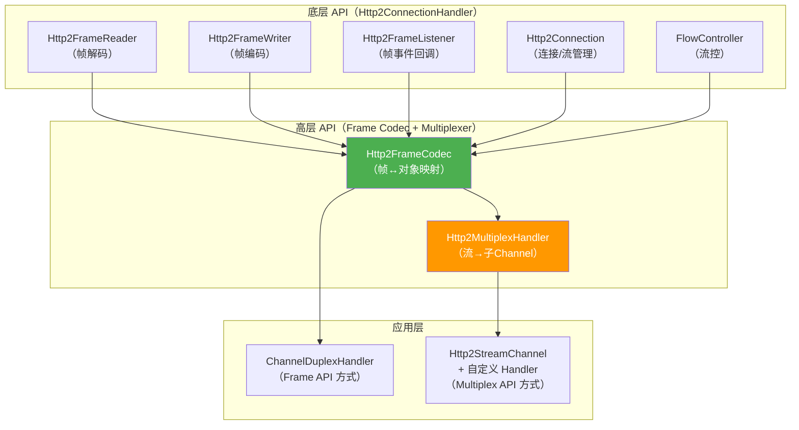
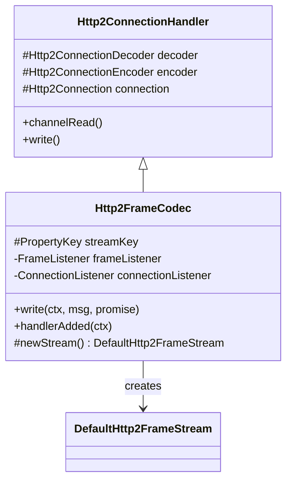
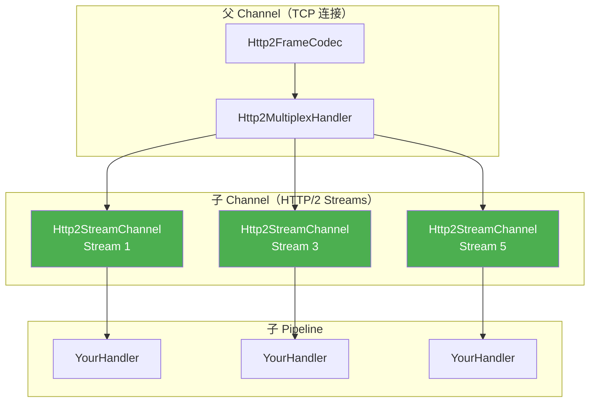

# 22-03 Netty 两层 API 架构与生产实践

> **核心问题**：
> 1. Netty 的 HTTP/2 有哪两层 API？分别适用什么场景？
> 2. `Http2FrameCodec` + `Http2MultiplexHandler` 如何实现多路复用？
> 3. 生产环境使用 Netty HTTP/2 有哪些关键配置和常见踩坑？

---

## 一、Netty HTTP/2 两层 API 架构

### 1.1 问题推导

Netty 需要同时满足两类用户：
- **框架开发者**（如 gRPC、Spring WebFlux）：需要精细控制每个帧
- **应用开发者**：只关心请求/响应语义，不想处理帧级细节

因此 Netty 设计了**两层 API**：

### 1.2 架构总览



### 1.3 两种编程模型对比

| 对比维度 | Frame API<br/>（Http2FrameCodec） | Multiplex API<br/>（+ Http2MultiplexHandler） |
|---------|----------------------------------|----------------------------------------------|
| **Pipeline 结构** | `Http2FrameCodec` → 你的 Handler | `Http2FrameCodec` → `Http2MultiplexHandler` → 每个 Stream 一个子 Channel |
| **编程模型** | 在一个 Handler 里处理所有 Stream | 每个 Stream 独立 Pipeline，像 HTTP/1.1 一样编程 |
| **流标识** | 手动通过 `frame.stream()` 区分 | 自动分派到子 Channel，无需关心 Stream ID |
| **流控** | 手动发送 `Http2WindowUpdateFrame` | 自动通过子 Channel 的 `autoRead` 和可写性控制 |
| **适用场景** | 需要精细控制帧的场景（如 gRPC） | 简单的 HTTP/2 服务端/客户端 |
| **复杂度** | 中等（需理解帧语义） | 低（类似 HTTP/1.1 编程） |
| **推荐度** | 框架开发者 | 🔥 应用开发者首选 |

---

## 二、Http2FrameCodec 深入分析

### 2.1 定位与职责

`Http2FrameCodec` 继承自 `Http2ConnectionHandler`，是**底层帧协议**到**高层帧对象**的桥梁：

- **入站**：底层 `Http2FrameListener` 回调 → 创建 `Http2Frame` 对象 → `fireChannelRead()`
- **出站**：接收 `Http2Frame` 对象 → 调用底层 `Http2ConnectionEncoder` 写帧



### 2.2 入站帧映射

`Http2FrameCodec` 内部类 `FrameListener` 实现了 `Http2FrameListener`，将底层回调映射为 Frame 对象：

```java
// Http2FrameCodec.FrameListener — 帧事件到 Frame 对象的映射
private final class FrameListener implements Http2FrameListener {

    @Override
    public void onHeadersRead(ChannelHandlerContext ctx, int streamId, Http2Headers headers,
                              int padding, boolean endOfStream) {
        Http2FrameStream stream = requireStream(streamId);
        onHttp2Frame(ctx, new DefaultHttp2HeadersFrame(headers, endOfStream, padding).stream(stream));
    }

    @Override
    public int onDataRead(ChannelHandlerContext ctx, int streamId, ByteBuf data, int padding,
                          boolean endOfStream) {
        Http2FrameStream stream = requireStream(streamId);
        Http2DataFrame dataframe = new DefaultHttp2DataFrame(data.retain(), endOfStream, padding);
        dataframe.stream(stream);
        onHttp2Frame(ctx, dataframe);
        return 0;  // 流控由上层通过 WINDOW_UPDATE 帧手动管理
    }

    @Override
    public void onGoAwayRead(ChannelHandlerContext ctx, int lastStreamId, long errorCode, ByteBuf debugData) {
        onHttp2Frame(ctx, new DefaultHttp2GoAwayFrame(lastStreamId, errorCode, debugData.retain()));
    }

    @Override
    public void onRstStreamRead(ChannelHandlerContext ctx, int streamId, long errorCode) {
        Http2FrameStream stream = requireStream(streamId);
        onHttp2Frame(ctx, new DefaultHttp2ResetFrame(errorCode).stream(stream));
    }

    // ... 其他帧类型类似
}
```

<!-- 核对记录：已对照 Http2FrameCodec.FrameListener 源码（onHeadersRead/onDataRead/onGoAwayRead/onRstStreamRead），差异：无 -->

### 2.3 出站帧分发

`Http2FrameCodec.write()` 方法根据消息类型分发：

```java
// Http2FrameCodec.write() — 按类型分派
@Override
public void write(ChannelHandlerContext ctx, Object msg, ChannelPromise promise) {
    if (msg instanceof Http2DataFrame) {
        Http2DataFrame dataFrame = (Http2DataFrame) msg;
        encoder().writeData(ctx, dataFrame.stream().id(), dataFrame.content(),
                dataFrame.padding(), dataFrame.isEndStream(), promise);
    } else if (msg instanceof Http2HeadersFrame) {
        writeHeadersFrame(ctx, (Http2HeadersFrame) msg, promise);
    } else if (msg instanceof Http2WindowUpdateFrame) {
        // 流控：WindowUpdate → consumeBytes
        Http2WindowUpdateFrame frame = (Http2WindowUpdateFrame) msg;
        try {
            if (frame.stream() == null) {
                increaseInitialConnectionWindow(frame.windowSizeIncrement());
            } else {
                consumeBytes(frame.stream().id(), frame.windowSizeIncrement());
            }
            promise.setSuccess();
        } catch (Throwable t) {
            promise.setFailure(t);
        }
    } else if (msg instanceof Http2ResetFrame) {
        // ... RST_STREAM
    } else if (msg instanceof Http2PingFrame) {
        // ... PING
    } else if (msg instanceof Http2SettingsFrame) {
        // ... SETTINGS
    } else if (msg instanceof Http2GoAwayFrame) {
        // ... GO_AWAY
    }
    // ... 其他类型
}
```

<!-- 核对记录：已对照 Http2FrameCodec.write() 源码前4个分支，差异：无 -->

### 2.4 新 Stream 初始化

当 `Http2FrameCodec` 发送一个还没有 Stream ID 的 `Http2HeadersFrame` 时，会自动分配 Stream ID：

```java
// Http2FrameCodec.initializeNewStream()
private boolean initializeNewStream(ChannelHandlerContext ctx, DefaultHttp2FrameStream http2FrameStream,
                                    ChannelPromise promise) {
    final Http2Connection connection = connection();
    final int streamId = connection.local().incrementAndGetNextStreamId();
    if (streamId < 0) {
        // Stream ID 耗尽
        promise.setFailure(new Http2NoMoreStreamIdsException());
        onHttp2Frame(ctx, new DefaultHttp2GoAwayFrame(...));
        return false;
    }
    http2FrameStream.id = streamId;
    frameStreamToInitializeMap.put(streamId, http2FrameStream);
    return true;
}
```

<!-- 核对记录：已对照 Http2FrameCodec.initializeNewStream() 源码，差异：省略了 GoAwayFrame 构造的详细参数 -->

---

## 三、Http2MultiplexHandler 多路复用

### 3.1 核心思想

`Http2MultiplexHandler` 在 `Http2FrameCodec` 之上，为每个 HTTP/2 Stream 创建一个独立的子 Channel（`Http2StreamChannel`）。这让每个 Stream 拥有：
- 独立的 `ChannelPipeline`（可以复用 HTTP/1.1 的 Handler）
- 独立的 `autoRead` 控制（背压机制）
- 独立的可写性（受流控窗口影响）



### 3.2 子 Channel 创建时机

`Http2MultiplexHandler.userEventTriggered()` 在 Stream 变为活跃时创建子 Channel：

```java
// Http2MultiplexHandler.userEventTriggered() — 关键逻辑
case HALF_CLOSED_REMOTE:
case OPEN:
    if (stream.attachment != null) {
        break;  // 已创建，忽略
    }
    final AbstractHttp2StreamChannel ch;
    if (stream.id() == Http2CodecUtil.HTTP_UPGRADE_STREAM_ID && !isServer(ctx)) {
        ch = new Http2MultiplexHandlerStreamChannel(stream, upgradeStreamHandler);
        ch.closeOutbound();
    } else {
        ch = new Http2MultiplexHandlerStreamChannel(stream, inboundStreamHandler);
    }
    // 注册到 EventLoop
    ChannelFuture future = ctx.channel().eventLoop().register(ch);
    break;
case CLOSED:
    AbstractHttp2StreamChannel channel = (AbstractHttp2StreamChannel) stream.attachment;
    if (channel != null) {
        channel.streamClosed();
    }
    break;
```

<!-- 核对记录：已对照 Http2MultiplexHandler.userEventTriggered() 源码中 State 分支，差异：无 -->

### 3.3 帧分发

`Http2MultiplexHandler.channelRead()` 将帧分发到对应的子 Channel：

```java
// Http2MultiplexHandler.channelRead()
@Override
public void channelRead(ChannelHandlerContext ctx, Object msg) throws Exception {
    parentReadInProgress = true;
    if (msg instanceof Http2StreamFrame) {
        if (msg instanceof Http2WindowUpdateFrame) {
            return;  // WindowUpdate 不传播给用户
        }
        Http2StreamFrame streamFrame = (Http2StreamFrame) msg;
        DefaultHttp2FrameStream s = (DefaultHttp2FrameStream) streamFrame.stream();
        AbstractHttp2StreamChannel channel = (AbstractHttp2StreamChannel) s.attachment;

        if (msg instanceof Http2ResetFrame || msg instanceof Http2PriorityFrame) {
            // RST 和 Priority 通过 userEvent 传播（不受流控）
            channel.pipeline().fireUserEventTriggered(msg);
        } else {
            channel.fireChildRead(streamFrame);  // DATA/HEADERS 通过 channelRead 传播
        }
        return;
    }
    if (msg instanceof Http2GoAwayFrame) {
        onHttp2GoAwayFrame(ctx, (Http2GoAwayFrame) msg);
    }
    ctx.fireChannelRead(msg);  // 连接级帧继续传播
}
```

<!-- 核对记录：已对照 Http2MultiplexHandler.channelRead() 源码，差异：无 -->

### 3.4 可写性与流控

子 Channel 的可写性由 `Http2RemoteFlowController` 驱动：

1. 当流控窗口从 0 变为正值时，`Http2RemoteFlowControllerListener.writabilityChanged()` 被调用
2. `Http2FrameCodec.onHttp2StreamWritabilityChanged()` 触发 `Http2FrameStreamEvent.writabilityChanged`
3. `Http2MultiplexHandler` 在 `channelWritabilityChanged()` 中遍历所有活跃 Stream，更新可写性

```java
// Http2MultiplexHandler.channelWritabilityChanged()
@Override
public void channelWritabilityChanged(final ChannelHandlerContext ctx) throws Exception {
    if (ctx.channel().isWritable()) {
        // 当父 Channel 可写时，通知所有子 Channel
        forEachActiveStream(AbstractHttp2StreamChannel.WRITABLE_VISITOR);
    }
    ctx.fireChannelWritabilityChanged();
}
```

---

## 四、两种使用方式的代码示例

### 4.1 Frame API 方式（服务端）

Pipeline 配置：
```java
// Http2FrameCodec + 自定义 Handler（处理所有 Stream）
ch.pipeline().addLast(Http2FrameCodecBuilder.forServer().build());
ch.pipeline().addLast(new HelloWorldHttp2Handler());
```

Handler 实现：
```java
@Sharable
public class HelloWorldHttp2Handler extends ChannelDuplexHandler {

    @Override
    public void channelRead(ChannelHandlerContext ctx, Object msg) throws Exception {
        if (msg instanceof Http2HeadersFrame) {
            Http2HeadersFrame headersFrame = (Http2HeadersFrame) msg;
            if (headersFrame.isEndStream()) {
                // 请求结束，发送响应
                Http2Headers headers = new DefaultHttp2Headers().status(OK.codeAsText());
                ctx.write(new DefaultHttp2HeadersFrame(headers).stream(headersFrame.stream()));
                ctx.write(new DefaultHttp2DataFrame(
                    copiedBuffer("Hello World", UTF_8), true).stream(headersFrame.stream()));
            }
        } else if (msg instanceof Http2DataFrame) {
            Http2DataFrame dataFrame = (Http2DataFrame) msg;
            if (dataFrame.isEndStream()) {
                sendResponse(ctx, dataFrame.stream(), dataFrame.content());
            } else {
                dataFrame.release();
            }
            // ⚠️ Frame API 需要手动归还流控字节
            ctx.write(new DefaultHttp2WindowUpdateFrame(
                dataFrame.initialFlowControlledBytes()).stream(dataFrame.stream()));
        }
    }
}
```

### 4.2 Multiplex API 方式（服务端）🔥 推荐

Pipeline 配置：
```java
// Http2FrameCodec + Http2MultiplexHandler（每个 Stream 独立 Handler）
ch.pipeline().addLast(Http2FrameCodecBuilder.forServer().build());
ch.pipeline().addLast(new Http2MultiplexHandler(new HelloWorldHttp2Handler()));
```

Handler 实现（和 Frame API 非常相似，但不需要手动设置 stream）：
```java
@Sharable
public class HelloWorldHttp2Handler extends ChannelDuplexHandler {

    @Override
    public void channelRead(ChannelHandlerContext ctx, Object msg) throws Exception {
        if (msg instanceof Http2HeadersFrame) {
            Http2HeadersFrame headersFrame = (Http2HeadersFrame) msg;
            if (headersFrame.isEndStream()) {
                Http2Headers headers = new DefaultHttp2Headers().status(OK.codeAsText());
                ctx.write(new DefaultHttp2HeadersFrame(headers));     // 无需 .stream()
                ctx.write(new DefaultHttp2DataFrame(
                    copiedBuffer("Hello World", UTF_8), true));       // 无需 .stream()
            }
        } else if (msg instanceof Http2DataFrame) {
            Http2DataFrame dataFrame = (Http2DataFrame) msg;
            if (dataFrame.isEndStream()) {
                sendResponse(ctx, dataFrame.content());
            } else {
                dataFrame.release();
            }
            // ✅ Multiplex API：流控由子 Channel 自动管理，无需手动 WindowUpdate
        }
    }
}
```

> 🔥 **关键区别**：Multiplex API 中，每个子 Channel 只处理一个 Stream，所以帧不需要手动设置 `.stream()`；流控也由 `Http2MultiplexHandler` 配合子 Channel 的 `autoRead` 机制自动管理。

---

## 五、HTTP/1.1 到 HTTP/2 的升级路径

### 5.1 三种升级方式

| 方式 | 协议 | 实现 |
|------|------|------|
| **ALPN（TLS）** | `h2` | TLS 握手时通过 ALPN 协商，**推荐方式** |
| **Cleartext Upgrade** | `h2c` | HTTP/1.1 `Upgrade: h2c` 头部 |
| **Prior Knowledge** | `h2c` | 客户端直接发送 HTTP/2 Connection Preface |

### 5.2 ALPN 方式（TLS + HTTP/2）

```java
// 服务端 Pipeline（ALPN 协商后根据协议切换 Handler）
SslContext sslCtx = SslContextBuilder.forServer(certFile, keyFile)
    .applicationProtocolConfig(new ApplicationProtocolConfig(
        Protocol.ALPN, SelectorFailureBehavior.NO_ADVERTISE,
        SelectedListenerFailureBehavior.ACCEPT,
        ApplicationProtocolNames.HTTP_2,      // 优先 h2
        ApplicationProtocolNames.HTTP_1_1))   // 降级 h1
    .build();

// 在 ALPN 协商完成后，根据结果配置 Pipeline
public class Http2OrHttpHandler extends ApplicationProtocolNegotiationHandler {
    @Override
    protected void configurePipeline(ChannelHandlerContext ctx, String protocol) {
        if (ApplicationProtocolNames.HTTP_2.equals(protocol)) {
            ctx.pipeline().addLast(Http2FrameCodecBuilder.forServer().build());
            ctx.pipeline().addLast(new Http2MultiplexHandler(new MyHttp2Handler()));
        } else {
            ctx.pipeline().addLast(new HttpServerCodec());
            ctx.pipeline().addLast(new MyHttp1Handler());
        }
    }
}
```

### 5.3 Cleartext Upgrade 方式（h2c）

```java
// Http2ServerInitializer — Netty 官方示例
UpgradeCodecFactory upgradeCodecFactory = protocol -> {
    if (AsciiString.contentEquals(Http2CodecUtil.HTTP_UPGRADE_PROTOCOL_NAME, protocol)) {
        return new Http2ServerUpgradeCodec(
            Http2FrameCodecBuilder.forServer().build(),
            new HelloWorldHttp2Handler());
    }
    return null;
};

p.addLast(new HttpServerCodec());
p.addLast(new HttpServerUpgradeHandler(sourceCodec, upgradeCodecFactory));
```

---

## 六、生产实践与常见问题 ⚠️

### 6.1 关键配置参数

```java
Http2FrameCodecBuilder.forServer()
    .initialSettings(Http2Settings.defaultSettings()
        .initialWindowSize(1048576)               // 流级窗口 1MB（默认 65535）
        .maxConcurrentStreams(1000)                // 最大并发流 1000（默认无限制）
        .maxFrameSize(65536)                       // 最大帧 64KB（默认 16KB）
        .maxHeaderListSize(32768))                 // 最大头部 32KB（默认 8KB）
    .encoderEnforceMaxConcurrentStreams(true)      // 发送端也限制并发流数
    .build();
```

### 6.2 常见问题

| 问题 | 原因 | 解决方案 |
|------|------|---------|
| **请求卡住不响应** | 流控窗口耗尽，未及时 consumeBytes | Frame API 确保发 WINDOW_UPDATE；Multiplex API 确保 autoRead 正常 |
| **RST_STREAM 频繁** | 服务端处理慢，客户端超时取消 | 增大客户端超时；优化服务端处理速度 |
| **GOAWAY + ENHANCE_YOUR_CALM** | 客户端发送过多 RST_STREAM | 检查客户端超时设置和重试策略 |
| **HPACK 动态表 OOM** | 对端发送大量不同的头部 | 设置 `SETTINGS_HEADER_TABLE_SIZE` 上限 |
| **Header size exceeded** | 请求头或 Cookie 过大 | 增大 `maxHeaderListSize`；精简 Cookie |
| **Stream ID 耗尽** | 长连接使用时间过长 | 定期优雅关闭连接并重建（GO_AWAY） |

### 6.3 与 gRPC 的关系

gRPC Java 底层完全基于 Netty HTTP/2：

```
gRPC Stub → gRPC Core → Netty Http2FrameCodec → TCP
```

gRPC 使用的是 **底层 API**（直接操作 `Http2ConnectionHandler`），而不是 Multiplex API。这是因为 gRPC 需要：
- 精细控制每个帧的发送时机
- 自定义流控策略
- 实现双向流式调用

---

## 七、面试高频问答 🔥

### Q1：HTTP/2 多路复用如何解决 HTTP/1.1 的队头阻塞？

**回答**：HTTP/1.1 的队头阻塞发生在**应用层**——同一连接上的请求必须按顺序响应。HTTP/2 通过**二进制帧 + Stream ID** 实现多路复用：每个帧携带 Stream ID，不同 Stream 的帧可以交错传输，接收端按 ID 重组。这样一个慢请求不会阻塞其他请求。

> ⚠️ 但 HTTP/2 仍然存在 **TCP 层的队头阻塞**——如果一个 TCP 包丢失，所有 Stream 的帧都会被阻塞等待重传。这是 HTTP/3（QUIC）解决的问题。

### Q2：Netty 的 Http2FrameCodec 和 Http2MultiplexHandler 分别做什么？

**回答**：
- `Http2FrameCodec`：底层帧协议 ↔ Frame 对象的双向转换。入站将二进制帧转为 `Http2Frame` 对象；出站将 `Http2Frame` 序列化为帧。
- `Http2MultiplexHandler`：为每个 Stream 创建子 Channel（`Http2StreamChannel`），让应用层可以像处理独立连接一样处理每个 Stream。

两者通常组合使用，`Http2MultiplexHandler` **必须放在 `Http2FrameCodec` 之后**。

### Q3：HTTP/2 流控窗口的默认大小是多少？为什么要区分连接级和流级？🔥

**回答**：
- 默认窗口大小 **65535 字节（64KB - 1）**，RFC 7540 §6.9.2 规定
- **流级窗口**：防止单个 Stream 的数据淹没接收方
- **连接级窗口**：防止一个连接的总数据量超过接收方处理能力
- 发送 DATA 帧的可发送量 = `min(连接级窗口, 流级窗口)`
- 接收方通过 `WINDOW_UPDATE` 帧归还信用额度

**生产建议**：高吞吐场景将窗口增大到 1MB-16MB，减少 WINDOW_UPDATE 的往返开销。

### Q4：HPACK 为什么不用 gzip？

**回答**：因为 **CRIME 攻击**。gzip 的压缩率和输入内容相关——攻击者可以通过在请求中注入已知内容、观察压缩后大小变化来猜测 Cookie 等敏感值。HPACK 使用**静态 Huffman 编码 + 索引表**（静态表 61 条 + 动态表 FIFO），不存在这个安全隐患。

### Q5：HTTP/2 的 Stream ID 用完了怎么办？

**回答**：Stream ID 是 31 位无符号整数（最大 2^31 - 1 ≈ 21 亿），单调递增不可复用。用完后：
- Netty 的 `incrementAndGetNextStreamId()` 返回负数
- `Http2FrameCodec` 触发 `Http2NoMoreStreamIdsException`
- 发送 GO_AWAY 帧通知对端
- 客户端需要**新建 TCP 连接**继续通信

> ⚠️ 实践中很少遇到（21 亿个请求对应的连接寿命极长），但长连接服务（如 gRPC）应设置**最大连接时长**定期重建。

### Q6：Netty 的 Http2MultiplexHandler 中，子 Channel 和父 Channel 的关系是什么？

**回答**：
- **父 Channel**：底层 TCP 连接，Pipeline 包含 `Http2FrameCodec` + `Http2MultiplexHandler`
- **子 Channel**（`Http2StreamChannel`）：每个 HTTP/2 Stream 一个，有独立的 Pipeline
- 子 Channel 共享父 Channel 的 EventLoop（同线程，无锁）
- 子 Channel 的 `write()` 最终通过父 Channel 发送
- 子 Channel 关闭时发送 RST_STREAM（错误码 CANCEL）

---

## 八、本章整体小结

### 核心类导航表

| 类 | 层级 | 职责 |
|----|------|------|
| `Http2FrameTypes` | 协议常量 | 10 种帧类型定义 |
| `Http2Flags` | 协议常量 | 帧标志位 |
| `Http2CodecUtil` | 协议常量 | 帧头长度、窗口默认值、SETTINGS 参数 |
| `Http2Error` | 协议常量 | 14 种错误码 |
| `HpackEncoder/Decoder` | 编解码 | HPACK 头部压缩 |
| `DefaultHttp2FrameReader` | 底层 | 帧解码（两阶段状态机） |
| `DefaultHttp2FrameWriter` | 底层 | 帧编码 |
| `Http2Connection` | 底层 | 连接/流管理 |
| `Http2Stream` | 底层 | 流状态机（7 种状态） |
| `DefaultHttp2LocalFlowController` | 底层 | 接收端流控 |
| `DefaultHttp2RemoteFlowController` | 底层 | 发送端流控 |
| `Http2ConnectionHandler` | 中层 | 底层 API 的统一入口 |
| `Http2FrameCodec` | 高层 | 帧 ↔ 对象映射 |
| `Http2MultiplexHandler` | 高层 | 流 → 子 Channel 多路复用 |
| `Http2StreamChannel` | 高层 | 每个 Stream 的独立 Channel |

### 关键不变式

1. **Stream ID 单调递增不可复用**：客户端奇数、服务端偶数、0 是连接控制流
2. **DATA 帧受双层流控约束**：可发送量 = min(连接窗口, 流窗口)
3. **帧头固定 9 字节**：3B长度 + 1B类型 + 1B标志 + 4B流ID
4. **HPACK 动态表是连接级共享的**：所有 Stream 共用同一个动态表，编解码器必须同步
5. **Http2MultiplexHandler 必须在 Http2FrameCodec 之后**：前者依赖后者产生的 Frame 对象
