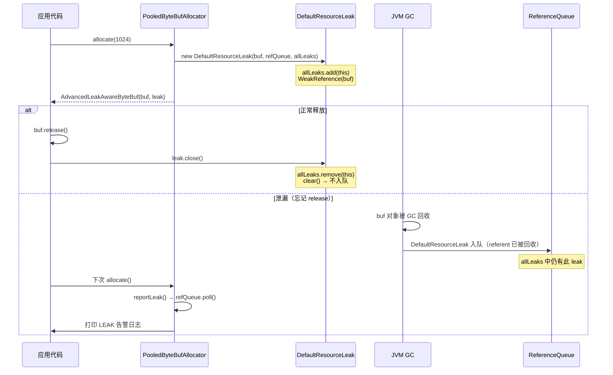
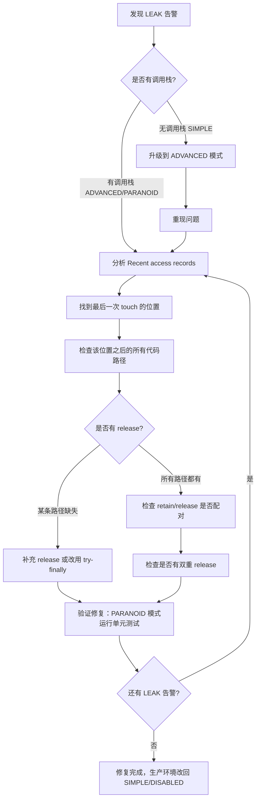

# 第24章：内存泄漏排查


> 📦 **可运行 Demo**：[Ch23_LeakDetectionDemo.java](./Ch23_LeakDetectionDemo.java) —— 内存泄漏排查验证，直接运行 `main` 方法即可。

## 1. 问题背景：为什么 Netty 需要专门的泄漏检测机制？

### 1.1 引用计数的代价

Netty 的 `ByteBuf` 使用**引用计数**（Reference Counting）管理生命周期，而不是依赖 JVM GC。这带来了极高的性能（池化复用、堆外内存），但也引入了一个新的风险：**忘记调用 `release()`**。

```
ByteBuf buf = ctx.alloc().buffer(1024);
// ... 处理逻辑 ...
// ❌ 忘记调用 buf.release()
// → refCnt 永远不归零 → PoolChunk 中的内存永远不归还 → 直接内存 OOM
```

JVM GC 无法感知引用计数，即使 `buf` 对象被 GC 回收，底层的 `DirectByteBuffer` 也不会被释放（因为 `PoolChunk` 持有它的引用）。

### 1.2 JVM 弱引用机制的妙用

Netty 的解决方案是：**用 JVM 的弱引用（WeakReference）来监视 ByteBuf 对象本身**。

核心思路：
1. 分配 `ByteBuf` 时，同时创建一个 `DefaultResourceLeak`（WeakReference 包装 ByteBuf）
2. 正常释放时（`buf.release()`），主动调用 `leak.close()` → 从 `allLeaks` 集合中移除
3. 如果 ByteBuf 被 GC 回收但 `leak.close()` 从未被调用 → JVM 将 `DefaultResourceLeak` 放入 `refQueue`
4. 下次分配时，`reportLeak()` 从 `refQueue` 取出泄漏记录 → 打印告警日志




---

## 2. 核心数据结构

### 2.1 问题推导

要实现"ByteBuf 被 GC 但未 release 时告警"，需要：
- **追踪所有活跃的 ByteBuf**：`allLeaks` 集合
- **感知 ByteBuf 被 GC**：`WeakReference` + `ReferenceQueue`
- **记录分配调用栈**：`TraceRecord` 链表
- **去重告警**：`reportedLeaks` 集合（避免同一泄漏点刷屏）

### 2.2 ResourceLeakDetector 核心字段

```java
// AbstractByteBuf.java 第68-69行
static final ResourceLeakDetector<ByteBuf> leakDetector =
        ResourceLeakDetectorFactory.instance().newResourceLeakDetector(ByteBuf.class);

// ResourceLeakDetector.java 第169-171行
private final Set<DefaultResourceLeak<?>> allLeaks = ConcurrentHashMap.newKeySet();
private final ReferenceQueue<Object> refQueue = new ReferenceQueue<>();
private final Set<String> reportedLeaks = ConcurrentHashMap.newKeySet();
```

| 字段 | 类型 | 作用 |
|------|------|------|
| `allLeaks` | `ConcurrentHashMap.newKeySet()` | 所有活跃的 `DefaultResourceLeak`，正常 release 时移除 |
| `refQueue` | `ReferenceQueue<Object>` | ByteBuf 被 GC 后，对应的 `DefaultResourceLeak` 自动入队 |
| `reportedLeaks` | `ConcurrentHashMap.newKeySet()` | 已报告的泄漏记录（按调用栈字符串去重） |
| `samplingInterval` | `int`（默认 128） | 采样间隔，SIMPLE/ADVANCED 模式下 1/128 概率追踪 |
| `TARGET_RECORDS` | `int`（默认 4） | 每个 leak 最多保留的 TraceRecord 数量 |


### 2.3 DefaultResourceLeak 内部类

```java
// ResourceLeakDetector.java 第399-400行
private static final class DefaultResourceLeak<T>
        extends WeakReference<Object> implements ResourceLeakTracker<T>, ResourceLeak {

    // 第415行
    private volatile int droppedRecords;
    // 第417行
    private final Set<DefaultResourceLeak<?>> allLeaks;
}
```

`DefaultResourceLeak` 继承 `WeakReference<Object>`（而非 `PhantomReference`），这意味着：
- 当 ByteBuf 对象**只剩弱引用**时，GC 会将其回收并将 `DefaultResourceLeak` 放入 `refQueue`
- 弱引用比虚引用（PhantomReference）更早触发，能更快发现泄漏

### 2.4 TraceRecord 链表（ADVANCED/PARANOID 模式）

```java
// ResourceLeakDetector.java 第668-713行
private static class TraceRecord extends Throwable {
    static final int BOTTOM_POS = -1;
    private static final TraceRecord BOTTOM = new TraceRecord(false) { ... };  // 哨兵节点

    private final String hintString;   // 第685行：touch(hint) 传入的提示信息
    private final TraceRecord next;    // 第686行：链表指针（头插法）
    private final int pos;             // 第687行：节点位置（pos = next.pos + 1，第693行）
}
```

`TraceRecord` 是一个**头插法链表**，每次 `touch()` 调用都在链表头部插入一个新节点（捕获当前调用栈）。链表尾部是 `BOTTOM` 哨兵节点（`pos = BOTTOM_POS = -1`）。

**背压机制**（防止 TraceRecord 无限增长）：

```java
// ResourceLeakDetector.java 第493-495行
if (numElements >= TARGET_RECORDS) {
    final int backOffFactor = Math.min(numElements - TARGET_RECORDS, 30);
    dropped = ThreadLocalRandom.current().nextInt(1 << backOffFactor) != 0;
}
```

当 `TraceRecord` 数量超过 `TARGET_RECORDS`（默认 4）时，以指数退避概率丢弃旧记录，并用 `droppedRecords` 计数。


---

## 3. 四个检测等级

### 3.1 等级定义

```java
// ResourceLeakDetector.java 第65-84行
public enum Level {
    DISABLED,   // 完全关闭，零开销
    SIMPLE,     // 默认，1/128 采样，只记录分配位置（无调用栈）
    ADVANCED,   // 1/128 采样，记录完整调用栈（touch() 有效）
    PARANOID;   // 每次分配都追踪，记录完整调用栈
}
```

### 3.2 等级对比

| 等级 | 采样率 | 调用栈 | 性能影响 | 适用场景 |
|------|--------|--------|---------|---------|
| `DISABLED` | 0% | ❌ | 零开销 | 生产（已验证无泄漏） |
| `SIMPLE` | 1/128 | ❌ | 极低（< 1%） | **生产默认** |
| `ADVANCED` | 1/128 | ✅ | 低（< 5%） | 测试/预发现泄漏 |
| `PARANOID` | 100% | ✅ | **高（50%+）** | 单元测试/本地调试 |

> ⚠️ **生产踩坑**：`PARANOID` 模式下吞吐量下降 50% 以上，绝对不能用于生产环境。

### 3.3 track0() 采样逻辑

```java
// ResourceLeakDetector.java 第280-290行
private DefaultResourceLeak<T> track0(T obj, boolean force) {
    Level level = ResourceLeakDetector.level;
    if (force ||
            level == Level.PARANOID ||
            (level != Level.DISABLED && ThreadLocalRandom.current().nextInt(samplingInterval) == 0)) {
        reportLeak();
        return new DefaultResourceLeak<>(obj, refQueue, allLeaks, getInitialHint(resourceType));
    }
    return null;
}
```

三种情况会创建 `DefaultResourceLeak`：
1. `force = true`（`trackForcibly()` 调用）
2. `level == PARANOID`（每次都追踪）
3. `level != DISABLED && ThreadLocalRandom.nextInt(128) == 0`（1/128 概率）


### 3.4 配置方式

```bash
# JVM 启动参数
-Dio.netty.leakDetection.level=ADVANCED

# 或旧版参数（兼容）
-Dio.netty.leakDetectionLevel=ADVANCED

# 调整采样间隔（默认 128，越小越容易发现泄漏）
-Dio.netty.leakDetection.samplingInterval=64

# 调整每个 leak 保留的调用栈记录数（默认 4）
-Dio.netty.leakDetection.targetRecords=8
```

---

## 4. 泄漏检测完整流程

### 4.1 分配阶段：包装为 LeakAware

```java
// AbstractByteBufAllocator.java 第40-47行
protected static ByteBuf toLeakAwareBuffer(ByteBuf buf) {
    ResourceLeakTracker<ByteBuf> leak = AbstractByteBuf.leakDetector.track(buf);
    if (leak != null) {
        if (AbstractByteBuf.leakDetector.isRecordEnabled()) {
            buf = new AdvancedLeakAwareByteBuf(buf, leak);  // ADVANCED/PARANOID
        } else {
            buf = new SimpleLeakAwareByteBuf(buf, leak);    // SIMPLE
        }
    }
    return buf;
}
```

- `track(buf)` 返回 `null`：未采样（DISABLED 或本次未命中），直接返回原始 `buf`
- `isRecordEnabled()`（ADVANCED/PARANOID）→ `AdvancedLeakAwareByteBuf`：每次 `touch()` 记录调用栈
- 否则（SIMPLE）→ `SimpleLeakAwareByteBuf`：只记录分配位置，无调用栈


### 4.2 释放阶段：close() 主动移除

```java
// ResourceLeakDetector.java 第515-523行（DefaultResourceLeak.close()）
public boolean close() {
    if (allLeaks.remove(this)) {
        // Call clear so the reference is not even enqueued.
        clear();
        headUpdater.set(this, TRACK_CLOSE ? new TraceRecord(true) : null);
        return true;
    }
    return false;
}
```

`buf.release()` → `leak.close()` → `allLeaks.remove(this)` + `clear()`（阻止入队）。

### 4.3 GC 阶段：WeakReference 入队

当 `ByteBuf` 对象被 GC 回收时：
- 如果 `leak.close()` 已被调用：`clear()` 已执行，`DefaultResourceLeak` **不会**入队
- 如果 `leak.close()` 未被调用：`DefaultResourceLeak` 自动进入 `refQueue`

### 4.4 报告阶段：下次分配时检测

```java
// ResourceLeakDetector.java 第311-340行
private void reportLeak() {
    if (!needReport()) {
        clearRefQueue();
        return;
    }
    for (;;) {
        DefaultResourceLeak<?> ref = (DefaultResourceLeak<?>) refQueue.poll();
        if (ref == null) {
            break;
        }
        if (!ref.dispose()) {
            continue;
        }
        String records = ref.getReportAndClearRecords();
        if (reportedLeaks.add(records)) {
            if (records.isEmpty()) {
                reportUntracedLeak(resourceType);   // SIMPLE 模式：无调用栈
            } else {
                reportTracedLeak(resourceType, records);  // ADVANCED/PARANOID：有调用栈
            }
        }
    }
}
```

关键细节：
- `reportedLeaks.add(records)`：**按调用栈字符串去重**，同一泄漏点只报告一次
- `dispose()`：`clear()` + `allLeaks.remove(this)`，返回 `true` 表示确实是泄漏（未被 close）
- 泄漏检测是**惰性的**：只在下次分配时触发，不是实时的


---

## 5. 泄漏告警日志解读

### 5.1 SIMPLE 模式日志（无调用栈）

```
ERROR io.netty.util.ResourceLeakDetector - LEAK: ByteBuf.release() was not called before it's garbage-collected.
Enable advanced leak reporting to find out where the leak occurred. To enable advanced leak reporting, specify the JVM option '-Dio.netty.leakDetection.level=advanced' or call ResourceLeakDetector.setLevel()
See https://netty.io/wiki/reference-counted-objects.html for more information.
```

**含义**：检测到泄漏，但没有调用栈信息。需要升级到 ADVANCED 模式才能定位。

### 5.2 ADVANCED 模式日志（有调用栈）

```
ERROR io.netty.util.ResourceLeakDetector - LEAK: ByteBuf.release() was not called before it's garbage-collected.
Recent access records:
#1:
	io.netty.handler.codec.http.HttpObjectDecoder.decode(HttpObjectDecoder.java:412)
	io.netty.handler.codec.ByteToMessageDecoder.channelRead(ByteToMessageDecoder.java:280)
	...
#2:
	Hint: 'EchoServerHandler#0' will handle the message from this point.
	io.netty.channel.DefaultChannelPipeline.fireChannelRead(DefaultChannelPipeline.java:919)
	...
Created at:
	io.netty.buffer.PooledByteBufAllocator.newDirectBuffer(PooledByteBufAllocator.java:402)
	io.netty.buffer.AbstractByteBufAllocator.directBuffer(AbstractByteBufAllocator.java:188)
	...
```

**日志结构解读**：

| 段落 | 含义 |
|------|------|
| `Recent access records: #1, #2, ...` | 最近几次 `touch()` 的调用栈（从新到旧） |
| `Hint: '...'` | `touch(hint)` 传入的提示信息（Pipeline 中 Handler 名称） |
| `Created at:` | ByteBuf 分配时的调用栈 |
| `X leak records were discarded because the leak record count is targeted to 4.` | 因背压机制丢弃的记录数 |

**定位步骤**：
1. 看 `Created at:` → 确认是哪个 Handler 分配的
2. 看最后一条 `Recent access records` → 确认最后一次 `touch()` 在哪里
3. 在最后一次 `touch()` 之后的代码路径中找没有 `release()` 的分支

### 5.3 touch() 的作用

`touch()` 是 ADVANCED/PARANOID 模式下的"路标"，在 ByteBuf 流经 Pipeline 时自动插入：

```java
// AdvancedLeakAwareByteBuf 中，每次 read/write 操作都会调用 touch()
// Pipeline 传播时，DefaultChannelPipeline 也会调用 touch(handler)
```

通过 `touch()` 的调用栈，可以精确追踪 ByteBuf 最后一次被访问的位置，从而定位泄漏点。

---

## 6. 常见泄漏场景与修复

### 6.1 场景一：Handler 中忘记 release

```java
// ❌ 错误：channelRead 中没有 release
public class BadHandler extends ChannelInboundHandlerAdapter {
    @Override
    public void channelRead(ChannelHandlerContext ctx, Object msg) {
        ByteBuf buf = (ByteBuf) msg;
        // 处理完后忘记 release
        // buf.release(); ← 缺失
    }
}

// ✅ 修复方案1：手动 release（try-finally 保证执行）
public class GoodHandler extends ChannelInboundHandlerAdapter {
    @Override
    public void channelRead(ChannelHandlerContext ctx, Object msg) {
        ByteBuf buf = (ByteBuf) msg;
        try {
            // 处理逻辑
            process(buf);
        } finally {
            buf.release();
        }
    }
}

// ✅ 修复方案2：继承 SimpleChannelInboundHandler（自动 release）
// SimpleChannelInboundHandler.java 第104-106行
// finally { if (autoRelease && release) { ReferenceCountUtil.release(msg); } }
public class AutoReleaseHandler extends SimpleChannelInboundHandler<ByteBuf> {
    @Override
    protected void messageReceived(ChannelHandlerContext ctx, ByteBuf msg) {
        // 处理完后自动 release，无需手动调用
        process(msg);
    }
}
```

> ⚠️ **注意**：使用 `SimpleChannelInboundHandler` 时，如果需要将 `msg` 传递给下一个 Handler（`ctx.fireChannelRead(msg)`），必须先 `retain()` 一次，否则 `autoRelease` 会导致 `msg` 被提前释放。


### 6.2 场景二：异常分支遗漏 release

```java
// ❌ 错误：异常时没有 release
public void channelRead(ChannelHandlerContext ctx, Object msg) {
    ByteBuf buf = (ByteBuf) msg;
    if (buf.readableBytes() < 4) {
        ctx.close();
        return;  // ← 直接 return，没有 release！
    }
    // 正常路径有 release
    buf.release();
}

// ✅ 修复：所有分支都要 release
public void channelRead(ChannelHandlerContext ctx, Object msg) {
    ByteBuf buf = (ByteBuf) msg;
    try {
        if (buf.readableBytes() < 4) {
            ctx.close();
            return;
        }
        process(buf);
    } finally {
        buf.release();  // 无论哪个分支都会执行
    }
}
```

### 6.3 场景三：write() 后再次使用

```java
// ❌ 错误：write() 后 buf 的所有权已转移，不能再 release
ByteBuf buf = ctx.alloc().buffer(1024);
buf.writeBytes(data);
ctx.write(buf);
buf.release();  // ← 双重释放！refCnt 变为 -1 → IllegalReferenceCountException

// ✅ 正确：write() 后不要再操作 buf
ByteBuf buf = ctx.alloc().buffer(1024);
buf.writeBytes(data);
ctx.writeAndFlush(buf);  // 所有权转移给 Netty，Netty 负责 release
// 不要再调用 buf.release()
```

> 🔥 **面试常考**：`ctx.write(buf)` 之后，ByteBuf 的所有权转移给 `ChannelOutboundBuffer`，Netty 在 flush 完成后自动调用 `release()`。如果用户再次调用 `release()`，会导致 `refCnt` 变为负数，抛出 `IllegalReferenceCountException`。

### 6.4 场景四：CompositeByteBuf 组件泄漏

```java
// ❌ 错误：只 release 了 composite，没有 release 组件
CompositeByteBuf composite = ctx.alloc().compositeBuffer();
ByteBuf header = ctx.alloc().buffer(8);
ByteBuf body = ctx.alloc().buffer(1024);
composite.addComponents(true, header, body);
// 处理完后
composite.release();  // ← 只释放了 composite 本身，header 和 body 的 refCnt 仍为 1

// ✅ 修复：addComponents 时 autoRelease=true（第一个参数）
// composite.addComponents(true, header, body);
// 此时 composite.release() 会同时 release 所有组件
```

### 6.5 场景五：ByteBuf 跨线程传递

```java
// ❌ 错误：在 EventLoop 外部持有 ByteBuf 引用
ByteBuf buf = ctx.alloc().buffer(1024);
executor.submit(() -> {
    process(buf);
    // 忘记在异步线程中 release
});

// ✅ 修复：异步线程中必须 release
executor.submit(() -> {
    try {
        process(buf);
    } finally {
        buf.release();
    }
});
```

### 6.6 场景六：Decoder 中 cumulation 泄漏

`ByteToMessageDecoder` 内部维护一个 `cumulation` 缓冲区用于处理半包。如果 Decoder 在 `channelInactive` 时没有正确清理，`cumulation` 会泄漏。

```java
// ByteToMessageDecoder 已在 channelInactive 中处理：
// channelInactive → channelRead(EMPTY_BUFFER) → discardSomeReadBytes → release cumulation
// 但如果子类覆盖了 channelInactive 且没有调用 super.channelInactive(ctx)，就会泄漏
public class BadDecoder extends ByteToMessageDecoder {
    @Override
    public void channelInactive(ChannelHandlerContext ctx) throws Exception {
        // ❌ 忘记调用 super，导致 cumulation 泄漏
        ctx.fireChannelInactive();
    }
}

// ✅ 修复
public class GoodDecoder extends ByteToMessageDecoder {
    @Override
    public void channelInactive(ChannelHandlerContext ctx) throws Exception {
        super.channelInactive(ctx);  // ← 必须调用，清理 cumulation
        ctx.fireChannelInactive();
    }
}
```

---

## 7. 排查流程

### 7.1 标准排查步骤



### 7.2 快速定位命令

```bash
# 1. 启动时开启 ADVANCED 模式
java -Dio.netty.leakDetection.level=advanced \
     -Dio.netty.leakDetection.targetRecords=8 \
     -jar your-app.jar

# 2. 过滤泄漏日志
grep "LEAK:" app.log | head -20

# 3. 提取泄漏的 Handler 名称（从 Hint 行）
grep "Hint:" app.log | sort | uniq -c | sort -rn | head -10

# 4. 查看 Direct Memory 使用量（确认是否真的在增长）
# 通过 JMX 或 PooledByteBufAllocator.DEFAULT.metric()
```

### 7.3 单元测试中验证无泄漏

```java
@Test
public void testNoLeak() throws Exception {
    // 设置 PARANOID 模式，确保每次分配都被追踪
    ResourceLeakDetector.setLevel(ResourceLeakDetector.Level.PARANOID);

    EmbeddedChannel channel = new EmbeddedChannel(new MyHandler());
    ByteBuf input = Unpooled.wrappedBuffer(new byte[]{1, 2, 3, 4});

    // 写入并触发处理
    channel.writeInbound(input);
    channel.finish();

    // 强制 GC，触发弱引用入队
    System.gc();
    Thread.sleep(100);

    // 如果有泄漏，ResourceLeakDetector 会在下次分配时打印 ERROR 日志
    // 可以通过自定义 LeakListener 来断言
    ResourceLeakDetector.setLevel(ResourceLeakDetector.Level.SIMPLE);
}
```

---

## 8. 生产环境建议

### 8.1 等级选择策略

```
开发阶段：PARANOID（单元测试）→ ADVANCED（集成测试）
预发布：ADVANCED（观察 1~2 天，确认无泄漏告警）
生产：SIMPLE（默认，低开销监控）→ 确认稳定后可改为 DISABLED
```

### 8.2 监控指标

```java
// 监控 Direct Memory 使用量，发现持续增长时告警
PooledByteBufAllocatorMetric metric = PooledByteBufAllocator.DEFAULT.metric();
long usedDirectMemory = metric.usedDirectMemory();
long usedHeapMemory   = metric.usedHeapMemory();

// 如果 usedDirectMemory 持续增长且不回落，大概率有泄漏
```

### 8.3 常见误报场景

| 现象 | 原因 | 处理 |
|------|------|------|
| 启动时大量 LEAK 告警 | 框架初始化时的临时 ByteBuf | 忽略，观察稳定后是否消失 |
| 压测时偶发 LEAK | SIMPLE 模式采样，可能是正常的 | 升级 ADVANCED 确认 |
| 同一调用栈反复出现 | `reportedLeaks` 去重失效（不同 GC 时机） | 正常，说明同一位置持续泄漏 |
| 关闭时出现 LEAK | 优雅关闭期间未处理完的请求 | 检查 `shutdownGracefully` 的 quietPeriod 是否足够 |

---

## 9. 核心不变式

1. **`allLeaks.contains(leak)` ↔ ByteBuf 未被 release**：`allLeaks` 是所有"已分配但未释放"的 ByteBuf 的追踪集合。`close()` 调用后立即从 `allLeaks` 移除；GC 触发后通过 `dispose()` 再次尝试移除（`dispose()` 返回 `true` 表示确实泄漏）。

2. **泄漏检测是惰性的，不是实时的**：泄漏告警只在**下次分配**时触发（`track0()` 调用 `reportLeak()`），不是在 GC 发生时立即告警。这意味着低分配频率的场景可能延迟发现泄漏。

3. **`reportedLeaks` 去重保证同一泄漏点只报告一次**：按调用栈字符串去重，避免日志刷屏。但如果同一位置的泄漏在不同时间发生，调用栈字符串相同，只会报告一次。

---

## 10. 面试高频问答 🔥

**Q1：Netty 的泄漏检测原理是什么？**

A：`DefaultResourceLeak` 继承 `WeakReference<Object>`，在分配 ByteBuf 时创建并加入 `allLeaks` 集合。正常 `release()` 时调用 `close()` 从 `allLeaks` 移除并 `clear()`（阻止入队）。如果 ByteBuf 被 GC 但未 `release()`，`DefaultResourceLeak` 进入 `refQueue`。下次分配时 `reportLeak()` 从 `refQueue` 取出，发现 `allLeaks` 中仍有此 leak（`dispose()` 返回 true），则打印告警日志。

**Q2：SIMPLE 和 ADVANCED 模式的区别？**

A：两者采样率相同（1/128），区别在于是否记录调用栈。SIMPLE 模式只知道"有泄漏"，ADVANCED 模式通过 `TraceRecord` 链表记录每次 `touch()` 的调用栈，能精确定位泄漏位置。ADVANCED 模式使用 `AdvancedLeakAwareByteBuf` 包装，每次读写操作都会调用 `touch()` 记录调用栈。

**Q3：为什么 PARANOID 模式性能下降 50%+？**

A：PARANOID 模式下每次分配都创建 `DefaultResourceLeak`（WeakReference 对象），且每次读写操作都调用 `touch()` 捕获调用栈（`new Throwable()` 的开销极高）。在高吞吐场景下，这两个操作的累积开销会导致吞吐量大幅下降。

**Q4：`SimpleChannelInboundHandler` 的 autoRelease 有什么陷阱？**

A：`SimpleChannelInboundHandler` 在 `channelRead()` 的 `finally` 块中自动调用 `ReferenceCountUtil.release(msg)`。如果在 `messageReceived()` 中调用了 `ctx.fireChannelRead(msg)` 将 msg 传递给下一个 Handler，必须先 `msg.retain()` 一次，否则 autoRelease 会导致 msg 被提前释放，下一个 Handler 访问时抛出 `IllegalReferenceCountException`。

**Q5：如何在单元测试中验证无内存泄漏？**

A：使用 `EmbeddedChannel` + `PARANOID` 模式 + 自定义 `LeakListener`。测试完成后强制 GC，然后触发一次分配（让 `reportLeak()` 执行），通过 `LeakListener.onLeak()` 回调断言是否有泄漏。


---

## 真实运行验证（Ch23_LeakDetectionDemo.java 完整输出）

> 以下输出通过直接运行 `Ch23_LeakDetectionDemo.java` 的 `main` 方法获得（OpenJDK 11，Linux x86_64）：

```
泄漏检测级别: PARANOID
注意：泄漏报告依赖 GC，可能需要等待几秒

===== 正确使用（有 release）=====
✅ 10 次正确分配/释放完成

===== 故意泄漏（无 release）=====
⚠ 10 次分配但未释放

===== 触发 GC =====
再次分配以触发泄漏检测...
SEVERE: LEAK: ByteBuf.release() was not called before it's garbage-collected.
See https://netty.io/wiki/reference-counted-objects.html for more information.
Recent access records:
#1:
	io.netty.buffer.AdvancedLeakAwareByteBuf.writeBytes(AdvancedLeakAwareByteBuf.java:617)
	io.netty.md.ch23.Ch23_LeakDetectionDemo.main(Ch23_LeakDetectionDemo.java:43)
Created at:
	io.netty.buffer.PooledByteBufAllocator.newDirectBuffer(PooledByteBufAllocator.java:410)
	io.netty.buffer.AbstractByteBufAllocator.directBuffer(AbstractByteBufAllocator.java:168)
	io.netty.buffer.AbstractByteBufAllocator.buffer(AbstractByteBufAllocator.java:96)
	io.netty.md.ch23.Ch23_LeakDetectionDemo.main(Ch23_LeakDetectionDemo.java:42)

检查上方是否有 'LEAK:' 开头的泄漏报告
如果没有，可多运行几次或加大泄漏对象数量

✅ Demo 结束
```

**验证结论**：
- ✅ **PARANOID 级别生效**：`ResourceLeakDetector.getLevel()` 输出 `PARANOID`
- ✅ **泄漏检测触发**：GC 回收未 release 的 ByteBuf 后，下次分配时输出 `LEAK: ByteBuf.release() was not called...`
- ✅ **创建栈追踪可用**：`Created at:` 清晰显示了泄漏 ByteBuf 的分配位置（`Ch23_LeakDetectionDemo.main` 第 42 行）
- ✅ **访问记录可用**：`Recent access records:` 显示了最后一次操作该 ByteBuf 的位置（`writeBytes` 第 43 行）
- ⚠️ **GC 依赖性**：泄漏检测依赖 GC 回收 `PhantomReference`，生产环境中报告可能延迟出现

---

## 附录：核对清单

> 以下为文档编写过程中的源码核对记录，供审计追溯使用。

1. 核对记录：已对照 ResourceLeakDetector.java 第280-340行、AbstractByteBufAllocator.java 第40-58行，差异：无
2. 核对记录：已对照 ResourceLeakDetector.java 第169-171行、第53行、第49行，差异：已修正行号范围169-172→169-171
3. 核对记录：已对照 ResourceLeakDetector.java 第668-713行、第493-495行，差异：已修正行号
4. 核对记录：已对照 ResourceLeakDetector.java 第280-290行，差异：已修正行号281-288→280-290
5. 核对记录：已对照 AbstractByteBufAllocator.java 第40-47行，差异：无
6. 核对记录：已对照 ResourceLeakDetector.java 第311-340行，差异：无
7. 核对记录：已对照 SimpleChannelInboundHandler.java 第104-106行，差异：无

