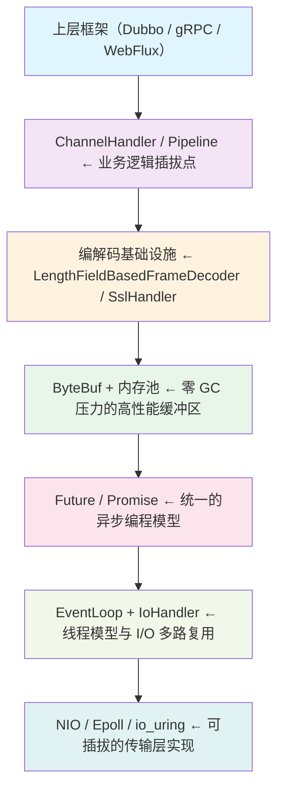
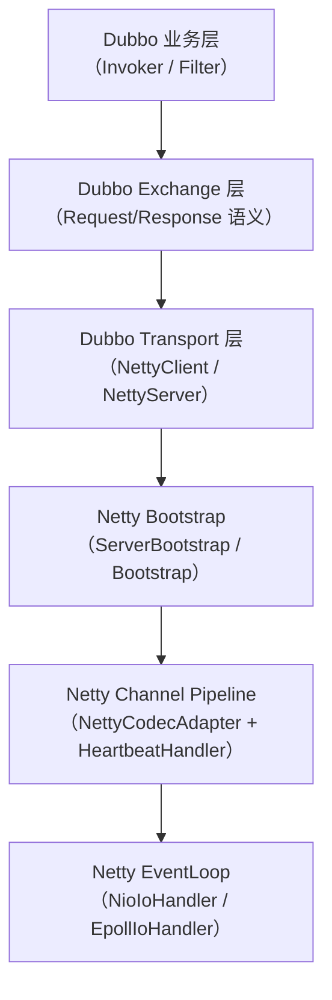
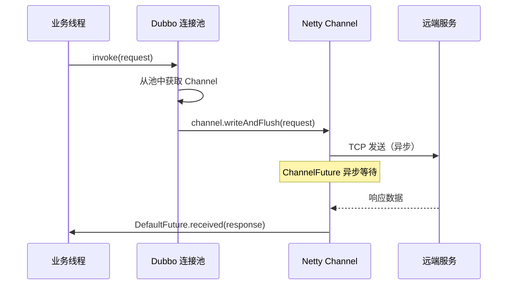
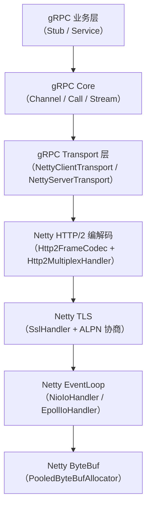
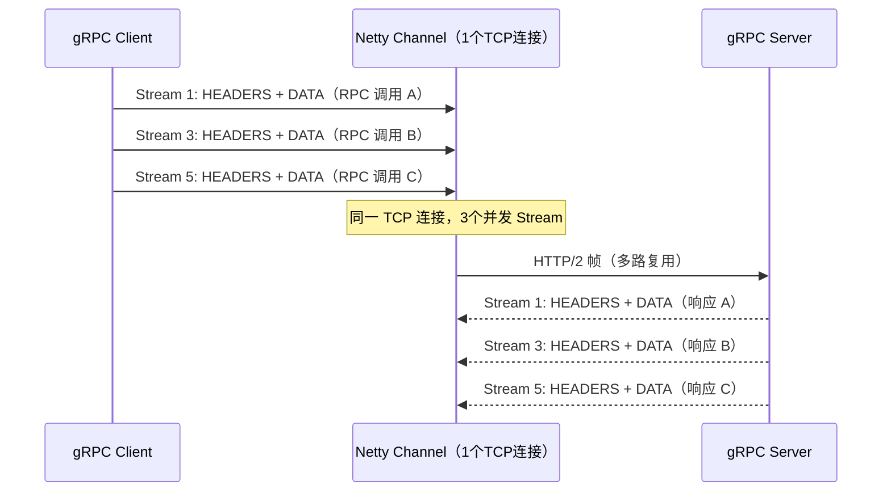
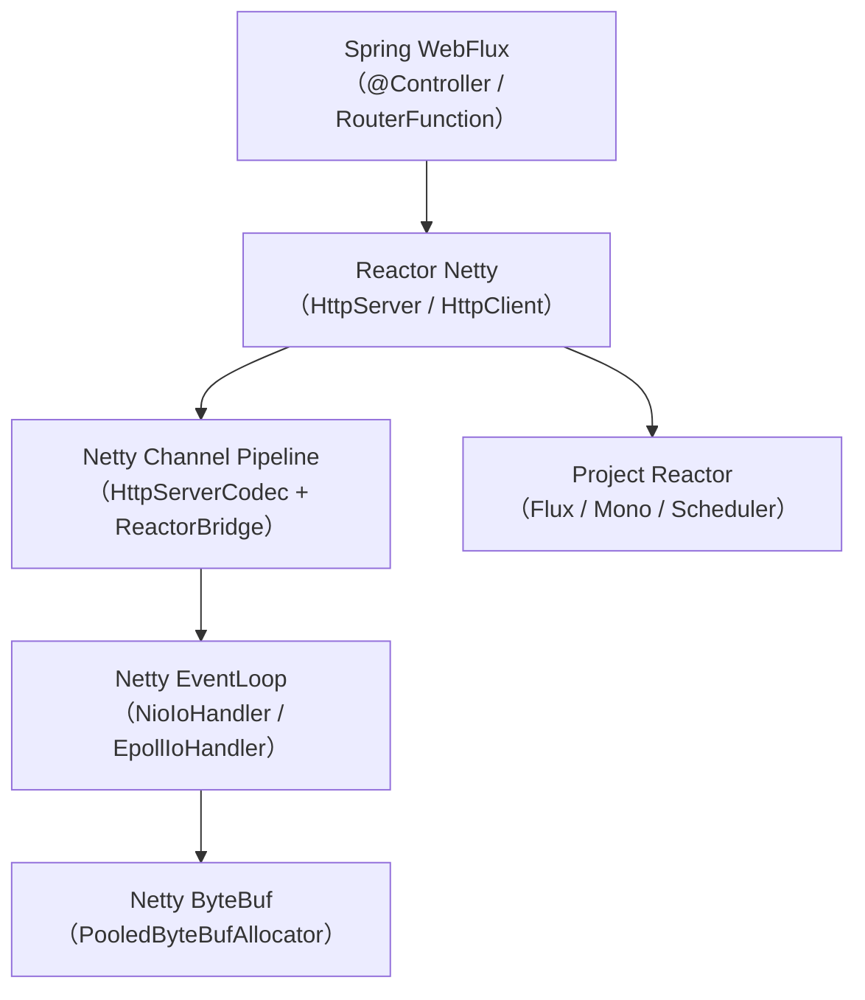
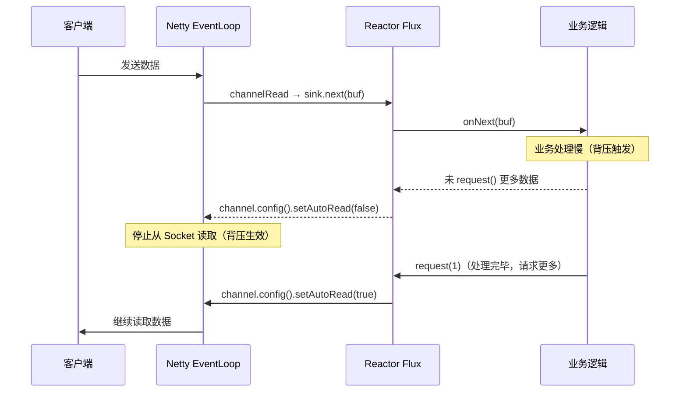
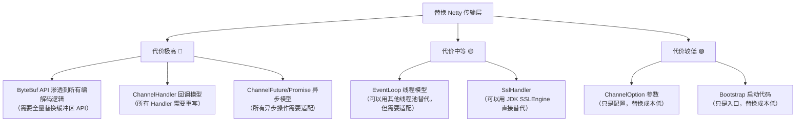

# 第25章：框架复用 —— Dubbo / gRPC / WebFlux 如何站在 Netty 肩膀上

> **本章目标**：理解 Dubbo、gRPC Java、Reactor Netty（Spring WebFlux）三大框架如何复用 Netty 的核心能力，掌握"框架 → Netty 能力层"的映射关系，能在面试中清晰表达"为什么选 Netty"以及"替换传输层的代价"。

---

## 1. 问题驱动：为什么这三个框架都选择 Netty？

### 1.1 框架面临的共同挑战

任何需要处理网络 I/O 的框架，都必须解决以下问题：

| 挑战 | 描述 |
|------|------|
| **高并发连接管理** | 数万甚至数十万并发连接，不能每连接一个线程 |
| **协议编解码** | TCP 粘包拆包、自定义二进制协议、HTTP/2 帧解析 |
| **异步回调** | 网络操作天然异步，需要 Future/Promise 模型 |
| **内存管理** | 频繁的 ByteBuffer 分配/释放导致 GC 压力 |
| **TLS/安全** | 生产环境必须支持 TLS，且性能不能太差 |
| **跨平台 + 高性能** | 开发环境跨平台，生产环境 Linux 原生高性能 |

### 1.2 Netty 提供的"开箱即用"能力层



---

## 2. Netty 核心 SPI 接口回顾（框架复用的"插槽"）

### 2.1 Channel 接口 —— 连接的统一抽象

```java
// Channel.java 第77行
public interface Channel extends AttributeMap, ChannelOutboundInvoker, Comparable<Channel> {
    EventLoop eventLoop();          // 第87行：所属 EventLoop
    ChannelConfig config();         // 第100行：配置参数
    boolean isOpen();               // 第105行：是否打开
    boolean isRegistered();         // 第110行：是否已注册到 EventLoop
    boolean isActive();             // 第115行：是否激活（TCP 已连接）
    ChannelFuture closeFuture();    // 第153行：关闭 Future（框架用来监听连接断开）
    Unsafe unsafe();                // 第198行：底层 I/O 操作（框架不直接调用）
    ChannelPipeline pipeline();     // 第203行：Handler 链（框架的核心扩展点）
}
```


**框架视角**：框架只需要 `channel.pipeline().addLast(handler)` 就能插入自己的编解码逻辑，完全不需要关心底层是 NIO、Epoll 还是 io_uring。

### 2.2 ChannelHandler 接口 —— 框架的核心扩展点

```java
// ChannelHandler.java 第178行
public interface ChannelHandler {
    // 第198行：异常处理（框架必须实现，否则异常会被吞掉）
    void exceptionCaught(ChannelHandlerContext ctx, Throwable cause) throws Exception;

    // 第216行：标记 Handler 为线程安全可共享
    @interface Sharable {
    }
}
```


**框架视角**：
- `@Sharable` 标注的 Handler 可以被所有 Channel 共享（如 Dubbo 的编解码器）
- 非 `@Sharable` 的 Handler 每个 Channel 独立实例（如 `SslHandler`、`LengthFieldBasedFrameDecoder`）

### 2.3 Handler 继承体系 —— 框架选择哪个基类

```java
// 入站处理（接收数据）
// ChannelInboundHandlerAdapter.java 第34行
public class ChannelInboundHandlerAdapter extends ChannelHandlerAdapter implements ChannelInboundHandler

// SimpleChannelInboundHandler.java 第42行（自动 release msg）
public abstract class SimpleChannelInboundHandler<I> extends ChannelInboundHandlerAdapter

// 出站处理（发送数据）
// ChannelOutboundHandlerAdapter.java 第26行
public class ChannelOutboundHandlerAdapter extends ChannelHandlerAdapter implements ChannelOutboundHandler

// 双向处理（心跳、超时等）
// ChannelDuplexHandler.java 第29行
public class ChannelDuplexHandler extends ChannelInboundHandlerAdapter implements ChannelOutboundHandler
```


### 2.4 IoHandler SPI —— 4.2 新架构的可插拔传输层

```java
// IoHandler.java 第33行
public interface IoHandler {
    int run(IoHandlerContext context);                          // 第49行：执行一次 I/O 轮询
    default void prepareToDestroy() { }                        // 第55行：准备销毁
    default void destroy() { }                                 // 第61行：销毁资源
    IoRegistration register(IoHandle handle) throws Exception; // 第69行：注册 Channel
    boolean isCompatible(Class<? extends IoHandle> handleType); // 第84行：兼容性检查
}
```


**框架视角**：4.2 之后，框架只需要传入 `IoHandlerFactory`，就能无缝切换 NIO/Epoll/io_uring：

```java
// NioIoHandler.java 第776行
NioIoHandler.newFactory()
// EpollIoHandler.java 第100行
EpollIoHandler.newFactory()
// 使用方式（MultiThreadIoEventLoopGroup.java 第53行）
new MultiThreadIoEventLoopGroup(nThreads, NioIoHandler.newFactory())
new MultiThreadIoEventLoopGroup(nThreads, EpollIoHandler.newFactory())
```


### 2.5 ChannelOption 关键参数 —— 框架的调优入口

```java
// ChannelOption.java 关键常量（第78-137行）
ChannelOption<ByteBufAllocator>      ALLOCATOR               = valueOf("ALLOCATOR");              // 第78行
ChannelOption<Integer>               CONNECT_TIMEOUT_MILLIS  = valueOf("CONNECT_TIMEOUT_MILLIS"); // 第90行
ChannelOption<Integer>               MAX_MESSAGES_PER_READ   = valueOf("MAX_MESSAGES_PER_READ");  // 第96行
ChannelOption<WriteBufferWaterMark>  WRITE_BUFFER_WATER_MARK = valueOf("WRITE_BUFFER_WATER_MARK"); // 第110-111行
ChannelOption<Boolean>               AUTO_READ               = valueOf("AUTO_READ");              // 第114行
ChannelOption<Boolean>               SO_KEEPALIVE            = valueOf("SO_KEEPALIVE");           // 第123行
ChannelOption<Integer>               SO_SNDBUF               = valueOf("SO_SNDBUF");              // 第124行
ChannelOption<Integer>               SO_RCVBUF               = valueOf("SO_RCVBUF");              // 第125行
ChannelOption<Boolean>               SO_REUSEADDR            = valueOf("SO_REUSEADDR");           // 第126行
ChannelOption<Integer>               SO_BACKLOG              = valueOf("SO_BACKLOG");             // 第128行
ChannelOption<Boolean>               TCP_NODELAY             = valueOf("TCP_NODELAY");            // 第137行
```


**写缓冲水位线默认值**（`WriteBufferWaterMark.java` 第38-39行）：
- `DEFAULT_LOW_WATER_MARK = 32 * 1024`（32KB）
- `DEFAULT_HIGH_WATER_MARK = 64 * 1024`（64KB）


---

## 3. Dubbo 如何复用 Netty

### 3.1 Dubbo 传输层架构

Dubbo 的传输层是可插拔的（通过 SPI），Netty 是默认实现。Dubbo 对 Netty 的复用分为三层：



### 3.2 Dubbo 的 NettyServer 启动模式

Dubbo 的 `NettyServer` 本质上就是一个标准的 `ServerBootstrap` 使用方：

```java
// Dubbo NettyServer 的核心启动逻辑（伪代码，展示 Netty API 使用方式）
ServerBootstrap bootstrap = new ServerBootstrap();
bootstrap
    .group(bossGroup, workerGroup)
    .channel(NioServerSocketChannel.class)          // 或 EpollServerSocketChannel.class
    .childOption(ChannelOption.TCP_NODELAY, true)   // 禁用 Nagle，降低延迟
    .childOption(ChannelOption.SO_KEEPALIVE, true)  // TCP 保活
    .childHandler(new ChannelInitializer<NioSocketChannel>() {
        @Override
        protected void initChannel(NioSocketChannel ch) {  // ChannelInitializer.java 第70行
            ch.pipeline()
                .addLast("decoder", new NettyCodecAdapter(codec).getDecoder())
                .addLast("encoder", new NettyCodecAdapter(codec).getEncoder())
                .addLast("handler", nettyServerHandler);
        }
    });
```


**Dubbo 复用的 Netty 能力**：

| Netty 能力 | Dubbo 用途 |
|-----------|-----------|
| `ServerBootstrap` | 服务端启动，监听端口 |
| `Bootstrap` | 客户端连接，连接池管理 |
| `ChannelInitializer` | 每个连接初始化 Pipeline |
| `LengthFieldBasedFrameDecoder` | Dubbo 协议帧解析（16字节头 + 变长 body） |
| `IdleStateHandler` | 心跳检测（默认 60s 读超时） |
| `ChannelFuture` | 异步发送请求，等待响应 |
| `ByteBuf` | 零拷贝序列化/反序列化 |

### 3.3 Dubbo 协议帧与 LengthFieldBasedFrameDecoder

Dubbo 协议格式（16字节固定头 + 变长 body）：

```
+-------+-------+-------+-------+-------+-------+-------+-------+
| Magic | Flag  | Status| Event |  Request ID (8 bytes)          |
+-------+-------+-------+-------+-------+-------+-------+-------+
|           Data Length (4 bytes)       |  Data (variable)       |
+-------+-------+-------+-------+-------+-------+-------+-------+
```

Dubbo 使用 `LengthFieldBasedFrameDecoder` 解析此格式：

```java
// LengthFieldBasedFrameDecoder.java 第187行（类声明）
// 字段声明（第190-195行）：
// private final int maxFrameLength;      // 最大帧长度（防大包攻击）
// private final int lengthFieldOffset;   // 长度字段偏移
// private final int lengthFieldLength;   // 长度字段字节数
// private final int lengthAdjustment;    // 长度调整
// private final int initialBytesToStrip; // 跳过字节数

new LengthFieldBasedFrameDecoder(
    Integer.MAX_VALUE,  // maxFrameLength
    12,                 // lengthFieldOffset（跳过 Magic+Flag+Status+Event+RequestId = 12字节）
    4,                  // lengthFieldLength（Data Length 字段 4 字节）
    0,                  // lengthAdjustment
    0                   // initialBytesToStrip
)
```


### 3.4 Dubbo 心跳机制与 IdleStateHandler

```java
// IdleStateHandler.java 第100行（类声明：extends ChannelDuplexHandler）
// 核心字段（第113-115行）：
// private final long readerIdleTimeNanos;  // 读超时（Dubbo 默认 60s）
// private final long writerIdleTimeNanos;  // 写超时
// private final long allIdleTimeNanos;     // 读写都超时

// Dubbo 的 Pipeline 配置（伪代码）
ch.pipeline()
    .addLast("client-idle-handler",
        new IdleStateHandler(60, 0, 0, TimeUnit.SECONDS))  // 60s 读超时
    .addLast("heartbeat-handler", new HeartbeatHandler()); // 触发心跳请求
```


**心跳流程**：
1. `IdleStateHandler` 检测到 60s 无读事件 → 触发 `IdleStateEvent(READER_IDLE)`
2. `HeartbeatHandler.userEventTriggered()` 收到事件 → 发送心跳请求
3. 对端收到心跳请求 → 回复心跳响应
4. 若连续 3 次心跳无响应 → 关闭连接

### 3.5 Dubbo 连接池与 Channel 复用



**关键设计**：Dubbo 用 `requestId` 关联请求和响应（存在 `DefaultFuture` 的 Map 中），这正是 Netty `Channel.attr()` 的典型用法。

---

## 4. gRPC Java 如何复用 Netty

### 4.1 gRPC 对 Netty 的依赖深度

gRPC Java 对 Netty 的依赖比 Dubbo 更深，几乎把 Netty 当作"操作系统"来用：



### 4.2 gRPC 的 TLS + ALPN 握手

gRPC 强依赖 TLS（生产环境），并通过 ALPN 协商使用 HTTP/2：

```java
// SslHandler.java 第170行（类声明：extends ByteToMessageDecoder implements ChannelOutboundHandler）
// 核心字段（第418-419行）：
// private final SSLEngine engine;          // JDK SSLEngine 或 OpenSSL SSLEngine
// private final SslEngineType engineType;  // JDK / OpenSSL / BoringSSL

// ALPN 协商结果获取（SslHandler.java 第632-636行）
if (!(engine instanceof ApplicationProtocolAccessor)) {
    return null;
}
return ((ApplicationProtocolAccessor) engine).getNegotiatedApplicationProtocol();
```


### 4.3 gRPC 的 HTTP/2 多路复用



### 4.4 gRPC 复用的 Netty 能力汇总

| Netty 能力 | gRPC 用途 |
|-----------|----------|
| `SslHandler` + ALPN | TLS 握手 + HTTP/2 协议协商 |
| `Http2FrameCodec` | HTTP/2 帧编解码 |
| `Http2MultiplexHandler` | Stream → 子 Channel 映射 |
| `MultiThreadIoEventLoopGroup` | 事件循环线程池 |
| `PooledByteBufAllocator` | 高性能内存分配 |
| `ChannelFuture` / `Promise` | 异步操作结果 |
| `IdleStateHandler` | keepAlive 心跳（HTTP/2 PING 帧） |
| `IoHandler` SPI | NIO/Epoll/io_uring 可插拔 |

---

## 5. Reactor Netty（Spring WebFlux）如何复用 Netty

### 5.1 Reactor Netty 的定位

Reactor Netty 是 Project Reactor 对 Netty 的响应式封装，是 Spring WebFlux 的底层网络层。核心思想：**把 Netty 的回调式 API 包装成 Reactor 的 `Flux`/`Mono` 响应式流**。



### 5.2 Reactor Netty 的背压机制

Reactor Netty 将 Netty 的 `autoRead` 机制与 Reactor 的背压语义打通：



**关键 API**（`ChannelOption.java` 第114行）：
```java
ChannelOption<Boolean> AUTO_READ = valueOf("AUTO_READ");
channel.config().setAutoRead(false);  // 关闭自动读（触发背压）
channel.config().setAutoRead(true);   // 恢复自动读
```


### 5.3 Reactor Netty 复用的 Netty 能力汇总

| Netty 能力 | Reactor Netty 用途 |
|-----------|------------------|
| `ServerBootstrap` / `Bootstrap` | HTTP 服务端/客户端启动 |
| `ChannelInitializer` | 每连接初始化 Pipeline |
| `HttpServerCodec` | HTTP/1.1 编解码 |
| `SslHandler` | HTTPS/TLS 支持 |
| `IdleStateHandler` | 连接超时检测 |
| `AUTO_READ` ChannelOption | 背压控制（与 Reactor 背压语义打通） |
| `PooledByteBufAllocator` | 高性能内存分配 |
| `MultiThreadIoEventLoopGroup` | 事件循环线程池 |
| `ChannelFuture` / `Promise` | 异步操作（包装为 Mono） |

---

## 6. 三框架能力复用对比

| 维度 | Dubbo | gRPC Java | Reactor Netty |
|------|-------|-----------|---------------|
| **协议** | Dubbo 自定义二进制 | HTTP/2 + Protobuf | HTTP/1.1 / HTTP/2 |
| **TLS** | 可选 | 强依赖（生产必须） | 可选 |
| **ALPN** | 不需要 | 必须（h2 协商） | 可选（h2c/h2） |
| **连接模型** | 连接池（多连接） | 单连接多路复用 | 连接池 |
| **心跳** | 应用层心跳（60s） | HTTP/2 PING 帧 | 可配置 |
| **背压** | 写水位线 | 流控（WINDOW_UPDATE） | Reactor 背压 + autoRead |
| **线程模型** | EventLoop + 业务线程池 | EventLoop（业务可切换） | EventLoop + Reactor Scheduler |
| **内存** | PooledByteBufAllocator | PooledByteBufAllocator | PooledByteBufAllocator |
| **IoHandler SPI** | 支持（4.2+） | 支持（4.2+） | 支持（4.2+） |

---

## 7. 替换传输层的代价分析

### 7.1 代价分级



### 7.2 为什么 ByteBuf 替换代价最高？

`ByteBuf` 的引用计数语义（`retain()` / `release()`）渗透到所有编解码逻辑中：

```java
// 典型的 ByteBuf 使用模式（编解码器中随处可见）
@Override
protected void decode(ChannelHandlerContext ctx, ByteBuf in, List<Object> out) {
    ByteBuf frame = in.readRetainedSlice(frameLength);  // retain() 引用计数 +1
    out.add(frame);  // 传递给下一个 Handler，下一个 Handler 负责 release()
}
```

如果替换 Netty，所有这些 `retain()` / `release()` 调用都需要重写，且很容易引入内存泄漏。

### 7.3 框架升级到 Netty 4.2 的注意事项

| 变化 | 4.1 写法 | 4.2 写法 |
|------|---------|---------|
| 创建 EventLoopGroup | `new NioEventLoopGroup(n)` | `new MultiThreadIoEventLoopGroup(n, NioIoHandler.newFactory())` |
| 切换 Epoll | `new EpollEventLoopGroup(n)` | `new MultiThreadIoEventLoopGroup(n, EpollIoHandler.newFactory())` |
| Channel 类型 | `NioServerSocketChannel.class` | 同 4.1（Channel 类型不变） |

**对用户代码的影响**：如果框架已经封装了 EventLoopGroup 的创建（如 Dubbo、gRPC），用户代码**几乎不需要改动**。

---

## 8. 生产实践：框架选型与调优建议

### 8.1 三框架的适用场景

| 场景 | 推荐框架 | 原因 |
|------|---------|------|
| Java 微服务 RPC | Dubbo | 生态成熟，与 Spring Cloud 集成好 |
| 跨语言 RPC | gRPC | Protobuf 跨语言，HTTP/2 标准协议 |
| 响应式 Web | Spring WebFlux | 与 Spring 生态无缝集成 |
| 高吞吐消息中间件 | 自研 Netty | 完全控制协议和线程模型 |

### 8.2 通用调优参数（三框架共用）

```java
// 生产环境推荐配置
bootstrap
    .childOption(ChannelOption.TCP_NODELAY, true)   // 禁用 Nagle（RPC 场景必须，降低延迟）
    .childOption(ChannelOption.SO_KEEPALIVE, true)  // TCP 保活（防止僵尸连接）
    .childOption(ChannelOption.WRITE_BUFFER_WATER_MARK,
        new WriteBufferWaterMark(32 * 1024, 64 * 1024))  // 写缓冲水位线（默认值）
    .childOption(ChannelOption.ALLOCATOR, PooledByteBufAllocator.DEFAULT); // 池化内存
```

### 8.3 ⚠️ 生产踩坑：框架使用 Netty 的常见问题

| 问题 | 根因 | 解决方案 |
|------|------|---------|
| **内存泄漏** | Handler 中 ByteBuf 未 release | 开启 `ResourceLeakDetector.Level.ADVANCED`，定位泄漏点 |
| **EventLoop 阻塞** | 业务逻辑在 EventLoop 线程执行 | 将耗时操作提交到业务线程池 |
| **连接积压** | SO_BACKLOG 太小，连接被拒绝 | 调大 SO_BACKLOG（默认 128，建议 1024+） |
| **写缓冲 OOM** | 下游慢，写缓冲无限增长 | 监听 `channelWritabilityChanged`，暂停写入 |
| **心跳误判** | GC 停顿导致心跳超时 | 心跳超时时间 > GC 停顿时间（建议 3 倍以上） |
| **TLS 握手失败** | ALPN 协议不匹配 | 确认客户端和服务端 ALPN 配置一致 |

---

## 9. 面试高频问答 🔥

### Q1：Dubbo/gRPC 为什么选择 Netty？

**答**：Netty 提供了完整的网络编程基础设施：
1. **高性能 I/O**：基于 Reactor 模式，单线程处理多连接，支持 NIO/Epoll/io_uring
2. **可插拔 Pipeline**：通过 `ChannelHandler` 链实现协议编解码、TLS、心跳等功能的灵活组合
3. **高性能内存**：`ByteBuf` 池化分配，零拷贝，引用计数，大幅减少 GC 压力
4. **统一异步模型**：`ChannelFuture`/`Promise` 提供一致的异步编程接口
5. **生产验证**：经过大量生产环境验证，稳定性高

### Q2：如果替换 Netty 传输层，代价最大的是哪几块？

**答**：代价最大的是 **ByteBuf API** 和 **ChannelHandler 回调模型**：
- `ByteBuf` 的引用计数语义渗透到所有编解码逻辑，替换需要全量重写
- `ChannelHandler` 的入站/出站回调模型是所有业务逻辑的基础，替换需要重新设计
- `ChannelFuture`/`Promise` 的异步模型也渗透到所有异步操作中

### Q3：gRPC 为什么强依赖 HTTP/2 和 TLS？

**答**：
- **HTTP/2**：提供多路复用（一个 TCP 连接并发多个 RPC 调用），头部压缩（HPACK），流控（WINDOW_UPDATE）
- **TLS**：生产环境安全要求；ALPN 扩展用于协商 HTTP/2 协议（`h2`），避免额外的协议升级握手
- Netty 的 `SslHandler` + `Http2FrameCodec` 提供了完整的 TLS + HTTP/2 支持，gRPC 直接复用

### Q4：Spring WebFlux 的背压是如何与 Netty 打通的？

**答**：通过 `ChannelOption.AUTO_READ`（`ChannelOption.java` 第114行）：
- 当 Reactor 的 `Subscriber` 未 `request()` 更多数据时，Reactor Netty 调用 `channel.config().setAutoRead(false)` 停止从 Socket 读取
- 当 `Subscriber` 再次 `request()` 时，调用 `channel.config().setAutoRead(true)` 恢复读取
- 这样 TCP 的流控（接收窗口缩小）自然传递给发送方，实现端到端背压

### Q5：Netty 4.2 的 IoHandler SPI 对框架有什么影响？

**答**：4.2 将 I/O 处理从 `EventLoop` 解耦为独立的 `IoHandler` SPI（`IoHandler.java` 第33行）：
- 框架只需传入 `IoHandlerFactory`（如 `NioIoHandler.newFactory()`），就能无缝切换传输层
- 对用户代码影响极小（如果框架已封装 EventLoopGroup 创建）
- 新增 `AutoScalingEventExecutorChooserFactory` 支持 EventLoop 弹性伸缩，适合流量波动大的场景


---

## 附录：核对清单

> 以下为文档编写过程中的源码核对记录，供审计追溯使用。

1. 核对记录：已对照 Channel.java 第77-203行，差异：无
2. 核对记录：已对照 ChannelHandler.java 第178-216行，差异：无
3. 核对记录：已对照 ChannelInboundHandlerAdapter.java 第34行、ChannelDuplexHandler.java 第29行、ChannelOutboundHandlerAdapter.java 第26行、SimpleChannelInboundHandler.java 第42行，差异：无
4. 核对记录：已对照 IoHandler.java 第33-84行，差异：无
5. 核对记录：已对照 NioIoHandler.java 第776行、EpollIoHandler.java 第100行、MultiThreadIoEventLoopGroup.java 第53行，差异：无
6. 核对记录：已对照 ChannelOption.java 第78-137行，差异：无
7. 核对记录：已对照 WriteBufferWaterMark.java 第38-39行，差异：无
8. 核对记录：已对照 ChannelInitializer.java 第54行（类声明）、第70行（initChannel 抽象方法），差异：无
9. 核对记录：已对照 LengthFieldBasedFrameDecoder.java 第187行、第190-195行，差异：无
10. 核对记录：已对照 IdleStateHandler.java 第100行、第113-115行，差异：无
11. 核对记录：已对照 SslHandler.java 第170行、第418-419行、第632-636行，差异：无
12. 核对记录：已对照 ChannelOption.java 第114行，差异：无

