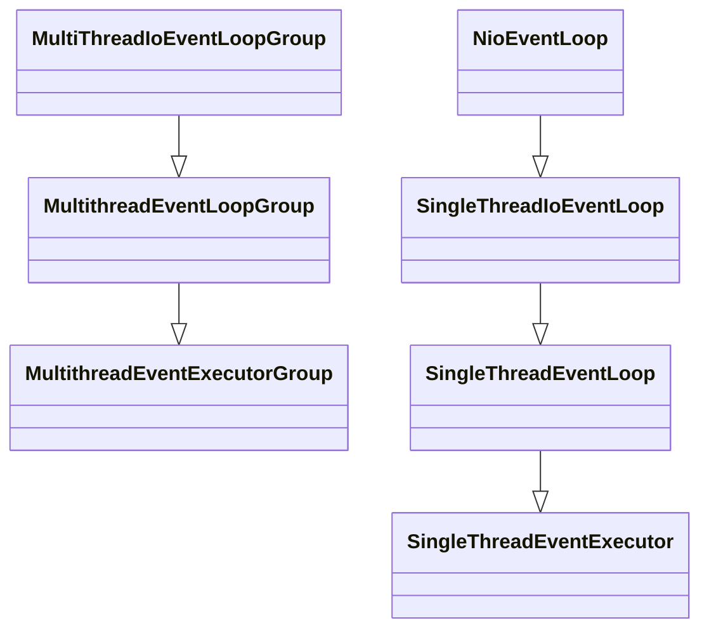
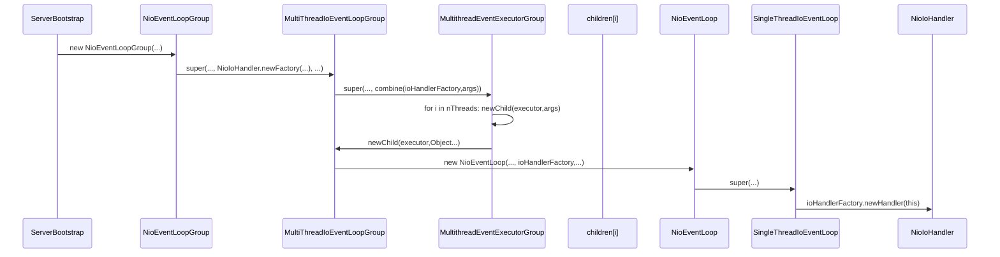
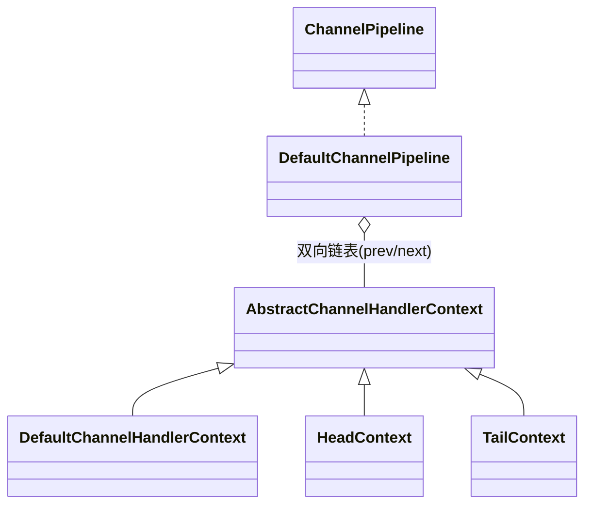
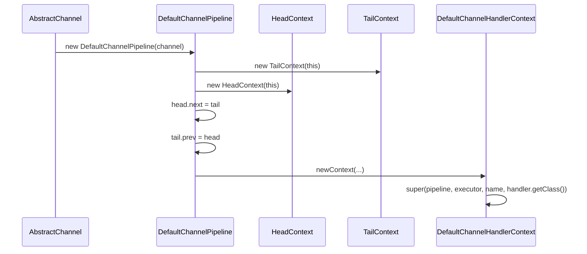
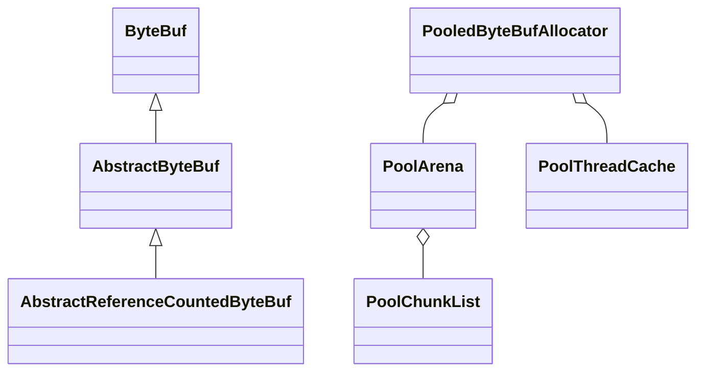
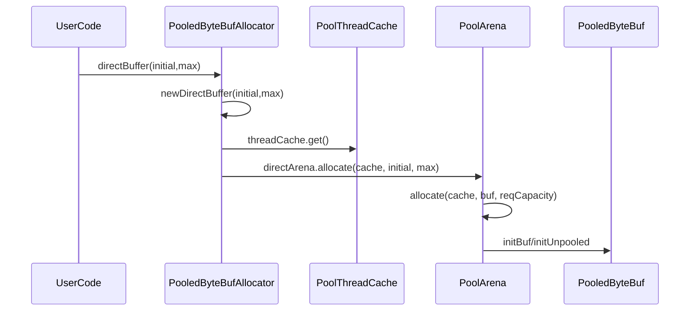
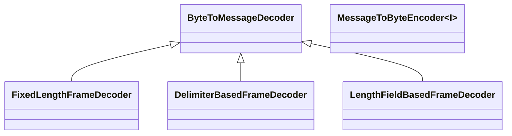
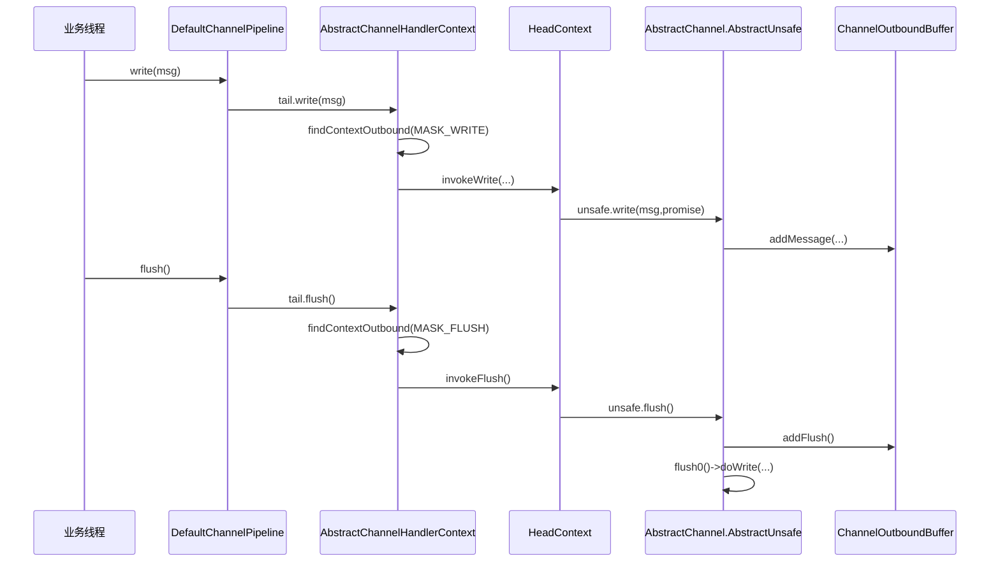
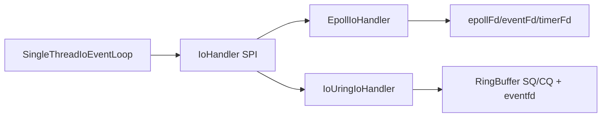

## Netty 4.2.9 源码学习与生产实践大纲（聚焦生产 + 面试 + 框架复用）

### 0. 学习目标与边界
- **目标**：建立“会用 + 会调优 + 能讲清源码设计 + 能定位线上问题”的完整能力。
- **当前边界**：只关注生产环境高价值能力、面试高频考点、以及被上层框架复用最多的核心模块。
- **暂不优先**：边缘协议示例、低频实验性功能、纯 demo 型 API。

---

## 0.1 📍 快速导航索引

### 按章节导航（含难度标记和预计阅读时长）

> 难度说明：⭐ 入门 | ⭐⭐ 进阶 | ⭐⭐⭐ 深入
> 阅读时长按「源码级深度阅读」估算，浏览式阅读可减半

| # | 章节 | 难度 | 预计时长 | 核心关键词 |
|---|------|------|---------|-----------|
| 00 | **Quick Start & Debug Guide** | ⭐ | 15 min | 运行环境、验证程序清单、5大断点调试场景、调试技巧 |
| 01-01 | 全局地图与模块概览 | ⭐ | 20 min | 模块职责、依赖关系、请求生命周期 |
| 01-02 | 请求完整生命周期·贯穿式时序图 | ⭐⭐ | 30 min | 8阶段全链路、源码级映射、线程交互、调试路线 |
| 02-01 | 启动流程·初始化与配置 | ⭐⭐ | 45 min | ServerBootstrap、配置链、Option |
| 02-02 | 启动流程·bind 全流程 | ⭐⭐⭐ | 55 min | initAndRegister、register0、doBind |
| 03-01 | EventLoop·继承体系与创建 | ⭐⭐ | 45 min | 继承链、字段清单、状态机、MpscQueue |
| 03-02 | EventLoop·run() 核心循环 | ⭐⭐⭐ | 55 min | select、processSelectedKeys、runAllTasks、空轮询 Bug |
| 04-01 | Channel·继承体系与数据结构 | ⭐⭐ | 50 min | 继承链、Unsafe、ChannelOutboundBuffer、状态机 |
| 04-02 | Channel·Read/Accept 流程 | ⭐⭐⭐ | 50 min | processSelectedKey、read loop、accept 链路 |
| 05 | Pipeline 与 Handler 机制 | ⭐⭐⭐ | 55 min | 双向链表、executionMask、事件传播、Handler 生命周期 |
| 06-01 | ByteBuf 与内存池 | ⭐⭐ | 55 min | 引用计数、池化、PoolArena、PoolChunk |
| 06-02 | SizeClasses 分级 | ⭐⭐⭐ | 50 min | jemalloc 分级、sizeIdx、pageIdx、数值推导 |
| 06-03 | PoolChunk·Run 分配 | ⭐⭐⭐ | 55 min | bitmap、run 管理、分配/释放算法 |
| 06-04 | PoolSubpage | ⭐⭐⭐ | 35 min | 小内存分配、bitmap 管理 |
| 06-05 | ThreadCache 与 Recycler | ⭐⭐ | 40 min | 线程缓存、对象池 |
| 07 | 编解码与粘包拆包 | ⭐⭐ | 55 min | ByteToMessageDecoder、累积器、LengthField |
| 08 | 写路径与背压 | ⭐⭐⭐ | 50 min | ChannelOutboundBuffer、水位线、flush 机制 |
| 09 | 写路径三种 Transport 对比 | ⭐⭐⭐ | 45 min | NIO vs Epoll vs io_uring 写路径差异 |
| 10 | 连接生命周期与故障处理 | ⭐⭐ | 60 min | 超时、空闲检测、优雅关闭、close 流程 |
| 11 | 心跳与空闲检测 | ⭐⭐ | 55 min | IdleStateHandler、定时任务、observeOutput |
| 12 | Native Transport·Epoll | ⭐⭐⭐ | 55 min | epoll_ctl、边缘触发、EpollIoHandler |
| 13 | Native Transport·io_uring | ⭐⭐⭐ | 75 min | SQE/CQE、submission queue、io_uring 架构 |
| 14 | 三种 Transport 对比 | ⭐⭐ | 30 min | NIO vs Epoll vs io_uring 选型指南 |
| 15 | 零拷贝机制 | ⭐⭐ | 30 min | CompositeByteBuf、FileRegion、sendfile |
| 16 | Future 与 Promise 异步模型 | ⭐⭐ | 45 min | Promise 状态机、链式通知、线程安全 |
| 17 | 并发工具箱 | ⭐⭐ | 35 min | HashedWheelTimer、Recycler、FastThreadLocal |
| 18 | 引用计数与平台适配 | ⭐⭐ | 40 min | ReferenceCounted、PlatformDependent |
| 19-01 | 4.2 新架构·IoHandler 与弹性线程 | ⭐⭐⭐ | 50 min | IoHandler SPI、AutoScaling、4.1→4.2 迁移 |
| 19-02 | Suspend/Resume 动态伸缩深度专题 | ⭐⭐⭐ | 45 min | 状态机7态、挂起/唤醒路径、竞态分析、processingLock |
| 20 | 自适应内存分配器 | ⭐⭐⭐ | 50 min | AdaptivePoolingAllocator、Magazine、Histogram |
| 21 | TLS 与安全通信 | ⭐⭐ | 45 min | SslHandler、握手流程、证书链 |
| 22-01~03 | HTTP/2 编解码（3篇） | ⭐⭐⭐ | 60 min | 帧解析、流管理、流控、多路复用 |
| 23 | 生产调优与参数模板 | ⭐⭐ | 40 min | 参数调优、性能模板、系统参数 |
| 24 | 内存泄漏排查 | ⭐⭐ | 30 min | ResourceLeakDetector、排查步骤 |
| 25 | 框架复用 | ⭐ | 25 min | Dubbo/gRPC/WebFlux 如何使用 Netty |
| 26 | 面试高频问答 | ⭐ | 20 min | 面试模板、追问预判、引导技巧 |
| 27 | 附录·踩坑日志 | ⭐ | 40 min | 41 个踩坑点、P0/P1/P2 分级 |

**总计预计深度阅读时长：约 25-30 小时**

### 按主题交叉索引

#### 🔴 内存相关（泄漏 / OOM / 池化）
- Ch06-01~05：ByteBuf 与内存池（核心原理）
- Ch08 §3：ChannelOutboundBuffer 内存计算与水位线
- Ch18：引用计数原理
- Ch20：AdaptivePoolingAllocator
- Ch24：内存泄漏排查全流程
- Ch27 §P0-01~03：ByteBuf 未释放、半包 ByteBuf 泄漏、堆外内存 OOM

#### 🔵 线程模型与并发
- Ch03-01~02：EventLoop 继承体系与 run() 循环
- Ch16：Future/Promise 异步模型
- Ch17：HashedWheelTimer、Recycler、FastThreadLocal
- Ch19：IoHandler SPI 与弹性线程池
- **Ch19-02：Suspend/Resume 动态伸缩深度专题（状态机、挂起/唤醒全链路、竞态安全分析）**
- Ch27 §P0-06：业务线程直接 write 导致并发问题

#### 🟢 连接生命周期
- **Ch01-02：请求完整生命周期·贯穿式时序图（全局导航地图，8阶段全链路映射）**
- Ch02：ServerBootstrap 启动（连接建立的起点）
- Ch04：Channel 继承体系与状态机
- Ch10：连接生命周期、超时、空闲检测、优雅关闭
- Ch11：IdleStateHandler 心跳机制
- Ch27 §P0-07~08：连接泄漏、半关闭状态处理不当

#### 🟡 性能调优
- Ch03-02 §Q6：IO 饥饿防护（maxTaskProcessingQuantumNs）
- Ch08：写路径与背压（水位线调优）
- Ch09：三种 Transport 写路径对比
- Ch12/13/14：Native Transport 性能对比与选型
- Ch15：零拷贝机制
- Ch23：生产调优参数模板
- Ch27 §P1：性能劣化相关踩坑点

#### 🟣 编解码
- Ch07：ByteToMessageDecoder、粘包拆包
- Ch21：TLS/SSL 握手与加解密
- Ch22-01~03：HTTP/2 帧、流、流控

#### 🔥 面试高频
- **Ch01-02 §九：请求生命周期 — 面试白板画图 + 追问预判**
- Ch26：面试高频问答总汇（5 分钟/15 分钟模板）
- Ch03-02 Q1~Q7：EventLoop 相关面试题
- Ch04-01 §十一：Channel 相关面试题
- Ch05 §十一：Pipeline 相关面试题
- Ch06-02 §12：SizeClasses 面试题
- Ch08 §十一：写路径面试题
- Ch19 §10：4.2 新架构面试题
- Ch19 §11：4.1 → 4.2 过时八股文列表 ⚠️

#### 📋 生产 Checklist
- Ch23：生产调优参数模板
- Ch24：内存泄漏排查步骤
- Ch27：41 个踩坑点（P0/P1/P2 分级）
- Ch19 §11.4：4.1 → 4.2 升级检查清单

### 推荐阅读路线

```mermaid
graph TD
    A["Ch01 全局地图 ⭐<br/>20min"] --> B["Ch02 启动流程 ⭐⭐<br/>1.5h"]
    B --> C["Ch03 EventLoop ⭐⭐⭐<br/>1.5h"]
    C --> D["Ch04 Channel ⭐⭐⭐<br/>1.5h"]
    D --> E["Ch05 Pipeline ⭐⭐⭐<br/>1h"]
    E --> F["Ch06 ByteBuf ⭐⭐⭐<br/>4h"]
    F --> G{"选择方向"}

    G -->|"性能方向"| H["Ch08 写路径 → Ch09 对比 → Ch12/13 Native"]
    G -->|"稳定性方向"| I["Ch10 生命周期 → Ch11 心跳 → Ch24 泄漏排查"]
    G -->|"协议方向"| J["Ch07 编解码 → Ch21 TLS → Ch22 HTTP/2"]
    G -->|"面试冲刺"| K["Ch26 面试 → Ch19 4.2新特性 → Ch27 踩坑"]

    H --> L["Ch23 调优 → Ch27 踩坑"]
    I --> L
    J --> L
    K --> L

    style A fill:#e1f5fe
    style F fill:#fff3e0
    style L fill:#c8e6c9
```



> 📖 **开始之前**：请先阅读 **[00-quick-start-and-debug-guide.md](./00-quick-start-and-debug-guide.md)**，了解运行环境、所有验证程序的运行方式、以及 5 个核心断点调试场景。

---

## 1. 本地 Native 库编译状态

### 1.1 已编译成功的 Native 模块 ✅

| 模块 | 状态 | 产物 | 本地库 |
|------|------|------|--------|
| `transport-native-epoll` | ✅ 已编译 | `netty-transport-native-epoll-4.2.9.Final-linux-x86_64.jar` (41KB) | `libnetty_transport_native_epoll_x86_64.so` |
| `transport-native-io_uring` | ✅ 已编译 | `netty-transport-native-io_uring-4.2.9.Final-linux-x86_64.jar` | `libnetty_transport_native_io_uring42_x86_64.so` |

- 编译命令参考：`mvn install -pl transport-native-epoll -am -DskipTests -Dcheckstyle.skip=true -Denforcer.skip=true`
- 产物已安装到本地 Maven 仓库，可直接在代码中使用。

### 1.2 仍未编译的 Native 模块（暂不影响学习）

| 模块 | 原因 | 影响 |
|------|------|------|
| `transport-native-kqueue` | 需要 macOS/BSD 环境 | 仅 macOS 需要，Linux 不影响 |
| `transport-native-unix-common-tests` | 测试模块 | 不影响 |
| `transport-native-epoll-tests` | 测试模块 | 不影响 |
| `transport-native-kqueue-tests` | 测试模块 | 不影响 |

### 1.3 验证 Native 可用性
```java
// Epoll 验证
System.out.println("Epoll available: " + Epoll.isAvailable());
// io_uring 验证
System.out.println("IOUring available: " + IOUring.isAvailable());
```

### 1.4 学习策略（更新）
- **策略 A（推荐）**：先用 Java NIO 完整走通源码主线，再对比 Epoll / io_uring 差异分支。
- **策略 B**：并行学习 NIO + Epoll + io_uring，直接在 Linux 环境做性能对比。
- 因为 Epoll 和 io_uring 已编译成功，**建议直接采用策略 B**，获得最完整的学习体验。

---

## 2. 源码学习总路线（四阶段）

### 阶段一：建立全局地图（1~2 天）
- **目标**：先知道“每个包解决什么问题”，避免陷入细节。
- **重点模块**：
  - `buffer`：内存模型与池化（ByteBuf / PooledByteBufAllocator）
  - `channel`：抽象传输层、事件流转
  - `transport`：NIO 核心实现
  - `handler`：编解码与业务处理
  - `resolver`：DNS
  - `codec` / `codec-http` / `codec-http2`：协议编解码
- **输出物**：一张“连接建立 -> IO -> 编解码 -> 业务 -> 回写”的调用链流程图。

### 阶段二：生产主链路深挖（7~10 天）
- **目标**：把最重要的调用链从“会背”变成“会断点 + 会解释”。
- **必读主线**：
  1. `ServerBootstrap` / `Bootstrap` 启动流程
  2. `NioEventLoopGroup` 与 `NioEventLoop` 线程模型
  3. `Channel` 生命周期：register、active、read、write、flush、close
  4. `ChannelPipeline` 责任链传播（inbound / outbound）
  5. `ByteBuf` 引用计数 + 内存池分配与回收
  6. `ChannelOutboundBuffer` + 写水位线 + Flush 机制
- **输出物**：
  - 一份“单次请求从 Socket 到业务 Handler 再到回包”的时序图
  - 一份“线上内存泄漏排查清单”

### 阶段三：高性能与稳定性专项（5~7 天）
- **目标**：聚焦生产问题（延迟抖动、OOM、连接风暴、积压）。
- **专题**：
  - 粘包拆包：`LengthFieldBasedFrameDecoder` 等
  - 背压：高低水位、`autoRead`、批量写策略
  - 零拷贝：`CompositeByteBuf`、`FileRegion`、`sendfile`
  - Idle 与心跳：`IdleStateHandler`
  - TLS：`SslHandler`、握手与证书链路
  - Native transport 对比 NIO 的收益边界
- **输出物**：
  - 一份“吞吐优先 vs 延迟优先”参数模板
  - 一份“服务端稳态压测 checklist”

### 阶段四：框架复用与面试打磨（3~5 天）
- **目标**：把源码认知迁移到框架与面试表达。
- **框架映射**：
  - Dubbo：基于 Netty 的 RPC 传输层、连接管理、心跳
  - gRPC Java：底层基于 Netty（HTTP/2 + TLS）
  - Reactor Netty（Spring WebFlux）：响应式网络层
  - RocketMQ 等中间件：Remoting 层常见基于 Netty
- **输出物**：
  - 一份“框架怎么复用 Netty 的能力地图”
  - 一份“面试问答模板（5分钟/15分钟两种粒度）”

---

## 3. 必学源码专题（按优先级）

### 3.0 专题统一执行模板（每个专题都必须包含）
- **问题**：这个模块解决什么问题？输入、输出、边界分别是什么？
- **问题推导**：先不看源码，先推导“要解决该问题需要什么信息/能力”，再引出应当出现的数据结构。
- **核心数据结构**：逐字段分析（字段顺序、构造参数顺序、赋值顺序与源码一致），说明每个字段解决的具体问题。
- **关键流程**：按“请求生命周期”讲清从入口到出口的调用链，并给出 Mermaid 时序图。
- **父类构造链**：沿继承链逐层追溯父类构造，列出每层初始化对象（如 `Pipeline`、`Unsafe`、`ChannelId` 等）。
- **不变式（Invariant）**：至少写 2~3 条该模块的核心不变式。
- **分支完整性**：每个 `if / else if / else` 分支都必须覆盖，不能只写主路径。
- **边界与保护逻辑**：`null` 检查、溢出保护、`max(0, ...)`、异常路径等必须体现。
- **证据化验证**：
  - 优先断点验证关键分支与线程切换；
  - 对异步/并发路径用 `System.out.println` 或日志打印给出真实输出证据；
  - 每段源码分析后附核对记录：`<!-- 核对记录：已对照 XxxClass.method() 第N-M行，差异：无/已修正 -->`。
- **设计取舍**：回答“为什么不用另一种方案”，明确 trade-off。
- **产出要求**：1 页专题笔记 + 1 个可运行 demo + 3 个面试问答（含源码证据）。

### 3.1 线程模型与事件循环（最高优先级）

#### 3.1.1 问题（先问问题，再看源码）
- **问题 1：线程安全 vs 性能冲突**
  - 如果每个 `Channel` 都自己配线程，线程数会爆炸。
  - 如果多个线程同时操作同一个 `Channel`，就会出现并发竞态。
- **问题 2：IO 事件与普通任务如何共存**
  - 除了 `OP_READ/OP_WRITE`，还要执行用户 `task`、`scheduled task`、`tail task`。
- **问题 3：如何优雅关闭且不丢任务**
  - 关闭阶段要清理 IO 注册、执行剩余任务、满足 quietPeriod/timeout 语义。

#### 3.1.2 推导（不看源码先推结构）
按问题推导，至少需要：
- **线程绑定执行器**：保证同一 `EventLoop` 内串行执行；
- **IO 多路复用器**：一个线程可管理多个连接（NIO 对应 `Selector`）；
- **多类任务队列**：普通任务 + 定时任务 + 尾任务；
- **注册计数与暂停条件**：当无注册、无任务时可挂起；
- **组级选择器**：`EventLoopGroup.next()` 负责把新连接轮询到某个 `EventLoop`。

#### 3.1.3 继承体系与职责分层（4.2 视角）


- `MultithreadEventExecutorGroup`：创建 `children[]`、`chooser`、终止聚合。
- `MultithreadEventLoopGroup`：补充 `EventLoop` 语义，`next().register(...)` 分发。
- `MultiThreadIoEventLoopGroup`：把 `IoHandlerFactory` 注入到 child 创建路径。
- `SingleThreadEventExecutor`：任务调度、关闭状态机、线程生命周期。
- `SingleThreadIoEventLoop`：IO + task 交替执行主循环。
- `NioEventLoop`：NIO 的具体 `IoEventLoop`。


#### 3.1.4 创建路径与父类构造链（必须沿父类逐层）



关键源码路径（逐层）：
1. `NioEventLoopGroup` 构造函数调用：
   - `super(nThreads, executor, NioIoHandler.newFactory(selectorProvider, selectStrategyFactory), chooserFactory, rejectedExecutionHandler, ...)`
2. `MultiThreadIoEventLoopGroup.newChild(Executor, Object...)`：
   - `IoHandlerFactory handlerFactory = (IoHandlerFactory) args[0];`
   - `return newChild(executor, handlerFactory, argsCopy);`
3. `NioEventLoopGroup.newChild(...)`：
   - `return new NioEventLoop(this, executor, ioHandlerFactory, taskQueueFactory, tailTaskQueueFactory, rejectedExecutionHandler);`
4. `SingleThreadIoEventLoop` 构造：
   - `this.ioHandler = ioHandlerFactory.newHandler(this);`

父类构造链关键初始化（只列最关键不变式对象）：
- `MultithreadEventExecutorGroup`：
  - `children = new EventExecutor[nThreads];`
  - `children[i] = newChild(executor, args);`
  - `chooser = chooserFactory.newChooser(children);`
- `SingleThreadEventExecutor`（经 `SingleThreadEventLoop` 间接进入）：
  - 初始化任务队列、定时任务能力、关闭状态。
- `SingleThreadIoEventLoop`：
  - 初始化 `context`、`maxTaskProcessingQuantumNs`、`ioHandler`、`numRegistrations`。


#### 3.1.5 核心数据结构（线程模型最小闭环）
- 组级：`children[]`、`chooser`、`terminationFuture`。
- Loop级：`taskQueue`、`scheduledTaskQueue`、`tailTaskQueue`（尾任务通过 `executeAfterEventLoopIteration` 入队）。
- IO级：`selector`、`selectedKeys`、`wakenUp`、`cancelledKeys`、`needsToSelectAgain`。
- 注册级：`numRegistrations`、`IoRegistrationWrapper`。

#### 3.1.6 关键流程：run 循环（三阶段）
`SingleThreadIoEventLoop.run()` 的主干（源码逐字条件）：
```java
do {
    runIo();
    if (isShuttingDown()) {
        ioHandler.prepareToDestroy();
    }
    runAllTasks(maxTaskProcessingQuantumNs);
} while (!confirmShutdown() && !canSuspend());
```

含义：
- **阶段 A：`runIo()`** —— 处理就绪 IO；
- **阶段 B：关闭准备** —— 若 `isShuttingDown()`，先 `prepareToDestroy()` 反注册并关闭句柄；
- **阶段 C：`runAllTasks(maxTaskProcessingQuantumNs)`** —— 按预算执行任务，避免任务饿死 IO 或 IO 饿死任务。


#### 3.1.7 NIO 分支完整性（`NioIoHandler.run`）
`switch (selectStrategy.calculateStrategy(selectNowSupplier, !context.canBlock()))` 的核心分支：
- `case SelectStrategy.CONTINUE:`
  - 若 `context.shouldReportActiveIoTime()`，执行 `context.reportActiveIoTime(0);`
  - `return 0;`
- `case SelectStrategy.BUSY_WAIT:`
  - 注释说明 NIO 不支持 busy wait，直接 fall-through 到 `SELECT`。
- `case SelectStrategy.SELECT:`
  - 调用 `select(context, wakenUp.getAndSet(false));`
  - 若 `wakenUp.get()` 再次为真，调用 `selector.wakeup();`
- `default:`
  - 进入 selected key 处理流程。

异常与恢复分支：
- `catch (IOException e)`：`rebuildSelector0(); handleLoopException(e); return 0;`
- `catch (Throwable t)`：`handleLoopException(t);`

selected key 处理分支：
- `if (selectedKeys != null)` 走优化数组路径；否则走 `Set<SelectionKey>` 路径；
- `if (needsToSelectAgain)` 触发 `selectAgain()` 重新拉取 key 集。


#### 3.1.8 任务预算与公平性（避免单边饥饿）
`runAllTasks(long timeoutNanos)` 关键语义：
- 若 `pollTask()` 首次即为 `null`，快速返回；
- 每执行 64 个任务检查一次时间：`if ((runTasks & 0x3F) == 0)`；
- 到达 deadline 立即 break，控制本轮任务预算。

这就是 Netty 在单线程里实现 “IO 与任务公平共存” 的关键手段。


#### 3.1.9 不变式（Invariant）
- **不变式 1（线程串行）**：同一 `EventLoop` 内逻辑在单线程串行执行，避免 `Channel` 级锁竞争。
- **不变式 2（挂起约束）**：`canSuspend(int state)` 需要同时满足父类条件 `supportSuspension && (state == ST_SUSPENDED || state == ST_SUSPENDING) && !hasTasks() && nextScheduledTaskDeadlineNanos() == -1`，并满足子类附加条件 `numRegistrations.get() == 0`。
- **不变式 3（唤醒语义）**：非 loop 线程提交唤醒通过 `wakenUp.compareAndSet(false, true)` 降低重复 wakeup 开销。
- **不变式 4（关闭顺序）**：先 `prepareToDestroy` 清理注册，再 `confirmShutdown` 收敛状态，最后 `cleanup/destroy`。


#### 3.1.10 边界与保护逻辑（必须显式写出）
- `newTaskQueue0(int maxPendingTasks)`：
  - `maxPendingTasks == Integer.MAX_VALUE ? newMpscQueue() : newMpscQueue(maxPendingTasks)`，防止无界/有界队列语义混淆。
- `registerForIo0(...)`：
  - `ioHandler.register(handle)` 抛异常时立即 `promise.setFailure(e); return;`。
- `IoRegistrationWrapper.cancel()`：
  - 只有 `registration.cancel()` 成功才 `numRegistrations.decrementAndGet()`，保证计数一致性。
- `NioIoHandler.select(...)`：
  - `Thread.interrupted()` 提前 break 防 busy loop；
  - `SELECTOR_AUTO_REBUILD_THRESHOLD` 触发 selector 重建。


#### 3.1.11 为什么不用“一个 Channel 一个线程”？（设计取舍）
- **方案 A：一个 Channel 一个线程**
  - 优点：逻辑直观。
  - 缺点：线程数随连接数线性增长，调度与内存成本不可控。
- **方案 B：Netty EventLoop（实际方案）**
  - 一个线程管理多个 `Channel`，借助多路复用 + 单线程串行，兼顾吞吐与可维护性。
  - 代价：任务必须遵守异步模型，阻塞代码会拖慢整个 loop。

#### 3.1.12 面试高频问答（含源码证据点）
- **Q1：为什么单个 EventLoop 可以处理多个 Channel？**
  - A：因为底层 `Selector` 多路复用，`NioIoHandler` 在一次 select 后遍历 selected key 并分发到各 `IoHandle`。
- **Q2：IO 与任务怎么平衡？**
  - A：`run()` 里先 `runIo()` 再 `runAllTasks(maxTaskProcessingQuantumNs)`，任务执行受时间预算控制。
- **Q3：如何避免关闭时资源泄漏？**
  - A：`isShuttingDown()` 时先 `prepareToDestroy()`，内部遍历 registrations 执行 `close/cancel`，之后再确认关闭。

### 3.2 Pipeline 与 Handler 机制

#### 3.2.1 问题（先问问题，再看源码）
- **问题 1：如何在同一条连接上复用多种处理逻辑**
  - 协议编解码、鉴权、限流、业务处理需要按顺序组合。
- **问题 2：入站与出站方向相反，如何统一建模**
  - 入站事件（如 `channelRead`）要向后传播，出站操作（如 `write`）要向前回溯。
- **问题 3：动态增删 Handler 时如何保证线程安全**
  - 需要支持运行时 `add/remove/replace`，且不破坏事件顺序。
- **问题 4：异常没人处理时如何兜底**
  - 到达链尾的异常、消息必须有释放与告警逻辑。

#### 3.2.2 推导（不看源码先推结构）
按问题推导，至少要有：
- **双向链表上下文节点**：每个 `Handler` 对应一个 `Context`，记录 `prev/next`。
- **哨兵节点**：`head` 统一承接出站到 `unsafe`，`tail` 统一兜底入站未处理事件。
- **方向筛选机制**：入站只找入站节点，出站只找出站节点。
- **线程切换机制**：若目标 `executor` 非当前线程，必须封装任务异步投递。
- **可跳过掩码机制**：对仅透传方法用位掩码剪枝，减少无效调用栈。

#### 3.2.3 继承体系与职责分层


- `ChannelPipeline`：抽象契约，定义 `add/remove/replace` 与事件传播 API。
- `DefaultChannelPipeline`：真实双向链表实现，维护 `head/tail`、`registered`、`pending callbacks`。
- `AbstractChannelHandlerContext`：事件传播核心，做方向查找、线程切换、掩码跳过。
- `DefaultChannelHandlerContext`：持有用户 `handler` 的普通节点。
- `HeadContext`：出站最终落到 `unsafe.*`。
- `TailContext`：入站兜底（未处理消息释放、异常告警）。


#### 3.2.4 创建路径与父类构造链（必须沿父类逐层）



父类构造链关键初始化：
- `DefaultChannelPipeline(Channel channel)`：初始化 `channel`、`succeededFuture`、`voidPromise`、`head/tail` 并连成初始链。
- `DefaultChannelHandlerContext(...)`：调用父构造后保存 `private final ChannelHandler handler;`。
- `AbstractChannelHandlerContext(...)`：初始化 `name`、`pipeline`、`childExecutor`、`executionMask = mask(handlerClass)`、`ordered`。


#### 3.2.5 核心数据结构（字段级）
- `DefaultChannelPipeline`：
  - `final HeadContext head;`
  - `final TailContext tail;`
  - `private final Channel channel;`
  - `private Map<EventExecutorGroup, EventExecutor> childExecutors;`
  - `private PendingHandlerCallback pendingHandlerCallbackHead;`
  - `private boolean registered;`
- `AbstractChannelHandlerContext`：
  - `volatile AbstractChannelHandlerContext next;`
  - `volatile AbstractChannelHandlerContext prev;`
  - `final EventExecutor childExecutor;`
  - `EventExecutor contextExecutor;`
  - `private final int executionMask;`
  - `private volatile int handlerState;`

结构含义：
- **链表指针**负责拓扑；
- **executionMask**负责跳过不可处理事件的节点；
- **handlerState**保证 `handlerAdded/handlerRemoved` 生命周期一致性；
- **childExecutor/contextExecutor**保证跨线程提交后顺序不乱。

#### 3.2.6 关键流程：入站/出站传播与线程切换
入站查找：`findContextInbound(mask)`
```java
do {
    ctx = ctx.next;
} while (skipContext(ctx, currentExecutor, mask, MASK_ONLY_INBOUND));
```

出站查找：`findContextOutbound(mask)`
```java
do {
    ctx = ctx.prev;
} while (skipContext(ctx, currentExecutor, mask, MASK_ONLY_OUTBOUND));
```

跳过条件（逐字）：
```java
return (ctx.executionMask & (onlyMask | mask)) == 0 ||
        (ctx.executor() == currentExecutor && (ctx.executionMask & mask) == 0);
```

含义：
- 第一段：该节点在方向和目标事件上都不关心，直接跳过；
- 第二段：即便方向相关，但在**同一 executor** 且不处理该具体事件时也可跳过；
- 若 executor 不同则不能跳过，必须保序切线程。


#### 3.2.7 分支完整性（必须列全）
`DefaultChannelPipeline.internalAdd(...)` 分支：
- `ADD_FIRST` -> `addFirst0(newCtx)`
- `ADD_LAST` -> `addLast0(newCtx)`
- `ADD_BEFORE` -> `addBefore0(getContextOrDie(baseName), newCtx)`
- `ADD_AFTER` -> `addAfter0(getContextOrDie(baseName), newCtx)`
- `default` -> `throw new IllegalArgumentException("unknown add strategy: " + addStrategy);`

注册状态分支：
- `if (!registered)`：`newCtx.setAddPending(); callHandlerCallbackLater(newCtx, true); return this;`
- `if (!executor.inEventLoop())`：`callHandlerAddedInEventLoop(newCtx, executor); return this;`
- 否则：直接 `callHandlerAdded0(newCtx)`。

`remove(ctx)` 分支：
- 先 `atomicRemoveFromHandlerList(ctx)`；
- `if (!registered)`：延迟 `handlerRemoved` 回调；
- `if (!executor.inEventLoop())`：异步 `executor.execute(callHandlerRemoved0)`；
- 否则同步 `callHandlerRemoved0(ctx)`。

`replace(ctx, newName, newHandler)` 分支：
- 新名为空：`generateName(newHandler)`；
- 新名不空且不同于旧名：`checkDuplicateName(newName)`；
- `!registered`：延迟 `added+removed` 回调；
- 非 loop 线程：异步执行且顺序是 `callHandlerAdded0(newCtx)` 后 `callHandlerRemoved0(ctx)`；
- loop 线程：同样先 added 再 removed。


#### 3.2.8 不变式（Invariant）
- **不变式 1（拓扑完整）**：任意插入/删除都维护双向链表完整性，`head` 与 `tail` 始终存在。
- **不变式 2（回调顺序）**：`replace` 场景必须先执行新 handler 的 `handlerAdded`，再执行旧 handler 的 `handlerRemoved`。
- **不变式 3（事件保序）**：跨 executor 传播不能直接跳节点，必须通过任务投递保持顺序。
- **不变式 4（兜底释放）**：未处理入站消息最终由 `TailContext` 路径释放，避免泄漏。

#### 3.2.9 边界与保护逻辑（必须显式写出）
- `checkDuplicateName(name)`：重名直接抛 `IllegalArgumentException`。
- `removeFirst/removeLast`：空链（`head.next == tail`）抛 `NoSuchElementException`。
- `validateWrite(msg, promise)`：
  - `msg` 不能为空；
  - `promise` 非法或已取消时释放消息并返回；
  - `promise` 已完成时抛异常。
- `safeExecute(...)`：任务投递失败时，`release(msg)` 并 `promise.setFailure(cause)`。
- `onUnhandledInboundException` / `onUnhandledInboundMessage`：链尾兜底日志 + `ReferenceCountUtil.release(...)`。


#### 3.2.10 掩码优化机制（为什么传播还能快）
`ChannelHandlerMask.mask0(handlerType)` 会根据接口类型与 `@Skip` 注解清位：
- 入站接口：按 `channelRead/channelActive/...` 是否可跳过来清对应 bit；
- 出站接口：按 `write/flush/connect/...` 是否可跳过来清对应 bit；
- `exceptionCaught` 也可按 `@Skip` 清位。

这样 `skipContext(...)` 就能在传播期快速跳过“只透传”的节点，减少方法分派开销。


#### 3.2.11 为什么不用“简单 List<Handler> 顺序遍历”？（设计取舍）
- **方案 A：线性 List 遍历**
  - 优点：实现简单；
  - 缺点：方向传播、动态插入、跨线程保序、跳过优化都难做且成本高。
- **方案 B：Netty 的 Context 双向链表 + 掩码（实际方案）**
  - 优点：
    - 入站/出站天然双向；
    - 插入删除是局部指针变更；
    - 掩码可减少无效调用；
    - 结合 executor 可做线程安全传播。
  - 代价：实现复杂，生命周期状态机（`INIT/ADD_PENDING/ADD_COMPLETE/REMOVE_COMPLETE`）更难读。

#### 3.2.12 面试高频问答（含源码证据点）
- **Q1：入站和出站为什么方向相反？**
  - A：入站走 `next`，出站走 `prev`；对应 `findContextInbound` 与 `findContextOutbound` 的遍历方向。
- **Q2：为什么 Pipeline 能动态增删而不乱序？**
  - A：链表修改在同步块内完成；若不在目标线程则异步投递，保持事件线程语义。
- **Q3：Handler 没处理异常会怎样？**
  - A：最终到 `TailContext.exceptionCaught`，进入 `onUnhandledInboundException` 打日志并释放。
- **Q4：`@Skip` 到底优化了什么？**
  - A：把“空实现透传”方法在掩码阶段清位，传播时 `skipContext` 可直接跳过。

### 3.3 ByteBuf 与内存池

#### 3.3.1 问题（先问问题，再看源码）
- **问题 1：为什么不直接用 `ByteBuffer`**
  - 需要读写双指针、链式 API、池化复用、零拷贝视图、引用计数，这些都不是 `ByteBuffer` 的强项。
- **问题 2：在高并发下如何降低分配与 GC 抖动**
  - 频繁 `new byte[]/DirectByteBuffer` 会导致分配与回收成本高、尾延迟抖动。
- **问题 3：同一块内存被多处持有时如何安全释放**
  - 需要引用计数避免“过早释放”或“泄漏不释放”。
- **问题 4：不同大小请求如何减少碎片**
  - 小块/中块/大块应走不同路径，避免统一策略导致浪费。

#### 3.3.2 推导（不看源码先推结构）
按问题推导，至少需要：
- **双指针缓冲模型**：`readerIndex` 与 `writerIndex` 解耦读写位置。
- **分层分配器**：`Allocator -> Arena -> ChunkList/Subpage`。
- **线程本地缓存**：按线程缓存小对象，减少锁竞争。
- **分级分配算法**：Small/Normal/Huge 三路分配。
- **引用计数生命周期**：`retain/release` 与 `deallocate` 闭环。

#### 3.3.3 继承体系与职责分层


- `AbstractByteBuf`：双指针与边界检查主实现。
- `AbstractReferenceCountedByteBuf`：引用计数语义（`retain/release`）。
- `PooledByteBufAllocator`：分配入口（heap/direct）与线程缓存选择。
- `PoolArena`：核心分配器，执行 Small/Normal/Huge 路由。
- `PoolThreadCache`：线程本地缓存，优先命中降低锁竞争。


#### 3.3.4 创建路径与父类构造链（必须沿父类逐层）


父类构造链关键点：
- `AbstractByteBuf(int maxCapacity)`：校验并设置 `maxCapacity`。
- `AbstractReferenceCountedByteBuf(int maxCapacity)`：调用父构造，并初始化 `private final RefCnt refCnt = new RefCnt();`。
- `PooledByteBufAllocator(...)`：初始化 `threadCache`、`heapArenas/directArenas`、`metric`。


#### 3.3.5 核心数据结构（字段级）
- `AbstractByteBuf`：
  - `int readerIndex;`
  - `int writerIndex;`
  - `private int markedReaderIndex;`
  - `private int markedWriterIndex;`
  - `private int maxCapacity;`
- `AbstractReferenceCountedByteBuf`：
  - `private final RefCnt refCnt = new RefCnt();`
- `PooledByteBufAllocator`：
  - `private final PoolArena<byte[]>[] heapArenas;`
  - `private final PoolArena<ByteBuffer>[] directArenas;`
  - `private final PoolThreadLocalCache threadCache;`
  - `private final int chunkSize;`
- `PoolArena`：
  - `smallSubpagePools`
  - `qInit/q000/q025/q050/q075/q100`
  - `numThreadCaches`

结构含义：
- **双指针字段**解决读写解耦；
- **RefCnt**解决共享内存生命周期；
- **Arena + ChunkList + Subpage**解决不同大小请求与碎片控制；
- **threadCache**解决热路径分配竞争。

#### 3.3.6 关键流程 A：读写指针与扩容
`ensureWritable0(int minWritableBytes)` 关键条件（逐字）：
```java
if (targetCapacity >= 0 & targetCapacity <= capacity()) {
    ensureAccessible();
    return;
}
```

溢出/越界保护（逐字）：
```java
if (checkBounds && (targetCapacity < 0 || targetCapacity > maxCapacity)) {
    ensureAccessible();
    throw new IndexOutOfBoundsException(...);
}
```

`discardReadBytes()` 三分支：
- `if (readerIndex == 0)`：仅 `ensureAccessible()` 后返回；
- `if (readerIndex != writerIndex)`：`setBytes(0, this, readerIndex, writerIndex - readerIndex)` 后平移；
- `else`（`readerIndex == writerIndex`）：重置 `writerIndex = readerIndex = 0`。


#### 3.3.7 关键流程 B：池化分配三路分支
`PoolArena.allocate(...)` 的核心分支（逐字语义）：
- `if (sizeIdx <= sizeClass.smallMaxSizeIdx)` -> `tcacheAllocateSmall(...)`
- `else if (sizeIdx < sizeClass.nSizes)` -> `tcacheAllocateNormal(...)`
- `else` -> `allocateHuge(buf, normCapacity)`

其中 Huge 路径：
```java
int normCapacity = sizeClass.directMemoryCacheAlignment > 0
        ? sizeClass.normalizeSize(reqCapacity) : reqCapacity;
allocateHuge(buf, normCapacity);
```


#### 3.3.8 关键流程 C：Normal 分配的 ChunkList 顺序
`allocateNormal(...)` 的尝试顺序（逐字）：
```java
if (q050.allocate(...) ||
    q025.allocate(...) ||
    q000.allocate(...) ||
    qInit.allocate(...) ||
    q075.allocate(...)) {
    return;
}
```
若都失败：新建 `PoolChunk`，`c.allocate(...)` 后挂到 `qInit`。


#### 3.3.9 关键流程 D：Allocator 入口（Heap/Direct）
`PooledByteBufAllocator` 入口分支：
- `newHeapBuffer(...)`：
  - `PoolThreadCache cache = threadCache.get();`
  - `heapArena != null` 走池化 `heapArena.allocate(...)`；否则走 `Unpooled*HeapByteBuf`。
- `newDirectBuffer(...)`：
  - `PoolThreadCache cache = threadCache.get();`
  - `directArena != null` 走池化 `directArena.allocate(...)`；否则走 `Unpooled*DirectByteBuf`。


#### 3.3.10 关键流程 E：引用计数释放闭环
`AbstractReferenceCountedByteBuf` 路径：
- `retain()` -> `RefCnt.retain(refCnt)`；
- `release()` -> `handleRelease(RefCnt.release(refCnt))`；
- `handleRelease(boolean result)`：`if (result) { deallocate(); }`。

语义：只有 `release` 使计数到 0 时才会触发 `deallocate()`。


#### 3.3.11 分支完整性（必须列全）
- `AbstractByteBuf.discardReadBytes()`：
  - `readerIndex == 0`
  - `readerIndex != writerIndex`
  - `else`（读写相等）
- `AbstractByteBuf.ensureWritable0()`：
  - 容量足够快速返回
  - 越界抛异常
  - 正常扩容分支（fastWritable 或 `calculateNewCapacity`）
- `PoolArena.allocate()`：Small / Normal / Huge 三分支
- `PooledByteBufAllocator.newHeapBuffer/newDirectBuffer()`：池化命中 / 非池化回退
- `AbstractReferenceCountedByteBuf.handleRelease()`：`result=true` 触发 `deallocate`，否则不释放。

#### 3.3.12 不变式（Invariant）
- **不变式 1（索引合法）**：始终满足 `0 <= readerIndex <= writerIndex <= capacity`。
- **不变式 2（释放语义）**：只有引用计数降到 0 才允许 `deallocate()`。
- **不变式 3（路由互斥）**：一次分配请求仅走 Small/Normal/Huge 其中一条路径。
- **不变式 4（统计非负）**：活跃统计使用 `max(0, ...)`，避免并发观察下出现负值。

#### 3.3.13 边界与保护逻辑（必须显式写出）
- `ensureWritable0`：`targetCapacity < 0` 防溢出；`targetCapacity > maxCapacity` 抛异常。
- `checkIndexBounds`：非法索引抛 `IndexOutOfBoundsException`。
- `PoolArena.freeChunk`：`switch(sizeClass)` 覆盖 `Normal/Small`，`default` 抛 `Error`。
- `numActive*` 与 `numActiveBytes()`：统一 `max(0, val)` 防负值。
- `validateAndCalculateChunkSize`：限制 `maxOrder <= 14` 且防止左移溢出。


#### 3.3.14 为什么不用“统一无池化分配”？（设计取舍）
- **方案 A：完全无池化**
  - 优点：实现简单、无复用状态。
  - 缺点：高并发下分配/回收成本高，Direct 内存管理压力大，尾延迟更差。
- **方案 B：Netty 分层池化（实际方案）**
  - 优点：线程缓存 + Arena 分层 + SizeClass 路由，吞吐和稳定性更优。
  - 代价：实现复杂，调优参数（arena/cache/page/chunk）需要经验。

#### 3.3.15 面试高频问答（含源码证据点）
- **Q1：`ByteBuf` 相比 `ByteBuffer` 最大差异？**
  - A：双指针 + 池化 + 引用计数 + 链式 API；核心证据在 `AbstractByteBuf` 字段与 `ensureWritable0`。
- **Q2：内存池如何决定 Small/Normal/Huge？**
  - A：`sizeIdx` 与 `smallMaxSizeIdx/nSizes` 比较后走三路分支。
- **Q3：为什么会发生内存泄漏？**
  - A：共享路径少 `release()` 或异常路径没兜底释放，导致 `refCnt` 不归零。
- **Q4：为什么 ChunkList 顺序不是从 `qInit` 开始？**
  - A：`allocateNormal` 优先尝试中等使用率链（`q050` 等），平衡碎片和命中率。

### 3.4 编解码与半包粘包

#### 3.4.1 问题（先问问题，再看源码）
- **问题 1：TCP 为什么会“粘包/半包”**
  - TCP 是字节流，没有消息边界；应用层必须自行切帧。
- **问题 2：切帧策略如何选**
  - 定长、分隔符、长度字段三种主流策略各有吞吐/鲁棒性取舍。
- **问题 3：解码器如何既高吞吐又不误解码**
  - 需要累计缓冲（cumulation）、循环解码、移除重入保护、超长帧保护。
- **问题 4：编码侧如何避免泄漏与空写放大**
  - 需要类型匹配、异常兜底释放、空缓冲写回退。

#### 3.4.2 推导（从问题推导结构）
- **累计器模型**：多次 `channelRead` 到达的数据先累计，再尝试切帧。
- **解码循环模型**：每轮 `decode` 必须保证“要么消耗输入，要么不产出”。
- **协议策略模型**：
  - 定长：实现最简单；
  - 分隔符：文本协议友好；
  - 长度字段：二进制协议最常用。
- **防御模型**：超长帧 `discarding` 状态机 + failFast/failSlow。

#### 3.4.3 继承体系与职责


- `ByteToMessageDecoder`：累计、循环解码、移除重入保护、收尾 `decodeLast`。
- `FixedLengthFrameDecoder`：按固定长度切帧。
- `DelimiterBasedFrameDecoder`：按分隔符切帧（最短帧优先）。
- `LengthFieldBasedFrameDecoder`：按长度字段切帧，边界保护最完整。
- `MessageToByteEncoder`：出站消息编码到 `ByteBuf`。


#### 3.4.4 关键流程 A：`ByteToMessageDecoder.channelRead()`
核心路径：累计 -> `callDecode` -> 分发 out -> 读完后的清理。

关键累计代码（逐字）：
```java
first = cumulation == null;
cumulation = cumulator.cumulate(ctx.alloc(),
        first ? EMPTY_BUFFER : cumulation, (ByteBuf) input);
```

读后清理分支（逐字语义）：
- `if (cumulation != null && !cumulation.isReadable())`：释放累计缓冲并置空；
- `else if (++numReads >= discardAfterReads)`：执行 `discardSomeReadBytes()`。


#### 3.4.5 关键流程 B：循环解码不变式（`callDecode`）
核心约束（逐字语义）：
- `if (out.isEmpty()) { if (oldInputLength == in.readableBytes()) break; else continue; }`
- `if (oldInputLength == in.readableBytes()) { throw new DecoderException(...); }`
- `if (isSingleDecode()) { break; }`

含义：
- **要么消费输入，要么不产出**；
- **产出了消息却没消费输入**会直接异常，防止死循环；
- `singleDecode` 可强制每次只解一条。


#### 3.4.6 关键流程 C：移除重入保护
`decodeRemovalReentryProtection(...)` 使用 `decodeState` 防止 handler 在 `decode` 过程中移除导致状态错乱：
- 进入前：`decodeState = STATE_CALLING_CHILD_DECODE;`
- 退出后：若 `decodeState == STATE_HANDLER_REMOVED_PENDING`，先分发 `out` 再 `handlerRemoved(ctx)`。

这保证了“边解码边移除”场景不会破坏调用栈一致性。


#### 3.4.7 关键流程 D：定长协议 `FixedLengthFrameDecoder`
分支非常直接（逐字）：
```java
if (in.readableBytes() < frameLength) {
    return null;
} else {
    return in.readRetainedSlice(frameLength);
}
```

适合长度固定的二进制协议，性能稳定但灵活性最低。


#### 3.4.8 关键流程 E：分隔符协议 `DelimiterBasedFrameDecoder`
关键点：遍历所有 delimiter，选择**最短帧**。

核心逻辑（逐字语义）：
- 找到分隔符后：
  - 若 `discardingTooLongFrame`：丢弃完成后按 `failFast` 决定是否抛异常；
  - 若 `minFrameLength > maxFrameLength`：直接丢弃该帧并 `fail(minFrameLength)`；
  - 否则按 `stripDelimiter` 决定是否保留分隔符。
- 未找到分隔符：
  - 若当前可读超过上限，进入 `discardingTooLongFrame`。


#### 3.4.9 关键流程 F：长度字段协议 `LengthFieldBasedFrameDecoder`
主分支（逐字语义）：
- 新帧阶段：`if (frameLengthInt == -1)`
  - `if (discardingTooLongFrame) discardingTooLongFrame(in);`
  - `if (in.readableBytes() < lengthFieldEndOffset) return null;`
  - 读取长度字段并调整：`frameLength += lengthAdjustment + lengthFieldEndOffset;`
  - 边界校验：负值、小于 `lengthFieldEndOffset`、超过 `maxFrameLength`。
- 有目标长度后：
  - `if (in.readableBytes() < frameLengthInt) return null;`
  - `if (initialBytesToStrip > frameLengthInt) failOnFrameLengthLessThanInitialBytesToStrip(...);`
  - `skipBytes(initialBytesToStrip)` 后 `extractFrame(...)`。


#### 3.4.10 关键流程 G：编码器 `MessageToByteEncoder`
写路径分支（逐字语义）：
- `if (acceptOutboundMessage(msg))`：
  - `buf = allocateBuffer(ctx, cast, preferDirect);`
  - `encode(ctx, cast, buf);`
  - `finally` 中 `ReferenceCountUtil.release(cast);`
  - `if (buf.isReadable()) ctx.write(buf, promise); else` 写 `Unpooled.EMPTY_BUFFER`。
- 否则：透传 `ctx.write(msg, promise)`。
- 外层 `finally`：`if (buf != null) { buf.release(); }` 防异常泄漏。


#### 3.4.11 分支完整性（必须列全）
- `ByteToMessageDecoder.callDecode()`：
  - `outSize > 0` 先下发；
  - `ctx.isRemoved()` 两处早停；
  - `out.isEmpty()` 的 `break/continue` 双分支；
  - `isSingleDecode()` 早停。
- `DelimiterBasedFrameDecoder.decode()`：
  - `lineBasedDecoder != null` 快捷路径；
  - 找到分隔符/未找到分隔符；
  - `discardingTooLongFrame` 状态切换。
- `LengthFieldBasedFrameDecoder.decode()`：
  - `frameLengthInt == -1` 新帧路径；
  - 长度不足返回 `null`；
  - 负长度/超长/strip 越界异常；
  - 正常提取帧。
- `MessageToByteEncoder.write()`：匹配编码/透传两分支 + 异常兜底释放。

#### 3.4.12 不变式（Invariant）
- **不变式 1**：解码循环中若产出消息，必须消费输入；否则抛 `DecoderException`。
- **不变式 2**：累计缓冲生命周期可闭环释放；不可读时及时 `release`。
- **不变式 3**：超长帧处理要么即时失败（failFast），要么丢弃完再失败（failSlow）。
- **不变式 4**：编码路径无论成功或异常，输入消息都必须进入释放路径。

#### 3.4.13 边界与保护逻辑
- `LengthFieldBasedFrameDecoder`：
  - `if (frameLength < 0)`、`if (frameLength < lengthFieldEndOffset)`、`if (frameLength > maxFrameLength)` 全覆盖；
  - `lengthFieldOffset > maxFrameLength - lengthFieldLength` 构造期直接拒绝。
- `DelimiterBasedFrameDecoder`：
  - `validateDelimiter` 禁止空分隔符；
  - `validateMaxFrameLength` 禁止非正值。
- `ByteToMessageDecoder`：
  - `discardSomeReadBytes` 仅在 `cumulation != null && !first && cumulation.refCnt() == 1` 时执行，避免共享缓冲被破坏。


#### 3.4.14 设计取舍（为什么不是“一个解码器走天下”）
- **定长**：最快最简单，但协议演进困难。
- **分隔符**：可读性好，适合文本协议；对二进制负载不友好。
- **长度字段**：最通用，边界保护完备；配置参数多、出错成本高。

生产建议：
- 二进制私有协议优先长度字段；
- 文本协议优先分隔符；
- 严格固定报文才用定长。

#### 3.4.15 面试高频问答（含源码证据点）
- **Q1：半包粘包根因是什么？**
  - A：TCP 字节流无边界，必须由应用层切帧；证据在 `ByteToMessageDecoder` 的累计+循环解码设计。
- **Q2：为什么 `decode` 产出消息却不读输入会报错？**
  - A：`callDecode` 中有显式保护：`oldInputLength == in.readableBytes()` 且 `out` 非空会抛异常。
- **Q3：`failFast` 和 `failSlow` 区别？**
  - A：在超长帧首次检测时立即抛（fast）或丢弃完成后抛（slow）。
- **Q4：编码侧最常见泄漏点？**
  - A：异常路径未释放输入消息；`MessageToByteEncoder.write()` 使用 `ReferenceCountUtil.release(cast)` 与 `buf != null` 兜底。

### 3.5 写路径与背压

#### 3.5.1 问题定义（为什么必须拆分 write / flush）
- TCP 发送不是“写一次就立刻发包”，底层要面对：
  - 系统调用开销（频繁 `write`/`writev` 会拖垮吞吐）；
  - 下游慢消费（网卡、对端、内核缓冲区压力）；
  - 业务线程突发写入导致内存膨胀。
- Netty 的核心策略：
  - `write` 只负责入队（聚合）；
  - `flush` 才触发真正发送（批量）；
  - 用高低水位 + 可写性事件做背压反馈。

#### 3.5.2 推导：从问题到数据结构
- 若要做到“先缓存后批量发送”，至少需要：
  1. 一个待发送队列（区分 flushed / unflushed）；
  2. 一个累计待发送字节计数器（用于高低水位判定）；
  3. 可写状态位（支持系统位 + 用户自定义位）。
- Netty 对应实现：`ChannelOutboundBuffer`。

#### 3.5.3 核心数据结构（字段级）
- `ChannelOutboundBuffer`
  - `flushedEntry` / `unflushedEntry` / `tailEntry`：单链表三指针，区分“已 flush 可发送”和“仅 write 未 flush”。
  - `volatile long totalPendingSize`：当前待发送总字节数（含开销）。
  - `volatile int unwritable`：可写状态位图（bit0 系统水位，bit1~31 用户位）。
  - `int flushed`：已 flush 但尚未完全写出的条目数。
- `WriteBufferWaterMark`
  - `low` / `high`：低/高水位阈值，决定 `Channel.isWritable()` 翻转。


#### 3.5.4 父类构造链与关键对象创建
- `AbstractChannel(Channel parent)` 构造时会创建：
  - `id = newId()`
  - `unsafe = newUnsafe()`
  - `pipeline = newChannelPipeline()`
- `AbstractChannel.AbstractUnsafe` 初始化时创建：
  - `private volatile ChannelOutboundBuffer outboundBuffer = new ChannelOutboundBuffer(AbstractChannel.this);`
- 结论：写路径队列并不是首次 `write` 时懒创建，而是随 Channel 生命周期建立。


#### 3.5.5 写路径总览（从业务到 Unsafe）


#### 3.5.6 关键流程A：`write` 仅入队，不发送
- `AbstractChannel.AbstractUnsafe.write(Object msg, ChannelPromise promise)`：
  1. 若 `outboundBuffer == null`：立即 `ReferenceCountUtil.release(msg)` 并失败 Promise；
  2. `filterOutboundMessage(msg)` + `estimatorHandle().size(msg)`；
  3. `outboundBuffer.addMessage(msg, size, promise)` 入 `unflushed` 区。
- **关键点**：该阶段没有调用 `doWrite(...)`，因此不会触发系统写。


#### 3.5.7 关键流程B：`flush` 触发发送
- `AbstractChannel.AbstractUnsafe.flush()`：
  - `outboundBuffer.addFlush();`
  - `flush0();`
- `flush0()` 保护分支（必须完整理解）：
  1. `if (inFlush0) return;`（防重入）
  2. `if (outboundBuffer == null || outboundBuffer.isEmpty()) return;`
  3. `if (!isActive())`：
     - `isOpen()` → `failFlushed(new NotYetConnectedException(), true)`
     - else → `failFlushed(newClosedChannelException(...), false)`
  4. 正常路径：`doWrite(outboundBuffer)`。


#### 3.5.8 背压算法：高低水位如何翻转可写性
- 入队增量：
  - `newWriteBufferSize = TOTAL_PENDING_SIZE_UPDATER.addAndGet(this, size)`
  - `if (newWriteBufferSize > channel.config().getWriteBufferHighWaterMark()) { setUnwritable(...); }`
- 出队减量：
  - `newWriteBufferSize = TOTAL_PENDING_SIZE_UPDATER.addAndGet(this, -size)`
  - `if (notifyWritability && newWriteBufferSize < channel.config().getWriteBufferLowWaterMark()) { setWritable(...); }`
- 注意是**严格大于 high 才变不可写**、**严格小于 low 才恢复可写**。


#### 3.5.9 可写性位图与用户位
- `isWritable()` 条件：`unwritable == 0`。
- `bit0`：系统水位控制（`setWritable/setUnwritable`）。
- `bit1~31`：用户自定义可写位（`setUserDefinedWritability(index, boolean)`）。
- `writabilityMask(index)` 保护：`index < 1 || index > 31` 直接抛异常。


#### 3.5.10 `autoRead` 与背压联动
- `DefaultChannelConfig.setAutoRead(boolean autoRead)`：
  - `boolean oldAutoRead = AUTOREAD_UPDATER.getAndSet(this, autoRead ? 1 : 0) == 1;`
  - `if (autoRead && !oldAutoRead) { channel.read(); }`
  - `else if (!autoRead && oldAutoRead) { autoReadCleared(); }`
- 生产策略：当 `channelWritabilityChanged` 发现长期不可写时，可临时 `setAutoRead(false)` 给下游“泄洪”时间。


#### 3.5.11 不变式（Invariant）
- **Invariant-1**：`write` 不等于发送，只有 `flush` 后消息才从 `unflushed` 转入 `flushed` 可写区。
- **Invariant-2**：`Channel.isWritable()` 为真要求 `unwritable == 0`（系统位与用户位都必须可写）。
- **Invariant-3**：水位翻转采用滞回区间（high/low），避免阈值抖动导致频繁事件风暴。

#### 3.5.12 边界与保护逻辑
- `WriteBufferWaterMark(low, high)`：
  - `checkPositiveOrZero(low, "low")`
  - `if (high < low) throw IllegalArgumentException`
- `DefaultChannelConfig` 水位更新：
  - `setWriteBufferHighWaterMark` 禁止 `< low`
  - `setWriteBufferLowWaterMark` 禁止 `> high`
  - 均使用 CAS 循环更新（并发安全）。
- `ChannelOutboundBuffer.failFlushed(...)`：`inFail` 防重入，避免监听器回调触发递归失败。


#### 3.5.13 设计取舍（为什么这样做）
- `write/flush` 分离的收益：
  - 批量发送减少系统调用，吞吐更高；
  - 允许业务显式控制发送时机（例如凑包）。
- 代价：
  - 如果只 `write` 不 `flush`，会出现“消息堆在 outboundBuffer 不发”的假死现象 ⚠️。
- 高低水位背压的收益：
  - 在内存膨胀前用可写性信号反压上游；
  - 配合 `autoRead` 可构建端到端背压闭环。

#### 3.5.14 生产实践与踩坑
- ⚠️ 常见坑1：业务频繁 `writeAndFlush` 小包，导致 syscall 过多，吞吐下滑。
- ⚠️ 常见坑2：忽略 `channelWritabilityChanged`，上游持续写入导致堆外内存攀升。
- ⚠️ 常见坑3：水位配置过小导致频繁抖动，过大导致背压滞后。
- 推荐：
  - 批量场景优先 `write` + 定时/批次 `flush`；
  - 在 `!isWritable()` 时限流、排队或降级；
  - 结合业务消息大小分布调整 `WriteBufferWaterMark`。

#### 3.5.15 面试高频问答（含源码证据点）
- **Q1🔥：为什么 Netty 要把 `write` 和 `flush` 分开？**
  - A：`write` 入 `unflushed` 队列，`flush` 触发 `addFlush()+flush0()+doWrite(...)`，本质是“聚合后批量发送”。
- **Q2🔥：`Channel.isWritable()` 何时变 `false/true`？**
  - A：`totalPendingSize > high` 置不可写；`totalPendingSize < low` 恢复可写。
- **Q3🔥：如果通道 inactive 时调用 `flush` 会怎样？**
  - A：`flush0()` 走失败分支，按 `isOpen()` 分别 `NotYetConnectedException` 或 `ClosedChannelException`。
- **Q4🔥：背压和 `autoRead` 的关系？**
  - A：`autoRead` 是入口阀门，`isWritable` 是出口压力信号，二者结合可避免“读快写慢”堆积。

### 3.6 连接生命周期与故障处理

#### 3.6.1 问题定义：为什么连接生命周期要单独建模？
- 一个 TCP 连接不是“连上就完事”，它会经历：
  - 建连中（可能超时/取消）
  - 已激活（可读可写）
  - 半关闭（只读或只写）
  - 异常关闭 / 主动优雅关闭
- 生产中的核心问题：
  - 如何区分“临时网络抖动”与“连接已不可恢复”？
  - 如何避免因为超时任务和关闭动作竞争导致重复关闭、重复告警？
  - 如何把连接状态变化稳定地传播给业务 Handler？

#### 3.6.2 从问题推导需要哪些数据结构
- 为了正确管理生命周期，框架至少需要：
  - **连接过程状态**：是否已有进行中的 connect（防止并发 connect）。
  - **超时句柄**：连接超时、读空闲、写超时都需要可取消的 Future。
  - **关闭幂等标记**：避免重复触发 close、重复 fire 异常事件。
  - **事件传播通道**：把 `channelActive/channelInactive/userEvent` 传播到 Pipeline。

#### 3.6.3 核心类与字段（字段级）
- `AbstractNioChannel`
  - `private ChannelPromise connectPromise;`
  - `private Future<?> connectTimeoutFuture;`
  - `private SocketAddress requestedRemoteAddress;`
- `IdleStateHandler`
  - `readerIdleTimeout / writerIdleTimeout / allIdleTimeout`
  - `lastReadTime / lastWriteTime / reading`
  - `firstReaderIdleEvent / firstWriterIdleEvent / firstAllIdleEvent`
- `ReadTimeoutHandler`
  - `private boolean closed;`
- `WriteTimeoutHandler`
  - `private final long timeoutNanos;`
  - `private WriteTimeoutTask lastTask;`（双向链表尾）
  - `private boolean closed;`


#### 3.6.4 父类构造链与关键对象初始化
- `AbstractChannel(Channel parent)` 在 Channel 创建时初始化：
  - `id = newId()`
  - `unsafe = newUnsafe()`
  - `pipeline = newChannelPipeline()`
- `AbstractNioChannel(Channel parent, SelectableChannel ch, NioIoOps readOps)`：
  - 保存 `readInterestOp/readOps`
  - `ch.configureBlocking(false)` 强制非阻塞
- `NioSocketChannel(Channel parent, SocketChannel socket)`：
  - `super(parent, socket)`
  - `config = new NioSocketChannelConfig(this, socket.socket())`


#### 3.6.5 连接建立流程（connect → finishConnect）
```mermaid
sequenceDiagram
    participant Biz as 业务线程
    participant Pipe as Pipeline.HeadContext
    participant Unsafe as AbstractNioUnsafe
    participant Nio as NioSocketChannel
    participant Loop as EventLoop

    Biz->>Pipe: connect(remote, local, promise)
    Pipe->>Unsafe: unsafe.connect(...)
    Unsafe->>Nio: doConnect(...)
    alt 立即连接成功
        Unsafe->>Unsafe: fulfillConnectPromise(promise, wasActive)
        Unsafe->>Pipe: fireChannelActive()
    else 连接未完成
        Unsafe->>Unsafe: connectPromise=requestedRemoteAddress=...
        Unsafe->>Loop: schedule(connectTimeoutFuture)
    end

    Loop->>Unsafe: OP_CONNECT ready -> finishConnect()
    Unsafe->>Nio: doFinishConnect()
    Unsafe->>Unsafe: fulfillConnectPromise(connectPromise, wasActive)
    Unsafe->>Pipe: fireChannelActive()
```

#### 3.6.6 关键流程A：`connect(...)` 的完整分支
- `AbstractNioUnsafe.connect(...)`：
  1. `if (promise.isDone() || !ensureOpen(promise)) return;`
  2. `if (connectPromise != null) throw new ConnectionPendingException();`
  3. 调用 `doConnect(remoteAddress, localAddress)`：
     - 若返回 `true`：立即 `fulfillConnectPromise(promise, wasActive)`；
     - 若返回 `false`：保存 `connectPromise/requestedRemoteAddress` 并注册超时任务。
  4. 若配置了超时（`connectTimeoutMillis > 0`），调度定时任务：
     - `connectPromise.tryFailure(new ConnectTimeoutException(...))` 成功时执行 `close(voidPromise())`。
  5. 给用户 `promise` 注册取消监听：取消时会 `connectTimeoutFuture.cancel(false)`、`connectPromise = null`、`close(voidPromise())`。


#### 3.6.7 关键流程B：`doConnect/doFinishConnect` 细节
- `NioSocketChannel.doConnect(...)`：
  - 若 `localAddress != null` 先 `doBind0(localAddress)`；
  - `boolean connected = SocketUtils.connect(javaChannel(), remoteAddress);`
  - `if (!connected) addAndSubmit(NioIoOps.CONNECT);`
  - `finally` 中若 `!success` 执行 `doClose()`（失败即清理）。
- `NioSocketChannel.doFinishConnect()`：
  - `if (!javaChannel().finishConnect()) throw new UnsupportedOperationException(...)`。


#### 3.6.8 关键流程C：连接完成与事件传播
- `finishConnect()` 执行后：
  - `fulfillConnectPromise(connectPromise, wasActive)`：
    - `promise.trySuccess()`
    - 若 `!wasActive && active`，`pipeline().fireChannelActive()`
    - 若 `trySuccess` 失败（用户取消），仍会 `close(voidPromise())`
- 在 `DefaultChannelPipeline` 中，`fireChannelActive()` 从 `head` 向后传播。
- `HeadContext.channelActive(...)` 在继续传播后会调用 `readIfIsAutoRead()`。


#### 3.6.9 断开、关闭、半关闭的差异
- `disconnect()`（`AbstractUnsafe.disconnect`）：
  - 调用 `doDisconnect()`，清空 `remoteAddress/localAddress`。
  - 若 `wasActive && !isActive()`，异步 `pipeline.fireChannelInactive()`。
- `close()`（`AbstractUnsafe.close`）：
  - `closeInitiated` 防重入；
  - 置空 `outboundBuffer`，失败并关闭队列中待发送消息；
  - 最终 `deregister(..., fireChannelInactive)`。
- `shutdownOutput()`（半关闭写侧）：
  - 置空 `outboundBuffer`，触发 `ChannelOutputShutdownEvent.INSTANCE`；
  - 与直接 `close()` 不同，连接可以处于“仅输入仍可读”的状态。


#### 3.6.10 空闲与超时：IdleState / ReadTimeout / WriteTimeout
- `IdleStateHandler.initialize(...)`：
  - `state` 为 `ST_INITIALIZED` 后才会调度三个任务；
  - 初始 `lastReadTime = lastWriteTime = ticker.nanoTime()`。
- `ReaderIdleTimeoutTask`：`nextDelay <= 0` 触发 `READER_IDLE`，否则重排短延迟任务。
- `WriterIdleTimeoutTask` / `AllIdleTimeoutTask`：
  - 触发前会检查 `hasOutputChanged(ctx, first)`，若输出进展变化则不报空闲。
- `ReadTimeoutHandler.readTimedOut(...)`：仅首次触发时 `fireExceptionCaught(ReadTimeoutException.INSTANCE)` 并 `ctx.close()`。
- `WriteTimeoutHandler`：
  - 每次 `write` 对 promise 绑定一个定时任务；
  - promise 完成会取消任务并从链表移除；
  - 若超时任务先触发且 `!promise.isDone()`，则 `writeTimedOut(ctx)` -> 抛 `WriteTimeoutException.INSTANCE` + `ctx.close()`。


#### 3.6.11 重连策略：框架职责边界
- Netty transport 层负责的是“当前连接”的状态机，不内建统一自动重连器。
- 推荐做法：在业务层监听 `channelInactive/exceptionCaught`，通过 `EventLoop.schedule(...)` 做指数退避重连。
- 原因：重连策略高度依赖业务语义（幂等、熔断、认证刷新、限流窗口），不宜内置在底层 `Channel`。

#### 3.6.12 半开连接识别策略
- 连接“看似存活”但对端已失效时，常用组合：
  - `IdleStateHandler` 触发 `READER_IDLE` / `ALL_IDLE` 作为探测信号；
  - 发送 ping（应用层心跳）并设置超时窗口；
  - 超时后主动关闭，交给重连策略。
- 对于输出侧半关闭，`ChannelOutputShutdownEvent` 可作为状态信号处理善后。

#### 3.6.13 不变式（Invariant）
- **Invariant-1**：同一 `Channel` 同一时刻最多只有一个 connect 过程（`connectPromise != null` 即禁止并发 connect）。
- **Invariant-2**：连接完成时，无论 Promise 是否被用户取消，只要状态从非 active 到 active，`channelActive` 事件都会按路径传播。
- **Invariant-3**：超时处理是“可取消任务 + 幂等关闭标记”模型，避免重复关闭和重复异常传播。

#### 3.6.14 边界与保护逻辑
- `connectTimeoutMillis <= 0`：不创建 `connectTimeoutFuture`。
- `finishConnect()` 的 `finally`：始终取消 `connectTimeoutFuture`（若存在）并置空 `connectPromise`。
- `AbstractUnsafe.close(...)`：
  - `closeInitiated` 防重入；
  - `inFlush0` 场景下延后 `fireChannelInactiveAndDeregister(...)`，避免调用栈重叠。
- `WriteTimeoutHandler.handlerRemoved(...)`：遍历并取消所有挂起超时任务，清理双向链表指针。


#### 3.6.15 设计取舍与生产建议
- 为什么超时处理拆成三类：
  - `connect timeout` 解决建连阶段“永不返回”；
  - `read timeout/idle` 解决上行无响应；
  - `write timeout` 解决下行阻塞。
- 为什么 `IdleStateHandler` 有 `observeOutput`：
  - 仅凭“有写请求”不足以说明链路活跃，需结合 `ChannelOutboundBuffer` 的真实进展。
- 生产建议：
  - 将 `connectTimeoutMillis`、`ReadTimeoutHandler`、`WriteTimeoutHandler` 联合配置，避免单点失明；
  - 在 `channelInactive` 中做幂等重连调度，防止风暴式重连；
  - 记录“超时触发次数/关闭原因分类”做可观测性闭环。

#### 3.6.16 面试高频问答（含源码证据点）
- **Q1🔥：为什么 Netty 禁止并发 connect？**
  - A：`AbstractNioUnsafe.connect()` 中若 `connectPromise != null` 直接 `ConnectionPendingException`，同一连接只允许一个建连流程。
- **Q2🔥：连接超时后会发生什么？**
  - A：定时任务尝试 `connectPromise.tryFailure(new ConnectTimeoutException(...))`，成功后 `close(voidPromise())`。
- **Q3🔥：`disconnect` 和 `close` 的本质差别？**
  - A：`disconnect` 偏向连接态切换并可能触发 `channelInactive`；`close` 会关闭通道并清空失败 `outboundBuffer`。
- **Q4🔥：写超时是怎么保证不误报的？**
  - A：`WriteTimeoutHandler` 把定时任务绑定到写 Promise，Promise 先完成会 `scheduledFuture.cancel(false)` 并移除任务。

### 3.7 TLS / HTTP2（已按要求跳过）
- 本轮学习清单中此专题不展开，不进行讲解与源码分析。

### 3.8 Native Transport 深入（Epoll + io_uring）⭐ 新增

#### 3.8.1 问题定义：为什么要有 Native Transport
- **核心矛盾**：JDK NIO 的通用抽象跨平台，但在 Linux 高并发下存在额外抽象成本。
- **Netty 目标**：把 I/O 复用、事件分发、唤醒与超时管理尽量下沉到更贴近内核能力的路径。
- **本节要回答的问题**：
  - 为什么 `epoll` 与 `io_uring` 都是 Linux 场景下的重要选项？
  - 在 Netty 4.2 中，`IoHandler` 抽象如何承载两套 Native 实现？

#### 3.8.2 问题推导 → 数据结构
- **推导 1（可用性）**：Native 能力不是总可用，因此必须有「可用性检测 + 失败原因」结构。
- **推导 2（事件循环）**：需要一个执行器线程内的 I/O 主循环，具备「阻塞等待 / 立即轮询 / 忙轮询」策略分支。
- **推导 3（唤醒与超时）**：需要跨线程唤醒机制与定时触发机制，避免“错过唤醒”或“空转”。
- **推导 4（注册与回调）**：必须有 `fd/id -> registration` 映射，才能把内核事件路由回 Channel。

#### 3.8.3 Epoll 核心结构（字段级）
- `Epoll.UNAVAILABILITY_CAUSE`：可用性结果缓存。
- `EpollIoHandler.epollFd / eventFd / timerFd`：事件、多线程唤醒、定时三类 fd。
- `EpollIoHandler.registrations`：`fd -> DefaultEpollIoRegistration` 映射。
- `EpollIoHandler.nextWakeupNanos / pendingWakeup`：阻塞与唤醒状态协同。
- `EpollIoHandler.events`：事件数组，支持 `allowGrowing` 动态扩容。


#### 3.8.4 Epoll 关键流程 A：可用性检测与失败路径
- `Epoll.isAvailable()` 条件：`UNAVAILABILITY_CAUSE == null`。
- `Epoll.ensureAvailability()`：若不可用，抛出 `UnsatisfiedLinkError` 并挂 `initCause(UNAVAILABILITY_CAUSE)`。
- 初始化阶段会尝试 `Native.newEpollCreate()` 与 `Native.newEventFd()`，失败即记录 `cause`。


#### 3.8.5 Epoll 关键流程 B：事件循环分支完整性
`EpollIoHandler.run(context)` 的关键分支：
- `SelectStrategy.CONTINUE`：直接返回，必要时上报 `activeIoTime=0`。
- `SelectStrategy.BUSY_WAIT`：走 `epollBusyWait()`。
- `SelectStrategy.SELECT`：
  - 若 `pendingWakeup` 为真，先 `epollWaitTimeboxed()`（1s safeguard）；
  - 否则根据 `context.deadlineNanos()` 与 `context.canBlock()` 选择：
    - `epollWaitNoTimerChange()`
    - `epollWait(context, curDeadlineNanos)`（可能重置 timerfd）
- `strategy > 0` 时处理 `processReady(events, strategy)`；当事件数组满且 `allowGrowing` 为真时 `events.increase()`。


#### 3.8.6 Epoll 边界与保护逻辑
- **防误唤醒遗漏**：`pendingWakeup` + `eventFd` 组合，处理“写入 eventfd 但等待未返回”的窗口。
- **防未知 fd 泄漏**：`processReady` 中若 `registration == null`，执行 `Native.epollCtlDel(...)` 清理。
- **防异常空转**：`handleLoopException` 中 `Thread.sleep(1000)` 降低连续失败 CPU 消耗。


#### 3.8.7 io_uring 核心结构（字段级）
- `IoUring.UNAVAILABILITY_CAUSE`：可用性与失败原因。
- `IoUringIoHandler.ringBuffer`：持有 `SubmissionQueue` / `CompletionQueue`。
- `IoUringIoHandler.registrations`：`id -> DefaultIoUringIoRegistration` 映射。
- `eventfd + eventfdAsyncNotify + eventfdReadSubmitted`：跨线程唤醒与消费确认闭环。
- `iovArray / msgHdrMemoryArray`：提交后清空复用，控制内存与提交稳定性。


#### 3.8.8 io_uring 关键流程 A：可用性与能力门槛
- `IoUring.isAvailable()`：`UNAVAILABILITY_CAUSE == null`。
- 不满足 `Java 9+` 时明确设置 `cause = new UnsupportedOperationException("Java 9+ is required")`。
- 启用时会进行 kernel 与 feature 探测（如 `IORING_FEAT_SUBMIT_STABLE`、`isAcceptMultishotSupported` 等）。
- 某些能力是「支持」与「启用」分离：例如 `IORING_RECVSEND_BUNDLE_SUPPORTED` 与 `IORING_RECVSEND_BUNDLE_ENABLED`。


#### 3.8.9 io_uring 关键流程 B：主循环与完成队列处理
`IoUringIoHandler.run(context)` 关键分支：
- 若 `closeCompleted`，直接返回 0；
- 若 `!completionQueue.hasCompletions() && context.canBlock()`：
  - `eventfdReadSubmitted == 0` 时先 `submitEventFdRead()`；
  - 调用 `submitAndWaitWithTimeout(...)` 阻塞等待；
- 否则 `submitAndClearNow(...)` 尝试继续拉取完成事件；
- 随后统一 `processCompletionsAndHandleOverflow(...)`，并在溢出位 `IORING_SQ_CQ_OVERFLOW` 触发时告警与补提交通道。


#### 3.8.10 io_uring 边界与保护逻辑
- **队列溢出保护**：检测 `submissionQueue.flags() & Native.IORING_SQ_CQ_OVERFLOW`。
- **关闭竞态保护**：`drainEventFd()` 先关 gate 再消费 pending 事件，避免 fd 重用竞态。
- **注册取消一致性**：`outstandingCompletions > 0` 时 `removeLater=true`，等待完成事件归零再移除映射。


#### 3.8.11 两种 Native 路径在 4.2 架构中的位置


#### 3.8.12 不变式（Invariant）
- **不变式 1（可用性门槛）**：Native handler 创建前必须通过 `ensureAvailability()`。
- **不变式 2（注册映射有效性）**：事件处理必须先命中 `registrations`，未命中需清理或忽略非法事件。
- **不变式 3（唤醒幂等）**：跨线程唤醒使用原子状态控制（`nextWakeupNanos` / `eventfdAsyncNotify`），避免重复写入风暴。

#### 3.8.13 设计取舍（为什么这样做）
- **Epoll**：模型成熟、语义稳定，适合大多数 Linux 生产场景。
- **io_uring**：能力更前沿（多种 multishot / setup flag），但特性门槛与内核依赖更强。
- **Netty 4.2 价值**：通过 `IoHandler` 抽象把“上层事件循环语义”与“底层 I/O 多路复用机制”解耦，减少业务侧切换成本。

#### 3.8.14 生产实践与踩坑
- ⚠️ **先判断可用性再选传输层**：直接强启 `io_uring` 容易在内核/容器能力不足时启动失败。
- ⚠️ **关注 CQ overflow 告警**：这是吞吐上限与队列配置不匹配的明显信号。
- ⚠️ **避免误把“支持”当“启用”**：`SUPPORTED` 与 `ENABLED` 在 `IoUring` 中是两层语义。

#### 3.8.15 面试高频问答（源码证据化）
- **Q1🔥：Epoll 为什么要同时维护 `eventFd` 和 `timerFd`？**
  - A：`eventFd` 负责跨线程唤醒，`timerFd` 负责定时阻塞唤醒；两者都通过 `epollCtlAdd(..., EPOLLIN | EPOLLET)` 注册进同一轮询集。
- **Q2🔥：io_uring 如何避免关闭阶段 eventfd 竞态？**
  - A：`drainEventFd()` 先通过 `eventfdAsyncNotify.getAndSet(true)` 关闭通知门，再确保读取并消费 pending 事件，最后必要时取消挂起 read。
- **Q3🔥：Netty 如何处理 io_uring 完成队列溢出？**
  - A：检测 `IORING_SQ_CQ_OVERFLOW` 后记录告警并立即 `submitAndClearNow(...)`，减少积压。

### 3.9 Future 与 Promise 异步模型（16-Future与Promise异步模型）
- **核心源码**：
  - `DefaultPromise`(30KB)：核心状态机，Listener 链通知、死锁检测、await/sync 阻塞语义
  - `Future` / `Promise` 接口：Netty 异步编程的顶层抽象
  - `ChannelFuture` / `ChannelPromise`：Channel I/O 操作的异步返回值
  - `DefaultFutureListeners`：Listener 数组扩容与通知机制
  - `PromiseCombiner`：多 Future 聚合编排
  - `CompleteFuture` / `SucceededFuture` / `FailedFuture`：轻量级常量 Future
- **要回答的问题**：
  - `DefaultPromise` 的状态机有哪些状态？如何做到线程安全的状态流转？
  - `addListener()` 如果 Promise 已完成，Listener 何时被执行？在哪个线程？
  - `await()` 与 `sync()` 的区别是什么？为什么 `sync()` 会抛异常而 `await()` 不会？
  - 为什么 Netty 不直接使用 JDK 的 `CompletableFuture`？
  - `PromiseCombiner` 在什么场景使用？如何保证所有子 Future 完成后通知？
- **面试高频点** 🔥：Promise 状态机、Listener 通知线程、死锁检测机制

### 3.10 并发工具箱（17-并发工具箱-时间轮-Recycler-FastThreadLocal）
- **核心源码**：
  - `HashedWheelTimer`(34KB)：时间轮算法，驱动超时检测（IdleStateHandler/连接超时）
  - `Recycler`(27KB)：对象回收池（ThreadLocal Stack + WeakOrderQueue 跨线程回收）
  - `FastThreadLocal`(11KB) + `InternalThreadLocalMap`(13KB)：数组替代 HashMap 的高性能 ThreadLocal
  - `FastThreadLocalThread`(9.6KB)：专用线程类，配合 FastThreadLocal 使用
  - `ObjectPool`：对象池抽象接口
- **要回答的问题**：
  - `HashedWheelTimer` 的时间轮格子数和 tick 间隔如何影响精度和性能？
  - `Recycler` 的 Stack 和 WeakOrderQueue 如何解决跨线程回收问题？
  - `FastThreadLocal` 为什么比 JDK `ThreadLocal` 快？底层的数组 vs HashMap 设计差异？
  - 时间轮的溢出任务（延迟超过一轮）如何处理？
  - `Recycler` 的最大容量限制（maxCapacity）和回收频率（ratio）如何防止内存膨胀？
- **面试高频点** 🔥：时间轮算法原理、对象池跨线程回收、FastThreadLocal 数组索引 vs HashMap

### 3.11 引用计数与平台适配层（18-引用计数与平台适配层）
- **核心源码**：
  - `ReferenceCounted` 接口：引用计数顶层抽象
  - `AbstractReferenceCounted` / `RefCnt`(16KB)：CAS 实现的引用计数核心（Unsafe/VarHandle/AtomicUpdater 三条路径）
  - `ReferenceCountUtil`(8KB)：引用计数工具方法（safeRelease 等）
  - `ResourceLeakDetector`(29KB)：内存泄漏检测器（采样 + 弱引用 + PhantomReference）
  - `PlatformDependent`(71KB 大文件)：平台适配层——Unsafe 封装、Direct Memory 管理、MPSC 队列选型
  - `PlatformDependent0`(47KB)：底层 Unsafe 操作封装
  - jctools MPSC 队列（shaded）：EventLoop 任务队列的底层数据结构
- **要回答的问题**：
  - `RefCnt` 的 CAS 自旋是如何实现的？为什么有三条路径（Unsafe/VarHandle/AtomicUpdater）？
  - `ResourceLeakDetector` 的四个检测等级（DISABLED/SIMPLE/ADVANCED/PARANOID）有什么区别？
  - `PlatformDependent` 如何选择 MPSC 队列实现？jctools vs JDK ConcurrentLinkedQueue？
  - 为什么 Netty 要 shade jctools 而不是直接依赖？
  - Unsafe 在 Netty 中有哪些关键用途（内存操作、CAS、直接内存分配）？
- **面试高频点** 🔥：引用计数 CAS 实现、泄漏检测等级、PlatformDependent 的 Unsafe 封装

### 3.12 4.2 新架构：IoHandler 与弹性线程（19-4.2新架构-IoHandler与弹性线程）
- **核心源码**：
  - `IoHandler` / `IoHandlerFactory` 接口：**4.2 最大的架构重构**，将 I/O 处理从 EventLoop 解耦为独立 SPI
  - `IoHandle` / `IoEvent` / `IoOps`：I/O 事件的统一抽象
  - `IoRegistration`：Channel 注册到 IoHandler 的凭证
  - `SingleThreadIoEventLoop`(13.6KB)：新的 EventLoop 基类，内部委托 IoHandler
  - `MultiThreadIoEventLoopGroup`(10.8KB)：新的 EventLoopGroup 基类
  - `NioIoHandler`(31KB)：NIO 的 IoHandler 实现（原 NioEventLoop 核心逻辑迁移至此）
  - `EpollIoHandler` / `IOUringIoHandler`：Native Transport 的 IoHandler 实现
  - `AutoScalingEventExecutorChooserFactory`(20KB)：**4.2 新功能**——基于负载的 EventLoop 线程动态伸缩
  - `DefaultEventExecutorChooserFactory`：传统的 PowerOfTwo / Generic 轮询选择
- **要回答的问题**：
  - 为什么 4.2 要把 I/O 处理从 EventLoop 中解耦成 IoHandler？解决了什么问题？
  - `IoHandler` SPI 模型如何让 NIO/Epoll/io_uring 实现可插拔？
  - `SingleThreadIoEventLoop` 与旧版 `SingleThreadEventLoop` 的核心区别是什么？
  - `AutoScalingEventExecutorChooserFactory` 如何检测 EventLoop 的负载并做 scaleUp/scaleDown？
  - 从 4.1 升级到 4.2 的 EventLoop 架构变化，对用户代码有什么影响？
- **面试高频点** 🔥：IoHandler SPI 设计思想、EventLoop 架构演进、弹性线程伸缩策略

### 3.13 自适应内存分配器 AdaptiveAllocator（20-自适应内存分配器AdaptiveAllocator）
- **核心源码**：
  - `AdaptiveByteBufAllocator`：自适应分配器入口
  - `AdaptivePoolingAllocator`(73KB 大文件)：**4.2 新增的反代际假说内存分配器**，基于 Magazine + Histogram 的自适应 chunk 策略
- **要回答的问题**：
  - 什么是「反代际假说」？为什么传统 PooledByteBufAllocator 的代际假说在网络场景中不成立？
  - Magazine 架构是什么？每个线程的 Magazine 如何管理 chunk？
  - Histogram 如何统计分配大小的频率分布并指导 chunk 大小选择？
  - `AdaptivePoolingAllocator` 与 `PooledByteBufAllocator` 的核心设计差异和性能对比？
  - 什么场景下应该选择 Adaptive 而不是 Pooled？
- **面试高频点** 🔥：反代际假说设计思想、Magazine/Histogram 架构、与 Pooled 分配器的对比

---

## 4. 生产环境参数与调优主线

### 4.1 启动参数与 ChannelOption（核心关注）
- `SO_BACKLOG`：连接排队长度
- `SO_REUSEADDR`：端口复用语义
- `TCP_NODELAY`：Nagle 相关
- `SO_KEEPALIVE`：内核保活（注意与业务心跳互补）
- `WRITE_BUFFER_WATER_MARK`：背压阈值
- `ALLOCATOR`：内存分配器策略

### 4.2 稳定性保护
- 限制单连接最大帧长度，防止大包攻击
- 设置读写超时与空闲检测，避免僵尸连接
- 控制每个连接的待发送积压（防止慢消费者拖垮服务）

### 4.3 可观测性
- 关注指标：连接数、事件循环队列长度、P99 延迟、写队列积压、GC 时间
- 关键日志：握手失败、解码异常、主动关闭原因、泄漏检测告警

---

## 5. 面试高频问题清单（建议逐题做“源码证据化”）

### 5.1 原理类
- Netty 为什么高性能？
- Reactor 线程模型有哪些形态？
- `ByteBuf` 相比 `ByteBuffer` 的核心优势？

### 5.2 实战类
- 如何解决 TCP 粘包拆包？
- 如何避免内存泄漏与 OOM？
- 如何做连接保活与断线重连？

### 5.3 调优类
- 如何选择 `boss/worker` 线程数？
- 什么时候使用 epoll/kqueue？
- 线上延迟抖动时你会看哪些指标与日志？
- Epoll 的 ET 模式和 LT 模式有什么区别？Netty 4.2 为什么统一选择 LT？（`EpollMode` 已 `@Deprecated`）
- io_uring 相比 epoll 有什么优势？什么时候该用 io_uring？
- 三种 Transport（NIO/Epoll/io_uring）在不同并发量下的性能拐点在哪？

### 5.4 异步模型与并发工具类（⭐ 新增高频）
- `DefaultPromise` 的状态机有几种状态？Listener 通知的线程安全如何保证？
- Netty 的 `Future/Promise` 与 JDK `CompletableFuture` 的区别与联系？
- `HashedWheelTimer` 时间轮的精度由什么决定？为什么不用 `ScheduledExecutorService`？
- `Recycler` 如何实现跨线程回收？WeakOrderQueue 的设计动机是什么？
- `FastThreadLocal` 为什么比 JDK `ThreadLocal` 快？
- 引用计数的 CAS 实现为什么有三条路径？
- `ResourceLeakDetector` 的四个等级在生产中怎么选？

### 5.5 4.2 新特性专项（⭐ 新增高频）
- Netty 4.2 的 `IoHandler` 抽象层解决了什么问题？与 4.1 的 EventLoop 架构有何区别？
- `AutoScalingEventExecutorChooserFactory` 的弹性伸缩策略是什么？什么时候触发 scaleUp？
- `AdaptivePoolingAllocator` 的「反代际假说」是什么意思？什么场景下比 Pooled 更优？

### 5.6 框架关联类
- Dubbo/gRPC 为什么选择 Netty？
- Spring WebFlux 与 Netty 的关系是什么？
- 如果替换传输层，代价最大的是哪几块？

### 5.7 Native Transport 专项
- Netty 的 Epoll Transport 和 JDK NIO 有什么本质区别？（不是简单的 epoll vs select，而是整个 Channel 实现的差异）
- Netty 4.2 的 Epoll Transport 使用 LT 模式，一次 read 没读完会怎样？与 ET 模式有什么区别？
- io_uring 的 SQ/CQ 机制是什么？为什么说它是真正的异步 IO？
- Netty 中 io_uring Transport 目前适合用在生产环境吗？有什么注意事项？
- 从 NIO 切换到 Epoll Transport 需要改哪些代码？（答：几乎只需换 EventLoopGroup 和 Channel 类型）
- 三种 Transport 分别在什么量级的并发下能体现差异？

---

## 6. 被其他框架复用最多的核心能力（必须会）

### 6.1 传输与事件驱动内核
- 多路复用 + 事件循环 + 任务调度的一体化线程模型
- **Native Transport 层**：Epoll / io_uring 提供的 Linux 原生高性能传输（被高吞吐框架如 gRPC、Envoy proxy 等直接使用）

### 6.2 Pipeline 可扩展链路
- 统一协议处理、鉴权、限流、日志、业务处理的可插拔机制

### 6.3 高性能内存与缓冲管理
- `ByteBuf` 池化、零拷贝、引用计数

### 6.4 协议编解码基础设施
- HTTP/1.1、HTTP/2、WebSocket、自定义二进制协议

### 6.5 TLS 与安全通信能力
- `SslHandler`、证书、ALPN（尤其对 gRPC 场景关键）

---

## 7. 建议的学习节奏（可执行）

### 第 1 周（打基础）
- 读通启动流程、线程模型、Pipeline 事件传播
- 用一个最小 Echo + 自定义协议 demo 验证调用链
- 分别用 NIO / Epoll / io_uring 运行同一个 EchoServer，感受 Transport 切换的无缝性

### 第 2 周（进阶）
- 深挖 `ByteBuf`、内存池、写路径与背压
- 压测并观察参数变化（吞吐、延迟、内存）
- 对比断点 `NioEventLoop.run()` vs `EpollEventLoop.run()` vs `IOUringEventLoop.run()` 的核心循环差异

### 第 3 周（生产化）
- 加入 TLS、心跳、超时、限流、优雅关闭
- 输出一份“可上线配置模板”和故障排查手册

### 第 4 周（面试与框架）
- 对照 Dubbo / gRPC / Reactor Netty 的调用路径
- 形成 20~30 个高频问答的“源码证据”版本

---

## 8. 你的下一步（立即可做）
- ~~先确认 native 能力是否可用（epoll/kqueue/OpenSSL）~~ ✅ Epoll 和 io_uring 已编译成功！
- 验证可用性：运行 `Epoll.isAvailable()` 和 `IOUring.isAvailable()` 确认返回 true。
- 然后从"阶段二主链路"开始，按 `ServerBootstrap -> EventLoop -> Pipeline -> ByteBuf -> write/flush` 顺序断点。
- 在学习 EventLoop 时，**同步对比三种实现**：`NioEventLoop` → `EpollEventLoop` → `IOUringEventLoop`。
- 每学完一个专题，产出"1 页笔记 + 1 个可运行 demo（NIO + Epoll + io_uring 三版本）+ 3 个面试问答"。

---

## 9. 学习产出标准（检验是否真的学会）
- **能画图**：画出请求处理时序图。
- **能解释**：对每个关键设计说出“为什么这样设计”。
- **能定位**：给你一个线上现象（高延迟/OOM/连接抖动）能快速给出排查路径。
- **能迁移**：能说明 Dubbo / gRPC / WebFlux 分别用了 Netty 的哪几层能力。

---

## 10. 文档自检与核对规程（写完必过）

### 10.1 文档自检 6 关
- **① 条件完整性**：文档中每一个 `if` 条件表达式，必须与源码逐字一致，禁止简写、意译。
- **② 分支完整性**：每个 `if / else if / else` 分支都必须列出，不允许只写主路径。
- **③ 数值示例可运行**：所有涉及具体数值的示例，必须附一个可运行的 Java `main` 验证，并用真实输出替换手算结论。
- **④ 字段与顺序一致**：字段声明顺序、构造参数顺序、赋值顺序必须与源码一致。
- **⑤ 边界与保护逻辑不遗漏**：`null` 检查、溢出保护、`max(0, ...)`、异常路径等防御性逻辑必须体现。
- **⑥ 源码逐字对照（写时内嵌）**：每写完一段源码解析，必须立刻回到源码逐行核对，禁止“最后统一核对”。

### 10.2 工具化核对执行规程（核对可见、可证明）
- **层 1（写时内嵌）**：每完成一个方法/类分析，立即读取真实源码并在文档附核对记录：
  - `<!-- 核对记录：已对照 XxxClass.methodName() 源码第N-M行，差异：无 / 差异：xxx已修正 -->`
- **层 2（全文收尾）**：全文完成后，提取文档中的所有源码引用并逐段回查源码，输出差异并修正后再交付。
- **执行判据**：没有核对记录注释块，视为未完成核对；核对动作必须可追溯。

### 10.3 常见失真风险（写作时主动规避）
- **风险 1**：凭印象写调用链，遗漏内部调用与保护分支。
- **风险 2**：只摘“主逻辑”，忽略 `try-catch`、泛型参数、`null` 防御。
- **风险 3**：多条件联动推导只推一半，未覆盖联动位与边界条件。
- **风险 4**：把“刚看过源码”当作“已核对完成”。

### 10.4 与专题模板联动要求
- 第 3 章每个专题必须同时满足：`问题推导`、`父类构造链`、`不变式`、`分支完整性`、`证据化验证`。
- 若任一项缺失，专题视为未完成，不进入下一专题。


---

## 附录：核对清单

> 以下为文档编写过程中的源码核对记录，供审计追溯使用。

1. 核对记录：已对照 MultithreadEventExecutorGroup 与 MultithreadEventLoopGroup 真实源码，差异：无
2. 核对记录：已对照 MultiThreadIoEventLoopGroup.newChild(...) 与 NioEventLoopGroup 构造链源码，差异：无
3. 核对记录：已对照 NioEventLoopGroup 第86-176行、MultiThreadIoEventLoopGroup 第177-219行、SingleThreadIoEventLoop 构造段源码，差异：无
4. 核对记录：已对照 SingleThreadIoEventLoop.run() 第193-204行，差异：无
5. 核对记录：已对照 NioIoHandler.run()/processSelectedKeys() 源码，差异：无
6. 核对记录：已对照 SingleThreadEventExecutor.runAllTasks(long) 相关分支源码，差异：无
7. 核对记录：已对照 SingleThreadEventExecutor.canSuspend(int) 与 SingleThreadIoEventLoop.canSuspend(int) 源码，差异：已修正（补全父类挂起条件）
8. 核对记录：已对照 SingleThreadIoEventLoop.newTaskQueue0/registerForIo0/IoRegistrationWrapper.cancel 与 NioIoHandler.select 分支源码，差异：无
9. 核对记录：已对照 ChannelPipeline 接口与 DefaultChannelPipeline 类定义，差异：无
10. 核对记录：已对照 DefaultChannelPipeline 构造与 DefaultChannelHandlerContext 第22-30行、AbstractChannelHandlerContext 构造段，差异：无
11. 核对记录：已对照 AbstractChannelHandlerContext.findContextInbound/findContextOutbound/skipContext 第937-966行，差异：无
12. 核对记录：已对照 DefaultChannelPipeline.internalAdd/remove/replace 第161-555行，差异：无
13. 核对记录：已对照 DefaultChannelPipeline.onUnhandledInboundException/onUnhandledInboundMessage 第1171-1219行与 AbstractChannelHandlerContext.validateWrite/safeExecute 第853-1058行，差异：无
14. 核对记录：已对照 ChannelHandlerMask.mask/mask0/isSkippable 第76-189行，差异：无
15. 核对记录：已对照 AbstractByteBuf/AbstractReferenceCountedByteBuf/PooledByteBufAllocator/PoolArena 类定义，差异：无
16. 核对记录：已对照 AbstractByteBuf 构造段、AbstractReferenceCountedByteBuf 第24-30行、PooledByteBufAllocator 构造段，差异：无
17. 核对记录：已对照 AbstractByteBuf.ensureWritable0/discardReadBytes 第212-304行，差异：无
18. 核对记录：已对照 PoolArena.allocate(...) 第135-152行，差异：无
19. 核对记录：已对照 PoolArena.allocateNormal(...) 第206-224行，差异：无
20. 核对记录：已对照 PooledByteBufAllocator.newHeapBuffer/newDirectBuffer 第380-412行，差异：无
21. 核对记录：已对照 AbstractReferenceCountedByteBuf.retain/release/handleRelease 第60-97行，差异：无
22. 核对记录：已对照 AbstractByteBuf.checkIndexBounds/ensureWritable0、PoolArena.freeChunk/numActive*、PooledByteBufAllocator.validateAndCalculateChunkSize，差异：无
23. 核对记录：已对照 ByteToMessageDecoder/FixedLengthFrameDecoder/DelimiterBasedFrameDecoder/LengthFieldBasedFrameDecoder/MessageToByteEncoder 类定义，差异：无
24. 核对记录：已对照 ByteToMessageDecoder.channelRead() 源码，差异：无
25. 核对记录：已对照 ByteToMessageDecoder.callDecode() 源码，差异：无
26. 核对记录：已对照 ByteToMessageDecoder.decodeRemovalReentryProtection() 源码，差异：无
27. 核对记录：已对照 FixedLengthFrameDecoder.decode(...) 源码，差异：无
28. 核对记录：已对照 DelimiterBasedFrameDecoder.decode(...) 源码，差异：无
29. 核对记录：已对照 LengthFieldBasedFrameDecoder.decode(...) 源码，差异：无
30. 核对记录：已对照 MessageToByteEncoder.write()/allocateBuffer() 源码，差异：无
31. 核对记录：已对照 ByteToMessageDecoder.discardSomeReadBytes、LengthFieldBasedFrameDecoder 构造校验、DelimiterBasedFrameDecoder 校验方法，差异：已修正（补全 !first 条件）
32. 核对记录：已对照 ChannelOutboundBuffer 字段声明与 WriteBufferWaterMark 字段/构造，差异：无
33. 核对记录：已对照 AbstractChannel 构造链与 AbstractUnsafe.outboundBuffer 初始化，差异：无
34. 核对记录：已对照 AbstractChannel.AbstractUnsafe.write() 完整分支，差异：无
35. 核对记录：已对照 AbstractChannel.AbstractUnsafe.flush()/flush0() 所有 if/else 分支，差异：无
36. 核对记录：已对照 ChannelOutboundBuffer.incrementPendingOutboundBytes()/decrementPendingOutboundBytes() 条件表达式，差异：无
37. 核对记录：已对照 ChannelOutboundBuffer.isWritable()/setUserDefinedWritability()/writabilityMask()，差异：无
38. 核对记录：已对照 DefaultChannelConfig.setAutoRead() 全分支，差异：无
39. 核对记录：已对照 WriteBufferWaterMark 构造校验、DefaultChannelConfig 水位 setter、ChannelOutboundBuffer.failFlushed()，差异：无
40. 核对记录：已对照 AbstractNioChannel、IdleStateHandler、ReadTimeoutHandler、WriteTimeoutHandler 字段声明，差异：无
41. 核对记录：已对照 AbstractChannel/AbstractNioChannel/NioSocketChannel 构造链，差异：无
42. 核对记录：已对照 AbstractNioChannel.AbstractNioUnsafe.connect() 全分支，差异：无
43. 核对记录：已对照 NioSocketChannel.doConnect()/doFinishConnect() 条件与 finally 逻辑，差异：无
44. 核对记录：已对照 AbstractNioUnsafe.finishConnect()/fulfillConnectPromise() 与 DefaultChannelPipeline.fireChannelActive()/HeadContext.channelActive()，差异：无
45. 核对记录：已对照 AbstractChannel.AbstractUnsafe.disconnect()/close()/shutdownOutput()，差异：无
46. 核对记录：已对照 IdleStateHandler 三类定时任务、ReadTimeoutHandler.readTimedOut()、WriteTimeoutHandler.scheduleTimeout()/WriteTimeoutTask，差异：无
47. 核对记录：已对照 AbstractNioUnsafe.finishConnect() finally、AbstractUnsafe.close() 保护分支、WriteTimeoutHandler.handlerRemoved()，差异：无
48. 核对记录：已对照 Epoll.java 源码第27-126行、EpollIoHandler.java 源码第52-90行，差异：无
49. 核对记录：已对照 Epoll.java 源码第33-76行与第81-101行，差异：无
50. 核对记录：已对照 EpollIoHandler.run() 源码第336-426行，差异：无
51. 核对记录：已对照 EpollIoHandler.processReady() 源码第449-479行与 handleLoopException() 第433-445行，差异：无
52. 核对记录：已对照 IoUring.java 源码第30-227行、IoUringIoHandler.java 源码第52-95行，差异：无
53. 核对记录：已对照 IoUring.java 静态初始化块第61-208行，差异：无
54. 核对记录：已对照 IoUringIoHandler.run() 源码第154-191行与 processCompletionsAndHandleOverflow() 第193-217行，差异：无
55. 核对记录：已对照 IoUringIoHandler.drainEventFd() 源码第399-451行与 DefaultIoUringIoRegistration.tryRemove()/handle() 第565-629行，差异：无
56. 核对记录：已对照 EpollIoHandler.openFileDescriptors()/wakeup() 与 IoUringIoHandler.run()/drainEventFd()/processCompletionsAndHandleOverflow() 源码，差异：无

